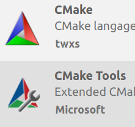
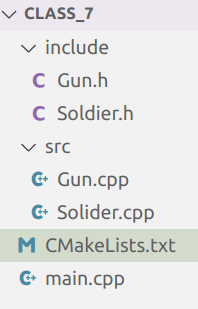
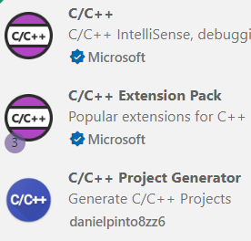
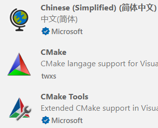
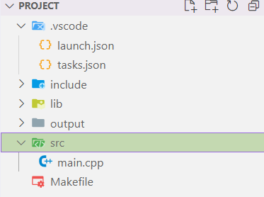
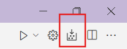
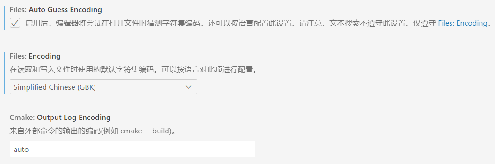
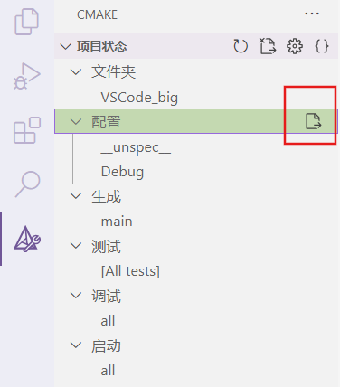
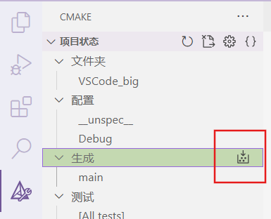

#### 1.CMake语法

基本语法格式：指令(参数 1 参数 2...)
参数之间使用空格或分号分开
指令不分大小写，参数分大小写，变量使用${}方式取值

```cmake
# CMake最小版本要求为2.8.3
cmake_minimum_required(VERSION 2.8.3)
# 指定工程名为HELLOWORLD
project(HELLOWORLD)
# 定义SRC变量，其值为sayhello.cpp hello.cpp
set(SRC sayhello.cpp hello.cpp)
# 将/usr/include/myincludefolder 和 ./include 添加到头文件搜索路径
include_directories(/usr/include/myincludefolder ./include)
# 将/usr/lib/mylibfolder 和 ./lib 添加到库文件搜索路径
link_directories(/usr/lib/mylibfolder ./lib)
# 通过变量 SRC 生成 libhello.so 共享库
#语法： add_library(libname [SHARED|STATIC] source1 source2 ... sourceN)
add_library(hello SHARED ${SRC})
# 添加编译参数 -Wall -std=c++11 -o2
add_compile_options(-Wall -std=c++11 -o2)
# 编译参数 
-g 编译带调试信息的可执行文件， -Wall 打印警告信息
-O2优化源代码， -w 关闭警告信息， -std=c++11 设置编译标准
-o 指定输出文件名
# 编译main.cpp生成可执行文件main
add_executable(main main.cpp)
# 将hello动态库文件链接到可执行文件main
target_link_libraries(main hello)
# 添加src子目录
add_subdirectory(src)
#发现一个目录下所有的源代码文件并将列表存储在一个变量中
# 定义SRC变量，其值为当前目录下所有的源代码文件
aux_source_directory(. SRC)
# 编译SRC变量所代表的源代码文件，生成main可执行文件
add_executable(main ${SRC})
```

* CMake常用变量

```cmake
CMAKE_C_FLAGS  		#gcc编译选项，编译C语言
CMAKE_CXX_FLAGS 	#g++编译选项，编译C++
# 在CMAKE_CXX_FLAGS编译选项后追加-std=c++11
set( CMAKE_CXX_FLAGS "${CMAKE_CXX_FLAGS} -std=c++11")
# 设定编译类型为debug，调试时需要选择debug
set(CMAKE_BUILD_TYPE Debug)
# 设定编译类型为release，发布时需要选择release
set(CMAKE_BUILD_TYPE Release)
#设定C编译器类型
set(CMAKE_C_COMPILER  gcc)
#设定C++编译器类型
set(CMAKE_CXX_COMPILER  g++)
#设定可执行文件输出的存放路径
set(EXECUTABLE_OUTPUT_PATHR  ./exe)
#设定库文件输出的存放路径
set(LIBRARY_OUTPUT_PATH  ./library)
CMAKE_SOURCE_DIR     当前文件夹的最顶层目录，也就是工作空间目录
```

#### 2.VScode实现（linux）

安装拓展，新建CMakeLists.txt文件，注意大写和s，否则报错。

```cmake
#写CMake指令
cmake_minimum_required(VERSION 3.0)		#版本号
project(SOLIDERFIRE)		#项目名称
set(CMAKE_CXX_FLAGS "${CMAKE_CXX_FLAGS} -Wall")		#编译时显示警告，选择g++编译器
set(CMAKE_BUILD_TYPE Debug)		#可执行文件设为可调试版本
include_directories(${CMAKE_SOURCE_DIR}/include)	#头文件路径
add_executable(my_cmake_exe main.cpp src/Gun.cpp src/Solider.cpp)		#生成可执行文件
```

ctrl+`,打开终端

```shell
#创建存放cmake生成文件的目录
book@100ask:~$ mkdir build
book@100ask:~Class_7$ cd build
#在源文件目录中执行cmake命令
book@100ask:~/build$ cmake ..
-- Build files have been written to: /home/book/build
#执行makefile命令
book@100ask:~/build$ make
[100%] Built target my_cmake_exe
```

**代码调试**

点击调试按钮，创建launch.json文件，选择C++(GDB启动)，点击屏幕右下角添加配置，选择C++(GDB启动)，修改代码为：

```json
{
    "version": "0.2.0",
    "configurations": [
        {
            "name": "(gdb) 启动",
            "type": "cppdbg",
            "request": "launch",
            "program": "${workspaceFolder}/build/my_cmake_exe",	//要调试的可执行文件绝对路径
            "args": [],
            "stopAtEntry": false,
            "cwd": "${workspaceFolder}",//目标工作目录，设为当前工作空间
            "environment": [],
            "externalConsole": false,
            "MIMode": "gdb",
            "setupCommands": [
                {
                    "description": "为 gdb 启用整齐打印",
                    "text": "-enable-pretty-printing",
                    "ignoreFailures": true
                }
            ]
        }
    ]
}
```

#### 3.VScode实现（win）

##### 1.安装插件

ctrl+shift+p  打开搜索栏，输入creat c++ project，并点击，出现：



##### 2.修改.vscode配置文件

###### launch.json

```json
{
    //调试程序
    "version": "0.2.0",
    "configurations": [
        {
            "name": "(gdb) 启动",
            "type": "cppdbg",
            "request": "launch",
            "program": "${workspaceFolder}/output/main.exe",//待调试文件
            //${fileBasenameNoExtension}：不带扩展名的文件名，文件名是main函数对应的那个文件
            "args": [],
            "stopAtEntry": false,
            "cwd": "${workspaceFolder}",//此程序的工作目录为  当前工作空间 而不是workFolder
            //${fileDirname}：文件目录的名字，launch.json 对应的目录名就是 .vscode
            "environment": [],
            "externalConsole": false,
            "MIMode": "gdb",
            "miDebuggerPath": "C:\\Users\\ASUS\\AppData\\Local\\Programs\\mingw64\\bin\\gdb.exe", //调试器
            "setupCommands": [
                {
                    "description": "为 gdb 启用整齐打印",
                    "text": "-enable-pretty-printing",
                    "ignoreFailures": true
                },
                {
                    "description": "将反汇编风格设置为 Intel",
                    "text": "-gdb-set disassembly-flavor intel",
                    "ignoreFailures": true
                }
            ],
            "preLaunchTask": "Build"//调试前的任务：编译
        }
    ]
}
```

###### tasks.json

```json
{   
    "version": "2.0.0",
    "options": {
        "cwd": "${workspaceFolder}/build"		//cd .\build
    },
    "tasks": [
        {
            "type": "shell",
            "label": "cmake",
            "command": "cmake",
            "args": [
                ".."
            ],
        },
        {
            "label": "make",
            "group": {
                "kind": "build",
                "isDefault": true
            },
            "command": "mingw32-make.exe",
            "args": [
            ],
        },
        {
            "label": "Build",//编译
            "dependsOn":[		//依赖于 cmake 和 make
                "cmake",
                "make"
            ]
        }
    ],
}
```

###### 添加  settings.json

```json
{
    //指定cmake解释器
    "cmake.generator": "MinGW Makefiles"
}
```

##### **3.写源代码**

main.cpp

```c++
#include <iostream>
#include "swap.h"
using namespace std;

int main(int argc,char **argv)
{
    int val1 = 10;
    int val2 = 20;

    cout << "交换前: " << "val1= " << val1 << " val2= " << val2 << endl;
    swap(val1,val2);
    cout << "交换后: " << "val1= " << val1 << " val2= " << val2 << endl;

    return 0;
}
```

swap.h

```c++
void swap(int &a,int &b);
```

swap.cpp

```cpp
#include "swap.h"
void swap(int &a,int &b)
{
    int temp;
    temp = a;
    a = b;
    b = temp;
}
```

##### **4.写CMakeLists.txt**

```cmake
cmake_minimum_required(VERSION 2.8.3)   #cmake最低版本
project(PROJECT)		#项目名称

aux_source_directory(./src SRC_SUB) #子目录中的源文件，赋值给SRC_SUB
aux_source_directory(. SRC_CUR) #当前目录下的源文件，赋值给SRC_CUR

include_directories(./include)    #头文件目录
link_directories(./lib)     #库文件目录

set(CMAKE_BUILD_TYPE Debug)		#可执行文件设为可调试版本
add_executable(main ${SRC_SUB} ${SRC_CUR}) #输出可执行文件
```

##### **5.命令行实现**cmake

```powershell
mkdir build
cd .\build
cmake -G "MinGW Makefiles" ..  #如果运行cmake ..  ,由于安装了vs，会运行微软的cmake，会报错
#只要运行一次，后面用cmake .. 代替，生成makefile
mingw32-make.exe  #make，执行makefile文件
```

##### 6.ctal+shift+p  搜索 cmake配置

点击后，自动创建build文件夹，自动cmake

或者点击：

后面无需用命令行，直接用快捷键cmake即可

程序打断点后，按F5进行调试

##### 7.注意

复制创建新文件时，不要用中文名，程序名也不要用中文，要删除build文件，重新camke，

终端清屏不完全，不能输出中文txt文字；开启外部小黑窗终端，launch.json中，"externalConsole": true,

防止窗口关闭，程序中加命令：system("pause");

终端输出中文乱码，设置搜索coding，将设置改成：



##### 8.图标 操作

创建build文件，相当于执行cmake命令，但不生成exe文件

构建所有项目按钮，生成exe文件

最下面的提示栏；生成：生成build文件；

甲壳虫：调试exe文件，用的是vscode自己的终端，中文乱码，不建议用，直接F5就行

三角形：运行exe文件，不过生成的txt文件放在build文件夹，和f5模式不一样，也不建议用

#### 4.单个文件运行

新建c++文件，点击右上角齿轮图标，自动生成配置文件，然后修改配置文件

launch.json

```json
{
    "configurations": [
        {
            "name": "C/C++: g++.exe 生成和调试活动文件",
            "type": "cppdbg",
            "request": "launch",
            "program": "${fileDirname}\\.vscode\\a.exe",	//改这里！！！！
            "args": [],
            "stopAtEntry": false,
            "cwd": "${fileDirname}",
            "environment": [],
            "externalConsole": false,
            "MIMode": "gdb",
            "miDebuggerPath": "C:\\Users\\ASUS\\AppData\\Local\\Programs\\mingw64\\bin\\gdb.exe",
            "setupCommands": [
                {
                    "description": "为 gdb 启用整齐打印",
                    "text": "-enable-pretty-printing",
                    "ignoreFailures": true
                },
                {
                    "description": "将反汇编风格设置为 Intel",
                    "text": "-gdb-set disassembly-flavor intel",
                    "ignoreFailures": true
                }
            ],
            "preLaunchTask": "C/C++: g++.exe 生成活动文件"
        }
    ],
    "version": "2.0.0"
}
```

tasks.json

```json
{
    "tasks": [
        {
            "type": "cppbuild",
            "label": "C/C++: g++.exe 生成活动文件",
            "command": "C:\\Users\\ASUS\\AppData\\Local\\Programs\\mingw64\\bin\\g++.exe",
            "args": [
                "-fdiagnostics-color=always",
                "-g",
                "${file}",
                "-o",
                "${fileDirname}\\.vscode\\a.exe"	//改这里！！！！
            ],
            "options": {
                "cwd": "${fileDirname}"
            },
            "problemMatcher": [
                "$gcc"
            ],
            "group": "build",
            "detail": "调试器生成的任务。"
        }
    ],
    "version": "2.0.0"
}
```

回到单个源文件，按F5，即可执行

注意！如果文件名是中文则不能打断点调试。

#### 5.win和linux程序区别

程序暂停和清屏不一样

程序暂停：system("pause")，linux中改为

```c++
cout << "按任意键继续..." << endl;
cin.ignore(); // 清除输入缓冲区
cin.get(); // 等待用户输入
```

清屏：system("cls")；linux中改为system("clear")；