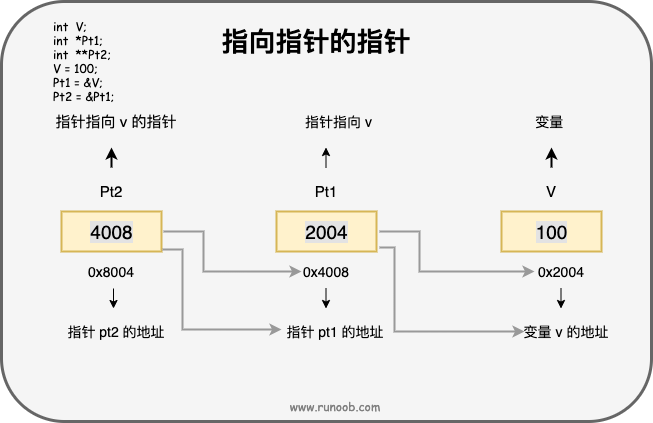

# 基本语法

```c
#include <stdio.h>   // 头文件包含

#define PI 3.14159    // 宏定义

// 函数声明
int add(int a, int b);

int main() {         // 主函数
    // 变量声明
    int num1, num2, sum;

    // 用户输入
    printf("Enter two integers: ");
    scanf("%d %d", &num1, &num2);

    // 函数调用
    sum = add(num1, num2);

    // 输出结果
    printf("Sum: %d\n", sum);

    return 0;        // 返回 0 表示程序成功执行
}

// 函数定义
int add(int a, int b) {
    return a + b;
}
```

**标识符**：变量、函数、数组等的名字，由字母、数字和下划线组成，第一个字符不能是数字。

**常量**：固定值，在程序执行期间不会改变。

```c
const int MAX = 100;  // 整型常量
const float PI = 3.14;  // 浮点型常量
const char NEWLINE = '\n';  // 字符常量
```

**字符串字面量**:由双引号括起来的字符序列,末尾会自动添加一个空字符 **\0**。

```c
char greeting[] = "Hello, World!";
```

**关键字**:不能作为常量名、变量名

```c
int	char for ...
```

**空格**:让编译器能识别语句中的某个元素（比如 int）在哪里结束，下一个元素在哪里开始。

```c
int age;
```

```
fruit = apples + oranges;   // 获取水果的总数
//fruit 和 =，或者 = 和 apples 之间的空格字符不是必需的，但为了增强可读性
```

# 数据类型

```c
#include <stdio.h>

int main() {
    int i = 10;
    short s = 20;
    long l = 30;
    long long ll = 40;
    char c = 'A';
    float f = 3.14f;
    double d = 3.14159;
    long double ld = 3.141592653589793238462643383279502884L;

    printf("int: %d\n", i);
    printf("short: %d\n", s);
    printf("long: %ld\n", l);
    printf("long long: %lld\n", ll);
    printf("char: %c (or as int: %d)\n", c, c);
    printf("float: %f\n", f);
    printf("double: %lf\n", d);
    printf("long double: %Lf\n", ld);
    
    return 0;
}
/*
int: 通常为 4 字节
short: 通常为 2 字节
long: 在32位系统上通常为 4 字节，在64位系统上通常为 8 字节
long long: 通常为 8 字节
char: 通常为 1 字节
float: 通常为 4 字节
double: 通常为 8 字节
long double: 可能是 8 字节、16 字节或更大，这取决于编译器和平台
*/
```


| 序号 | 类型与描述                                                   |
| :--- | :----------------------------------------------------------- |
| 1    | **基本数据类型** 它们是算术类型，包括整型（int）、字符型（char）、浮点型（float）和双精度浮点型（double）。 |
| 2    | **枚举类型：** 它们也是算术类型，被用来定义在程序中只能赋予其一定的离散整数值的变量。 |
| 3    | **void 类型：** 类型说明符 *void* 表示没有值的数据类型，通常用于函数返回值。 |
| 4    | **派生类型：** 包括数组类型、指针类型和结构体类型。          |

#### **整数类型**

存储大小：

==一个字节（Byte）==是计算机数据的基本单位，它等于==8比特（bits）==。每个比特可以是0或1，因此一个字节可以表示256（2的8次方）种不同的状态(0~255)

4个字节等于 4 × 8 比特 = 32 比特(0~2^32-1)

在数据存储和传输中，通常使用以下单位来表示字节的大小：

- 1 千字节（KB） = 1,024 字节
- 1 兆字节（MB） = 1,024 KB = 1,048,576 字节
- 1 吉字节（GB） = 1,024 MB = 1,073,741,824 字节

| 类型          | 存储大小                            | 值范围                                               |
| :------------ | :---------------------------------- | :--------------------------------------------------- |
| ==char==,%c   | ==1 字节==                          | ==-128 到 127 或 0 到 255==                          |
| unsigned char | 1 字节                              | 0 到 255                                             |
| signed char   | 1 字节                              | -128 到 127                                          |
| ==int==,%d    | ==2(32位系统）或 4 字节(64位系统)== | -32,768 到 32,767 或 -2,147,483,648 到 2,147,483,647 |
| unsigned int  | 2 或 4 字节                         | 0 到 65,535 或 0 到 4,294,967,295                    |
| short         | 2 字节                              | -32,768 到 32,767                                    |

```c
//获取储存大小
#include <stdio.h>
int main()
{
   printf("int 存储大小 : %d \n", sizeof(int));  
   return 0;
}
```

```c
int 存储大小 : 4 
```

#### **浮点类型**

| 类型         | 存储大小   | 值范围                 | 精度           |
| :----------- | :--------- | :--------------------- | :------------- |
| ==float==,%f | ==4 字节== | 1.2E-38 到 3.4E+38     | ==6 位有效位== |
| double       | 8 字节     | 2.3E-308 到 1.7E+308   | 15 位有效位    |
| long double  | 16 字节    | 3.4E-4932 到 1.1E+4932 | 19 位有效位    |

#### **void类型**

**函数返回为空**： **void exit (int status);**

**函数参数为空**： **int rand(void);**

**指针指向 void**：类型为 void * 的指针代表对象的地址，而不是类型。
例如，内存分配函数 **void \*malloc( size_t size );** 
返回指向 void 的指针，可以转换为任何数据类型。


#### **类型转换**

隐式类型转换

```c
int i = 10;
float f = 3.14;
double d = i + f; // 隐式将int类型转换为double类型
```

显式类型转换

```c
double d = 3.14159;
int i = (int)d; // 显式将double类型转换为int类型
```

# 变量

程序可操作的存储区的名称，数据类型决定了变量存储的大小和布局

#### 变量定义

```c
int age;
float salary;
char grade;
int *ptr;
int    i, j, k;
```

变量初始化

```c
int x = 10;         // 整型变量 x 初始化为 10
float pi = 3.14;    // 浮点型变量 pi 初始化为 3.14
char ch = 'A';      // 字符型变量 ch 初始化为字符 'A'
int d = 3, f = 5;           // 定义并初始化 d 和 f
byte z = 22;                // 定义并初始化 z
```

#### **全局变量**

函数外部定义的变量，全局起作用，默认初始值为零，程序结束释放内存

```c
int globalVar = 10; // 这是一个全局变量

void function() {
    // 在这个函数内部可以访问 globalVar
}

int main() {
    // 在 main 函数内部也可以访问 globalVar
    return 0;
}
```

#### **静态变量**

变量声明前加上`static`关键字来定义，静态变量的值在函数调用之间保持不变，默认初始值为零，具有程序级别的生命周期

定义在函数外部时，它具有全局作用域，但是它的链接属性是内部的，这意味着它只能在本源文件内可见。

定义在函数内部时，它仅在函数内部可见，但是它的生命周期是整个程序的执行过程，即它只在程序开始执行时分配一次内存，并且在程序执行期间不会再次分配和释放。

静态全局变量：

```c
static int staticGlobalVar = 20; // 这是一个具有文件作用域的静态全局变量

void function() {
    // 在这个函数内部可以访问 staticGlobalVar
}

int main() {
    // 在 main 函数内部也可以访问 staticGlobalVar
    return 0;
}

```

静态局部变量:

```c
void function() {
    static int staticLocalVar = 30; // 这是一个静态局部变量
    // 每次调用function时，staticLocalVar的值都会保持上一次调用后的值
}

int main() {
    function(); // staticLocalVar 被初始化为 30
    function(); // staticLocalVar 仍然保持上次的值，不会再次初始化
    return 0;
}

```

**局部变量**：保存在栈中，在函数内部定义的非静态变量，不会自动初始化为默认值，函数解释自动释放内存

**总结：**全局变量和静态变量的默认值为 **0**，字符型变量的默认值为 **\0**，指针变量的默认值为 NULL，而局部变量没有默认值，其初始值是未定义的。


#### 变量声明

变量声明向编译器保证变量以指定的类型和名称存在，这样编译器在不需要知道变量完整细节的情况下也能继续进一步的编译。

变量声明只在编译时有它的意义，在程序连接时编译器需要实际的变量声明。

```c
extern int i; //声明，不是定义
int i; //声明，也是定义
```

**int a** 在声明的时候就已经建立了存储空间

**extern int a** 不需要建立存储空间的，其中变量 **a** 可以在别的文件中定义的

**extern 	外部**

```c
#include <stdio.h>
 
// 函数外定义变量 x 和 y
int x;
int y;
int addtwonum()
{
    // 函数内声明变量 x 和 y 为外部变量
    extern int x;
    extern int y;
    // 给外部变量（全局变量）x 和 y 赋值
    x = 1;
    y = 2;
    return x+y;
}
 
int main()
{
    int result;
    // 调用函数 addtwonum
    result = addtwonum();
    
    printf("result 为: %d",result);
    return 0;
}
```

```c
result 为: 3
```

##### extern 多文件变量调用

addtwonum.c 文件代码：

```c
#include <stdio.h>
/*外部变量声明*/
extern int x ;
extern int y ;
int addtwonum()
{
    return x+y;
}
```

test.c 文件代码：

```c
#include <stdio.h>
  
/*定义两个全局变量*/
int x=1;
int y=2;
int addtwonum();
int main(void)
{
    int result;
    result = addtwonum();
    printf("result 为: %d\n",result);
    return 0;
}
```

编译并执行

```shell
$ gcc addtwonum.c test.c -o main
$ ./main
result 为: 3
```


#### **左值和右值**

**左值（lvalue）：**可以被赋值的值，左值可以出现在赋值号的左边或右边。

```c
int g = 20;		//g为左值，20为右值
```

**右值（rvalue）：**右值是不能对其进行赋值的表达式，右值只能出现在赋值号的右边

```
10 = 20;//不是一个有效的语句，会生成编译时错误
```

# 常量

常量是固定值，在程序执行期间不会改变。这些固定的值，又叫做**字面量**。

#### **整数常量**

0x 或 0X 表示十六进制，0 表示八进制，不带前缀则默认表示十进制。

整数常量也可以带一个后缀，后缀是 U 和 L 的组合，U 表示无符号整数（unsigned），L 表示长整数（long）。后缀可以是大写，也可以是小写，U 和 L 的顺序任意。

```c
212         /* 合法的 */
215u        /* 合法的 */
0xFeeL      /* 合法的 */
078         /* 非法的：8 不是八进制的数字 */
032UU       /* 非法的：不能重复后缀 */
```

```c
85         /* 十进制 */
0213       /* 八进制 */
0x4b       /* 十六进制 */
30         /* 整数 */
30u        /* 无符号整数 */
30l        /* 长整数 */
30ul       /* 无符号长整数 */
```

```c
int myInt = 10;
long myLong = 100000L;
unsigned int myUnsignedInt = 10U;
```

#### **浮点常量**

```c
float myFloat = 3.14f;
double myDouble = 3.14159;
```

#### **字符常量**

```c
char myChar = 'a';
int myAsciiValue = (int) myChar; // 将 myChar 转换为 ASCII 值 97
```

#### 转义字符

| 转义序列 | 含义           |
| :------- | :------------- |
| \\       | \ 字符         |
| \'       | ' 字符         |
| \"       | " 字符         |
| \?       | ? 字符         |
| \a       | 警报铃声       |
| \b       | 退格键         |
| \f       | 换页符         |
| ==\n==   | ==换行符==     |
| \r       | 回车           |
| ==\t==   | ==水平制表符== |
| \v       | 垂直制表符     |

#### **字符串常量**

```c
char myString[] = "Hello, world!"; //系统对字符串常量自动加一个 '\0'
```

#### **定义常量**

 **\#define** 可以在程序中定义一个常量，它在编译时会被替换为其对应的值。

```c
#define PI 3.14159
```

**const** 关键字用于声明一个只读变量，即该变量的值不能在程序运行时修改。

```c
const int MAX_VALUE = 100;//const 声明常量要在一个语句内完成,用大写字母
```

#### **#define 与 const 区别**

\#define 与 const 这两种方式都可以用来定义常量，选择哪种方式取决于具体的需求和编程习惯。通常情况下，==建议使用 const 关键字来定义常量==，因为它具有类型检查和作用域的优势，而 #define 仅进行简单的文本替换，可能会导致一些意外的问题。

\#define 预处理指令和 const 关键字在定义常量时有一些区别：

- 替换机制：==#define是进行简单的文本替换==，而 `const` 是声明一个具有类型的常量。`#define` 定义的常量在编译时会被直接替换为其对应的值，而 ==const 定义的常量在程序运行时会分配内存，并且具有类型信息==。
- 类型检查：==`#define` 不进行类型检查==，因为它只是进行简单的文本替换。而 ==`const`== 定义的常量具有类型信息，编译器可以对其==进行类型检查==。这可以帮助捕获一些潜在的类型错误。
- 作用域：==`#define`== 定义的常量没有作用域限制，它在==定义之后的整个代码中都有效==。而 ==`const` 定义的常量具有块级作用域==，只在其定义所在的作用域内有效。
- 调试和符号表：使用 `#define` 定义的常量在符号表中不会有相应的条目，因为它只是进行文本替换。而使用 `const` 定义的常量会在符号表中有相应的条目，有助于调试和可读性。即调试的时候#define不能看见变量名，而const可以

# 储存类

存储类定义 C 程序中变量/函数的存储位置、生命周期和作用域。

- auto
- register
- static
- extern

#### **auto 存储类**

**auto** 存储类是所有局部变量默认的存储类。

定义在函数中的变量默认为 auto 存储类，这意味着它们在函数开始时被创建，在函数结束时被销毁。

```c
{
   int mount;
   auto int month;
}
//定义了两个带有相同存储类的变量，
//auto 只能用在函数内，即 auto 只能修饰局部变量。
```

#### **register 存储类**

**register** 存储类用于定义存储在寄存器中而不是 RAM 中的局部变量。

> **寄存器**：非常快速的小容量存储，用于CPU内部操作。
>
> **ROM**：（Read-Only Memory）相对较慢的非易失性存储，用于存储固件和启动程序。例如放win系统的c盘
>
> **RAM**：（Random-Access Memory）快速的易失性存储，用于运行程序和数据操作。例如电脑的运行内存

这意味着变量的最大尺寸等于寄存器的大小（通常是一个字），且不能对它应用一元的 '&' 运算符（因为它没有内存位置）。

register 存储类定义存储在寄存器，所以变量的访问速度更快，但是它不能直接取地址，因为它不是存储在 RAM 中的。

在需要频繁访问的变量(比如计数器)上使用 register 存储类可以提高程序的运行速度。

```c
{
   register int  miles;
}
```

#### **static 存储类**

static 修饰的局部变量，在程序运行期间，不会被销毁

static 修饰全局变量，会使变量的作用域限制在声明它的单个.c文件内

静态变量在程序中只被初始化一次，程序运行期间占据一直某块内存，值可以被修改

```c
#include <stdio.h>
 
/* 函数声明 */
void func1(void);
 
static int count=10;        /* 全局变量 - static 是默认的 */
 
int main()
{
  while (count--) {
      func1();
  }
  return 0;
}
 
void func1(void)
{
/* 'thingy' 是 'func1' 的局部变量 - 只初始化一次
 * 每次调用函数 'func1' 'thingy' 值不会被重置。
 */                
  static int thingy=5;
  thingy++;
  printf(" thingy 为 %d ， count 为 %d\n", thingy, count);
}
```

```c
 thingy 为 6 ， count 为 9
 thingy 为 7 ， count 为 8
 thingy 为 8 ， count 为 7
 thingy 为 9 ， count 为 6
 thingy 为 10 ， count 为 5
 thingy 为 11 ， count 为 4
 thingy 为 12 ， count 为 3
 thingy 为 13 ， count 为 2
 thingy 为 14 ， count 为 1
 thingy 为 15 ， count 为 0
```

#### extern 存储类

**extern** 存储类用于定义在其他文件中声明的全局变量或函数。当使用 extern 关键字时，不会为变量分配任何存储空间，而只是指示编译器该变量在其他文件中定义。

**extern** 存储类用于提供一个全局变量的引用，全局变量对所有的程序文件都是可见的。当您使用 **extern** 时，对于无法初始化的变量，会把变量名指向一个之前定义过的存储位置。

当您有多个文件且定义了一个可以在其他文件中使用的全局变量或函数时，可以在其他文件中使用 *extern* 来得到已定义的变量或函数的引用

可以这么理解，*extern* 是用来在另一个文件中声明一个全局变量或函数。

extern 修饰符通常用于当有两个或多个文件共享相同的全局变量或函数的时候

**main.c**

```c
#include <stdio.h>
 
int count ;
extern void write_extern();
 
int main()
{
   count = 5;
   write_extern();
}
```

**support.c**

```c
#include <stdio.h>
 
extern int count;
 
void write_extern(void)
{
   printf("count is %d\n", count);
}
```

```shell
 $ gcc main.c support.c
```

```shell
count is 5
```

# 运算符

a++ 与 ++a 的区别

a++ 后置运算符，先赋值后计算；++a前置运算符，先计算后赋值

#### **位运算符**

位运算符作用于位，并逐位执行操作。&、 | 和 ^（异或） 的真值表如下所示：

 ^（异或）：如果两个相应的位值不同，则结果为 1，否则为 0

| p    | q    | p & q | p \| q | p ^ q |
| :--- | :--- | :---- | :----- | :---- |
| 0    | 0    | 0     | 0      | 0     |
| 0    | 1    | 0     | 1      | 1     |
| 1    | 1    | 1     | 1      | 0     |
| 1    | 0    | 0     | 1      | 1     |

假设如果 A = 60，且 B = 13，现在以二进制格式表示，它们如下所示：

A = 0011 1100

B = 0000 1101

\-----------------

A&B = 0000 1100

A|B = 0011 1101

A^B = 0011 0001

~A = 1100 0011

A << 2 = 1111 0000

A >> 2 = 0000 1111

#### 杂项运算符

| 运算符   | 描述             | 实例                                 |
| :------- | :--------------- | :----------------------------------- |
| sizeof() | 返回变量的大小。 | sizeof(a) 将返回 4，其中 a 是整数。  |
| &        | 返回变量的地址。 | &a; 将给出变量的实际地址。           |
| *        | 指向一个变量。   | *a; 将指向一个变量。                 |
| ? :      | 条件表达式       | 如果条件为真 ? 则值为 X : 否则值为 Y |

#### 运算符优先级

| 类别       | 运算符                            | 结合性   |
| :--------- | :-------------------------------- | :------- |
| 后缀       | () [] -> . ++ - -                 | 从左到右 |
| 一元       | + - ! ~ ++ - - (type)* & sizeof   | 从右到左 |
| 乘除       | * / %                             | 从左到右 |
| 加减       | + -                               | 从左到右 |
| 移位       | << >>                             | 从左到右 |
| 关系       | < <= > >=                         | 从左到右 |
| 相等       | == !=                             | 从左到右 |
| 位与 AND   | &                                 | 从左到右 |
| 位异或 XOR | ^                                 | 从左到右 |
| 位或 OR    | \|                                | 从左到右 |
| 逻辑与 AND | &&                                | 从左到右 |
| 逻辑或 OR  | \|\|                              | 从左到右 |
| 条件       | ?:                                | 从右到左 |
| 赋值       | = += -= *= /= %=>>= <<= &= ^= \|= | 从右到左 |
| 逗号       | ,                                 | 从左到右 |

# 循环

#### while 循环

先判断条件，再执行语句

```c
#include <stdio.h>
 
int main ()
{
   /* 局部变量定义 */
   int a = 10;

   /* while 循环执行 */
   while( a < 20 )
   {
      printf("a 的值： %d\n", a);
      a++;
   }
 
   return 0;
}
```

```c
a 的值： 10
a 的值： 11
a 的值： 12
a 的值： 13
a 的值： 14
a 的值： 15
a 的值： 16
a 的值： 17
a 的值： 18
a 的值： 19
```

#### for 循环

```c
for ( init; condition; increment )
{
   statement(s);
}
/*
1、执行 init ，且只会执行一次
2、判断 condition，如果为真，则执行循环主体statement(s)，否则退出循环
3、执行循环主体statement(s)
4、执行increment
5、判断 condition，如果为真，则执行循环主体statement(s)，否则退出循环
6、继续循环......
*/
```

```c
#include <stdio.h>
 
int main ()
{
   /* for 循环执行 */
   for( int a = 10; a < 20; a = a + 1 )
   {
      printf("a 的值： %d\n", a);
   }
 
   return 0;
}
```

```c
a 的值： 10
a 的值： 11
a 的值： 12
a 的值： 13
a 的值： 14
a 的值： 15
a 的值： 16
a 的值： 17
a 的值： 18
a 的值： 19
```

#### switch	语句

```c
#include <stdio.h>
 
int main ()
{
   /* 局部变量定义 */
   char grade = 'B';
 
   switch(grade)
   {
   case 'A' :
      printf("很棒！\n" );
      break;
   case 'B' :
   case 'C' :
      printf("做得好\n" );
      break;
   case 'D' :
      printf("您通过了\n" );
      break;
   case 'F' :
      printf("最好再试一下\n" );
      break;
   default :
      printf("无效的成绩\n" );
   }
   printf("您的成绩是 %c\n", grade );
 
   return 0;
}
```

```c
做得好
您的成绩是 B
```

#### do while循环

```c
#include <stdio.h>
 
int main ()
{
   /* 局部变量定义 */
   int a = 10;

   /* do 循环执行，在条件被测试之前至少执行一次 */
   do
   {
       printf("a 的值： %d\n", a);
       a = a + 1;
   }while( a < 20 );
 
   return 0;
}
```

```c
a 的值： 10
a 的值： 11
a 的值： 12
a 的值： 13
a 的值： 14
a 的值： 15
a 的值： 16
a 的值： 17
a 的值： 18
a 的值： 19
```

#### 嵌套循环

```c
#include <stdio.h>
int main()
{
    int i=1,j;
    while (i <= 5)
    {
        j=1;
        while (j <= i )
        {
            printf("%d ",j);
            j++;
        }
        printf("\n");
        i++;
    }
    return 0;
}
```

```c
1
1 2
1 2 3
1 2 3 4
1 2 3 4 5
```

#### break 语句

```c
#include <stdio.h>
 
int main ()
{
   /* 局部变量定义 */
   int a = 10;

   /* while 循环执行 */
   while( a < 20 )
   {
      printf("a 的值： %d\n", a);
      a++;
      if( a > 15)
      {
         /* 使用 break 语句终止循环 */
          break;
      }
   }
 
   return 0;
}
```

```c
a 的值： 10
a 的值： 11
a 的值： 12
a 的值： 13
a 的值： 14
a 的值： 15
```

#### continue 语句

```c
#include <stdio.h>
 
int main ()
{
   /* 局部变量定义 */
   int a = 10;

   /* do 循环执行 */
   do
   {
      if( a == 15)
      {
         /* 跳过迭代 */
         a = a + 1;
         continue;
      }
      printf("a 的值： %d\n", a);
      a++;
     
   }while( a < 20 );
 
   return 0;
}
```

```c
a 的值： 10
a 的值： 11
a 的值： 12
a 的值： 13
a 的值： 14
a 的值： 16
a 的值： 17
a 的值： 18
a 的值： 19
```

# 函数

#### 定义函数

```c
返回类型 函数名（形式参数列表）
{
    函数体
}
```

```c
/* 函数返回两个数中较大的那个数 */
int max(int num1, int num2) 
{
   /* 局部变量声明 */
   int result;
 
   if (num1 > num2) {
      result = num1;
   } else {
      result = num2;
   }
   return result; 
}
```

#### 函数声明

告诉编译器函数名称及如何调用函数

```
返回类型 函数名（形式参数列表）;
```

```c
int max(int num1, int num2);
```

当您在一个源文件中定义函数且在另一个文件中调用函数时，函数声明是必需的。

#### 函数调用

```c
#include <stdio.h>
 
/* 函数声明 */
int max(int num1, int num2);
 
int main ()
{
   /* 局部变量定义 */
   int a = 100;
   int b = 200;
   int ret;
 
   /* 调用函数来获取最大值 */
   ret = max(a, b);//这里的a,b是实际参数
 
   printf( "Max value is : %d\n", ret );
 
   return 0;
}
 
/* 函数返回两个数中较大的那个数 */
int max(int num1, int num2) 
{
   /* 局部变量声明 */
   int result;
 
   if (num1 > num2)
      result = num1;
   else
      result = num2;
 
   return result; 
}
```

```c
Max value is : 200		//传值调用，不影响实际参数
```

#### 引用方式调用函数

```c
#include <stdio.h>
 
/* 函数声明 */
void swap(int *x, int *y);
 
int main ()
{
   /* 局部变量定义 */
   int a = 100;
   int b = 200;
 
   printf("交换前，a 的值： %d\n", a );
   printf("交换前，b 的值： %d\n", b );
 
   /* 调用函数来交换值
    * &a 表示指向 a 的指针，即变量 a 的地址 
    * &b 表示指向 b 的指针，即变量 b 的地址 
   */
   swap(&a, &b);
 
   printf("交换后，a 的值： %d\n", a );
   printf("交换后，b 的值： %d\n", b );
 
   return 0;
}

/* 函数定义 */
void swap(int *x, int *y)
{
   int temp;
   temp = *x;    /* 保存地址 x 的值 */
   *x = *y;      /* 把 y 赋值给 x */
   *y = temp;    /* 把 temp 赋值给 y */
  
   return;
}
```

```c
交换前，a 的值： 100
交换前，b 的值： 200
交换后，a 的值： 200
交换后，b 的值： 100
```

# 数组


#### 声明数组

```c
double balance[10];
// balance 是一个可用的数组，可以容纳 10 个类型为 double 的数字。
```

#### 初始化数组

```c
double balance[5] = {1000.0, 2.0, 3.4, 7.0, 50.0};
double balance[] = {1000.0, 2.0, 3.4, 7.0, 50.0};

balance[4] = 50.0;//为索引为 4 的元素赋值
```

#### 访问数组元素

```c
double salary = balance[9];
```

```c
void printArray(int arr[], int size) {
    for (int i = 0; i < size; i++) {
        printf("%d ", arr[i]); // 数组名arr被当作指针使用
    }
}

int main() {
    int myArray[5] = {10, 20, 30, 40, 50};
    printArray(myArray, 5); // 将数组名传递给函数
    return 0;
}
```

#### 获取数组长度

```C
int numbers[] = {1, 2, 3, 4, 5};
int length = sizeof(numbers) / sizeof(numbers[0]);
```

#### 数组名

数组名表示数组的地址，即数组首元素的地址。

```c
int myArray[5] = {10, 20, 30, 40, 50};
int *ptr = &myArray[0]; // 或者直接写作 int *ptr = myArray;
```

#### 二维数组

```c
int x[3][4];//三行四列
```


```c
int a[3][4] = {  
 {0, 1, 2, 3} ,   /*  初始化索引号为 0 的行 */
 {4, 5, 6, 7} ,   /*  初始化索引号为 1 的行 */
 {8, 9, 10, 11}   /*  初始化索引号为 2 的行 */
};
```

#### 数组传递入函数

```c
void myFunction(int *param)
{
.
.
.
}

void myFunction(int param[10])
{
.
.
.
}

void myFunction(int param[])
{
.
.
.
}

int main()
{
    int balance[5] = {1000, 2, 3, 17, 50};
    /* 传递一个指向数组的指针作为参数 */
    myFunction(balance)
}
```

#### 从函数返回数组

C 语言不允许返回一个完整的数组作为函数的参数。

但是，您可以通过指定不带索引的数组名来返回一个指向数组的指针

首先声明返回指针的函数

```c
int * myFunction()
{
.
.
.
}
```

C 不支持在函数外返回局部变量的地址，除非定义局部变量为 **static** 变量。

```c
#include <stdio.h>	//输入输出库
#include <stdlib.h>	//标志库
#include <time.h>	//时间库
/*返回10个随机数*/ 

/* 要生成和返回随机数的函数 */
int * getRandom( )
{
  static int  r[10];
  int i;
 
  /* 设置种子 */
  srand( (unsigned)time( NULL ) );
  for ( i = 0; i < 10; ++i)
  {
     r[i] = rand();
     printf( "r[%d] = %d\n", i, r[i]);
  }
 
  return r;
}
 
/* 要调用上面定义函数的主函数 */
int main ()
{
   /* 一个指向整数的指针 */
   int *p;
   int i;
 
   p = getRandom();
   for ( i = 0; i < 10; i++ )
   {
       printf( "*(p + %d) : %d\n", i, *(p + i));
   }
 
   return 0;
}
```

#### 指向数组的指针

```c
double balance[50];
```

**balance** 是一个指向 &balance[0] 的指针，即数组 balance 的第一个元素的地址。

```c
double *p;
double balance[10];

p = balance;
//把 p 赋值为 balance 的第一个元素的地址
```

*(balance + 4) 是一种访问 balance[4] 数据的合法方式。

```c
#include <stdio.h>
 
int main ()
{
   /* 带有 5 个元素的整型数组 */
   double balance[5] = {1000.0, 2.0, 3.4, 17.0, 50.0};
   double *p;
   int i;
 
   p = balance;
 
   /* 输出数组中每个元素的值 */
   printf( "使用指针的数组值\n");
   for ( i = 0; i < 5; i++ )
   {
       printf("*(p + %d) : %f\n",  i, *(p + i) );
   }
 
   printf( "使用 balance 作为地址的数组值\n");
   for ( i = 0; i < 5; i++ )
   {
       printf("*(balance + %d) : %f\n",  i, *(balance + i) );
   }
 
   return 0;
}
```

#### 静态数组与动态数组

- 静态数组：编译时分配内存，大小固定，储存在栈区；也就是上面学到普通数组
- 动态数组：运行时手动分配内存，大小可变，储存在堆区。

静态数组的生命周期与作用域相关，而动态数组的生命周期由程序员控制。

在使用动态数组时，需要注意合理地分配和释放内存，以避免内存泄漏和访问无效内存的问题。

动态数组是在运行时通过动态内存分配函数（如 **malloc** 和 **calloc**）手动分配内存的数组。

动态数组特点如下：

- 内存分配：动态数组的内存空间在运行时通过动态内存分配函数手动分配，并存储在堆上。需要使用 `malloc`、`calloc` 等函数来申请内存，并使用 `free` 函数来释放内存。
- 大小可变：动态数组的大小在运行时可以根据需要进行调整。可以使用 `realloc` 函数来重新分配内存，并改变数组的大小。
- 生命周期：动态数组的生命周期由程序员控制。需要在使用完数组后手动释放内存，以避免内存泄漏。

```c
int size = 5; // 数组长度
int *array = malloc(size * sizeof(int));

// 使用数组

free(array); // 释放内存
```

# 枚举型

枚举是 C 语言中的一种基本数据类型，用于定义一组具有离散值的常量，它可以让数据更简洁，更易读。

定义一个枚举类型，需要使用 **enum** 关键字，后面跟着枚举类型的名称，以及用大括号 **{}** 括起来的一组枚举常量。每个枚举常量可以用一个标识符来表示，也可以为它们指定一个整数值，如果没有指定，那么默认从 **0** 开始递增。

```c
enum　枚举名　{枚举元素1,枚举元素2,……};
```

定义一周每日代号

```c
#define MON  1
#define TUE  2
#define WED  3
#define THU  4
#define FRI  5
#define SAT  6
#define SUN  7
```

等价于

```c
enum DAY
{
      MON=1, TUE, WED, THU, FRI, SAT, SUN
};
```

```c
enum season {spring, summer=3, autumn, winter};
//没有指定值的枚举元素，其值为前一元素加 1。也就说 spring 的值为 0，
//summer 的值为 3，autumn 的值为 4，winter 的值为 5
```

#### 枚举变量的定义

```c
//1、先定义枚举类型，再定义枚举变量
enum DAY
{
      MON=1, TUE, WED, THU, FRI, SAT, SUN
};
enum DAY day;

//2、定义枚举类型的同时定义枚举变量
enum DAY
{
      MON=1, TUE, WED, THU, FRI, SAT, SUN
} day;

//3、省略枚举名称，直接定义枚举变量
enum
{
      MON=1, TUE, WED, THU, FRI, SAT, SUN
} day;
```

**实例**

```c
#include <stdio.h>
 
enum DAY
{
      MON=1, TUE, WED, THU, FRI, SAT, SUN
};
 
int main()
{
    enum DAY day;
    day = WED;
    printf("%d",day);
    return 0;
}
```

```c
3
```

**枚举型遍历**

```c
#include <stdio.h>
 
enum DAY
{
      MON=1, TUE, WED, THU, FRI, SAT, SUN
} day;
int main()
{
    // 遍历枚举元素,枚举类型必须连续
    for (day = MON; day <= SUN; day++) {
        printf("枚举元素：%d \n", day);
    }
}
```

```c
枚举元素：1 
枚举元素：2 
枚举元素：3 
枚举元素：4 
枚举元素：5 
枚举元素：6 
枚举元素：7
```

# 指针

#### 指针定义

```c
#include <stdio.h>
int main()
{
    int i = 6;
    int *pi;
    pi = &i;
    printf("pi = %d \n",pi);//pi指向的地址  pi = 6422044
    printf("*pi = %d \n",*pi);//pi 指向地址中存放的值  *pi = 6 
    printf("&pi = %d \n",&pi);//pi指针的地址   &pi = 6422032 
    return 0;
}
```

```c
#include <stdio.h>
 
int main ()
{
   int  *ptr = NULL; 
   printf("ptr 的地址是 %p\n", ptr);//ptr 的地址是 0x0
   return 0;
}
```

#### 递减结构体指针

```c
#include <stdio.h>

struct Point {
    int x;
    int y;
};

int main() {
    struct Point points[] = {{1, 2}, {3, 4}, {5, 6}};
    struct Point *ptr = &points[2];  // 指针指向结构体数组的最后一个元素

    printf("初始点: (%d, %d)\n", ptr->x, ptr->y);  // 输出 (5, 6)

    ptr--;  // 递减指针，使其指向前一个结构体
    printf("递减后点: (%d, %d)\n", ptr->x, ptr->y);  // 输出 (3, 4)

    ptr--;  // 再次递减指针
    printf("再次递减后点: (%d, %d)\n", ptr->x, ptr->y);  // 输出 (1, 2)

    return 0;
}
```

```c
初始点: (5, 6)
递减后点: (3, 4)
再次递减后点: (1, 2)
```

#### 指针数组

```c
#include <stdio.h>
 
int main() {
    int num1 = 10, num2 = 20, num3 = 30;
    
    // 声明一个整数指针数组，包含三个指针
    int *ptrArray[3];//数组中的每个元素都是一个指针
    
    // 将指针指向不同的整数变量
    ptrArray[0] = &num1;
    ptrArray[1] = &num2;
    ptrArray[2] = &num3;
    
    // 使用指针数组访问这些整数变量的值
    printf("Value at index 0: %d\n", *ptrArray[0]);
    printf("Value at index 1: %d\n", *ptrArray[1]);
    printf("Value at index 2: %d\n", *ptrArray[2]);
    
    return 0;
}
```

```c
Value at index 0: 10
Value at index 1: 20
Value at index 2: 30
```

**指针数组储存字符串**

```c
#include <stdio.h>
 
const int MAX = 4;
 
int main ()
{
   const char *names[] = {	//指针数组储存字符串
                   "Zara Ali",
                   "Hina Ali",
                   "Nuha Ali",
                   "Sara Ali",
   };
   int i = 0;
 
   for ( i = 0; i < MAX; i++)
   {
      printf("Value of names[%d] = %s\n", i, names[i] );
       //names[i]不需要加*号，内部的元素是字符串数组的首地址
   }
   return 0;
}
```

```c
Value of names[0] = Zara Ali
Value of names[1] = Hina Ali
Value of names[2] = Nuha Ali
Value of names[3] = Sara Ali
```

#### 指向指针的指针

```c
#include <stdio.h>
 
int main ()
{
   int  V;
   int  *Pt1;
   int  **Pt2;
 
   V = 100;
 
   /* 获取 V 的地址 */
   Pt1 = &V;
 
   /* 使用运算符 & 获取 Pt1 的地址 */
   Pt2 = &Pt1;
 
   /* 使用 pptr 获取值 */
   printf("var = %d\n", V );
   printf("Pt1 = %p\n", Pt1 );
   printf("*Pt1 = %d\n", *Pt1 );
    printf("Pt2 = %p\n", Pt2 );
   printf("**Pt2 = %d\n", **Pt2);
 
   return 0;
}
```

```c
var = 100
Pt1 = 0x7ffee2d5e8d8
*Pt1 = 100
Pt2 = 0x7ffee2d5e8d0
**Pt2 = 100
```



#### 函数指针

```c
#include <stdio.h>
 
int max(int x, int y)
{
    return x > y ? x : y;
}
 
int main(void)
{
    /* p 是函数指针 */
    int (* p)(int, int) = & max; // &可以省略
    int a, b, c, d;
 
    printf("请输入三个数字:");
    scanf("%d %d %d", & a, & b, & c);
 
    /* 与直接调用函数等价，d = max(max(a, b), c) */
    d = p(p(a, b), c); 
 
    printf("最大的数字是: %d\n", d);
 
    return 0;
}
```

```c
请输入三个数字:1 2 3
最大的数字是: 3
```

**作为其他函数的参数**

```c
#include <stdlib.h>  
#include <stdio.h>

/*size_t 是一种数据类型，近似于无符号整型，但容量范围一般大于 int 和 unsigned。
这里使用 size_t 是为了保证 arraysize 变量能够有足够大的容量来储存可能大的数组*/
void populate_array(int *array, size_t arraySize, int (*getNextValue)(void))
{
    for (size_t i=0; i<arraySize; i++)
        array[i] = getNextValue();
}
 
// 获取随机值
int getNextRandomValue(void)
{
    return rand();
}
 
int main(void)
{
    int myarray[10];
    /* getNextRandomValue 不能加括号，否则无法编译，
    因为加上括号之后相当于传入此参数时传入了 int , 而不是函数指针*/
    populate_array(myarray, 10, getNextRandomValue);
    for(int i = 0; i < 10; i++) {
        printf("%d ", myarray[i]);
    }
    printf("\n");
    return 0;
}
```

# 字符串


字符串实际上是使用空字符 **\0** 结尾的一维字符数组

```c
char site[7] = {'R', 'U', 'N', 'O', 'O', 'B', '\0'};
//等价于
char site[] = "RUNOOB";
```

#### 字符串操作函数

| 序号 | 函数 & 目的                                                  |
| :--- | :----------------------------------------------------------- |
| 1    | **strcpy(s1, s2);** 复制字符串 s2 到字符串 s1。              |
| 2    | **strcat(s1, s2);** 连接字符串 s2 到字符串 s1 的末尾。       |
| 3    | **strlen(s1);** 返回字符串 s1 的长度。                       |
| 4    | **strcmp(s1, s2);** 如果 s1 和 s2 是相同的，则返回 0；如果 s1<s2 则返回小于 0；如果 s1>s2 则返回大于 0。 |
| 5    | **strchr(s1, ch);** 返回一个指针，指向字符串 s1 中字符 ch 的第一次出现的位置。 |
| 6    | **strstr(s1, s2);** 返回一个指针，指向字符串 s1 中字符串 s2 的第一次出现的位置。 |

```c
#include <stdio.h>
#include <string.h>
 
int main ()
{
   char str1[14] = "runoob";
   char str2[14] = "google";
   char str3[14];
   int  len ;
 
   /* 复制 str1 到 str3 */
   strcpy(str3, str1);
   printf("strcpy( str3, str1) :  %s\n", str3 );
 
   /* 连接 str1 和 str2 */
   strcat( str1, str2);
   printf("strcat( str1, str2):   %s\n", str1 );
 
   /* 连接后，str1 的总长度 */
   len = strlen(str1);
   printf("strlen(str1) :  %d\n", len );
 
   return 0;
}
```

```c
strcpy( str3, str1) :  runoob
strcat( str1, str2):   runoobgoogle
strlen(str1) :  12
```

# 结构体

#### 基本语法

定义1： 常用

```c
typedef struct Books
{
   char  title[50];
   char  author[50];
   char  subject[100];
   int   book_id;
} book;

//实例化
Books book1;
//或者
book book1;
```

定义2：

```c
struct Books
{
   char  title[50];
   char  author[50];
   char  subject[100];
   int   book_id;
} book;

//实例化
struct Books book1;
```

访问结构体成员

```c
#include <stdio.h>
#include <string.h>
 
typedef struct Books
{
   char  title[50];
   char  author[50];
   char  subject[100];
   int   book_id;
};
 
int main( )
{
   struct Books Book1;        /* 声明 Book1，类型为 Books */
   struct Books Book2;        /* 声明 Book2，类型为 Books */
 
   /* Book1 详述 */
   strcpy( Book1.title, "C Programming");
   strcpy( Book1.author, "Nuha Ali"); 
   strcpy( Book1.subject, "C Programming Tutorial");
   Book1.book_id = 6495407;

   /* Book2 详述 */
   strcpy( Book2.title, "Telecom Billing");
   strcpy( Book2.author, "Zara Ali");
   strcpy( Book2.subject, "Telecom Billing Tutorial");
   Book2.book_id = 6495700;
 
   /* 输出 Book1 信息 */
   printf( "Book 1 title : %s\n", Book1.title);
   printf( "Book 1 author : %s\n", Book1.author);
   printf( "Book 1 subject : %s\n", Book1.subject);
   printf( "Book 1 book_id : %d\n", Book1.book_id);

   /* 输出 Book2 信息 */
   printf( "Book 2 title : %s\n", Book2.title);
   printf( "Book 2 author : %s\n", Book2.author);
   printf( "Book 2 subject : %s\n", Book2.subject);
   printf( "Book 2 book_id : %d\n", Book2.book_id);

   return 0;
}
```

```c
Book 1 title : C Programming
Book 1 author : Nuha Ali
Book 1 subject : C Programming Tutorial
Book 1 book_id : 6495407
Book 2 title : Telecom Billing
Book 2 author : Zara Ali
Book 2 subject : Telecom Billing Tutorial
Book 2 book_id : 6495700
```

#### 结构体作为函数参数

```c
#include <stdio.h>
#include <string.h>
 
struct Books
{
   char  title[50];
   char  author[50];
   char  subject[100];
   int   book_id;
};

/* 函数声明 */
void printBook( struct Books book );
int main( )
{
   struct Books Book1;        /* 声明 Book1，类型为 Books */
   struct Books Book2;        /* 声明 Book2，类型为 Books */
 
   /* Book1 详述 */
   strcpy( Book1.title, "C Programming");
   strcpy( Book1.author, "Nuha Ali"); 
   strcpy( Book1.subject, "C Programming Tutorial");
   Book1.book_id = 6495407;

   /* Book2 详述 */
   strcpy( Book2.title, "Telecom Billing");
   strcpy( Book2.author, "Zara Ali");
   strcpy( Book2.subject, "Telecom Billing Tutorial");
   Book2.book_id = 6495700;
 
   /* 输出 Book1 信息 */
   printBook( Book1 );

   /* 输出 Book2 信息 */
   printBook( Book2 );

   return 0;
}
void printBook( struct Books book )
{
   printf( "Book title : %s\n", book.title);
   printf( "Book author : %s\n", book.author);
   printf( "Book subject : %s\n", book.subject);
   printf( "Book book_id : %d\n", book.book_id);
}
```

```c
Book title : C Programming
Book author : Nuha Ali
Book subject : C Programming Tutorial
Book book_id : 6495407
Book title : Telecom Billing
Book author : Zara Ali
Book subject : Telecom Billing Tutorial
Book book_id : 6495700
```

#### 指向结构体的指针

```c
struct Books *struct_pointer;	//声明

struct_pointer = &Book1;		//定义

struct_pointer->title;			//访问成员变量
```

# typedef

使用 **typedef** 来为用户自定义的数据类型取一个新的名字

```c
typedef unsigned char byte;
```

#### typedef vs #define

**#define** 是 C 指令，用于为各种数据类型定义别名，与 **typedef** 类似，但是它们有以下几点不同：

- **typedef** 仅限于为类型定义符号名称
- **#define** 不仅可以为类型定义别名，也能为数值定义别名，比如您可以定义 1 为 ONE。
- **typedef** 是由编译器执行解释的，**#define** 语句是由预编译器进行处理的。

```c
#include <stdio.h>
 
#define TRUE  1
#define FALSE 0
 
int main( )
{
   printf( "TRUE 的值: %d\n", TRUE);
   printf( "FALSE 的值: %d\n", FALSE);
 
   return 0;
}
```

```c
TRUE 的值: 1
FALSE 的值: 0
```

# 输入输出

#### printf() & scanf()函数

```c
#include <stdio.h>
int main( ) {
 
   char str[100];
   int i;
 
   printf( "Enter a value :");
   scanf("%s %d", str, &i);
 
   printf( "\nYou entered: %s %d ", str, i);
   printf("\n");
   return 0;
}
```

```c
$./a.out
Enter a value :runoob 123

You entered: runoob 123 
```

#### getchar() & putchar() 函数

**int getchar(void)** 函数从屏幕读取下一个可用的字符，并把它返回为一个整数。这个函数在同一个时间内只会读取一个单一的字符。您可以在循环内使用这个方法，以便从屏幕上读取多个字符。

**int putchar(int c)** 函数把字符输出到屏幕上，并返回相同的字符。这个函数在同一个时间内只会输出一个单一的字符。您可以在循环内使用这个方法，以便在屏幕上输出多个字符。

```c
#include <stdio.h>
 
int main( )
{
   int c;
 
   printf( "Enter a value :");
   c = getchar( );
 
   printf( "\nYou entered: ");
   putchar( c );
   printf( "\n");
   return 0;
}
```

```shell
$./a.out
Enter a value :runoob

You entered: r
```

#### gets() & puts() 函数

**char \*gets(char \*s)** 函数从 **stdin** 读取一行到 **s** 所指向的缓冲区，直到一个终止符或 EOF。

**int puts(const char \*s)** 函数把字符串 s 和一个尾随的换行符写入到 **stdout**。

```c
#include <stdio.h>
 
int main( )
{
   char str[100];
 
   printf( "Enter a value :");
   gets( str );
 
   printf( "\nYou entered: ");
   puts( str );
   return 0;
}
```

```shell
$./a.out
Enter a value :runoob

You entered: runoob
```


# 头文件

```c
#include <file>	//系统自带头文件
#include "file"	//用户自定义头文件
```

案例

有如下头文件 header.h

```
char *test (void);
```

 *program.c*

```c
int x;
#include "header.h"

int main (void)
{
   puts (test ());
}
```

等价于

```c
int x;
char *test (void);

int main (void)c
{
   puts (test ());
}
```

#### 只引用一次头文件

```c
#ifndef HEADER_FILE		//如果未定义头文件，则定义此头文件；如果定义了，就跳过下面语句，不再定义
#define HEADER_FILE		

the entire header file file

#endif		//结束判断

```

# 链表

数组和链表都可以存放数据，数组的格式如下

| a\[ \] | data |
| ------ | ---- |
| a\[0\] | 1    |
| a\[1\] | 2    |
| a\[2\] | 3    |

```text
然而对于数组来说，删除数组中指定为位置的元素，插入一个元素显得复杂且麻烦。 
人们想出利用一个结构 来使各种操作变得更加方便，这个结构便是链表。
```

## 链表各成分理解

### 1、头文件

头文件需要包含

```c
#include<stdio.h> 
#include<stdlib.h>
```

### 2、定义结构体

需要包含 数据域 和 指针域

数据域：可以是各种数据类型组合一起

指针域：通过指针来使各节点连接在一起，从而快速实现各种操作

```c
typedef struct student
{
    char name[100];
    int age;
    student *next; //也可以规范一点写成struct student *next 
};
```

这就是很简单的单链表的一个节点，可以表示为


在做下一步操作之前，先理解两个操作

### 1、指针访问结构体中的数据。

当定义一个指针指向结构体时，例如：

```c
student stu1={"hjw",18}; //自定义结构体内容
student *p = &stu1;      //指针指向结构体stu1的地址
操作 p->name 或者 p->age 为访问结构体中的数据，若 p->age=19 ，即直接修改了stu1的数据age为19。
```

代码如下

```c
typedef struct student
{
    char name[100];
    int age;
    student *next; //也可以规范一点写成struct student *next 
}student;


int main(void)
{
    student stu1={"hjw",18};
    student *p = &stu1;
    printf("%s,%d\n",p->name,p->age);
    p->age=19;
    printf("%d\n",p->age);
    return 0; 
}
```

运行结果：

```c
hjw,18
19

--------------------------------
Process exited after 0.07111 seconds with return value 0
请按任意键继续. . .
```

### 2、分配储存空间

要想存入一个数据，则需要利用malloc函数来开辟新的空间。

此时你并不知道需要开辟多大的空间。可以直接利用[sizeof函数](https://www.zhihu.com/search?q=sizeof%E5%87%BD%E6%95%B0&search_source=Entity&hybrid_search_source=Entity&hybrid_search_extra=%7B%22sourceType%22%3A%22article%22%2C%22sourceId%22%3A365087630%7D)来确定你所需要的空间大小。

```text
注意：使用malloc函数返回的是void*的指针，所以还需要强制转换为你所需要的类型。
若如上文我们所写的一样，需要强制转换成student*的类型，则如下所示
student *p1;
p1 = (student *)malloc(sizeof(student));
表示：指针 p1 指向 结构体student大小的 内存区域
```

### 3、创立第二个链表节点，并尝试连接起来

由第二点的操作，我们可以定义 两个指针 指向 两个结构体的内存区域 ，并通过这两个指针来进行 数据的修改等操作

```c
先定义两个指针，并指向两个结构体的内存区域。

    student *p1,*p2;
    p1 = (student *)malloc(sizeof(student));
    p2 = (student *)malloc(sizeof(student));
再通过这两个指针进行数据的填充

由于发现给了下标的数组不好赋值，我们可以利用指针字符串的方式定义名字

把char name[100] 修改为 const char *name
即把结构体改为了

typedef struct student
{
    const char *name;
    int age;
    student *next; //也可以规范一点写成struct student *next 
}student;
进行数据填充：

    p1->name = "hjw";
    p1->age= 18 ;
    p2->name = "wjh";
    p2->age = 81;

检测一下是否填充成功  
    printf("%s %d\n",p1->name,p1->age);
    printf("%s %d\n",p2->name,p2->age);


运行结果为
hjw 18
wjh 81

--------------------------------
Process exited after 0.05025 seconds with return value 0
请按任意键继续. . .
```

此时用图表示为


### 再把这两个链表连接在一起


要想做更多操作，则需要把 头链表 以及 尾结点 给记录起来。

```c
student *head;
head = p1;
把头链表 p1 的位置记录给 head 。
p2->next = NULL;
把尾结点给标记为NULL，即进行操作时，可以通过这个终止操作。
```

表示为：


### 利用循环语句，实现多链表的连接

```c
直接上源代码：
#include<stdio.h>
#include<stdlib.h>

typedef struct student
{
    const char *name;
    int age;
    student *next; //也可以规范一点写成struct student *next 
}student;


int main(void)
{
    student *p;
    student *head;
    student *p1,*p2;
    head = 0;
    for(int i=0;i<=5;i++)
    {
        p1 = (student *)malloc(sizeof(student));//p1指向开辟一个内存
        p1->age = i;                            //数据的插入
        if(head == 0)                           //用if条件句判断head是否指向头链表
        {
            head = p1;
            p2 = p1;
        }
        else                                   //head已经标记头链表了
        {
            p2->next = p1;            //p2用来标记上一次的内存，把上一个内存的next指向下一个 
            p2 = p1;                  //p2为下次的连接做准备
        }
        
        /*
if(head == 0): 这个条件检查链表是否为空。在C语言中，0通常表示NULL，
这里head == 0就是检查head指针是否为NULL，即链表是否为空。
如果链表为空（即head是NULL）：
head = p1;: 将新创建的节点p1设置为链表的头部。
p2 = p1;: 同时将p2也指向这个新节点。p2用于跟踪链表的最后一个节点。
如果链表不为空（即head不是NULL）：
p2->next = p1;: 将当前链表的最后一个节点（p2指向的节点）的next指针设置为新的节点p1，
这样就把新节点添加到了链表的末尾。
p2 = p1;: 然后将p2更新为指向新的最后一个节点，即新添加的节点p1。
        */
    }
    p1->next = NULL;
    p = head;                         //p指向头链表，方便操作
    while(p != NULL)
    {
        printf("%d ",p->age);
        p = p->next ;
    }
    return 0; 
}
运行结果：

0 1 2 3 4 5
--------------------------------
Process exited after 0.03945 seconds with return value 0
请按任意键继续. . .
```

## 输入数据并连接链表

```c
输入数据：

    p1 = (student *)malloc(sizeof(student));
    scanf("%s",p1->name);
    scanf("%d",&p1->age)


再设置循环语句，连接链表

    if(head == 0)
    {
        head = p1;
        p2 = p1;
    }
    else
    {
        p2->next = p1;
        p2 = p1;
    }
标记一个变量，使输入数据可以结束循环。

直接上代码：
#include<stdio.h>
#include<stdlib.h>


typedef struct student
{
    char name[20];//改为数组
    int age;
    student *next; //也可以规范一点写成struct student *next 
}student;


int main(void)
{
    student *p;
    student *head;
    student *p1,*p2;
    head = 0;
    char q;


    while(1)
    {
        printf("continue?(y/n)\n");
        scanf("%c",&q);


        if(q=='y')
        {       


            p1 = (student *)malloc(sizeof(student));


            printf("your name:");
            scanf("%s",p1->name);
            printf("age:");
            scanf("%d",&p1->age);
            getchar();


            if(head == 0)
            {
                head = p1;
                p2 = p1 ;
            }
            else
            {
                p2->next = p1;
                p2 = p1;
            }
        }
        else
        {
            break;
        }


    }


    p1->next = NULL;
    p = head;
    printf("%s:%d",p->name,p->age);
    p=p->next;
    printf("%s:%d",p->name,p->age);
    return 0; 
}
```

## 删除链表

```c
三个节点，第一个节点直接连接到第三个节点上，释放第二个链表的内存。 
释放内存的函数为free（）。
free(p2)
```


[原理图](https://www.zhihu.com/search?q=%E5%8E%9F%E7%90%86%E5%9B%BE&search_source=Entity&hybrid_search_source=Entity&hybrid_search_extra=%7B%22sourceType%22%3A%22article%22%2C%22sourceId%22%3A365087630%7D)：


\--------------------------------------------------------------------------------------------------------------------------


___


```c
//删除整个列表
void freeList(Node **head) {
    Node *current = *head;
    Node *next;

    while (current != NULL) {
        next = current->next; // 保存下一个节点的地址
        free(current);        // 释放当前节点
        current = next;       // 移动到下一个节点
    }

    *head = NULL; // 将头指针设置为NULL，避免野指针
}
```

## 查找链表（删除特定的链表）

```text
利用while等循环语句，遍历链表直至查到所需要的数据位置。
```

### 1.通过学号或者年龄等数据查询

```c
例如通过年龄来查询
int a；
scanf("%d",&a);
while(p->age != a )  //当年龄符合要求时，退出循环
{
    p = p->next;   //p循环一次都会向下移动一个链表
}
怎么查询多个同一年龄的人呢？可以改进为：
int a;
scanf("%d",&a);
while(p->age != a || p != NULL)
{
    if(p->age == a)
    {
        printf("%s:%d",p->name,p->age);
    }
    p = p->next;
}
```

### 2.通过数组中的元素查询，例如名字

```text
可以借助关于 字符串 的函数来实现。例如strcmp（）
```

> 字符串比较函数strcmp的比较，两个字符串自左向右逐个字符相比(按ASCII值大小相比较)，直到出现不同的字符或遇’\\0’为止。基本形式为strcmp(str1,str2)，若str1=str2,则返回零，若str1str2，则返回正数。  

```c
char a[20];
scanf("%s",a);
while(!strcmp(a,p->name) || p != NULL)
{
    if(!strcmp(a,p->name))
    {
        printf("%s:%d",p->name,p->age);
    }
    p = p->next;
}
```

# 题目

#### 递归--斐波那契数列

```c
//1 1 2 3 5 8 13
#include<stdio.h>
int fb(int n){
    if (n==0 || n==1){
        return 1;
    }
    return fb(n-1) + fb(n-2);
}

int main()
{
    int n;
    scanf("%d",&n);
    printf("斐波那契数列第%d项是：%d",n,fb(n));
    return 0;
}
```

#### 最大公约数和最小公倍数                                                                                                             

```c
计算104和20的最大公约数：

a = 104, b = 20
最大公约数范围：1~b
i从b开始递减至0，a和b对其取余，直到取余结果为0输出i  
    
最小公倍数：a*b = 最大公约数*最小公倍数
    
104和20的最大公约数：a = 4
104和20的最小公倍数：104 * 20 / 最大公约数 = 520  
```

```c
#include<stdio.h>
//求两个数的最大公约数和最小公倍数
int maxYue(int x,int y){
    //预处理： x>y
    if (y>x)
    {
        int t=x;
        x=y;
        y=t;
    }
    for (int i = y; i >=1; i--)
    {
        if (x%i == 0 && y%i == 0)
        {
            return i;
        }        
    }    
}
int main()
{
    int x,y;
    int maxYue(int x,int y);
    scanf("%d %d",&x,&y);

    int minBei = x*y/maxYue(x,y);
    printf("%d与%d的最大公约数是%d\n",x,y,maxYue(x,y));
    printf("%d与%d的最小公倍数是%d",x,y,minBei);
    return 0;
}
```

#### 数字位数

```c
#include<stdio.h>
//求一个数的位数
int main()
{
    int n;
    int sum = 0;
    scanf("%d",&n);
    while (n != 0)
    {
        n = n/10;
        sum++;
    }
    printf("%d",sum);
    return 0;
}
```

#### 指数

```c
#include<stdio.h>
#include<math.h>
//求指数
int main()
{
    int x,n;
    printf("求x的n次方，分别输出x,n：\n");
    scanf("%d %d",&x,&n);
    printf("%.2f",pow(x,n));
    return 0;
}
```

#### 回文数

```c
#include<stdio.h>
#include<math.h>
//判断回文数 如12321
int main()
{
    int x,y=0,before,last;
    printf("判断回文数，请输入要判断的数：\n");
    scanf("%d",&x);
    before = x;
    while (before != 0)
    {
        last = before%10;   //取得数据的个位
        y=y*10 +last;       //x的个位逐渐向y高位攀升
        before = before/10; //舍弃个位，下次循环取下一位数
    }
    if (x == y){
        printf("%d是回文数",x);
    }
    else{
        printf("%d不是回文数",x);
    }    
    return 0;
}
```

#### 质数(素数)

```c
#include<stdio.h>
#include<math.h>
// 质数（prime number）又称素数，有无限个。
// 质数定义为在大于 1 的自然数中，除了1和它本身以外，不再有其他因数，这样的数称为质数。
// 输出2-100之间(包括2和100)质数
int zhi_shu(int x){
    int flag = 1;//假设x是质数

    if (x <= 1){
        flag = 0;//1不是质数
        return flag;
    }

    for (int i = 2; i <= x/2; i++){
        if (x%i == 0){
            flag = 0;//有因数的不是质数
            break;
        }            
    }
    return flag;
}
int main()
{
    int min,max;
    printf("求区间质数，请输出区间[min,max]：");
    scanf("%d %d",&min,&max);
    for (int i = min; i <= max; i++)
    {
        if(zhi_shu(i)){printf("%d\n",i);}
    }
    
    return 0;
}

```

#### 二进制转十进制

```c
#include<stdio.h>
#include<math.h>
//将二进制数转化为十进制数 
int binaryToTen(int x){
    int last,before = x,sum=0,i=0;
    while (before != 0)
    {
        last = before%10;//取个位
        if (last == 1)
        {
            sum = sum + pow(2,i);
        }            
        before = before/10;
        i++;
    }    
    return sum;
}
int main()
{
    int x;
    printf("二进制转十进制，请输入你要转化的二进制数：\n");
    scanf("%d",&x);
    printf("结果：%d",binaryToTen(x));
    
    return 0;
}
```

#### 十进制转二进制数

```c
#include <stdio.h>

void decimalToBinary(int n) {
    // 定义一个足够大的数组来存储二进制数
    int binaryNum[32];
    int i = 0;
    
    // 将十进制数转换为二进制数
    while (n > 0) {
        binaryNum[i] = n % 2;
        n = n / 2;
        i++;
    }
    
    // 打印二进制数
    printf("二进制数: ");
    for (int j = i - 1; j >= 0; j--) {
        printf("%d", binaryNum[j]);
    }
    printf("\n");
}

int main() {
    int decimalNumber;

    printf("请输入一个十进制数: ");
    scanf("%d", &decimalNumber);

    printf("十进制数 %d 的二进制表示是: \n", decimalNumber);
    decimalToBinary(decimalNumber);

    return 0;
}
```

#### 字符串翻转

```c
#include<stdio.h>
#include<stdio.h>
//字符串翻转
int main()
{
    char str[20];
    int len;
    printf("请输入您要翻转的子字符串\n");
    scanf("%s",str);
    len = strlen(str);
    for (int i = len-1; i >= 0; i--)
    {
        printf("%c",str[i]);
    }    
    return 0;
}
```

#### 数组元素最大值

```c
#include<stdio.h>
//输出数组中的最大值
int main()
{
    int arr[100],n;
    printf("请输入数字元素个数：\n");
    scanf("%d",&n);
    printf("请输入数组：\n");
    for (int i = 0; i < n; i++){
        scanf("%d",&arr[i]);
    }
    //判断最大值
    int max = 0;
    for (int i = 0; i < n; i++){
        max = (arr[i]>max) ? arr[i] :max;
    } 

    printf("最大值：%d",max);
    return 0;       
}
```

#### 指针访问数组元素

```c
#include<stdio.h>
//使用指针访问数组元素
int main()
{
    int arr[100],n;
    printf("请输入数字元素个数：\n");
    scanf("%d",&n);
    printf("请输入数组：\n");
    for (int i = 0; i < n; i++){
        scanf("%d",&arr[i]);
    }
    //指针访问数组元素
    for (int i = 0; i < n; i++){
        printf("%d",*(arr+i));
    } 
    return 0;       
}
```

#### 剔除字符串杂项

```c
#include<stdio.h>
#include<string.h>
//剔除字符串杂项元素
int main()
{
    char c_in[100],c_out[100];
    int len_in;
    int index;
    printf("请输入字符串：\n");
    scanf("%s",c_in);
    len_in = strlen(c_in);
    for (int i = 0; i < len_in; i++)
    {
        //printf("%c",c_in[i]);
        if ((c_in[i]>='a' && c_in[i]<='z') || (c_in[i]>='A' && c_in[i]<='Z'))
        {
            c_out[index] = c_in[i];
            index++;
        }        
    }
    
    for (int i = 0; i < index-1; i++)
    {
        printf("%c",c_out[i]);
    }    
    return 0;       
}
```

#### 连接字符串

```c
#include<stdio.h>
#include<string.h>
//连接字符串strcat(str1,str2),中间用空格隔开
int main()
{
    char str1[100],str2[100];

    printf("请输入字符串1：\n");
    scanf("%s",str1);


    printf("请输入字符串2：\n");
    scanf("%s",str2);
  
    strcat(str1," ");
    strcat(str1,str2);
    printf("%s",str1);
    
    return 0;       
}
```

#### 复制字符串

```c
#include<stdio.h>
#include<string.h>
//复制字符串strcpy(str1,str2)
int main()
{
    char str1[100],str2[100];

    printf("请输入字符串2：\n");
    scanf("%s",str2);

    strcpy(str1,str2);
    printf("字符串1：%s",str1);
    
    return 0;       
}
```

#### 字符串排序

```c
#include<stdio.h>
#include<string.h>
//给字符串按字典顺序排序
//用二维数组存放各条字符串
//先用strcmp(str1,str2)进行比较，然后用冒泡排序法排序
int main()
{
    char str[10][100];//最多存10条字符串，每条字符串最初100个字符
    char temp[100];//冒泡排序存放临时数据
    int n;
    printf("输入要排序的语句条数：");
    scanf("%d",&n);
    printf("请输入你要排序的字符串：\n");
    for (int i = 0; i < n; i++)
    {
        scanf("%s",str[i]);
    }
    
    //冒泡排序
    for (int i = 0; i < n-1; i++)
    {
        for (int j = i+1; j < n; j++)
        {
            if (strcmp(str[i],str[j])>0)
            {
                strcpy(temp,str[i]);
                strcpy(str[i],str[j]);
                strcpy(str[j],temp);                             
            }            
        }        
    }
    
    printf("排序后的字符串：\n");
    for (int i = 0; i < n; i++)
    {
        printf("%s",str[i]);
        printf("\n");
    }
        
    return 0;       
}
```

#### 水仙花数

```c
/*打印出所有的"水仙花数"，所谓"水仙花数"是指一个三位数，其各位数字立方和等于该数本身。
例如：153是一个"水仙花数"，因为153=1的三次方＋5的三次方＋3的三次方。*/
#include <stdio.h>
 
int main() {
    int i, x, y, z;
    
    // 遍历 100 到 999 的数字
    for (i = 100; i < 1000; i++) {
        // 计算各位数字
        x = i % 10;             // 个位
        y = (i / 10) % 10;      // 十位
        z = (i / 100) % 10;     // 百位
 
        // 计算立方和
        int sum = x * x * x + y * y * y + z * z * z;
 
        // 判断是否为水仙花数
        if (i == sum) {
            printf("%d\n", i);
        }
    }
 
    return 0;
}
```

#### 判断字符出现次数

```c
#include <stdio.h>
 
int main(){
    char c;
    int count = 0;
    int space=0;
    int other = 0;
    while ((c = getchar()) != '\n')
    {
        if ((c>='a' && c<='z')||((c>='A' && c<='Z')))
        {
            count++;
        }
        else if (c == ' ')
        {
            space++;
        }
        else{
            other++;
        }        
    }
    printf("count:%d space:%d other:%d",count,space,other);
    return 0;    
}
```

#### s=a+aa+aaa+aaaa+...

```c
#include <stdio.h>
 /*题目：求s=a+aa+aaa+aaaa+aa...a的值，其中a是一个数字。
 例如2+22+222+2222+22222(此时共有5个数相加)，几个数相加有键盘控制。*/
int main(){
    int a,n,s=0,t=0;
    printf("请输入a和项数");
    scanf("%d %d",&a,&n);
    while (n != 0)
    {        
        t+=a;        
        s+=t;
        a=a*10;
        n--;
    }
    printf("%d",s);
    return 0;    
}
```

#### 完美数（所有质因数之和）

```c
#include <stdio.h>
#define MAXNUMBER 1000
//输出1000以内的质因数
int main()
{
    int sum, x, i;
    for(x = 1; x <= MAXNUMBER; x++){
        sum = 0;
        for(i = 1; i <= x/2; i++)
            if(x%i == 0)
                sum += i;
        if(sum == x)
            printf("%d\n", x);
    }
    return 0;
}
```

