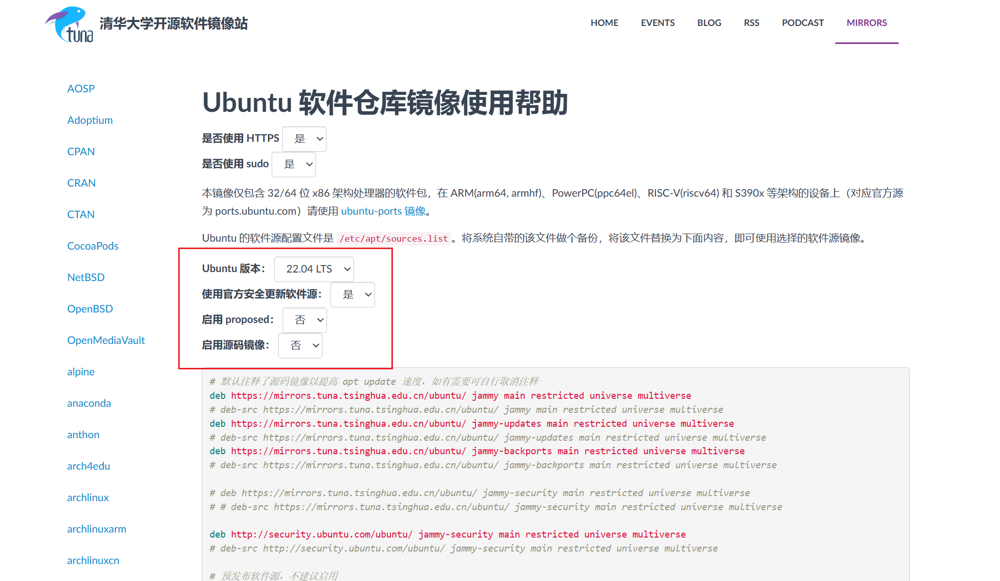
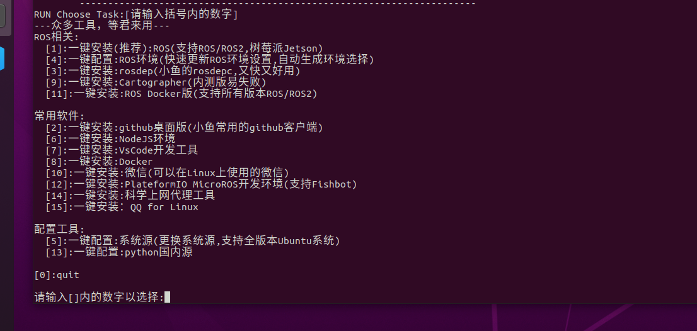
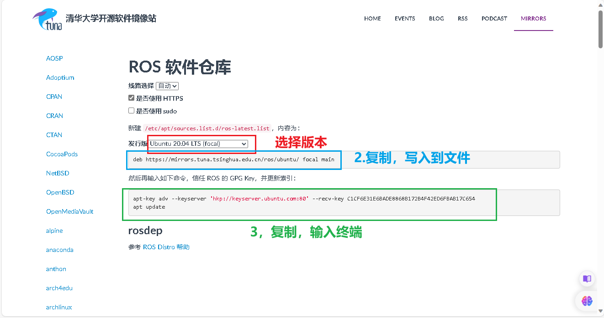

## 1.自动安装ROS

普通安装方式十分繁琐，而且下载链接容易被墙，推荐用国内镜像源结合鱼香ros一键安装!

参考教程网站：<https://azitide.github.io/post/ubuntu_ROS.html>

网址

[清华开源镜像](https://mirrors.tuna.tsinghua.edu.cn/)

### 一、配置软件源

1.首先我们要知道自己的电脑的cpu是什么架构的

**英特尔（intel）一般是x86架构，锐龙（amd）一般是arm架构**，当然英特尔也有amd架构，但在少部分，因为双方都有授权，所以各自都有对方架构的少部分芯片,还有一些小众的架构如PowerPC(ppc64el)、RISC-V(riscv64) 和 S390x 等架构，这些架构的设备用ubuntu-ports镜像的软件源即可

2.进去对应的架构的软件源

- [ubuntu | 镜像站使用帮助 | 清华大学开源软件镜像站 | x86](https://mirrors.tuna.tsinghua.edu.cn/help/ubuntu/)

  与

- [ubuntu-ports | 镜像站使用帮助 | 清华大学开源软件镜像站 | arm](https://mirror.tuna.tsinghua.edu.cn/help/ubuntu-ports/)

3.选择对应的版本

[](https://z1.ax1x.com/2023/10/12/piSM6RP.png)

设置好后，随即文本框中会生成你需要的 **sources.list** 文件内容，一会用到。

然后打开 Ubuntu 的终端，依次输入下面的命令

1、

```none
sudo apt update
```

2、

```none
cp /etc/apt/sources.list ~/Desktop
```

3、

```none
sudo gedit /etc/apt/sources.list
```

三条命令都输完后会打开一个文件内容，

把里面的全删掉，然后复制刚才网页生成的文本框内容粘贴上去，保存文件，退出

### 二、安装ROS

##### 一键安装

这里我们用小鱼的大佬的鱼香ROS 一键安装

打开ubuntu终端，输入：

```none
wget http://fishros.com/install -O fishros && . fishros
```

然后我们输入 **1** 一键安装 –> 不更换源安装 –> 选择你ubuntu版本对应的ros版本 –> 桌面版–> 进行安装

[](https://z1.ax1x.com/2023/10/12/piSMZ80.png)

##### 报错：

如报错，先检查网络原因，如没有问题，先用命令行更换源

```none
wget http://fishros.com/install -O fishros && . fishros
```

然后我们输入 **5** –> 删掉第三方源并更换国内源 –> 添加ros/ros2源–> 完成，重新执行”一键安装“；

##### ros1启动命令

1，然后新建一个终端，打开输入

```none
roscore
```

终端完成后 会显示 \[/rosout\], 这样成功了一半

2，再新建第二个终端，输入

```none
rosrun turtlesim turtlesim_node
```

它会打开一个蓝色屏幕的小乌龟在中间，成功了

3，再建第三个终端，输入：

```none
rosrun turtlesim turtle_teleop_key
```

鼠标要在第三个终端，就可以通过按下键盘的 ↑ ↓ ← →键来对小海龟进行控制了。

安装完成

##### ros2开启命令

ros2没有中心节点，不需要roscore！

1，新建终端

```none
ros2 run turtlesim turtlesim_node
```

2，另外开一个终端

```none
ros2 run turtlesim turtle_teleop_key
```

安装完成

### 三、配置rosdep

这里我们用小鱼的大佬的 一键配置

打开ubuntu终端，输入：

```none
wget http://fishros.com/install -O fishros && . fishros
```

再输入 **3** 就一键配置了

完成

### 四、更新系统环境

这里我们还是用小鱼的大佬的 一键配置

打开ubuntu终端，输入：

```none
wget http://fishros.com/install -O fishros && . fishros
```

再输入 **4** 就一键配置了

完成

到这里，我们的ROS已经安装完成，加油！

## 2.手动安装ROS

参考网址：[ubuntu系统安装ROS（手动版） (azitide.github.io)](https://azitide.github.io/post/ubuntu_ROS_shoudong.html)

### 1.确认自己的ubuntu系统然后去确认ROS版本

| **Ubuntu** | **ROS1**   | 开始 | 维护到期 |
| ---------- | ---------- | ---- | -------- |
| 14.04 LTS  | indigo     | 2014 | 2019     |
| 16.04 LTS  | Kinetic    | 2016 | 2021     |
| 18.04 LTS  | Melodic    | 2018 | 2023     |
| 20.04 LTS  | **Noetic** | 2020 | 2025     |

与

| **Ubuntu** | **ROS2**            | 开始 | 维护到期 |
| ---------- | ------------------- | ---- | -------- |
| 20.04 LTS  | Foxy Fitzroy        | 2020 | 2023     |
| 20.04 LTS  | Galactic Geochelone | 2021 | 2022     |

| 20.04 LTS  
22.04 LTS | **Humble Hawksbill  
(Recommended)** | 2022 | 2027 |
| 22.04 LTS | **Iron Irwini** | 2023 | 2024 |

### 2、更换源

（1）进去源网站

- [ros | 镜像站使用帮助 | 清华大学开源软件镜像站](https://mirror.tuna.tsinghua.edu.cn/help/ros/)

  与

- [ros2 | 镜像站使用帮助 | 清华大学开源软件镜像站](https://mirror.tuna.tsinghua.edu.cn/help/ros2/)

[](https://s11.ax1x.com/2023/12/31/piOhzlQ.png)

（2）打开**ubuntu终端**，输入命令行打开文件

```none
sudo gedit /etc/apt/sources.list.d/ros-latest.list
```

打开文件后，复制第2步的网址进去（如文件内有其他网址，可以删掉，只留一条）

（3）文件保存退出后，新开一个终端，输入第3步的命令行（注意里面是两条命令行，要分开输入）

### 3、安装ROS本体

格式是：

```none
sudo apt install ros-”ROS版本“-desktop-full
```

以20.04版本的ROS1为例：

```none
sudo apt install ros-noetic-desktop-full
```

以22.04版本的ROS2为例：

```none
sudo apt install ros-Humble-desktop-full
```

### 4、更新rosdep

```none
sudo rosdep init
```

```none
rosdep update
```

### 5、设置环境变量：

格式：

```none
echo "source 《你的ros系统文件setup.sh存放位置》" >> ~/.bashrc
```

以20.04版本的ROS1为例：

```none
echo "source /opt/ros/noetic/setup.bash" >> ~/.bashrc
```

```none
source ~/.bashrc
```

### 6、验证

#### ros1启动命令

分别开**三个终端**依次输入

```none
roscore
```

```none
rosrun turtlesim turtlesim_node
```

```none
rosrun turtlesim turtle_teleop_key
```

鼠标要在第三个终端，就可以通过按下键盘的 ↑ ↓ ← →键来对小海龟进行控制了，动起来便是成功了

#### ros2启动命令

ros2没有中心节点，不需要roscore！

第一个终端

```none
ros2 run turtlesim turtlesim_node
```

第二个终端

```none
ros2 run turtlesim turtle_teleop_key
```

## 3. ros概述与环境搭建

### 1. VScode编译环境配置

### 编写 ROS 程序，在控制台输出文本: Hello World，分别使用 C++ 和 Python 实现。
