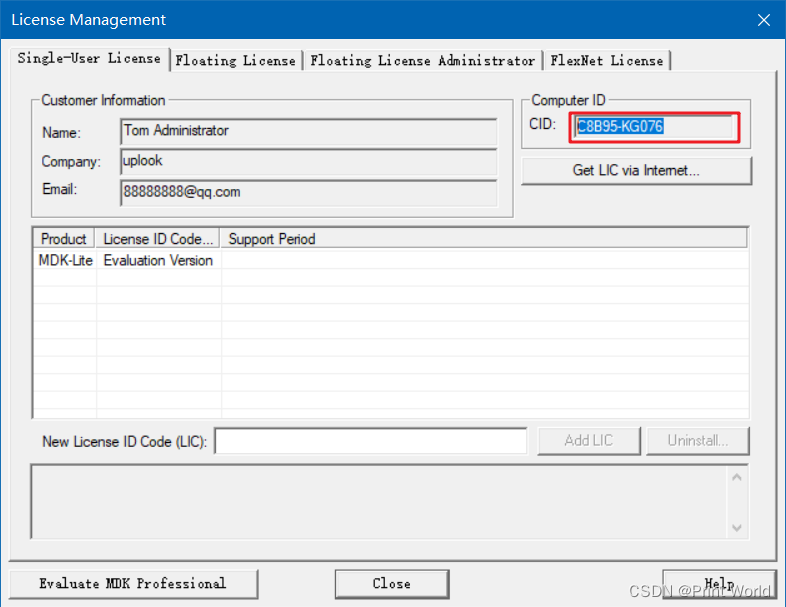
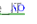

# STM-32

## 1-1 配件介绍

### 01\. 课程简介

-   程序纯手打，手把手教学
-   STM32最小系统板+面包板硬件平台  
    

> 该平台比较适合高校在校大学生学习STM32。

### 02\. 硬件设备

-   STM32最小系统+面包板
-   Windows10操作系统
-   万用表、示波器、镊子、剪刀等  
    

### 03\. 软件工具

[Keil5](https://so.csdn.net/so/search?q=Keil5&spm=1001.2101.3001.7020) MDK  


### 04\. 硬件套件


#### 4.1 面包板和跳线/飞线


#### 4.2 杜邦线和STM32最小系统板


#### 4.3 STLINK和OLED显示屏


#### 4.4 LED和按键


#### 4.5 电位器和蜂鸣器


#### 4.6 传感器和旋转编码器


#### 4.7 USB转串口和MPU6050


#### 4.8 Flash闪存和电机模块


#### 4.9 SG90舵机


### 05\. 配件清单


## 1-2 STM32简介

### 00\. 目录

#### 文章目录

-   -   [00\. 目录](https://blog.csdn.net/u010249597/article/details/134762381#00__0)
    -   [01\. STM32简介](https://blog.csdn.net/u010249597/article/details/134762381#01_STM32_3)
    -   -   [1.1 STM32是什么](https://blog.csdn.net/u010249597/article/details/134762381#11_STM32_11)
        -   [1.2 STM32应用领域](https://blog.csdn.net/u010249597/article/details/134762381#12_STM32_37)
        -   [1.3 STM32命名规则](https://blog.csdn.net/u010249597/article/details/134762381#13_STM32_52)
        -   [1.4 STM32选型](https://blog.csdn.net/u010249597/article/details/134762381#14_STM32_59)
    -   [02\. ARM简介](https://blog.csdn.net/u010249597/article/details/134762381#02_ARM_72)
    -   -   [2.1 ARM是什么](https://blog.csdn.net/u010249597/article/details/134762381#21_ARM_78)
        -   [2.2 ARM系列](https://blog.csdn.net/u010249597/article/details/134762381#22_ARM_86)
    -   [03\. STM32开发板](https://blog.csdn.net/u010249597/article/details/134762381#03_STM32_98)
    -   -   [3.1 MCU简介](https://blog.csdn.net/u010249597/article/details/134762381#31_MCU_100)
        -   [3.2 STM32开发板](https://blog.csdn.net/u010249597/article/details/134762381#32_STM32_117)
        -   [3.3 STM32硬件资源](https://blog.csdn.net/u010249597/article/details/134762381#33_STM32_126)
    -   [04\. STM32系统架构](https://blog.csdn.net/u010249597/article/details/134762381#04_STM32_133)
    -   [05\. STM32引脚定义](https://blog.csdn.net/u010249597/article/details/134762381#05_STM32_155)
    -   [06\. STM32启动配置](https://blog.csdn.net/u010249597/article/details/134762381#06_STM32_183)
    -   [07\. STM32最小系统电路](https://blog.csdn.net/u010249597/article/details/134762381#07_STM32_196)
    -   [08\. 附录](https://blog.csdn.net/u010249597/article/details/134762381#08__203)

### 01\. STM32简介

-   STM32是ST公司基于ARM Cortex-M内核开发的32位微控制器
-   STM32常应用在嵌入式领域，如智能车、无人机、机器人、无线通信、物联网、工业控制、娱乐电子产品等
-   STM32功能强大、性能优异、片上资源丰富、功耗低，是一款经典的嵌入式微控制器

#### 1.1 STM32是什么

STM32是一系列由ST Microelectronics（意法半导体公司）推出的微控制器(MCU)。这些微控制器基于ARM Cortex-M架构，并且提供各种不同的封装和引脚配置。STM32系列中一些受欢迎的微控制器包括STM32F103，STM32F407和STM32F429。 [STM32微控制器](https://so.csdn.net/so/search?q=STM32%E5%BE%AE%E6%8E%A7%E5%88%B6%E5%99%A8&spm=1001.2101.3001.7020)以其低功耗，高性能和广泛的功能而闻名。它们通常用于**物联网设备**，可穿戴技术和其他需要低功耗和高性能的应用。 总体而言，STM32微控制器是许多开发人员的首选，因为它们的多功能性，可靠性和广泛的功能。

> ST：指意法半导体  
> M：指定微处理器  
> 32：表示计算机处理器位数

【官方描述】

> STM32 is a family of microcontrollers from STMicroelectronics, a multinational semiconductor company. STM32 chips are used in a wide range of applications, from simple microcontroller-based projects to complex systems for industrial and automotive use. STM32 chips are based on the ARM Cortex-M architecture and are available in a variety of different packages and pin configurations. Some popular STM32 chips include the STM32F103, STM32F407, and STM32F429 microcontrollers. STM32 chips are known for their low power consumption, high performance, and wide range of features. They are often used in **IoT (Internet of Things)** devices, wearable technology, and other applications where low power consumption and high performance are critical. Overall, STM32 chips are a popular choice for many developers due to their versatility, reliability, and wide range of features.

【MCU】

> **MCU**：微控制器单元（MicroController Unit）：是把中央处理器、存储器、定时/计数器（timer/counter）、各种输入输出接口等都集成在一块集成电路芯片上的微型计算机。

#### 1.2 STM32应用领域

STM32的应用领域包括但不限于：

1.  嵌入式领域：如智能车、无人机、机器人、无线通信、物联网、工业控制、娱乐电子产品、医疗设备、智能家居等。
2.  高速数据采集系统：使用STM32连接高速ADC和FPGA芯片，实现对高速信号的采集和处理，例如高速摄像头、高速激光测距仪等。
3.  自动驾驶控制系统：使用STM32连接多个传感器和执行器，例如摄像头、雷达、电机、电子罗盘等，并通过算法设计和优化，实现自动驾驶控制功能。
4.  机器人视觉系统：使用STM32连接多个摄像头和处理模块，例如OpenCV、CUDA等，并通过算法设计和优化，实现机器人的视觉导航、物体识别等功能。
5.  网络安全嵌入式设备：使用STM32连接加密模块和网络模块，实现网络安全通信和数据加密等功能，例如VPN、防火墙、数据加密存储等。
6.  人工智能嵌入式设备：使用STM32连接AI模块，例如人脸识别、语音识别、自然语言处理等，并通过编程和训练，实现智能化的应用，例如智能门禁、智能家居等。

总的来说，STM32在各个领域都有广泛的应用。

#### 1.3 STM32命名规则


#### 1.4 STM32选型


### 02\. ARM简介

-   ARM既指ARM公司，也指ARM处理器内核
-   ARM公司是全球领先的半导体知识产权（IP）提供商，全世界超过95%的智能手机和平板电脑都采用ARM架构
-   ARM公司设计ARM内核，半导体厂商完善内核周边电路并生产芯片

#### 2.1 ARM是什么

-   ARM既可以认为是一个**公司的名字** ，也可以认为是对**一类处理器的统称** ，还可以认为是**一种技术的名字** 。
-   ARM公司是专门从事基于**RISC技术芯片设计开发** 的公司，作为知识产权供应商，**本身不直接从事芯片生产，而是转让设计许可** ，由合作公司生产各具特色的芯片。
-   **ARM处理器的内核是统一的** ，由ARM公司提供，**而片内部件则是多样的** ，由各大半导体公司设计，这使得**ARM设计嵌入式系统的时候，可以基于同样的核心，使用不同的片内外设** ，从而具有很大的优势。

#### 2.2 ARM系列


### 03\. STM32开发板

#### 3.1 MCU简介


**STM32F103C8T6**

-   系列：主流系列STM32F1
-   内核：ARM Cortex-M3
-   主频：72MHz
-   RAM：20K（SRAM）
-   ROM：64K（Flash）
-   供电：2.0~3.6V（标准3.3V）
-   封装：LQFP48

#### 3.2 STM32开发板

**STM32硬件**：STM32F103C8T6最小系统板


#### 3.3 STM32硬件资源


### 04\. STM32系统架构

在小容量、中容量和 大容量产品中，主系统由以下部分构成：  
● 四个驱动单元：  
─ Cortex™-M3内核DCode总线(D-bus)，和系统总线(S-bus)  
─ 通用DMA1和通用DMA2  
● 四个被动单元  
─ 内部SRAM  
─ 内部闪存存储器  
─ FSMC  
─ AHB到APB的桥(AHB2APBx)，它连接所有的APB设备

这些都是通过一个多级的AHB总线构架相互连接的，如下图所示：


### 05\. STM32引脚定义

引脚图


**STM32F103C8T6引脚定义**  


1.  I = 输入，O = 输出，S = 电源， HiZ = 高阻
2.  FT：容忍5V
3.  可以使用的功能依选定的型号而定。对于具有较少外设模块的型号，始终是包含较小编号的功能模块。例如，某个型号只有1个SPI和2个USART时，它们即是SPI1和USART1及USART2。
4.  PC13，PC14和PC15引脚通过电源开关进行供电，而这个电源开关只能够吸收有限的电流(3mA)。因此这三个引脚作为输出引脚时有以下限制：在同一时间只有一个引脚能作为输出，作为输出脚时只能工作在2MHz模式下，最大驱动负载为30pF，并且不能作为电流源(如驱动LED)。
5.  这些引脚在备份区域第一次上电时处于主功能状态下，之后即使复位，这些引脚的状态由备份区域寄存器控制（这些寄存器不会被主复位系统所复位）。 关于如何控制这些IO口的具体信息，请参考STM32F10xxx参考手册的电池备份区域和BKP寄存器的相关章节。
6.  与LQFP64的封装不同，在TFBGA64封装上没有PC3，但提供了V REF+ 引脚。
7.  此类复用功能能够由软件配置到其他引脚上(如果相应的封装型号有此引脚)，详细信息请参考STM32F10xxx参考手册的复用功能I/O章节和调试设置章节。
8.  VFQFPN36封装的引脚2和引脚3、LQFP48和LQFP64封装的引脚5和引脚6、和TFBGA64封装的C1和C2，在芯片复位后默认配置为OSC\_IN和OSC\_OUT功能脚。软件可以重新设置这两个引脚为PD0和PD1功能。但对于LQFP100/BGA100封装，由于PD0和PD1为固有的功能引脚，因此没有必要再由软件进行重映像设置。更多详细信息请参考STM32F10xxx参考手册的复用功能I/O章节和调试设置章节。在输出模式下，PD0和PD1只能配置为50MHz输出模式。

### 06\. STM32启动配置

在STM32F10xxx里，可以通过BOOT\[1:0\]引脚选择三种不同启动模式。


### 07\. STM32最小系统电路


### 08\. 附录

参考: [【STM32】江科大STM32学习笔记汇总](https://blog.csdn.net/u010249597/article/details/134762513)

## 2-1 软件安装

### 00\. 目录

#### 文章目录

-   -   [00\. 目录](https://blog.csdn.net/u010249597/article/details/134765079#00__0)
    -   [01\. MDK安装](https://blog.csdn.net/u010249597/article/details/134765079#01_MDK_3)
    -   [02\. Keil5注册](https://blog.csdn.net/u010249597/article/details/134765079#02_Keil5_83)
    -   [03\. 支持包安装](https://blog.csdn.net/u010249597/article/details/134765079#03___119)
    -   [04\. ST-LINK驱动安装](https://blog.csdn.net/u010249597/article/details/134765079#04_STLINK_137)
    -   [05\. USB转串口驱动](https://blog.csdn.net/u010249597/article/details/134765079#05_USB_179)
    -   [06\. 附录](https://blog.csdn.net/u010249597/article/details/134765079#06__201)

### 01\. MDK安装

MDK 源自德国的 KEIL 公司，是 RealView MDK 的简称。在全球 MDK 被超过 10 万的[嵌入式开发](https://so.csdn.net/so/search?q=%E5%B5%8C%E5%85%A5%E5%BC%8F%E5%BC%80%E5%8F%91&spm=1001.2101.3001.7020)工程师使用。目前最新版本为：

MDK6，该版本使用 uVision5 IDE 集成开发环境，是目前针对 ARM 处理器，尤其是 Cortex M 内核处理器的最佳开发工具。

[MDK5](https://so.csdn.net/so/search?q=MDK5&spm=1001.2101.3001.7020) 向后兼容 MDK4 和 MDK3 等，以前的项目同样可以在 MDK5 上进行开发(但是头文件方面得全部自己添加)， MDK5 同时加强了针

对 Cortex-M 微控制器开发的支持，并且对传统的开发模式和界面进行升级，MDK5 由两个部分组成：MDK Core 和 Software Packs。其

中，Software Packs 可以独立于工具链进行新芯片支持和中间库的升级。

1.1 双击MDK530.EXE文件，点击Next


1.2 接受许可协议，点击Next  


1.3 选择软件安装路径，点击Next  


1.4 随便填写信息，然后点击Next  


1.5 安装过程中  


1.6 选择安装


1.7 点击Finish  


1.8 全部点击右上角X关掉即可  


1.9 选择是  


至此[Keil MDK](https://so.csdn.net/so/search?q=Keil%20MDK&spm=1001.2101.3001.7020)\-ARM就安装完成，可以新建工程使用了。但为了不受编译代码4K大小限制和用户体验，就需要购买授权，或注册。

### 02\. Keil5注册

2.1 以管理员的方式运行keil软件  


2.2 选择否即可  


2.3 打开注册管理窗口（File -> License Management），并复制CID。  


2.4 打开注册机，执行如下几步。  


2.5 将注册码添加到注册窗口中  


### 03\. 支持包安装

3.1 双击Keil.STM32F1xx\_DFP.2.2.0.pack  


3.2 选择Finishu，完成安装  


### 04\. ST-LINK驱动安装

4.1 默认STM32 STLink是没有驱动的，需要安装驱动  


4.2 找到Keil安装目录下，安装64位驱动

> D:\\Keil\_v5\\ARM\\STLink\\USBDriver  
> 

4.3 选择下一页


4.4 点击完成即可  


4.5 驱动安装好之后，黄色感叹号消失，表示安装成功


### 05\. USB转串口驱动

5.1 双击CH341SER.EXE，点击安装


5.2 点击确定


5.3 安装好驱动之后，通过设备管理器查看如下图所示


### 06\. 附录

参考: [【STM32】江科大STM32学习笔记汇总](https://blog.csdn.net/u010249597/article/details/134762513)

## 2-2  创建工程

### **新建工程**

桌面新建存放STM32项目的文件夹：STM32Project

打开keil5,project,new uVersion Project，新建文件夹  2-2 STM32工程模板，其中新建工程文件Project，保存

选择芯片STM-STM32F1-STM32F103-STM32F103C8。OK，关闭弹出窗口

### **移植固件**

**启动文件**

```python
STM32F10x_StdPeriph_Lib_V3.5.0\Libraries\CMSIS\CM3\DeviceSupport\ST\STM32F10x\startup\arm
```

全选复制启动文件，在2-2 STM32工程模板中新建 Start 文件夹，放入 Start 文件夹

**外设寄存器描述文件、时钟文件**

```python
STM32F10x_StdPeriph_Lib_V3.5.0\Libraries\CMSIS\CM3\DeviceSupport\ST\STM32F10x
stm32f10x.h
system_stm32f10x.c
system_stm32f10x.h
```

复制上面三个文件，放入 Start  文件夹

**内核寄存器描述文件**

```python
STM32F10x_StdPeriph_Lib_V3.5.0\Libraries\CMSIS\CM3\CoreSupport
```

复制两个文件，放入 Start  文件夹

**keil5 添加start文件到工程**


**添加头文件路径**


**主文件**

2-2 STM32工程模板  文件夹中，新建 User 文件夹


**调试器配置**


**基于库函数编程**

2-2 STM32工程模板  文件夹中，新建 Library 文件夹，复制下列文件到 Library 文件夹

```python
STM32F10x_StdPeriph_Lib_V3.5.0\Libraries\STM32F10x_StdPeriph_Driver\src
STM32F10x_StdPeriph_Lib_V3.5.0\Libraries\STM32F10x_StdPeriph_Driver\inc
```

后放入keil5的工程中


**User中放入 头文件配置文件 与 中断文件**

```
STM32F10x_StdPeriph_Lib_V3.5.0\Project\STM32F10x_StdPeriph_Template
stm32f10x_conf.h
stm32f10x_it.c
stm32f10x_it.h
```

keil5工程中添加以上文件


**设置宏定义**


## 2-3 工程编译与下载

main.c

```c
#include "stm32f10x.h"                  // Device header
int main(void)
{
	//点亮PC13端口上的灯
	/*
	PC13由端口GPIOC端口控制，（GPIOC端口管理16个引脚：PC0~PC15）
	首先启动GPIOC时钟，调用RCC_APB2PeriphClockCmd（）函数
	RCC：（Reset and Clock Control）复位与时钟控制
	APB2：GPIOC由这条总线控制
	PeriphClockCmd：使能或禁用外围设备的时钟
	*/
	//周边时钟控制，参数：（外设，状态）
	RCC_APB2PeriphClockCmd(RCC_APB2Periph_GPIOC, ENABLE);
	//配置端口模式
	GPIO_InitTypeDef GPIO_InitStructure;
	GPIO_InitStructure.GPIO_Mode = GPIO_Mode_Out_PP;//通用推挽输出
	GPIO_InitStructure.GPIO_Pin = GPIO_Pin_13;
	GPIO_InitStructure.GPIO_Speed = GPIO_Speed_50MHz;
	GPIO_Init(GPIOC, &GPIO_InitStructure);
	GPIO_SetBits(GPIOC, GPIO_Pin_13);//高电平
	//GPIO_ResetBits(GPIOC, GPIO_Pin_13);//低电平
	while(1)
	{
		
	}
}	
```


### 启动文件型号分类 根据 芯片缩写 选择


```
STM32F10x_StdPeriph_Lib_V3.5.0\Libraries\CMSIS\CM3\DeviceSupport\ST\STM32F10x\startup\arm
```


### 工程结构


**startup文件**

程序执行最基本的文件，复位中断函数：板子上电或复位按钮按下时，进入中断，先进行系统初始化，然后调用main函数

SystemInit函数定义在system_xx.c / .h

另外定义了其他中断，定义在stm32f10x_it.c / .h，达到触发条件后，自动执行

## 3-1GPIO输出

### 01\. [GPIO](https://so.csdn.net/so/search?q=GPIO&spm=1001.2101.3001.7020)简介

-   GPIO（General Purpose Input Output）通用输入输出口
-   可配置为8种输入输出模式
-   引脚电平：0V~3.3V，部分引脚可容忍5V
-   输出模式下可控制端口输出高低电平，用以驱动LED、控制蜂鸣器、模拟通信协议输出时序等
-   输入模式下可读取端口的高低电平或电压，用于读取按键输入、外接模块电平信号输入、ADC电压采集、模拟通信协议接收数据等

每个GPI/O端口有两个32位配置[寄存器](https://so.csdn.net/so/search?q=%E5%AF%84%E5%AD%98%E5%99%A8&spm=1001.2101.3001.7020)(GPIOx\_CRL，GPIOx\_CRH)，两个32位数据寄存器(GPIOx\_IDR和GPIOx\_ODR)，一个32位置位/复位寄存器(GPIOx\_BSRR)，一个16位复位寄存器(GPIOx\_BRR)和一个32位锁定寄存器(GPIOx\_LCKR)。  
根据[数据手册](https://so.csdn.net/so/search?q=%E6%95%B0%E6%8D%AE%E6%89%8B%E5%86%8C&spm=1001.2101.3001.7020)中列出的每个I/O端口的特定硬件特征， GPIO端口的每个位可以由软件分别配置成多种模式。

-   输入浮空
    
-   输入上拉
    
-   输入下拉
    
-   模拟输入
    
-   开漏输出
    
-   推挽式输出
    
-   推挽式复用功能
    
-   开漏复用功能
    

每个I/O端口位可以自由编程，然而I/0端口寄存器必须按32位字被访问(不允许半字或字节访问)。GPIOx\_BSRR和GPIOx\_BRR寄存器允许对任何GPIO寄存器的读/更改的独立访问；这样，在读和更改访问之间产生IRQ时不会发生危险。

### 02\. GPIO基本结构

**系统结构**


**基本结构**


### 03\. GPIO位结构

I/O端口位的基本结构


5伏兼容I/O端口位的基本结构


### 04\. GPIO模式

通过配置GPIO的端口配置寄存器，端口可以配置成以下8种模式


**4种输入模式**：

-   输入浮空
-   输入上拉
-   输入下拉
-   模拟输入

**4种输出模式**：

-   开漏输出
-   开漏复用功能
-   推挽式输出
-   推挽式复用功能

**3种最大翻转速度**:

-   最大输出速度为2MHz
-   最大输出速度为10MHz
-   最大输出速度为50MHz

#### 4.1 输入浮空

输入高为高，输入低为低，无输入漂浮不定。

浮空输入模式下，I/O端口的电平信号直接进入输入数据寄存器。也就是说，I/O的电平状态是不确定的，==完全由外部输入决定==；如果在该引脚悬空（在无信号输入）的情况下，读取该端口的电平是不确定的。所以在要读取外部信号时通常配置IO口为浮空输入模式。  


#### 4.2 输入上拉

**输入高为高，输入低为低，无输入拉高**

上拉输入模式下，I/O端口的电平信号直接进入输入数据寄存器。但是在==I/O端口悬空==（在无信号输入）的情况下，输入端的电平可以保持在==高电平==；并且在==I/O端口输入为低电平==的时候，输入端的电平为==低电平==。


#### 4.3 输入下拉

**输入高为高，输入低为低，无输入拉低**

下拉输入模式下，IO口工作方式刚好和上拉模式相反。I/O端口的电平信号直接进入输入数据寄存器。但是在I/O端口悬空（在无信号输入）的情况下，输入端的电平可以保持在低电平；并且在I/O端口输入为高电平的时候，输入端为高电平。  


#### 4.4 模拟输入

模拟输入模式下，I/O端口的模拟信号（电压信号，而非电平信号）==直接模拟输入到片上外设模块==，比如ADC模块等等。


#### 4.5 开漏输出

p-mos不起作用，输入1时，n-mos关闭，io电平不由单片机控制，由外部电路控制；输入0时，n-mos开启，io电平为低电平

**高电平没有驱动能力，只用低电平驱动能力**

开漏输出模式下，通过设置位设置/清除寄存器或者输出数据寄存器的值，控制MOS管的导通。这里要注意N-MOS管，当设置输出的值为1的时候，N-MOS管处于关闭状态，此时I/O端口的电平就不会由输出的高低电平决定，而是由I/O端口外部的上拉或者下拉决定；当设置输出的值为0的时候，N-MOS管处于开启状态，此时I/O端口的电平就是低电平。同时，I/O端口的电平也可以通过输入电路进行读取；注意，I/O端口的电平不一定是输出的电平。通常使用开漏输出时外部要加一个上拉电阻。


#### 4.6 开漏复用功能

开漏复用输出模式，与开漏输出模式很是类似。只是输出的高低电平的来源，不是让CPU直接写输出数据寄存器，取而代之利用片上外设模块的复用功能输出来决定的。


#### 4.7 推挽式输出

推挽输出模式下，通过设置位设置/清除寄存器或者输出数据寄存器的值，控制P-MOS管和N-MOS管的导通来控制IO口输出高电平还是低电平。这里要注意P-MOS管和N-MOS管，当==设置输出的值为1==的时候，P-MOS管处于开启状态，N-MOS管处于关闭状态，此时==I/O端口==的电平就由P-MOS管决定为==高电平==；当==设置输出的值为0==的时候，P-MOS管处于关闭状态，N-MOS管处于开启状态，此时==I/O端口==的电平就由N-MOS管决定为==低电平==。同时，I/O端口的电平也可以通过输入电路进行读取；注意，此时I/O端口的电平一定是输出的电平。


#### 4.8 推挽式复用功能

推挽复用输出模式，与推挽输出模式很是类似。只是输出的高低电平的来源，不是让CPU直接写输出数据寄存器，取而代之利用片上外设模块的复用功能输出来决定的。


### 05\. LED和蜂鸣器简介

-   LED：发光二极管，正向通电点亮，反向通电不亮
-   有源蜂鸣器：内部自带振荡源，将正负极接上直流电压即可持续发声，频率固定
-   无源蜂鸣器：内部不带振荡源，需要控制器提供振荡脉冲才可发声，调整提供振荡脉冲的频率，可发出不同频率的声音  
    

硬件电路  


### 06\. 面包板


面包板描述


面包板使用示例


### 07\. 附录

参考: [【STM32】江科大STM32学习笔记汇总](https://blog.csdn.net/u010249597/article/details/134762513)

## 3-2GPIO相关API

#### 3个时钟外设

声明在rcc.h中

```c
//外设时钟控制函数：第一个参数选择外设，第二个参数选择使能或失能
void RCC_AHBPeriphClockCmd(uint32_t RCC_AHBPeriph, FunctionalState NewState);
void RCC_APB2PeriphClockCmd(uint32_t RCC_APB2Periph, FunctionalState NewState);
void RCC_APB1PeriphClockCmd(uint32_t RCC_APB1Periph, FunctionalState NewState);
```

```c
void RCC_AHBPeriphClockCmd(uint32_t RCC_AHBPeriph, FunctionalState NewState)
/**
  * @brief  Enables or disables the AHB peripheral clock.
  * @param  RCC_AHBPeriph: specifies the AHB peripheral to gates its clock.
  *   
  *   For @b STM32_Connectivity_line_devices, this parameter can be any combination
  *   of the following values:        
  *     @arg RCC_AHBPeriph_DMA1
  *     @arg RCC_AHBPeriph_DMA2
  *     @arg RCC_AHBPeriph_SRAM
  *     @arg RCC_AHBPeriph_FLITF
  *     @arg RCC_AHBPeriph_CRC
  *     @arg RCC_AHBPeriph_OTG_FS    
  *     @arg RCC_AHBPeriph_ETH_MAC   
  *     @arg RCC_AHBPeriph_ETH_MAC_Tx
  *     @arg RCC_AHBPeriph_ETH_MAC_Rx
  * 
  *   For @b other_STM32_devices, this parameter can be any combination of the 
  *   following values:        
  *     @arg RCC_AHBPeriph_DMA1
  *     @arg RCC_AHBPeriph_DMA2
  *     @arg RCC_AHBPeriph_SRAM
  *     @arg RCC_AHBPeriph_FLITF
  *     @arg RCC_AHBPeriph_CRC
  *     @arg RCC_AHBPeriph_FSMC
  *     @arg RCC_AHBPeriph_SDIO
  *   
  * @note SRAM and FLITF clock can be disabled only during sleep mode.
  * @param  NewState: new state of the specified peripheral clock.
  *   This parameter can be: ENABLE or DISABLE.
  * @retval None
  */
```

```c
void RCC_APB2PeriphClockCmd(uint32_t RCC_APB2Periph, FunctionalState NewState)
/**
  * @brief  Enables or disables the High Speed APB (APB2) peripheral clock.
  * @param  RCC_APB2Periph: specifies the APB2 peripheral to gates its clock.
  *   This parameter can be any combination of the following values:
  *     @arg RCC_APB2Periph_AFIO, RCC_APB2Periph_GPIOA, RCC_APB2Periph_GPIOB,
  *          RCC_APB2Periph_GPIOC, RCC_APB2Periph_GPIOD, RCC_APB2Periph_GPIOE,
  *          RCC_APB2Periph_GPIOF, RCC_APB2Periph_GPIOG, RCC_APB2Periph_ADC1,
  *          RCC_APB2Periph_ADC2, RCC_APB2Periph_TIM1, RCC_APB2Periph_SPI1,
  *          RCC_APB2Periph_TIM8, RCC_APB2Periph_USART1, RCC_APB2Periph_ADC3,
  *          RCC_APB2Periph_TIM15, RCC_APB2Periph_TIM16, RCC_APB2Periph_TIM17,
  *          RCC_APB2Periph_TIM9, RCC_APB2Periph_TIM10, RCC_APB2Periph_TIM11     
  * @param  NewState: new state of the specified peripheral clock.
  *   This parameter can be: ENABLE or DISABLE.
  * @retval None
  */
```

```c
void RCC_APB1PeriphClockCmd(uint32_t RCC_APB1Periph, FunctionalState NewState)
/**
  * @brief  Enables or disables the Low Speed APB (APB1) peripheral clock.
  * @param  RCC_APB1Periph: specifies the APB1 peripheral to gates its clock.
  *   This parameter can be any combination of the following values:
  *     @arg RCC_APB1Periph_TIM2, RCC_APB1Periph_TIM3, RCC_APB1Periph_TIM4,
  *          RCC_APB1Periph_TIM5, RCC_APB1Periph_TIM6, RCC_APB1Periph_TIM7,
  *          RCC_APB1Periph_WWDG, RCC_APB1Periph_SPI2, RCC_APB1Periph_SPI3,
  *          RCC_APB1Periph_USART2, RCC_APB1Periph_USART3, RCC_APB1Periph_USART4, 
  *          RCC_APB1Periph_USART5, RCC_APB1Periph_I2C1, RCC_APB1Periph_I2C2,
  *          RCC_APB1Periph_USB, RCC_APB1Periph_CAN1, RCC_APB1Periph_BKP,
  *          RCC_APB1Periph_PWR, RCC_APB1Periph_DAC, RCC_APB1Periph_CEC,
  *          RCC_APB1Periph_TIM12, RCC_APB1Periph_TIM13, RCC_APB1Periph_TIM14
  * @param  NewState: new state of the specified peripheral clock.
  *   This parameter can be: ENABLE or DISABLE.
  * @retval None
  */
```

#### gpio.h库函数

```c
void GPIO_DeInit(GPIO_TypeDef* GPIOx);//复位GPIO，参数GPIOA、GPIOB
void GPIO_AFIODeInit(void);//复位AFIO外设

//重要！gpio初始化函数，用结构体初始化
void GPIO_Init(GPIO_TypeDef* GPIOx, GPIO_InitTypeDef* GPIO_InitStruct);

void GPIO_StructInit(GPIO_InitTypeDef* GPIO_InitStruct);//结构体变量赋一个默认值

/*gpio读取函数*/
//读取单片机外部输入的数据（输入数据寄存器）
uint8_t GPIO_ReadInputDataBit(GPIO_TypeDef* GPIOx, uint16_t GPIO_Pin);//读取某个针脚输入数据
uint16_t GPIO_ReadInputData(GPIO_TypeDef* GPIOx);//读取整个输入数据寄存器（如GPIOA）

//读取单片机自己当前的输出电平（输出数据寄存器）
uint8_t GPIO_ReadOutputDataBit(GPIO_TypeDef* GPIOx, uint16_t GPIO_Pin);//读取某个针脚输输出数据
uint16_t GPIO_ReadOutputData(GPIO_TypeDef* GPIOx);//读取整个输出数据寄存器

/*gpio写入函数*/
void GPIO_SetBits(GPIO_TypeDef* GPIOx, uint16_t GPIO_Pin);//将指定端口设置为高电平
void GPIO_ResetBits(GPIO_TypeDef* GPIOx, uint16_t GPIO_Pin);//将指定端口设置为低电平
//如GPIO_ResetBits(GPIOA,GPIO_Pin_0);

void GPIO_WriteBit(GPIO_TypeDef* GPIOx, uint16_t GPIO_Pin, BitAction BitVal);//根据BitVal设置指定端口电平
//如GPIO_WriteBit(GPIOA,GPIO_Pin_0,Bit_RESET)，设置低电平
//如GPIO_WriteBit(GPIOA,GPIO_Pin_0,Bit_SET)，设置高电平


void GPIO_Write(GPIO_TypeDef* GPIOx, uint16_t PortVal);//对16个端口进行写入操作
//如GPIO_Write(GPIOA, ~0x0001)，设置A0端口为低电平
//如GPIO_Write(GPIOA, 0x0001)，设置A0端口为高电平
```

#### gpio初始化

这里初始化GPIOA，用结构体给初始化函数传参

```c
//首先实例化结构体对象，并初始化
GPIO_InitTypeDef GPIO_InitStructure;

//用.操作列出待初始化属性，右键查看定义，如查看GPIO_Mode，出现：
/*  GPIOMode_TypeDef GPIO_Mode;    /*!< Specifies the operating mode for the selected pins.
                                      This parameter can be a value of @ref GPIOMode_TypeDef */*/
/*ctrl+f查找GPIOMode_TypeDef，gpio的8种工作模式
typedef enum
{ GPIO_Mode_AIN = 0x0,//模拟输入
  GPIO_Mode_IN_FLOATING = 0x04,//浮空输入
  GPIO_Mode_IPD = 0x28,//下拉输入
  GPIO_Mode_IPU = 0x48,//上拉输入
  GPIO_Mode_Out_OD = 0x14,//开漏输出
  GPIO_Mode_Out_PP = 0x10,//推挽输出
  GPIO_Mode_AF_OD = 0x1C,//复用开漏
  GPIO_Mode_AF_PP = 0x18//复用推挽
}GPIOMode_TypeDef;
这里用推挽输出*/                                          
GPIO_InitStructure.GPIO_Mode = GPIO_Mode_Out_PP;//推挽输出
/*右键查看GPIO_Pin定义，选择Class:member，出现
  uint16_t GPIO_Pin;   /*!< Specifies the GPIO pins to be configured.
                       This parameter can be any value of @ref GPIO_pins_define */*/
//ctrl+f 查找GPIO_pins_define，选择GPIO_Pin_0
GPIO_InitStructure.GPIO_Pin = GPIO_Pin_0;

//用同样的方法
GPIO_InitStructure.GPIO_Speed  = GPIO_Speed_50MHz;

GPIO_Init(GPIOA, GPIO_InitStructure);
//此时gpio-A0被设置成以50MHz推挽输出模式
//有8个gpio外设，分别是GPIOA~GPIOG；每个gpio外设可设置16个pin，可用于16个引脚输出输入电平
```

#### dalay函数

点灯文件中新建System文件夹，移入delay.c和delay.h

点击品字箱子，添加工程System，移入delay.c和delay.h

点击魔术棒，C/C++,添加头文件路径

新文件引用延时函数

```c
#include "delay.h"
Delay_ms(500);
```

## 3-3点灯

### 01\. GPIO之LED[电路图](https://so.csdn.net/so/search?q=%E7%94%B5%E8%B7%AF%E5%9B%BE&spm=1001.2101.3001.7020)

电路图示例1


电路图示例2


### 02\. GPIO之LED接线图


### 03\. LED闪烁程序示例

main.c

```c
#include "stm32f10x.h"                  // Device header
#include "delay.h"
int main(void)
{

	RCC_APB2PeriphClockCmd(RCC_APB2Periph_GPIOA,ENABLE);
	
	GPIO_InitTypeDef GPIO_InitStructure;	
	GPIO_InitStructure.GPIO_Mode = GPIO_Mode_Out_PP;
	GPIO_InitStructure.GPIO_Pin = GPIO_Pin_0;
	GPIO_InitStructure.GPIO_Speed  = GPIO_Speed_50MHz;	
	GPIO_Init(GPIOA,&GPIO_InitStructure);
	
	GPIO_WriteBit(GPIOA, GPIO_Pin_0,Bit_SET);
	while(1)
	{
		GPIO_WriteBit(GPIOA, GPIO_Pin_0,Bit_SET);
		Delay_ms(500);
		GPIO_WriteBit(GPIOA, GPIO_Pin_0,Bit_RESET);	
		Delay_ms(500);
	}
}


```

### 04\. LED闪烁程序下载

接线图如下图所示：


点击下载，现象为LED闪烁。

### 05\. LED[流水灯](https://so.csdn.net/so/search?q=%E6%B5%81%E6%B0%B4%E7%81%AF&spm=1001.2101.3001.7020)接线图


### 06\. LED流水灯程序示例

main.c

```c
#include "stm32f10x.h"                  // Device header
#include "delay.h"
int main(void)
{

	RCC_APB2PeriphClockCmd(RCC_APB2Periph_GPIOA,ENABLE);
	
	GPIO_InitTypeDef GPIO_InitStructure;	
	GPIO_InitStructure.GPIO_Mode = GPIO_Mode_Out_PP;
	GPIO_InitStructure.GPIO_Pin = GPIO_Pin_All ;
	GPIO_InitStructure.GPIO_Speed  = GPIO_Speed_50MHz;	
	GPIO_Init(GPIOA,&GPIO_InitStructure);
	
	GPIO_WriteBit(GPIOA, GPIO_Pin_0,Bit_SET);
	while(1)
	{
		/*使用GPIO_Write，同时设置GPIOA所有引脚的高低电平，实现LED流水灯*/
		GPIO_Write(GPIOA, ~0x0001);	//0000 0000 0000 0001，PA0引脚为低电平，其他引脚均为高电平，注意数据有按位取反
		Delay_ms(500);				//延时100ms
		GPIO_Write(GPIOA, ~0x0002);	//0000 0000 0000 0010，PA1引脚为低电平，其他引脚均为高电平
		Delay_ms(500);				//延时100ms
		GPIO_Write(GPIOA, ~0x0004);	//0000 0000 0000 0100，PA2引脚为低电平，其他引脚均为高电平
		Delay_ms(500);				//延时100ms
		GPIO_Write(GPIOA, ~0x0008);	//0000 0000 0000 1000，PA3引脚为低电平，其他引脚均为高电平
		Delay_ms(500);				//延时100ms
		GPIO_Write(GPIOA, ~0x0010);	//0000 0000 0001 0000，PA4引脚为低电平，其他引脚均为高电平
		Delay_ms(500);				//延时100ms
		GPIO_Write(GPIOA, ~0x0020);	//0000 0000 0010 0000，PA5引脚为低电平，其他引脚均为高电平
		Delay_ms(500);				//延时100ms
		GPIO_Write(GPIOA, ~0x0040);	//0000 0000 0100 0000，PA6引脚为低电平，其他引脚均为高电平
		Delay_ms(500);				//延时100ms
		GPIO_Write(GPIOA, ~0x0080);	//0000 0000 1000 0000，PA7引脚为低电平，其他引脚均为高电平
		Delay_ms(500);				//延时100ms
	}
}


```

### 07\. 蜂鸣器接线图


### 08\. 蜂鸣器程序示例

main.c

```c
#include "stm32f10x.h"                  // Device header
#include "delay.h"
int main(void)
{

	RCC_APB2PeriphClockCmd(RCC_APB2Periph_GPIOB,ENABLE);
	
	GPIO_InitTypeDef GPIO_InitStructure;	
	GPIO_InitStructure.GPIO_Mode = GPIO_Mode_Out_PP;
	GPIO_InitStructure.GPIO_Pin = GPIO_Pin_12;
	GPIO_InitStructure.GPIO_Speed  = GPIO_Speed_50MHz;	
	GPIO_Init(GPIOB,&GPIO_InitStructure);
	
	while(1)
	{
		GPIO_WriteBit(GPIOB, GPIO_Pin_12,Bit_SET);
		Delay_ms(500);
		GPIO_WriteBit(GPIOB, GPIO_Pin_12,Bit_RESET);	
		Delay_ms(500);
	}
}


```

## 3-4GPIO输入

**目录**

[按键简介](https://blog.csdn.net/m0_61712829/article/details/132413539#t0)

 [传感器模块简介](https://blog.csdn.net/m0_61712829/article/details/132413539#t1)

[按键和传感器硬件电路](https://blog.csdn.net/m0_61712829/article/details/132413539#t2)

[C语言数据类型](https://blog.csdn.net/m0_61712829/article/details/132413539#t3) 

[C语言宏定义](https://blog.csdn.net/m0_61712829/article/details/132413539#t4)

[C语言typedef](https://blog.csdn.net/m0_61712829/article/details/132413539#t5)

[C语言结构体](https://blog.csdn.net/m0_61712829/article/details/132413539#t6)

[C语言枚举](https://blog.csdn.net/m0_61712829/article/details/132413539#t7)

[其它](https://blog.csdn.net/m0_61712829/article/details/132413539#t8)

[0\. 江协科技/江科大-STM32入门教程-各章节详细笔记-查阅传送门-STM32标准库开发\_stm32江协大 csdn-CSDN博客文章浏览阅读3.4k次，点赞47次，收藏143次。江协科技/江科大-STM32标准库开发-各章节详细笔记-传送门至各个章节笔记。基本上课程讲的每句都详细记录，方便回顾。\_stm32江协大 csdnhttps://blog.csdn.net/m0\_61712829/article/details/132434192?spm=1001.2014.3001.5501](https://blog.csdn.net/m0_61712829/article/details/132434192?spm=1001.2014.3001.5501 "0. 江协科技/江科大-STM32入门教程-各章节详细笔记-查阅传送门-STM32标准库开发_stm32江协大 csdn-CSDN博客")GPIO输入模式硬件以及c语言下面知识点是库函数反复出现的东西，了解后会对库函数的执行逻辑更加清晰明了。另外还有c语言的指针，在后面文章会单独进行阐述。

___

### 按键简介

按键：常见的输入设备，按下导通，松手断开


 按键抖动：由于按键内部使用的是机械式弹簧片来进行通断的，所以在按下和松手的瞬间会伴随有一连串的抖动


###  传感器模块简介

传感器模块：传感器元件（传感器模块就是利用传感器元件，比如如下图的光敏电阻/热敏电阻/红外接收管等）的电阻会随外界模拟量的变化而变化（比如光线越强，光敏电阻的阻值就越小），通过与定值电阻进行**串联分压**即可得到模拟电压输出，再通过电压比较器进行二值化（二值化就是要么是高要么是低）即可得到数字电压输出


 如下为传感器模块的基本电路，详细介绍。


这个N1就是传感器元件所代表的可变电阻，它的阻值可以根据环境的光线、温度等模拟两进行变化

N1上面的R1，是和N1进行分压的定值电阻，R1和N1串联，一端接VCC一端接VSS，这就构成了基本的分压电路，AO电压就由R1和N1两个电阻的分压得到。

AO电压就由R1和N1两个电阻的分压得到。

N1左边的C2是一个滤波电容，它是为了给中间的电压输出进行滤波的，用来滤除一些干扰，保证输出电压波形的平滑。一般我们在电路中遇到一端接到电路中，另一端接地的电容，都可以考虑一下是不是滤波电容的作用，并不是电路的主要框架，这时候我们进行分析电路时，就可以先把这个电容抹掉，这样就可使我们的电路分析更加简单。

二值化输出是通过这个LM393芯片来完成，是一个电压比较器芯片，里面由两个独立的电压比较器电路，然后剩下的是VCC和GND供电，里面电容是一个电源供电的滤波电容，**这个电压比较器其实就是一个运算放大器**，当同向输入端的电压大于反向输入端的电压时，输出就会瞬间升高为最大值也就是输出接VCC；反之当同向输入端的电压小于反向输入端的电压时，输出就会瞬间降为最小值，也就是输出接GND，这样就可以对一个模拟电压进行二值化了，DO就是最后数字电压的输出。


 可以用**上下拉电阻的思维分析传感器电阻的阻值变化对输出电压的影响**，如下：

AO这个输出端可以把它想象成一个水平杆子（下图红色直线），R1上拉电阻相当于拴在上方的弹簧，将杆子向上拉，N1下拉电阻相当于拴在地面的弹簧，将杆子向下拉；电阻的阻值越小，弹簧的拉力就越强，杆子的高度就相当于电路中的电压，杠子向拉力强的一端偏移（取决于两个弹簧的弹力之差）；如果上下弹簧拉力一致，杆子处于居中位置也就是电路输出VCC/2的电压；如果上面的阻值小，拉力强，输出电压就会变高；反之下面的阻值小，输出电压就会变低 ；如果上下拉电阻的阻值都为0，就是两个无穷大的力在对抗，在电路中呈现的就是电源短路（应该避免）。单片机电路中会常出现这种上拉下拉电阻，比如弱上拉，强上拉等（强和弱就是指电阻阻值的大小，也就是这个弹簧拉力大小） ，最终输出电压就是在弹簧拉扯下最终杆子的高低。

 

### 按键和传感器硬件电路

下接按键的方式如下，**一般来说我们用下接按键的方**式，这个原因和LED的接法类似，是电路设计习惯和规范；下左图中，按键按下时，PA0直接下拉到GND，此时读取PA0口的电压就是低电平，在这种接法下，必须要求PA0是上拉输入模式，使按键松下，还是高电平。下右图，外部接了一个上拉电阻，当按键松手时，引脚由于上拉作用，保持为高电平，此时PA0引脚就可以配置为浮空输入或者上拉输入。


上接按键的方式（仅了解）如下，左图1中，要求将PA0必须配置成下拉输入模式，松手时，引脚会回到默认值低电平。   

 

传感器模块电路如下，DO是数字输出端口，PA0用于读取数字量。


### [C语言数据类型](https://so.csdn.net/so/search?q=C%E8%AF%AD%E8%A8%80%E6%95%B0%E6%8D%AE%E7%B1%BB%E5%9E%8B&spm=1001.2101.3001.7020) 

<table><tbody><tr><td><p><strong><span>关键字</span></strong></p></td><td><p><strong><span>位数</span></strong></p></td><td><p><strong><span>表示范围</span></strong></p></td><td><p><strong><span>stdint</span></strong><strong><span>关键字</span></strong></p></td><td><p><strong><span>ST</span></strong><strong><span>关键字</span></strong></p></td><td><p><strong><span>ST</span></strong><strong><span>关键字</span></strong></p></td></tr><tr><td><p><span>char</span></p></td><td><p><span>8</span></p></td><td><p><span>-128&nbsp;~&nbsp;127</span></p></td><td><p><span>int8_t</span></p></td><td><p><span>s8</span></p></td><td><p><span>s8</span></p></td></tr><tr><td><p><span>unsigned&nbsp;char</span></p></td><td><p><span>8</span></p></td><td><p><span>0&nbsp;~&nbsp;255</span></p></td><td><p><span>uint8_t</span></p></td><td><p><span>u8</span></p></td><td><p><span>u8</span></p></td></tr><tr><td><p><span>short</span></p></td><td><p><span>16</span></p></td><td><p><span>-32768&nbsp;~&nbsp;32767</span></p></td><td><p><span>int16_t</span></p></td><td><p><span>s16</span></p></td><td><p><span>s16</span></p></td></tr><tr><td><p><span>unsigned&nbsp;short</span></p></td><td><p><span>16</span></p></td><td><p><span>0&nbsp;~&nbsp;65535</span></p></td><td><p><span>uint16_t</span></p></td><td><p><span>u16</span></p></td><td><p><span>u16</span></p></td></tr><tr><td><p><span>int</span></p></td><td><p><span>32</span></p></td><td><p><span>-2147483648&nbsp;~&nbsp;2147483647</span></p></td><td><p><span>int32_t</span></p></td><td><p><span>s32</span></p></td><td><p><span>s32</span></p></td></tr><tr><td><p><span>unsigned&nbsp;int</span></p></td><td><p><span>32</span></p></td><td><p><span>0&nbsp;~&nbsp;4294967295</span></p></td><td><p><span>uint32_t</span></p></td><td><p><span>u32</span></p></td><td><p><span>u32</span></p></td></tr><tr><td><p><span>long</span></p></td><td><p><span>32</span></p></td><td><p><span>-2147483648&nbsp;~&nbsp;2147483647</span></p></td><td></td><td></td><td></td></tr><tr><td><p><span>unsigned&nbsp;long</span></p></td><td><p><span>32</span></p></td><td><p><span>0&nbsp;~&nbsp;4294967295</span></p></td><td></td><td></td><td></td></tr><tr><td><p><span>long&nbsp;long</span></p></td><td><p><span>64</span></p></td><td><p><span>-(2^64)/2&nbsp;~&nbsp;(2^64)/2-1</span></p></td><td><p><span>int64_t</span></p></td><td></td><td></td></tr><tr><td><p><span>unsigned&nbsp;long&nbsp;long</span></p></td><td><p><span>64</span></p></td><td><p><span>0&nbsp;~&nbsp;(2^64)-1</span></p></td><td><p><span>uint64_t</span></p></td><td></td><td></td></tr><tr><td><p><span>float</span></p></td><td><p><span>32</span></p></td><td><p><span>-3.4e38&nbsp;~&nbsp;3.4e38</span></p></td><td></td><td></td><td></td></tr><tr><td><p><span>double</span></p></td><td><p><span>64</span></p></td><td><p><span>-1.7e308&nbsp;~&nbsp;1.7e308</span></p></td><td></td><td></td><td></td></tr></tbody></table>

单片机中用char也就是int8\_t来存放整数而不是字符等，有一定的区别需要注意。

C语言提供的stdint头文件，使用新的名字。比如int8\_t就是char的新名字，表示的意思就是8位        整型的数据,右边加个\_t 表示这是用typedef重新命名的变量类型。

ST关键字是老版本用的。

### [C语言宏定义](https://so.csdn.net/so/search?q=C%E8%AF%AD%E8%A8%80%E5%AE%8F%E5%AE%9A%E4%B9%89&spm=1001.2101.3001.7020)

**前为新，后为旧**

关键字：#define

用途：用一个字符串代替一个数字，便于理解，防止出错；提取程序中经常出现的参数，便于快速修改

定义宏定义：     #define ABC 12345

引用宏定义：     int a = ABC;    //等效于int a = 12345;

### C语言typedef

**前为旧，后为新**

**typedef只能专门给变量类型换名字，更加安全（不是变量类型的名字是不行的）；所以宏定义的改名范围更宽**       

关键字：typedef

用途：将一个比较长的变量类型名换个名字，便于使用

定义typedef：     typedef unsigned char uint8\_t;

引用typedef：      uint8\_t a;    //等效于unsigned char a;

### C语言结构体

结构体也是一种数据类型，比如char、int等是基本数据类型；数组是由许多相同基本数据类型的组合；与数组一样，但是**若组合不同的数据类型就用结构体**。

关键字：struct

用途：数据打包，不同类型变量的集合

定义结构体变量：struct{char x; int y; float z;} StructName;

StructName是结构体变量的名字

因为结构体变量类型较长，所以通常用typedef更改变量类型名

引用结构体成员：

StructName.x = 'A';   

StructName.y = 66;  

StructName.z = 1.23;

或是用结构体指针方式，因为结构体是一种组合数据类型，在函数之间的数据传递中，通常用的是地址传递而不是值传递（看一下指针教程）

杠大于号，结构体成员名

pStructName->x = 'A';    //pStructName为结构体的地址 

pStructName->y = 66;   

pStructName->z = 1.23;

代码理解，如下

```cobol
struct c；

//定义了一个结构体类型，名字叫c，这是不完整的，还需加一个附加声明{打包的变量}，如下

struct {char x; int y; float z} c；

//定义一个结构体变量，名字叫c，其中包含char型的x，int型的y和float型的z三个子项

c.x = 'a';

c.y = 66;

c.z = 1.23;

//结构体的引用，需写结构体名字c，然后用运算符取索引，索引是结构体子项的名字，如结构体名称.结构体子项
```

 

使用typedef 解决结构体名字太长的问题

```cpp
struct {char x; int y; float z} c；

struct {char x; int y; float z} d；

typedef struct {char x; int y; float z} struct_t;

typedef struct {

char x;

int y;

float z

} struct_t;

struct {

char x;

int y;

float z

}

typedef struct {

char x;

int y;

float z

} struct_t;

struct_t c；

struct_t d；

c.x = 'a';
```

### C语言枚举

和结构体差不多，也是一个数据类型

**只能在它给定的参数列表里赋值，不能赋其它的值**

**枚举值也不是必须赋值给枚举变量的，也可以赋值给随意一个变量。所以说枚举也是一个宏定义的集合。**

关键字：enum

用途：1.定义一个取值受限制的整型变量，用于限制变量取值范围（比如我们定义一个变量用来存储星期的值，理论上这个变量只能取1到7的值，若定义的是整形变量这时可能会出现数据不合法，比如星期8的情况出现，所以这时候需要定义一个**取值受限制的整形变量**，这个变量就是枚举）；2.宏定义的集合

定义枚举变量： 

enum{FALSE = 0, TRUE = 1} EnumName;  （需要用逗号，限制EnumName的取值范围）

因为枚举变量类型较长，所以通常用typedef更改变量类型名：

typedef  enum{FALSE = 0, TRUE = 1}  EnumName\_t  

使用新的名字EnumName\_t  来定义枚举变量，命名为EnumName：

EnumName\_t   EnumName

只能引用下面两种：

EnumName = FALSE； // EnumName = 0

EnumName = TRUE ； // EnumName = 1

引用枚举成员：     EnumName = FALSE;     EnumName = TRUE;

### 其它

对于C语言来说，主要由两个功能，一个是定义数据，一个是引用数据。

数组的引用如下：

```cobol
int b[5]；

//是定义了一个5个int型数据的数组，名字叫b

b[0] = 11;

//数组的引用是数组名b，加上方括号取索引；数组的第0个元素等于11

b[1] = 66;
```


## 3-5按键输入

### 01\. 按键控制LED接线图


### 02\. 按键控制LED程序示例

代码提示快捷键：ctrl+alt+空格

led.h

```c
#ifndef __LED_H
#define __LED_H

void LED_Init(void);
void LED1_ON(void);
void LED1_OFF(void);
void LED1_Turn(void);
void LED2_ON(void);
void LED2_OFF(void);
void LED2_Turn(void);

#endif

```

led.c

```c
#include "stm32f10x.h"                  // Device header

/**
  * 函    数：LED初始化
  * 参    数：无
  * 返 回 值：无
  */
void LED_Init(void)
{
	/*开启时钟*/
	RCC_APB2PeriphClockCmd(RCC_APB2Periph_GPIOA, ENABLE);		//开启GPIOA的时钟
	
	/*GPIO初始化*/
	GPIO_InitTypeDef GPIO_InitStructure;
	GPIO_InitStructure.GPIO_Mode = GPIO_Mode_Out_PP;
	GPIO_InitStructure.GPIO_Pin = GPIO_Pin_1 | GPIO_Pin_2;
	GPIO_InitStructure.GPIO_Speed = GPIO_Speed_50MHz;
	GPIO_Init(GPIOA, &GPIO_InitStructure);						//将PA1和PA2引脚初始化为推挽输出
	
	/*设置GPIO初始化后的默认电平*/
	GPIO_SetBits(GPIOA, GPIO_Pin_1 | GPIO_Pin_2);				//设置PA1和PA2引脚为高电平
}

/**
  * 函    数：LED1开启
  * 参    数：无
  * 返 回 值：无
  */
void LED1_ON(void)
{
	GPIO_ResetBits(GPIOA, GPIO_Pin_1);		//设置PA1引脚为低电平
}

/**
  * 函    数：LED1关闭
  * 参    数：无
  * 返 回 值：无
  */
void LED1_OFF(void)
{
	GPIO_SetBits(GPIOA, GPIO_Pin_1);		//设置PA1引脚为高电平
}

/**
  * 函    数：LED1状态翻转
  * 参    数：无
  * 返 回 值：无
  */
void LED1_Turn(void)
{
	if (GPIO_ReadOutputDataBit(GPIOA, GPIO_Pin_1) == 0)		//获取输出寄存器的状态，如果当前引脚输出低电平
	{
		GPIO_SetBits(GPIOA, GPIO_Pin_1);					//则设置PA1引脚为高电平
	}
	else													//否则，即当前引脚输出高电平
	{
		GPIO_ResetBits(GPIOA, GPIO_Pin_1);					//则设置PA1引脚为低电平
	}
}

/**
  * 函    数：LED2开启
  * 参    数：无
  * 返 回 值：无
  */
void LED2_ON(void)
{
	GPIO_ResetBits(GPIOA, GPIO_Pin_2);		//设置PA2引脚为低电平
}

/**
  * 函    数：LED2关闭
  * 参    数：无
  * 返 回 值：无
  */
void LED2_OFF(void)
{
	GPIO_SetBits(GPIOA, GPIO_Pin_2);		//设置PA2引脚为高电平
}

/**
  * 函    数：LED2状态翻转
  * 参    数：无
  * 返 回 值：无
  */
void LED2_Turn(void)
{
	if (GPIO_ReadOutputDataBit(GPIOA, GPIO_Pin_2) == 0)		//获取输出寄存器的状态，如果当前引脚输出低电平
	{                                                  
		GPIO_SetBits(GPIOA, GPIO_Pin_2);               		//则设置PA2引脚为高电平
	}                                                  
	else                                               		//否则，即当前引脚输出高电平
	{                                                  
		GPIO_ResetBits(GPIOA, GPIO_Pin_2);             		//则设置PA2引脚为低电平
	}
}

```

key.h

```c
#ifndef __KEY_H
#define __KEY_H

void Key_Init(void);
uint8_t Key_GetNum(void);

#endif

```

key.c

```c
#include "stm32f10x.h"                  // Device header
#include "Delay.h"

/**
  * 函    数：按键初始化
  * 参    数：无
  * 返 回 值：无
  */
void Key_Init(void)
{
	/*开启时钟*/
	RCC_APB2PeriphClockCmd(RCC_APB2Periph_GPIOB, ENABLE);		//开启GPIOB的时钟
	
	/*GPIO初始化*/
	GPIO_InitTypeDef GPIO_InitStructure;
	GPIO_InitStructure.GPIO_Mode = GPIO_Mode_IPU;
	GPIO_InitStructure.GPIO_Pin = GPIO_Pin_1 | GPIO_Pin_11;
	GPIO_InitStructure.GPIO_Speed = GPIO_Speed_50MHz;
	GPIO_Init(GPIOB, &GPIO_InitStructure);						//将PB1和PB11引脚初始化为上拉输入
}

/**
  * 函    数：按键获取键码
  * 参    数：无
  * 返 回 值：按下按键的键码值，返回0则代表没有按键按下
  * 注意事项：此函数是阻塞式操作，当按键按住不放时，函数会卡住，直到按键松手
  */
uint8_t Key_GetNum(void)
{
	uint8_t KeyNum = 0;		//定义变量，默认键码值为0
	
	if (GPIO_ReadInputDataBit(GPIOB, GPIO_Pin_1) == 0)			//读PB1输入寄存器的状态，如果为0，则代表按键1按下
	{
		Delay_ms(20);											//延时消抖
		while (GPIO_ReadInputDataBit(GPIOB, GPIO_Pin_1) == 0);	//等待按键松手
		Delay_ms(20);											//延时消抖
		KeyNum = 1;												//置键码为1
	}
	
	if (GPIO_ReadInputDataBit(GPIOB, GPIO_Pin_11) == 0)			//读PB11输入寄存器的状态，如果为0，则代表按键2按下
	{
		Delay_ms(20);											//延时消抖
		while (GPIO_ReadInputDataBit(GPIOB, GPIO_Pin_11) == 0);	//等待按键松手
		Delay_ms(20);											//延时消抖
		KeyNum = 2;												//置键码为2
	}
	
	return KeyNum;			//返回键码值，如果没有按键按下，所有if都不成立，则键码为默认值0
}

```

main.c

```c
#include "stm32f10x.h"                  // Device header
#include "delay.h"
#include "LED.h"
#include "KEY.h"

uint8_t KeyNum;

int main(void)
{
	LED_Init();
	Key_Init();
	
	while(1)
	{
		KeyNum = Key_GetNum();
		if(KeyNum == 1)
		{
			LED1_Turn();
		}
		if(KeyNum == 2)
		{
			LED2_Turn();
		}
	}
}


```

### 03\. [光敏传感器](https://so.csdn.net/so/search?q=%E5%85%89%E6%95%8F%E4%BC%A0%E6%84%9F%E5%99%A8&spm=1001.2101.3001.7020)控制Buzzer接线图


### 04\. 有源[蜂鸣器](https://so.csdn.net/so/search?q=%E8%9C%82%E9%B8%A3%E5%99%A8&spm=1001.2101.3001.7020)原理图

[电路图](https://so.csdn.net/so/search?q=%E7%94%B5%E8%B7%AF%E5%9B%BE&spm=1001.2101.3001.7020)：  


实物图：


### 05\. 光敏传感器控制Buzzer示例

遮住光敏电阻，亮一个灯，输出高电平；光敏电阻接受灯光，亮两个灯，输出低电平；

buzzer.h

```c
#ifndef __BUZZER_H
#define __BUZZER_H

void BUZZER_Init(void);
void BUZZER_ON(void);
void BUZZER_OFF(void);
void BUZZER_Turn(void);

#endif

```

buzzere.c

```c
#include "stm32f10x.h"                  // Device header

void BUZZER_Init(void)
{
	RCC_APB2PeriphClockCmd(RCC_APB2Periph_GPIOB, ENABLE);
	
	GPIO_InitTypeDef GPIO_InitStructure;
	GPIO_InitStructure.GPIO_Mode = GPIO_Mode_Out_PP;
	GPIO_InitStructure.GPIO_Pin = GPIO_Pin_12;
	GPIO_InitStructure.GPIO_Speed = GPIO_Speed_50MHz;
	GPIO_Init(GPIOB, &GPIO_InitStructure);	
	
	GPIO_SetBits(GPIOB,GPIO_Pin_12);//低电平触发，设置为高电平，默认不点亮
}

void BUZZER_ON(void)
{
	GPIO_ResetBits(GPIOB,GPIO_Pin_12);
}

void BUZZER_OFF(void)
{
	GPIO_SetBits(GPIOB,GPIO_Pin_12);
}
void BUZZER_Turn(void)
{
	if(GPIO_ReadOutputDataBit(GPIOB,GPIO_Pin_12) == 0)//如果当前A1脚为0
	{
		GPIO_SetBits(GPIOB,GPIO_Pin_12);//设置A1为1
	}
	else//如果当前A1脚为1
	{
		GPIO_ResetBits(GPIOB,GPIO_Pin_12);//设置A1为0
	}
}

```

lightsensor.h

```c
#ifndef __LIGHT_SENSOR_H
#define __LIGHT_SENSOR_H

void LightSensor_Init(void);
uint8_t LightSensor_Get(void);

#endif
```

lightsensor.c

```c
#include "stm32f10x.h"                  // Device header
#include "Delay.h"
void LightSensor_Init(void)
{
	RCC_APB2PeriphClockCmd(RCC_APB2Periph_GPIOB, ENABLE);
	
	GPIO_InitTypeDef GPIO_S;
	GPIO_S.GPIO_Mode = GPIO_Mode_IPU;//上拉输入，**输入高为高，输入低为低，无输入拉高**
	GPIO_S.GPIO_Pin = GPIO_Pin_13;
	GPIO_S.GPIO_Speed = GPIO_Speed_50MHz;
	
	GPIO_Init(GPIOB, &GPIO_S);
}

uint8_t LightSensor_Get(void)
{
	return GPIO_ReadInputDataBit(GPIOB,GPIO_Pin_13);
}


```

main.c

```c
#include "stm32f10x.h"                  // Device header
#include "delay.h"
#include "Buzzer.h"
#include "LightSensor.h"
int main(void)
{
	BUZZER_Init();
	LightSensor_Init();
	while(1)
	{
		if(LightSensor_Get() == 1)//暗
		{
			BUZZER_ON();
		}
		else
		{
			BUZZER_OFF();
		}		
	}
}


```
