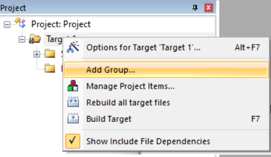
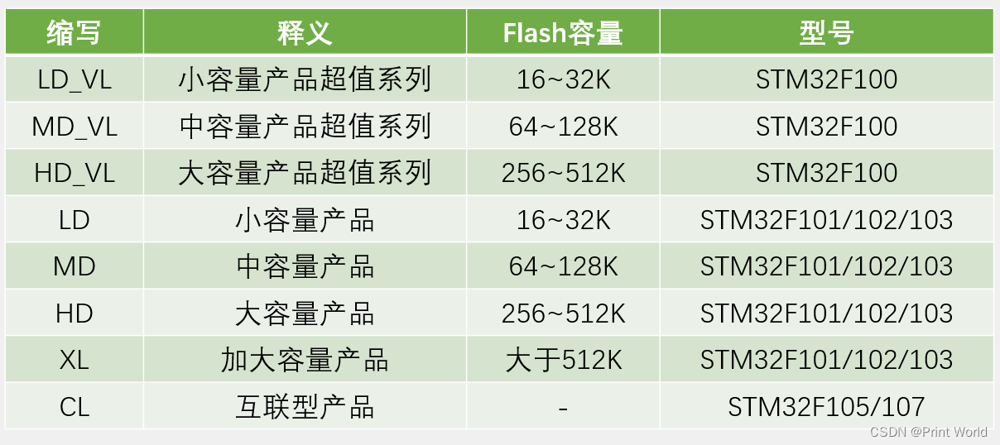
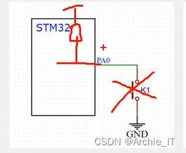
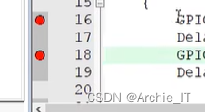
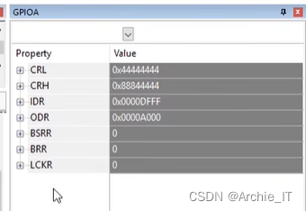

# STM-32

## 1-1 配件介绍

### 01\. 课程简介

-   程序纯手打，手把手教学
-   STM32最小系统板+面包板硬件平台  
    

> 该平台比较适合高校在校大学生学习STM32。

### 02\. 硬件设备

-   STM32最小系统+面包板
-   Windows10操作系统
-   万用表、示波器、镊子、剪刀等  
    

### 03\. 软件工具

[Keil5](https://so.csdn.net/so/search?q=Keil5&spm=1001.2101.3001.7020) MDK  


### 04\. 硬件套件


#### 4.1 面包板和跳线/飞线


#### 4.2 杜邦线和STM32最小系统板


#### 4.3 STLINK和OLED显示屏


#### 4.4 LED和按键


#### 4.5 电位器和蜂鸣器


#### 4.6 传感器和旋转编码器


#### 4.7 USB转串口和MPU6050


#### 4.8 Flash闪存和电机模块


#### 4.9 SG90舵机


### 05\. 配件清单


## 1-2 STM32简介

-   -   https://blog.csdn.net/u010249597/article/details/134762381#08__203)

### 01\. STM32简介

-   STM32是ST公司基于ARM Cortex-M内核开发的32位微控制器
-   STM32常应用在嵌入式领域，如智能车、无人机、机器人、无线通信、物联网、工业控制、娱乐电子产品等
-   STM32功能强大、性能优异、片上资源丰富、功耗低，是一款经典的嵌入式微控制器

#### 1.1 STM32是什么

STM32是一系列由ST Microelectronics（意法半导体公司）推出的微控制器(MCU)。这些微控制器基于ARM Cortex-M架构，并且提供各种不同的封装和引脚配置。STM32系列中一些受欢迎的微控制器包括STM32F103，STM32F407和STM32F429。 [STM32微控制器](https://so.csdn.net/so/search?q=STM32%E5%BE%AE%E6%8E%A7%E5%88%B6%E5%99%A8&spm=1001.2101.3001.7020)以其低功耗，高性能和广泛的功能而闻名。它们通常用于**物联网设备**，可穿戴技术和其他需要低功耗和高性能的应用。 总体而言，STM32微控制器是许多开发人员的首选，因为它们的多功能性，可靠性和广泛的功能。

> ST：指意法半导体  
> M：指定微处理器  
> 32：表示计算机处理器位数

【官方描述】

> STM32 is a family of microcontrollers from STMicroelectronics, a multinational semiconductor company. STM32 chips are used in a wide range of applications, from simple microcontroller-based projects to complex systems for industrial and automotive use. STM32 chips are based on the ARM Cortex-M architecture and are available in a variety of different packages and pin configurations. Some popular STM32 chips include the STM32F103, STM32F407, and STM32F429 microcontrollers. STM32 chips are known for their low power consumption, high performance, and wide range of features. They are often used in **IoT (Internet of Things)** devices, wearable technology, and other applications where low power consumption and high performance are critical. Overall, STM32 chips are a popular choice for many developers due to their versatility, reliability, and wide range of features.

【MCU】

> **MCU**：微控制器单元（MicroController Unit）：是把中央处理器、存储器、定时/计数器（timer/counter）、各种输入输出接口等都集成在一块集成电路芯片上的微型计算机。

#### 1.2 STM32应用领域

STM32的应用领域包括但不限于：

1.  嵌入式领域：如智能车、无人机、机器人、无线通信、物联网、工业控制、娱乐电子产品、医疗设备、智能家居等。
2.  高速数据采集系统：使用STM32连接高速ADC和FPGA芯片，实现对高速信号的采集和处理，例如高速摄像头、高速激光测距仪等。
3.  自动驾驶控制系统：使用STM32连接多个传感器和执行器，例如摄像头、雷达、电机、电子罗盘等，并通过算法设计和优化，实现自动驾驶控制功能。
4.  机器人视觉系统：使用STM32连接多个摄像头和处理模块，例如OpenCV、CUDA等，并通过算法设计和优化，实现机器人的视觉导航、物体识别等功能。
5.  网络安全嵌入式设备：使用STM32连接加密模块和网络模块，实现网络安全通信和数据加密等功能，例如VPN、防火墙、数据加密存储等。
6.  人工智能嵌入式设备：使用STM32连接AI模块，例如人脸识别、语音识别、自然语言处理等，并通过编程和训练，实现智能化的应用，例如智能门禁、智能家居等。

总的来说，STM32在各个领域都有广泛的应用。

#### 1.3 STM32命名规则


#### 1.4 STM32选型


### 02\. ARM简介

-   ARM既指ARM公司，也指ARM处理器内核
-   ARM公司是全球领先的半导体知识产权（IP）提供商，全世界超过95%的智能手机和平板电脑都采用ARM架构
-   ARM公司设计ARM内核，半导体厂商完善内核周边电路并生产芯片

#### 2.1 ARM是什么

-   ARM既可以认为是一个**公司的名字** ，也可以认为是对**一类处理器的统称** ，还可以认为是**一种技术的名字** 。
-   ARM公司是专门从事基于**RISC技术芯片设计开发** 的公司，作为知识产权供应商，**本身不直接从事芯片生产，而是转让设计许可** ，由合作公司生产各具特色的芯片。
-   **ARM处理器的内核是统一的** ，由ARM公司提供，**而片内部件则是多样的** ，由各大半导体公司设计，这使得**ARM设计嵌入式系统的时候，可以基于同样的核心，使用不同的片内外设** ，从而具有很大的优势。

#### 2.2 ARM系列


### 03\. STM32开发板

#### 3.1 MCU简介


**STM32F103C8T6**

-   系列：主流系列STM32F1
-   内核：ARM Cortex-M3
-   主频：72MHz
-   RAM：20K（SRAM）
-   ROM：64K（Flash）
-   供电：2.0~3.6V（标准3.3V）
-   封装：LQFP48

#### 3.2 STM32开发板

**STM32硬件**：STM32F103C8T6最小系统板


#### 3.3 STM32硬件资源


### 04\. STM32系统架构

在小容量、中容量和 大容量产品中，主系统由以下部分构成：  
● 四个驱动单元：  
─ Cortex™-M3内核DCode总线(D-bus)，和系统总线(S-bus)  
─ 通用DMA1和通用DMA2  
● 四个被动单元  
─ 内部SRAM  
─ 内部闪存存储器  
─ FSMC  
─ AHB到APB的桥(AHB2APBx)，它连接所有的APB设备

这些都是通过一个多级的AHB总线构架相互连接的，如下图所示：


### 05\. STM32引脚定义

引脚图


###### STM32F103C8T6引脚定义  


1.  I = 输入，O = 输出，S = 电源， HiZ = 高阻
2.  FT：容忍5V
3.  可以使用的功能依选定的型号而定。对于具有较少外设模块的型号，始终是包含较小编号的功能模块。例如，某个型号只有1个SPI和2个USART时，它们即是SPI1和USART1及USART2。
4.  PC13，PC14和PC15引脚通过电源开关进行供电，而这个电源开关只能够吸收有限的电流(3mA)。因此这三个引脚作为输出引脚时有以下限制：在同一时间只有一个引脚能作为输出，作为输出脚时只能工作在2MHz模式下，最大驱动负载为30pF，并且不能作为电流源(如驱动LED)。
5.  这些引脚在备份区域第一次上电时处于主功能状态下，之后即使复位，这些引脚的状态由备份区域寄存器控制（这些寄存器不会被主复位系统所复位）。 关于如何控制这些IO口的具体信息，请参考STM32F10xxx参考手册的电池备份区域和BKP寄存器的相关章节。
6.  与LQFP64的封装不同，在TFBGA64封装上没有PC3，但提供了V REF+ 引脚。
7.  此类复用功能能够由软件配置到其他引脚上(如果相应的封装型号有此引脚)，详细信息请参考STM32F10xxx参考手册的复用功能I/O章节和调试设置章节。
8.  VFQFPN36封装的引脚2和引脚3、LQFP48和LQFP64封装的引脚5和引脚6、和TFBGA64封装的C1和C2，在芯片复位后默认配置为OSC\_IN和OSC\_OUT功能脚。软件可以重新设置这两个引脚为PD0和PD1功能。但对于LQFP100/BGA100封装，由于PD0和PD1为固有的功能引脚，因此没有必要再由软件进行重映像设置。更多详细信息请参考STM32F10xxx参考手册的复用功能I/O章节和调试设置章节。在输出模式下，PD0和PD1只能配置为50MHz输出模式。

### 06\. STM32启动配置

在STM32F10xxx里，可以通过BOOT\[1:0\]引脚选择三种不同启动模式。


### 07\. STM32最小系统电路


### 08\. 附录

参考: [【STM32】江科大STM32学习笔记汇总](https://blog.csdn.net/u010249597/article/details/134762513)

## 2-1 软件安装

### 00\. 目录

#### 文章目录

-   -   [00\. 目录](https://blog.csdn.net/u010249597/article/details/134765079#00__0)
    -   [01\. MDK安装](https://blog.csdn.net/u010249597/article/details/134765079#01_MDK_3)
    -   [02\. Keil5注册](https://blog.csdn.net/u010249597/article/details/134765079#02_Keil5_83)
    -   [03\. 支持包安装](https://blog.csdn.net/u010249597/article/details/134765079#03___119)
    -   [04\. ST-LINK驱动安装](https://blog.csdn.net/u010249597/article/details/134765079#04_STLINK_137)
    -   [05\. USB转串口驱动](https://blog.csdn.net/u010249597/article/details/134765079#05_USB_179)
    -   [06\. 附录](https://blog.csdn.net/u010249597/article/details/134765079#06__201)

### 01\. MDK安装

MDK 源自德国的 KEIL 公司，是 RealView MDK 的简称。在全球 MDK 被超过 10 万的[嵌入式开发](https://so.csdn.net/so/search?q=%E5%B5%8C%E5%85%A5%E5%BC%8F%E5%BC%80%E5%8F%91&spm=1001.2101.3001.7020)工程师使用。目前最新版本为：

MDK6，该版本使用 uVision5 IDE 集成开发环境，是目前针对 ARM 处理器，尤其是 Cortex M 内核处理器的最佳开发工具。

[MDK5](https://so.csdn.net/so/search?q=MDK5&spm=1001.2101.3001.7020) 向后兼容 MDK4 和 MDK3 等，以前的项目同样可以在 MDK5 上进行开发(但是头文件方面得全部自己添加)， MDK5 同时加强了针

对 Cortex-M 微控制器开发的支持，并且对传统的开发模式和界面进行升级，MDK5 由两个部分组成：MDK Core 和 Software Packs。其

中，Software Packs 可以独立于工具链进行新芯片支持和中间库的升级。

1.1 双击MDK530.EXE文件，点击Next


1.2 接受许可协议，点击Next  


1.3 选择软件安装路径，点击Next  


1.4 随便填写信息，然后点击Next  


1.5 安装过程中  


1.6 选择安装


1.7 点击Finish  


1.8 全部点击右上角X关掉即可  


1.9 选择是  


至此[Keil MDK](https://so.csdn.net/so/search?q=Keil%20MDK&spm=1001.2101.3001.7020)\-ARM就安装完成，可以新建工程使用了。但为了不受编译代码4K大小限制和用户体验，就需要购买授权，或注册。

### 02\. Keil5注册

2.1 以管理员的方式运行keil软件  


2.2 选择否即可  


2.3 打开注册管理窗口（File -> License Management），并复制CID。  


2.4 打开注册机，执行如下几步。  


2.5 将注册码添加到注册窗口中  


### 03\. 支持包安装

3.1 双击Keil.STM32F1xx\_DFP.2.2.0.pack  


3.2 选择Finishu，完成安装  


### 04\. ST-LINK驱动安装

4.1 默认STM32 STLink是没有驱动的，需要安装驱动  


4.2 找到Keil安装目录下，安装64位驱动

> D:\\Keil\_v5\\ARM\\STLink\\USBDriver  
> 

4.3 选择下一页


4.4 点击完成即可  


4.5 驱动安装好之后，黄色感叹号消失，表示安装成功


### 05\. USB转串口驱动

5.1 双击CH341SER.EXE，点击安装


5.2 点击确定


5.3 安装好驱动之后，通过设备管理器查看如下图所示


### 06\. 附录

参考: [【STM32】江科大STM32学习笔记汇总](https://blog.csdn.net/u010249597/article/details/134762513)

## 2-2  创建工程

### **新建工程**

桌面新建存放STM32项目的文件夹：STM32Project

打开keil5,project,new uVersion Project，新建文件夹  2-2 STM32工程模板，其中新建工程文件Project，保存

选择芯片STM-STM32F1-STM32F103-STM32F103C8。OK，关闭弹出窗口

### **移植固件**

**启动文件**

```python
STM32F10x_StdPeriph_Lib_V3.5.0\Libraries\CMSIS\CM3\DeviceSupport\ST\STM32F10x\startup\arm
```

全选复制启动文件，在2-2 STM32工程模板中新建 Start 文件夹，放入 Start 文件夹

**外设寄存器描述文件、时钟文件**

```python
STM32F10x_StdPeriph_Lib_V3.5.0\Libraries\CMSIS\CM3\DeviceSupport\ST\STM32F10x
stm32f10x.h
system_stm32f10x.c
system_stm32f10x.h
```

复制上面三个文件，放入 Start  文件夹

**内核寄存器描述文件**

```python
STM32F10x_StdPeriph_Lib_V3.5.0\Libraries\CMSIS\CM3\CoreSupport
```

复制两个文件，放入 Start  文件夹

**keil5 添加start文件到工程**


**添加头文件路径**


**主文件**

2-2 STM32工程模板  文件夹中，新建 User 文件夹




**调试器配置**


**基于库函数编程**

2-2 STM32工程模板  文件夹中，新建 Library 文件夹，复制下列文件到 Library 文件夹

```python
STM32F10x_StdPeriph_Lib_V3.5.0\Libraries\STM32F10x_StdPeriph_Driver\src
STM32F10x_StdPeriph_Lib_V3.5.0\Libraries\STM32F10x_StdPeriph_Driver\inc
```

后放入keil5的工程中


**User中放入 头文件配置文件 与 中断文件**

```
STM32F10x_StdPeriph_Lib_V3.5.0\Project\STM32F10x_StdPeriph_Template
stm32f10x_conf.h
stm32f10x_it.c
stm32f10x_it.h
```

keil5工程中添加以上文件


**设置宏定义**


## 2-3 工程编译与下载

main.c

```c
#include "stm32f10x.h"                  // Device header
int main(void)
{
	//点亮PC13端口上的灯
	/*
	PC13由端口GPIOC端口控制，（GPIOC端口管理16个引脚：PC0~PC15）
	首先启动GPIOC时钟，调用RCC_APB2PeriphClockCmd（）函数
	RCC：（Reset and Clock Control）复位与时钟控制
	APB2：GPIOC由这条总线控制
	PeriphClockCmd：使能或禁用外围设备的时钟
	*/
	//周边时钟控制，参数：（外设，状态）
	RCC_APB2PeriphClockCmd(RCC_APB2Periph_GPIOC, ENABLE);
	//配置端口模式
	GPIO_InitTypeDef GPIO_InitStructure;
	GPIO_InitStructure.GPIO_Mode = GPIO_Mode_Out_PP;//通用推挽输出
	GPIO_InitStructure.GPIO_Pin = GPIO_Pin_13;
	GPIO_InitStructure.GPIO_Speed = GPIO_Speed_50MHz;
	GPIO_Init(GPIOC, &GPIO_InitStructure);
	GPIO_SetBits(GPIOC, GPIO_Pin_13);//高电平
	//GPIO_ResetBits(GPIOC, GPIO_Pin_13);//低电平
	while(1)
	{
		
	}
}	
```


### 启动文件型号分类 根据 芯片缩写 选择



```
STM32F10x_StdPeriph_Lib_V3.5.0\Libraries\CMSIS\CM3\DeviceSupport\ST\STM32F10x\startup\arm
```


### 工程结构


**startup文件**

程序执行最基本的文件，复位中断函数：板子上电或复位按钮按下时，进入中断，先进行系统初始化，然后调用main函数

SystemInit函数定义在system_xx.c / .h

另外定义了其他中断，定义在stm32f10x_it.c / .h，达到触发条件后，自动执行

## 3-1GPIO输出

### 01\. [GPIO](https://so.csdn.net/so/search?q=GPIO&spm=1001.2101.3001.7020)简介

-   GPIO（General Purpose Input Output）通用输入输出口
-   可配置为8种输入输出模式
-   引脚电平：0V~3.3V，部分引脚可容忍5V
-   输出模式下可控制端口输出高低电平，用以驱动LED、控制蜂鸣器、模拟通信协议输出时序等
-   输入模式下可读取端口的高低电平或电压，用于读取按键输入、外接模块电平信号输入、ADC电压采集、模拟通信协议接收数据等

每个GPI/O端口有两个32位配置[寄存器](https://so.csdn.net/so/search?q=%E5%AF%84%E5%AD%98%E5%99%A8&spm=1001.2101.3001.7020)(GPIOx\_CRL，GPIOx\_CRH)，两个32位数据寄存器(GPIOx\_IDR和GPIOx\_ODR)，一个32位置位/复位寄存器(GPIOx\_BSRR)，一个16位复位寄存器(GPIOx\_BRR)和一个32位锁定寄存器(GPIOx\_LCKR)。  
根据[数据手册](https://so.csdn.net/so/search?q=%E6%95%B0%E6%8D%AE%E6%89%8B%E5%86%8C&spm=1001.2101.3001.7020)中列出的每个I/O端口的特定硬件特征， GPIO端口的每个位可以由软件分别配置成多种模式。

-   输入浮空
    
-   输入上拉
    
-   输入下拉
    
-   模拟输入
    
-   开漏输出
    
-   推挽式输出
    
-   推挽式复用功能
    
-   开漏复用功能
    

每个I/O端口位可以自由编程，然而I/0端口寄存器必须按32位字被访问(不允许半字或字节访问)。GPIOx\_BSRR和GPIOx\_BRR寄存器允许对任何GPIO寄存器的读/更改的独立访问；这样，在读和更改访问之间产生IRQ时不会发生危险。

### 02\. GPIO基本结构

**系统结构**


**基本结构**


### 03\. GPIO位结构

I/O端口位的基本结构


5伏兼容I/O端口位的基本结构


### 04\. GPIO模式

通过配置GPIO的端口配置寄存器，端口可以配置成以下8种模式


**4种输入模式**：

-   输入浮空
-   输入上拉
-   输入下拉
-   模拟输入

**4种输出模式**：

-   开漏输出
-   开漏复用功能
-   推挽式输出
-   推挽式复用功能

**3种最大翻转速度**:

-   最大输出速度为2MHz
-   最大输出速度为10MHz
-   最大输出速度为50MHz

#### 4.1 输入浮空

输入高为高，输入低为低，无输入漂浮不定。

浮空输入模式下，I/O端口的电平信号直接进入输入数据寄存器。也就是说，I/O的电平状态是不确定的，==完全由外部输入决定==；如果在该引脚悬空（在无信号输入）的情况下，读取该端口的电平是不确定的。所以在要读取外部信号时通常配置IO口为浮空输入模式。  


#### 4.2 输入上拉

**输入高为高，输入低为低，无输入拉高**

上拉输入模式下，I/O端口的电平信号直接进入输入数据寄存器。但是在==I/O端口悬空==（在无信号输入）的情况下，输入端的电平可以保持在==高电平==；并且在==I/O端口输入为低电平==的时候，输入端的电平为==低电平==。


#### 4.3 输入下拉

**输入高为高，输入低为低，无输入拉低**

下拉输入模式下，IO口工作方式刚好和上拉模式相反。I/O端口的电平信号直接进入输入数据寄存器。但是在I/O端口悬空（在无信号输入）的情况下，输入端的电平可以保持在低电平；并且在I/O端口输入为高电平的时候，输入端为高电平。  


#### 4.4 模拟输入

模拟输入模式下，I/O端口的模拟信号（电压信号，而非电平信号）==直接模拟输入到片上外设模块==，比如ADC模块等等。


#### 4.5 开漏输出

p-mos不起作用，输入1时，n-mos关闭，io电平不由单片机控制，由外部电路控制；输入0时，n-mos开启，io电平为低电平

**高电平没有驱动能力，只用低电平驱动能力**

开漏输出模式下，通过设置位设置/清除寄存器或者输出数据寄存器的值，控制MOS管的导通。这里要注意N-MOS管，当设置输出的值为1的时候，N-MOS管处于关闭状态，此时I/O端口的电平就不会由输出的高低电平决定，而是由I/O端口外部的上拉或者下拉决定；当设置输出的值为0的时候，N-MOS管处于开启状态，此时I/O端口的电平就是低电平。同时，I/O端口的电平也可以通过输入电路进行读取；注意，I/O端口的电平不一定是输出的电平。通常使用开漏输出时外部要加一个上拉电阻。


#### 4.6 开漏复用功能

开漏复用输出模式，与开漏输出模式很是类似。只是输出的高低电平的来源，不是让CPU直接写输出数据寄存器，取而代之利用片上外设模块的复用功能输出来决定的。


#### 4.7 推挽式输出

推挽输出模式下，通过设置位设置/清除寄存器或者输出数据寄存器的值，控制P-MOS管和N-MOS管的导通来控制IO口输出高电平还是低电平。这里要注意P-MOS管和N-MOS管，当==设置输出的值为1==的时候，P-MOS管处于开启状态，N-MOS管处于关闭状态，此时==I/O端口==的电平就由P-MOS管决定为==高电平==；当==设置输出的值为0==的时候，P-MOS管处于关闭状态，N-MOS管处于开启状态，此时==I/O端口==的电平就由N-MOS管决定为==低电平==。同时，I/O端口的电平也可以通过输入电路进行读取；注意，此时I/O端口的电平一定是输出的电平。


#### 4.8 推挽式复用功能

推挽复用输出模式，与推挽输出模式很是类似。只是输出的高低电平的来源，不是让CPU直接写输出数据寄存器，取而代之利用片上外设模块的复用功能输出来决定的。


### 05\. LED和蜂鸣器简介

-   LED：发光二极管，正向通电点亮，反向通电不亮
-   有源蜂鸣器：内部自带振荡源，将正负极接上直流电压即可持续发声，频率固定
-   无源蜂鸣器：内部不带振荡源，需要控制器提供振荡脉冲才可发声，调整提供振荡脉冲的频率，可发出不同频率的声音  
    

硬件电路  


### 06\. 面包板


面包板描述


面包板使用示例


### 07\. 附录

参考: [【STM32】江科大STM32学习笔记汇总](https://blog.csdn.net/u010249597/article/details/134762513)

## 3-2GPIO相关API

#### 3个时钟外设

声明在rcc.h中

```c
//外设时钟控制函数：第一个参数选择外设，第二个参数选择使能或失能
void RCC_AHBPeriphClockCmd(uint32_t RCC_AHBPeriph, FunctionalState NewState);
void RCC_APB2PeriphClockCmd(uint32_t RCC_APB2Periph, FunctionalState NewState);
void RCC_APB1PeriphClockCmd(uint32_t RCC_APB1Periph, FunctionalState NewState);
```

```c
void RCC_AHBPeriphClockCmd(uint32_t RCC_AHBPeriph, FunctionalState NewState)
/**
  * @brief  Enables or disables the AHB peripheral clock.
  * @param  RCC_AHBPeriph: specifies the AHB peripheral to gates its clock.
  *   
  *   For @b STM32_Connectivity_line_devices, this parameter can be any combination
  *   of the following values:        
  *     @arg RCC_AHBPeriph_DMA1
  *     @arg RCC_AHBPeriph_DMA2
  *     @arg RCC_AHBPeriph_SRAM
  *     @arg RCC_AHBPeriph_FLITF
  *     @arg RCC_AHBPeriph_CRC
  *     @arg RCC_AHBPeriph_OTG_FS    
  *     @arg RCC_AHBPeriph_ETH_MAC   
  *     @arg RCC_AHBPeriph_ETH_MAC_Tx
  *     @arg RCC_AHBPeriph_ETH_MAC_Rx
  * 
  *   For @b other_STM32_devices, this parameter can be any combination of the 
  *   following values:        
  *     @arg RCC_AHBPeriph_DMA1
  *     @arg RCC_AHBPeriph_DMA2
  *     @arg RCC_AHBPeriph_SRAM
  *     @arg RCC_AHBPeriph_FLITF
  *     @arg RCC_AHBPeriph_CRC
  *     @arg RCC_AHBPeriph_FSMC
  *     @arg RCC_AHBPeriph_SDIO
  *   
  * @note SRAM and FLITF clock can be disabled only during sleep mode.
  * @param  NewState: new state of the specified peripheral clock.
  *   This parameter can be: ENABLE or DISABLE.
  * @retval None
  */
```

```c
void RCC_APB2PeriphClockCmd(uint32_t RCC_APB2Periph, FunctionalState NewState)
/**
  * @brief  Enables or disables the High Speed APB (APB2) peripheral clock.
  * @param  RCC_APB2Periph: specifies the APB2 peripheral to gates its clock.
  *   This parameter can be any combination of the following values:
  *     @arg RCC_APB2Periph_AFIO, RCC_APB2Periph_GPIOA, RCC_APB2Periph_GPIOB,
  *          RCC_APB2Periph_GPIOC, RCC_APB2Periph_GPIOD, RCC_APB2Periph_GPIOE,
  *          RCC_APB2Periph_GPIOF, RCC_APB2Periph_GPIOG, RCC_APB2Periph_ADC1,
  *          RCC_APB2Periph_ADC2, RCC_APB2Periph_TIM1, RCC_APB2Periph_SPI1,
  *          RCC_APB2Periph_TIM8, RCC_APB2Periph_USART1, RCC_APB2Periph_ADC3,
  *          RCC_APB2Periph_TIM15, RCC_APB2Periph_TIM16, RCC_APB2Periph_TIM17,
  *          RCC_APB2Periph_TIM9, RCC_APB2Periph_TIM10, RCC_APB2Periph_TIM11     
  * @param  NewState: new state of the specified peripheral clock.
  *   This parameter can be: ENABLE or DISABLE.
  * @retval None
  */
```

```c
void RCC_APB1PeriphClockCmd(uint32_t RCC_APB1Periph, FunctionalState NewState)
/**
  * @brief  Enables or disables the Low Speed APB (APB1) peripheral clock.
  * @param  RCC_APB1Periph: specifies the APB1 peripheral to gates its clock.
  *   This parameter can be any combination of the following values:
  *     @arg RCC_APB1Periph_TIM2, RCC_APB1Periph_TIM3, RCC_APB1Periph_TIM4,
  *          RCC_APB1Periph_TIM5, RCC_APB1Periph_TIM6, RCC_APB1Periph_TIM7,
  *          RCC_APB1Periph_WWDG, RCC_APB1Periph_SPI2, RCC_APB1Periph_SPI3,
  *          RCC_APB1Periph_USART2, RCC_APB1Periph_USART3, RCC_APB1Periph_USART4, 
  *          RCC_APB1Periph_USART5, RCC_APB1Periph_I2C1, RCC_APB1Periph_I2C2,
  *          RCC_APB1Periph_USB, RCC_APB1Periph_CAN1, RCC_APB1Periph_BKP,
  *          RCC_APB1Periph_PWR, RCC_APB1Periph_DAC, RCC_APB1Periph_CEC,
  *          RCC_APB1Periph_TIM12, RCC_APB1Periph_TIM13, RCC_APB1Periph_TIM14
  * @param  NewState: new state of the specified peripheral clock.
  *   This parameter can be: ENABLE or DISABLE.
  * @retval None
  */
```

#### gpio.h库函数

```c
void GPIO_DeInit(GPIO_TypeDef* GPIOx);//复位GPIO，参数GPIOA、GPIOB
void GPIO_AFIODeInit(void);//复位AFIO外设

//重要！gpio初始化函数，用结构体初始化
void GPIO_Init(GPIO_TypeDef* GPIOx, GPIO_InitTypeDef* GPIO_InitStruct);

void GPIO_StructInit(GPIO_InitTypeDef* GPIO_InitStruct);//结构体变量赋一个默认值

/*gpio读取函数*/
//读取单片机外部输入的数据（输入数据寄存器）
uint8_t GPIO_ReadInputDataBit(GPIO_TypeDef* GPIOx, uint16_t GPIO_Pin);//读取某个针脚输入数据
uint16_t GPIO_ReadInputData(GPIO_TypeDef* GPIOx);//读取整个输入数据寄存器（如GPIOA）

//读取单片机自己当前的输出电平（输出数据寄存器）
uint8_t GPIO_ReadOutputDataBit(GPIO_TypeDef* GPIOx, uint16_t GPIO_Pin);//读取某个针脚输输出数据
uint16_t GPIO_ReadOutputData(GPIO_TypeDef* GPIOx);//读取整个输出数据寄存器

/*gpio写入函数*/
void GPIO_SetBits(GPIO_TypeDef* GPIOx, uint16_t GPIO_Pin);//将指定端口设置为高电平
void GPIO_ResetBits(GPIO_TypeDef* GPIOx, uint16_t GPIO_Pin);//将指定端口设置为低电平
//如GPIO_ResetBits(GPIOA,GPIO_Pin_0);

void GPIO_WriteBit(GPIO_TypeDef* GPIOx, uint16_t GPIO_Pin, BitAction BitVal);//根据BitVal设置指定端口电平
//如GPIO_WriteBit(GPIOA,GPIO_Pin_0,Bit_RESET)，设置低电平
//如GPIO_WriteBit(GPIOA,GPIO_Pin_0,Bit_SET)，设置高电平


void GPIO_Write(GPIO_TypeDef* GPIOx, uint16_t PortVal);//对16个端口进行写入操作
//如GPIO_Write(GPIOA, ~0x0001)，设置A0端口为低电平
//如GPIO_Write(GPIOA, 0x0001)，设置A0端口为高电平
```

#### gpio初始化

这里初始化GPIOA，用结构体给初始化函数传参

```c
//首先实例化结构体对象，并初始化
GPIO_InitTypeDef GPIO_InitStructure;

//用.操作列出待初始化属性，右键查看定义，如查看GPIO_Mode，出现：
/*  GPIOMode_TypeDef GPIO_Mode;    /*!< Specifies the operating mode for the selected pins.
                                      This parameter can be a value of @ref GPIOMode_TypeDef */*/
/*ctrl+f查找GPIOMode_TypeDef，gpio的8种工作模式
typedef enum
{ GPIO_Mode_AIN = 0x0,//模拟输入
  GPIO_Mode_IN_FLOATING = 0x04,//浮空输入
  GPIO_Mode_IPD = 0x28,//下拉输入
  GPIO_Mode_IPU = 0x48,//上拉输入
  GPIO_Mode_Out_OD = 0x14,//开漏输出
  GPIO_Mode_Out_PP = 0x10,//推挽输出
  GPIO_Mode_AF_OD = 0x1C,//复用开漏
  GPIO_Mode_AF_PP = 0x18//复用推挽
}GPIOMode_TypeDef;
这里用推挽输出*/                                          
GPIO_InitStructure.GPIO_Mode = GPIO_Mode_Out_PP;//推挽输出
/*右键查看GPIO_Pin定义，选择Class:member，出现
  uint16_t GPIO_Pin;   /*!< Specifies the GPIO pins to be configured.
                       This parameter can be any value of @ref GPIO_pins_define */*/
//ctrl+f 查找GPIO_pins_define，选择GPIO_Pin_0
GPIO_InitStructure.GPIO_Pin = GPIO_Pin_0;

//用同样的方法
GPIO_InitStructure.GPIO_Speed  = GPIO_Speed_50MHz;

GPIO_Init(GPIOA, GPIO_InitStructure);
//此时gpio-A0被设置成以50MHz推挽输出模式
//有8个gpio外设，分别是GPIOA~GPIOG；每个gpio外设可设置16个pin，可用于16个引脚输出输入电平
```

#### dalay函数

点灯文件中新建System文件夹，移入delay.c和delay.h

点击品字箱子，添加工程System，移入delay.c和delay.h

点击魔术棒，C/C++,添加头文件路径

新文件引用延时函数

```c
#include "delay.h"
Delay_ms(500);
```

## 3-3点灯

### 01\. GPIO之LED[电路图](https://so.csdn.net/so/search?q=%E7%94%B5%E8%B7%AF%E5%9B%BE&spm=1001.2101.3001.7020)

电路图示例1


电路图示例2


### 02\. GPIO之LED接线图


### 03\. LED闪烁程序示例

main.c

```c
#include "stm32f10x.h"                  // Device header
#include "delay.h"
int main(void)
{

	RCC_APB2PeriphClockCmd(RCC_APB2Periph_GPIOA,ENABLE);
	
	GPIO_InitTypeDef GPIO_InitStructure;	
	GPIO_InitStructure.GPIO_Mode = GPIO_Mode_Out_PP;
	GPIO_InitStructure.GPIO_Pin = GPIO_Pin_0;
	GPIO_InitStructure.GPIO_Speed  = GPIO_Speed_50MHz;	
	GPIO_Init(GPIOA,&GPIO_InitStructure);
	
	GPIO_WriteBit(GPIOA, GPIO_Pin_0,Bit_SET);
	while(1)
	{
		GPIO_WriteBit(GPIOA, GPIO_Pin_0,Bit_SET);
		Delay_ms(500);
		GPIO_WriteBit(GPIOA, GPIO_Pin_0,Bit_RESET);	
		Delay_ms(500);
	}
}


```

### 04\. LED闪烁程序下载

接线图如下图所示：


点击下载，现象为LED闪烁。

### 05\. LED[流水灯](https://so.csdn.net/so/search?q=%E6%B5%81%E6%B0%B4%E7%81%AF&spm=1001.2101.3001.7020)接线图


### 06\. LED流水灯程序示例

main.c

```c
#include "stm32f10x.h"                  // Device header
#include "delay.h"
int main(void)
{

	RCC_APB2PeriphClockCmd(RCC_APB2Periph_GPIOA,ENABLE);
	
	GPIO_InitTypeDef GPIO_InitStructure;	
	GPIO_InitStructure.GPIO_Mode = GPIO_Mode_Out_PP;
	GPIO_InitStructure.GPIO_Pin = GPIO_Pin_All ;
	GPIO_InitStructure.GPIO_Speed  = GPIO_Speed_50MHz;	
	GPIO_Init(GPIOA,&GPIO_InitStructure);
	
	GPIO_WriteBit(GPIOA, GPIO_Pin_0,Bit_SET);
	while(1)
	{
		/*使用GPIO_Write，同时设置GPIOA所有引脚的高低电平，实现LED流水灯*/
		GPIO_Write(GPIOA, ~0x0001);	//0000 0000 0000 0001，PA0引脚为低电平，其他引脚均为高电平，注意数据有按位取反
		Delay_ms(500);				//延时100ms
		GPIO_Write(GPIOA, ~0x0002);	//0000 0000 0000 0010，PA1引脚为低电平，其他引脚均为高电平
		Delay_ms(500);				//延时100ms
		GPIO_Write(GPIOA, ~0x0004);	//0000 0000 0000 0100，PA2引脚为低电平，其他引脚均为高电平
		Delay_ms(500);				//延时100ms
		GPIO_Write(GPIOA, ~0x0008);	//0000 0000 0000 1000，PA3引脚为低电平，其他引脚均为高电平
		Delay_ms(500);				//延时100ms
		GPIO_Write(GPIOA, ~0x0010);	//0000 0000 0001 0000，PA4引脚为低电平，其他引脚均为高电平
		Delay_ms(500);				//延时100ms
		GPIO_Write(GPIOA, ~0x0020);	//0000 0000 0010 0000，PA5引脚为低电平，其他引脚均为高电平
		Delay_ms(500);				//延时100ms
		GPIO_Write(GPIOA, ~0x0040);	//0000 0000 0100 0000，PA6引脚为低电平，其他引脚均为高电平
		Delay_ms(500);				//延时100ms
		GPIO_Write(GPIOA, ~0x0080);	//0000 0000 1000 0000，PA7引脚为低电平，其他引脚均为高电平
		Delay_ms(500);				//延时100ms
	}
}


```

### 07\. 蜂鸣器接线图


### 08\. 蜂鸣器程序示例

main.c

```c
#include "stm32f10x.h"                  // Device header
#include "delay.h"
int main(void)
{

	RCC_APB2PeriphClockCmd(RCC_APB2Periph_GPIOB,ENABLE);
	
	GPIO_InitTypeDef GPIO_InitStructure;	
	GPIO_InitStructure.GPIO_Mode = GPIO_Mode_Out_PP;
	GPIO_InitStructure.GPIO_Pin = GPIO_Pin_12;
	GPIO_InitStructure.GPIO_Speed  = GPIO_Speed_50MHz;	
	GPIO_Init(GPIOB,&GPIO_InitStructure);
	
	while(1)
	{
		GPIO_WriteBit(GPIOB, GPIO_Pin_12,Bit_SET);
		Delay_ms(500);
		GPIO_WriteBit(GPIOB, GPIO_Pin_12,Bit_RESET);	
		Delay_ms(500);
	}
}


```

## 3-4GPIO输入

___

### 按键简介

按键：常见的输入设备，按下导通，松手断开


 按键抖动：由于按键内部使用的是机械式弹簧片来进行通断的，所以在按下和松手的瞬间会伴随有一连串的抖动


###  传感器模块简介

传感器模块：传感器元件（传感器模块就是利用传感器元件，比如如下图的光敏电阻/热敏电阻/红外接收管等）的电阻会随外界模拟量的变化而变化（比如光线越强，光敏电阻的阻值就越小），通过与定值电阻进行**串联分压**即可得到模拟电压输出，再通过电压比较器进行二值化（二值化就是要么是高要么是低）即可得到数字电压输出


 如下为传感器模块的基本电路，详细介绍。


这个N1就是传感器元件所代表的可变电阻，它的阻值可以根据环境的光线、温度等模拟两进行变化

N1上面的R1，是和N1进行分压的定值电阻，R1和N1串联，一端接VCC一端接VSS，这就构成了基本的分压电路，AO电压就由R1和N1两个电阻的分压得到。

AO电压就由R1和N1两个电阻的分压得到。

N1左边的C2是一个滤波电容，它是为了给中间的电压输出进行滤波的，用来滤除一些干扰，保证输出电压波形的平滑。一般我们在电路中遇到一端接到电路中，另一端接地的电容，都可以考虑一下是不是滤波电容的作用，并不是电路的主要框架，这时候我们进行分析电路时，就可以先把这个电容抹掉，这样就可使我们的电路分析更加简单。

二值化输出是通过这个LM393芯片来完成，是一个电压比较器芯片，里面由两个独立的电压比较器电路，然后剩下的是VCC和GND供电，里面电容是一个电源供电的滤波电容，**这个电压比较器其实就是一个运算放大器**，当同向输入端的电压大于反向输入端的电压时，输出就会瞬间升高为最大值也就是输出接VCC；反之当同向输入端的电压小于反向输入端的电压时，输出就会瞬间降为最小值，也就是输出接GND，这样就可以对一个模拟电压进行二值化了，DO就是最后数字电压的输出。


 可以用**上下拉电阻的思维分析传感器电阻的阻值变化对输出电压的影响**，如下：

AO这个输出端可以把它想象成一个水平杆子（下图红色直线），R1上拉电阻相当于拴在上方的弹簧，将杆子向上拉，N1下拉电阻相当于拴在地面的弹簧，将杆子向下拉；电阻的阻值越小，弹簧的拉力就越强，杆子的高度就相当于电路中的电压，杠子向拉力强的一端偏移（取决于两个弹簧的弹力之差）；如果上下弹簧拉力一致，杆子处于居中位置也就是电路输出VCC/2的电压；如果上面的阻值小，拉力强，输出电压就会变高；反之下面的阻值小，输出电压就会变低 ；如果上下拉电阻的阻值都为0，就是两个无穷大的力在对抗，在电路中呈现的就是电源短路（应该避免）。单片机电路中会常出现这种上拉下拉电阻，比如弱上拉，强上拉等（强和弱就是指电阻阻值的大小，也就是这个弹簧拉力大小） ，最终输出电压就是在弹簧拉扯下最终杆子的高低。

 

### 按键和传感器硬件电路

下接按键的方式如下，**一般来说我们用下接按键的方**式，这个原因和LED的接法类似，是电路设计习惯和规范；下左图中，按键按下时，PA0直接下拉到GND，此时读取PA0口的电压就是低电平，在这种接法下，必须要求PA0是上拉输入模式，使按键松下，还是高电平。下右图，外部接了一个上拉电阻，当按键松手时，引脚由于上拉作用，保持为高电平，此时PA0引脚就可以配置为浮空输入或者上拉输入。



上接按键的方式（仅了解）如下，左图1中，要求将PA0必须配置成下拉输入模式，松手时，引脚会回到默认值低电平。   

 

传感器模块电路如下，DO是数字输出端口，PA0用于读取数字量。


### [C语言数据类型](https://so.csdn.net/so/search?q=C%E8%AF%AD%E8%A8%80%E6%95%B0%E6%8D%AE%E7%B1%BB%E5%9E%8B&spm=1001.2101.3001.7020) 

<table><tbody><tr><td><p><strong><span>关键字</span></strong></p></td><td><p><strong><span>位数</span></strong></p></td><td><p><strong><span>表示范围</span></strong></p></td><td><p><strong><span>stdint</span></strong><strong><span>关键字</span></strong></p></td><td><p><strong><span>ST</span></strong><strong><span>关键字</span></strong></p></td><td><p><strong><span>ST</span></strong><strong><span>关键字</span></strong></p></td></tr><tr><td><p><span>char</span></p></td><td><p><span>8</span></p></td><td><p><span>-128&nbsp;~&nbsp;127</span></p></td><td><p><span>int8_t</span></p></td><td><p><span>s8</span></p></td><td><p><span>s8</span></p></td></tr><tr><td><p><span>unsigned&nbsp;char</span></p></td><td><p><span>8</span></p></td><td><p><span>0&nbsp;~&nbsp;255</span></p></td><td><p><span>uint8_t</span></p></td><td><p><span>u8</span></p></td><td><p><span>u8</span></p></td></tr><tr><td><p><span>short</span></p></td><td><p><span>16</span></p></td><td><p><span>-32768&nbsp;~&nbsp;32767</span></p></td><td><p><span>int16_t</span></p></td><td><p><span>s16</span></p></td><td><p><span>s16</span></p></td></tr><tr><td><p><span>unsigned&nbsp;short</span></p></td><td><p><span>16</span></p></td><td><p><span>0&nbsp;~&nbsp;65535</span></p></td><td><p><span>uint16_t</span></p></td><td><p><span>u16</span></p></td><td><p><span>u16</span></p></td></tr><tr><td><p><span>int</span></p></td><td><p><span>32</span></p></td><td><p><span>-2147483648&nbsp;~&nbsp;2147483647</span></p></td><td><p><span>int32_t</span></p></td><td><p><span>s32</span></p></td><td><p><span>s32</span></p></td></tr><tr><td><p><span>unsigned&nbsp;int</span></p></td><td><p><span>32</span></p></td><td><p><span>0&nbsp;~&nbsp;4294967295</span></p></td><td><p><span>uint32_t</span></p></td><td><p><span>u32</span></p></td><td><p><span>u32</span></p></td></tr><tr><td><p><span>long</span></p></td><td><p><span>32</span></p></td><td><p><span>-2147483648&nbsp;~&nbsp;2147483647</span></p></td><td></td><td></td><td></td></tr><tr><td><p><span>unsigned&nbsp;long</span></p></td><td><p><span>32</span></p></td><td><p><span>0&nbsp;~&nbsp;4294967295</span></p></td><td></td><td></td><td></td></tr><tr><td><p><span>long&nbsp;long</span></p></td><td><p><span>64</span></p></td><td><p><span>-(2^64)/2&nbsp;~&nbsp;(2^64)/2-1</span></p></td><td><p><span>int64_t</span></p></td><td></td><td></td></tr><tr><td><p><span>unsigned&nbsp;long&nbsp;long</span></p></td><td><p><span>64</span></p></td><td><p><span>0&nbsp;~&nbsp;(2^64)-1</span></p></td><td><p><span>uint64_t</span></p></td><td></td><td></td></tr><tr><td><p><span>float</span></p></td><td><p><span>32</span></p></td><td><p><span>-3.4e38&nbsp;~&nbsp;3.4e38</span></p></td><td></td><td></td><td></td></tr><tr><td><p><span>double</span></p></td><td><p><span>64</span></p></td><td><p><span>-1.7e308&nbsp;~&nbsp;1.7e308</span></p></td><td></td><td></td><td></td></tr></tbody></table>

单片机中用char也就是int8\_t来存放整数而不是字符等，有一定的区别需要注意。

C语言提供的stdint头文件，使用新的名字。比如int8\_t就是char的新名字，表示的意思就是8位        整型的数据,右边加个\_t 表示这是用typedef重新命名的变量类型。

ST关键字是老版本用的。

### [C语言宏定义](https://so.csdn.net/so/search?q=C%E8%AF%AD%E8%A8%80%E5%AE%8F%E5%AE%9A%E4%B9%89&spm=1001.2101.3001.7020)

**前为新，后为旧**

关键字：#define

用途：用一个字符串代替一个数字，便于理解，防止出错；提取程序中经常出现的参数，便于快速修改

定义宏定义：     #define ABC 12345

引用宏定义：     int a = ABC;    //等效于int a = 12345;

### C语言typedef

**前为旧，后为新**

**typedef只能专门给变量类型换名字，更加安全（不是变量类型的名字是不行的）；所以宏定义的改名范围更宽**       

关键字：typedef

用途：将一个比较长的变量类型名换个名字，便于使用

定义typedef：     typedef unsigned char uint8\_t;

引用typedef：      uint8\_t a;    //等效于unsigned char a;

### C语言结构体

结构体也是一种数据类型，比如char、int等是基本数据类型；数组是由许多相同基本数据类型的组合；与数组一样，但是**若组合不同的数据类型就用结构体**。

关键字：struct

用途：数据打包，不同类型变量的集合

定义结构体变量：struct{char x; int y; float z;} StructName;

StructName是结构体变量的名字

因为结构体变量类型较长，所以通常用typedef更改变量类型名

引用结构体成员：

StructName.x = 'A';   

StructName.y = 66;  

StructName.z = 1.23;

或是用结构体指针方式，因为结构体是一种组合数据类型，在函数之间的数据传递中，通常用的是地址传递而不是值传递（看一下指针教程）

杠大于号，结构体成员名

pStructName->x = 'A';    //pStructName为结构体的地址 

pStructName->y = 66;   

pStructName->z = 1.23;

代码理解，如下

```cobol
struct c；

//定义了一个结构体类型，名字叫c，这是不完整的，还需加一个附加声明{打包的变量}，如下

struct {char x; int y; float z} c；

//定义一个结构体变量，名字叫c，其中包含char型的x，int型的y和float型的z三个子项

c.x = 'a';

c.y = 66;

c.z = 1.23;

//结构体的引用，需写结构体名字c，然后用运算符取索引，索引是结构体子项的名字，如结构体名称.结构体子项
```

 

使用typedef 解决结构体名字太长的问题

```cpp
struct {char x; int y; float z} c；

struct {char x; int y; float z} d；

typedef struct {char x; int y; float z} struct_t;

typedef struct {

char x;

int y;

float z

} struct_t;

struct {

char x;

int y;

float z

}

typedef struct {

char x;

int y;

float z

} struct_t;

struct_t c；

struct_t d；

c.x = 'a';
```

### C语言枚举

和结构体差不多，也是一个数据类型

**只能在它给定的参数列表里赋值，不能赋其它的值**

**枚举值也不是必须赋值给枚举变量的，也可以赋值给随意一个变量。所以说枚举也是一个宏定义的集合。**

关键字：enum

用途：1.定义一个取值受限制的整型变量，用于限制变量取值范围（比如我们定义一个变量用来存储星期的值，理论上这个变量只能取1到7的值，若定义的是整形变量这时可能会出现数据不合法，比如星期8的情况出现，所以这时候需要定义一个**取值受限制的整形变量**，这个变量就是枚举）；2.宏定义的集合

定义枚举变量： 

enum{FALSE = 0, TRUE = 1} EnumName;  （需要用逗号，限制EnumName的取值范围）

因为枚举变量类型较长，所以通常用typedef更改变量类型名：

typedef  enum{FALSE = 0, TRUE = 1}  EnumName\_t  

使用新的名字EnumName\_t  来定义枚举变量，命名为EnumName：

EnumName\_t   EnumName

只能引用下面两种：

EnumName = FALSE； // EnumName = 0

EnumName = TRUE ； // EnumName = 1

引用枚举成员：     EnumName = FALSE;     EnumName = TRUE;

### 其它

对于C语言来说，主要由两个功能，一个是定义数据，一个是引用数据。

数组的引用如下：

```cobol
int b[5]；

//是定义了一个5个int型数据的数组，名字叫b

b[0] = 11;

//数组的引用是数组名b，加上方括号取索引；数组的第0个元素等于11

b[1] = 66;
```


## 3-5按键输入

### 01\. 按键控制LED接线图


### 02\. 按键控制LED程序示例

代码提示快捷键：ctrl+alt+空格

led.h

```c
#ifndef __LED_H
#define __LED_H

void LED_Init(void);
void LED1_ON(void);
void LED1_OFF(void);
void LED1_Turn(void);
void LED2_ON(void);
void LED2_OFF(void);
void LED2_Turn(void);

#endif

```

led.c

```c
#include "stm32f10x.h"                  // Device header

/**
  * 函    数：LED初始化
  * 参    数：无
  * 返 回 值：无
  */
void LED_Init(void)
{
	/*开启时钟*/
	RCC_APB2PeriphClockCmd(RCC_APB2Periph_GPIOA, ENABLE);		//开启GPIOA的时钟
	
	/*GPIO初始化*/
	GPIO_InitTypeDef GPIO_InitStructure;
	GPIO_InitStructure.GPIO_Mode = GPIO_Mode_Out_PP;
	GPIO_InitStructure.GPIO_Pin = GPIO_Pin_1 | GPIO_Pin_2;
	GPIO_InitStructure.GPIO_Speed = GPIO_Speed_50MHz;
	GPIO_Init(GPIOA, &GPIO_InitStructure);						//将PA1和PA2引脚初始化为推挽输出
	
	/*设置GPIO初始化后的默认电平*/
	GPIO_SetBits(GPIOA, GPIO_Pin_1 | GPIO_Pin_2);				//设置PA1和PA2引脚为高电平
}

/**
  * 函    数：LED1开启
  * 参    数：无
  * 返 回 值：无
  */
void LED1_ON(void)
{
	GPIO_ResetBits(GPIOA, GPIO_Pin_1);		//设置PA1引脚为低电平
}

/**
  * 函    数：LED1关闭
  * 参    数：无
  * 返 回 值：无
  */
void LED1_OFF(void)
{
	GPIO_SetBits(GPIOA, GPIO_Pin_1);		//设置PA1引脚为高电平
}

/**
  * 函    数：LED1状态翻转
  * 参    数：无
  * 返 回 值：无
  */
void LED1_Turn(void)
{
	if (GPIO_ReadOutputDataBit(GPIOA, GPIO_Pin_1) == 0)		//获取输出寄存器的状态，如果当前引脚输出低电平
	{
		GPIO_SetBits(GPIOA, GPIO_Pin_1);					//则设置PA1引脚为高电平
	}
	else													//否则，即当前引脚输出高电平
	{
		GPIO_ResetBits(GPIOA, GPIO_Pin_1);					//则设置PA1引脚为低电平
	}
}

/**
  * 函    数：LED2开启
  * 参    数：无
  * 返 回 值：无
  */
void LED2_ON(void)
{
	GPIO_ResetBits(GPIOA, GPIO_Pin_2);		//设置PA2引脚为低电平
}

/**
  * 函    数：LED2关闭
  * 参    数：无
  * 返 回 值：无
  */
void LED2_OFF(void)
{
	GPIO_SetBits(GPIOA, GPIO_Pin_2);		//设置PA2引脚为高电平
}

/**
  * 函    数：LED2状态翻转
  * 参    数：无
  * 返 回 值：无
  */
void LED2_Turn(void)
{
	if (GPIO_ReadOutputDataBit(GPIOA, GPIO_Pin_2) == 0)		//获取输出寄存器的状态，如果当前引脚输出低电平
	{                                                  
		GPIO_SetBits(GPIOA, GPIO_Pin_2);               		//则设置PA2引脚为高电平
	}                                                  
	else                                               		//否则，即当前引脚输出高电平
	{                                                  
		GPIO_ResetBits(GPIOA, GPIO_Pin_2);             		//则设置PA2引脚为低电平
	}
}

```

key.h

```c
#ifndef __KEY_H
#define __KEY_H

void Key_Init(void);
uint8_t Key_GetNum(void);

#endif

```

key.c

```c
#include "stm32f10x.h"                  // Device header
#include "Delay.h"

/**
  * 函    数：按键初始化
  * 参    数：无
  * 返 回 值：无
  */
void Key_Init(void)
{
	/*开启时钟*/
	RCC_APB2PeriphClockCmd(RCC_APB2Periph_GPIOB, ENABLE);		//开启GPIOB的时钟
	
	/*GPIO初始化*/
	GPIO_InitTypeDef GPIO_InitStructure;
	GPIO_InitStructure.GPIO_Mode = GPIO_Mode_IPU;
	GPIO_InitStructure.GPIO_Pin = GPIO_Pin_1 | GPIO_Pin_11;
	GPIO_InitStructure.GPIO_Speed = GPIO_Speed_50MHz;
	GPIO_Init(GPIOB, &GPIO_InitStructure);						//将PB1和PB11引脚初始化为上拉输入
}

/**
  * 函    数：按键获取键码
  * 参    数：无
  * 返 回 值：按下按键的键码值，返回0则代表没有按键按下
  * 注意事项：此函数是阻塞式操作，当按键按住不放时，函数会卡住，直到按键松手
  */
uint8_t Key_GetNum(void)
{
	uint8_t KeyNum = 0;		//定义变量，默认键码值为0
	
	if (GPIO_ReadInputDataBit(GPIOB, GPIO_Pin_1) == 0)			//读PB1输入寄存器的状态，如果为0，则代表按键1按下
	{
		Delay_ms(20);											//延时消抖
		while (GPIO_ReadInputDataBit(GPIOB, GPIO_Pin_1) == 0);	//等待按键松手
		Delay_ms(20);											//延时消抖
		KeyNum = 1;												//置键码为1
	}
	
	if (GPIO_ReadInputDataBit(GPIOB, GPIO_Pin_11) == 0)			//读PB11输入寄存器的状态，如果为0，则代表按键2按下
	{
		Delay_ms(20);											//延时消抖
		while (GPIO_ReadInputDataBit(GPIOB, GPIO_Pin_11) == 0);	//等待按键松手
		Delay_ms(20);											//延时消抖
		KeyNum = 2;												//置键码为2
	}
	
	return KeyNum;			//返回键码值，如果没有按键按下，所有if都不成立，则键码为默认值0
}

```

main.c

```c
#include "stm32f10x.h"                  // Device header
#include "delay.h"
#include "LED.h"
#include "KEY.h"

uint8_t KeyNum;

int main(void)
{
	LED_Init();
	Key_Init();
	
	while(1)
	{
		KeyNum = Key_GetNum();
		if(KeyNum == 1)
		{
			LED1_Turn();
		}
		if(KeyNum == 2)
		{
			LED2_Turn();
		}
	}
}


```

### 03\. [光敏传感器](https://so.csdn.net/so/search?q=%E5%85%89%E6%95%8F%E4%BC%A0%E6%84%9F%E5%99%A8&spm=1001.2101.3001.7020)控制Buzzer接线图


### 04\. 有源[蜂鸣器](https://so.csdn.net/so/search?q=%E8%9C%82%E9%B8%A3%E5%99%A8&spm=1001.2101.3001.7020)原理图

[电路图](https://so.csdn.net/so/search?q=%E7%94%B5%E8%B7%AF%E5%9B%BE&spm=1001.2101.3001.7020)：  


实物图：


### 05\. 光敏传感器控制Buzzer示例

遮住光敏电阻，亮一个灯，输出高电平；光敏电阻接受灯光，亮两个灯，输出低电平；

buzzer.h

```c
#ifndef __BUZZER_H
#define __BUZZER_H

void BUZZER_Init(void);
void BUZZER_ON(void);
void BUZZER_OFF(void);
void BUZZER_Turn(void);

#endif

```

buzzere.c

```c
#include "stm32f10x.h"                  // Device header

void BUZZER_Init(void)
{
	RCC_APB2PeriphClockCmd(RCC_APB2Periph_GPIOB, ENABLE);
	
	GPIO_InitTypeDef GPIO_InitStructure;
	GPIO_InitStructure.GPIO_Mode = GPIO_Mode_Out_PP;
	GPIO_InitStructure.GPIO_Pin = GPIO_Pin_12;
	GPIO_InitStructure.GPIO_Speed = GPIO_Speed_50MHz;
	GPIO_Init(GPIOB, &GPIO_InitStructure);	
	
	GPIO_SetBits(GPIOB,GPIO_Pin_12);//低电平触发，设置为高电平，默认不点亮
}

void BUZZER_ON(void)
{
	GPIO_ResetBits(GPIOB,GPIO_Pin_12);
}

void BUZZER_OFF(void)
{
	GPIO_SetBits(GPIOB,GPIO_Pin_12);
}
void BUZZER_Turn(void)
{
	if(GPIO_ReadOutputDataBit(GPIOB,GPIO_Pin_12) == 0)//如果当前A1脚为0
	{
		GPIO_SetBits(GPIOB,GPIO_Pin_12);//设置A1为1
	}
	else//如果当前A1脚为1
	{
		GPIO_ResetBits(GPIOB,GPIO_Pin_12);//设置A1为0
	}
}

```

lightsensor.h

```c
#ifndef __LIGHT_SENSOR_H
#define __LIGHT_SENSOR_H

void LightSensor_Init(void);
uint8_t LightSensor_Get(void);

#endif
```

lightsensor.c

```c
#include "stm32f10x.h"                  // Device header
#include "Delay.h"
void LightSensor_Init(void)
{
	RCC_APB2PeriphClockCmd(RCC_APB2Periph_GPIOB, ENABLE);
	
	GPIO_InitTypeDef GPIO_S;
	GPIO_S.GPIO_Mode = GPIO_Mode_IPU;//上拉输入，**输入高为高，输入低为低，无输入拉高**
	GPIO_S.GPIO_Pin = GPIO_Pin_13;
	GPIO_S.GPIO_Speed = GPIO_Speed_50MHz;
	
	GPIO_Init(GPIOB, &GPIO_S);
}

uint8_t LightSensor_Get(void)
{
	return GPIO_ReadInputDataBit(GPIOB,GPIO_Pin_13);
}


```

main.c

```c
#include "stm32f10x.h"                  // Device header
#include "delay.h"
#include "Buzzer.h"
#include "LightSensor.h"
int main(void)
{
	BUZZER_Init();
	LightSensor_Init();
	while(1)
	{
		if(LightSensor_Get() == 1)//暗
		{
			BUZZER_ON();
		}
		else
		{
			BUZZER_OFF();
		}		
	}
}


```

## 4-1OLED调试工具

TM32调试方式

串口调试：通过[串口通信](https://so.csdn.net/so/search?q=%E4%B8%B2%E5%8F%A3%E9%80%9A%E4%BF%A1&spm=1001.2101.3001.7020)，将调试信息发送到电脑端，电脑使用串口助手显示调试信息

显示屏调试：直接将显示屏连接到单片机，将调试信息打印在显示屏上

Keil调试模式：借助Keil软件的调试模式，可使用单步运行、设置断点、查看寄存器及变量等功能

### 02\. OLED简介

OLED，即有机发光二极管（ Organic Light Emitting Diode ）。 OLED 由于同时具备自发光，不需背光源、对比度高、厚度薄、视角广、反应速度快、可用于挠曲性面板、使用温度范围广、构造及制程较简单等优异之特性，被认为是下一代的平面显示器新兴应用技术。

LCD 都需要背光，而 OLED 不需要，因为它是自发光的。这样同样的显示 OLED 效果要来得好一些。以目前的技术，OLED 的尺寸还难以大型化，但是分辨率确可以做到很高。在此我们使用的是0.96寸OLED显示屏，该屏有以下特点：

1）0.96 寸 OLED 有黄蓝，白，蓝三种颜色可选；其中黄蓝是屏上 1/4 部分为黄光，下 3/4 为蓝；而且是固定区域显示固定颜色，颜色和显示区域均不能修改；白光则为纯白，也就是黑底白字；蓝色则为纯蓝，也就是黑底蓝字。

2）分辨率为 128\*64

3）多种接口方式；OLED 裸屏总共种接口包括：6800、8080 两种并行接口方式、3 线或 4 线的串行 SPI 接口方式、 IIC 接口方式（只需要 2 根线就可以控制 OLED 了！），这五种接口是通过屏上的 BS0~BS2 来配置的。

4）本屏开发了两种接口的 Demo 板，接口分别为七针的 SPI/IIC 兼容模块，四针的IIC 模块。两种模块都很方便使用；希望大家根据实际需求来选择不同的模块。


### 03\. 0.96寸OLED模块

**SPI模块**：

1.  GND 电源地
    
2.  VCC 电源正（3～5.5V）
    
3.  D0 OLED 的 D0 脚，在 SPI 和 IIC 通信中为时钟管脚
    
4.  D1 OLED 的 D1 脚，在 SPI 和 IIC 通信中为数据管脚
    
5.  RES OLED 的 RES#脚，用来复位（低电平复位）
    
6.  DC OLED 的 D/C#E 脚，数据和命令控制管脚
    
7.  CS OLED 的 CS#脚，也就是片选管脚
    


**IIC接口模块**

1.  GND 电源地
    
2.  VCC 电源正（3～5.5V）
    
3.  SCL OLED 的 D0 脚，在 IIC 通信中为时钟管脚
    
4.  SDA OLED 的 D1 脚，在 IIC 通信中为数据管脚
    


### 04\. 0.96寸OLED驱动IC

本屏所用的驱动 IC 为 SSD1306；其具有内部升压功能；所以在设计的时候不需要再专一设计升压电路；当然了本屏也可以选用外部升压，具体的请详查数据手册。SSD1306 的每页包含了128 个字节，总共 8 页，这样刚好是 128\*64 的点阵大小。这点与 1.3 寸 OLED 驱动 IC SSD1106稍有不同，SSD1106 每页是 132 个字节，也是 8 页。所以在用 0.96 寸 OLED 移植 1.3 寸 OLED 程序的时候需要将 0.96 寸的显示地址向右偏移 2，这样显示就正常了；否则在用 1.3 寸的时候 1.3寸屏右边会有 4 个像素点宽度显示不正常或是全白，这点大家注意一下。其它的 SSD1306 和SSD1106 区别不大。

### 05\. 0.96寸OLED原理图

**SPI版本**


**IIC版本**


### 06\. 硬件电路


### 07\. OLED驱动函数


相关函数和作用


## 4-2OLED显示屏

**目录**

[示例程序（OLED驱动函数）](https://blog.csdn.net/m0_61712829/article/details/132427220#t0)

 [keil的调试模式](https://blog.csdn.net/m0_61712829/article/details/132427220#t1)

[0\. 江协科技/江科大-STM32入门教程-各章节详细笔记-查阅传送门-STM32标准库开发\_stm32江协大 csdn-CSDN博客文章浏览阅读3.4k次，点赞47次，收藏143次。江协科技/江科大-STM32标准库开发-各章节详细笔记-传送门至各个章节笔记。基本上课程讲的每句都详细记录，方便回顾。\_stm32江协大 csdnhttps://blog.csdn.net/m0\_61712829/article/details/132434192?spm=1001.2014.3001.5501](https://blog.csdn.net/m0_61712829/article/details/132434192?spm=1001.2014.3001.5501 "0. 江协科技/江科大-STM32入门教程-各章节详细笔记-查阅传送门-STM32标准库开发_stm32江协大 csdn-CSDN博客") 知识点get：

1.STM32的引脚上电后，如果不初始化，默认是浮空输入模式，在这个模式下，引脚不会输出电平，所以不会有什么影响；做实践项目时，最好还是给[OLED](https://so.csdn.net/so/search?q=OLED&spm=1001.2101.3001.7020)用电源供电，不用GPIO口供电

2.字符需要单引号括起来。字符串用双引号括起来

3.c语言不能直接写二进制的数，只能用十六进制来代替。

___

### [示例程序](https://so.csdn.net/so/search?q=%E7%A4%BA%E4%BE%8B%E7%A8%8B%E5%BA%8F&spm=1001.2101.3001.7020)（OLED驱动函数）

### 

程序如下：

main.c

```cobol
#include "stm32f10x.h" // Device header
#include "Delay.h"
#include "OLED.h"

int main(void)

{
    OLED_Init(); //初始化OLED
    OLED_ShowChar(1,1,'A'); //第一行第一列显示字符A
    OLED_ShowString(1,3,"hellow word!");//第一行第三列开始显示字符串hello word！
    OLED_ShowNum(2,1,12345,5); //显示无符号十进制数字，第二行第一列开始，长度为5
    OLED_ShowSignedNum(2,7,-66,2); //显示有符号（带正负号）十进制数，长度为2
    OLED_ShowHexNum(3,1,0xAA55,4); //显示十六进制数，长度为4
    OLED_ShowBinNum(4,1,0xAA55,16); // 显示二进制数，c语音不能直接写二进制数，只能用16进制数替换，16位
    //OLED_Clear(); //清屏；若只想清除部分字符，可以用OLED_ShowString在想清除的地方显示空格即可

    while(1)

    {

    }

}
```

OLED.c

```cobol

```

OLED.h

```cpp

```

OLED.Font.h

```cpp

```

###  keil的调试模式

这个方法可以精确追踪我们的程序是如何运行的，如果你不清楚程序是如何一步一步运行的，那在这个调试模式里单步运行探索一下，相信你对程序的运行逻辑会有更深的理解。

工程选型，Debug里可以选择是哪个方式进行仿真，左边为仿真器进行仿真进行电脑模拟，右边为在硬件上进行仿真


 基于硬件仿真，需要提前编译一下，确保无误。

点击此处进入调试模式


上面窗口为c语言翻译成的汇编程序，左边窗口是寄存器组和状态标志位等信息（单片机硬件底层很重要的东西）


  复位

全速运行

停止全速运行

单步运行

跳过当前行单步运行

跳出当前函数单步运行

跳到光标指定行单步运行

 黄色箭头是下一步将要执行的代码

 红色点为断电，程序会到断电停下

 命令窗口，点击可打开或关闭命令窗口

 反汇编窗口，点击可打开或关闭

 符号窗口，在这里可实时查看程序中所有的变量值

 在符号窗口中，右键可查看具体某个值的变化

 串口显示

逻辑分析仪

 外设菜单栏，系统资源查看，这里可看到所有的外设寄存器

比如选择GPIOA，右边显示GPIOA外设的所有寄存器

这个ODR0就是PA0的输出数据寄存器，会实时显示输出寄存器的变化

___

所以当遇到一个比较难得程序，比如不知道程序是如何执行的、想要看一大堆变量却不方便显示、想看一下寄存器是不是配置正确等都可以考虑使用一下这个keil自带的调试模式。

不能在调试模式下修改程序的，修改程序，需要退出调试模式，再编译，再进入调试模式。

调试模式下，还有很多的工具都是非常强大的，大家可以自己去了解一下。


## 5-1EXIT外部中断

**目录**

[中断系统](https://blog.csdn.net/m0_61712829/article/details/132433502#t0)

[中断执行流程](https://blog.csdn.net/m0_61712829/article/details/132433502#t1)

[STM32中断](https://blog.csdn.net/m0_61712829/article/details/132433502#t2)

[NVIC基本结构](https://blog.csdn.net/m0_61712829/article/details/132433502#t3)

[NVIC优先级分组](https://blog.csdn.net/m0_61712829/article/details/132433502#t4)

[EXTI简介](https://blog.csdn.net/m0_61712829/article/details/132433502#t5)

[EXTI基本结构](https://blog.csdn.net/m0_61712829/article/details/132433502#t6)

[AFIO复用IO口内部电路](https://blog.csdn.net/m0_61712829/article/details/132433502#t7)

[EXTI内部电路框图](https://blog.csdn.net/m0_61712829/article/details/132433502#t8) 

[EXTI外部中断的特性和使用场景](https://blog.csdn.net/m0_61712829/article/details/132433502#t9)

[手册](https://blog.csdn.net/m0_61712829/article/details/132433502#t10)

[补充](https://blog.csdn.net/m0_61712829/article/details/132433502#t11)

[0\. 江协科技/江科大-STM32入门教程-各章节详细笔记-查阅传送门-STM32标准库开发\_stm32江协大 csdn-CSDN博客文章浏览阅读3.4k次，点赞47次，收藏143次。江协科技/江科大-STM32标准库开发-各章节详细笔记-传送门至各个章节笔记。基本上课程讲的每句都详细记录，方便回顾。\_stm32江协大 csdnhttps://blog.csdn.net/m0\_61712829/article/details/132434192?spm=1001.2014.3001.5501](https://blog.csdn.net/m0_61712829/article/details/132434192?spm=1001.2014.3001.5501 "0. 江协科技/江科大-STM32入门教程-各章节详细笔记-查阅传送门-STM32标准库开发_stm32江协大 csdn-CSDN博客")

中断系统是管理和执行中断的逻辑结构，[外部中断](https://so.csdn.net/so/search?q=%E5%A4%96%E9%83%A8%E4%B8%AD%E6%96%AD&spm=1001.2101.3001.7020)是众多能产生中断的外设之一，所以本节我们就借助外部中断来学习一下中断系统。在以后学习其它外设的时候，也是会经常和中断打交道的。

___

### 中断系统

中断：在主程序运行过程中，出现了特定的中断**触发条件（中断源**。比如对于外部中断来说，可以是引脚发生了电平跳变；对于定时器来说，可以是定时的时间到了；对于串口通信来说，可以是接收到了数据），使得CPU暂停当前正在运行的程序，转而去处理中断程序，处理完成后又返回原来被暂停的位置继续运行。（就好比晚上睡觉前定了个闹钟，时间到了提醒你，不管时间到不到你可以安心睡觉）。

中断优先级：当有多个中断源同时申请中断时，CPU会根据中断源的**轻重缓急**进行裁决，优先响应更加**紧急**的中断源。（这个中断优先级是我们根据程序设计的需求，自己设置的）。

中断嵌套：（**中断程序再次中断，二次中断现象**）当一个中断程序正在运行时，又有**新的更高优先级**的中断源申请中断，CPU再次暂停当前中断程序，转而去处理新的中断程序，处理完成后依次进行返回。（也是为了照顾非常**紧急**的中断）。

### 中断执行流程

中断程序的执行流程如下，当它执行到某个地方时，外设的中断条件满足了，那这时，无论主程序是在干什么事情（比如OLED显示程序才执行一半，Delay函数还在等待等）中断来了，主程序都得立即暂停，程序由硬件电路自动跳转到中断程序中，当中断程序执行完之后，程序再返回被暂停的地方继续运行（这个暂停的地方，叫做**断点**）。为了程序能在中断返回后继续原来的工作，在中断执行前，会对程序的现场进行保护，中断执行后，会再返回现场，这样保证主程序被中断了，回来之后也能继续执行。


中断嵌套的执行流程如下。当一个中断正在执行时，又有新的优先级更高的中断来，那个旧中断会被打断，执行新的中断，新的中断结束，再继续执行原来的中断，原来的中断结束，再继续主程序，这就是中断嵌套的执行流程。


c语言中，中断的执行流程如下。上面是主函数，while（1）死循环里就是主程序，正常情况下，程序就是在主程序中不断循环执行，当中断条件满足时，主程序就会暂停，然后自动跳转到中断程序里运行，中断程序执行完之后，再返回主程序执行。一般中断程序都是在一个子函数里，这个函数不需要我们调用，当中断来临时，**由硬件自动调用这个函数**，这就是在c语言中，中断的执行流程。


___

### STM32中断

多个可屏蔽中断通道（中断源），包含EXTI（外部中断）、TIM、ADC（模数转换器）、USART（串口）、SPI、I2C、RTC（实时时钟）等多个外设。（几乎所有模块都能申请中断）

使用[NVIC](https://so.csdn.net/so/search?q=NVIC&spm=1001.2101.3001.7020)统一管理中断，每个中断通道都拥有16个可编程的优先等级，可对优先级进行分组，进一步设置抢占优先级和响应优先级。

NVIC就是STM32中用来管理中断、分配优先级的，NVIC的中断优先级共有16个等级。

EXTIx是外部中断对应的中断资源。

下图为stm32的中断资源，上面灰色的是内核中断（我们一般不用，了解即可），下面不是灰色的部分就是stm32外设的中断了，外设电路检测到有什么异常或事件，需要提示一下CPU的时候，它就可以申请中断，让程序调到对应的中断函数里运行一次，用来处理这个异常或事件。图中最右边是中断的地址，因为程序中的中断函数，它的地址是由编译器来分配的，是不固定的，但是我们的中断跳转，由于硬件的限制，只能跳到固定的地址执行程序，所以为了硬件能够跳转到一个不固定的中断函数里，这里就需要在内存中定义一个地址的列表，这个列表的地址是固定的，中断发生后，就跳到这个固定位置，然后在这个固定位置，由编译器，再加上一个跳转到中断函数的代码，这样中断跳转就可以跳转到任意位置了，这个中断地址的列表，就叫**中断向量表**，相当于中断跳转的一个跳板，不过**我们用c编程，是不需要管这个中断向量表的**，因为编译器都帮我们做好了。


___

### NVIC基本结构

NVIC（**嵌套中断向量控制器**），在stm32中，它是用来统一分配中断优先级和管理中断的，**NVIC是一个内核外设**，是CPU的小助手（如果把中断全接到cpu上，会很麻烦，毕竟CPU主要是用来运算的），NVIC有很多输入口，下图中线上划了个斜杠上面写了n（这个意思是：**一个外设可能会同时占用多个中断通道，所以这里有n条线**），然后NVIC只有一个输出口，NVIC根据每个中断的优先级分配中断的先后顺序，之后通过右边这一输出口就告诉CPU该处理哪个中断，对于中断先后顺序分配的任务，CPU不需要知道

举个例子：比如**CPU**是医生，如果医院只有一个医生时，当看病人很多时，医生就得先安排一下先看谁后看谁，如果有紧急的病人，那还得让紧急的病人最先来，这个安排先后顺序的任务很繁琐会影响医生看病的效率，所以医院就安排了一个叫号系统（**NVIC**），来病人了统一取号并且根据病人的等级，分配一个优先级，然后叫号系统看一下现在在排队的病人，优先叫号紧急的病人，最后叫号系统给医生输出的就是一个一个排好队的病人，医生就可以专心看病了。（**EXTI、TIM、ADC等就是病人**）


___

### NVIC优先级分组

为了处理不同形式的优先级，STM32的NVIC可以对优先级进行分组，分为抢占优先级和响应优先级。

**抢占优先级和响应优先级的区别，例子理解**：还想一下病人叫号的例子，对于紧急的病人，其实有两种形式的优先。一种是，上一个病人1在看病，外面排队了很多病人，当病人1看完后，外面排队中的紧急病人最先进去看病即使这个紧急病人是最后来的，这种**在排队中的插队的就叫响应优先级**，响应优先级高的可以插队提前看病。另一种是，上一个病人1在看病，外面排队中的病人2比病人1更加紧急，病人2可以不等病人1看完直接冲到医生的屋里，让病人1先靠边站，先给病人2看病，病人2看完病接着病人1看病，然后外面排队的病人再进来，这种形式的优先级就是中断嵌套，**这种决定是不是可以中断嵌套的优先级，就叫抢占优先级**，抢占优先级高的，可以进行中断嵌套。

为了将优先级区分为抢占优先级和响应优先级，就需要对这16个优先级优先级进行分组，NVIC的中断优先级由优先级寄存器的4位（0~15，4位二进制，对应16个优先级）决定，这4位可以进行切分，分为高n位的抢占优先级和低4-n位的响应优先级

优先级的**数值越小，优先级越高**，0就是最高优先级

**抢占优先级高的可以中断嵌套，响应优先级高的可以优先排队**，抢占优先级和响应优先级均相同的按中断号排队（中断号是中断表的左边数字，数值小的优先响应），所以stm32的中断不存在先来后到的排队方式，在任何时候都是优先级高的先响应。

下表，因为优先级总共是4位，所以就有（0,4）、（1.3）、（2，2）、（3,1）、（4、0）这五种分组方式，分组0，就是0位的抢占等级，取值为0，4位的响应等级，取值为0~15，分组1234雷同。这个分组方式是我们在程序中自己进行选择的，选好分组方式后，就要注意抢占优先级和响应优先级的取值范围了，不要超出这个表里规定的取值范围。

<table><tbody><tr><td><p>分组方式</p></td><td><p>抢占优先级</p></td><td><p>响应优先级</p></td></tr><tr><td><p>分组0</p></td><td><p>0位，取值为0</p></td><td><p>4位，取值为0~15</p></td></tr><tr><td><p>分组1</p></td><td><p>1位，取值为0~1</p></td><td><p>3位，取值为0~7</p></td></tr><tr><td><p>分组2</p></td><td><p>2位，取值为0~3</p></td><td><p>2位，取值为0~3</p></td></tr><tr><td><p>分组3</p></td><td><p>3位，取值为0~7</p></td><td><p>1位，取值为0~1</p></td></tr><tr><td><p>分组4</p></td><td><p>4位，取值为0~15</p></td><td><p>0位，取值为0</p></td></tr></tbody></table>

### EXTI简介

EXTI（Extern Interrupt）外部中断

EXTI可以监测指定GPIO口的电平信号，当其指定的GPIO口产生电平变化时，EXTI将立即向NVIC发出中断申请，经过NVIC裁决后即可中断CPU主程序，使CPU执行EXTI对应的中断程序。（简单说：**引脚电平变化，申请中断**）

支持的触发方式（引脚电平的变化类型）：上升沿（电平从低电平变到高电平的瞬间触发中断）/下降沿（电平从高电平变到低电平的瞬间触发中断）/双边沿（上升沿和下降沿都可以触发中断）/软件触发（程序执行代码就能触发中断）

支持的GPIO口（外部中断引脚）：所有GPIO口都能触发中断，但相**同的Pin不能同时触发中断**（比如PA0和PB0不能同时使用，智能选一个作为中断引脚；所以如果有多个中断引脚要选择不同的pin引脚，比如PA0和PA1、PB3就可以）

通道数：总共有20个中断线路。16个GPIO\_Pin（对应GPIO\_pin0到15，是外部中断的主要功能），外加PVD输出、RTC闹钟、USB唤醒、以太网唤醒（这4个中断线路，是因为外部中断有个功能是从低功耗模式的停止模式下唤醒STM32那对于PVD电源电压检测，当从电源从电池过压恢复时就需要PVD借助一下外部中断的退出停止模式；对于RTC闹钟来说，有时候为了省电，RTC定一个闹钟之后，STM32回进入停止模式，等到闹钟响的时候再唤醒，这叶需要借助外部中断，剩余USB唤醒、以太网唤醒也是类似的作用）

触发响应方式：**中断响应**（**引脚电平触发中断，申请中断，让CPU执行中断函数**）/**事件响应**（**不会触发中断，而是触发别的外设操作**，属于外设之间的联合工作。外部中断的信号不会通向CPU而是通向其它外设，用来触发其它外设的操作，比如触发ADC转换、触发DMA等）

___

### EXTI基本结构

外部中断的整体结构图如下：

首先，最左边是**GPIO口的外设**，每个GPIO外设有16个引脚，所以进来16根线；如果每个引脚占用一个通道，那EXTI的16个通道是不够用的，所以在这里会有一个AFIO中断引脚选择的电路模块，这个**AFIO就是一个数据选择器**（可以将图中前面的3个GPIO外设的16个引脚中的其中一个连接到后面的EXTI通道（16个GPIO通道），**所以对于PA0\\PB0\\PC0这些，通过AFIO选择之后只有其中一个能接到EXTI的通道0上**），然后通过AFIO选择后的16个通道，就能接到了EXTI边沿检测及控制电路上，同时下面这4个蹭网的外设（PVD\\PTC\\USB\\ETH）也是并列接进来的，这些加起来就**组成了EXTI的20个输入信号**，然后经过EXTI电路之后，**分为了两种输出，也就是中断响应和事件响应**（上面接到了NVIC用来触发中断，下面有20条输出线路到了其它外设，也就是事件响应）

注意点：EXTI9\_5是外部中断的5,6,7,8,9分到了一个通道里，EXTI15\_10也是一样；也就是说外部中断的9到5会触发同一个中断函数，15到10也会触发同一个中断函数；在编程的时候，我们在这两个中断函数里，需要再根据标志位区分到底是哪个中断进来的。（本来20路输入，应该有20路中断的输出，可能20个输出太多了比较占用NVIC的通道资源，所以就把其中的外部中断9~5，15~10，给分到了一个通道）


___

### AFIO复用IO口内部电路

内部电路就是一系列的数据选择器，如下图的最上面输入是PA0\\PB0\\PC0等尾号都是0，然后通过数据选择器最终选择一个，连接到EXTI0上，上面写的文字是说配置这个寄存器的哪一个位就可以决定选择哪一个输入，图中后面部分内容都雷同。

AFIO主要用于引脚复用功能的选择和重定义（也就是数据选择器的作用）。

在STM32中，AFIO主要完成两个任务：复用功能引脚重映射（就是最开始提到的**引脚定义表**，当想把**默认复用功能换到重定义功能时，就是用AFIO来完成的**，这也是AFIO的一大主要功能）、中断引脚选择。


___

### EXTI内部电路框图 

EXTI的右边就是20根输入线，然后输入线首先进入边沿检测电路，在上面的上升沿寄存器和下降沿寄存器可以选择是上升沿触发还是下降沿触发或者两个都触发，接着硬件触发信号和软件中断寄存器的值就进入到这个或门的输入端（也就是任意一个为1，或门就可以输出1），然后触发信号通过这个或门后就兵分两路，上一路是触发中断的，下一路是触发事件的：触发中断首先会置一个挂起寄存器（挂起寄存器相当于一个中断标志位，可以读取这个寄存器判断是哪个通道触发的中断，如果挂起寄存器置1，它就会继续向左走和中断屏蔽寄存器共同进入一个与门（**与门实际上就是开关控制**作用，中断屏蔽寄存器给1那另一个输入就是输出，也就是允许中断；中断屏蔽寄存器给0，那另一个输入无论是什么，输出都是0，相当于屏蔽了这个中断），然后是NVIC中断控制器）。接着就是下一路的选择是触发事件，首先也是一个事件屏蔽寄存器进行开关控制，最后通过一个吗，脉冲发生器到其它外设（脉冲发生器就是给一个电平脉冲，用来触发其它外设的动作）

补充：框图最上面两个就是外设接口和APB总线，我们可以通过总线访问这些寄存器。


___

### EXTI外部中断的特性和使用场景

1.什么样的设备需要用到外部中断，使用外部中断有什么好处呢？大概总结了使用外部中断模块的特性：就是对于stm32来说，想要获取的信号是**外部驱动的很快的突发信号。**

2.外部中断的使用场景。比如，旋转编码器的输出信号，可能很久都不会拧它，这时不需要stm32做任何事情，但是我一拧它，就会有很多脉冲波形需要stm32接收，这个信号是突发的，stm32不知道什么时候会来，同时它是外部驱动的，stm32只能被动读取，最后这个信号非常快，stm32稍微晚一点来读取就会错过很多波形，所以对于这种情况来说，就可以考虑使用stm32的外部中断，有脉冲过来，stm32立即进入中断函数处理，没有脉冲的时候stm32就专心做其他事情；另外还有比如，红外遥控接收头的输出，接收到要遥控数据之后，它会输出一端波形，这个波形转瞬即逝，并且不会等你，所以就需要使用外部中断来读取；最后还有按键，虽然它的动作是外部驱动的突发事件但我并不推荐使用外部中断来读取按键，因为外部中断不好处理按键抖动和松手检测，对于按键来说，它的输出波形也不是转瞬即逝的，所以要求不高的话可以在主程序中循环读取，也可以考虑一下定时器中断读取的方式（这样即可以后台读取按键值、不会阻塞主程序也可以很好的处理按键抖动和松手检测的问题）

___

### 手册

大概看一下每个外设在手册的介绍

NVIC是内核外设，在这个内核cortex-m3编程手册中查看，这个cortex-m3编程手册就是内核和内核外设的详细介绍，想研究一下内核的运转，可以看一下这个手册


 

 NVIC的一些寄存器


这个中断优先级寄存器就是用来设置每个中断的优先级的，用库函数直接给结构体赋值就行了，要知道库函数要最终落实到寄存器上来的


 中断分组配置寄存器被分配到了这个SCB里面


 这三位就是用来配置中断分组的

 中断和外部中断的介绍在参考手册中

 AFIO介绍


___

### 补充

**或门（无直边）**。它可以有多个输入，但只能有一个输出。执行的是或的逻辑，在输入端（曲边），只要有一个高电平1，输出的高电平就为1；只有全部输入低电平0，输出才为0。（尖头为输出）。（**或1为1，全0则0**）

**与门（直边）**。它可以有多个输入，但只能有一个输出。执行的是与的逻辑，在输入端（直边），只要有一个是低电平0，输出就是0；只有全部输入1，输出才为1。（**与0为0，全1则1**）

**非门（三角号加个圈）**。它只有一个输入，一个输出；输入1就输出0，输入0就输出1，执行的是非得逻辑（**圈为输出，取反**）

数据选择器（一个梯形）。有多个输入，一个输出，在侧面有选择控制端，根据控制端的数据，从输入选择一个接到输出。

 表示20根线，代表20个通道

## 5-2EXTI中断示例程序

### 常用API

gpio.h

```c
//引脚重映射（重映射方式，重映射新状态）
void GPIO_PinRemapConfig(uint32_t GPIO_Remap, FunctionalState NewState);
//配置AFIO数据选择寄存器，配置引脚中断优先级
void GPIO_EXTILineConfig(uint8_t GPIO_PortSource, uint8_t GPIO_PinSource);

/*
void GPIO_DeInit(GPIO_TypeDef* GPIOx);	//重置GPIO
void GPIO_PinLockConfig(GPIO_TypeDef* GPIOx, uint16_t GPIO_Pin);//锁定GPIO配置，防止意外更改
void GPIO_EventOutputConfig(uint8_t GPIO_PortSource, uint8_t GPIO_PinSource);//配置AFIO事件输出功能
void GPIO_EventOutputCmd(FunctionalState NewState);//配置AFIO事件输出功能
void GPIO_ETH_MediaInterfaceConfig(uint32_t GPIO_ETH_MediaInterface);  //以太网有关
*/
```

exti.h

```c
void EXTI_DeInit(void);//清除配置
void EXTI_Init(EXTI_InitTypeDef* EXTI_InitStruct);//根据结构体，初始EXTI外设
void EXTI_StructInit(EXTI_InitTypeDef* EXTI_InitStruct);//给结构体赋一个默认值
void EXTI_GenerateSWInterrupt(uint32_t EXTI_Line);//软件触发外部中断，EXTI_Line为指定中断线

//产生中断时，状态寄存器某些标志位会置1
//主程序中，查看标志位
FlagStatus EXTI_GetFlagStatus(uint32_t EXTI_Line);//获取指定标志位是否被置1
void EXTI_ClearFlag(uint32_t EXTI_Line);//清除置1标志位
//中断函数中，查看标志位
ITStatus EXTI_GetITStatus(uint32_t EXTI_Line);//在中断函数中，查看标志位
void EXTI_ClearITPendingBit(uint32_t EXTI_Line);//在中断函数中，清除中断挂起标志位
```

misc.h -->NVIC

```c
void NVIC_PriorityGroupConfig(uint32_t NVIC_PriorityGroup);//中断分组 （中断分组方式）
void NVIC_Init(NVIC_InitTypeDef* NVIC_InitStruct);//根据结构体，初始化NVIC
//void NVIC_SetVectorTable(uint32_t NVIC_VectTab, uint32_t Offset);//设置中断向量表
//void NVIC_SystemLPConfig(uint8_t LowPowerMode, FunctionalState NewState);//系统低功耗配置
```

中断函数命名固定，在Start/startup_stm32f10x_md.s中寻找，外部中断15~10：EXTI15_10_IRQHandler

```c
void EXTI15_10_IRQHandler(void)	//中断函数默认写法
{

}
```


### [旋转编码器](https://so.csdn.net/so/search?q=%E6%97%8B%E8%BD%AC%E7%BC%96%E7%A0%81%E5%99%A8&spm=1001.2101.3001.7020)简介

旋转编码器：用来测量位置、速度或旋转方向的装置，当其旋转轴旋转时，其输出端可以输出与旋转速度和方向对应的方波信号，读取方波信号的频率和相位信息即可得知旋转轴的速度和方向

类型：机械触点式/霍尔传感器式/光栅式

1.下面的是一种最简单的编码器样式，这里使用的也是对射式[红外传感器](https://so.csdn.net/so/search?q=%E7%BA%A2%E5%A4%96%E4%BC%A0%E6%84%9F%E5%99%A8&spm=1001.2101.3001.7020)来测速的，为了测速还需配合一个光栅编码盘（银色圆圈），当这个编码盘转动时，红外传感器的红外光就会出现遮挡、透过、遮挡、透过这样的现象，对应模块输出的电平就是高低电平交替的方波，方波的个数代表了转过的角度，方波的频率表示转速，我们就可以用外部中断来捕获这个方波的边沿，以此来判断位置和速度，不过这个模块只有一路输出，正转反转输出波形没法区分，所以这种测试方法只能测位置和速度，不能测量旋转方向，为了进一步测量方向，我们就可以用后面的几种编码器。

                  

2.如下是我们接下来将要用过的旋转编码器，左边是外观，右边是内部拆解的结构；可以看到内部是用金属触电进行通断的，所以它是一种机械触电式编码器，左右是两部分开关触电；中间银色圆形金素片为一个按键，这个旋转编码器的轴是可以按下去的，**这种编码器一般是用来进行调节的**，比如音响调节音量，因为它是触电接触的形式，所以不适合电机这种高速旋转的地方，另外三种都是**非接触的形式，可以用于电机测速（电机测速在电机驱动的应用中还是很常见的）**

             

下面为详细讲解旋转编码器的硬件部分：

金属触电

内侧的两根细的触电都是和中间的引脚c连接的，外侧触电一个连接A，一个连接B。

 圆形金属片（按键）的两根线，就在上面引出来了；按键的轴按下，上面两根线短路，松手，上面两根线断开，就是个普通的按键

 这个旋转编码器的轴是可以按下去的；轴的外侧是白色的编码盘，它也是一系列光栅一样的东西，只不过这是金属触电，在旋转时，依次接通和断开两边的触电；这个金属盘的位置是经过设计的，它能让两侧触电的通断产生一个90度的相位差，最终配合一下外部电路，这个编码器的两个输出就会输出如下这样的正交波形**，带正交波形输出的编码器是可以用来测方向的**（这就是单相输出和两相正交输出的区别），当然还有的编码器不是输出正交波形，而是一个引脚输出方波信号代表转速，另一个输出高低电平代表旋转方向，这种不是正交输出的编码器也是可以测方向的。 

当正转时，A相引脚输出一个方波波形，B相引脚输出一个和它相位相差90的波形（正交波形），如下。


 当反向旋转时，A相引脚还是方波信号，B相引脚会提前90度，如下。

 

___

  3.霍尔传感器形式编码器，这种是直接附在电机后面的编码器，中间是一个圆形磁铁，边上有两个位置错开的活儿传感器，当磁铁旋转时，通过霍尔传感器就可以输出正交的方波信号，如下。


4.这是独立的编码器元件，它的输入轴转动时，输出就会波形，这个也是可以测速和测方向的，具体用法再看相应的手册。如下。 


___

### 旋转编码器的硬件电路

模块的电路图如下，图中正方形区域就是旋转编码器，上面按键的两根线这个模块没有使用，是悬空的


下面为模块电路细节介绍：

这里是编码器内部的两个触电，旋转轴旋转时，这两个触电以相位相差90度的方式交替导通，因为这只是个开关信号，所以要配合外围电路才能输出高低电平

左边接了一个10k的上拉电阻，默认没旋转的情况下，这个点被上拉为高电平，再通过R3这个电阻输出到A端口的就也是高电平，当旋转时，内部触电导通，那C端口处就直接被拉低到GND，再通过R3输出，A端口就是低电平了，之后这个R3是一个输出限流电阻（是为了防止模块引脚电流过大的）；C1是输出滤波电容，可以防止一些输出信号抖动。剩下的右边电路和左边是雷同的。

使用这个模块时的接线如下，下面的A相输出和B相输出接到STM32的两个引脚上（主要引脚的尾数不能一样），中间的C引脚就是GND，我们暂时不用

 

### 

___

### 接线图

对射式红外传感器


旋转编码器


___

### 程序-对射式红外传感器（+[代码注释](https://so.csdn.net/so/search?q=%E4%BB%A3%E7%A0%81%E6%B3%A8%E9%87%8A&spm=1001.2101.3001.7020)）

当我们的挡光片或者编码盘在这个对射式红外传感器中间经过时，这个DO就会输出电平跳变的信号，然后这个电平跳变的信号触发STM32 PB14号口的中断，我们在中断函数里，执行变量++的程序，然后主循环里用OLED显示这个变量，这样第一个程序就完成了。

main.c

```cpp
#include "stm32f10x.h"

#include "Delay.h"

#include "OLED.h"

#include "countsensor.h"

int main(void)

{

countsensor_init();

OLED_Init();

OLED_ShowString(1,1,"Count:");

while(1)

{

OLED_ShowNum(1,7,countsersor_get(),5);

}

}
```

countsensor.c

```cobol
#include "stm32f10x.h" // Device header

uint16_t countsensor_count; //这个数字来统计中断触发的次数

//初始化函数，将模块要用的资源配置好

void countsensor_init(void)

{

//第一步，时钟配置

RCC_APB2PeriphClockCmd(RCC_APB2Periph_GPIOB,ENABLE); //开启RCC时钟

RCC_APB2PeriphClockCmd(RCC_APB2Periph_AFIO,ENABLE); //开启AFIO时钟

//EXTI和NVIC两个外设的时钟是一直开的 ，NVIC内核外设都是不需要开启时钟

//第二步，配置GPIO

//首先定义结构体

GPIO_InitTypeDef GPIO_initstruct; //结构体名字GPIO_initstruct

//将结构体成员引出来

//对于EXTI来说，模式为浮空输入|上拉输入|下拉输入；不知该写什么模式，可以看参考手册中的外设GPIO配置

GPIO_initstruct.GPIO_Mode = GPIO_Mode_IPU;

GPIO_initstruct.GPIO_Pin = GPIO_Pin_14;

GPIO_initstruct.GPIO_Speed = GPIO_Speed_50MHz;

//最后初始化GPIO

GPIO_Init(GPIOB,&GPIO_initstruct); //传地址

//第三步，配置AFIO外设中断引脚选择

//AFIO的库函数是和GPIO在一个文件里，可以查看Library文件中的gpio.h查看函数

GPIO_EXTILineConfig(GPIO_PortSourceGPIOB,GPIO_PinSource14);//代表连接PB14号口的第14个中断线路

//第四步，配置EXTI,这样PB14的电平信号就能够通过EXTI通向下一级的NVIC了

EXTI_InitTypeDef EXTI_InitStructure;//结构体类型名EXTI_InitTypeDef，变量名EXTI_InitStructure

EXTI_InitStructure.EXTI_Line = EXTI_Line14;

EXTI_InitStructure.EXTI_Mode = EXTI_Mode_Interrupt;

EXTI_InitStructure.EXTI_Trigger = EXTI_Trigger_Falling;//因为上面是GPIO_Mode_IPU设置为高电平，所以触发中断是下降

EXTI_InitStructure.EXTI_LineCmd = ENABLE;

EXTI_Init(&EXTI_InitStructure);

//第五步，配置NVIC，NVIC是内核外设，所以它的库函数在misc.h

NVIC_PriorityGroupConfig(NVIC_PriorityGroup_2); //分组方式，整个芯片只能用一种。如放在模块中进行分组，要确保每个模块分组都选的是同一个；或者将这个代码放在主函数的最开始

NVIC_InitTypeDef NVIC_InitStructure;

NVIC_InitStructure.NVIC_IRQChannel = EXTI15_10_IRQn;

NVIC_InitStructure.NVIC_IRQChannelPreemptionPriority = 1;//因为我们这个程序只有一个，所以中断优先级的配置也是非常随意的

NVIC_InitStructure.NVIC_IRQChannelSubPriority = 2;

NVIC_InitStructure.NVIC_IRQChannelCmd = ENABLE;

NVIC_Init(&NVIC_InitStructure);

}

uint16_t countsersor_get(void)

{

return countsensor_count;

}

//中断函数，都是无参无返回值的，名字固定在startup文件向量表中

//中断函数不需声明，它是自动执行的

void EXTI15_10_IRQHandler(void)

{

/*一般都是先进行一个中断标志位的判断，确保是我们想要的中断源触发的函数，因为这个函数EXTI10到

EXTI15都能进来，所以要先判断一下是不是我们想要的EXTI14进来的*/

if(EXTI_GetFlagStatus(EXTI_Line14) == SET)

{

countsensor_count++;

//每次中断函数结束后，都应该清除一下中断标志位

EXTI_ClearITPendingBit(EXTI_Line14);

}

}

//写完模块之后最好编译一下，要不然代码提示可能显示不出我们新写的函数
```

countsensor.h

```cpp
#ifndef __COUNTSENSOR_H

#define __COUNTSENSOR_H

void countsensor_init(void);

uint16_t countsersor_get(void);

#endif
```

### 程序-旋转编码器计次（+代码注释）

main.c

```cpp
#include "stm32f10x.h"

#include "Delay.h"

#include "OLED.h"

#include "encoder.h"

int16_t num;

int main(void)

{

OLED_Init();

encoder_init();

OLED_ShowString(1,1,"num:");

while(1)

{

num += encoder_get();

OLED_ShowSignedNum(1,5,num,5);

}

}
```

encoder.c

```cobol
#include "stm32f10x.h" // Device header

int16_t encoder_count;

void encoder_init(void)

{

//第一步，时钟配置

RCC_APB2PeriphClockCmd(RCC_APB2Periph_GPIOB,ENABLE); //开启RCC时钟

RCC_APB2PeriphClockCmd(RCC_APB2Periph_AFIO,ENABLE); //开启AFIO时钟

//EXTI和NVIC两个外设的时钟是一直开的 ，NVIC内核外设都是不需要开启时钟

//第二步，配置GPIO

//首先定义结构体

GPIO_InitTypeDef GPIO_initstruct; //结构体名字GPIO_initstruct

//将结构体成员引出来

//对于EXTI来说，模式为浮空输入|上拉输入|下拉输入；不知该写什么模式，可以看参考手册中的外设GPIO配置

GPIO_initstruct.GPIO_Mode = GPIO_Mode_IPU;

GPIO_initstruct.GPIO_Pin = GPIO_Pin_0 | GPIO_Pin_1;

GPIO_initstruct.GPIO_Speed = GPIO_Speed_50MHz;

//最后初始化GPIO

GPIO_Init(GPIOB,&GPIO_initstruct); //传地址

//第三步，配置AFIO外设中断引脚选择

//AFIO的库函数是和GPIO在一个文件里，可以查看Library文件中的gpio.h查看函数

GPIO_EXTILineConfig(GPIO_PortSourceGPIOB,GPIO_PinSource0);

GPIO_EXTILineConfig(GPIO_PortSourceGPIOB,GPIO_PinSource1);

//第四步，配置EXTI,这样PB14的电平信号就能够通过EXTI通向下一级的NVIC了

EXTI_InitTypeDef EXTI_InitStructure;//结构体类型名EXTI_InitTypeDef，变量名EXTI_InitStructure

EXTI_InitStructure.EXTI_Line = EXTI_Line0 | EXTI_Line1;

EXTI_InitStructure.EXTI_Mode = EXTI_Mode_Interrupt;

EXTI_InitStructure.EXTI_Trigger = EXTI_Trigger_Falling;//因为上面是GPIO_Mode_IPU设置为高电平，所以触发中断是下降

EXTI_InitStructure.EXTI_LineCmd = ENABLE;

EXTI_Init(&EXTI_InitStructure);

//第五步，配置NVIC，NVIC是内核外设，所以它的库函数在misc.h

NVIC_PriorityGroupConfig(NVIC_PriorityGroup_2); //分组方式，整个芯片只能用一种。如放在模块中进行分组，要确保每个模块分组都选的是同一个；或者将这个代码放在主函数的最开始

NVIC_InitTypeDef NVIC_InitStructure;

NVIC_InitStructure.NVIC_IRQChannel = EXTI0_IRQn;

NVIC_InitStructure.NVIC_IRQChannelPreemptionPriority = 1;

NVIC_InitStructure.NVIC_IRQChannelSubPriority = 1;

NVIC_InitStructure.NVIC_IRQChannelCmd = ENABLE;

NVIC_Init(&NVIC_InitStructure);

NVIC_InitStructure.NVIC_IRQChannel = EXTI1_IRQn;

NVIC_InitStructure.NVIC_IRQChannelPreemptionPriority = 1;

NVIC_InitStructure.NVIC_IRQChannelSubPriority = 2;

NVIC_InitStructure.NVIC_IRQChannelCmd = ENABLE;

NVIC_Init(&NVIC_InitStructure);

}

int16_t encoder_get(void)

{

int16_t temp;

temp = encoder_count;

encoder_count = 0;

return temp;

}

void EXTI0_IRQHandler(void)

{

if(EXTI_GetITStatus(EXTI_Line0) == SET)

{

if(GPIO_ReadInputDataBit(GPIOB,GPIO_Pin_1) == 0)

{

encoder_count--;

}

EXTI_ClearITPendingBit(EXTI_Line0);

}

}

void EXTI1_IRQHandler(void)

{

if(EXTI_GetITStatus(EXTI_Line1) == SET)

{

if(GPIO_ReadInputDataBit(GPIOB,GPIO_Pin_0) == 0)

{

encoder_count++;

}

EXTI_ClearITPendingBit(EXTI_Line1);

}

}
```

encoder.h

```cpp
#ifndef __ENCODER_H

#define __ENCODER_H

void encoder_init(void);

int16_t encoder_get(void);

#endif
```