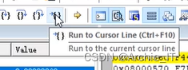
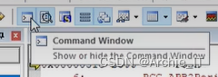
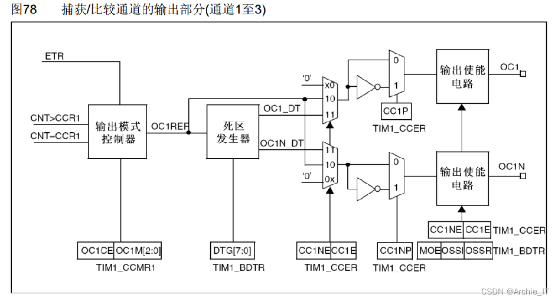
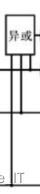
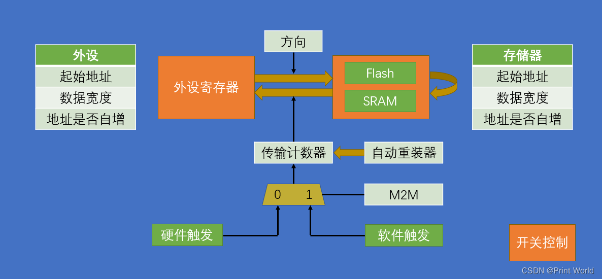
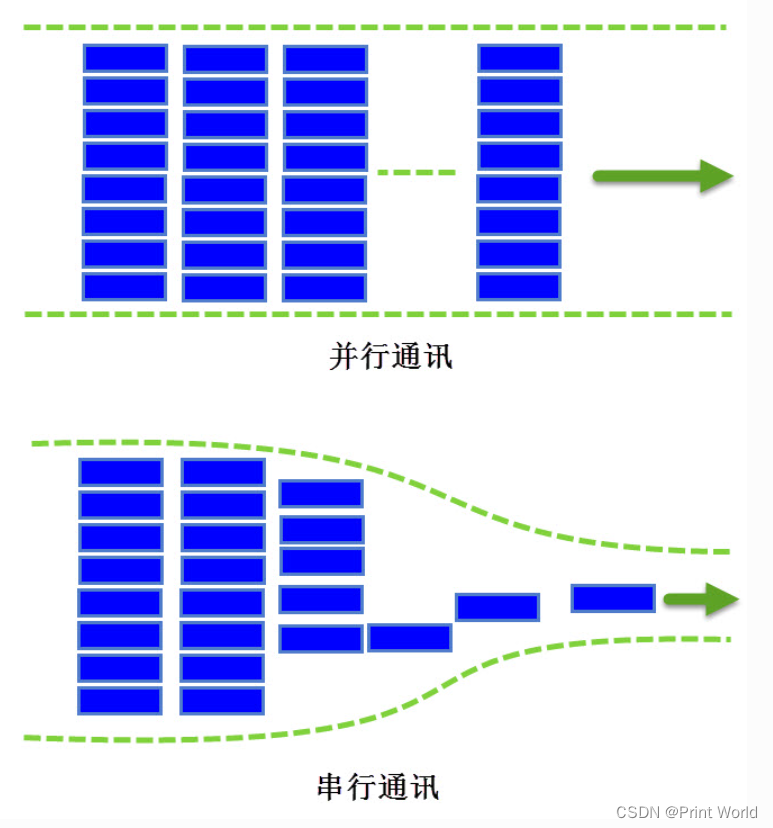
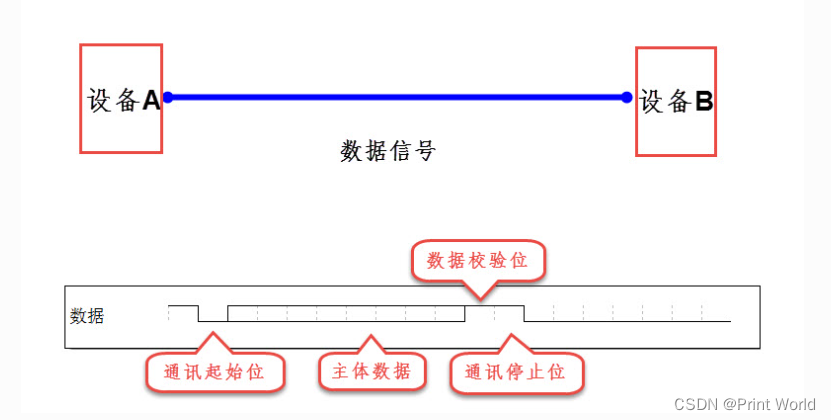
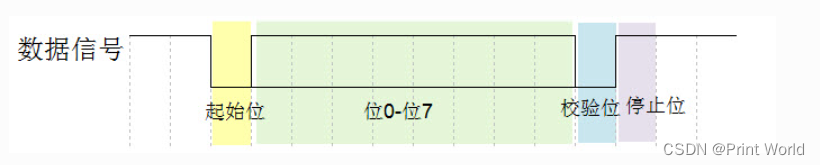

# STM-32

## 1-1 配件介绍

### 01\. 课程简介

-   程序纯手打，手把手教学
-   STM32最小系统板+面包板硬件平台  
    

> 该平台比较适合高校在校大学生学习STM32。

### 02\. 硬件设备

-   STM32最小系统+面包板
-   Windows10操作系统
-   万用表、示波器、镊子、剪刀等  
    

### 03\. 软件工具

[Keil5](https://so.csdn.net/so/search?q=Keil5&spm=1001.2101.3001.7020) MDK  


### 04\. 硬件套件


#### 4.1 面包板和跳线/飞线


#### 4.2 杜邦线和STM32最小系统板


#### 4.3 STLINK和OLED显示屏


#### 4.4 LED和按键


#### 4.5 电位器和蜂鸣器


#### 4.6 传感器和旋转编码器


#### 4.7 USB转串口和MPU6050


#### 4.8 Flash闪存和电机模块


#### 4.9 SG90舵机


### 05\. 配件清单


### 1-2 STM32简介

### 01\. STM32简介

-   STM32是ST公司基于ARM Cortex-M内核开发的32位微控制器
-   STM32常应用在嵌入式领域，如智能车、无人机、机器人、无线通信、物联网、工业控制、娱乐电子产品等
-   STM32功能强大、性能优异、片上资源丰富、功耗低，是一款经典的嵌入式微控制器

#### 1.1 STM32是什么

STM32是一系列由ST Microelectronics（意法半导体公司）推出的微控制器(MCU)。这些微控制器基于ARM Cortex-M架构，并且提供各种不同的封装和引脚配置。STM32系列中一些受欢迎的微控制器包括STM32F103，STM32F407和STM32F429。 [STM32微控制器](https://so.csdn.net/so/search?q=STM32%E5%BE%AE%E6%8E%A7%E5%88%B6%E5%99%A8&spm=1001.2101.3001.7020)以其低功耗，高性能和广泛的功能而闻名。它们通常用于**物联网设备**，可穿戴技术和其他需要低功耗和高性能的应用。 总体而言，STM32微控制器是许多开发人员的首选，因为它们的多功能性，可靠性和广泛的功能。

> ST：指意法半导体  
> M：指定微处理器  
> 32：表示计算机处理器位数

【官方描述】

> STM32 is a family of microcontrollers from STMicroelectronics, a multinational semiconductor company. STM32 chips are used in a wide range of applications, from simple microcontroller-based projects to complex systems for industrial and automotive use. STM32 chips are based on the ARM Cortex-M architecture and are available in a variety of different packages and pin configurations. Some popular STM32 chips include the STM32F103, STM32F407, and STM32F429 microcontrollers. STM32 chips are known for their low power consumption, high performance, and wide range of features. They are often used in **IoT (Internet of Things)** devices, wearable technology, and other applications where low power consumption and high performance are critical. Overall, STM32 chips are a popular choice for many developers due to their versatility, reliability, and wide range of features.

【MCU】

> **MCU**：微控制器单元（MicroController Unit）：是把中央处理器、存储器、定时/计数器（timer/counter）、各种输入输出接口等都集成在一块集成电路芯片上的微型计算机。

#### 1.2 STM32应用领域

STM32的应用领域包括但不限于：

1.  嵌入式领域：如智能车、无人机、机器人、无线通信、物联网、工业控制、娱乐电子产品、医疗设备、智能家居等。
2.  高速数据采集系统：使用STM32连接高速ADC和FPGA芯片，实现对高速信号的采集和处理，例如高速摄像头、高速激光测距仪等。
3.  自动驾驶控制系统：使用STM32连接多个传感器和执行器，例如摄像头、雷达、电机、电子罗盘等，并通过算法设计和优化，实现自动驾驶控制功能。
4.  机器人视觉系统：使用STM32连接多个摄像头和处理模块，例如OpenCV、CUDA等，并通过算法设计和优化，实现机器人的视觉导航、物体识别等功能。
5.  网络安全嵌入式设备：使用STM32连接加密模块和网络模块，实现网络安全通信和数据加密等功能，例如VPN、防火墙、数据加密存储等。
6.  人工智能嵌入式设备：使用STM32连接AI模块，例如人脸识别、语音识别、自然语言处理等，并通过编程和训练，实现智能化的应用，例如智能门禁、智能家居等。

总的来说，STM32在各个领域都有广泛的应用。

#### 1.3 STM32命名规则


#### 1.4 STM32选型


### 02\. ARM简介

-   ARM既指ARM公司，也指ARM处理器内核
-   ARM公司是全球领先的半导体知识产权（IP）提供商，全世界超过95%的智能手机和平板电脑都采用ARM架构
-   ARM公司设计ARM内核，半导体厂商完善内核周边电路并生产芯片

#### 2.1 ARM是什么

-   ARM既可以认为是一个**公司的名字** ，也可以认为是对**一类处理器的统称** ，还可以认为是**一种技术的名字** 。
-   ARM公司是专门从事基于**RISC技术芯片设计开发** 的公司，作为知识产权供应商，**本身不直接从事芯片生产，而是转让设计许可** ，由合作公司生产各具特色的芯片。
-   **ARM处理器的内核是统一的** ，由ARM公司提供，**而片内部件则是多样的** ，由各大半导体公司设计，这使得**ARM设计嵌入式系统的时候，可以基于同样的核心，使用不同的片内外设** ，从而具有很大的优势。

#### 2.2 ARM系列


### 03\. STM32开发板

#### 3.1 MCU简介


**STM32F103C8T6**

-   系列：主流系列STM32F1
-   内核：ARM Cortex-M3
-   主频：72MHz
-   RAM：20K（SRAM）
-   ROM：64K（Flash）
-   供电：2.0~3.6V（标准3.3V）
-   封装：LQFP48

#### 3.2 STM32开发板

**STM32硬件**：STM32F103C8T6最小系统板


#### 3.3 STM32硬件资源


### 04\. STM32系统架构

在小容量、中容量和 大容量产品中，主系统由以下部分构成：  
● 四个驱动单元：  
─ Cortex™-M3内核DCode总线(D-bus)，和系统总线(S-bus)  
─ 通用DMA1和通用DMA2  
● 四个被动单元  
─ 内部SRAM  
─ 内部闪存存储器  
─ FSMC  
─ AHB到APB的桥(AHB2APBx)，它连接所有的APB设备

这些都是通过一个多级的AHB总线构架相互连接的，如下图所示：


### 05\. STM32引脚定义

引脚图


###### STM32F103C8T6引脚定义  


1.  I = 输入，O = 输出，S = 电源， HiZ = 高阻
2.  FT：容忍5V
3.  可以使用的功能依选定的型号而定。对于具有较少外设模块的型号，始终是包含较小编号的功能模块。例如，某个型号只有1个SPI和2个USART时，它们即是SPI1和USART1及USART2。
4.  PC13，PC14和PC15引脚通过电源开关进行供电，而这个电源开关只能够吸收有限的电流(3mA)。因此这三个引脚作为输出引脚时有以下限制：在同一时间只有一个引脚能作为输出，作为输出脚时只能工作在2MHz模式下，最大驱动负载为30pF，并且不能作为电流源(如驱动LED)。
5.  这些引脚在备份区域第一次上电时处于主功能状态下，之后即使复位，这些引脚的状态由备份区域寄存器控制（这些寄存器不会被主复位系统所复位）。 关于如何控制这些IO口的具体信息，请参考STM32F10xxx参考手册的电池备份区域和BKP寄存器的相关章节。
6.  与LQFP64的封装不同，在TFBGA64封装上没有PC3，但提供了V REF+ 引脚。
7.  此类复用功能能够由软件配置到其他引脚上(如果相应的封装型号有此引脚)，详细信息请参考STM32F10xxx参考手册的复用功能I/O章节和调试设置章节。
8.  VFQFPN36封装的引脚2和引脚3、LQFP48和LQFP64封装的引脚5和引脚6、和TFBGA64封装的C1和C2，在芯片复位后默认配置为OSC\_IN和OSC\_OUT功能脚。软件可以重新设置这两个引脚为PD0和PD1功能。但对于LQFP100/BGA100封装，由于PD0和PD1为固有的功能引脚，因此没有必要再由软件进行重映像设置。更多详细信息请参考STM32F10xxx参考手册的复用功能I/O章节和调试设置章节。在输出模式下，PD0和PD1只能配置为50MHz输出模式。

### 06\. STM32启动配置

在STM32F10xxx里，可以通过BOOT\[1:0\]引脚选择三种不同启动模式。


### 07\. STM32最小系统电路


### 08\. 附录

参考: [【STM32】江科大STM32学习笔记汇总](https://blog.csdn.net/u010249597/article/details/134762513)

## 2-1 软件安装

### 01\. MDK安装

MDK 源自德国的 KEIL 公司，是 RealView MDK 的简称。在全球 MDK 被超过 10 万的[嵌入式开发](https://so.csdn.net/so/search?q=%E5%B5%8C%E5%85%A5%E5%BC%8F%E5%BC%80%E5%8F%91&spm=1001.2101.3001.7020)工程师使用。目前最新版本为：

MDK6，该版本使用 uVision5 IDE 集成开发环境，是目前针对 ARM 处理器，尤其是 Cortex M 内核处理器的最佳开发工具。

[MDK5](https://so.csdn.net/so/search?q=MDK5&spm=1001.2101.3001.7020) 向后兼容 MDK4 和 MDK3 等，以前的项目同样可以在 MDK5 上进行开发(但是头文件方面得全部自己添加)， MDK5 同时加强了针

对 Cortex-M 微控制器开发的支持，并且对传统的开发模式和界面进行升级，MDK5 由两个部分组成：MDK Core 和 Software Packs。其

中，Software Packs 可以独立于工具链进行新芯片支持和中间库的升级。

1.1 双击MDK530.EXE文件，点击Next


1.2 接受许可协议，点击Next  


1.3 选择软件安装路径，点击Next  


1.4 随便填写信息，然后点击Next  


1.5 安装过程中  


1.6 选择安装


1.7 点击Finish  


1.8 全部点击右上角X关掉即可  


1.9 选择是  


至此[Keil MDK](https://so.csdn.net/so/search?q=Keil%20MDK&spm=1001.2101.3001.7020)\-ARM就安装完成，可以新建工程使用了。但为了不受编译代码4K大小限制和用户体验，就需要购买授权，或注册。

### 02\. Keil5注册

2.1 以管理员的方式运行keil软件  


2.2 选择否即可  


2.3 打开注册管理窗口（File -> License Management），并复制CID。  


2.4 打开注册机，执行如下几步。  


2.5 将注册码添加到注册窗口中  


### 03\. 支持包安装

3.1 双击Keil.STM32F1xx\_DFP.2.2.0.pack  


3.2 选择Finishu，完成安装  


### 04\. ST-LINK驱动安装

4.1 默认STM32 STLink是没有驱动的，需要安装驱动  


4.2 找到Keil安装目录下，安装64位驱动

> D:\\Keil\_v5\\ARM\\STLink\\USBDriver  
> 

4.3 选择下一页


4.4 点击完成即可  


4.5 驱动安装好之后，黄色感叹号消失，表示安装成功


### 05\. USB转串口驱动

5.1 双击CH341SER.EXE，点击安装


5.2 点击确定


5.3 安装好驱动之后，通过设备管理器查看如下图所示


### 2-2  创建工程

### **新建工程**

桌面新建存放STM32项目的文件夹：STM32Project

打开keil5,project,new uVersion Project，新建文件夹  2-2 STM32工程模板，其中新建工程文件Project，保存

选择芯片STM-STM32F1-STM32F103-STM32F103C8。OK，关闭弹出窗口

### **移植固件**

**启动文件**

```python
STM32F10x_StdPeriph_Lib_V3.5.0\Libraries\CMSIS\CM3\DeviceSupport\ST\STM32F10x\startup\arm
```

全选复制启动文件，在2-2 STM32工程模板中新建 Start 文件夹，放入 Start 文件夹

**外设寄存器描述文件、时钟文件**

```python
STM32F10x_StdPeriph_Lib_V3.5.0\Libraries\CMSIS\CM3\DeviceSupport\ST\STM32F10x
stm32f10x.h
system_stm32f10x.c
system_stm32f10x.h
```

复制上面三个文件，放入 Start  文件夹

**内核寄存器描述文件**

```python
STM32F10x_StdPeriph_Lib_V3.5.0\Libraries\CMSIS\CM3\CoreSupport
```

复制两个文件，放入 Start  文件夹

**keil5 添加start文件到工程**


**添加头文件路径**


**主文件**

2-2 STM32工程模板  文件夹中，新建 User 文件夹


**调试器配置**


**基于库函数编程**

2-2 STM32工程模板  文件夹中，新建 Library 文件夹，复制下列文件到 Library 文件夹

```python
STM32F10x_StdPeriph_Lib_V3.5.0\Libraries\STM32F10x_StdPeriph_Driver\src
STM32F10x_StdPeriph_Lib_V3.5.0\Libraries\STM32F10x_StdPeriph_Driver\inc
```

后放入keil5的工程中


**User中放入 头文件配置文件 与 中断文件**

```
STM32F10x_StdPeriph_Lib_V3.5.0\Project\STM32F10x_StdPeriph_Template
stm32f10x_conf.h
stm32f10x_it.c
stm32f10x_it.h
```

keil5工程中添加以上文件


**设置宏定义**


### 2-3 工程编译与下载

main.c

```c
#include "stm32f10x.h"                  // Device header
int main(void)
{
	//点亮PC13端口上的灯
	/*
	PC13由端口GPIOC端口控制，（GPIOC端口管理16个引脚：PC0~PC15）
	首先启动GPIOC时钟，调用RCC_APB2PeriphClockCmd（）函数
	RCC：（Reset and Clock Control）复位与时钟控制
	APB2：GPIOC由这条总线控制
	PeriphClockCmd：使能或禁用外围设备的时钟
	*/
	//周边时钟控制，参数：（外设，状态）
	RCC_APB2PeriphClockCmd(RCC_APB2Periph_GPIOC, ENABLE);
	//配置端口模式
	GPIO_InitTypeDef GPIO_InitStructure;
	GPIO_InitStructure.GPIO_Mode = GPIO_Mode_Out_PP;//通用推挽输出
	GPIO_InitStructure.GPIO_Pin = GPIO_Pin_13;
	GPIO_InitStructure.GPIO_Speed = GPIO_Speed_50MHz;
	GPIO_Init(GPIOC, &GPIO_InitStructure);
	GPIO_SetBits(GPIOC, GPIO_Pin_13);//高电平
	//GPIO_ResetBits(GPIOC, GPIO_Pin_13);//低电平
	while(1)
	{
		
	}
}	
```


### 启动文件型号分类 根据 芯片缩写 选择


```
STM32F10x_StdPeriph_Lib_V3.5.0\Libraries\CMSIS\CM3\DeviceSupport\ST\STM32F10x\startup\arm
```


### 工程结构


**startup文件**

程序执行最基本的文件，复位中断函数：板子上电或复位按钮按下时，进入中断，先进行系统初始化，然后调用main函数

SystemInit函数定义在system_xx.c / .h

另外定义了其他中断，定义在stm32f10x_it.c / .h，达到触发条件后，自动执行

## 3-1GPIO输出

### 01\. [GPIO](https://so.csdn.net/so/search?q=GPIO&spm=1001.2101.3001.7020)简介

-   GPIO（General Purpose Input Output）通用输入输出口
-   可配置为8种输入输出模式
-   引脚电平：0V~3.3V，部分引脚可容忍5V
-   输出模式下可控制端口输出高低电平，用以驱动LED、控制蜂鸣器、模拟通信协议输出时序等
-   输入模式下可读取端口的高低电平或电压，用于读取按键输入、外接模块电平信号输入、ADC电压采集、模拟通信协议接收数据等

每个GPI/O端口有两个32位配置[寄存器](https://so.csdn.net/so/search?q=%E5%AF%84%E5%AD%98%E5%99%A8&spm=1001.2101.3001.7020)(GPIOx\_CRL，GPIOx\_CRH)，两个32位数据寄存器(GPIOx\_IDR和GPIOx\_ODR)，一个32位置位/复位寄存器(GPIOx\_BSRR)，一个16位复位寄存器(GPIOx\_BRR)和一个32位锁定寄存器(GPIOx\_LCKR)。  
根据[数据手册](https://so.csdn.net/so/search?q=%E6%95%B0%E6%8D%AE%E6%89%8B%E5%86%8C&spm=1001.2101.3001.7020)中列出的每个I/O端口的特定硬件特征， GPIO端口的每个位可以由软件分别配置成多种模式。

-   输入浮空
    
-   输入上拉
    
-   输入下拉
    
-   模拟输入
    
-   开漏输出
    
-   推挽式输出
    
-   推挽式复用功能
    
-   开漏复用功能
    

每个I/O端口位可以自由编程，然而I/0端口寄存器必须按32位字被访问(不允许半字或字节访问)。GPIOx\_BSRR和GPIOx\_BRR寄存器允许对任何GPIO寄存器的读/更改的独立访问；这样，在读和更改访问之间产生IRQ时不会发生危险。

### 02\. GPIO基本结构

**系统结构**


**基本结构**


### 03\. GPIO位结构

I/O端口位的基本结构


5伏兼容I/O端口位的基本结构


### 04\. GPIO模式

通过配置GPIO的端口配置寄存器，端口可以配置成以下8种模式


**4种输入模式**：

-   输入浮空
-   输入上拉
-   输入下拉
-   模拟输入

**4种输出模式**：

-   开漏输出
-   开漏复用功能
-   推挽式输出
-   推挽式复用功能

**3种最大翻转速度**:

-   最大输出速度为2MHz
-   最大输出速度为10MHz
-   最大输出速度为50MHz

#### 4.1 输入浮空

输入高为高，输入低为低，无输入漂浮不定。

浮空输入模式下，I/O端口的电平信号直接进入输入数据寄存器。也就是说，I/O的电平状态是不确定的，==完全由外部输入决定==；如果在该引脚悬空（在无信号输入）的情况下，读取该端口的电平是不确定的。所以在要读取外部信号时通常配置IO口为浮空输入模式。  


#### 4.2 输入上拉

**输入高为高，输入低为低，无输入拉高**

上拉输入模式下，I/O端口的电平信号直接进入输入数据寄存器。但是在==I/O端口悬空==（在无信号输入）的情况下，输入端的电平可以保持在==高电平==；并且在==I/O端口输入为低电平==的时候，输入端的电平为==低电平==。


#### 4.3 输入下拉

**输入高为高，输入低为低，无输入拉低**

下拉输入模式下，IO口工作方式刚好和上拉模式相反。I/O端口的电平信号直接进入输入数据寄存器。但是在I/O端口悬空（在无信号输入）的情况下，输入端的电平可以保持在低电平；并且在I/O端口输入为高电平的时候，输入端为高电平。  


#### 4.4 模拟输入

模拟输入模式下，I/O端口的模拟信号（电压信号，而非电平信号）==直接模拟输入到片上外设模块==，比如ADC模块等等。


#### 4.5 开漏输出

p-mos不起作用，输入1时，n-mos关闭，io电平不由单片机控制，由外部电路控制；输入0时，n-mos开启，io电平为低电平

**高电平没有驱动能力，只用低电平驱动能力**

开漏输出模式下，通过设置位设置/清除寄存器或者输出数据寄存器的值，控制MOS管的导通。这里要注意N-MOS管，当设置输出的值为1的时候，N-MOS管处于关闭状态，此时I/O端口的电平就不会由输出的高低电平决定，而是由I/O端口外部的上拉或者下拉决定；当设置输出的值为0的时候，N-MOS管处于开启状态，此时I/O端口的电平就是低电平。同时，I/O端口的电平也可以通过输入电路进行读取；注意，I/O端口的电平不一定是输出的电平。通常使用开漏输出时外部要加一个上拉电阻。


#### 4.6 开漏复用功能

开漏复用输出模式，与开漏输出模式很是类似。只是输出的高低电平的来源，不是让CPU直接写输出数据寄存器，取而代之利用片上外设模块的复用功能输出来决定的。


#### 4.7 推挽式输出

推挽输出模式下，通过设置位设置/清除寄存器或者输出数据寄存器的值，控制P-MOS管和N-MOS管的导通来控制IO口输出高电平还是低电平。这里要注意P-MOS管和N-MOS管，当==设置输出的值为1==的时候，P-MOS管处于开启状态，N-MOS管处于关闭状态，此时==I/O端口==的电平就由P-MOS管决定为==高电平==；当==设置输出的值为0==的时候，P-MOS管处于关闭状态，N-MOS管处于开启状态，此时==I/O端口==的电平就由N-MOS管决定为==低电平==。同时，I/O端口的电平也可以通过输入电路进行读取；注意，此时I/O端口的电平一定是输出的电平。


#### 4.8 推挽式复用功能

推挽复用输出模式，与推挽输出模式很是类似。只是输出的高低电平的来源，不是让CPU直接写输出数据寄存器，取而代之利用片上外设模块的复用功能输出来决定的。


### 05\. LED和蜂鸣器简介

-   LED：发光二极管，正向通电点亮，反向通电不亮
-   有源蜂鸣器：内部自带振荡源，将正负极接上直流电压即可持续发声，频率固定
-   无源蜂鸣器：内部不带振荡源，需要控制器提供振荡脉冲才可发声，调整提供振荡脉冲的频率，可发出不同频率的声音  
    

硬件电路  


### 06\. 面包板


面包板描述


面包板使用示例


### 

### 3-2GPIO相关API

#### 3个时钟外设

声明在rcc.h中

```c
//外设时钟控制函数：第一个参数选择外设，第二个参数选择使能或失能
void RCC_AHBPeriphClockCmd(uint32_t RCC_AHBPeriph, FunctionalState NewState);
void RCC_APB2PeriphClockCmd(uint32_t RCC_APB2Periph, FunctionalState NewState);
void RCC_APB1PeriphClockCmd(uint32_t RCC_APB1Periph, FunctionalState NewState);
```

```c
void RCC_AHBPeriphClockCmd(uint32_t RCC_AHBPeriph, FunctionalState NewState)
/**
  * @brief  Enables or disables the AHB peripheral clock.
  * @param  RCC_AHBPeriph: specifies the AHB peripheral to gates its clock.
  *   
  *   For @b STM32_Connectivity_line_devices, this parameter can be any combination
  *   of the following values:        
  *     @arg RCC_AHBPeriph_DMA1
  *     @arg RCC_AHBPeriph_DMA2
  *     @arg RCC_AHBPeriph_SRAM
  *     @arg RCC_AHBPeriph_FLITF
  *     @arg RCC_AHBPeriph_CRC
  *     @arg RCC_AHBPeriph_OTG_FS    
  *     @arg RCC_AHBPeriph_ETH_MAC   
  *     @arg RCC_AHBPeriph_ETH_MAC_Tx
  *     @arg RCC_AHBPeriph_ETH_MAC_Rx
  * 
  *   For @b other_STM32_devices, this parameter can be any combination of the 
  *   following values:        
  *     @arg RCC_AHBPeriph_DMA1
  *     @arg RCC_AHBPeriph_DMA2
  *     @arg RCC_AHBPeriph_SRAM
  *     @arg RCC_AHBPeriph_FLITF
  *     @arg RCC_AHBPeriph_CRC
  *     @arg RCC_AHBPeriph_FSMC
  *     @arg RCC_AHBPeriph_SDIO
  *   
  * @note SRAM and FLITF clock can be disabled only during sleep mode.
  * @param  NewState: new state of the specified peripheral clock.
  *   This parameter can be: ENABLE or DISABLE.
  * @retval None
  */
```

```c
void RCC_APB2PeriphClockCmd(uint32_t RCC_APB2Periph, FunctionalState NewState)
/**
  * @brief  Enables or disables the High Speed APB (APB2) peripheral clock.
  * @param  RCC_APB2Periph: specifies the APB2 peripheral to gates its clock.
  *   This parameter can be any combination of the following values:
  *     @arg RCC_APB2Periph_AFIO, RCC_APB2Periph_GPIOA, RCC_APB2Periph_GPIOB,
  *          RCC_APB2Periph_GPIOC, RCC_APB2Periph_GPIOD, RCC_APB2Periph_GPIOE,
  *          RCC_APB2Periph_GPIOF, RCC_APB2Periph_GPIOG, RCC_APB2Periph_ADC1,
  *          RCC_APB2Periph_ADC2, RCC_APB2Periph_TIM1, RCC_APB2Periph_SPI1,
  *          RCC_APB2Periph_TIM8, RCC_APB2Periph_USART1, RCC_APB2Periph_ADC3,
  *          RCC_APB2Periph_TIM15, RCC_APB2Periph_TIM16, RCC_APB2Periph_TIM17,
  *          RCC_APB2Periph_TIM9, RCC_APB2Periph_TIM10, RCC_APB2Periph_TIM11     
  * @param  NewState: new state of the specified peripheral clock.
  *   This parameter can be: ENABLE or DISABLE.
  * @retval None
  */
```

```c
void RCC_APB1PeriphClockCmd(uint32_t RCC_APB1Periph, FunctionalState NewState)
/**
  * @brief  Enables or disables the Low Speed APB (APB1) peripheral clock.
  * @param  RCC_APB1Periph: specifies the APB1 peripheral to gates its clock.
  *   This parameter can be any combination of the following values:
  *     @arg RCC_APB1Periph_TIM2, RCC_APB1Periph_TIM3, RCC_APB1Periph_TIM4,
  *          RCC_APB1Periph_TIM5, RCC_APB1Periph_TIM6, RCC_APB1Periph_TIM7,
  *          RCC_APB1Periph_WWDG, RCC_APB1Periph_SPI2, RCC_APB1Periph_SPI3,
  *          RCC_APB1Periph_USART2, RCC_APB1Periph_USART3, RCC_APB1Periph_USART4, 
  *          RCC_APB1Periph_USART5, RCC_APB1Periph_I2C1, RCC_APB1Periph_I2C2,
  *          RCC_APB1Periph_USB, RCC_APB1Periph_CAN1, RCC_APB1Periph_BKP,
  *          RCC_APB1Periph_PWR, RCC_APB1Periph_DAC, RCC_APB1Periph_CEC,
  *          RCC_APB1Periph_TIM12, RCC_APB1Periph_TIM13, RCC_APB1Periph_TIM14
  * @param  NewState: new state of the specified peripheral clock.
  *   This parameter can be: ENABLE or DISABLE.
  * @retval None
  */
```

#### gpio.h库函数

```c
void GPIO_DeInit(GPIO_TypeDef* GPIOx);//复位GPIO，参数GPIOA、GPIOB
void GPIO_AFIODeInit(void);//复位AFIO外设

//重要！gpio初始化函数，用结构体初始化
void GPIO_Init(GPIO_TypeDef* GPIOx, GPIO_InitTypeDef* GPIO_InitStruct);

void GPIO_StructInit(GPIO_InitTypeDef* GPIO_InitStruct);//结构体变量赋一个默认值

/*gpio读取函数*/
//读取单片机外部输入的数据（输入数据寄存器）
uint8_t GPIO_ReadInputDataBit(GPIO_TypeDef* GPIOx, uint16_t GPIO_Pin);//读取某个针脚输入数据
uint16_t GPIO_ReadInputData(GPIO_TypeDef* GPIOx);//读取整个输入数据寄存器（如GPIOA）

//读取单片机自己当前的输出电平（输出数据寄存器）
uint8_t GPIO_ReadOutputDataBit(GPIO_TypeDef* GPIOx, uint16_t GPIO_Pin);//读取某个针脚输输出数据
uint16_t GPIO_ReadOutputData(GPIO_TypeDef* GPIOx);//读取整个输出数据寄存器

/*gpio写入函数*/
void GPIO_SetBits(GPIO_TypeDef* GPIOx, uint16_t GPIO_Pin);//将指定端口设置为高电平
void GPIO_ResetBits(GPIO_TypeDef* GPIOx, uint16_t GPIO_Pin);//将指定端口设置为低电平
//如GPIO_ResetBits(GPIOA,GPIO_Pin_0);

void GPIO_WriteBit(GPIO_TypeDef* GPIOx, uint16_t GPIO_Pin, BitAction BitVal);//根据BitVal设置指定端口电平
//如GPIO_WriteBit(GPIOA,GPIO_Pin_0,Bit_RESET)，设置低电平
//如GPIO_WriteBit(GPIOA,GPIO_Pin_0,Bit_SET)，设置高电平


void GPIO_Write(GPIO_TypeDef* GPIOx, uint16_t PortVal);//对16个端口进行写入操作
//如GPIO_Write(GPIOA, ~0x0001)，设置A0端口为低电平
//如GPIO_Write(GPIOA, 0x0001)，设置A0端口为高电平
```

#### gpio初始化

这里初始化GPIOA，用结构体给初始化函数传参

```c
//首先实例化结构体对象，并初始化
GPIO_InitTypeDef GPIO_InitStructure;

//用.操作列出待初始化属性，右键查看定义，如查看GPIO_Mode，出现：
/*  GPIOMode_TypeDef GPIO_Mode;    /*!< Specifies the operating mode for the selected pins.
                                      This parameter can be a value of @ref GPIOMode_TypeDef */*/
/*ctrl+f查找GPIOMode_TypeDef，gpio的8种工作模式
typedef enum
{ GPIO_Mode_AIN = 0x0,//模拟输入
  GPIO_Mode_IN_FLOATING = 0x04,//浮空输入
  GPIO_Mode_IPD = 0x28,//下拉输入
  GPIO_Mode_IPU = 0x48,//上拉输入
  GPIO_Mode_Out_OD = 0x14,//开漏输出
  GPIO_Mode_Out_PP = 0x10,//推挽输出
  GPIO_Mode_AF_OD = 0x1C,//复用开漏
  GPIO_Mode_AF_PP = 0x18//复用推挽
}GPIOMode_TypeDef;
这里用推挽输出*/                                          
GPIO_InitStructure.GPIO_Mode = GPIO_Mode_Out_PP;//推挽输出
/*右键查看GPIO_Pin定义，选择Class:member，出现
  uint16_t GPIO_Pin;   /*!< Specifies the GPIO pins to be configured.
                       This parameter can be any value of @ref GPIO_pins_define */*/
//ctrl+f 查找GPIO_pins_define，选择GPIO_Pin_0
GPIO_InitStructure.GPIO_Pin = GPIO_Pin_0;

//用同样的方法
GPIO_InitStructure.GPIO_Speed  = GPIO_Speed_50MHz;

GPIO_Init(GPIOA, GPIO_InitStructure);
//此时gpio-A0被设置成以50MHz推挽输出模式
//有8个gpio外设，分别是GPIOA~GPIOG；每个gpio外设可设置16个pin，可用于16个引脚输出输入电平
```

#### dalay函数

点灯文件中新建System文件夹，移入delay.c和delay.h

点击品字箱子，添加工程System，移入delay.c和delay.h

点击魔术棒，C/C++,添加头文件路径

新文件引用延时函数

```c
#include "delay.h"
Delay_ms(500);
```

### 

### 3-3点灯

### 01\. GPIO之LED[电路图](https://so.csdn.net/so/search?q=%E7%94%B5%E8%B7%AF%E5%9B%BE&spm=1001.2101.3001.7020)

电路图示例1


电路图示例2


### 02\. GPIO之LED接线图


### 03\. LED闪烁程序示例

main.c

```c
#include "stm32f10x.h"                  // Device header
#include "delay.h"
int main(void)
{

	RCC_APB2PeriphClockCmd(RCC_APB2Periph_GPIOA,ENABLE);
	
	GPIO_InitTypeDef GPIO_InitStructure;	
	GPIO_InitStructure.GPIO_Mode = GPIO_Mode_Out_PP;
	GPIO_InitStructure.GPIO_Pin = GPIO_Pin_0;
	GPIO_InitStructure.GPIO_Speed  = GPIO_Speed_50MHz;	
	GPIO_Init(GPIOA,&GPIO_InitStructure);
	
	GPIO_WriteBit(GPIOA, GPIO_Pin_0,Bit_SET);
	while(1)
	{
		GPIO_WriteBit(GPIOA, GPIO_Pin_0,Bit_SET);
		Delay_ms(500);
		GPIO_WriteBit(GPIOA, GPIO_Pin_0,Bit_RESET);	
		Delay_ms(500);
	}
}


```

### 04\. LED闪烁程序下载

接线图如下图所示：


点击下载，现象为LED闪烁。

### 05\. LED[流水灯](https://so.csdn.net/so/search?q=%E6%B5%81%E6%B0%B4%E7%81%AF&spm=1001.2101.3001.7020)接线图


### 06\. LED流水灯程序示例

main.c

```c
#include "stm32f10x.h"                  // Device header
#include "delay.h"
int main(void)
{

	RCC_APB2PeriphClockCmd(RCC_APB2Periph_GPIOA,ENABLE);
	
	GPIO_InitTypeDef GPIO_InitStructure;	
	GPIO_InitStructure.GPIO_Mode = GPIO_Mode_Out_PP;
	GPIO_InitStructure.GPIO_Pin = GPIO_Pin_All ;
	GPIO_InitStructure.GPIO_Speed  = GPIO_Speed_50MHz;	
	GPIO_Init(GPIOA,&GPIO_InitStructure);
	
	GPIO_WriteBit(GPIOA, GPIO_Pin_0,Bit_SET);
	while(1)
	{
		/*使用GPIO_Write，同时设置GPIOA所有引脚的高低电平，实现LED流水灯*/
		GPIO_Write(GPIOA, ~0x0001);	//0000 0000 0000 0001，PA0引脚为低电平，其他引脚均为高电平，注意数据有按位取反
		Delay_ms(500);				//延时100ms
		GPIO_Write(GPIOA, ~0x0002);	//0000 0000 0000 0010，PA1引脚为低电平，其他引脚均为高电平
		Delay_ms(500);				//延时100ms
		GPIO_Write(GPIOA, ~0x0004);	//0000 0000 0000 0100，PA2引脚为低电平，其他引脚均为高电平
		Delay_ms(500);				//延时100ms
		GPIO_Write(GPIOA, ~0x0008);	//0000 0000 0000 1000，PA3引脚为低电平，其他引脚均为高电平
		Delay_ms(500);				//延时100ms
		GPIO_Write(GPIOA, ~0x0010);	//0000 0000 0001 0000，PA4引脚为低电平，其他引脚均为高电平
		Delay_ms(500);				//延时100ms
		GPIO_Write(GPIOA, ~0x0020);	//0000 0000 0010 0000，PA5引脚为低电平，其他引脚均为高电平
		Delay_ms(500);				//延时100ms
		GPIO_Write(GPIOA, ~0x0040);	//0000 0000 0100 0000，PA6引脚为低电平，其他引脚均为高电平
		Delay_ms(500);				//延时100ms
		GPIO_Write(GPIOA, ~0x0080);	//0000 0000 1000 0000，PA7引脚为低电平，其他引脚均为高电平
		Delay_ms(500);				//延时100ms
	}
}


```

### 07\. 蜂鸣器接线图


### 08\. 蜂鸣器程序示例

main.c

```c
#include "stm32f10x.h"                  // Device header
#include "delay.h"
int main(void)
{

	RCC_APB2PeriphClockCmd(RCC_APB2Periph_GPIOB,ENABLE);
	
	GPIO_InitTypeDef GPIO_InitStructure;	
	GPIO_InitStructure.GPIO_Mode = GPIO_Mode_Out_PP;
	GPIO_InitStructure.GPIO_Pin = GPIO_Pin_12;
	GPIO_InitStructure.GPIO_Speed  = GPIO_Speed_50MHz;	
	GPIO_Init(GPIOB,&GPIO_InitStructure);
	
	while(1)
	{
		GPIO_WriteBit(GPIOB, GPIO_Pin_12,Bit_SET);
		Delay_ms(500);
		GPIO_WriteBit(GPIOB, GPIO_Pin_12,Bit_RESET);	
		Delay_ms(500);
	}
}


```

## 3-4GPIO输入

___

### 按键简介

按键：常见的输入设备，按下导通，松手断开


 按键抖动：由于按键内部使用的是机械式弹簧片来进行通断的，所以在按下和松手的瞬间会伴随有一连串的抖动


###  传感器模块简介

传感器模块：传感器元件（传感器模块就是利用传感器元件，比如如下图的光敏电阻/热敏电阻/红外接收管等）的电阻会随外界模拟量的变化而变化（比如光线越强，光敏电阻的阻值就越小），通过与定值电阻进行**串联分压**即可得到模拟电压输出，再通过电压比较器进行二值化（二值化就是要么是高要么是低）即可得到数字电压输出


 如下为传感器模块的基本电路，详细介绍。


这个N1就是传感器元件所代表的可变电阻，它的阻值可以根据环境的光线、温度等模拟两进行变化

N1上面的R1，是和N1进行分压的定值电阻，R1和N1串联，一端接VCC一端接VSS，这就构成了基本的分压电路，AO电压就由R1和N1两个电阻的分压得到。

AO电压就由R1和N1两个电阻的分压得到。

N1左边的C2是一个滤波电容，它是为了给中间的电压输出进行滤波的，用来滤除一些干扰，保证输出电压波形的平滑。一般我们在电路中遇到一端接到电路中，另一端接地的电容，都可以考虑一下是不是滤波电容的作用，并不是电路的主要框架，这时候我们进行分析电路时，就可以先把这个电容抹掉，这样就可使我们的电路分析更加简单。

二值化输出是通过这个LM393芯片来完成，是一个电压比较器芯片，里面由两个独立的电压比较器电路，然后剩下的是VCC和GND供电，里面电容是一个电源供电的滤波电容，**这个电压比较器其实就是一个运算放大器**，当同向输入端的电压大于反向输入端的电压时，输出就会瞬间升高为最大值也就是输出接VCC；反之当同向输入端的电压小于反向输入端的电压时，输出就会瞬间降为最小值，也就是输出接GND，这样就可以对一个模拟电压进行二值化了，DO就是最后数字电压的输出。


 可以用**上下拉电阻的思维分析传感器电阻的阻值变化对输出电压的影响**，如下：

AO这个输出端可以把它想象成一个水平杆子（下图红色直线），R1上拉电阻相当于拴在上方的弹簧，将杆子向上拉，N1下拉电阻相当于拴在地面的弹簧，将杆子向下拉；电阻的阻值越小，弹簧的拉力就越强，杆子的高度就相当于电路中的电压，杠子向拉力强的一端偏移（取决于两个弹簧的弹力之差）；如果上下弹簧拉力一致，杆子处于居中位置也就是电路输出VCC/2的电压；如果上面的阻值小，拉力强，输出电压就会变高；反之下面的阻值小，输出电压就会变低 ；如果上下拉电阻的阻值都为0，就是两个无穷大的力在对抗，在电路中呈现的就是电源短路（应该避免）。单片机电路中会常出现这种上拉下拉电阻，比如弱上拉，强上拉等（强和弱就是指电阻阻值的大小，也就是这个弹簧拉力大小） ，最终输出电压就是在弹簧拉扯下最终杆子的高低。

 

### 按键和传感器硬件电路

下接按键的方式如下，**一般来说我们用下接按键的方**式，这个原因和LED的接法类似，是电路设计习惯和规范；下左图中，按键按下时，PA0直接下拉到GND，此时读取PA0口的电压就是低电平，在这种接法下，必须要求PA0是上拉输入模式，使按键松下，还是高电平。下右图，外部接了一个上拉电阻，当按键松手时，引脚由于上拉作用，保持为高电平，此时PA0引脚就可以配置为浮空输入或者上拉输入。


上接按键的方式（仅了解）如下，左图1中，要求将PA0必须配置成下拉输入模式，松手时，引脚会回到默认值低电平。   

 

传感器模块电路如下，DO是数字输出端口，PA0用于读取数字量。


### [C语言数据类型](https://so.csdn.net/so/search?q=C%E8%AF%AD%E8%A8%80%E6%95%B0%E6%8D%AE%E7%B1%BB%E5%9E%8B&spm=1001.2101.3001.7020) 

<table><tbody><tr><td><p><strong><span>关键字</span></strong></p></td><td><p><strong><span>位数</span></strong></p></td><td><p><strong><span>表示范围</span></strong></p></td><td><p><strong><span>stdint</span></strong><strong><span>关键字</span></strong></p></td><td><p><strong><span>ST</span></strong><strong><span>关键字</span></strong></p></td><td><p><strong><span>ST</span></strong><strong><span>关键字</span></strong></p></td></tr><tr><td><p><span>char</span></p></td><td><p><span>8</span></p></td><td><p><span>-128&nbsp;~&nbsp;127</span></p></td><td><p><span>int8_t</span></p></td><td><p><span>s8</span></p></td><td><p><span>s8</span></p></td></tr><tr><td><p><span>unsigned&nbsp;char</span></p></td><td><p><span>8</span></p></td><td><p><span>0&nbsp;~&nbsp;255</span></p></td><td><p><span>uint8_t</span></p></td><td><p><span>u8</span></p></td><td><p><span>u8</span></p></td></tr><tr><td><p><span>short</span></p></td><td><p><span>16</span></p></td><td><p><span>-32768&nbsp;~&nbsp;32767</span></p></td><td><p><span>int16_t</span></p></td><td><p><span>s16</span></p></td><td><p><span>s16</span></p></td></tr><tr><td><p><span>unsigned&nbsp;short</span></p></td><td><p><span>16</span></p></td><td><p><span>0&nbsp;~&nbsp;65535</span></p></td><td><p><span>uint16_t</span></p></td><td><p><span>u16</span></p></td><td><p><span>u16</span></p></td></tr><tr><td><p><span>int</span></p></td><td><p><span>32</span></p></td><td><p><span>-2147483648&nbsp;~&nbsp;2147483647</span></p></td><td><p><span>int32_t</span></p></td><td><p><span>s32</span></p></td><td><p><span>s32</span></p></td></tr><tr><td><p><span>unsigned&nbsp;int</span></p></td><td><p><span>32</span></p></td><td><p><span>0&nbsp;~&nbsp;4294967295</span></p></td><td><p><span>uint32_t</span></p></td><td><p><span>u32</span></p></td><td><p><span>u32</span></p></td></tr><tr><td><p><span>long</span></p></td><td><p><span>32</span></p></td><td><p><span>-2147483648&nbsp;~&nbsp;2147483647</span></p></td><td></td><td></td><td></td></tr><tr><td><p><span>unsigned&nbsp;long</span></p></td><td><p><span>32</span></p></td><td><p><span>0&nbsp;~&nbsp;4294967295</span></p></td><td></td><td></td><td></td></tr><tr><td><p><span>long&nbsp;long</span></p></td><td><p><span>64</span></p></td><td><p><span>-(2^64)/2&nbsp;~&nbsp;(2^64)/2-1</span></p></td><td><p><span>int64_t</span></p></td><td></td><td></td></tr><tr><td><p><span>unsigned&nbsp;long&nbsp;long</span></p></td><td><p><span>64</span></p></td><td><p><span>0&nbsp;~&nbsp;(2^64)-1</span></p></td><td><p><span>uint64_t</span></p></td><td></td><td></td></tr><tr><td><p><span>float</span></p></td><td><p><span>32</span></p></td><td><p><span>-3.4e38&nbsp;~&nbsp;3.4e38</span></p></td><td></td><td></td><td></td></tr><tr><td><p><span>double</span></p></td><td><p><span>64</span></p></td><td><p><span>-1.7e308&nbsp;~&nbsp;1.7e308</span></p></td><td></td><td></td><td></td></tr></tbody></table>

单片机中用char也就是int8\_t来存放整数而不是字符等，有一定的区别需要注意。

C语言提供的stdint头文件，使用新的名字。比如int8\_t就是char的新名字，表示的意思就是8位        整型的数据,右边加个\_t 表示这是用typedef重新命名的变量类型。

ST关键字是老版本用的。

### [C语言宏定义](https://so.csdn.net/so/search?q=C%E8%AF%AD%E8%A8%80%E5%AE%8F%E5%AE%9A%E4%B9%89&spm=1001.2101.3001.7020)

**前为新，后为旧**

关键字：#define

用途：用一个字符串代替一个数字，便于理解，防止出错；提取程序中经常出现的参数，便于快速修改

定义宏定义：     #define ABC 12345

引用宏定义：     int a = ABC;    //等效于int a = 12345;

### C语言typedef

**前为旧，后为新**

**typedef只能专门给变量类型换名字，更加安全（不是变量类型的名字是不行的）；所以宏定义的改名范围更宽**       

关键字：typedef

用途：将一个比较长的变量类型名换个名字，便于使用

定义typedef：     typedef unsigned char uint8\_t;

引用typedef：      uint8\_t a;    //等效于unsigned char a;

### C语言结构体

结构体也是一种数据类型，比如char、int等是基本数据类型；数组是由许多相同基本数据类型的组合；与数组一样，但是**若组合不同的数据类型就用结构体**。

关键字：struct

用途：数据打包，不同类型变量的集合

定义结构体变量：struct{char x; int y; float z;} StructName;

StructName是结构体变量的名字

因为结构体变量类型较长，所以通常用typedef更改变量类型名

引用结构体成员：

StructName.x = 'A';   

StructName.y = 66;  

StructName.z = 1.23;

或是用结构体指针方式，因为结构体是一种组合数据类型，在函数之间的数据传递中，通常用的是地址传递而不是值传递（看一下指针教程）

杠大于号，结构体成员名

pStructName->x = 'A';    //pStructName为结构体的地址 

pStructName->y = 66;   

pStructName->z = 1.23;

代码理解，如下

```cobol
struct c；
//定义了一个结构体类型，名字叫c，这是不完整的，还需加一个附加声明{打包的变量}，如下

struct {char x; int y; float z} c；
//定义一个结构体变量，名字叫c，其中包含char型的x，int型的y和float型的z三个子项

c.x = 'a';
c.y = 66;
c.z = 1.23;
//结构体的引用，需写结构体名字c，然后用运算符取索引，索引是结构体子项的名字，如结构体名称.结构体子项
```

 

使用typedef 解决结构体名字太长的问题

```cpp
struct {char x; int y; float z} c；
struct {char x; int y; float z} d；
typedef struct {char x; int y; float z} struct_t;
typedef struct {
char x;
int y;
float z
} struct_t;

struct {
char x;
int y;
float z
}

typedef struct {
char x;
int y;
float z
} struct_t;

struct_t c；
struct_t d；
c.x = 'a';
```

### C语言枚举

和结构体差不多，也是一个数据类型

**只能在它给定的参数列表里赋值，不能赋其它的值**

**枚举值也不是必须赋值给枚举变量的，也可以赋值给随意一个变量。所以说枚举也是一个宏定义的集合。**

关键字：enum

用途：1.定义一个取值受限制的整型变量，用于限制变量取值范围（比如我们定义一个变量用来存储星期的值，理论上这个变量只能取1到7的值，若定义的是整形变量这时可能会出现数据不合法，比如星期8的情况出现，所以这时候需要定义一个**取值受限制的整形变量**，这个变量就是枚举）；2.宏定义的集合

定义枚举变量： 

enum{FALSE = 0, TRUE = 1} EnumName;  （需要用逗号，限制EnumName的取值范围）

因为枚举变量类型较长，所以通常用typedef更改变量类型名：

typedef  enum{FALSE = 0, TRUE = 1}  EnumName\_t  

使用新的名字EnumName\_t  来定义枚举变量，命名为EnumName：

EnumName\_t   EnumName

只能引用下面两种：

EnumName = FALSE； // EnumName = 0

EnumName = TRUE ； // EnumName = 1

引用枚举成员：     EnumName = FALSE;     EnumName = TRUE;

### 其它

对于C语言来说，主要由两个功能，一个是定义数据，一个是引用数据。

数组的引用如下：

```cobol
int b[5]；
//是定义了一个5个int型数据的数组，名字叫b

b[0] = 11;
//数组的引用是数组名b，加上方括号取索引；数组的第0个元素等于11

b[1] = 66;
```


### 3-5按键输入

### 01\. 按键控制LED接线图


### 02\. 按键控制LED程序示例

代码提示快捷键：ctrl+alt+空格

led.h

```c
#ifndef __LED_H
#define __LED_H

void LED_Init(void);
void LED1_ON(void);
void LED1_OFF(void);
void LED1_Turn(void);
void LED2_ON(void);
void LED2_OFF(void);
void LED2_Turn(void);

#endif

```

led.c

```c
#include "stm32f10x.h"                  // Device header

/**
  * 函    数：LED初始化
  * 参    数：无
  * 返 回 值：无
  */
void LED_Init(void)
{
	/*开启时钟*/
	RCC_APB2PeriphClockCmd(RCC_APB2Periph_GPIOA, ENABLE);		//开启GPIOA的时钟
	
	/*GPIO初始化*/
	GPIO_InitTypeDef GPIO_InitStructure;
	GPIO_InitStructure.GPIO_Mode = GPIO_Mode_Out_PP;
	GPIO_InitStructure.GPIO_Pin = GPIO_Pin_1 | GPIO_Pin_2;
	GPIO_InitStructure.GPIO_Speed = GPIO_Speed_50MHz;
	GPIO_Init(GPIOA, &GPIO_InitStructure);						//将PA1和PA2引脚初始化为推挽输出
	
	/*设置GPIO初始化后的默认电平*/
	GPIO_SetBits(GPIOA, GPIO_Pin_1 | GPIO_Pin_2);				//设置PA1和PA2引脚为高电平
}

/**
  * 函    数：LED1开启
  * 参    数：无
  * 返 回 值：无
  */
void LED1_ON(void)
{
	GPIO_ResetBits(GPIOA, GPIO_Pin_1);		//设置PA1引脚为低电平
}

/**
  * 函    数：LED1关闭
  * 参    数：无
  * 返 回 值：无
  */
void LED1_OFF(void)
{
	GPIO_SetBits(GPIOA, GPIO_Pin_1);		//设置PA1引脚为高电平
}

/**
  * 函    数：LED1状态翻转
  * 参    数：无
  * 返 回 值：无
  */
void LED1_Turn(void)
{
	if (GPIO_ReadOutputDataBit(GPIOA, GPIO_Pin_1) == 0)		//获取输出寄存器的状态，如果当前引脚输出低电平
	{
		GPIO_SetBits(GPIOA, GPIO_Pin_1);					//则设置PA1引脚为高电平
	}
	else													//否则，即当前引脚输出高电平
	{
		GPIO_ResetBits(GPIOA, GPIO_Pin_1);					//则设置PA1引脚为低电平
	}
}

/**
  * 函    数：LED2开启
  * 参    数：无
  * 返 回 值：无
  */
void LED2_ON(void)
{
	GPIO_ResetBits(GPIOA, GPIO_Pin_2);		//设置PA2引脚为低电平
}

/**
  * 函    数：LED2关闭
  * 参    数：无
  * 返 回 值：无
  */
void LED2_OFF(void)
{
	GPIO_SetBits(GPIOA, GPIO_Pin_2);		//设置PA2引脚为高电平
}

/**
  * 函    数：LED2状态翻转
  * 参    数：无
  * 返 回 值：无
  */
void LED2_Turn(void)
{
	if (GPIO_ReadOutputDataBit(GPIOA, GPIO_Pin_2) == 0)		//获取输出寄存器的状态，如果当前引脚输出低电平
	{                                                  
		GPIO_SetBits(GPIOA, GPIO_Pin_2);               		//则设置PA2引脚为高电平
	}                                                  
	else                                               		//否则，即当前引脚输出高电平
	{                                                  
		GPIO_ResetBits(GPIOA, GPIO_Pin_2);             		//则设置PA2引脚为低电平
	}
}

```

key.h

```c
#ifndef __KEY_H
#define __KEY_H

void Key_Init(void);
uint8_t Key_GetNum(void);

#endif

```

key.c

```c
#include "stm32f10x.h"                  // Device header
#include "Delay.h"

/**
  * 函    数：按键初始化
  * 参    数：无
  * 返 回 值：无
  */
void Key_Init(void)
{
	/*开启时钟*/
	RCC_APB2PeriphClockCmd(RCC_APB2Periph_GPIOB, ENABLE);		//开启GPIOB的时钟
	
	/*GPIO初始化*/
	GPIO_InitTypeDef GPIO_InitStructure;
	GPIO_InitStructure.GPIO_Mode = GPIO_Mode_IPU;
	GPIO_InitStructure.GPIO_Pin = GPIO_Pin_1 | GPIO_Pin_11;
	GPIO_InitStructure.GPIO_Speed = GPIO_Speed_50MHz;
	GPIO_Init(GPIOB, &GPIO_InitStructure);						//将PB1和PB11引脚初始化为上拉输入
}

/**
  * 函    数：按键获取键码
  * 参    数：无
  * 返 回 值：按下按键的键码值，返回0则代表没有按键按下
  * 注意事项：此函数是阻塞式操作，当按键按住不放时，函数会卡住，直到按键松手
  */
uint8_t Key_GetNum(void)
{
	uint8_t KeyNum = 0;		//定义变量，默认键码值为0
	
	if (GPIO_ReadInputDataBit(GPIOB, GPIO_Pin_1) == 0)			//读PB1输入寄存器的状态，如果为0，则代表按键1按下
	{
		Delay_ms(20);											//延时消抖
		while (GPIO_ReadInputDataBit(GPIOB, GPIO_Pin_1) == 0);	//等待按键松手
		Delay_ms(20);											//延时消抖
		KeyNum = 1;												//置键码为1
	}
	
	if (GPIO_ReadInputDataBit(GPIOB, GPIO_Pin_11) == 0)			//读PB11输入寄存器的状态，如果为0，则代表按键2按下
	{
		Delay_ms(20);											//延时消抖
		while (GPIO_ReadInputDataBit(GPIOB, GPIO_Pin_11) == 0);	//等待按键松手
		Delay_ms(20);											//延时消抖
		KeyNum = 2;												//置键码为2
	}
	
	return KeyNum;			//返回键码值，如果没有按键按下，所有if都不成立，则键码为默认值0
}

```

main.c

```c
#include "stm32f10x.h"                  // Device header
#include "delay.h"
#include "LED.h"
#include "KEY.h"

uint8_t KeyNum;

int main(void)
{
	LED_Init();
	Key_Init();
	
	while(1)
	{
		KeyNum = Key_GetNum();
		if(KeyNum == 1)
		{
			LED1_Turn();
		}
		if(KeyNum == 2)
		{
			LED2_Turn();
		}
	}
}


```

### 03\. [光敏传感器](https://so.csdn.net/so/search?q=%E5%85%89%E6%95%8F%E4%BC%A0%E6%84%9F%E5%99%A8&spm=1001.2101.3001.7020)控制Buzzer接线图


### 04\. 有源[蜂鸣器](https://so.csdn.net/so/search?q=%E8%9C%82%E9%B8%A3%E5%99%A8&spm=1001.2101.3001.7020)原理图

[电路图](https://so.csdn.net/so/search?q=%E7%94%B5%E8%B7%AF%E5%9B%BE&spm=1001.2101.3001.7020)：  


实物图：


### 05\. 光敏传感器控制Buzzer示例

遮住光敏电阻，亮一个灯，输出高电平；光敏电阻接受灯光，亮两个灯，输出低电平；

buzzer.h

```c
#ifndef __BUZZER_H
#define __BUZZER_H

void BUZZER_Init(void);
void BUZZER_ON(void);
void BUZZER_OFF(void);
void BUZZER_Turn(void);

#endif

```

buzzere.c

```c
#include "stm32f10x.h"                  // Device header

void BUZZER_Init(void)
{
	RCC_APB2PeriphClockCmd(RCC_APB2Periph_GPIOB, ENABLE);
	
	GPIO_InitTypeDef GPIO_InitStructure;
	GPIO_InitStructure.GPIO_Mode = GPIO_Mode_Out_PP;
	GPIO_InitStructure.GPIO_Pin = GPIO_Pin_12;
	GPIO_InitStructure.GPIO_Speed = GPIO_Speed_50MHz;
	GPIO_Init(GPIOB, &GPIO_InitStructure);	
	
	GPIO_SetBits(GPIOB,GPIO_Pin_12);//低电平触发，设置为高电平，默认不点亮
}

void BUZZER_ON(void)
{
	GPIO_ResetBits(GPIOB,GPIO_Pin_12);
}

void BUZZER_OFF(void)
{
	GPIO_SetBits(GPIOB,GPIO_Pin_12);
}
void BUZZER_Turn(void)
{
	if(GPIO_ReadOutputDataBit(GPIOB,GPIO_Pin_12) == 0)//如果当前A1脚为0
	{
		GPIO_SetBits(GPIOB,GPIO_Pin_12);//设置A1为1
	}
	else//如果当前A1脚为1
	{
		GPIO_ResetBits(GPIOB,GPIO_Pin_12);//设置A1为0
	}
}

```

lightsensor.h

```c
#ifndef __LIGHT_SENSOR_H
#define __LIGHT_SENSOR_H

void LightSensor_Init(void);
uint8_t LightSensor_Get(void);

#endif
```

lightsensor.c

```c
#include "stm32f10x.h"                  // Device header
#include "Delay.h"
void LightSensor_Init(void)
{
	RCC_APB2PeriphClockCmd(RCC_APB2Periph_GPIOB, ENABLE);
	
	GPIO_InitTypeDef GPIO_S;
	GPIO_S.GPIO_Mode = GPIO_Mode_IPU;//上拉输入，**输入高为高，输入低为低，无输入拉高**
	GPIO_S.GPIO_Pin = GPIO_Pin_13;
	GPIO_S.GPIO_Speed = GPIO_Speed_50MHz;
	
	GPIO_Init(GPIOB, &GPIO_S);
}

uint8_t LightSensor_Get(void)
{
	return GPIO_ReadInputDataBit(GPIOB,GPIO_Pin_13);
}


```

main.c

```c
#include "stm32f10x.h"                  // Device header
#include "delay.h"
#include "Buzzer.h"
#include "LightSensor.h"
int main(void)
{
	BUZZER_Init();
	LightSensor_Init();
	while(1)
	{
		if(LightSensor_Get() == 1)//暗
		{
			BUZZER_ON();
		}
		else
		{
			BUZZER_OFF();
		}		
	}
}


```

## 4-1OLED显示屏

TM32调试方式

串口调试：通过[串口通信](https://so.csdn.net/so/search?q=%E4%B8%B2%E5%8F%A3%E9%80%9A%E4%BF%A1&spm=1001.2101.3001.7020)，将调试信息发送到电脑端，电脑使用串口助手显示调试信息

显示屏调试：直接将显示屏连接到单片机，将调试信息打印在显示屏上

Keil调试模式：借助Keil软件的调试模式，可使用单步运行、设置断点、查看寄存器及变量等功能

### 02\. OLED简介

OLED，即有机发光二极管（ Organic Light Emitting Diode ）。 OLED 由于同时具备自发光，不需背光源、对比度高、厚度薄、视角广、反应速度快、可用于挠曲性面板、使用温度范围广、构造及制程较简单等优异之特性，被认为是下一代的平面显示器新兴应用技术。

LCD 都需要背光，而 OLED 不需要，因为它是自发光的。这样同样的显示 OLED 效果要来得好一些。以目前的技术，OLED 的尺寸还难以大型化，但是分辨率确可以做到很高。在此我们使用的是0.96寸OLED显示屏，该屏有以下特点：

1）0.96 寸 OLED 有黄蓝，白，蓝三种颜色可选；其中黄蓝是屏上 1/4 部分为黄光，下 3/4 为蓝；而且是固定区域显示固定颜色，颜色和显示区域均不能修改；白光则为纯白，也就是黑底白字；蓝色则为纯蓝，也就是黑底蓝字。

2）分辨率为 128\*64

3）多种接口方式；OLED 裸屏总共种接口包括：6800、8080 两种并行接口方式、3 线或 4 线的串行 SPI 接口方式、 IIC 接口方式（只需要 2 根线就可以控制 OLED 了！），这五种接口是通过屏上的 BS0~BS2 来配置的。

4）本屏开发了两种接口的 Demo 板，接口分别为七针的 SPI/IIC 兼容模块，四针的IIC 模块。两种模块都很方便使用；希望大家根据实际需求来选择不同的模块。


### 03\. 0.96寸OLED模块

**SPI模块**：

1.  GND 电源地
    
2.  VCC 电源正（3～5.5V）
    
3.  D0 OLED 的 D0 脚，在 SPI 和 IIC 通信中为时钟管脚
    
4.  D1 OLED 的 D1 脚，在 SPI 和 IIC 通信中为数据管脚
    
5.  RES OLED 的 RES#脚，用来复位（低电平复位）
    
6.  DC OLED 的 D/C#E 脚，数据和命令控制管脚
    
7.  CS OLED 的 CS#脚，也就是片选管脚
    


**IIC接口模块**

1.  GND 电源地
    
2.  VCC 电源正（3～5.5V）
    
3.  SCL OLED 的 D0 脚，在 IIC 通信中为时钟管脚
    
4.  SDA OLED 的 D1 脚，在 IIC 通信中为数据管脚
    


### 04\. 0.96寸OLED驱动IC

本屏所用的驱动 IC 为 SSD1306；其具有内部升压功能；所以在设计的时候不需要再专一设计升压电路；当然了本屏也可以选用外部升压，具体的请详查数据手册。SSD1306 的每页包含了128 个字节，总共 8 页，这样刚好是 128\*64 的点阵大小。这点与 1.3 寸 OLED 驱动 IC SSD1106稍有不同，SSD1106 每页是 132 个字节，也是 8 页。所以在用 0.96 寸 OLED 移植 1.3 寸 OLED 程序的时候需要将 0.96 寸的显示地址向右偏移 2，这样显示就正常了；否则在用 1.3 寸的时候 1.3寸屏右边会有 4 个像素点宽度显示不正常或是全白，这点大家注意一下。其它的 SSD1306 和SSD1106 区别不大。

### 05\. 0.96寸OLED原理图

**SPI版本**


**IIC版本**


### 06\. 硬件电路


### 07\. OLED驱动函数


相关函数和作用


### 4-2OLED显示屏

**目录**

[示例程序（OLED驱动函数）](https://blog.csdn.net/m0_61712829/article/details/132427220#t0)

 [keil的调试模式](https://blog.csdn.net/m0_61712829/article/details/132427220#t1)

[0\. 江协科技/江科大-STM32入门教程-各章节详细笔记-查阅传送门-STM32标准库开发\_stm32江协大 csdn-CSDN博客文章浏览阅读3.4k次，点赞47次，收藏143次。江协科技/江科大-STM32标准库开发-各章节详细笔记-传送门至各个章节笔记。基本上课程讲的每句都详细记录，方便回顾。\_stm32江协大 csdnhttps://blog.csdn.net/m0\_61712829/article/details/132434192?spm=1001.2014.3001.5501](https://blog.csdn.net/m0_61712829/article/details/132434192?spm=1001.2014.3001.5501 "0. 江协科技/江科大-STM32入门教程-各章节详细笔记-查阅传送门-STM32标准库开发_stm32江协大 csdn-CSDN博客") 知识点get：

1.STM32的引脚上电后，如果不初始化，默认是浮空输入模式，在这个模式下，引脚不会输出电平，所以不会有什么影响；做实践项目时，最好还是给[OLED](https://so.csdn.net/so/search?q=OLED&spm=1001.2101.3001.7020)用电源供电，不用GPIO口供电

2.字符需要单引号括起来。字符串用双引号括起来

3.c语言不能直接写二进制的数，只能用十六进制来代替。

___

### [示例程序](https://so.csdn.net/so/search?q=%E7%A4%BA%E4%BE%8B%E7%A8%8B%E5%BA%8F&spm=1001.2101.3001.7020)（OLED驱动函数）

### 

程序如下：

main.c

```cobol
#include "stm32f10x.h" // Device header
#include "Delay.h"
#include "OLED.h"

int main(void)

{
    OLED_Init(); //初始化OLED
    OLED_ShowChar(1,1,'A'); //第一行第一列显示字符A
    OLED_ShowString(1,3,"hellow word!");//第一行第三列开始显示字符串hello word！
    OLED_ShowNum(2,1,12345,5); //显示无符号十进制数字，第二行第一列开始，长度为5
    OLED_ShowSignedNum(2,7,-66,2); //显示有符号（带正负号）十进制数，长度为2
    OLED_ShowHexNum(3,1,0xAA55,4); //显示十六进制数，长度为4
    OLED_ShowBinNum(4,1,0xAA55,16); // 显示二进制数，c语音不能直接写二进制数，只能用16进制数替换，16位
    //OLED_Clear(); //清屏；若只想清除部分字符，可以用OLED_ShowString在想清除的地方显示空格即可

    while(1)

    {

    }

}
```

OLED.c

```cobol

```

OLED.h

```cpp

```

OLED.Font.h

```cpp

```

###  keil的调试模式

这个方法可以精确追踪我们的程序是如何运行的，如果你不清楚程序是如何一步一步运行的，那在这个调试模式里单步运行探索一下，相信你对程序的运行逻辑会有更深的理解。

工程选型，Debug里可以选择是哪个方式进行仿真，左边为仿真器进行仿真进行电脑模拟，右边为在硬件上进行仿真


 基于硬件仿真，需要提前编译一下，确保无误。

点击此处进入调试模式


上面窗口为c语言翻译成的汇编程序，左边窗口是寄存器组和状态标志位等信息（单片机硬件底层很重要的东西）


  复位

全速运行

停止全速运行

单步运行

跳过当前行单步运行

跳出当前函数单步运行

跳到光标指定行单步运行

 黄色箭头是下一步将要执行的代码

 红色点为断电，程序会到断电停下

 命令窗口，点击可打开或关闭命令窗口

 反汇编窗口，点击可打开或关闭

 符号窗口，在这里可实时查看程序中所有的变量值

 在符号窗口中，右键可查看具体某个值的变化

 串口显示

逻辑分析仪

 外设菜单栏，系统资源查看，这里可看到所有的外设寄存器

比如选择GPIOA，右边显示GPIOA外设的所有寄存器

这个ODR0就是PA0的输出数据寄存器，会实时显示输出寄存器的变化

___

所以当遇到一个比较难得程序，比如不知道程序是如何执行的、想要看一大堆变量却不方便显示、想看一下寄存器是不是配置正确等都可以考虑使用一下这个keil自带的调试模式。

不能在调试模式下修改程序的，修改程序，需要退出调试模式，再编译，再进入调试模式。

调试模式下，还有很多的工具都是非常强大的，大家可以自己去了解一下。


## 5-1EXIT外部中断

中断系统是管理和执行中断的逻辑结构，[外部中断](https://so.csdn.net/so/search?q=%E5%A4%96%E9%83%A8%E4%B8%AD%E6%96%AD&spm=1001.2101.3001.7020)是众多能产生中断的外设之一，所以本节我们就借助外部中断来学习一下中断系统。在以后学习其它外设的时候，也是会经常和中断打交道的。

___

### 中断系统

中断：在主程序运行过程中，出现了特定的中断**触发条件（中断源**。比如对于外部中断来说，可以是引脚发生了电平跳变；对于定时器来说，可以是定时的时间到了；对于串口通信来说，可以是接收到了数据），使得CPU暂停当前正在运行的程序，转而去处理中断程序，处理完成后又返回原来被暂停的位置继续运行。（就好比晚上睡觉前定了个闹钟，时间到了提醒你，不管时间到不到你可以安心睡觉）。

中断优先级：当有多个中断源同时申请中断时，CPU会根据中断源的**轻重缓急**进行裁决，优先响应更加**紧急**的中断源。（这个中断优先级是我们根据程序设计的需求，自己设置的）。

中断嵌套：（**中断程序再次中断，二次中断现象**）当一个中断程序正在运行时，又有**新的更高优先级**的中断源申请中断，CPU再次暂停当前中断程序，转而去处理新的中断程序，处理完成后依次进行返回。（也是为了照顾非常**紧急**的中断）。

### 中断执行流程

中断程序的执行流程如下，当它执行到某个地方时，外设的中断条件满足了，那这时，无论主程序是在干什么事情（比如OLED显示程序才执行一半，Delay函数还在等待等）中断来了，主程序都得立即暂停，程序由硬件电路自动跳转到中断程序中，当中断程序执行完之后，程序再返回被暂停的地方继续运行（这个暂停的地方，叫做**断点**）。为了程序能在中断返回后继续原来的工作，在中断执行前，会对程序的现场进行保护，中断执行后，会再返回现场，这样保证主程序被中断了，回来之后也能继续执行。


中断嵌套的执行流程如下。当一个中断正在执行时，又有新的优先级更高的中断来，那个旧中断会被打断，执行新的中断，新的中断结束，再继续执行原来的中断，原来的中断结束，再继续主程序，这就是中断嵌套的执行流程。


c语言中，中断的执行流程如下。上面是主函数，while（1）死循环里就是主程序，正常情况下，程序就是在主程序中不断循环执行，当中断条件满足时，主程序就会暂停，然后自动跳转到中断程序里运行，中断程序执行完之后，再返回主程序执行。一般中断程序都是在一个子函数里，这个函数不需要我们调用，当中断来临时，**由硬件自动调用这个函数**，这就是在c语言中，中断的执行流程。


___

### STM32中断

多个可屏蔽中断通道（中断源），包含EXTI（外部中断）、TIM、ADC（模数转换器）、USART（串口）、SPI、I2C、RTC（实时时钟）等多个外设。（几乎所有模块都能申请中断）

使用[NVIC](https://so.csdn.net/so/search?q=NVIC&spm=1001.2101.3001.7020)统一管理中断，每个中断通道都拥有16个可编程的优先等级，可对优先级进行分组，进一步设置抢占优先级和响应优先级。

NVIC就是STM32中用来管理中断、分配优先级的，NVIC的中断优先级共有16个等级。

EXTIx是外部中断对应的中断资源。

下图为stm32的中断资源，上面灰色的是内核中断（我们一般不用，了解即可），下面不是灰色的部分就是stm32外设的中断了，外设电路检测到有什么异常或事件，需要提示一下CPU的时候，它就可以申请中断，让程序调到对应的中断函数里运行一次，用来处理这个异常或事件。图中最右边是中断的地址，因为程序中的中断函数，它的地址是由编译器来分配的，是不固定的，但是我们的中断跳转，由于硬件的限制，只能跳到固定的地址执行程序，所以为了硬件能够跳转到一个不固定的中断函数里，这里就需要在内存中定义一个地址的列表，这个列表的地址是固定的，中断发生后，就跳到这个固定位置，然后在这个固定位置，由编译器，再加上一个跳转到中断函数的代码，这样中断跳转就可以跳转到任意位置了，这个中断地址的列表，就叫**中断向量表**，相当于中断跳转的一个跳板，不过**我们用c编程，是不需要管这个中断向量表的**，因为编译器都帮我们做好了。


___

### NVIC基本结构

NVIC（**嵌套中断向量控制器**），在stm32中，它是用来统一分配中断优先级和管理中断的，**NVIC是一个内核外设**，是CPU的小助手（如果把中断全接到cpu上，会很麻烦，毕竟CPU主要是用来运算的），NVIC有很多输入口，下图中线上划了个斜杠上面写了n（这个意思是：**一个外设可能会同时占用多个中断通道，所以这里有n条线**），然后NVIC只有一个输出口，NVIC根据每个中断的优先级分配中断的先后顺序，之后通过右边这一输出口就告诉CPU该处理哪个中断，对于中断先后顺序分配的任务，CPU不需要知道

举个例子：比如**CPU**是医生，如果医院只有一个医生时，当看病人很多时，医生就得先安排一下先看谁后看谁，如果有紧急的病人，那还得让紧急的病人最先来，这个安排先后顺序的任务很繁琐会影响医生看病的效率，所以医院就安排了一个叫号系统（**NVIC**），来病人了统一取号并且根据病人的等级，分配一个优先级，然后叫号系统看一下现在在排队的病人，优先叫号紧急的病人，最后叫号系统给医生输出的就是一个一个排好队的病人，医生就可以专心看病了。（**EXTI、TIM、ADC等就是病人**）


___

### NVIC优先级分组

为了处理不同形式的优先级，STM32的NVIC可以对优先级进行分组，分为抢占优先级和响应优先级。

**抢占优先级和响应优先级的区别，例子理解**：还想一下病人叫号的例子，对于紧急的病人，其实有两种形式的优先。一种是，上一个病人1在看病，外面排队了很多病人，当病人1看完后，外面排队中的紧急病人最先进去看病即使这个紧急病人是最后来的，这种**在排队中的插队的就叫响应优先级**，响应优先级高的可以插队提前看病。另一种是，上一个病人1在看病，外面排队中的病人2比病人1更加紧急，病人2可以不等病人1看完直接冲到医生的屋里，让病人1先靠边站，先给病人2看病，病人2看完病接着病人1看病，然后外面排队的病人再进来，这种形式的优先级就是中断嵌套，**这种决定是不是可以中断嵌套的优先级，就叫抢占优先级**，抢占优先级高的，可以进行中断嵌套。

为了将优先级区分为抢占优先级和响应优先级，就需要对这16个优先级优先级进行分组，NVIC的中断优先级由优先级寄存器的4位（0~15，4位二进制，对应16个优先级）决定，这4位可以进行切分，分为高n位的抢占优先级和低4-n位的响应优先级

优先级的**数值越小，优先级越高**，0就是最高优先级

**抢占优先级高的可以中断嵌套，响应优先级高的可以优先排队**，抢占优先级和响应优先级均相同的按中断号排队（中断号是中断表的左边数字，数值小的优先响应），所以stm32的中断不存在先来后到的排队方式，在任何时候都是优先级高的先响应。

下表，因为优先级总共是4位，所以就有（0,4）、（1.3）、（2，2）、（3,1）、（4、0）这五种分组方式，分组0，就是0位的抢占等级，取值为0，4位的响应等级，取值为0~15，分组1234雷同。这个分组方式是我们在程序中自己进行选择的，选好分组方式后，就要注意抢占优先级和响应优先级的取值范围了，不要超出这个表里规定的取值范围。

<table><tbody><tr><td><p>分组方式</p></td><td><p>抢占优先级</p></td><td><p>响应优先级</p></td></tr><tr><td><p>分组0</p></td><td><p>0位，取值为0</p></td><td><p>4位，取值为0~15</p></td></tr><tr><td><p>分组1</p></td><td><p>1位，取值为0~1</p></td><td><p>3位，取值为0~7</p></td></tr><tr><td><p>分组2</p></td><td><p>2位，取值为0~3</p></td><td><p>2位，取值为0~3</p></td></tr><tr><td><p>分组3</p></td><td><p>3位，取值为0~7</p></td><td><p>1位，取值为0~1</p></td></tr><tr><td><p>分组4</p></td><td><p>4位，取值为0~15</p></td><td><p>0位，取值为0</p></td></tr></tbody></table>

### EXTI简介

EXTI（Extern Interrupt）外部中断

EXTI可以监测指定GPIO口的电平信号，当其指定的GPIO口产生电平变化时，EXTI将立即向NVIC发出中断申请，经过NVIC裁决后即可中断CPU主程序，使CPU执行EXTI对应的中断程序。（简单说：**引脚电平变化，申请中断**）

支持的触发方式（引脚电平的变化类型）：上升沿（电平从低电平变到高电平的瞬间触发中断）/下降沿（电平从高电平变到低电平的瞬间触发中断）/双边沿（上升沿和下降沿都可以触发中断）/软件触发（程序执行代码就能触发中断）

支持的GPIO口（外部中断引脚）：所有GPIO口都能触发中断，但相**同的Pin不能同时触发中断**（比如PA0和PB0不能同时使用，智能选一个作为中断引脚；所以如果有多个中断引脚要选择不同的pin引脚，比如PA0和PA1、PB3就可以）

通道数：总共有20个中断线路。16个GPIO\_Pin（对应GPIO\_pin0到15，是外部中断的主要功能），外加PVD输出、RTC闹钟、USB唤醒、以太网唤醒（这4个中断线路，是因为外部中断有个功能是从低功耗模式的停止模式下唤醒STM32那对于PVD电源电压检测，当从电源从电池过压恢复时就需要PVD借助一下外部中断的退出停止模式；对于RTC闹钟来说，有时候为了省电，RTC定一个闹钟之后，STM32回进入停止模式，等到闹钟响的时候再唤醒，这叶需要借助外部中断，剩余USB唤醒、以太网唤醒也是类似的作用）

触发响应方式：**中断响应**（**引脚电平触发中断，申请中断，让CPU执行中断函数**）/**事件响应**（**不会触发中断，而是触发别的外设操作**，属于外设之间的联合工作。外部中断的信号不会通向CPU而是通向其它外设，用来触发其它外设的操作，比如触发ADC转换、触发DMA等）

___

### EXTI基本结构

外部中断的整体结构图如下：

首先，最左边是**GPIO口的外设**，每个GPIO外设有16个引脚，所以进来16根线；如果每个引脚占用一个通道，那EXTI的16个通道是不够用的，所以在这里会有一个AFIO中断引脚选择的电路模块，这个**AFIO就是一个数据选择器**（可以将图中前面的3个GPIO外设的16个引脚中的其中一个连接到后面的EXTI通道（16个GPIO通道），**所以对于PA0\\PB0\\PC0这些，通过AFIO选择之后只有其中一个能接到EXTI的通道0上**），然后通过AFIO选择后的16个通道，就能接到了EXTI边沿检测及控制电路上，同时下面这4个蹭网的外设（PVD\\PTC\\USB\\ETH）也是并列接进来的，这些加起来就**组成了EXTI的20个输入信号**，然后经过EXTI电路之后，**分为了两种输出，也就是中断响应和事件响应**（上面接到了NVIC用来触发中断，下面有20条输出线路到了其它外设，也就是事件响应）

注意点：EXTI9\_5是外部中断的5,6,7,8,9分到了一个通道里，EXTI15\_10也是一样；也就是说外部中断的9到5会触发同一个中断函数，15到10也会触发同一个中断函数；在编程的时候，我们在这两个中断函数里，需要再根据标志位区分到底是哪个中断进来的。（本来20路输入，应该有20路中断的输出，可能20个输出太多了比较占用NVIC的通道资源，所以就把其中的外部中断9~5，15~10，给分到了一个通道）


___

### AFIO复用IO口内部电路

内部电路就是一系列的数据选择器，如下图的最上面输入是PA0\\PB0\\PC0等尾号都是0，然后通过数据选择器最终选择一个，连接到EXTI0上，上面写的文字是说配置这个寄存器的哪一个位就可以决定选择哪一个输入，图中后面部分内容都雷同。

AFIO主要用于引脚复用功能的选择和重定义（也就是数据选择器的作用）。

在STM32中，AFIO主要完成两个任务：复用功能引脚重映射（就是最开始提到的**引脚定义表**，当想把**默认复用功能换到重定义功能时，就是用AFIO来完成的**，这也是AFIO的一大主要功能）、中断引脚选择。


___

### EXTI内部电路框图 

EXTI的右边就是20根输入线，然后输入线首先进入边沿检测电路，在上面的上升沿寄存器和下降沿寄存器可以选择是上升沿触发还是下降沿触发或者两个都触发，接着硬件触发信号和软件中断寄存器的值就进入到这个或门的输入端（也就是任意一个为1，或门就可以输出1），然后触发信号通过这个或门后就兵分两路，上一路是触发中断的，下一路是触发事件的：触发中断首先会置一个挂起寄存器（挂起寄存器相当于一个中断标志位，可以读取这个寄存器判断是哪个通道触发的中断，如果挂起寄存器置1，它就会继续向左走和中断屏蔽寄存器共同进入一个与门（**与门实际上就是开关控制**作用，中断屏蔽寄存器给1那另一个输入就是输出，也就是允许中断；中断屏蔽寄存器给0，那另一个输入无论是什么，输出都是0，相当于屏蔽了这个中断），然后是NVIC中断控制器）。接着就是下一路的选择是触发事件，首先也是一个事件屏蔽寄存器进行开关控制，最后通过一个吗，脉冲发生器到其它外设（脉冲发生器就是给一个电平脉冲，用来触发其它外设的动作）

补充：框图最上面两个就是外设接口和APB总线，我们可以通过总线访问这些寄存器。


___

### EXTI外部中断的特性和使用场景

1.什么样的设备需要用到外部中断，使用外部中断有什么好处呢？大概总结了使用外部中断模块的特性：就是对于stm32来说，想要获取的信号是**外部驱动的很快的突发信号。**

2.外部中断的使用场景。比如，旋转编码器的输出信号，可能很久都不会拧它，这时不需要stm32做任何事情，但是我一拧它，就会有很多脉冲波形需要stm32接收，这个信号是突发的，stm32不知道什么时候会来，同时它是外部驱动的，stm32只能被动读取，最后这个信号非常快，stm32稍微晚一点来读取就会错过很多波形，所以对于这种情况来说，就可以考虑使用stm32的外部中断，有脉冲过来，stm32立即进入中断函数处理，没有脉冲的时候stm32就专心做其他事情；另外还有比如，红外遥控接收头的输出，接收到要遥控数据之后，它会输出一端波形，这个波形转瞬即逝，并且不会等你，所以就需要使用外部中断来读取；最后还有按键，虽然它的动作是外部驱动的突发事件但我并不推荐使用外部中断来读取按键，因为外部中断不好处理按键抖动和松手检测，对于按键来说，它的输出波形也不是转瞬即逝的，所以要求不高的话可以在主程序中循环读取，也可以考虑一下定时器中断读取的方式（这样即可以后台读取按键值、不会阻塞主程序也可以很好的处理按键抖动和松手检测的问题）

___

### 手册

大概看一下每个外设在手册的介绍

NVIC是内核外设，在这个内核cortex-m3编程手册中查看，这个cortex-m3编程手册就是内核和内核外设的详细介绍，想研究一下内核的运转，可以看一下这个手册


 

 NVIC的一些寄存器


这个中断优先级寄存器就是用来设置每个中断的优先级的，用库函数直接给结构体赋值就行了，要知道库函数要最终落实到寄存器上来的


 中断分组配置寄存器被分配到了这个SCB里面


 这三位就是用来配置中断分组的

 中断和外部中断的介绍在参考手册中

 AFIO介绍


___

### 补充

**或门（无直边）**。它可以有多个输入，但只能有一个输出。执行的是或的逻辑，在输入端（曲边），只要有一个高电平1，输出的高电平就为1；只有全部输入低电平0，输出才为0。（尖头为输出）。（**或1为1，全0则0**）

**与门（直边）**。它可以有多个输入，但只能有一个输出。执行的是与的逻辑，在输入端（直边），只要有一个是低电平0，输出就是0；只有全部输入1，输出才为1。（**与0为0，全1则1**）

**非门（三角号加个圈）**。它只有一个输入，一个输出；输入1就输出0，输入0就输出1，执行的是非得逻辑（**圈为输出，取反**）

数据选择器（一个梯形）。有多个输入，一个输出，在侧面有选择控制端，根据控制端的数据，从输入选择一个接到输出。

 表示20根线，代表20个通道

### **5-2EXTI中断示例程序**

### 常用API

gpio.h

```c
//引脚重映射（重映射方式，重映射新状态）
void GPIO_PinRemapConfig(uint32_t GPIO_Remap, FunctionalState NewState);
//配置AFIO数据选择寄存器，配置引脚中断优先级
void GPIO_EXTILineConfig(uint8_t GPIO_PortSource, uint8_t GPIO_PinSource);

/*
void GPIO_DeInit(GPIO_TypeDef* GPIOx);	//重置GPIO
void GPIO_PinLockConfig(GPIO_TypeDef* GPIOx, uint16_t GPIO_Pin);//锁定GPIO配置，防止意外更改
void GPIO_EventOutputConfig(uint8_t GPIO_PortSource, uint8_t GPIO_PinSource);//配置AFIO事件输出功能
void GPIO_EventOutputCmd(FunctionalState NewState);//配置AFIO事件输出功能
void GPIO_ETH_MediaInterfaceConfig(uint32_t GPIO_ETH_MediaInterface);  //以太网有关
*/
```

exti.h

```c
void EXTI_DeInit(void);//清除配置
void EXTI_Init(EXTI_InitTypeDef* EXTI_InitStruct);//根据结构体，初始EXTI外设
void EXTI_StructInit(EXTI_InitTypeDef* EXTI_InitStruct);//给结构体赋一个默认值
void EXTI_GenerateSWInterrupt(uint32_t EXTI_Line);//软件触发外部中断，EXTI_Line为指定中断线

//产生中断时，状态寄存器某些标志位会置1
//主程序中，查看清除标志位
FlagStatus EXTI_GetFlagStatus(uint32_t EXTI_Line);//获取指定标志位是否被置1
void EXTI_ClearFlag(uint32_t EXTI_Line);//清除置1标志位
//中断函数中，查看清除标志位
ITStatus EXTI_GetITStatus(uint32_t EXTI_Line);//在中断函数中，查看标志位
void EXTI_ClearITPendingBit(uint32_t EXTI_Line);//在中断函数中，清除中断挂起标志位
```

misc.h -->NVIC

```c
void NVIC_PriorityGroupConfig(uint32_t NVIC_PriorityGroup);//中断分组 （中断分组方式）
void NVIC_Init(NVIC_InitTypeDef* NVIC_InitStruct);//根据结构体，初始化NVIC
//void NVIC_SetVectorTable(uint32_t NVIC_VectTab, uint32_t Offset);//设置中断向量表
//void NVIC_SystemLPConfig(uint8_t LowPowerMode, FunctionalState NewState);//系统低功耗配置
```

中断函数命名固定，在Start/startup_stm32f10x_md.s中寻找，外部中断15~10：EXTI15_10_IRQHandler

```c
void EXTI15_10_IRQHandler(void)	//中断函数默认写法
{

}
```


### [旋转编码器](https://so.csdn.net/so/search?q=%E6%97%8B%E8%BD%AC%E7%BC%96%E7%A0%81%E5%99%A8&spm=1001.2101.3001.7020)简介

旋转编码器：用来测量位置、速度或旋转方向的装置，当其旋转轴旋转时，其输出端可以输出与旋转速度和方向对应的方波信号，读取方波信号的频率和相位信息即可得知旋转轴的速度和方向

类型：机械触点式/霍尔传感器式/光栅式

1.下面的是一种最简单的编码器样式，这里使用的也是对射式[红外传感器](https://so.csdn.net/so/search?q=%E7%BA%A2%E5%A4%96%E4%BC%A0%E6%84%9F%E5%99%A8&spm=1001.2101.3001.7020)来测速的，为了测速还需配合一个光栅编码盘（银色圆圈），当这个编码盘转动时，红外传感器的红外光就会出现遮挡、透过、遮挡、透过这样的现象，对应模块输出的电平就是高低电平交替的方波，方波的个数代表了转过的角度，方波的频率表示转速，我们就可以用外部中断来捕获这个方波的边沿，以此来判断位置和速度，不过这个模块只有一路输出，正转反转输出波形没法区分，所以这种测试方法只能测位置和速度，不能测量旋转方向，为了进一步测量方向，我们就可以用后面的几种编码器。

                  

2.如下是我们接下来将要用过的旋转编码器，左边是外观，右边是内部拆解的结构；可以看到内部是用金属触电进行通断的，所以它是一种机械触电式编码器，左右是两部分开关触电；中间银色圆形金素片为一个按键，这个旋转编码器的轴是可以按下去的，**这种编码器一般是用来进行调节的**，比如音响调节音量，因为它是触电接触的形式，所以不适合电机这种高速旋转的地方，另外三种都是**非接触的形式，可以用于电机测速（电机测速在电机驱动的应用中还是很常见的）**

             

下面为详细讲解旋转编码器的硬件部分：

金属触电

内侧的两根细的触电都是和中间的引脚c连接的，外侧触电一个连接A，一个连接B。

 圆形金属片（按键）的两根线，就在上面引出来了；按键的轴按下，上面两根线短路，松手，上面两根线断开，就是个普通的按键

 这个旋转编码器的轴是可以按下去的；轴的外侧是白色的编码盘，它也是一系列光栅一样的东西，只不过这是金属触电，在旋转时，依次接通和断开两边的触电；这个金属盘的位置是经过设计的，它能让两侧触电的通断产生一个90度的相位差，最终配合一下外部电路，这个编码器的两个输出就会输出如下这样的正交波形**，带正交波形输出的编码器是可以用来测方向的**（这就是单相输出和两相正交输出的区别），当然还有的编码器不是输出正交波形，而是一个引脚输出方波信号代表转速，另一个输出高低电平代表旋转方向，这种不是正交输出的编码器也是可以测方向的。 

当正转时，A相引脚输出一个方波波形，B相引脚输出一个和它相位相差90的波形（正交波形），如下。


 当反向旋转时，A相引脚还是方波信号，B相引脚会提前90度，如下。

 

___

  3.霍尔传感器形式编码器，这种是直接附在电机后面的编码器，中间是一个圆形磁铁，边上有两个位置错开的霍尔传感器，当磁铁旋转时，通过霍尔传感器就可以输出正交的方波信号，如下。


4.这是独立的编码器元件，它的输入轴转动时，输出就会波形，这个也是可以测速和测方向的，具体用法再看相应的手册。如下。 


___

### 旋转编码器的硬件电路

模块的电路图如下，图中正方形区域就是旋转编码器，上面按键的两根线这个模块没有使用，是悬空的


下面为模块电路细节介绍：

这里是编码器内部的两个触电，旋转轴旋转时，这两个触电以相位相差90度的方式交替导通，因为这只是个开关信号，所以要配合外围电路才能输出高低电平

左边接了一个10k的上拉电阻，默认没旋转的情况下，这个点被上拉为高电平，再通过R3这个电阻输出到A端口的就也是高电平，当旋转时，内部触电导通，那C端口处就直接被拉低到GND，再通过R3输出，A端口就是低电平了，之后这个R3是一个输出限流电阻（是为了防止模块引脚电流过大的）；C1是输出滤波电容，可以防止一些输出信号抖动。剩下的右边电路和左边是雷同的。

使用这个模块时的接线如下，下面的A相输出和B相输出接到STM32的两个引脚上（主要引脚的尾数不能一样），中间的C引脚就是GND，我们暂时不用

 

### 接线图

对射式红外传感器


旋转编码器


___

### 程序-对射式红外传感器

当我们的挡光片或者编码盘在这个对射式红外传感器中间经过时，这个DO就会输出电平跳变的信号，然后这个电平跳变的信号触发STM32 PB14号口的中断，我们在中断函数里，执行变量++的程序，然后主循环里用OLED显示这个变量，这样第一个程序就完成了。

main.c

```cpp
#include "stm32f10x.h"                  // Device header
#include "delay.h"
#include "OLED.h"
#include "CountSensor.h"

int main(void)
{
	OLED_Init();
	CountSensor_Init();
	OLED_ShowString(1,1,"Count:");//行  开始列  字符串

	while(1)
	{
		OLED_ShowNum(1,7,CountSensor_Get(),5);
	}
}
```

countsensor.c

```cobol
#include "stm32f10x.h"                  // Device header

uint16_t CountSensor_Count = 0;

void CountSensor_Init(void)
{
	RCC_APB2PeriphClockCmd(RCC_APB2Periph_GPIOB, ENABLE);
	RCC_APB2PeriphClockCmd(RCC_APB2Periph_AFIO, ENABLE);//EXIT和NVIC不用配置时钟
	
	GPIO_InitTypeDef GPIO_InitStructure;
	GPIO_InitStructure.GPIO_Mode = GPIO_Mode_IPU;//上拉输入
	GPIO_InitStructure.GPIO_Pin = GPIO_Pin_14;
	GPIO_InitStructure.GPIO_Speed = GPIO_Speed_50MHz;
	GPIO_Init(GPIOB, &GPIO_InitStructure);
	
	GPIO_EXTILineConfig(GPIO_PortSourceGPIOB,GPIO_PinSource14);//配置AFIO，中断引脚选择B14
	
	EXTI_InitTypeDef EXTI_InitStructure;
	EXTI_InitStructure.EXTI_Line = EXTI_Line14;//B14引脚映射EXTI_Line14线路
	EXTI_InitStructure.EXTI_LineCmd = ENABLE;//开启线路
	EXTI_InitStructure.EXTI_Mode = EXTI_Mode_Interrupt;//中断模式
	//EXTI_InitStructure.EXTI_Trigger= EXTI_Trigger_Falling; //下降沿触发
	//EXTI_InitStructure.EXTI_Trigger= EXTI_Trigger_Rising; //上升沿触发
	EXTI_InitStructure.EXTI_Trigger= EXTI_Trigger_Rising_Falling; //上升沿下降沿都触发
	EXTI_Init(&EXTI_InitStructure);
	
	NVIC_PriorityGroupConfig(NVIC_PriorityGroup_2);//中断分组(两位抢占、两位响应)
	NVIC_InitTypeDef NVIC_InitStructure;
	NVIC_InitStructure.NVIC_IRQChannel = EXTI15_10_IRQn;
	NVIC_InitStructure.NVIC_IRQChannelCmd = ENABLE;
	NVIC_InitStructure.NVIC_IRQChannelPreemptionPriority = 1;//抢占优先级
	NVIC_InitStructure.NVIC_IRQChannelSubPriority = 1;//响应优先级
	NVIC_Init(&NVIC_InitStructure);//NVIC初始化
}


uint16_t CountSensor_Get(void)
{
	return CountSensor_Count;
}

void EXTI15_10_IRQHandler(void)//中断函数不需要声明，自动调用
{
	//如果中断标志位置1，则申请中断
	if (EXTI_GetFlagStatus(EXTI_Line14) == SET)//中断标志位判断，查看是否输入数据
	{
		CountSensor_Count++;
		EXTI_ClearITPendingBit(EXTI_Line14);//清除中断标志位，防止一种申请中断卡死
	}
}
```

countsensor.h

```cpp
#ifndef __COUNTSENSOR_H
#define __COUNTSENSOT_H

void CountSensor_Init(void);
uint16_t CountSensor_Get(void);

#endif 
```

### 程序-旋转编码器计次

main.c

```c
#include "stm32f10x.h"                  // Device header
#include "delay.h"
#include "OLED.h"
#include "Encoder.h"

int16_t Num;

int main(void)
{
	OLED_Init();
	Encode_Init();
	OLED_ShowString(1,1,"Count:");//行  开始列  字符串

	while(1)
	{
		Num += Encoder_Get();
		OLED_ShowSignedNum(1,7,Num,5);
	}
}
```

CountSensor.c

```c
#include "stm32f10x.h"                  // Device header
int16_t Encoder_Count = 0;//带符号计数数据

void Encode_Init(void)
{
	RCC_APB2PeriphClockCmd(RCC_APB2Periph_GPIOB, ENABLE);
	RCC_APB2PeriphClockCmd(RCC_APB2Periph_AFIO, ENABLE);//EXIT和NVIC不用配置时钟
	
	GPIO_InitTypeDef GPIO_InitStructure;
	GPIO_InitStructure.GPIO_Mode = GPIO_Mode_IPU;//上拉输入
	GPIO_InitStructure.GPIO_Pin = GPIO_Pin_0 | GPIO_Pin_1;
	GPIO_InitStructure.GPIO_Speed = GPIO_Speed_50MHz;
	GPIO_Init(GPIOB, &GPIO_InitStructure);
	
	GPIO_EXTILineConfig(GPIO_PortSourceGPIOB,GPIO_PinSource0);//配置AFIO，中断引脚选择B0
	GPIO_EXTILineConfig(GPIO_PortSourceGPIOB,GPIO_PinSource1);//配置AFIO，中断引脚选择B1

	EXTI_InitTypeDef EXTI_InitStructure;
	EXTI_InitStructure.EXTI_Line = EXTI_Line0 | EXTI_Line1;//B0、1引脚映射EXTI_Line0、1线路
	EXTI_InitStructure.EXTI_LineCmd = ENABLE;//开启线路
	EXTI_InitStructure.EXTI_Mode = EXTI_Mode_Interrupt;//中断模式
	EXTI_InitStructure.EXTI_Trigger= EXTI_Trigger_Falling; //下降沿触发
	//EXTI_InitStructure.EXTI_Trigger= EXTI_Trigger_Rising; //上升沿触发
	//EXTI_InitStructure.EXTI_Trigger= EXTI_Trigger_Rising_Falling; //上升沿下降沿都触发
	EXTI_Init(&EXTI_InitStructure);
	
	NVIC_PriorityGroupConfig(NVIC_PriorityGroup_2);//中断分组(两位抢占、两位响应)
	
	NVIC_InitTypeDef NVIC_InitStructure;	
	NVIC_InitStructure.NVIC_IRQChannel = EXTI0_IRQn;
	NVIC_InitStructure.NVIC_IRQChannelCmd = ENABLE;
	NVIC_InitStructure.NVIC_IRQChannelPreemptionPriority = 1;//抢占优先级
	NVIC_InitStructure.NVIC_IRQChannelSubPriority = 1;//响应优先级
	NVIC_Init(&NVIC_InitStructure);//NVIC初始化
	
	NVIC_InitStructure.NVIC_IRQChannel = EXTI1_IRQn;
	NVIC_InitStructure.NVIC_IRQChannelCmd = ENABLE;
	NVIC_InitStructure.NVIC_IRQChannelPreemptionPriority = 1;//抢占优先级
	NVIC_InitStructure.NVIC_IRQChannelSubPriority = 2;//响应优先级，相对于1后响应
	NVIC_Init(&NVIC_InitStructure);//NVIC初始化
}

int16_t Encoder_Get(void)
{
	int16_t Temp;
	Temp = Encoder_Count;
	Encoder_Count =0;
	return Temp;
}

void EXTI0_IRQHandler(void)	//默认中断函数名，在start/startup_stm32....里面寻找
{
	if(EXTI_GetFlagStatus(EXTI_Line0) == SET)//编码器A口出现下降沿，进入中断
	{
		if(GPIO_ReadInputDataBit(GPIOB,GPIO_Pin_1) == 0)
		{
			Encoder_Count ++;//当编码器b口--B_pin1出现下降沿时，表示正转，计数+1
		}
		EXTI_ClearITPendingBit(EXTI_Line0);
	}
}


void EXTI1_IRQHandler(void)	//默认中断函数
{
	if(EXTI_GetFlagStatus(EXTI_Line1) == SET)//编码器B口出现下降沿，进入中断
	{
		if(GPIO_ReadInputDataBit(GPIOB,GPIO_Pin_0) == 0)
		{
			Encoder_Count --;//当编码器A口--B_pin0出现下降沿时，表示反转，计数-1
		}
		EXTI_ClearITPendingBit(EXTI_Line1);
	}
}
```

CountSensor.h

```c
#ifndef __ENCODER_H
#define __ENCODER_H

void Encode_Init(void);
int16_t Encoder_Get(void);

#endif
```

中断函数注意事项：

不要在中断里面用延时函数，会出现严重阻塞

在主函数和中断中，不要调用相同硬件，可能会出现数据割裂

## 6-1定时中断

定时器共四个部分，分为八个小节笔记。本小节为第一部分第一节。

在第一部分，是定时器的基本定时的功能：定时中断功能、内外时钟源选择

在第二部分，是定时器的输出比较功能，最常见的用途是产生PWM波形，用于驱动电机等设备

在第三部分，是定时器的输入捕获功能和主从触发模式，来实现测量方波频率

在第四部分，是定时器的编码器接口，能够更加方便读取正交编码器的输出波形，编码电机测速

___

### TIM简介

TIM（Timer）定时器，定时触发中断

**定时器本质上就是一个计数器**   

定时器可以对输入的时钟进行计数（在stm32中定时器的基准时钟一般是主频72MHz，如果对72MHz记72个数，那就是1MHz也就是1us的时间（72MHz就是1秒记72M个数，可以理解为对72个数计数1M次（1x10^6），记72个数的频率就是1MHz，用时1us）），如果记72000个数，那就是1KHz也就是1ms的时间，并在计数值达到设定值时触发中断

stm32的定时器拥有**16位（2的16次方是65536）**的**计数器**（计数器就是用来执行计数定时的寄存器，每来一个时钟，计数器加1）、**预分频器**（可以对计数器的时钟进行分频，让计数更加灵活）、**自动重装寄存器**（是计数的目标值，计多少个时钟申请中断）的时基单元，在72MHz计数时钟下可以实现最大59.65s的定时。

预分频值（PSC）、自动重装载值（ARR）。

**定时器的计数频率 = 时钟频率 / （PSC + 1）**

**最大定时时间 = （ARR + 1）/ 定时器的计数频率**

**即，最大定时时间 = (ARR + 1) \* (PSC + 1) / 时钟频率**

不仅具备基本的定时中断功能，而且还包含内外时钟源选择、输入捕获、输出比较、编码器接口、主从触发模式等多种功能

根据复杂度和应用场景分为了高级定时器、通用定时器、基本定时器三种类型

___

### 定时器类型

<table><tbody><tr><td><p>类型</p></td><td><p>编号</p></td><td><p><strong>总线</strong></p></td><td><p>功能</p></td></tr><tr><td><p>高级定时器</p></td><td><p>TIM1、TIM8</p></td><td><p>APB2</p></td><td><p>拥有通用定时器全部功能，并额外具有重复计数器、死区生成、</p><p>互补输出、刹车输入等功能</p></td></tr><tr><td><p>通用定时器</p></td><td><p>TIM2、TIM3、TIM4、TIM5</p></td><td><p>APB1</p></td><td><p>拥有基本定时器全部功能，并额外具有内外时钟源选择、输入捕获、</p><p>输出比较、编码器接口、主从触发模式等功能</p></td></tr><tr><td><p>基本定时器</p></td><td><p>TIM6、TIM7</p></td><td><p>APB1</p></td><td><p>拥有定时中断、主模式触发DAC的功能</p></td></tr></tbody></table>

除了TIM1-8，在库函数中还出现了TIM9、10、11等（这些一般都用不到）

高级定时器额外具有的重复计数器、死区生成、互补输出、刹车输入等，这些功能主要是为了三相无刷电机的驱动设计的

STM32F103C8T6定时器资源：TIM1、TIM2、TIM3、TIM4；不同的型号，定时器的数量是不同的

___

### 基本定时器

理解时基单元的工作流程（定时器产生中断的全部流程）、主模式触发DAC的功能，如下内容：

#### 1.基本定时器时基单元


下面这三个构成了最基本的计数计时电路，所以这一块电路就叫做时基单元

时基单元：预分配器（PSC）、自动重装载寄存器（ARR）、计数器（CNT）


#### **2.时基单元的工作流程** 

内部时钟的来源是RCC\_TIMxCLK，频率值是系统的主频72MHz，所以通向时基单元的计数基准频率就是72MHz

进入时基单元首先是**预分频器（PSC）**，它可以对72MHz的计数时钟进行预分频（比如，预分频器写0就是不分频输出72MHz，写1是进行二分频输出36MHz，写2是三分频输出24MHz  ..，所以**预分频的值和实际的分频系数相差1**，即，**实际分频系数=预分频器的值+1**），预分频器是16位的，最大值可以写65535，也就是最大65536分频。

然后是**计数器**，**对预分频后的计数时钟进行计数**，计数时钟每来一个上升沿，计数器的值加1，这个计数器的值也是16位的，值可以从0一直加到65535，如果再加的话，计数器就会回到0重新开始。所以计数器的值在计时过程中会不断地自增运行，当自增运行到目标值时，产生中断，那就完成了定时的任务，所以还需一个存储目标值的寄存器，那就是自动重装载寄存器了

**自动重装寄存器**也是16位的，**它存的是我们写入的计数目标**，在运行的过程中，计数值不断自增，自动重装载是固定的目标，当计数值等于自动重装值时，也就是计时时间到了，那它就会产生一个中断信号，并且清零计数器，计数器自动开始下一次的计数计时。像这种计数值等于自动重装值产生的中断，叫做“**更新中断**”，这个更新中断之后就会通向NVIC，我们再配置好NVIC的定时器通道，那定时器的更新中断就能够得到CPU的响应。

**总结定时器产生中断的全部流程**：从基准时钟到预分频器再到计数器，计数器计数自增，同时不断地与自动重装寄存器进行比较，值相等时，即计时时间到，这时就会产生一个更新中断和更新事件，CPU响应更新中断，就完成了我们定时中断的任务了。

> 下图红圈，是一个向上的折线箭头，就代表这里会产生中断信号，像这种计数值等于自动重装值产生的中断，叫做“**更新中断**”。
>
> 
>
> 下图红圈，是一个向下的折线箭头，代表的是产生一个事件，这里对应的事件就叫做“**更新事件**”，更新事件不会触发中断，但可以触发内部其它电路的工作。
>
> 

以上就是定时中断和时基单元的工作流程。

#### 3.**主模式触发DAC的功能**

下面，简单介绍一下（后续讲），**主模式触发DAC的功能**，stm32定时器的一大特色就是主从触发模式（主从触发模式能让内部的硬件在不受程序的控制下实现自动运行），如果能把主从触发模式掌握好，那在某些情景下将会极大地减轻CPU的负担。

主模式触发DAC的作用就是，在我们使用DAC的时候，可能会用DAC输出一段波形，那就需要每隔一段时间来触发一次DAC，让它输出下一个电压点。如果用正常的思路来实现的话，就是先设置一个定时器产生中断，每隔一段时间在中断程序中调用代码手动触发一次DAC转换，然后DAC输出，这样会使主程序处于频繁被中断的状态，这会影响主程序的运行和其他中断的响应，**所以定时器就设计了一个主模式**，使用这个主模式可以把定时器的更新事件映射到**触发输出TRGO**（Trigger Out）的位置，然后TRGO直接接到DAC的触发转换引脚上，这样，定时器的更新就不需要再通过中断来触发DAC转换了，**仅需要把更新事件通过主模式映射到TRGO，然后TRGO就会直接区触发DAC**，整个过程不需要软件的参与，实现了硬件自动化，这就是主模式的作用，当然除了主模式外，还有更多硬件自动化的设计（后续讲）


 以上，就是基本定时器的内容

___

### 通用定时器

#### 1.通用定时器与基本定时器异同

 首先，中间最核心的部分，还是时基单元，如下，这部分结构和工作流程和基本定时器是一样的，不过对于通用定时器而言，计数器的计数模式就不止向上计数一种了（向上自增），**通用定时器和高级定时器支持向上计数模式、向下计数模式和中央对齐模式**。（基本定时器仅支持向上计数模式）。最常用的还是向上计数模式。

\* 向下计数模式就是从重装值开始，向下自减，减到0之后，回到重装值同时申请中断，然后继续下一轮，依次循环

\* 中央对齐模式就是从0开始，先向上自增，计到重装值，申请中断，然后再向下自减，减到0，再申请中断，然后继续下一轮，依次循环


####  2.内外时钟源选择功能

 \* 如下，是内外时钟源选择和主从触发模式的结构。


\* 内外时钟源选择：对于基本定时器，定时只能选择内部时钟，也就是系统频率72MHz；对于通用定时器，时钟源可以选择内部时钟或者外部时钟

外部时钟的选择有如下四种：

\* **第一个外部时钟就是来自TIMx\_ETR引脚上的外部时钟**，可以在TIM2的ETR引脚也就是PA0上接一个外部方波时钟，然后配置一下内部的极性选择、边沿检测和预分频器电路，再配置一下输入滤波电路，这两块电路可以对外部时钟进行一定的整形（因为是外部时钟，所以难免会有毛刺，这些电路就可以对输入的波形进行滤波），同时也可以选择一下极性和预分频器，最后滤波后的信号，兵分两路，上面一路ETRF进入触发控制器，紧跟着就可以选择作为时基单元的时钟了，在stm32中，这一路也叫做‘外部时钟模式2’（如图中红线）；另一路与其他信号通过一个数据选择器输出TRGI（Trigger In，触发输入），当这个TRGI当作外部时钟来使用时，这一路就称为 外部时钟模式1（如图中黄线所示）。后者从名字上看，它主要是作为触发输入来使用的，这个触发输入可以触发定时器的从模式。关于从模式的内容之后再涉及，本节主要考量把这个触发输入当作外部时钟来考虑的情况。


TIMx\_ETR引脚的位置可以参考引脚定义表中关于默认复用功能和重定义功能的定义，如下图所示。可以看到TIM2的CH1和ETR都复用在了引脚PA0上。其他定时器的引脚也可以在表中找到。


**\* 第二个外部时钟可以是来自其他定时器的信号ITR** 


主模式的输出TRGO可以通向其他定时器，实际上通向的就是ITR引脚，通过这一路就可以实现定时器级联的功能。如上如黄线所示，ITR0到ITR3分别来自其他4个定时器的TRGO输出，具体的连接方式如下表所示，这就是ITR和定时器的连接关系。实现定时器级联功能例如，可以先初始化TIM3，然后使用主模式把它的更新事件映射到TRGO上，接着再初始化TIM2，选择ITR2对应的就是TIM3的TRGO，然后后面再选择时钟为外部时钟模式1，这样TIM3的更新事件就可以驱动TIM2的时基单元，也就是实现了定时器的级联


 \* **第三个外部时钟可来自TIMx\_CH1的TI1\_ED**，CH1引脚的边沿，即从CH1引脚连接的输入捕获模块获得时钟，ED意为Edge，意为通过这一路的时钟，上升沿和下降沿均有效。

\* **第四个外部时钟可来自TIMx\_CH1的TI1FP1和来自TIMx\_CH2的TI2FP2**

>   总结一下，外部时钟模式1的输入可以是ETR引脚、其他定时器、CH1引脚的边沿、CH1引脚和CH2引脚；外部时钟模式2的输入只能是ETR引脚。
>
>  如果要使用外部时钟，首选ETR引脚外部时钟模式2的输入，这一路最简单最直接

 以上就是有关时钟输入的部分

#### 3\. 编码器接口功能

图中的编码器接口，它可以读取正交编码器的输出模型，后续的课程也会讲到。


#### 4.主从触发模式功能

图中的TRGO与基本定时器类似，它可以将定时器内部的一些事件映射到其他电路，从而完成其他电路的功能。 


#### 5.输出比较功能

通用定时器结构图的右下角即为定时器的输出比较功能的结构，如下图所示。有四个输出通道，分别对应CH1到CH4的引脚，可以用来**输出PWM波形，驱动电机。**  


#### 6.输入捕获电路

 通用定时器的左下角即为输入捕获电路的结构图，它同输出比较功能一样有四个通道，对应CH1到CH4。可以用于测量输入方波的频率。因为输入捕获和输出比较不能同时使用，故中间的捕获/比较寄存器是输入捕获和输出比较电路共用的，CH1到CH4的引脚也是共用的。


___

### 高级定时器

**高级定时器拥有通用定时器全部功能，并额外具有重复计数器、死区生成、互补输出、刹车输入等功能**。高级定时器结构框图如下图所示：


 

 高级定时器的大部分结构和通用定时器相同，只在部分作了功能拓展。相比于通用定时器，拓展了框图右边红圈的内容。


#### 1.重复次数计数器


 在申请中断的的信号输出处，增加了一个重复次数计数器，它的作用是：可以实现每隔几个计数周期，才发生一次更新事件和中断。原来的结构是每个计数周期完成后就都会发生更新，现在这个计数器实现每隔几个周期再更新一次，相当于对输出的更新信号又作了一次分频。（对于高级定时器，我们之前计算的最大定时时间59秒多，在这里就还需要再乘一个65536，也就是提升了很多的定时时间）


 下面部分，是高级定时器对输出比较模块的升级了，暂时了解即可

#### 2.死区生成电路与三相无刷电机


  图中的DTG和DTG寄存器组成死区生成电路，右侧的引脚TIMx\_CH1/CH2/CH3由原来的每路一个变成了两个互补的输出引脚（TIMx\_CH1/CH2/CH3和TIMx\_CH1N/CH2N/CH3N），**可以输出一对互补的PWM波**。**这些电路是为了驱动三相无刷电机设计的**。在四轴飞行器、电动车后轮、电钻中都可以发现三相无刷电机。三相无刷电机的驱动电路需要三个桥臂，每个桥臂需要2个大功率开关管来控制，总共需要6个大功率开关管控制。所以输出的PWM引脚的前三路就变为了互补的输出引脚，而第四路TIMx\_CH4没有变化。三相电机只需要三路。  
  为了防止互补输出的PWM驱动桥臂时，在开关切换的瞬间，由于器件的不理想，造成短暂的直通现象，**故添加了死区生成电路**。在开关切换的瞬间，产生一定时长的死区，让桥臂的上下管全部关断，防止出现直通现象。

#### 3.刹车输入


  **刹车输入的主要作用是给电机驱动提供安全保障。**如果外部引脚BKIN（Break In）产生了刹车信号，或者内部时钟失效，产生了故障，控制电路就会自动切断电机的输出，防止意外的发生。  


___

### 定时中断基本结构

定时中断的基本结构如下图所示：


​     在定时器中最核心的部分是**时基单元**。图中的“**运行控制**”就是控制寄存器的一些位，用来启动或停止计数器，配置向上向下计数方式等，操作这些寄存器就能**控制时基单元的运行了**。时基单元左边关于时钟源选择的部分，在上文都有详细的叙述，这里不再赘述。  

  计时时间到后，产生的中断信号会先在状态寄存器中置一个中断标志位，这个标志位会通过**中断输出控制**，到NVIC申请中断。这个中断输出控制存在的原因是：定时器模块有很多地方都要申请中断，如果需要该中断，就允许输出；如果不需要这个中断，就禁止输出。简单来说，**中断输出控制就是中断输出的允许位**。

___

### 时基单元运行时序举例

_STM32中，关于时序运行的内容很多，具体请见手册的详细讨论，这里仅举一些时基单元的例子作简要分析。_

#### 1.缓冲（影子）寄存器

结构图中如下红圈中，带黑色阴影的寄存器，都是有影子寄存器这样的缓冲机制，包括预分频器，自动重装载寄存器和捕获比较寄存器；这个缓冲寄存器是用还是不用，是可以自己设置的。

STM32在设计之初，为了保证能适用于多种多样的情况，故**对时序运行过程中突然手动更改寄存器对时序的影响作了严谨的设计**。这里引入缓冲（影子）寄存器，**主要目的就是同步**，即可以让寄存器设定的某些目标值的变化和更新事件同时发生，防止在运行途中更改造成错误。在定时器结构图中，有些寄存器的画法采用了方框下加阴影的方式，就说明该寄存器不是只有一个寄存器，而是有两个寄存器来形成缓冲机制。实际上，**真正使时序电路状态发生更改的都是影子寄存器**。


#### 2.预分频器时序分析

​    下图描述了当预分频器的分频系数从1变为2时，计数器的时序图。第一行是CK\_PSC是预分频器的输入时钟，这个时钟在不断运行；下面的CNT\_EN是计数器使能，高电平计数器正常运行，低电平计数器停止，再下面是CK\_CNT是计数器时钟既是预分频器的时钟输出也是计数器的时钟输入。开始时，计数器未使能，计数器时钟不运行；**然后使能后，前半段**，当计数器使能信号CNT\_EN变为高电平后的下一个CK\_PSC的高电平，定时器时钟CK\_CNT接收CK\_PSC。且**此时预分频器的分频系数为1**，PSC = 0，预分频器完成一分频，计数器时钟等于预分频前的时钟，即，**CK\_PSC = CK\_CNT；后半段，预分频系数变为2，计数器时钟变为预分频前时钟的一半。**  

  在计数器时钟的驱动下，下面的**计数器寄存器也跟随时钟的上升沿不断自增**；当计数器寄存器的值依次递增达到0xFC后立即跳变为0x00，说明重装载寄存器ARR设计的**目标计数值就是0xFC**，此时电路产生一个更新事件脉冲信号UEV，并产生中断信号，计数值清0。这就是一个计数周期的工作流程。

​    然后是最下面的三行时序，描述的是预分频寄存器的一种缓冲机制，也就是这个预分频寄存器实际上是有两个：一个是**倒数第三行的预分频控制寄存器，供读写用并不直接决定分频系数**；另一个是**倒数第二行的预分频缓冲寄存器（影子寄存器）**，**才是真正起作用的寄存器**，  

  在更新事件信号之前在TIMx\_PSC中写入新数值，将预分频器的分频系数从1改为2，但是由于缓冲寄存器的存在，CK\_CNT不会立即变为CK\_PSC / 2，而是**在下一次更新中断产生的同时**，由**预分频缓冲器（影子寄存器）修改分频系数为2**，PSC = 1。  
  由预分频计数器时序可以看到，预分频的分频功能实际上也是通过计数器来实现的。当分频系数**变为2后**，预分频计数器**按0、1、0、1依次计数**，每当预分频计数器**回到0时**，预分频器输出信号，**CN\_CNT输出一个脉冲**。


>  **计数器计数频率：CK\_CNT = CK\_PSC / (PSC + 1)**

#### 3.计数器时序分析

1.计数器工作时序图如下。


​    内部分频因子为2，就是分频系数为2。第一行是内部时钟72MHz，第二行是时钟使能，高电平启动，第三行是计数器时钟，因为分频系数为2，所以这个频率是上面CK\_INT除2，然后计数器在这个时钟每个上升沿自增，当增到0036时发生溢出，之后再来一个上升沿，计数器清零，产生一个更新事件脉冲，另外还会置一个更新中断标志位UIF，标志位UIF只要置1就会去申请中断，然后中断响应后，需要在中断程序中手动清零，**以上就是计数器的工作流程**。

> **计数器溢出频率：CK\_CNT\_OV = CK\_CNT / (ARR + 1) =** CK\_PSC / (PSC + 1) / (ARR + 1)
>
> **计数器溢出时间：1/计数器溢出频率**

2\. 计数器无预装时序图（缓冲机制失效 APRE = 0）

计数器无预装时序就是没有缓冲寄存器的情况。

在计数器正在进行自增计数，突然更改了自动加载寄存器，就是自动重装载寄存器由FF改成了36，即计数值的目标值就由FF变成了36，所以计数器寄存器计到36之后，就直接更新，开始下一轮计数。


3.计数器有预装时序（缓冲机制有效 APRE = 1）

计数器有预装时序就是有缓冲寄存器的情况。

通过设置ARPE位，就可以选择是否使用预装功能。

在有预装的情况下，在计数中途，若突然将自动加载寄存器计数目标由F5改成了36，下面影子寄存器才是真正起作用的，它还是F5，所以现在计数的目标还是计到F5，产生更新事件，同时，要更改的36才被传递到影子寄存器，**在下一个计数周期这个更改的36才有效（类似10086，本月更改，下月生效）**，所以引入影子寄存器的目的实际上是为了同步，就是让值的变化和更新事件同步发生，防止在运行途中更改造成错误。

在上面这个例子中，**若不用影子寄存器的话**，更改TIMx\_ARR寄存器的值有一种不严谨情况：当**F5改到36立即生效**，但此时计数器已经到了F1，已经超过36了，F1只能增加，但它的**目标值却是36比F1小**，此时计数器寄存器的值只能递增，故该**寄存器会一直递增到最大值0xFFFF**之后回到0x0000，再依次递增，**再加到36，才能产生更新**。这里就可以看出，如果不使用缓冲机制，可能会给电路时序的工作造成一些问题。


####  4.RCC时钟树简介

 RCC时钟树：**在STM32中用来产生和配置时钟**，**并且把配置好的各个外设都发射到各个外设的系统**。 时钟是所有外设运行的基础，所以时钟是最先配置的东西。在程序执行时，在执行主程序之前还会执行一个SystemInit函数，这个函数的作用就是配置RCC时钟树。

​    RCC时钟树可以分为左右两部分：时钟产生电路（左）和时钟分配电路（右）。中间的SYSCLK就是系统时钟72MHz。

  
  RCC时钟树可以分为左右两部分：时钟产生电路（左）和时钟分配电路（右）。

> 1.时钟产生电路  
>   在时钟产生电路，有四个振荡源，分别是内部的8MHz**高速**RC振荡器、外部的4-16MHz**高速**晶振振荡器（也就是晶振，一般都外接8MHz）、外部的32.768kHz低速晶振振荡器（一般给RTC提供时钟）、内部的40kHz低速RC振荡器（给看门狗WDG提供时钟）。上面的连个该高速晶振是用来提供系统时钟的，AHB\\APB2\\APB1的时钟都是来源于这两个高速晶振。内部和外部都有一个8MHz的晶振，只不过外部的石英振荡器比内部的RC振荡器更加稳定，**所以一般都用外部晶振。如果系统非常简单，且不需要过于精确的时钟**，**就可以使用内部的RC振荡器**，这样可以省下外部的晶振电路。  
>   在SystemInit函数中是这样来配置时钟的：首先会启动内部的8MHz高速RC振荡器产生时钟，选择该时钟为系统时钟，暂时以8MHz的内部时钟运行；然后再启动外部时钟，配置外部时钟信号流经如下图所示的电路：
>
> 外部晶振信号进入PLLMUL锁相环进行倍频，8MHz倍频9倍，得到72MHz，待锁相环输出稳定后，选择锁相环输出为系统时钟。这样就把系统时钟从8MHz切换为了72MHz，以上就是配置的过程。  
> 
>
>   **这样分析可以解决一个问题**：如果外部晶振出问题，可能会出现**程序时钟慢大概10倍的现象**。如果外部时钟的硬件电路有问题（晶振短路或连接错误等），系统的时钟就无法切换到72MHz，会保持内部的8MHz运行。8M相比于72M大概就慢了10倍。  
>   图中的CSS称为时钟安全系统，它同样负责切换时钟。CSS可以检测时钟的运行状态，一旦外部时钟失效，它就会自动把外部时钟切换为内部时钟，从而保证程序可以正常运行，不会卡死造成事故。另外在高级定时器的刹车输入功能中，一旦CSS检测到外部时钟失效，通过或门就会立刻反应到输出控制器，让输出控制的电机立刻停止，防止意外。（即切断输出控制引脚，切断电机输出，防止发生意外。）
>
> ___
>
> 2.时钟分配电路  
>   首先系统时钟72MHz进入AHB总线，在AHB总线上有一个预分频器，在SystemInit函数配置的默认分频系数为1，所以AHB总线的时钟自然是72MHz。  
>   之后信号进入APB1总线，APB1上同样有预分频器，这里SystemInit默认配置的分频系数为2，输出为36MHz，所以APB1总线的时钟为36MHz。通用定时器和基本定时器是接在APB1上的，但是APB1（APB2同理）连接定时器还有如图所示的以下结构：
>
> 
>
>  通用定时器和基本定时器通过图中APB1下方的支路与APB1连接。由于APB1的预分频系数默认为2，则输出到定时器的时钟频率×2。APB2的预分频器的分频系数默认配置为1，其他流程与APB1同理。**所以基本定时器，通用定时器，高级定时器的内部基准时钟都是72MHz**，这样设计为我们使用定时器带来了方便，不用考虑不同定时器时钟不同的问题了（前提是不乱修改SystemInit函数中的默认配置）。  
>
>   在时钟输出端口，都有一个与门进行时钟输出控制。控制端外部时钟使能就是程序中 RCC\_APB2/1 PeriphClockCmd 函数作用的地方。打开时钟就是写1进行按位与。
>
> 注意：（实际）预分频系数=预分频器的值+1

### 参考手册

继续深入学习，可查阅参考手册


### 

### **6-2定时器中断实例程序**

>  知识点get：
>
>  滤波器工作原理：可以滤掉信号的抖动干扰。在一个固定的时钟频率f下进行采样，如果连续N个采样点都为相同的电平，那就代表输入信号稳定了，就把这个采样值输出出去；如果这N个采样值不全都相同，那就说明信号有抖动，这时就保持上一次的输出，或者直接输出低电平也行，这样就能保证输出信号在一定程度上的滤波；这里的采样频率f和采样点数N都是滤波器的参数，频率越低，采样点数越多，滤波效果越好，不过相应的信号延迟就越大；采样频率f由内部时钟直接而来，也可以是由内部时钟加一个时钟分频而来，这个分频多少是由参数ClockDivision决定的，这个参数其实跟时基单元关系并不大，它的可选值可以选择1分频（也就是不分频），2分频和4分频。

___

### 定时中断和时钟源选择相关[库函数](https://so.csdn.net/so/search?q=%E5%BA%93%E5%87%BD%E6%95%B0&spm=1001.2101.3001.7020)使用

定时器相关的库函数非常多，本节仅对将要使用的库函数和 **亿些使用细节** 进行说明（_即使这样也还是很多_）。

定时中断基本结构如下，**便于理解下面的库函数及程序流程**。


 定时器[初始化](https://so.csdn.net/so/search?q=%E5%88%9D%E5%A7%8B%E5%8C%96&spm=1001.2101.3001.7020)步骤如下，对应定时中断结构图

第一步，RCC开启时钟，定时器的基准时钟和整个外设的工作时钟就都打开了  
第二步，选择时基单元的时钟源，对于定时中断就选择内部时钟源  
第三步，配置时基单元，包括预分频器、自动重装载器、计数模式等，参数用结构体配置  
第四步，配置输出中断控制，允许更新中断输出到NVIC  
第五步，配置NVIC，在NVIC中打开[定时器中断](https://so.csdn.net/so/search?q=%E5%AE%9A%E6%97%B6%E5%99%A8%E4%B8%AD%E6%96%AD&spm=1001.2101.3001.7020)通道并分配一个优先级  
第六步，运行控制，使能计数器，当定时器使能后，计数器就开始计数了，当计数器更新时，触发中断  
最后再写一个中断函数，中断函数每隔一段时间就能自动执行一次

___

#### 1.定时器TIM的库函数

tim.h

-   **基本配置、时基单元、中断输出控制、NVIC、运行控制函数**

```c
// 恢复定时器缺省配置
void TIM_DeInit(TIM_TypeDef* TIMx);

// 时基单元初始化(选择时钟，时钟初始化结构体)
void TIM_TimeBaseInit(TIM_TypeDef* TIMx, TIM_TimeBaseInitTypeDef* TIM_TimeBaseInitStruct);

// 把时基单元初始化函数所用的结构体变量赋一个默认值
void TIM_TimeBaseStructInit(TIM_TimeBaseInitTypeDef* TIM_TimeBaseInitStruct);

// 使能计数器（对应定时中断结构图中的“运行控制”功能） ，（定时器，使能或失能）
void TIM_Cmd(TIM_TypeDef* TIMx, FunctionalState NewState);

// 使能中断输出信号（对应定时中断结构图中的“中断输出控制”功能），（定时器，配置哪个中断输出，使能或失能）
void TIM_ITConfig(TIM_TypeDef* TIMx, uint16_t TIM_IT, FunctionalState NewState);
```

-   **时钟源选择函数**

```c
//选择内部时钟
//TIMx: 指向TIM定时器组的指针，例如TIM1, TIM2等。
void TIM_InternalClockConfig(TIM_TypeDef* TIMx);

//选择ITRx其它定时器时钟（时钟模式，）
//TIMx: 指向TIM定时器组的指针，例如TIM1, TIM2等。
//TIM_InputTriggerSource: 选择输入触发源，可以是TIM_TS_ITR0至TIM_TS_ITR3之一，代表不同的内部触发输入。
void TIM_ITRxExternalClockConfig(TIM_TypeDef* TIMx, uint16_t TIM_InputTriggerSource);

//选择TIx捕获通道时钟，对于外部引脚的波形一般都会有极性选择和滤波器
//TIMx: 指向TIM定时器组的指针，例如TIM1, TIM2等。
//TIM_TIxExternalCLKSource: 选择TIx作为外部时钟源，可以是TIM_TIxExternalCLK1或TIM_TIxExternalCLK2等。
//TIM_ICPolarity: 输入捕获极性，可以是TIM_ICPolarity_Rising或TIM_ICPolarity_Falling。
//ICFilter: 输入捕获滤波器值，范围从0到0xF。
void TIM_TIxExternalClockConfig(TIM_TypeDef* TIMx, uint16_t TIM_TIxExternalCLKSource,
uint16_t TIM_ICPolarity, uint16_t ICFilter);

//选择ETR通过外部时钟模式1输入的时钟
//TIMx: 指向TIM定时器组的指针，例如TIM1, TIM2等。
//TIM_ExtTRGPrescaler: 外部触发预分频器，可以是TIM_ExtTRGPSC_OFF, TIM_ExtTRGPSC_DIV2等。
//TIM_ExtTRGPolarity: 外部触发极性，可以是TIM_ExtTRGPolarity_Inverted或TIM_ExtTRGPolarity_NonInverted。
//ExtTRGFilter: 外部触发滤波器值，范围从0到0xF。
void TIM_ETRClockMode1Config(TIM_TypeDef* TIMx, uint16_t TIM_ExtTRGPrescaler, uint16_t TIM_ExtTRGPolarity,
uint16_t ExtTRGFilter);

//选择ETR通过外部时钟模式2输入的时钟，如果不需触发输入功能本函数可与上面函数互换
//TIMx: 指向TIM定时器组的指针，例如TIM1, TIM2等。
//TIM_ExtTRGPrescaler: 外部触发预分频器，可以是TIM_ExtTRGPSC_OFF, TIM_ExtTRGPSC_DIV2等。
//TIM_ExtTRGPolarity: 外部触发极性，可以是TIM_ExtTRGPolarity_Inverted或TIM_ExtTRGPolarity_NonInverted。
//ExtTRGFilter: 外部触发滤波器值，范围从0到0xF。
void TIM_ETRClockMode2Config(TIM_TypeDef* TIMx, uint16_t TIM_ExtTRGPrescaler,
uint16_t TIM_ExtTRGPolarity, uint16_t ExtTRGFilter);

//单独用来配置ETR引脚的预分频器、极性、滤波器这些参数
//TIMx: 指向TIM定时器组的指针，例如TIM1, TIM2等。
//TIM_ExtTRGPrescaler: 外部触发预分频器，可以是TIM_ExtTRGPSC_OFF, TIM_ExtTRGPSC_DIV2等。
//TIM_ExtTRGPolarity: 外部触发极性，可以是TIM_ExtTRGPolarity_Inverted或TIM_ExtTRGPolarity_NonInverted。
//ExtTRGFilter: 外部触发滤波器值，范围从0到0xF。
void TIM_ETRConfig(TIM_TypeDef* TIMx, uint16_t TIM_ExtTRGPrescaler, uint16_t TIM_ExtTRGPolarity,
uint16_t ExtTRGFilter);

```

#### 2.参数（PSC、ARR等）更改函数（_在程序运行过程中修改_）

以下，单独的函数可以**方便地更改PSC\\ARR等参数**

```c
// 预分频值设置，TIM_PSCReloadMode为是否应用输入缓冲功能配置
void TIM_PrescalerConfig(TIM_TypeDef* TIMx, uint16_t Prescaler, uint16_t TIM_PSCReloadMode);

// 改变计数器的计数模式
void TIM_CounterModeConfig(TIM_TypeDef* TIMx, uint16_t TIM_CounterMode);

// 自动重装寄存器预装功能配置（计数器有无预装功能）
void TIM_ARRPreloadConfig(TIM_TypeDef* TIMx, FunctionalState NewState);

// 手动给计数器写入一个值
void TIM_SetCounter(TIM_TypeDef* TIMx, uint16_t Counter);

// 手动给自动重装寄存器写入一个值
void TIM_SetAutoreload(TIM_TypeDef* TIMx, uint16_t Autoreload);

// 获取当前计数器的值
uint16_t TIM_GetCounter(TIM_TypeDef* TIMx);

// 获取当前的预分频器的值
uint16_t TIM_GetPrescaler(TIM_TypeDef* TIMx);

// 获取定时中断的标志位和清除标志位，使用方法与EXTI相同
FlagStatus TIM_GetFlagStatus(TIM_TypeDef* TIMx, uint16_t TIM_FLAG);


void TIM_ClearFlag(TIM_TypeDef* TIMx, uint16_t TIM_FLAG);
ITStatus TIM_GetITStatus(TIM_TypeDef* TIMx, uint16_t TIM_IT);
void TIM_ClearITPendingBit(TIM_TypeDef* TIMx, uint16_t TIM_IT);
```

#### 3.使用定时器库函数的一些细节

**\* 选择内部时钟函数**：定时器上电后默认选择内部时钟，如果要选择内部时钟，这一句可以省略。

> TIM\_InternalClockConfig(TIM\_TypeDef\* TIMx);

\* **时基单元初始化函数`TIN_TimeBaseInit`**：在配置结构体变量时，会遇到以下几个细节问题

> 1.TIM\_TimeBaseInitStructure.TIM\_ClockDivision （采样）时钟分频频率选择  
>   在定时器的外部信号输入引脚一般都有一个滤波器来消除信号的抖动干扰，它的工作原理是：在一个固定的时钟频率f下进行采样，如果连续N个采样点都是相同的电平，就代表输入信号稳定了，就将采样值输出到下一级电路；如果N个采样点不全都相同，就说明信号有抖动，这时保持上一次的输出，或直接输出低电平。 这样就能保证输出信号在一定程度上的滤波。这里的采样频率f 和采样点数N，f和N是滤波器的参数，频率越低，采样点数越多，滤波效果就越好，不过相应的信号延迟就越大。  
>   采样频率f的来源可以是内部时钟直接提供，也可以是内部时钟加一个时钟分频而来。 分频是多少，就由参数TIM\_ClockDivision决定。可见 TIM\_ClockDivision与时基单元的关系并不大，它的可选值可以选择1分频，2分频和4分频。
>
>
> 2.TIM\_TimeBaseInitStructure.TIM\_CounterMode  计数器模式
>
> TIM\_CounterMode\_Up  （向上计数）
>
> TIM\_CounterMode\_CenterAligned1  （中央对齐计数）
>
> 3.TIM\_TimeBaseInitStructure.TIM\_Period     周期，ARR自动重装器的值
>
> 4.TIM\_TimeBaseInitStructure.TIM\_Prescaler  PSC预分频器的值
>
> 以上2-3-4参数就是时基单元里面每个关键寄存器的参数，在配置结构体变量时，并没有能直接操作计数器CNT的参数。如果需要，可以采用SetCounter和GetCounter两个函数来操作计数器。
>
> 5.TIM\_TimeBaseInitStructure.TIM\_RepetitionCounter 重复计数寄存器，通过这个参数可以设置重复计数寄存器。但是通用定时器中没有这一个寄存器，故可以直接设置为0。
>
> 6.定时时间的计算
>
> 决定定时时间的参数，是TIM\_Period和TIM\_Prescaler  
>   参考公式：
>
> 计数器溢出频率：CK\_CNT\_OV = CK\_CNT / (ARR + 1)
>
>     CK_CNT_OV = CK_CNT / (ARR + 1) = CK_PSC / (PSC + 1) / (ARR + 1)
>
> \* 定时1s也就是定时频率为1Hz，定时频率=72M/ (PSC + 1) / (ARR + 1) = 1s =1Hz，那就可以PSC给7200，ARR给10000（1MHz等于10^6Hz）,然后两个参数再减1。
>
> \* 注意PSC（TIM\_Prescaler）和ARR（TIM\_Period）的取值都要在0~65535之间。
>
> \* PSC和ARR的取值不是唯一的。可以预分频给少点，自动重装给多点，这样就是以一个比较高的频率计比较多的数；也可以预分配给多点，自动重装给少点，这样就是以一个比较低的频率计比较少的数；两种方法都可以达到目标的定时时间。
>
> \* 在这里预分频是对72M进行7200分频，得到的就是10k的计数频率，在10k的频率下，计10000个数，就是1s的时间。
>
>
> 7.在TIM\_TimeBaseInit函数的最后，会立刻生成一个更新事件，来重新装载预分频器和重复计数器的值。预分频器有缓冲寄存器，我们写入的PSC和ARR只有在更新事件时才会起作用。但是更新事件和更新中断是同时发生的，更新中断会置更新中断标志位，手动生成一个更新事件，就相当于在初始化时立刻进入更新函数执行一次，在开启中断之前手动清除一次更新中断标志位，就可以避免刚初始化完成就进入中断函数的问题。

**\* 使能中断函数`TIM_ITConfig`**

> **`TIM_ITConfig(TIM2,TIM_IT_Update,ENABLE); //开启更新中断到NVIC的通道`**

\* **启动定时器** 

> **TIM\_Cmd(TIM2,ENABLE);//当产生更新时，就会触发中断**

**\* 外部时钟配置函数`TIM_ETRClockMode2Config`**

> **`1.TIM_ExtTRGPrescaler外部时钟预分频器：可以选择外部时钟分频关闭（1分频）、2分频、4分频、8分频。`**
>
>
> **`2.TIM_ExtTRGPolarity 外部触发的极性：TIM_ExtTRGPolarity_Inverted为反向极性，即低电平和下降沿有效；TIM_ExtTRGPolarity_NonInverted为不反向，即高电平和上升沿有效。`**
>
>
> **`3.ExtTRGFilter 外部输入滤波器：工作原理与内部时钟的滤波器相似，它的值可以是0x00到0x0F之间的一个值，其决定了采样的f和N，具体的对应关系在手册中有对应表：`**
>
> 
>
> 4.GPIO配置：因为是使用外部接口输入时钟，故在使用该函数之前还需要配置GPIO端口。对于定时器，手册中给的推荐配置是浮空输入。但是浮空输入会导致引脚的输入电平极易受干扰，所以输入信号的功率不小时一般选择上拉或下拉输入。当外部的输入信号功率很小，内部的上拉/下拉电阻（较大）可能会影响到这个输入信号，这时就需要用浮空输入，防止影响外部输入的电平。

___

### 定时器定时中断实例

本次实验要完成的现象是：定义一个 uint16\_t 的 Num 变量，使其每秒+1。器件连接图和程序源码如下所示：


-   `Timer.c`

```c
#include "stm32f10x.h"                  // Device header
/*
定时器初始化
对应定时中断结构图
第一步，RCC开启时钟，定时器的基准时钟和整个外设的工作时钟就都打开了
第二步，选择时基单元的时钟源，对于定时中断就选择内部时钟源
第三步，配置时基单元，包括预分频器、自动重装载器、计数模式等，参数用结构体配置
第四步，配置输出中断控制，允许更新中断输出到NVIC
第五步，配置NVIC，在NVIC中打开定时器中断通道并分配一个优先级
第六步，运行控制，使能计数器，当定时器使能后，计数器就开始计数了，当计数器更新时，触发中断
最后再写一个中断函数，中断函数每隔一段时间就能自动执行一次
*/
void Timer_Init(void)
{
	/*开启时钟*/
	RCC_APB1PeriphClockCmd(RCC_APB1Periph_TIM2, ENABLE);//TIM2是APB1外设
	RCC_APB2PeriphClockCmd(RCC_APB2Periph_GPIOA,ENABLE);//外部时钟输入的gpio引脚ETR(PA0)配置
	GPIO_InitTypeDef GPIO_InitStructure;
	GPIO_InitStructure.GPIO_Mode = GPIO_Mode_IPU;//上拉输入
	GPIO_InitStructure.GPIO_Pin = GPIO_Pin_0;//PA0
	GPIO_InitStructure.GPIO_Speed = GPIO_Speed_50MHz;
	GPIO_Init(GPIOA,&GPIO_InitStructure);
	
	/*配置时钟源*/
	TIM_ETRClockMode2Config(TIM2,TIM_ExtTRGPSC_OFF,TIM_ExtTRGPolarity_NonInverted,0x00);//使用外部部时钟，TIM2普通时钟
	
	//配置时基单元
	TIM_TimeBaseInitTypeDef TIM_TimeBaseInitStructure;//初始化时基单元结构体
	TIM_TimeBaseInitStructure.TIM_ClockDivision = TIM_CKD_DIV1;//时钟分频（用于设置滤波频率）
	TIM_TimeBaseInitStructure.TIM_CounterMode = TIM_CounterMode_Up;//计数器模式：向上计数
	//频率=72x10^6/((ARR-1)(RSC-1))
	TIM_TimeBaseInitStructure.TIM_Period = 10 - 1;//周期，ARR自动重装器的值
	TIM_TimeBaseInitStructure.TIM_Prescaler = 1 - 1;//RSC，预分频器的值
	TIM_TimeBaseInitStructure.TIM_RepetitionCounter = 0;//重复计数器的值（高级定时器才有）
	TIM_TimeBaseInit(TIM2,&TIM_TimeBaseInitStructure);
	
	/*在TIM_TimeBaseInit函数的最后，会立刻生成一个更新事件，来重新装载预分频器和重复计数器的值
    预分频器有缓冲寄存器，我们写入的PSC和ARR只有在更新事件时才会起作用
    为了让写入的值立刻起作用，故在函数的最后手动生成了一个更新事件
    但是更新事件和更新中断是同时发生的，更新中断会置更新中断标志位，
    手动生成一个更新事件，就相当于在初始化时立刻进入更新函数执行一次
    在开启中断之前手动清除一次更新中断标志位，就可以避免刚初始化完成就进入中断函数的问题*/
	TIM_ClearFlag(TIM2,TIM_FLAG_Update);//避免刚初始化完就进入中断的问题，手动清除标志位
	//使能更新中断
	TIM_ITConfig(TIM2,TIM_IT_Update,ENABLE);
	
	//NVIC配置中断优先级
	NVIC_PriorityGroupConfig(NVIC_PriorityGroup_2);	
	NVIC_InitTypeDef NVIC_InitStructure;
	NVIC_InitStructure.NVIC_IRQChannel = TIM2_IRQn;
	NVIC_InitStructure.NVIC_IRQChannelCmd = ENABLE;
	NVIC_InitStructure.NVIC_IRQChannelPreemptionPriority = 2;//抢占优先级
	NVIC_InitStructure.NVIC_IRQChannelSubPriority=1;//响应优先级
	NVIC_Init(&NVIC_InitStructure);
	
	//启动定时器
	TIM_Cmd(TIM2,ENABLE);
}

uint16_t Timer_GetCounter(void)
{
	return TIM_GetCounter(TIM2);//计数器
}

//定时器中断函数
/*
void TIM2_IRQHandler(void)
{
	if(TIM_GetITStatus(TIM2,TIM_IT_Update) == SET)
	{
		TIM_ClearITPendingBit(TIM2,TIM_IT_Update);
	}
}
*/


```

-   `main.c`

```c
#include "stm32f10x.h"                  // Device header
#include "delay.h"
#include "OLED.h"
#include "Timer.h"

uint16_t Num;
int main(void)
{
	OLED_Init();
	Timer_Init();
	OLED_ShowString(1,1,"Num:");//行  开始列  字符串
	OLED_ShowString(2,1,"CNT:");//行  开始列  字符串	
	while(1)
	{
		OLED_ShowNum(1,5,Num,5);
		OLED_ShowNum(2,5,Timer_GetCounter(),5);		
		//OLED_ShowNum(2,5,TIM_GetCounter(TIM2),5);//自动重装值
	}
}

void TIM2_IRQHandler(void)
{
	if(TIM_GetITStatus(TIM2,TIM_IT_Update) == SET)
	{
		Num++;
		TIM_ClearITPendingBit(TIM2,TIM_IT_Update);
	}
}

```

___

### 定时器外部时钟选择

\* 可以在引脚定义图里找TIMx的ETR引脚是哪个

\* 在上一个定时中断实例程序基础上进行更改；基本任务仍然是定时中断，时钟部分就不使用内部时钟了

本次实验要完成的现象是：用光敏传感器手动模拟一个外部时钟，定义一个 uint16\_t 的 Num 变量，当外部时钟触发10次（预分频之后的脉冲）后Num + 1。器件连接图和程序源码如下所示：


-   `Timer.c`

```c
#include "stm32f10x.h" // Device header

/*定时器初始化
对应定时中断结构图
第一步，RCC开启时钟，定时器的基准时钟和整个外设的工作时钟就都打开了
第二步，选择时基单元的时钟源，对于定时中断就选择内部时钟源
第三步，配置时基单元，包括预分频器、自动重装载器、计数模式等，参数用结构体配置
第四步，配置输出中断控制，允许更新中断输出到NVIC
第五步，配置NVIC，在NVIC中打开定时器中断通道并分配一个优先级
第六步，运行控制，使能计数器，当定时器使能后，计数器就开始计数了，当计数器更新时，触发中断
最后再写一个中断函数，中断函数每隔一段时间就能自动执行一次*/

void Timer_Init(void) //定时中断初始化代码

{

//初始化tim2，也就是通用定时器

//使用APB1的开启时钟函数，TIM2是APB1总线的外设

RCC_APB1PeriphClockCmd(RCC_APB1Periph_TIM2,ENABLE);

//外部模式2需要用到gpio,进行GPIOA的时钟配置

RCC_APB2PeriphClockCmd(RCC_APB2Periph_GPIOA,ENABLE);

GPIO_InitTypeDef GPIO_InitStructure;

GPIO_InitStructure.GPIO_Mode = GPIO_Mode_IPU;

GPIO_InitStructure.GPIO_Pin = GPIO_Pin_0;

GPIO_InitStructure.GPIO_Speed = GPIO_Speed_50MHz;

GPIO_Init(GPIOA,&GPIO_InitStructure);

//通过ETR引脚的外部时钟模式2配置

TIM_ETRClockMode2Config(TIM2,TIM_ExtTRGPSC_OFF,TIM_ExtTRGPolarity_NonInverted,0x00);

//配置时基单元

TIM_TimeBaseInitTypeDef TIM_TimeBaseInitStructure;

TIM_TimeBaseInitStructure.TIM_ClockDivision = TIM_CKD_DIV1; //指定时钟分频

TIM_TimeBaseInitStructure.TIM_CounterMode = TIM_CounterMode_Up; //计数器模式

/*定时1s也就是定时频率为1Hz，定时频率=72M/ (PSC + 1) / (ARR + 1) = 1s =1Hz，

那就可以PSC给7200，ARR给10000（1MHz等于10^6Hz），然后两个参数再减1

在这里预分频是对72M进行7200分频，得到的就是10k的计数频率，

在10k的频率下，计10000个数，就是1s的时间*/

TIM_TimeBaseInitStructure.TIM_Period = 10 - 1; //ARR

TIM_TimeBaseInitStructure.TIM_Prescaler = 1 - 1; //PSC

TIM_TimeBaseInitStructure.TIM_RepetitionCounter = 0; //重复计数器的值

TIM_TimeBaseInit(TIM2,&TIM_TimeBaseInitStructure);

/*在TIM_TimeBaseInit函数的最后，会立刻生成一个更新事件，来重新装载预分频器和重复计数器的值

预分频器有缓冲寄存器，我们写入的PSC和ARR只有在更新事件时才会起作用

为了让写入的值立刻起作用，故在函数的最后手动生成了一个更新事件

但是更新事件和更新中断是同时发生的，更新中断会置更新中断标志位，手动生成一个更新事件，就相当于在初始化时立刻进入更新函数执行一次

在开启中断之前手动清除一次更新中断标志位，就可以避免刚初始化完成就进入中断函数的问题*/

TIM_ClearFlag(TIM2,TIM_FLAG_Update);

//使能中断

TIM_ITConfig(TIM2,TIM_IT_Update,ENABLE); //开启更新中断到NVIC的通道

//NVIC中断

NVIC_PriorityGroupConfig(NVIC_PriorityGroup_2);//NVIC优先级分组

NVIC_InitTypeDef NVIC_InitTyStructure;

NVIC_InitTyStructure.NVIC_IRQChannel = TIM2_IRQn;

NVIC_InitTyStructure.NVIC_IRQChannelCmd = ENABLE;

NVIC_InitTyStructure.NVIC_IRQChannelPreemptionPriority = 2;//抢占优先级

NVIC_InitTyStructure.NVIC_IRQChannelSubPriority = 1;//响应优先级

NVIC_Init(&NVIC_InitTyStructure);

//启动定时器

TIM_Cmd(TIM2,ENABLE);//当产生更新时，就会触发中断

}

//函数封装

uint16_t Timer_getcounter(void)

{

return TIM_GetCounter(TIM2);

}

/*

中断函数模版

void TIM2_IRQHandler(void) //当定时器产生更新中断时，这个函数就会自动被执行

{

//检查中断标志位

if(TIM_GetITStatus(TIM2,TIM_IT_Update) == SET)

{

//执行相应的用户代码

Num ++;

TIM_ClearITPendingBit(TIM2,TIM_IT_Update);//清除标志位

}

}

*/
```

-   `main.c`

```c
#include "stm32f10x.h" // Device header

#include "Delay.h"

#include "OLED.h"

#include "Timer.h"

uint16_t Num;

int main(void)

{

OLED_Init(); //初始化OLED

Timer_Init(); //初始化定时器

OLED_ShowString(1,1,"Num:");

OLED_ShowString(2,1,"CNT:");

while(1)

{

OLED_ShowNum(1,5,Num,5);

OLED_ShowNum(2,5,TIM_GetCounter(TIM2),5);//CNT计数器值的变化情况（变化范围是ARR从0一直到自动重装值（10000-1））

}

}

//定时器2中断函数放在使用中断的main.c文件中；在startup文件中

void TIM2_IRQHandler(void) //当定时器产生更新中断时，这个函数就会自动被执行

{

//检查中断标志位

if(TIM_GetITStatus(TIM2,TIM_IT_Update) == SET)

{

//执行相应的用户代码

Num ++;//定时器每秒自动加一个Num全局变量

TIM_ClearITPendingBit(TIM2,TIM_IT_Update);//清除标志位

}

}
```

## 6-3定时器输出比较

### 输出比较功能简介

**\* 输出比较概述**  
  输出比较，英文全称Output Compare，简称OC。它最主要的功能是 可以通过比较计数器CNT和捕获/比较寄存器（Capture/Compare Register）CCR值的关系，来输出电平进行置1、置0的翻转操作，用于输出一定频率和占空比的PWM波形。  
  每个高级定时器和通用定时器都拥有4个输出比较的通道，可以同时输出4路[PWM波](https://so.csdn.net/so/search?q=PWM%E6%B3%A2&spm=1001.2101.3001.7020)形，且高级定时器的前3个通道额外拥有死区生成电路和互补输出的功能（用于驱动三相无刷电机）。4个输出比较通道都有独立的CCR寄存器，但是它们共用同一个CNT计数器。


### PWM简介

**\* PWM概述**

 PWM（Pulse Width Modulation），即脉冲宽度调制，PWM波形是一个数字输出信号，是由高低电平组成的，是一种对模拟电平信号进行数字编码的方法。在具有惯性的系统中，可以通过对一系列脉冲的宽度进行调制，来等效地获得所需要的模拟参量，常应用于电机控速等领域。也就是说，使用PWM波形，是用来等效地实现一个模拟信号的输出。（例如，led呼吸灯，电机调速，如下解释）

​    以LED为例：GPIO的输出信号只能是数字信号，如果想通过数字信号输出模拟量，可以通过以下的方法实现：让LED不断点亮、熄灭、点亮、熄灭，当点亮、熄灭的频率足够大时，由于LED的余晖和人眼的视觉暂留效应，LED就会呈现出一个中等亮度。当调控点亮和熄灭的时间比例时就能让LED呈现出不同的亮度级别。  

  对于电机调速也类似：在高频率下不断让电机交替通断，由于电机断电后不会立刻停止，而是由于惯性转动后停下，电机的速度就能维持在一个中等速度。  
  PWM的秘诀是：天下武功，唯快不破！ 需要注意的是：只有在具有惯性的系统中，才能用PWM对模拟信号进行编码。

​    从下图可以看出，高低电平跳变的数字信号可以被等效地表示为中间虚线所表示的模拟量。当上面电平时间长一点，下面电平短一点的时候，等效地模拟量就偏向于上面；当下面电平时间长一点，上面电平时间短一点的时候，等效地模拟量就偏向于下面。也就是说，占空比越大，等效的模拟量就越趋近于数字量的高电平；占空比越小，等效的模拟量就越趋近于数字量的低电平，且这个等效关系一般而言是线性一一对应的。


         使用PWM波形，就可以在数字系统等效输出模拟量，就能实现LED控制亮度、电机控速等功能了。

**\* PWM参数**

        首先，明白Ts就是下图这里，Ts代表一个高低电平变换周期的时间


在使用PWM对模拟量进行编码时，以下三个参数尤其重要：

频率 ：f = 1 / Ts（周期的倒数就是频率）；变换越快=频率越大（PWM的频率越快，它等效模拟的信号就越平稳，不过同时性能开销就越大；一般来说PWM的频率在几kHz到几十kHz之间。）

占空比：q=Ton/Ts( Ton是高电平的时间，Ts是一个周期的时间。q就是高电平时间相对于整个周期时间的比例）；占空比决定了PWM等效出的模拟电压的大小。一般用百分比表示。

分辨率：占空比的变化步距；分辨率就是占空比变化的精细程度。即，占空比最小能以百分之多少的精度变化，它的值可以是1%、0.1%。分辨率的大小要看实际项目的需求定。如果既要高频率，又要高分辨率，就需要硬件电路要有足够的性能。要求不高的情况下，1%的分辨率就足够使用了。

___

### 输出比较通道（通用定时器）


  通用定时器的输出比较部分电路如下图所示：


​    上图对应的是通用定时器电路里的下图红框部分电路，左边是CNT和CCR比较的结果，右边是输出比较电路，最后通过TIM\_CH1输出到GPIO引脚上，然后下面还有三个同样的单元，分别输出到CH2、CH3、CH4。


  如上图125所示，图的左边是CNT计数器和CCR1第一路的捕获/比较寄存器，它俩进行比较，当CNT = CCR1或者CNT > CCR1时，输出模式控制器就会收到一个信号，输出模式控制器就会改变它输出的OC1REF的高低电平。REF是Reference的缩写，意为参考信号。上面有个ETRF输入（是定时器的一个小功能，一般不用，不需要了解）  
  接下来OC1REF信号兵分两路：一路以将REF信号映射到主模式控制器的TRGO上，去触发其他外设的功能；不过REF的主要去向还是下面这一路，通往一个极性选择电路，通过控制TIMx\_CCER寄存器的值（0或1），可以选择是否将REF信号翻转（写0信号就会往上走，就是信号电平不翻转，进来哈样出去还是哈样；写1信号就会往下走，就是信号通过一个非门取反，输出的信号就是输入信号高低电平反转的信号，这就是极性选择，就是选择是不是要把高低电平反转一下），之后通往输出使能电路，可以控制是否输出，最后通往OC1引脚，即TIMx\_CH1通道的引脚（在引脚定义表中即可找到具体的GPIO口）。

补充：

极性选择电路

非门取反

___

### 输出模式控制器的执行逻辑（工作流程）


        什么时候给REF高电平，什么时候给REF低电平？  
  输出比较拥有8种工作模式 ，其对应了输出模式控制器种的执行逻辑，这个模式控制器的输入是CNT和CCR的大小关系，输出是REF的高低电平，里面可以选择8种模式来更灵活地控制REF输出，8种输出模式可以通过TIM\_CCMR1k寄存器进行配置，需要哪个模式就可以选哪个模式。输出模式控制器的执行逻辑如下表所示：


-        冻结：CNT = CCR时维持原状态，实际上此时REF与CNT和CCR都无关，即CNT和CCR无效，REF保持为上一个状态。在输出PWM波形时，如果要暂停波形输出，且对暂停时的高低电平没有要求，就可以设置为这个模式。
-       匹配时置无效/有效电平：CNT = CCR时REF置无效/有效电平。这两个模式不适合输出连续变化的波形。如果想定时输出一个“一次性”的信号，则可以考虑这两个模式。有效电平和无效电平是高级定时器中的表述，与关断、刹车等功能配合表述的，这里表述的比较严谨。在这里为了理解方便，可以直接认为有效电平就是高电平，无效电平就是低电平。
-       匹配时电平翻转：CNT = CCR时REF电平翻转。这个模式可以方便地输出一个频率可调，占空比稳定为50%的PWM波形。比如：你设置CCR为0，那CNT每次更新清0时，就会产生一次CNT=CCR的事件，这就会导致输出电平翻转一次，每更新两次，输出为一个周期并且高电平和低电平的时间是始终相等的，也就是占空比始终为50%，当你改变定时器更新频率时，输出波形的频率也会随之改变。改变计数器的更新频率时，输出波形的频率 = 更新频率 / 2（因为更新两次输出才为一个周期，这就是匹配时电平翻转的用途）
-      强制为无效/有效电平：与冻结模式类似。如果想暂停波形输出，并且在暂停期间保持低电平或者高电平，可以考虑这两个模式。
-      PWM模式1/2：可以用于输出频率和占空比都可调的PWM波形。是我们主要使用的模式。一般我们都只使用PWM模式1向上计数。向上/向下计数之间也只有大小关系、极性不用，基本思想都是一样的。PWM模式1/2的向上计数区别就是输出的高低电平反过来了， PWM模式2就是PWM模式1取反得到的。改变PWM模式1/2，只是改变了REF电平的极性而已。（REF输出之后还有一个极性的配置（极性选择电路），所以使用PWM模式1的正极性和PWM模式2的反极性最终的输出是一样的，输出模式中可以设置极性，最终输出前也可以设置极性）

___

### 输出PWM波形及参数计算


  以PWM模式1、向上计数模式为例，PWM波形产生原理（输出PWM的基本结构）如下图所示：


  在上图中，首先左上角是时间单元和运行控制部分，再左边是时钟源选择（省略上一小节内容），在这里我们不需要使用更新事件的中断申请（输出PWM暂时还不需要中断）这就是时基单元的部分。配置好了时基单元，这里的CNT就可以开始不断地自增运行了。然后，下面粉红区域就是输出比较单元了，总共有四路，输出比较单元的最开始是CCR捕获/比较寄存器，CCR是我们自己设定的，CNT不断自增运行，同时它俩还在不断进行比较；CCR捕获/比较寄存器后面是输出模式控制器，在这里以PWM模式1为例，是PWM模式1的执行逻辑，那它是怎么输出PWM波形的，解释如下，右上角图中，蓝色线是CNT的值，黄色线是ARR的值，蓝色线从0开始自增，一直增到ARR也就是99，之后清0继续自增，在这个过程中红色线是CCR，比如设置CCR为30，执行输出模式控制器里的逻辑，下面的绿色线就是输出，可以看到CNT<CCR时置高电平，之后CNT>=CCR就变为低电平，当CNT溢出清0后，CNT又小于CCR所以置高电平...这样一直持续下去，REF的电平就会不断变化，并且它的占空比是受CCR的值的调控的，如果CCR的值设置的高一些，输出的占空比就会变大，CCR设置的低一点，输出的占空比就会变小，以上就是PWM的工作流程。（这里REF就是一个频率可调，占空比也可调的PWM波形），最终再经过极性选择，输出使能，最终通向GPIO口，这样就能完成PWM波形的输出了。需要注意的是： 设置的CCR值越接近ARR，输出的PWM波形的占空比就越大。

> 
>
>  PWM的一个周期如上图中的下面绿色区段的红线区间，可以看出它始终对应着计数器的一个溢出更新周期，所以PWM的频率就等于计数器的更新频率
>
>  当CNT = CCR时电路已经置为低电平，故REF为高电平的时间为CNT从0变到29（30个数）的时间。
>
>  CCR的值应设置在0到ARR+1的范围里，CCR=ARR+1时占空比是100%，ARR越大，CCR的范围就越大，对应的分辨率就越大
>
> 参数计算公式如下所示：
>
> -   PWM频率：即计数器的更新频率 Freq = CK\_PSC / (PSC + 1) / (ARR + 1)
> -   PWM占空比：Duty = CCR / (ARR + 1)
> -   PWM分辨率：即占空比变化的步距 Reso = 1 / (ARR + 1)，以上定义的分辨率是占空比最小的变化步距。ARR越大，CCR的变化范围就越大，分辨率就越高。（占空比变化的越细腻越好）

___

### 输出比较通道（高级定时器）

        这个电路仅作了解即可，不需掌握。



### 舵机和直流电机

####   
 舵机


舵机是小型直流伺服电机的一种，是一种根据输入PWM信号占空比来控制舵机输出轴的角度的装置。它有三根输入线，其中两根是电源线，一根是PWM信号输入线。白色输出轴会固定在一个指定的角度不动，固定的位置是由信号线的PWM信号来决定的，这就是舵机的工作方式。

上边右图中可以看出，舵机其实并不是一种单独的电机，可以发现它是由一个直流电机、一个减速齿轮组、一个电位器（电压编码器）和一个控制板 4部分组成的整体。舵机不是一种单独的电机，它的内部是由直流电机驱动的。内部的控制电路板是一个电机的控制系统，整个舵机内部形成了一个闭环的控制系统。

PWM信号输入到控制板，给控制板一个指定的目标角度，然后这个电位器检测输出轴的当前角度，如果大于目标角度，电机就会反转，如果小于目标角度，电机就会正转，最终使输出轴固定在指定的角度，这就是舵机的内部工作流程（简而言之：输入一个PWM波形，输出轴固定在一个角度）。

>   “伺服”—词源于希腊语“奴隶”的意思，英文为Servo。人们想把某一个结构或系统当作一个得心应手的驯服工具，服从控制信号的要求而动作。伺服的主要任务是按照控制命令的要求，对输出信号和输出功率进行放大、变换与调控等处理，使驱动装置输出的力矩、速度和位置控制得非常灵活方便。由于它的“伺服”性能，因此而得名——伺服系统。它的优势在于：可以非常灵活地控制输出装置的力矩、速度和位置等物理参量。  
>   交流伺服电机和直流伺服电机的共同点是：利用传感器（编码器）对转子的位置、转速、力矩、转向进行检测，斌且将得到的信号经由伺服驱动器反馈给[伺服控制器](https://so.csdn.net/so/search?q=%E4%BC%BA%E6%9C%8D%E6%8E%A7%E5%88%B6%E5%99%A8&spm=1001.2101.3001.7020)，从而达到调节转子位置、转速、力矩、转向的目的； 二者的不同点在于，一般而言，交流伺服电机相较于直流伺服电机对转子有更高的控制精度。


       输入信号脉冲宽度，周期是20ms，也就是一个上升沿到下一个上升沿之间的时间是20ms。

  舵机对输入的PWM信号的要求如下：周期为20ms（对应50Hz），高电平宽度为0.5 ~ 2.5ms（就是占空比是这个范围，对应的输出角度如上图）。这时一个180° 的舵机，输出轴的角度是-90° 到+90° 或者你规定是0° 到180°，输入信号脉冲宽度与舵机输出轴转角的对应关系都是线性一一对应的，给个PWM，输出轴就会固定在一个角度。实际应用中，比如机器人、机械臂可以用舵机来控制关节，遥控车、遥控船可以用舵机来控制方向。这里的PWM波形实际上是作为一个通信协议来使用的，与用PWM波形等效出一个模拟输出的关系不大，将PWM当成一个通信协议也是一个比较常见的应用，因为很多控制器都有PWM输出的功能，而且PWM只需要一根信号线就行了，这也是一种应用形式。


​    接下来，看一下舵机的硬件电路，上图第一个是引脚定义图，在舵机上有三根线，分别是黑（电源负极GND）、红（电源正极+5V）、黄（PWM信号线）。上图第二个图中，在实际应用中，GND就接GND，电源+5V是电机的驱动电源（一般电机都是大功率设备，驱动电源也必须是大功率的输出设备，对于套件中，可以直接从STLINK的5v输出脚引一根线使用USB的5V供电），信号线PWM就直接接到STM32引脚上就行了，PWM只是一个通信线，是不需要大功率的。

####   
 直流电机及驱动


  可以用PWM来控制电机的速度。直流电机是一个单独的电机，里面是没有驱动电路的，所以我们就要外挂一个驱动电路来控制。直流电机是一种能将电能转换为机械能的装置，有两个电极。有两个电极，当电极正接时，电机正转，当电极反接时，电机反转。上图所示的电机是130直流电机。直流电机属于大功率器件，GPIO口无法直接驱动，需要配合电机驱动电路来操作。本课程使用TB6612电机驱动芯片来驱动电机。

  
  TB6612是一款双路H桥型的直流电机驱动芯片，其中有两个驱动电路，可以独立地驱动两个直流电机并且控制其转速和方向。如上左图，是电机驱动板，芯片是TB6612，外围电路只需三个滤波电容就行了。如上右图是H桥电路的基本结构，是由两路推挽电路组成的，比如左边上管导通，下管断开，那左边输出就是接在VM的电机电源正极；下管导通，上管断开，那就是接在PGND的电源负极；如果有两路推挽电路，中间接一个电机，左上和右下导通，电流就是从左流向右，右上和左下导通，电流的方向就反过来从右边流向左边，H桥可以控制电流流过的方向，所以它能控制电机的正反转。

>         电机驱动电路同样也是一个研究课题，市面上也有很多的电机驱动可供选择，常见的电机驱动芯片有TB6612、DRV8833、L9110、L298N等，另外还有用分立元件MOS管搭建的驱动电路，它可以实现更大的驱动功率。当然也可以自己用MOS管设计电路。

  TB6612电机驱动模块的连接电路图和引脚定义图如下所示：


        如上图

-   VM就是电机电源的正极，和舵机的电源要求是一样的，要接一个可以输出大电流的电源，电压和电机的额定电压保持一致，比如时5v的电机就接5v电压
-   VCC是逻辑电平输入端，一般和控制器的电源保持一致。比如使用STM32，是3.3v的器件，就接3.3v
-   AO1\\AO2\\BO1\\BO2是两路电机的输出，可以分别接两个电机。AO1和AO2就是A路的两个输出，它的控制端是上面的三个PWMA、AIN1和AIN2，这三个引脚控制下面的A路电机，对应关系如上图的灰色填充，其中PWMA引脚要接PWM信号输出断PA0，AIN1和AIN2引脚可以任意接两个普通的GPIO口，这三个引脚给一个低功率的控制信号，驱动电路就会从VM汲取电流来输出到电机，这样就能完成低功率的控制信号控制大功率设备的目的。右边的BO1及BO2这一路也是和A路的功能和操作方法是完全一样的。
-   STBY引脚意为Stand By，为待机控制引脚。如果接GND，芯片就不工作，处于待机状态。如果接到逻辑高电平VCC（3.3V）芯片就正常工作。如果不需要待机模式的话可以直接接VCC3.3v，如果需要控制可以接入任意一个GPIO口，给高低电平就可以进行控制。


        PWMA、AIN1和AIN2三个引脚控制电机正反转和速度：如上图下面的表，

-   STBY低电平就待机，高电平就正常工作。
-   如果IN1和IN2全接高电平，两个输出O1和O2都为低电平，这样两个输出就没有电压差，电机是不会转的（制动），全高或全低，电机都不会转
-   如果IN1和IN2全接低电平，两个输出O1和O2直接关闭，电机也是不会转的
-   如果IN1给低电平、IN2接高电平，如果PWM给高电平，那输出就是一低一高，有输出电压差，电机可以转，这时候定义的是反转；如果PWM给低电平，那输出两个低电平，电机还是不转（制动），这就是反转的逻辑（IN1给低IN2给高，PWM高反转低不转）。如果PWM是一个不断翻转的电平信号，那电机就是快速的反转、停止、反转、停止，如果PWM频率足够快，电机就可以连续稳定的反转，并且速度取决于PWM信号的占空比，这就是反转的工作流程。在这里的PWM就是使用PWM来等效一个模拟量的功能。
-   正转和上面差不多。IN1给高IN2给低，PWM高正转低不转。如果PWM频率足够快，电机就是连续稳定地正转了，并且速度取决于PWM信号的占空比。

___

### 参考手册


### 

### **6-4输出比较实例PWM**

### 输出比较相关库函数

1.OC初始化（掌握），tim.h

```c
// 配置输出比较模块，输出比较单元有四个，对应也有四个函数
// 第二个参数是结构体，就是输出比较的一些参数
void TIM_OC1Init(TIM_TypeDef* TIMx, TIM_OCInitTypeDef* TIM_OCInitStruct);
void TIM_OC2Init(TIM_TypeDef* TIMx, TIM_OCInitTypeDef* TIM_OCInitStruct);
void TIM_OC3Init(TIM_TypeDef* TIMx, TIM_OCInitTypeDef* TIM_OCInitStruct);
void TIM_OC4Init(TIM_TypeDef* TIMx, TIM_OCInitTypeDef* TIM_OCInitStruct);
 
// 给输出比较结构体赋一个默认值（防止结构体的值不确定导致一些奇怪的问题）
void TIM_OCStructInit(TIM_OCInitTypeDef* TIM_OCInitStruct);
```

2.OC参数更改（`TIM_SetComparex`函数最重要，其他的了解即可）

```c
// 单独更改CCR寄存器值的函数
// 在运行时，更改占空比，就需要用到这四个函数
void TIM_SetCompare1(TIM_TypeDef* TIMx, uint16_t Compare1);
void TIM_SetCompare2(TIM_TypeDef* TIMx, uint16_t Compare2);
void TIM_SetCompare3(TIM_TypeDef* TIMx, uint16_t Compare3);
void TIM_SetCompare4(TIM_TypeDef* TIMx, uint16_t Compare4);
```

```c
// 使用高级定时器输出PWM波形时使能主输出，否则PWM波形不能正常输出
void TIM_CtrlPWMOutputs(TIM_TypeDef* TIMx, FunctionalState NewState);
 
// 单独设置输出比较的输出极性（带N的是高级定时器中互补通道的配置）
// 在这里可以设置输出极性，在OC初始化函数中也可以用结构体设置输出极性，这里相当于将单独修改结构体中的某一参数封装到一个函数中
//在结构体初始化的那个函数里也可以设置极性，这两个地方设置极性的作用是一样的，只不过是用结构体是一起初始化的，在这里是单独函数进行修改的
//一般来说，结构体里的参数都会有一个单独的函数可进行更改
void TIM_OC1PolarityConfig(TIM_TypeDef* TIMx, uint16_t TIM_OCPolarity);
void TIM_OC1NPolarityConfig(TIM_TypeDef* TIMx, uint16_t TIM_OCNPolarity);
void TIM_OC2PolarityConfig(TIM_TypeDef* TIMx, uint16_t TIM_OCPolarity);
void TIM_OC2NPolarityConfig(TIM_TypeDef* TIMx, uint16_t TIM_OCNPolarity);
void TIM_OC3PolarityConfig(TIM_TypeDef* TIMx, uint16_t TIM_OCPolarity);
void TIM_OC3NPolarityConfig(TIM_TypeDef* TIMx, uint16_t TIM_OCNPolarity);
void TIM_OC4PolarityConfig(TIM_TypeDef* TIMx, uint16_t TIM_OCPolarity);
 
// 单独修改输出使能参数
void TIM_CCxCmd(TIM_TypeDef* TIMx, uint16_t TIM_Channel, uint16_t TIM_CCx);
void TIM_CCxNCmd(TIM_TypeDef* TIMx, uint16_t TIM_Channel, uint16_t TIM_CCxN);
 
// 单独更改输出比较模式的函数
void TIM_SelectOCxM(TIM_TypeDef* TIMx, uint16_t TIM_Channel, uint16_t TIM_OCMode);
```

 3.OC输出比较的一些小功能（不常用，了解即可）

```c
// 配置强制输出模式（运行中暂停输出波形且强制输出高/低电平）
// 强制输出高电平和设置100%占空比等效，强制输出低电平和设置0%占空比等效
void TIM_ForcedOC1Config(TIM_TypeDef* TIMx, uint16_t TIM_ForcedAction);
void TIM_ForcedOC2Config(TIM_TypeDef* TIMx, uint16_t TIM_ForcedAction);
void TIM_ForcedOC3Config(TIM_TypeDef* TIMx, uint16_t TIM_ForcedAction);
void TIM_ForcedOC4Config(TIM_TypeDef* TIMx, uint16_t TIM_ForcedAction);
 
// 配置CCR寄存器的预装功能（影子寄存器，就是写入的值不会立即生效而是在更新事件才会生效，可以避免一些小问题）
void TIM_OC1PreloadConfig(TIM_TypeDef* TIMx, uint16_t TIM_OCPreload);
void TIM_OC2PreloadConfig(TIM_TypeDef* TIMx, uint16_t TIM_OCPreload);
void TIM_OC3PreloadConfig(TIM_TypeDef* TIMx, uint16_t TIM_OCPreload);
void TIM_OC4PreloadConfig(TIM_TypeDef* TIMx, uint16_t TIM_OCPreload);
 
// 配置快速使能（手册中“单脉冲模式”一节有介绍）
void TIM_OC1FastConfig(TIM_TypeDef* TIMx, uint16_t TIM_OCFast);
void TIM_OC2FastConfig(TIM_TypeDef* TIMx, uint16_t TIM_OCFast);
void TIM_OC3FastConfig(TIM_TypeDef* TIMx, uint16_t TIM_OCFast);
void TIM_OC4FastConfig(TIM_TypeDef* TIMx, uint16_t TIM_OCFast);
 
// 清除REF信号（手册中在“外部事件时清除REF信号”一节有介绍）
void TIM_ClearOC1Ref(TIM_TypeDef* TIMx, uint16_t TIM_OCClear);
void TIM_ClearOC2Ref(TIM_TypeDef* TIMx, uint16_t TIM_OCClear);
void TIM_ClearOC3Ref(TIM_TypeDef* TIMx, uint16_t TIM_OCClear);
void TIM_ClearOC4Ref(TIM_TypeDef* TIMx, uint16_t TIM_OCClear);
```

4.补充

```c
//仅高级定时器使用
//在使用高级定时器输出PWM时。需要调用这个函数，使能输出。否则PWM将不能正常输出
void TIM_CtrlPWMOutputs(TIM_TypeDef* TIMx, FunctionalState NewState);
```

5.补充

>  //TIM\_OCMode 输出比较模式中的选择
>
>  -   TIM\_OCMode\_Timing//冻结模式
>  -   TIM\_OCMode\_Active//相等时置有效电平
>  -   TIM\_OCMode\_Inactive//相等时置无效电平
>  -   TIM\_OCMode\_Toggle//相等时电平翻转
>  -   **TIM\_OCMode\_PWM1//PWM模式1，主要用**
>  -   TIM\_OCMode\_PWM2//PWM模式2
>  -   TIM\_ForcedAction\_Active//强制输出模式，初始化时不使用
>  -   TIM\_ForcedAction\_InActive

> TIM\_Output\_Compare\_Polarity  输出比较的极性选择
>
> -   TIM\_OCPolarity\_High  //高极性，就是极性不翻转，REF波形直接输出，或者说是有效电平是高电平，REF有效时，输出高电平
> -   TIM\_OCPolarity\_Low //低极性，就是REF电平取反，或者说是有效电平为低电平

___

### PWM驱动LED呼吸灯

接线图如下：注意LED是正极接在PA0引脚，负极接在GND的驱动方法，这样就是高电平点亮，低电平熄灭，这是正极性的驱动方法，这样的话观察更直观一点，就是占空比越大LED越亮，占空比越小LED越暗 。


main.c

```c
#include "stm32f10x.h"                  // Device header
#include "Delay.h"
#include "OLED.h"
#include "PWM_LED.h"
 
uint8_t i;
 
int main(void)
{
	
	OLED_Init();	//初始化OLED
	pwm_init();
 
	while(1)
	{
		//不断调用PWM_SetCompare1函数，更改CCR的值，实现LED呼吸灯的效果
		for(i=0;i<=100;i++)
		{
			PWM_SetCompare1(i);//设置CCR寄存器的值
			Delay_ms(10);
		}
		for(i=0;i<=100;i++)
		{
			PWM_SetCompare1(100-i);
			Delay_ms(10);
		}
	}
}
```

PWM\_LED.c

```c
#include "stm32f10x.h"                  // Device header
 
/*
pwm初始化函数基本步骤（参考笔记PWM基本结构图）
第一步，RCC开启时钟，把要用的TIM外设和GPIO外设的时钟打开
第二步，配置单元，包括时钟源选择和时基单元都配置好
第三步，配置输出比较单元，包括CCR值、输出比较模式、极性选择、输出使能这些参数，在库函数里也是用结构体统一来配置
第四步，配置GPIO，把PWM对应的GPIO口，初始化为复用推挽输出的配置，Pwm和GPIO的对应关系可以参考引脚定义表
第五步，运行控制，启动计数器，这样就能输出PWM了
*/
 
void pwm_init(void)
{
	//1.打开时钟，选择内部时钟
	//使用APB1的开启时钟函数，TIM2是APB1总线的外设
	RCC_APB1PeriphClockCmd(RCC_APB1Periph_TIM2,ENABLE);
	RCC_APB2PeriphClockCmd(RCC_APB2Periph_GPIOA,ENABLE);	//打开时钟
	
	//引脚重映射内容，将PA0引脚重映射到PA15，将下面GPIO改为PA15其它不动
//	RCC_APB2PeriphClockCmd(RCC_APB2Periph_AFIO,ENABLE);
    //引脚重映射；引脚重映射（TIM2的CH1本来是挂载在PA0引脚的，现在我想在其他引脚使用TIM2的CH1通道
//	GPIO_PinRemapConfig(GPIO_PartialRemap1_TIM2,ENABLE);
    //参考手册AFIO。将PA0引脚重映射到PA15，第一个参数可以是GPIO_PartialRemap1_TIM2或GPIO_FullRemap_TIM2
//	GPIO_PinRemapConfig(GPIO_Remap_SWJ_JTAGDisable,ENABLE);
    //取消调试端口复用JTAG，PA15端口默认使用JTAG调试端口，需要关闭；
    //SWJ就是SWD和JTAG两种调试方式；
    /*
    GPIO_Remap_SWJ_NoJTRST，解除JTRST引脚复用，解除PB4的调试端口功能
    GPIO_Remap_SWJ_JTAGDisable，解除JTAG端口复用，PA15,PB3,PB4变为GPIO
    GPIO_Remap_SWJ_Disable，全部解除SWD和JTAG调试端口，导致Jlink失效，无法下载程序，只能串口下载*/
    //若想用PA15\PB3\PB4三个引脚做GPIO使用，先打开AFIO再将JTAG复用解除
 
	//2.初始化时基单元
	//选择时基单元的时钟,选择内部时钟;若不调用这个函数，系统上电也是默认是内部时钟
	TIM_InternalClockConfig(TIM2);
	
	//3.配置时基单元 
	TIM_TimeBaseInitTypeDef TIM_TimeBaseInitStructure;
	TIM_TimeBaseInitStructure.TIM_ClockDivision = TIM_CKD_DIV1;  //指定时钟分频
	TIM_TimeBaseInitStructure.TIM_CounterMode = TIM_CounterMode_Up; //计数器模式:向上计数
	/*
	公式：
	PWM频率：Freq = CK_PSC / (PSC + 1) / (ARR + 1)
	PWM占空比：Duty = CCR / (ARR + 1)
	PWM分辨率：Reso = 1 / (ARR + 1)
	若PWM波形为频率为1KHz，占空比为50%，分辨率为1%
	CK_PSC=72MHz
	代入公式：
	Freq =1000Hz=72MHz / 720 / 100
	Duty = 50% = 50 / 100
	Reso = 1% = 1 / 100
	因此：PSC=719，ARR=99，ARR=50
	*/
	TIM_TimeBaseInitStructure.TIM_Period = 100 - 1;  //ARR自动重装器 周期
	TIM_TimeBaseInitStructure.TIM_Prescaler = 720 - 1;  //PSC 预分频器
	TIM_TimeBaseInitStructure.TIM_RepetitionCounter = 0;  //重复计数器的值（高级定时器）
	TIM_TimeBaseInit(TIM2,&TIM_TimeBaseInitStructure);//(普通定时器，时基单元初始化结构体)
	TIM_ClearFlag(TIM2,TIM_FLAG_Update);
	
	//4.初始化输出比较单元（通道）
	TIM_OCInitTypeDef TIM_OCInitStructure;
	TIM_OCStructInit(&TIM_OCInitStructure);//给结构体赋初始值；若不想把所有成员都列一遍赋值，就可以先用这个函数赋一个初始值，再更改你想改的值
	TIM_OCInitStructure.TIM_OCMode = TIM_OCMode_PWM1;//设置输出比较的模式
	TIM_OCInitStructure.TIM_OCPolarity = TIM_OCPolarity_High;//设置输出比较的极性
	TIM_OCInitStructure.TIM_OutputState = TIM_OutputState_Enable;//设置输出使能（输出状态）
	TIM_OCInitStructure.TIM_Pulse = 50;//设置CCR，Pulse直译是脉冲
	TIM_OC1Init(TIM2, &TIM_OCInitStructure);
    //使用PA0口对应是第一个输出比较通道；在TIM2的OC1通道上就可以输出PWM波形了
	
	//5.初始化GPIO
	GPIO_InitTypeDef GPIO_InitStructure;//结构体变量名GPIO_InitStructure
	GPIO_InitStructure.GPIO_Mode = GPIO_Mode_AF_PP;	
    //复用推挽输出；PWM波形通过引脚输出，使用定时器来控制引脚，输出数据寄存器将被断开，
    //输出控制权将转移给片上外设（这里片上外设引脚连接的就是TIM2的CH1通道）
	GPIO_InitStructure.GPIO_Pin = GPIO_Pin_0;	
	GPIO_InitStructure.GPIO_Speed = GPIO_Speed_50MHz; //默认50mhz输出
	GPIO_Init(GPIOA,&GPIO_InitStructure);		//使用的是地址传递		
	
	//6.启动定时器
	TIM_Cmd(TIM2,ENABLE);//PWM波形就能通过PA0输出了
}
 
 
//让LED呈现呼吸灯的效果，那就是不断更改CCR的值就行了
//在运行过程更改CCR，使用函数TIM_SetCompare1封装用来单独更改通道1的CCR值
 
//TIM_SetCompare1封装，修改Compare1就能修改ccr的值
void PWM_SetCompare1(uint16_t Compare1)
{
	TIM_SetCompare1(TIM2,Compare1);	
}
```

___

### PWM驱动舵机


驱动舵机的关键就是输出一个下面一样的[PWM波](https://so.csdn.net/so/search?q=PWM%E6%B3%A2&spm=1001.2101.3001.7020)形，只要波形能够按照如下规定，准确的输出，那驱动舵机就非常简单了。


main.c

```c
#include "stm32f10x.h"                  // Device header
#include "Delay.h"
#include "OLED.h"
#include "serve.h"
#include "key.h"
 
uint8_t keynum; //按键键码
float angle;//角度变量
 
int main(void)
{
	
	OLED_Init();	//初始化OLED
	serve_init();
	key_init();
	
	OLED_ShowString(1, 1 ,"angle:");
	
	//serve_setangle(120); //舵机设置角度
	//PWM_SetCompare2(500); //对应舵机0度的位置
	//建立一个舵机模块，封装函数。调用函数就能变为对应的角度，舵机设置角度，参数是0到180度
	
	while(1)
	{
		keynum = key_getnum();
		if(keynum == 1)
		{
			angle += 30;
			if(angle > 180)
			{
			angle = 0;
			}
		}
		serve_setangle(angle); //舵机设置角度
		OLED_ShowNum(1,7,angle,3);//一行七列显示angle变量长度为3
 
	}
}
```

pwm\_led.c

```c
#include "stm32f10x.h"                  // Device header
 
/*
pwm初始化函数基本步骤（参考笔记PWM基本结构图）
第一步，RCC开启时钟，把要用的TIM外设和GPIO外设的时钟打开
第二步，配置单元，包括时钟源选择和时基单元都配置好
第三步，配置输出比较单元，包括CCR值、输出比较模式、极性选择、输出使能这些参数，在库函数里也是用结构体统一来配置
第四步，配置GPIO，把PWM对应的GPIO口，初始化为复用推挽输出的配置，Pwm和GPIO的对应关系可以参考引脚定义表
第五步，运行控制，启动计数器，这样就能输出PWM了
*/
 
//驱动舵机用的是PA1口的通道2
void pwm_init(void)
{
	//1.打开时钟，选择内部时钟
	//使用APB1的开启时钟函数，TIM2是APB1总线的外设
	RCC_APB1PeriphClockCmd(RCC_APB1Periph_TIM2,ENABLE);
	RCC_APB2PeriphClockCmd(RCC_APB2Periph_GPIOA,ENABLE);	//打开时钟
	
	//2.初始化时基单元
	//选择时基单元的时钟,选择内部时钟;若不调用这个函数，系统上电也是默认是内部时钟
	TIM_InternalClockConfig(TIM2);
	
	//3.配置时基单元 
	/*
	**********************************************************
	公式：
	PWM频率：  Freq = CK_PSC / (PSC + 1) / (ARR + 1)
	PWM占空比：Duty = CCR / (ARR + 1)
	PWM分辨率：Reso = 1 / (ARR + 1)
	************************************************************
	若PWM波形为频率为1KHz，占空比为50%，分辨率为1%
	舵机要求的周期是20ms，频率就是1/20ms=50hz；舵机要求高电平时间是0.5ms-2.5ms，也就是占空比
	ARR设置为20k对应20ms（计数器加一次就是1us）
	CCR设置500就是0.5ms，设置2500就是2.5ms
	*/
	TIM_TimeBaseInitTypeDef TIM_TimeBaseInitStructure;
	TIM_TimeBaseInitStructure.TIM_ClockDivision = TIM_CKD_DIV1;  //指定时钟分频
	TIM_TimeBaseInitStructure.TIM_CounterMode = TIM_CounterMode_Up; //计数器模式
	TIM_TimeBaseInitStructure.TIM_Period = 20000 - 1;  //ARR 周期
	TIM_TimeBaseInitStructure.TIM_Prescaler = 72 - 1;  //PSC 预分频器
	TIM_TimeBaseInitStructure.TIM_RepetitionCounter = 0;  //重复计数器的值
	TIM_TimeBaseInit(TIM2,&TIM_TimeBaseInitStructure);
	TIM_ClearFlag(TIM2,TIM_FLAG_Update);
	
	//4.初始化输出比较单元（通道）
	TIM_OCInitTypeDef TIM_OCInitStructure;
	TIM_OCStructInit(&TIM_OCInitStructure);//给结构体赋初始值；若不想把所有成员都列一遍赋值，就可以先用这个函数赋一个初始值，再更改你想改的值
	TIM_OCInitStructure.TIM_OCMode = TIM_OCMode_PWM1;//设置输出比较的模式
	TIM_OCInitStructure.TIM_OCPolarity = TIM_OCPolarity_High;//设置输出比较的极性
	TIM_OCInitStructure.TIM_OutputState = TIM_OutputState_Enable;//设置输出使能（输出状态）
	TIM_OCInitStructure.TIM_Pulse = 50;//设置CCR，Pulse直译是脉冲
	TIM_OC2Init(TIM2, &TIM_OCInitStructure);//OC2是通道2；通道和引脚是对应的；对于同一个定时器的不同通道输出的PWM的特点如后：因为不同通道共用一个计数器，所以它们的频率必须是一样的，它们的占空比由各自的CCR决定的；由于计数器的更新，所有PWM同时跳变，所以它们的相位是同步的
	
	//5.初始化GPIO
	GPIO_InitTypeDef GPIO_InitStructure;		//结构体变量名GPIO_InitStructure
	GPIO_InitStructure.GPIO_Mode = GPIO_Mode_AF_PP;	//复用推挽输出；PWM波形通过引脚输出，使用定时器来控制引脚，输出数据寄存器将被断开，输出控制权将转移给片上外设（这里片上外设引脚连接的就是TIM2的CH1通道）
	GPIO_InitStructure.GPIO_Pin = GPIO_Pin_1;	
	GPIO_InitStructure.GPIO_Speed = GPIO_Speed_50MHz; //默认50mhz输出
	GPIO_Init(GPIOA,&GPIO_InitStructure);		//使用的是地址传递		
	
	//6.启动定时器
	TIM_Cmd(TIM2,ENABLE);//PWM波形就能通过PA0输出了
}
 
 
 
//TIM_SetCompare2封装，使用通道2
void PWM_SetCompare2(uint16_t Compare)
{
	TIM_SetCompare2(TIM2,Compare);
	
}
```

serve.c

```c
#include "stm32f10x.h"                  // Device header
#include "PWM_LED.h"  //继承pwm的功能
 
 
//舵机初始化函数
 
void serve_init(void)
{
	pwm_init();//将pwm底层初始化
}
 
/*
0度 对应 CCR 500
180          2500
对angle进行缩放。0-180是180范围，500-2500是2000范围，所以angle / 180*2000 + 500偏移，就得到目标比例了完成0-180到500-2500的映射了
*/
 
void serve_setangle(float angle) //舵机设置角度
{
	PWM_SetCompare2(angle / 180 * 2000 + 500);//线性映射
}
```

___

### PWM驱动直流电机


-   VM是电机电源，接在STLINK的5v引脚
-   VCC逻辑电源接在面包板3.3v正极
-   A01和AO2是电机输出端接电机的两根线，接线不分正反，对调两根线，电机的旋转方向就会反过来
-   STBY是待机控制脚，不需要待机，直接接逻辑电源正3.3v
-   控制引脚 AIN1和AIN2是方向控制，任意接两个GPIO就可以
-   控制引脚 PWMA是速度控制，需接PWM的输出脚，PA2对应的是TIM2的通道3

    加大PWM频率，当PWM频率足够大时，超出人耳的范围，人耳就听不到了，人耳听到的范围是20Hz到20KHz。可以减小PSC来加大频率且不会影响占空比  

main.c

```c
#include "stm32f10x.h"                  // Device header
#include "Delay.h"
#include "OLED.h"
#include "moter.h"
#include "key.h"
 
uint8_t keynum;//按键键码
int8_t speed;//有符号的速度变量
 
 
int main(void)
{
	
	OLED_Init();	//初始化OLED
	moter_init();
	key_init();
	
	OLED_ShowString(1,1,"speed:");
	
	while(1)
	{	
		keynum = key_getnum();
		if(keynum == 1)
		{
			speed += 20;
			if(speed > 100)
			{
				speed = -100;//speed从-100到100变化
			}	
		}
		moter_setspeed(speed);//实现按键控制速度
		OLED_ShowSignedNum(1,7,speed,3);
	}
}
 
```

PWM\_LED.c

```c
#include "stm32f10x.h"                  // Device header
 
/*
pwm初始化函数基本步骤（参考笔记PWM基本结构图）
第一步，RCC开启时钟，把要用的TIM外设和GPIO外设的时钟打开
第二步，配置单元，包括时钟源选择和时基单元都配置好
第三步，配置输出比较单元，包括CCR值、输出比较模式、极性选择、输出使能这些参数，在库函数里也是用结构体统一来配置
第四步，配置GPIO，把PWM对应的GPIO口，初始化为复用推挽输出的配置，Pwm和GPIO的对应关系可以参考引脚定义表
第五步，运行控制，启动计数器，这样就能输出PWM了
*/
 
//1.电机接在TIM2的通道3上。修改：GPIO_Pin_2。TIM_OC3Init。PWM_SetCompare3
//2.对于直流电机也建立一个hardware模块
 
void pwm_init(void)
{
	//1.打开时钟，选择内部时钟
	//使用APB1的开启时钟函数，TIM2是APB1总线的外设
	RCC_APB1PeriphClockCmd(RCC_APB1Periph_TIM2,ENABLE);
	RCC_APB2PeriphClockCmd(RCC_APB2Periph_GPIOA,ENABLE);	//打开时钟
	
	//2.初始化时基单元
	//选择时基单元的时钟,选择内部时钟;若不调用这个函数，系统上电也是默认是内部时钟
	TIM_InternalClockConfig(TIM2);
	
	//3.配置时基单元 
	TIM_TimeBaseInitTypeDef TIM_TimeBaseInitStructure;
	TIM_TimeBaseInitStructure.TIM_ClockDivision = TIM_CKD_DIV1;  //指定时钟分频
	TIM_TimeBaseInitStructure.TIM_CounterMode = TIM_CounterMode_Up; //计数器模式
	/*
	公式：
	PWM频率：Freq = CK_PSC / (PSC + 1) / (ARR + 1)
	PWM占空比：Duty = CCR / (ARR + 1)
	PWM分辨率：Reso = 1 / (ARR + 1)
	若PWM波形为频率为1KHz，占空比为50%，分辨率为1%
	CK_PSC=72MHz
	代入公式：
	Freq =1000Hz=72MHz / 720 / 100
	Duty = 50% = 50 / 100
	Reso = 1% = 1 / 100
	因此：PSC=719，ARR=99，ARR=50
	*/
	TIM_TimeBaseInitStructure.TIM_Period = 100 - 1;  //ARR 周期
	TIM_TimeBaseInitStructure.TIM_Prescaler = 36 - 1;  //PSC 预分频器,现在为20KHz
	TIM_TimeBaseInitStructure.TIM_RepetitionCounter = 0;  //重复计数器的值（高级定时器）
	TIM_TimeBaseInit(TIM2,&TIM_TimeBaseInitStructure);
	TIM_ClearFlag(TIM2,TIM_FLAG_Update);//清除中断置位标志
	
	//4.初始化输出比较单元（通道）
	TIM_OCInitTypeDef TIM_OCInitStructure;
	TIM_OCStructInit(&TIM_OCInitStructure);//给结构体赋初始值；若不想把所有成员都列一遍赋值，就可以先用这个函数赋一个初始值，再更改你想改的值
	TIM_OCInitStructure.TIM_OCMode = TIM_OCMode_PWM1;//设置输出比较的模式（默认向上计数）
	TIM_OCInitStructure.TIM_OCPolarity = TIM_OCPolarity_High;//设置输出比较的极性（高电平为正）
	TIM_OCInitStructure.TIM_OutputState = TIM_OutputState_Enable;//设置输出使能（输出状态）
	TIM_OCInitStructure.TIM_Pulse = 50;//设置CCR，Pulse直译是脉冲，此时为50%占空比
	TIM_OC3Init(TIM2, &TIM_OCInitStructure);//TIM2通道3，PA2
	
	//5.初始化GPIO（PA2）
	GPIO_InitTypeDef GPIO_InitStructure;		//结构体变量名GPIO_InitStructure
	GPIO_InitStructure.GPIO_Mode = GPIO_Mode_AF_PP;	
    //复用推挽输出；PWM波形通过引脚输出，使用定时器来控制引脚，输出数据寄存器将被断开，
    //输出控制权将转移给片上外设（这里片上外设引脚连接的就是TIM2的CH1通道）
	GPIO_InitStructure.GPIO_Pin = GPIO_Pin_2;	
	GPIO_InitStructure.GPIO_Speed = GPIO_Speed_50MHz; //默认50mhz输出
	GPIO_Init(GPIOA,&GPIO_InitStructure);		//使用的是地址传递		
	
	//6.启动定时器
	TIM_Cmd(TIM2,ENABLE);//PWM波形就能通过PA0输出了
}

//TIM_SetCompare1封装，传入参数改变CCR值
void PWM_SetCompare3(uint16_t Compare)
{
	TIM_SetCompare3(TIM2,Compare);	
}
```

moter.c

```c
#include "stm32f10x.h" // Device header
#include "PWM_LED.h"   //继承PWM模块
 
 
void moter_init(void) //初始化函数
{
	pwm_init();//调用底层的PWM_init，初始化pwm
	
	//需要额外初始化方向控制的两个脚，即初始化GPIO引脚
	RCC_APB2PeriphClockCmd(RCC_APB2Periph_GPIOA,ENABLE);	//打开时钟
	//配置端口模式
	GPIO_InitTypeDef GPIO_InitStructA;		//结构体变量名GPIO_InitStructA
	GPIO_InitStructA.GPIO_Mode = GPIO_Mode_Out_PP;	//推挽输出
	GPIO_InitStructA.GPIO_Pin = GPIO_Pin_4 |GPIO_Pin_5;	//或运算，选择两个引脚
	GPIO_InitStructA.GPIO_Speed = GPIO_Speed_50MHz; //默认50mhz输出
	GPIO_Init(GPIOA,&GPIO_InitStructA);		//使用的是地址传递			
}
 
 
//设置速度的函数
void moter_setspeed(int8_t speed)
{
	//针对正转和翻转，用if来分别处理
	if(speed >= 0)//正转的逻辑
	{
		//首先将方向控制脚设置为一个高电平，一个低电平.哪个为高哪个为底无所谓
		GPIO_SetBits(GPIOA,GPIO_Pin_4);
		GPIO_ResetBits(GPIOA,GPIO_Pin_5);
		//速度
		PWM_SetCompare3(speed);//传入ccr，0~100,占空比0~100
	}
	else//speed就是负数，代表反转
	{
		//首先是正反转，将set和reset反过来就能反转了 
		GPIO_ResetBits(GPIOA,GPIO_Pin_4);
		GPIO_SetBits(GPIOA,GPIO_Pin_5);
		PWM_SetCompare3(-speed);//此时speed为负数，必须为正数，在speed前加负号
	} 
}
```

## 6-5输入捕获

### 一、输入捕获  
1.1 输入捕获简介


  输入捕获，即Input Capture，英文缩写为IC。输入捕获模式下，当通道输入引脚出现指定电平跳变瞬间（可以定义为上升沿、下降沿），当前CNT（计数寄存器）的值将被锁存到CCR（捕获比较寄存器）中（检测电平跳变，然后执行动作（作用和外部中断差不多，只不过外部中断执行的动作是向CPU申请中断，输入捕获执行的是控制后续电路）），可用于测量PWM波形的频率、占空比、脉冲间隔、电平持续时间等参数。在这里，脉冲间隔和频率差不多、电平持续时间和占空比也是互相对应的关系。

每个高级定时器和通用定时器都拥有4各输入捕获通道，且二者没有区别。基本定时器没有输入捕获的功能。  

  输入捕获模块可以配置为PWMI（PWM输入）模式和主从触发模式。PWMI模式是PWM的输入模式，专门用来同时测量PWM波形的频率和占空比的。主从触发模式可以实现对频率或占空比的硬件的全自动测量。把这两个功能结合起来，测量频率和占空比就是硬件全自动执行，软件不需进行任何干预，也不需进中断，需要测量的时候，直接读取CCR寄存器就行了，使用非常方便且极大地减轻了软件的压力。

​    如下图，左边为输入捕获电路，4个输入捕获和输出比较通道，共用4个CCR寄存器，另外它们的CH1到4的4个通道引脚也是共用的，所以对于同一个定时器，输入捕获和输出比较只能使用其中一个，不能同时使用。

> 输入捕获对比输出比较：
>
> -   输出比较，引脚是输出端口，根据CNT和CCR的大小关系来执行输出动作
> -   输入捕获，引脚是输入端口，接收到输入信号执行CNT锁存到CCR的动作

#### 1.2输入捕获的各部分电路

        从左向右依次进行电路分析：

####        

-   最左边是四个通道的引脚，参考引脚定义表，就指导引脚是复用在哪个位置


-   然后引脚进来，有一个三输入的异或门，这个异或门的输入接在了通道1、2、3端口，异或门的执行逻辑是（不同为1，相同为0），当三个引脚的任何一个有电平翻转时，输出引脚就产生一次电平翻转，3个引脚电平都相同为0，3个引脚中有高有低为1。



-   然后输出通过数据选择器，到达输入捕获通道1，数据选择器如果选择上面一个，那输入捕获通道1的输入就是三个引脚的异或值；若选择下面一个，异或门就没有用。设计异或门，其实还是为了三相无刷电机服务的，无刷电机有三个霍尔传感器检测转子的位置，可以根据转子的位置来进行换相。
    


-   输入信号来到了输入滤波器和边沿检测器（极性选择）。输入滤波器可以对信号进行滤波，避免一些高频的毛刺信号误触发；边沿检测器就是和外部中断一样，可以选择高电平触发或者低电平触发，当出现指定的电平时，边沿检测电路就会触发后续电路执行动作。设计了两套滤波和边沿检测电路，第一套电路经过滤波和极性选择得到TI1FP1，输入给通道1的后续电路。第二套电路，经过另一个滤波和极性选择，得到TI1FP2，输入给通道2的后续电路，同理，下面TI2信号进来，也经过两套滤波和极性选择得到TI2FP1输入通道1和TI2FP2输入通道2。可以进行交叉连接，例如CH1引脚输入给通道2，CH2引脚输入给通道1，进行交叉连接的目的是两个：1.一个通道灵活切换两个引脚，可以灵活切换后续捕获电路的输入，2.两个通道同时捕获一个引脚，可以把一个引脚的输入，同时映射到两个捕获单元，这也是PWMI模式的经典结构，实现两个通道（IC）对一个引脚（CH）进行捕获，就可以同时测量频率和占空比。可以选择各自独立连接，也可以选择进行交叉连接。另外还有一个TRC信号，也可选择作为捕获部分的输入，TRC信号来源于最上面，设计也是为了无刷电机的驱动。


-   然后来到了预分频器。每个通道各有一个预分频器，可以选择对前面的信号进行分频，分频之后的触发信号，就可以触发电路进行工作了，每来一个触发信号，CNT的值就会向CCR转运一次，转运的同时会发生一个捕获事件，这个事件会在状态寄存器置标志位，同时也可以产生中断，如果需要在捕获的瞬间，处理一些事情的话，就可以开启这个捕获中断，比如可以配置上升沿触发捕获，每来一个上升沿，CNT转运到CCR一次，又因为CNT计数器是由内部的标准时钟驱动的，所以CNT的数值可以用来记录两个上升沿之间的时间间隔（周期）再取倒数就是测周法测量的频率了，在一次捕获后将CNT清零（可以用主从触发模式来自动完成CNT清零）


  输入捕获通道1的详细框图如下所示：（如下是上面框图的一个细化结构，基本功能都是一样的）


​     如上图，电路细节内容如下：

-   引脚进来，先经过一个滤波器，滤波器的输入是TI1就是CH1的引脚，输出的TI1F就是滤波后的信号
    
-   FDTS是滤波器的采样时钟来源
    
-   CCMR1寄存器里的ICF位可以控制滤波器的参数
    
-   滤波器的工作原理就是：以采样频率对输入信号进行采样，当连续N个值都为高电平，输出才为高电平，当连续N个值都为低电平，输出才为低电平，如果信号出现高频抖动，导致连续采样N个值不全都一样，那输出就不会变化，这样就可以达到滤波的效果。采样频率越低，采样个数N越大，滤波效果就越好。在实际应用中，如果波形噪声比较大，就可以把IC1F位参数设置大一点来过滤噪声。
    
-   滤波之后的信号通过边沿检测器。捕获上升沿或者下降沿
    
-   CCER寄存器里的CC1P位可以进行极性选择
    
-   最终得到TI1FP1触发信号
    
-   通过数据选择器，进入通道1后续的捕获电路。
    


-   当然还有一套一样的电路得到TI1FP2触发信号，连通到通道2的后续电路，上图并没有画出来，同样，通道2有TI2FP1连通到通道1的后续，通道2也有TI2FP2连通到通道2的后续，总共有四种连接方式，然后经过数据选择器，进入后续捕获部分电路
-   CCMR寄存器的CC1S位可以对数据选择器进行选择
-   之后，CCMR寄存器的ICPS位可以配置分频器，可以选择不分频、2分频、4分频、8分频
-   CCMR寄存器的CC1E位，控制输出使能或失能。如果使能了输出，输入端产生指定边沿信号，经过层层电路，就可以最后将CNT的值转运到CCR里来，每捕获一次CNT的值，都要把CNT清0一下，以便于下一次的捕获，从模式控制器就可以在捕获之后自动完成CNT的清零工作
-   TI1FP1信号和TI1F\_ED边沿信号，都可以通向从模式控制器，比如TI1FP1信号的上升沿触发捕获，还可以同时触发从模式，这个从模式里就有电路，可以自动完成CNT的清零。从模式就是完成自动化操作的利器


####   
1.3 输入捕获的主模式、从模式、触发源选择（简称：主从触发模式）


  CCR对CNT进行捕获之后，需要对CNT进行一次清0操作，这样每次捕获得到的值才是测周法，两个上升沿（下降沿）之间的时间间隔。这个清0操作，就需要用到主从触发模式来自动完成。由输入捕获通道1的详细框图可得：经过滤波和极性选择的TI1FP1信号和经过滤波的边沿信号TI1F\_ED都可以通向从模式控制器，之后便可以通过硬件电路自动完成CNT的清0操作。  
  主从触发模式，即主模式、从模式和触发源选择三个功能的简称。主模式可以将定时器内部的信号映射到TRGO引脚，用于触发其他外设的操作；从模式可以接收其他外设或自身外设的一些信号，用于触发自己的一些操作（定时器的运行）；触发源选择，即选择从模式的触发信号源功能，也可以认为它是从模式的一部分。  
  在从模式下，可以通过触发源选择功能选择一个信号产生TRGI信号，之后去触发从模式，从模式可以在上面列表中选择一项操作来自动执行。关于主从模式的详细说明可以参见手册：

#### 

####   
1.4 输入捕获和PWMI基本结构

1.4.1输入捕获基本结构  

        下图是输出捕获模式测频率的基本结构图。

  
  上图清晰地展示了输入捕获模式测量频率的过程，同时也是编程的逻辑基础。在这里我们只使用了一个通道，所以它只能测量频率。  
  首先，配置时基单元，启动寄存器，则CNT就会在预分频之后的时钟驱动下不断自增。测周法用CNT来计数，间接实现计时的功能。经过预分频后的时钟频率，就是测周法的标准频率fc。之后，GPIO输入一个待测的方波信号，经过经过滤波器和边沿检测选择TI1FP1为上升沿触发，之后数据选择器选择直连通道，分频器选择不分频。当TI1FP1出现上升沿之后，CNT的值就会被CCR1转运捕获；同时触发源选择模块选择TI1FP1为触发信号，从模式选择复位操作，触发CNT清零（先后顺序是：先转运CNT的值到CCR，再触发从模式给CNT清零。或者是非阻塞的同时转移：CNT的值转移到CCR，同时0转移到CNT里面去，总之是先捕获，再清零）。当电路不断工作时，CCR1中的值始终是最新一个周期的计数值，即测周法的计次数 N。所以，当我们想读取信号的频率时，只需要读取CCR1得到N，再计算fc/N就得到频率了。当不需要读取时，整个电路全自动的测量，不需要占用任何软件资源。

>   这里需要注意以下两点：
>
> -   CNT的计数值是有上限的。由于ARR最大为65535，故CNT最大也只能计65535个数。如果信号频率太低，CNT的计数值可能会溢出。
> -   从模式的触发源选择中有TI1FP1和TI2FP2，但是没有TI3和TI4的信号。所以如果要使用从模式自动清零CNT，就必须使用通道1或通道2作为输入。对于通道3和通道4，就只能开启捕获中断，在中断中手动清0了（程序会处于频繁中断的状态，比较占用软件资源）。

1.4.2 PWMI基本结构


PWMI模式使用两个通道同时捕获一个引脚，可以同时测量周期和占空比，相比前面输入捕获，下面多了一个TI1FP2的通道。

首先TI1FP1配置上升沿触发，触发捕获和清零CNT，正常的捕获周期，再来一个TI1FP2，配置为下降沿触发，通过交叉通道去触发通道2的捕获单元（最开始上升沿CCR1捕获同时清零CNT，之后CNT一直加，然后在下降沿时刻触发CCR2捕获，这时CCR2的值就是CNT从上升沿到下降沿的计数值也就是高电平期间的计数值，CCR2捕获并不触发CNT清零，所以CNT继续加，直到下一次上升沿，CCR1捕获周期并CNT清零，这样执行之后CCR1就是一整个周期的计数值，CCR2就是高电平期间的计数值，用CCR2/CCR1就是占空比，以上就是PWMI模式使用两个通道来捕获频率和占空比的思路。另外也可以两个通道同时捕获第一个引脚的输入）

___

### 二、频率的测量方法


  如上图是频率逐渐降低的方波波形，越往左频率越高，越往右频率越低，这里信号都是只有高低电平的数字信号，对于STM32测频率而言，它也是只能测量数字信号的。如果需要测量一个正弦波则需要搭建一个信号预处理电路，最简单的就是用运放搭建一个比较器，把正弦波转换为数字信号再输入给STM32就行了；如果你测量的信号电压非常高，那还要考虑隔离的问题，比如使用隔离放大器、电压互感器等元件，隔离高压端和低压端，保证电路的安全。总之，经过处理最终输入给STM32的信号是如上图的高低电平信号，高电平3.3v，低电平0v。

为了测量频率，有两种方法可以选择：测频法、测周法

测频法：定时器中断，并记录捕获次数；测周法：捕获中断，并记录定时器次数。

#### 2.1 测频法


  测频法的测试方法（直接按频率定义来进行测量的方法）是：在闸门时间T内，对上升沿（也可以是下降沿）计次，得到N，则待测信号频率𝑓𝑥 为：                                 

                               𝑓𝑥 = 𝑁 / 𝑇


  例如，可以定义闸门时间闸门时间T=1s （砸门时间不是必须为1s），则在一秒中得到的上升沿的个数（每来一个上升沿就是完整的一个周期的信号个数）就是频率

> 频率的定义就是，1s内出现了多少个重复的周期，那频率就是多少Hz

#### 2.2 测周法


  测周法的测试方法是：两个上升沿内，以标准频率fc计次，fc=72M/（psc+1），得到N(就是读取CCR的值），则测量频率𝑓𝑥为：  
                                                        𝑓𝑥 = 𝑓𝑐 / 𝑁 


  测周法的基本思想是：周期的倒数就是频率。如果我们能用定时器测量出一个周期的时间（相邻上升沿或相邻下降沿的间隔时间）取倒数即得到测量频率。

捕获信号的两个上升沿，然后测量一下两个上升沿之间持续的时间，但是实际上，并没有一个精度无穷大的秒表来测量时间，测量时间的方法，实际上也是定时器计次，我们使用一个已知的标准频率fc的计次时钟来驱动计数器，从一个上升沿开始计数器从0开始一直计到下一个上升沿停止，计一个数的时间是1/fc，计N个数时间就是N/fc也就是周期，再取倒数就得到了频率fx

   输入捕获模块采用测周法进行测量。

#### 2.3 测频法和测周法的[误差分析](https://so.csdn.net/so/search?q=%E8%AF%AF%E5%B7%AE%E5%88%86%E6%9E%90&spm=1001.2101.3001.7020)


  测频法适用于测量高频信号，测周法适用于测量低频信号。

根据上图可以清晰地看出，测频法在闸门时间内，最好要多出现一些上升沿，计次数量多一些有助于减小误差，测频法要求信号频率要稍微高一些，测频法的测量结果更新慢一些，测量结果是一段时间的平均值，值比较平滑，数值相对稳定；对于测周法，就要求信号频率低一些，低频信号，周期比较长，计次就会比较多，有助于减小误差，测周法的测量结果更新的快，只测量一个周期，就能出一次结果，数据跳变也非常快，所以出结果的速度取决于待测信号的频率，一般而言，待测信号都是几百hz几千hz，所以一般情况下，测周法结果更新更快，但是由于它只测量一个周期，所以结果值会受噪声的影响，波动比较大，这就是这两种方法的基本特征对比。

测频法计次和测周法计次，这个计次数量N尽量要大一些，N越大，相对误差越小，因为在这些方法中，计次可能存在正负1误差，要想减小正负1误差，就尽量多记一些数，当计次N比较大时，正负1对N的影响就会很小  

  由于测量原理的差异，一般而言，测频法的结果更新频率会比较慢，但是数值较为稳定；测周法的结果更新频率较快，数据跳变也比较灵敏。从原理上看，测频法自带一个均值滤波的功能，如果在闸门时间 T内被测频率有变化，测频法得到的实际是这一段闸门时间内的平均频率；而测周法只测量一个周期，故其结果会受噪声的影响，波动会比较大。所以，对于测频法和测周法的一个共同点是：N越大，误差就越小。在两种方法中，计次都可能会产生正负1误差。在测频法的一个闸门时间内，并不是每一个被测信号的周期都是完整的；测周法的标准计数信号的信号也不一定是被测信号的整数倍，所以它也不一定是每一个都完整的。对于上述的两种情况，都会出现多计一个数或者少计一个数的情况，所以会产生正负1误差。  
  如何在不同情况下正确选择测频法和测周法呢？所以多高算高频，多低算低频，我们有以下一个参数来考量：中界频率，测频法和测周法误差相等的频率点。由于两种方法的误差都与N的正负1误差有关，所以当两种方法计次的N相同时，两种方法的误差也就相同。消去两种方法公式中的N，将测频法和测周法的N提出来，令两个方法N相等，将fx解出来，可得：


式中，T 是测频法的闸门时间，f c是测频法的标准频率。

​    当待测信号频率小于中界频率时，测周法误差更小，选择测周法更合适；当待测信号频率大于中界频率时，测频法误差更小，选择测频法更合适。

#### 2.4用STM32来实现测频法和测周法

   测频法，之前学过的外设可以实现，对射式红外传感器计次、定时器外部时钟，这些代码稍加改进就是测频法，比如 对射式红外传感器计次，每来一个上升沿计次+1，再用一个定时器，定一个1s的定时中断，在中断里，每隔1s取一下计次值，同时清0，为下一次做准备，这样每次读取的计次值就直接是频率；对应定时器外部时钟的代码，也是如此，每隔1s取一下计次，就能实现测频法测量频率的功能了。

本节输入捕获测频率，使用的方法是测周法。就是测量两个上升沿之间的时间，来进行频率测量。

___

### 三、手册

        手册本节相应的内容，描述是寄存器的方式，结合上面笔记内容进行进一步理解

> -   手册中，  脉冲宽度测量就是占空比，  周期测量就是频率
> -   主要理解，从模式配合输入捕获完成硬件自动化


TIM_PWMIConfig(TIM3,&TIM_ICInitTypeDef);

### 6-6输入捕获实例代码

 两个代码的接线图都一样，如下

        测量信号的输入引脚是PA6，信号从PA6进来，待测的PWM信号也是STM32自己生成的，输出引脚是PA0。

        需要配置电路连接图示如下：


        所以步骤就是：

-   第一步，RCC开启时钟，把GPIO和TIM的时钟打开
-   第二步，GPIO初始化，把GPIO配置成输入模式（一般选择上拉输入或浮空输入模式）
-   第三步，配置时基单元，让CNT计数器在内部时钟的驱动下自增运行，和之前代码一样
-   第四步，配置输入捕获单元，包括滤波器、极性、直连通道、交叉通道、分频器这些参数，用一个结构体就可以统一进行配置了
-   第五步，选择从模式的触发源，触发源选择为TI1FP1，这里调用一个库函数给一个参数就行了
-   第六步，选择触发之后执行的操作，执行Reset操作，这里调用一个库函数就行了
-   最后，当这些电路都配置好之后，调用TIM\_Cmd函数，开启定时器。这样所有的电路就能配合起来了，按照我们的要求工作了。当我们需要读取最新一个周期的频率时，直接读取CCR寄存器，然后按照fc/N，计算一下就行了，这就是整个程序的思路

### 输入捕获相关库函数

1.1.输入捕获初始化配置

```c
// 输入捕获IC初始化函数
// 输入捕获和输出比较都有四个通道，输出比较每个通道单独占一个函数，输入捕获每个通道共用一个函数（在结构体里会额外有一个参数可以用来选择具体是配置哪个通道，因为可能有交叉通道所以函数合在一起比较方便）
void TIM_ICInit(TIM_TypeDef* TIMx, TIM_ICInitTypeDef* TIM_ICInitStruct);
 
// 可以给输入捕获结构体赋一个初始值
void TIM_ICStructInit(TIM_ICInitTypeDef* TIM_ICInitStruct);
 
// 这个函数和TIM_ICInit类似都是用于初始化输入捕获单元的，但是TIM_ICInit函数只是单一地配置一个通道而TIM_PWMIConfig可以快速配置两个通道的PWMI模式（自动将另一个通道配置为相反的模式）
void TIM_PWMIConfig(TIM_TypeDef* TIMx, TIM_ICInitTypeDef* TIM_ICInitStruct);
 
// 单独写入时基单元的PSC，第三个参数与预装载有关
void TIM_PrescalerConfig(TIM_TypeDef* TIMx, uint16_t Prescaler, uint16_t TIM_PSCReloadMode);
 
// 单独配置四个通道的预分频器，结构体中也可以配置，效果相同
void TIM_SetIC1Prescaler(TIM_TypeDef* TIMx, uint16_t TIM_ICPSC);
void TIM_SetIC2Prescaler(TIM_TypeDef* TIMx, uint16_t TIM_ICPSC);
void TIM_SetIC3Prescaler(TIM_TypeDef* TIMx, uint16_t TIM_ICPSC);
void TIM_SetIC4Prescaler(TIM_TypeDef* TIMx, uint16_t TIM_ICPSC);
 
// 分别读取四个通道的CCR的值（与输出比较中的TIM_SetComparex函数对应，读写的都是CCR寄存器；输出比较模式下CCR是只写，要用SetCompare写入；输入捕获模式下CCR是只读，要用GetCapture读出）
uint16_t TIM_GetCapture1(TIM_TypeDef* TIMx);
uint16_t TIM_GetCapture2(TIM_TypeDef* TIMx);
uint16_t TIM_GetCapture3(TIM_TypeDef* TIMx);
uint16_t TIM_GetCapture4(TIM_TypeDef* TIMx);
```

1.2.主从触发模式配置

```c
// 选择输入（从模式）触发源TRGI
void TIM_SelectInputTrigger(TIM_TypeDef* TIMx, uint16_t TIM_InputTriggerSource);
 
// 选择输出（主模式）触发源TRGO，选择主模式触发的触发源
void TIM_SelectOutputTrigger(TIM_TypeDef* TIMx, uint16_t TIM_TRGOSource);
 
// 选择从模式需要执行的操作
void TIM_SelectSlaveMode(TIM_TypeDef* TIMx, uint16_t TIM_SlaveMode);
```

>         注意滤波器和分频器的区别：虽然它俩都是计次，但是滤波器计次并不会改变信号的原有频率，一般滤波器的采样频率都会远高于信号频率，所以滤波器只会滤除高频噪声使信号更平滑，1KHz滤波之后仍然是1KHz，信号频率不会变化；而分频器就是对信号本身进行计次，会改变频率，1KHz，2分频之后就是500Hz，4分频就是250Hz。

### 输入捕获模式测频率

main.c

```c
#include "stm32f10x.h"                  // Device header
#include "Delay.h"
#include "OLED.h"
#include "PWM_LED.h"
#include "IC.h"
 
 
int main(void)
{
	
	OLED_Init();	//初始化OLED
	pwm_init();
	IC_init();//初始化整个电路 
	
	OLED_ShowString(1,1,"Freq:00000Hz");
	
	
	//PA0口输出1khz频率，50%占空比的待测信号;PWM模块将待测信号输出给PA0，PA0然后通过导线输入到PA6（PA6是TIM3的通道1，通道1通过输入捕获模块测量得到频率，然后在主循环里不断刷新显示频率）
	PWM_setPSC(720-1); //频率=72M/(psc+1)/(arr+1)   //频率=72M/720/100 =1khz
	PWM_SetCompare1(50);//占空比=ccr/（ARR+1）      //占空比=50/100 = 50%
 
	while(1)
	{
		OLED_ShowNum(1,6,IC_GetFreq(),5);//不断刷新显示频率
	}
}
```

IC.c

```c
#include "stm32f10x.h"                  // Device header
 
 
void IC_init(void)
{
	//1.打开时钟，选择内部时钟
	//使用APB1的开启时钟函数，TIM3是APB1总线的外设
	RCC_APB1PeriphClockCmd(RCC_APB1Periph_TIM3,ENABLE);
	RCC_APB2PeriphClockCmd(RCC_APB2Periph_GPIOA,ENABLE);//打开时钟,PA6的通道1
 
	//2.初始化GPIO
	GPIO_InitTypeDef GPIO_InitStructure;//结构体变量名GPIO_InitStructure
	GPIO_InitStructure.GPIO_Mode = GPIO_Mode_IPU;//上拉输入
	GPIO_InitStructure.GPIO_Pin = GPIO_Pin_6;	
	GPIO_InitStructure.GPIO_Speed = GPIO_Speed_50MHz;//默认50mhz输出
	GPIO_Init(GPIOA,&GPIO_InitStructure);//使用的是地址传递
	
	//3.1.初始化时基单元
	//选择时基单元的时钟,选择内部时钟;若不调用这个函数，系统上电也是默认是内部时钟
	TIM_InternalClockConfig(TIM3);
	
	//3.2.配置时基单元参数 
	TIM_TimeBaseInitTypeDef TIM_TimeBaseInitStructure;
	TIM_TimeBaseInitStructure.TIM_ClockDivision = TIM_CKD_DIV1;  //指定时钟分频
	TIM_TimeBaseInitStructure.TIM_CounterMode = TIM_CounterMode_Up; //计数器模式，向上计数
				/*公式：	
				PWM频率：Freq = CK_PSC / (PSC + 1) / (ARR + 1)
				PWM占空比：Duty = CCR / (ARR + 1)
				PWM分辨率：Reso = 1 / (ARR + 1)           */
	TIM_TimeBaseInitStructure.TIM_Period = 65536 - 1; //ARR周期，最好要设置大一些防止计数溢出，16位的计数器可以满量程计数是65535
	TIM_TimeBaseInitStructure.TIM_Prescaler = 72 - 1; //PSC预分频器，标准频率就是72M/72=1MHz；这个值决定了测周法的标准频率fc，72M/预分频就是计数器自增的频率就是计数标准频率；需要根据信号频率的分步范围来调整
	TIM_TimeBaseInitStructure.TIM_RepetitionCounter = 0;  //重复计数器的值
	TIM_TimeBaseInit(TIM3,&TIM_TimeBaseInitStructure);
	
	//4.初始化输入捕获单元
	TIM_ICInitTypeDef TIM_ICInitStructure;
	TIM_ICInitStructure.TIM_Channel = TIM_Channel_1;//选择通道，使用TIM3的通道1
	TIM_ICInitStructure.TIM_ICFilter = 0xF;//配置输入捕获的滤波器，数越大，滤波效果越好，每个数值对应的采样频率和采样次数在参考手册里有，若信号有毛刺和噪声就可以增大滤波器参数可以有效避免干扰
	TIM_ICInitStructure.TIM_ICPolarity = TIM_ICPolarity_Rising;//对应边沿检测、极性选择部分，可以选择上升沿触发/下降沿触发/上升沿和下降沿都触发
	TIM_ICInitStructure.TIM_ICPrescaler = TIM_ICPSC_DIV1;//分频器，触发信号分频器，不分频就是每次触发都有效，2分频就是每隔一次有效一次，以此类推
	TIM_ICInitStructure.TIM_ICSelection = TIM_ICSelection_DirectTI;//选择触发信号从哪个引脚输入，对应配置数据选择器的。可以选择直连通道/交叉通道/TRC引脚
	TIM_ICInit(TIM3,&TIM_ICInitStructure);
	
	//5.配置触发源选择，配置TRGI的触发源为TI1FP1
	TIM_SelectInputTrigger(TIM3, TIM_TS_TI1FP1);//触发源选择TI1FP1
	
	
	//6.配置从模式，为Reset
	TIM_SelectSlaveMode(TIM3,TIM_SlaveMode_Reset);//从模式选择Reset
	
	//7.启动定时器，调用TIM_Cmd
	TIM_Cmd(TIM3,ENABLE);//CNT就会在内部时钟的驱动下不断自增，即使没有信号过来，它也会不断自增；有信号来的时候，CNT就会在从模式的作用下自动清零并不会影响测量
	/*
	初始化之后，整个电路就能全自动测量了，当我们想查看频率时，需要读取CCR进行计算，所以需要在下面写一个函数
	*/
}
 
uint32_t IC_GetFreq(void)
{
//使用测周法的公式，fc=72M/（psc+1），目前psc=72-1，所以fc=1MHz
	return 1000000 / (TIM_GetCapture1(TIM3) + 1);	//返回的是最新一个周期的频率值（单位是HZ） = 1MHz（1000000） / N(就是读取CCR的值）
}
```

PWM.c

```c
#include "stm32f10x.h"                  // Device header
 
/*
pwm初始化函数基本步骤（参考笔记PWM基本结构图）
第一步，RCC开启时钟，把要用的TIM外设和GPIO外设的时钟打开
第二步，配置单元，包括时钟源选择和时基单元都配置好
第三步，配置输出比较单元，包括CCR值、输出比较模式、极性选择、输出使能这些参数，在库函数里也是用结构体统一来配置
第四步，配置GPIO，把PWM对应的GPIO口，初始化为复用推挽输出的配置，Pwm和GPIO的对应关系可以参考引脚定义表
第五步，运行控制，启动计数器，这样就能输出PWM了
*/
 
//PWM控制呼吸灯的代码逻辑是初始化TIM2的通道1，产生一个PWM波形，输出引脚是PA0，然后通过PWM_SetCompare1可以调节CCR1寄存器的值从而控制PWM的占空比，PWM的频率是固定写好在初始化程序里了，运行时候调节不太方便
//在最后再加一个函数，用来便捷地调节PWM频率，PSC和ARR都可以调节频率，但是调节ARR会影响占空比，通过PSC调节频率不会影响占空比，所以计划是固定ARR值，通过调节PSC来改变PWM频率
//一般可以根据分辨率的要求先确定ARR，PSC决定频率，CCR决定占空比
 
void pwm_init(void)
{
	//1.打开时钟，选择内部时钟
	//使用APB1的开启时钟函数，TIM2是APB1总线的外设
	RCC_APB1PeriphClockCmd(RCC_APB1Periph_TIM2,ENABLE);
	RCC_APB2PeriphClockCmd(RCC_APB2Periph_GPIOA,ENABLE);	//打开时钟
	
	//2.初始化时基单元
	//选择时基单元的时钟,选择内部时钟;若不调用这个函数，系统上电也是默认是内部时钟
	TIM_InternalClockConfig(TIM2);
	
	//3.配置时基单元 
	TIM_TimeBaseInitTypeDef TIM_TimeBaseInitStructure;
	TIM_TimeBaseInitStructure.TIM_ClockDivision = TIM_CKD_DIV1;  //指定时钟分频
	TIM_TimeBaseInitStructure.TIM_CounterMode = TIM_CounterMode_Up; //计数器模式
	/*
	公式：
	PWM频率：Freq = CK_PSC / (PSC + 1) / (ARR + 1)
	PWM占空比：Duty = CCR / (ARR + 1)
	PWM分辨率：Reso = 1 / (ARR + 1)
	*/
	TIM_TimeBaseInitStructure.TIM_Period = 100 - 1;  //ARR 周期
	TIM_TimeBaseInitStructure.TIM_Prescaler = 720 - 1;  //PSC 预分频器
	TIM_TimeBaseInitStructure.TIM_RepetitionCounter = 0;  //重复计数器的值
	TIM_TimeBaseInit(TIM2,&TIM_TimeBaseInitStructure);
	TIM_ClearFlag(TIM2,TIM_FLAG_Update);
	
	//4.初始化输出比较单元（通道）
	TIM_OCInitTypeDef TIM_OCInitStructure;
	TIM_OCStructInit(&TIM_OCInitStructure);//给结构体赋初始值；若不想把所有成员都列一遍赋值，就可以先用这个函数赋一个初始值，再更改你想改的值
	TIM_OCInitStructure.TIM_OCMode = TIM_OCMode_PWM1;//设置输出比较的模式
	TIM_OCInitStructure.TIM_OCPolarity = TIM_OCPolarity_High;//设置输出比较的极性
	TIM_OCInitStructure.TIM_OutputState = TIM_OutputState_Enable;//设置输出使能（输出状态）
	TIM_OCInitStructure.TIM_Pulse = 50;//设置CCR，Pulse直译是脉冲
	TIM_OC1Init(TIM2, &TIM_OCInitStructure);//使用PA0口对应是第一个输出比较通道；在TIM2的OC1通道上就可以输出PWM波形了
	
	//5.初始化GPIO
	GPIO_InitTypeDef GPIO_InitStructure;		//结构体变量名GPIO_InitStructure
	GPIO_InitStructure.GPIO_Mode = GPIO_Mode_AF_PP;	//复用推挽输出；PWM波形通过引脚输出，使用定时器来控制引脚，输出数据寄存器将被断开，输出控制权将转移给片上外设（这里片上外设引脚连接的就是TIM2的CH1通道）
	GPIO_InitStructure.GPIO_Pin = GPIO_Pin_0;	
	GPIO_InitStructure.GPIO_Speed = GPIO_Speed_50MHz; //默认50mhz输出
	GPIO_Init(GPIOA,&GPIO_InitStructure);		//使用的是地址传递		
	
	//6.启动定时器
	TIM_Cmd(TIM2,ENABLE);//PWM波形就能通过PA0输出了
}
 
 
 
//在运行过程更改CCR，使用函数TIM_SetCompare1封装用来单独更改通道1的CCR值，进而改变占空比
void PWM_SetCompare1(uint16_t Compare1)//TIM_SetCompare1封装
{
	TIM_SetCompare1(TIM2,Compare1);
}
 
//封装此函数，在初始化之后单独修改PSC,进而改变频率
void PWM_setPSC(uint16_t prescaler)
{
//调用库函数里单独写入PSC的函数，在tim.h中找，这个函数还有一个重装模式的参数所以叫TIM_PrescalerConfig
	TIM_PrescalerConfig(TIM2,prescaler,TIM_PSCReloadMode_Immediate);//写入PSC,第二个参数是写入PSC的值，直接将外层函数的prescaler参数传进去，第三个参数是重装模式（还是影子寄存器、预装载这个问题，就是写入的值是立刻生效还是在更新事件生效；立刻生效可能会在值改变时产生切断波形的现象会出现不完整的周期，更新事件生效就是会有一个缓存器，延迟参数的写入时间，等一个周期结束了，在更新事件时，再统一改变参数，保证每个周期的完整）
 
}
```

### PWMI模式测频率和占空比

main.c

```c
#include "stm32f10x.h"                  // Device header
#include "Delay.h"
#include "OLED.h"
#include "PWM_LED.h"
#include "IC.h"
 
 
 
int main(void)
{
	
	OLED_Init();	//初始化OLED
	pwm_init();
	IC_init();//初始化整个电路 
	
	OLED_ShowString(1,1,"Freq:00000Hz");
	OLED_ShowString(2,1,"Duty:00%");
	
	//PA0口输出1khz频率，50%占空比的待测信号;PWM模块将待测信号输出给PA0，PA0然后通过导线输入到PA6（PA6是TIM3的通道1，通道1通过输入捕获模块测量得到频率，然后在主循环里不断刷新显示频率）
	PWM_setPSC(7200-1); //频率=72M/(psc+1)/(arr+1)   //频率=72M/720/100 =1khz
	PWM_SetCompare1(80);//占空比=ccr/（ARR+1）      //占空比=50/100 = 50%
 
	while(1)
	{
		OLED_ShowNum(1,6,IC_GetFreq(),5);//不断刷新显示频率
		OLED_ShowNum(2,6,IC_GetDuty(),2);//不断刷新显示占空比
	}
}
```

IC.c

```c
#include "stm32f10x.h"                  // Device header
 
//PWMI模式，方法1：修改上一个程序的4.初始化输入捕获单元
//方法2：使用TIM_PWMIConfig函数
 
void IC_init(void)
{
	//1.打开时钟，选择内部时钟
	//使用APB1的开启时钟函数，TIM3是APB1总线的外设
	RCC_APB1PeriphClockCmd(RCC_APB1Periph_TIM3,ENABLE);
	RCC_APB2PeriphClockCmd(RCC_APB2Periph_GPIOA,ENABLE);//打开时钟,PA6的通道1
 
	//2.初始化GPIO
	GPIO_InitTypeDef GPIO_InitStructure;//结构体变量名GPIO_InitStructure
	GPIO_InitStructure.GPIO_Mode = GPIO_Mode_IPU;//上拉输入
	GPIO_InitStructure.GPIO_Pin = GPIO_Pin_6;	
	GPIO_InitStructure.GPIO_Speed = GPIO_Speed_50MHz;//默认50mhz输出
	GPIO_Init(GPIOA,&GPIO_InitStructure);//使用的是地址传递
	
	//3.1.初始化时基单元
	//选择时基单元的时钟,选择内部时钟;若不调用这个函数，系统上电也是默认是内部时钟
	TIM_InternalClockConfig(TIM3);
	
	//3.2.配置时基单元参数 
	TIM_TimeBaseInitTypeDef TIM_TimeBaseInitStructure;
	TIM_TimeBaseInitStructure.TIM_ClockDivision = TIM_CKD_DIV1;  //指定时钟分频
	TIM_TimeBaseInitStructure.TIM_CounterMode = TIM_CounterMode_Up; //计数器模式，向上计数
				/*公式：	
				PWM频率：Freq = CK_PSC / (PSC + 1) / (ARR + 1)
				PWM占空比：Duty = CCR / (ARR + 1)
				PWM分辨率：Reso = 1 / (ARR + 1)  
				目前我们给的标准频率时1mhz，计数器最大只能计到65535，所以所测量的最低频率是1m/65535=15hz，如果信号频率再低，计数器就要溢出了所以最低频率就是15hz左右，如果想再降低一些最低频率的限制可以把psc再加大点这样标准频率就更低所支持测量的最低频率也就更低；最大频率没有界限，1MHZ，信号频率接近1mhz时误差已经非常大了，
				*/
	TIM_TimeBaseInitStructure.TIM_Period = 65536 - 1; //ARR周期，最好要设置大一些防止计数溢出，16位的计数器可以满量程计数是65535
	TIM_TimeBaseInitStructure.TIM_Prescaler = 72 - 1; //PSC预分频器，标准频率就是72M/72=1MHz；这个值决定了测周法的标准频率fc，72M/预分频就是计数器自增的频率就是计数标准频率；需要根据信号频率的分步范围来调整
	TIM_TimeBaseInitStructure.TIM_RepetitionCounter = 0;  //重复计数器的值
	TIM_TimeBaseInit(TIM3,&TIM_TimeBaseInitStructure);
	
	//4.初始化输入捕获单元，PWMI模式需配置成两个通道同时捕获同一个引脚的模式（一个简单的想法是：将通道初始化部分复制一份，结构体定义不需复制，通道1是直连模式上升沿触发通道2也延用这个配置）
	TIM_ICInitTypeDef TIM_ICInitStructure;
	TIM_ICInitStructure.TIM_Channel = TIM_Channel_1;//选择通道，使用TIM3的通道1
	TIM_ICInitStructure.TIM_ICFilter = 0xF;//配置输入捕获的滤波器，数越大，滤波效果越好，每个数值对应的采样频率和采样次数在参考手册里有，若信号有毛刺和噪声就可以增大滤波器参数可以有效避免干扰
	TIM_ICInitStructure.TIM_ICPolarity = TIM_ICPolarity_Rising;//对应边沿检测、极性选择部分，可以选择上升沿触发/下降沿触发/上升沿和下降沿都触发
	TIM_ICInitStructure.TIM_ICPrescaler = TIM_ICPSC_DIV1;//分频器，触发信号分频器，不分频就是每次触发都有效，2分频就是每隔一次有效一次，以此类推
	TIM_ICInitStructure.TIM_ICSelection = TIM_ICSelection_DirectTI;//选择触发信号从哪个引脚输入，对应配置数据选择器的。可以选择直连通道/交叉通道/TRC引脚
	TIM_ICInit(TIM3,&TIM_ICInitStructure);
	
	//方法1，：将通道初始化部分复制一份，结构体定义不需复制
//	TIM_ICInitStructure.TIM_Channel = TIM_Channel_2;//改为通道2
//	TIM_ICInitStructure.TIM_ICFilter = 0xF;
//	TIM_ICInitStructure.TIM_ICPolarity = TIM_ICPolarity_Falling;//改为下降沿触发
//	TIM_ICInitStructure.TIM_ICPrescaler = TIM_ICPSC_DIV1;
//	TIM_ICInitStructure.TIM_ICSelection = TIM_ICSelection_IndirectTI;//交叉输入
//	TIM_ICInit(TIM3,&TIM_ICInitStructure);
	
	//方法2：使用TIM_PWMIConfig函数,可快捷地把电路配置成PWMI模式的标准结构，这个函数只支持通道1和2不支持通道3和4，和方法1的效果是一样的，只需传入一个通道的参数就行了，在函数里会自动把剩下的一个通道初始化成相反的配置（比如已经传入了通道1、直连、上升沿，那函数里就会顺带配置通道2、交叉、下降沿）
	TIM_PWMIConfig(TIM3,&TIM_ICInitStructure);
	
	//5.配置触发源选择，配置TRGI的触发源为TI1FP1
	TIM_SelectInputTrigger(TIM3, TIM_TS_TI1FP1);//触发源选择TI1FP1
	
	
	//6.配置从模式，为Reset
	TIM_SelectSlaveMode(TIM3,TIM_SlaveMode_Reset);//从模式选择Reset
	
	//7.启动定时器，调用TIM_Cmd
	TIM_Cmd(TIM3,ENABLE);//CNT就会在内部时钟的驱动下不断自增，即使没有信号过来，它也会不断自增；有信号来的时候，CNT就会在从模式的作用下自动清零并不会影响测量
	/*
	初始化之后，整个电路就能全自动测量了，当我们想查看频率时，需要读取CCR进行计算，所以需要在下面写一个函数
	*/
}
 
//获取频率的函数
uint32_t IC_GetFreq(void)
{
//使用测周法的公式，fc=72M/（psc+1），目前psc=72-1，所以fc=1MHz
	return 1000000 / (TIM_GetCapture1(TIM3) + 1);	//返回的是最新一个周期的频率值（单位是HZ） = 1MHz（1000000） / N(就是读取CCR的值）
}
 
//获取占空比的函数
uint32_t IC_GetDuty(void)
{
//高电平的计数值存在CCR2里，整个周期的计数值存在CCR1里，用CCR2/CCR1就能得到占空比了
	 return (TIM_GetCapture2(TIM3) + 1) * 100 / (TIM_GetCapture1(TIM3) + 1);//显示整数的话，给它乘100，这样返回值的范围就是0-100，对应占空比0%-100%
	//经过实测，CCR总会少一个数，所以需要各加一个1补回来
 
}
```

pwm.c

```c
#include "stm32f10x.h"                  // Device header
 
/*
pwm初始化函数基本步骤（参考笔记PWM基本结构图）
第一步，RCC开启时钟，把要用的TIM外设和GPIO外设的时钟打开
第二步，配置单元，包括时钟源选择和时基单元都配置好
第三步，配置输出比较单元，包括CCR值、输出比较模式、极性选择、输出使能这些参数，在库函数里也是用结构体统一来配置
第四步，配置GPIO，把PWM对应的GPIO口，初始化为复用推挽输出的配置，Pwm和GPIO的对应关系可以参考引脚定义表
第五步，运行控制，启动计数器，这样就能输出PWM了
*/
 
//PWM控制呼吸灯的代码逻辑是初始化TIM2的通道1，产生一个PWM波形，输出引脚是PA0，然后通过PWM_SetCompare1可以调节CCR1寄存器的值从而控制PWM的占空比，PWM的频率是固定写好在初始化程序里了，运行时候调节不太方便
//在最后再加一个函数，用来便捷地调节PWM频率，PSC和ARR都可以调节频率，但是调节ARR会影响占空比，通过PSC调节频率不会影响占空比，所以计划是固定ARR值，通过调节PSC来改变PWM频率
//一般可以根据分辨率的要求先确定ARR，PSC决定频率，CCR决定占空比
 
void pwm_init(void)
{
	//1.打开时钟，选择内部时钟
	//使用APB1的开启时钟函数，TIM2是APB1总线的外设
	RCC_APB1PeriphClockCmd(RCC_APB1Periph_TIM2,ENABLE);
	RCC_APB2PeriphClockCmd(RCC_APB2Periph_GPIOA,ENABLE);	//打开时钟
	
	//2.初始化时基单元
	//选择时基单元的时钟,选择内部时钟;若不调用这个函数，系统上电也是默认是内部时钟
	TIM_InternalClockConfig(TIM2);
	
	//3.配置时基单元 
	TIM_TimeBaseInitTypeDef TIM_TimeBaseInitStructure;
	TIM_TimeBaseInitStructure.TIM_ClockDivision = TIM_CKD_DIV1;  //指定时钟分频
	TIM_TimeBaseInitStructure.TIM_CounterMode = TIM_CounterMode_Up; //计数器模式
	/*
	公式：
	PWM频率：Freq = CK_PSC / (PSC + 1) / (ARR + 1)
	PWM占空比：Duty = CCR / (ARR + 1)
	PWM分辨率：Reso = 1 / (ARR + 1)
	*/
	TIM_TimeBaseInitStructure.TIM_Period = 100 - 1;  //ARR 周期
	TIM_TimeBaseInitStructure.TIM_Prescaler = 720 - 1;  //PSC 预分频器
	TIM_TimeBaseInitStructure.TIM_RepetitionCounter = 0;  //重复计数器的值
	TIM_TimeBaseInit(TIM2,&TIM_TimeBaseInitStructure);
	TIM_ClearFlag(TIM2,TIM_FLAG_Update);
	
	//4.初始化输出比较单元（通道）
	TIM_OCInitTypeDef TIM_OCInitStructure;
	TIM_OCStructInit(&TIM_OCInitStructure);//给结构体赋初始值；若不想把所有成员都列一遍赋值，就可以先用这个函数赋一个初始值，再更改你想改的值
	TIM_OCInitStructure.TIM_OCMode = TIM_OCMode_PWM1;//设置输出比较的模式
	TIM_OCInitStructure.TIM_OCPolarity = TIM_OCPolarity_High;//设置输出比较的极性
	TIM_OCInitStructure.TIM_OutputState = TIM_OutputState_Enable;//设置输出使能（输出状态）
	TIM_OCInitStructure.TIM_Pulse = 50;//设置CCR，Pulse直译是脉冲
	TIM_OC1Init(TIM2, &TIM_OCInitStructure);//使用PA0口对应是第一个输出比较通道；在TIM2的OC1通道上就可以输出PWM波形了
	
	//5.初始化GPIO
	GPIO_InitTypeDef GPIO_InitStructure;		//结构体变量名GPIO_InitStructure
	GPIO_InitStructure.GPIO_Mode = GPIO_Mode_AF_PP;	//复用推挽输出；PWM波形通过引脚输出，使用定时器来控制引脚，输出数据寄存器将被断开，输出控制权将转移给片上外设（这里片上外设引脚连接的就是TIM2的CH1通道）
	GPIO_InitStructure.GPIO_Pin = GPIO_Pin_0;	
	GPIO_InitStructure.GPIO_Speed = GPIO_Speed_50MHz; //默认50mhz输出
	GPIO_Init(GPIOA,&GPIO_InitStructure);		//使用的是地址传递		
	
	//6.启动定时器
	TIM_Cmd(TIM2,ENABLE);//PWM波形就能通过PA0输出了
}
 
 
 
//在运行过程更改CCR，使用函数TIM_SetCompare1封装用来单独更改通道1的CCR值，进而改变占空比
void PWM_SetCompare1(uint16_t Compare1)//TIM_SetCompare1封装
{
	TIM_SetCompare1(TIM2,Compare1);
}
 
//封装此函数，在初始化之后单独修改PSC,进而改变频率
void PWM_setPSC(uint16_t prescaler)
{
//调用库函数里单独写入PSC的函数，在tim.h中找，这个函数还有一个重装模式的参数所以叫TIM_PrescalerConfig
	TIM_PrescalerConfig(TIM2,prescaler,TIM_PSCReloadMode_Immediate);//写入PSC,第二个参数是写入PSC的值，直接将外层函数的prescaler参数传进去，第三个参数是重装模式（还是影子寄存器、预装载这个问题，就是写入的值是立刻生效还是在更新事件生效；立刻生效可能会在值改变时产生切断波形的现象会出现不完整的周期，更新事件生效就是会有一个缓存器，延迟参数的写入时间，等一个周期结束了，在更新事件时，再统一改变参数，保证每个周期的完整）
 
}
```

## 6-7编码器

### 01\. 编码器接口简介

-   Encoder Interface 编码器接口
-   编码器接口可接收增量（正交）编码器的信号，根据编码器旋转产生的正交信号脉冲，自动控制CNT自增或自减，从而指示编码器的位置、旋转方向和旋转速度
-   每个高级定时器和通用定时器都拥有1个编码器接口
-   两个输入引脚借用了输入捕获的通道1和通道2

### 02\. 正交编码器


### 03\. 编码器接口基本结构


### 04\. 工作模式


### 05\. 实例(均不反相)


### 06\. 实例（TI1反相）


### 

### **6-8编码器实例代码**


main.c

这段代码主要作用是通过定时器定时执行 \`TIM2\_IRQHandler\` 中断服务程序，在定时器中断处理函数中读取编码器的值，并将其存储在 \`speed\` 变量中，然后在主循环中利用 OLED 显示器显示速度值。

值得注意的是，在 \`main\` 函数中需要调用 \`OLED\_Init()\` 进行 OLED 显示器的初始化，并在使用 OLED 显示的地方调用 \`OLED\_ShowString\` 和 \`OLED\_ShowSignedNum\` 函数进行显示。

除了这些代码片段外，程序的其他部分，例如 \`OLED\_Init\`、\`Timer\_Init\`、\`Encoder\_init\` 等函数的定义以及头文件的包含内容，以及关于定时器和编码器的配置，也是非常重要的。

```c
#include "stm32f10x.h"                  // Device header
#include "Delay.h"
#include "OLED.h"
#include "Timer.h"
#include "Encoder.h"
 
 
uint16_t speed;
 
int main(void)
{
	
	OLED_Init();	//初始化OLED
	Timer_Init();    //初始化定时器
	Encoder_init();
	
	OLED_ShowString(1,1,"speed:");
 
	while(1)
	{
		OLED_ShowSignedNum(1,7,speed,5);//每隔一段时间读取一次；用定时中断
	}
 
}
 
 
//定时器2中断函数放在使用中断的main.c文件中；在startup文件中；定时中断每隔1s执行一次
void TIM2_IRQHandler(void) //当定时器产生更新中断时，这个函数就会自动被执行
{
	//检查中断标志位
	if(TIM_GetITStatus(TIM2,TIM_IT_Update) == SET)
	{
	//执行相应的用户代码
		speed = Encoder_Get();   //定时器每隔1s读取一下速度，存在speed变量里
		TIM_ClearITPendingBit(TIM2,TIM_IT_Update);//清除标志位
	}
 
}
```

### Encoder.c

这段代码是针对 STM32 微控制器的编码器初始化和测速函数的实现，用于读取编码器的旋转位置和速度。以下是对代码的简要说明：

1\. \`Encoder\_init\` 函数是编码器的初始化函数，主要包括了以下几个步骤：  
   - 开启时钟，选择内部时钟，以及初始化 GPIO 接口。  
   - 配置时基单元 TIM3，设置预分频器、计数器模式和周期等参数。  
   - 配置输入捕获单元（通道）TIM\_ICInit，设置滤波器和极性。  
   - 最后调用 \`TIM\_EncoderInterfaceConfig\` 函数配置编码器接口。  
   - 启动定时器 TIM3。

2\. \`Encoder\_Get\` 函数是用于测速的函数，主要实现了在固定的时间间隔内读取一次计数器的值，并清零计数器。函数返回了测量得到的编码器的变化值，即速度信息。

```c
#include "stm32f10x.h"                  // Device header
 
//编码器旋转控制CNT自增自减	
//编码器初始化函数，编码器电路初始化后，CNT就会随着编码器旋转而自增自减；直接读出CNT值就能测量编码器的位置；测量编码器的速度和方向就需要每隔一段固定的闸门时间取出一次CNT然后再把CNT清零这就是测频法测量速度了
/*
第一步，RCC开启时钟，开启GPIO和定时器的时钟
第二步，配置GPIO，需将PA6和PA7配置成输入模式
第三步，配置时基单元，预分频器一般选择不分频，ARR一般给最大值655535，只需要CNT执行计数就行了
第四步，配置输入捕获单元，这里只有滤波器和极性两个参数有用，后面的参数没有用到，与编码器无关
第五步，配置编码器接口模式，直接调用一个库函数
最后，调用TIM_Cmd，启动定时器
*/
 
void Encoder_init(void)
{
	//1.打开时钟，选择内部时钟
	RCC_APB1PeriphClockCmd(RCC_APB1Periph_TIM3,ENABLE);
	RCC_APB2PeriphClockCmd(RCC_APB2Periph_GPIOA,ENABLE);
	
	//2.初始化GPIO
	GPIO_InitTypeDef GPIO_InitStructure;		
	GPIO_InitStructure.GPIO_Mode = GPIO_Mode_IPU;//上拉输入，与外部模块保持默认电平一致（上拉与下拉的选择原则）；一般来说是默认高电平，所以一般上拉输入用的比较多；若不确定外部模块输出的默认状态或外部信号输出功率非常小，这时就尽量选择浮空输入（浮空输入：没有上拉和下拉电阻去影响外部信号，缺点是当引脚悬空，没有默认的电平了，输入就会受噪声干扰，来回不断地跳变）
	GPIO_InitStructure.GPIO_Pin = GPIO_Pin_6 | GPIO_Pin_7;	
	GPIO_InitStructure.GPIO_Speed = GPIO_Speed_50MHz; 
	GPIO_Init(GPIOA,&GPIO_InitStructure);		
	
	//不需要初始化时基单元下面这个内部时钟函数，因为编码器接口会托管时钟，编码器接口就是一个带方向控制的外部时钟，所以内部时钟就不用了
	//TIM_InternalClockConfig(TIM3);
	
	//3.配置时基单元 
	/*
	公式：
	PWM 频 率：Freq = CK_PSC / (PSC + 1) / (ARR + 1)
	PWM占空比：Duty = CCR / (ARR + 1)
	PWM分辨率：Reso = 1 / (ARR + 1)
	*/
	TIM_TimeBaseInitTypeDef TIM_TimeBaseInitStructure;
	TIM_TimeBaseInitStructure.TIM_ClockDivision = TIM_CKD_DIV1;  //指定时钟分频
	TIM_TimeBaseInitStructure.TIM_CounterMode = TIM_CounterMode_Up; //计数器模式，这个参数也是没有作用的，计数方向也是被编码器接口托管的
	TIM_TimeBaseInitStructure.TIM_Period = 65536 - 1;  //ARR 周期 ，满量程计数，这样计数的范围是最大的而且方便换算成负数
	TIM_TimeBaseInitStructure.TIM_Prescaler = 1 - 1;  //PSC 预分频器，不分频，编码器的时钟直接驱动计数器
	TIM_TimeBaseInitStructure.TIM_RepetitionCounter = 0;  //重复计数器的值
	TIM_TimeBaseInit(TIM3,&TIM_TimeBaseInitStructure);	//初始化TIM3
	
	//4.配置输入捕获单元（通道）,编码器接口只使用了通道1和2的滤波器和极性选择
	//首先定义结构体变量，然后StructInit给结构体赋一个初始值，再部分修改我们想要的参数，调用ICInit配置一遍电路，结构体变量的配置在调用ICInit函数之后就写入到硬件的寄存器了，所以ICInit之后这个结构体我们可以换个值继续使用、不需要重新定义新的结构体
	TIM_ICInitTypeDef TIM_ICInitStructure;
	TIM_ICStructInit(&TIM_ICInitStructure);//结构体初始化,防止结构体中出现不确定值可能造成问题，最好用StructInit给结构体赋一个初始值
	TIM_ICInitStructure.TIM_Channel = TIM_Channel_1;	//通道1
	TIM_ICInitStructure.TIM_ICFilter = 0xF;	//滤波器为0xF
	//TIM_ICInitStructure.TIM_ICPolarity = TIM_ICPolarity_Rising;	//电平极性为上升沿，这里的上升沿参数代表的是高低电平极性不反转；等会配置编码器接口的时候也有极性配置，属于重复配置，这个其实可以删掉；这里的上升沿并不代表上升沿有效，因为编码器接口始终都是上升沿、下降沿都有效
	TIM_ICInit(TIM3, &TIM_ICInitStructure);
	TIM_ICInitStructure.TIM_Channel = TIM_Channel_2;	//通道2
	TIM_ICInitStructure.TIM_ICFilter = 0xF;	//滤波器为0xF
	//TIM_ICInitStructure.TIM_ICPolarity = TIM_ICPolarity_Rising;	//电平极性为上升沿，这里的上升沿参数代表的是高低电平极性不反转；等会配置编码器接口的时候也有极性配置，属于重复配置，这个其实可以删掉；这里的上升沿并不代表上升沿有效，因为编码器接口始终都是上升沿、下降沿都有效
	TIM_ICInit(TIM3, &TIM_ICInitStructure);
	
	//5.配置编码器接口，只需调用一个函数就行了；；需保证TIM_EncoderInterfaceConfig在TIM_ICInit函数之后，否则TIM_ICInit覆盖TIM_EncoderInterfaceConfig函数的配置
	TIM_EncoderInterfaceConfig(TIM3,TIM_EncoderMode_TI12,TIM_ICPolarity_Rising,TIM_ICPolarity_Rising);//选择Rising是通道不反相，选择Falling是通道反相；重复配置TIM_ICPolarity_Rising，后面的参数会覆盖前面的参数配置
	
	//6.启动定时器
	TIM_Cmd(TIM3,ENABLE);
}
 
int16_t Encoder_Get(void)
{
	//测速，在固定的匝门时间读一次CNT然后把CNT清零
	int16_t temp;//因为要先读取CNT再清零，所以要用temp缓存一下
	temp = TIM_GetCounter(TIM3);//读取CNT
	TIM_SetCounter(TIM3,0);//CNT清零	
	return temp;
 
}
 
 
```

### Encoder.h

这段代码是编码器模块的头文件 "Encoder.h" 的内容。它使用了条件编译指令，防止头文件的重复包含。

在头文件中，声明了两个函数的原型：  
\- \`Encoder\_init\`：编码器的初始化函数。  
\- \`Encoder\_Get\`：获取编码器的值（位置或速度）的函数。

同时，使用了预处理指令 \`#ifndef\`、\`#define\`、\`#endif\`，确保头文件只包含一次，以避免重复定义的错误。

通过包含这个头文件，其他源文件就可以使用 \`Encoder\_init\` 和 \`Encoder\_Get\` 函数进行编码器的初始化和获取编码器的值。

```c
#ifndef __ENCODER_H
#define __ENCODER_H
 
void Encoder_init(void);
int16_t Encoder_Get(void);
 
#endif
```

## 7-1ADC数模转换

### 一、ADC知识点

精华：ADC其实就像是一个电压表，把引脚的电压测出来放在一个变量里，这就是ADC的作用。 

#### ADC简介

-   ADC（Analog-Digital Converter）模拟-数字转换器，简称模数转换器或AD转换器
-   ADC可以将引脚上连续变化的模拟电压转换为内存中存储的数字变量，建立模拟电路到数字电路的桥梁。（1.STM32主要是数字电路，数字电路只有高低电平，没有几v电压的概念，所以想读取电压值，就需要借助adc模数转换器来实现，adc读取引脚上的模拟电压转换为一个数据存在寄存器里，我们再把这个数据读取到变量里来就可以进行显示、判断、记录等操作了；2.数字到模拟的桥梁是DAC数字模拟转换器，使用DAC就可以将数字变量转换为模拟电压，PWM也是数字到模拟的桥梁，PWM实现的就是DAC的功能，同时PWM只有完全导通和完全断开两种状态，在这两种状态上都没有功率损耗，所以在直流电机调速这种大功率的应用场景使用pwm来等效模拟量是比DAC更好的选择并且pwm电路更加简单更加常用，所以pwm还是挤占了dac很多的应用空间，目前dac的应用主要是在波形生成领域比如信号发生器、音频解码芯片等这些领域pwm还是不好代替的）

-   12位逐次逼近型ADC，1us转换时间。（逐次逼近型是ADC的工作模式；12位和1us涉及到adc的俩个关键参数，第一个是分辨率，一般用多少位来表示，12位ad值表示范围就是0~2^12-1就是量化结果的范围0~4095，位数越高量化结果就越精细，对应分辨率就越高；第二个是转换时间就是转换频率，ad转换是需要花一小段时间的，这里1us就是表示从ad转换开始到产生结果需要花1us的时间，对应ad转换的频率就是1MHz（1MHz的周期是1微秒，是stm32的adc最快转换频率），如果你需要转换一个频率非常高的信号那就需要考虑一下这个转换频率是不是够用，如果你的信号频率比较低那这个最大1MHz的转换频率也完全够用）
-   输入电压范围：0~3.3V，转换结果范围：0~4095。（adc的输入电压一般要求是在芯片供电的负极和正极之间变化的，0v对应0，3.3v对应4095，中间都是一一对应的线性关系）
-   18个输入通道，可测量16个外部和2个内部信号源。（外部信号源就是16个gpio口，在引脚上直接接模拟信号就行了，不需任何额外的电路，引脚就直接能测电压；2个内部信号源是内部温度传感器和内部参考电压，温度传感器可以测量cpu的温度，比如你电脑可以显示一个cpu的温度就可以用adc读取这个温度传感器来测量，内部参考电压是一个1.2v左右的基准电压，这个基准电压是不随外部供电电压变化而变化的，所以如果你芯片的供电不是标准的3.3v那测量外部引脚的电压可能就不对，这时就可以读取这个基准电压进行校准，这样就能得到正确的电压值了）
-   规则组和注入组两个转换单元。（是stm32 adc的增强功能，普通的ad转换流程是启动一次转换读一次值然后再启动再读值这样的流程，stm32的adc可以列一个组，一次启动一个组连续转换多个值并且有两个组，一个是用于常规使用的规则组，一个是用于突发事件的注入组）
-   模拟看门狗自动监测输入电压范围。（一般可以用于测量光线强度，温度这些值，并且经常会有个需求，就是如果光线高于某个阈值/低于某个阈值或者温度高于某个阈值/低于某个阈值执行一些操作，这个高于某个阈值/低于某个阈值的判断就可以用模拟看门狗来自动执行，模拟看门狗可以监测指定的某些通道，当ad值高于设定的上阈值或低于下阈值时它就会申请中断，就可以在中断函数里执行相应的操作，这样就不用不断地手动读值再用if进行判断了）
-   STM32F103C8T6 的ADC资源：ADC1、ADC2，10个外部输入通道。（最多支持16个外部信号源，若想用更多的外部通道，可以选择引脚更多的型号，具体有多少个通道可以参考数据手册）

> 补充get
>
> \# 电位器（滑动变阻器），用电位器可产生一个0-3.3v连续变化的模拟电压信号，用stm32内部的ADC读取电压数据，显示在屏幕上，可以读取AD转换后的原始数据和经过处理后实际的电压值
>
> \# stm32的ADC是12位的，所以AD结果最大值是4095，也就是2^12-1，对应的电压是3.3v

对于单片机的普通GPIO来说，只能读取引脚的高低电平，要么是高电平，要么是低电平，只有两个值，而使用了ADC之后，我们就可以对高电平和低电平之间的任意电压进行量化，最终用一个变量来表示，读取这个变量就可以知道这个引脚的具体电压到底是多少了，所以ADC其实就是一个电压表，把引脚的电压测出来放在一个变量里，这就是ADC的作用。

#### 逐次逼近型ADC芯片ADC0809

下图为逐次逼近型adc的内部结构，了解这个结构对你学习stm32的adc有很大帮助，因为stm32的adc原理和这个是一样的，但是是他们32只画了一个框表示adc，并没有描述内部结构，所以先介绍一下这个结构，这样再理解stm32的adc就会简单一些，下图为adc0809的内部结构图。


 ADC0809是一个独立的8位逐次逼近型ADC芯片。它拥有IN0~IN7，8个输入通道，通过地址锁存器和译码器电路实现对通道的选择，且每一次转换通道选择开关只能转换一个通道的信号（**输入通道选择这部分**相当于一个可以通过模拟信号的数据选择器）。ADC转换的速度非常快，从信号转换开始到结束只需要几个us的时间，如果想转换多路信号，不必设计多个ADC，只需要在每一次转换前通过多路选择开关选择要转换的通路即可。 STM32的ADC拥有18个输入通道，与这里的输入通道选择部分8个输入通道的结构相对应。

 接下来如何知道这个**电压对应的编码数据**是多少呢：就需要用逐次逼近的方法一一比较了。 电压比较器可以判断两个输入信号电压的大小关系，输出一个高低电平指示谁大谁小，两个输入端一个是待测电压另一个是DAC的电压输出端，给dac一个数据它就可以输出数据对应的电压，若dac输出的电压比较大就调小dac数据，若dac输出电压比较小就增大dac数据，直到dac输出电压和外部通道输入的电压近似相等，这样dac输入的数据就是外部电压的编码数据了，这就是dac的实现原理，这个电压调节的过程就是逐次逼近SAR来完成的。 ADC内部拥有一个DAC模块，其内部是通过加权电阻网络实现模数转换，可以将逐次逼近寄存器SAR的值转换为对应的模拟电压值，将其电压值再与待测电压相比较，比较结果控制SAR中存储的值，直到DAC输出的电压与外部通道输入的电压近似相等，DAC输入的数据就是外部电压的编码数据了。为了最快找到未知编码的电压，通常使用二分法进行查找。且使用二分法查找未知电压的编码的好处在于：每次选择比较的值（2^n）恰好为对应二进制数字的每一位的权数，判断过程相当于，从高位到底位依次判断为1还是为0的过程，**这就是逐次逼近型名字的来源**。要找到未知编码的电压，8位ADC需要判断8次，12位ADC需要判断12次，这就是逐次逼近的过程。转换结束后，dac的输入数据就是未知电压的编码，通过8位数字输出端口（D0~D7）进行输出。

 结构图上方的EOC（End Of Convert）是转换结束信号。该芯片通过START端口控制转换开始（给一个输入脉冲，开始转换），CLOCK是adc时钟（因为adc内部是一步一步进行判断的所以需要时钟来推进这个过程）控制ADC内部的转换工作频率。V ref ( + )   和V ref ( − )  是DAC的参考电压，定义数据对应的电压范围（比如255对应3.3V还是5V），这个dac的参考电压也决定了adc的输入范围，所以它也是adc参考电压。最后左边vcc和gnd是整个芯片的供电，通常参考电压的正极和VCC是一样的，会接在一起，参考电压的负极和gnd是一样的，也接在一起，**所以一般情况下，adc输入电压的范围和adc的供电是一样的**。

#### STM32的逐次逼近型ADC

#### STM32的ADC框图

        一般在手册里，每个外设的最前面都有一个整体的结构图，这个结构图还是非常重要的，需要多花时间看看。


STM32中ADC的结构框图如上图所示。总共有18个输入通道包括16个gpio口和2个内部通道（内部温度传感器和内部参考电压）。模拟多路开关可以指定我们想要的通道，右边是多路开关的输出，进入到模数转换器（这里模数转换器就是执行刚讲的逐次比较的过程），转换结果会直接放在数据寄存器里，读取寄存器就能知道adc转换的结构了。

对于普通的adc，多路开关一般都是只选中一个（就是选中一个通道、开始转换、等待转换完成、读取结果，这是普通的流程）。而stm32的多路开关就比较高级，可以同时选中多个，而且在转换的时候还分成了两个组（规则组和注入组），其中规则组可以一次性最多选中16个通道，注入组最多可以选中4个通道。

其“模拟至数字转换器”模块的工作模式与ADC0809在原理上完全相同。不同点有以下几点：

-   普通的ADC多路开关一般只选中一个，STM32的ADC可以同时选中多个通道进行转换，规则组最多同时选中16个通道，注入组一次最多可以选中4个通道。（以餐厅点菜模型为例，普通模式为每次点一个菜，做好菜后上菜；**STM32可以做到每次列出一个菜单，规则组一次最多可以列16个菜，注入组一次最多可以列4个菜，做好后依次上菜**）
-   STM32中的ADC的转换结果会被存储在对应的数据寄存器中。**对于规则组通道，其只有一个数据寄存器（餐桌上只能摆一个菜）**，后转换的数据会将之前转换的数据覆盖，之前转换的数据就会丢失。对于规则组通道，要想实现同时转换的功能，最好配合DMA来将转换后的数据及时转运，**DMA可以在每上一个菜之后，把这个菜挪到其它地方去，防止被覆盖，**就可以保证转换的数据不会丢失了。**对于注入组通道，它拥有4个数据寄存器（餐厅的VIP坐席，餐桌上一次可以摆四个菜）**。对于注入组而言，就不用担心数据覆盖的问题了。一般情况下，使用规则组和DMA就可以满足大部分的使用需求。（所以接下来主要讲规则组，注入组涉及的不多，可以看手册自行了解）
-   结构图的左下角为触发转换信号，对应ADC0809的START信号。STM32的触发转换信号来源有两种：软件触发和硬件触发。软件触发就是在程序中手动调用一条代码就可以启动转换了。硬件触发信号可以来自于定时器的各个通道、定时器TRGO定时器主模式的输出，外部中断EXTI。
-   在STM32中，V R E F ( + )  一般和V  DDA   （ADC模块的正极供电引脚）接在一起，V R E F ( − )  一般和V SSA   ADC模块的负极供电引脚）接在一起。本课程使用的芯片没有单独的V  REF(+)   和V  REF(−)   的引脚，它在芯片内部就已经和对应引脚连接在一起了。V  DDA   和V  SSA   是STM32模拟部分的电源，例如ADC、RC振荡器、锁相环等，在套件中的最小系统板中已经将V  DDA   与3.3V、V S S A 与GND相连接了）。
-   这里ADC的时钟ADCCLK是来自于RCC的APB2时钟。由原理图可得，ADCCLK最大为14MHz，所以**ADC预分频器只能选择6分频（得到12MHz）和8分频（得到9MHz）两个值**。
    
-   ADC可以通过DMA请求信号触发DMA转运数据。
    
-   模拟看门狗的功能是监测指定的通道。可以设置模拟看门狗的阈值高限（12位）、阈值底限（12位）和指定“看门”的通道。只要通道的电压值超过阈值范围，模拟看门狗就会“乱叫”，申请一个模拟看门狗的中断，之后通向NVIC。
    
-   ECC是规则组的完成信号，JEOC是注入组完成信号，这两个信号会在状态寄存器里置一个标志位，读取这个标志位就能知道是不是转换结束了，同时这两个标志位也可以去到NVIC申请中断，如果开启了NVIC对应的通道就会触发中断
    

定时器可以通向DAC、ADC这些外设用于触发转换，因为ADC经常需要过一个固定时间段转换一次，比如每隔1ms转换一次（正常思路就是用定时器每隔1ms申请一次中断，在中断里手动开始一次转换）但是**频繁进中断对我们的程序是由一定影响的**，比如你有很多中断都需要频繁进入，那肯定会影响主程序的执行并且不同中断之间由于优先级的不同也会导致某些中断不能及时得到响应，如果触发ADC的中断不能及时响应那adc的转换频率就肯定会产生影响，**所以对于这种需要频繁进中断，并且在中断里只完成了简单工作的情况，一般都会有硬件支持**（比如可以给tim3定个1ms的时间并且把tim3的更新事件选择为TRGO输出，然后**在ADC选择开始触发信号为tim3的TRGO，这样tim3的更新事件就能通过硬件自动触发adc转换了，整个过程不需进中断，节省了中断资源，这就是定时器触发的作用**）

#### STM32的ADC基本结构总结

如下图，左边是输入通道，16个gpio口外加两个内部通道，然后进行AD转换器，ad转换器里有两个组，一个是规则组、一个是注入组，规则组最多可以选中16个通道。注入组最多可以选择4个通道，然后转换的结果可以存放在AD数据寄存器里，其中规则组有1个数据寄存器，注入组有4个，然后有触发控制提供了开始转换的START信号，触发控制可以选择软件触发和硬件触发，硬件触发主要来自定时器，也可以选择外部中断引脚，然后还有ADC时钟CLOCK来自RCC，adc逐次比较的过程就是由这个时钟推动的，然后可以布置一个模拟看门狗用于检测转换结果的范围，如果超出设定的阈值就通过中断输出控制向NVIC申请中断，另外规则组和注入组转换完成后会有个EOC信号会置一个标志位，当然也可以通向NVIC，最后还有个右下角有个开关控制，在库函数中就是ADC\_Cmd函数用于给ADC上电，以上就是[STM32 ADC](https://so.csdn.net/so/search?q=STM32%20ADC&spm=1001.2101.3001.7020)的内部结构了


#### STM32的ADC输入通道和引脚的关系

由ADC的内部结构可知，STM32的ADC对应16个输入通道。这16个输入通道对应的GPIO端口如下表所示：


上表展示了ADC通道和引脚复用之间的连接关系，这个对应关系也可以参考引脚定义表。可以看到，只有ADC1拥有温度传感器和内部参考电压的采样通道。ADC1和ADC2的引脚完全相同，ADC3有些是存在变化的。本节课程使用的STM32F103C8T6没有PC0到PC5的引脚，故也就不存在通道10到通道15。

参考下面引脚定义表可以看到，STM32的ADC1和ADC2的引脚是相同的。这样的设计是为**双ADC模式**服务的。关于双ADC模式的内容比较复杂，这里仅作简单了解即可。双ADC模式，即ADC1和ADC2同时工作，二者可以配合为同步模式、交叉模式等多种不同的工作模式。以交叉模式为例，ADC1和ADC2交叉对同一个通道进行采样，这样就可以进一步提高采样率（**交叉模式就像你打拳一样，左手打一圈、右手打一圈快速交叉地打拳，那打击的频率肯定比一个拳头打得快**）。当然ADC1和ADC2也是可以分开使用的，可以分别对不同的引脚进行采样，这样也是可以的

**注：**引脚定义表中例如**ADC12\_IN0**，的意思是ADC1和ADC2的IN0都是在PA0上。


#### STM32的ADC规则组的四种转换模式

STM32中的ADC规则组的转换模式有以下四种：

> 单次转换  非扫描模式
>
> 单次转换  扫描模式
>
> 连续转换  非扫描模式
>
> 连续转换  扫描模式 

精华提取： 

单次转换：每触发一次，**转换结束就会停**下来，下次转换就得再触发才能开始。

连续转换： 一次转换完成后不会停止，而是立刻开始下一轮的转换，并**持续**下去。

非扫描模式：**只**对存放在**序列1的通道**起作用。

扫描模式：用到**“菜单”列表**，可以在菜单里点菜，每个菜单列表位置是通道几是可以任意指定的并且可以重复，然后初始化结构体有个**通道数目**的参数（表明用了几个通道）

扫描模式下转换到数据寄存器的过程中，用DMA防止数据被覆盖，DMA进行数据及时转移

在扫描模式的情况下，还可以使用**间断模式**。它的作用是在扫描的过程中，每隔几次转换就暂停，需要再次触发才能继续。该模式仅作了解即可。

-   单次转换非扫描模式

    如下列表就是规则组的菜单，有16个空位，分别是序列1~16，你可以在列表点菜就是写入你要转换的通道，在非扫描的模式下，这个菜单就只有一个序列1的位置有效，这时菜单同时选中一组的方式就退化为简单地选中一个的方式了，可以在序列1的位置指定我们想转换的通道，比如通道2写到这个位置，然后就可以触发转换，adc就会对通道2进行模数转换，过一小段时间后，转换完成，转换结果放在数据寄存器里，同时给EOC标志位置1，整个转换过程就结束了，然后判断EOC标志位，如果转换完了就可以在数据寄存器里读取结果了，若想再启动一次转换就需要再触发一次，转换结束，置EOC标志位，读结果，若想换一个通道转换，那就在转换之前把第一个位置的通道2改成其它通道，然后再启动转换就行了，以上就是单次转换非扫描模式 ，没有用到菜单列表是比较简单地一种模式


-   连续转换非扫描模式

首先连续转换非扫描模式是非扫描模式，所以菜单列表只用第一个，与上一种单次转换非扫描模式不同的是，它在一次转换结束后不会停止，而是立刻开始下一轮的转换，然后一直持续下去，这样就只需要最开始触发一次，之后就可以一直转换了，这个模式的好处是开始转换之后就不需等待一段时间，因为它一直都在转换，所以不需手动开始转换了也不用判断是否结束，想读ad值的时候直接从数据寄存器读取，以上就是连续转换非扫描模式


-   单次转换扫描模式

每触发一次，转换结束就会停下来，下次转换就得再触发才能开始。扫描模式用到“菜单”列表，可以在菜单里点菜，每个菜单列表位置是通道几是可以任意指定的并且可以重复，然后初始化结构体有个通道数目的参数（表明用了几个通道）

每次触发之后，就会依次对前7（通道数目）个位置进行AD转换，转换结果都放在数据寄存器里，为了防止数据被覆盖，就需要用DMA及时将数据挪走，7个通道转换完成后产生EOC信号，转换结束，然后再触发下一次，就又开始新一轮的转换，以上就是单次转换扫描模式


-    连续转换扫描模式 

连续转换扫描模式与单次转换扫描模式不同之处就是一次转换完成后，立刻进行下一次的转换


#### STM32的ADC规则组的触发源

规则组的触发源如下表所示

有来自定时器的信号、来自引脚或定时器的信号（具体是引脚还是定时器需要用AFIO重映射来确定）、软件控制位（就是软件触发）

触发信号的选择可以通过设置寄存器来完成EXTSEL\[2:0\]，当然使用库函数的话直接给一个参数就行了


#### 数据对齐

STM32中的ADC是12位的，但是数据寄存器拥有16位，故存在数据对齐的问题。数据右对齐，即作为转换结果的12位数据向右靠，高位补0；数据左对齐，即作为转换结果的12位数据向左靠，低位补0。**在使用时通常使用数据右对齐，这样在读取时直接读取寄存器即可**。如果选择左对齐直接读取，得到的数据会比实际的数据大16倍。当对分辨率的要求不高时（对电压仅作大概的判断即可）可以采用左对齐，将数据寄存器的高8位取出，就相当于舍弃了转换结果的4位的精度，12位的ADC退化位为8位的ADC。

注：二进制中，数据左移一次，就等效于把这个数据乘2，左移4次就相当于把结果乘16


#### AD转换时间

​    AD的转换时间是一个很短的时间，如果不需要极高的转换频率，那么转换时间是可以忽略的。那么转换时间具体是多少呢？  

  AD转换的步骤分别是：采样、保持、量化、编码。其中采样和保持可以看作一个过程，量化和编码可以看作一个过程。量化和编码实际上就是ADC逐次比较的过程，一般ADC的位数越多，所花费的时间就越长。采样和保持是为了保证在量化和编码的过程中输入电压的变化不会过大。在量化和编码之前，需要添加采样-保持电路，即需要设置一个采样开关，打开开关一段时间来收集电压（可以用一个小容量的电容来存储这个电压），存储完成之后断开开关，再进行之后的AD转换。这样就可以保证在量化和编码器件始终保持电压基本不变。这个采样时间是比较长的。ADC的采样时间可以在程序中进行配置。之后花费12个ADC周期进行量化和编码，多余的0.5个周期完成了其他的工作。

所以AD转换所花费时间为：采样-保持电路的采样时间 + 量化和编码花费的时间（12.5个ADC周期）。**即STM32 ADC总转换时间 = 采样时间 + 12.5个ADC周期**

ADC周期就是从RCC分频过来的ADCCLK，ADCCLK最大是14MHz  

  最短的转换时间：当ADCCLK = 14MHz，采样时间为1.5个ADC周期时：ADC总转换时间为1us


这就是最快1us时间的来源，如果采样周期再长些就达不到1us了。当然，可以通过设置将ADC的转换频率超过14MHz，这样ADC就会工作在超频状态下。超频时转换时间可能会更短，不过电路的稳定性将无法保证。


#### ADC校准

 ADC有一个固定的内置自校准模式。校准可大幅减小因内部电容器组的变化而造成的准精度误差。校准期间，在每个电容器上都会计算出一个误差修正码(数字值)，这个码用于消除在随后的转换中每个电容器上产生的误差。建议在每次上电后执行依次校准，且启动校准前，ADC必须处于关电状态超过至少两个ADC周期。（不需要理解，这个校准过程是固定的，只需要在ADC初始化的最后加几条代码就行了，至于如何计算如何校准，不需管）


#### ADC的外围电路

第一个是电位器产生可调电压的电路。电位器产生一个可调电压，这里电位器的两个固定端，一端接3.3v一端接gnd，这样中间的滑动就可以输出一个0~3.3v可调的电压输出，可以接adc的输入通道比如PA0口，当滑动端往上滑时，电压增大，往下滑时电压减小，注意电阻的阻值不能给太小因为电阻两端也是直接跨接在电源正负极的，如果阻值太小电阻就会比较费电，再小就有可能发热冒烟 ，一般至少接kΩ级的电阻，比如这里接的是10k电阻

第二个是分压方法来输出传感器阻值的电路。一般来说像光敏电阻、热敏电阻、红外接收管、麦克风等都可以等效为可变电阻N1，电阻值无法直接测量，所以就可以通过和一个固定电阻串联分压来得到一个反应电阻值的电压的电路。传感器N1阻值变小时，下拉作用变强，输出端PA1电压就下降；传感器N1阻值变大时，下拉作用变弱，输出端PA1受上拉电阻的作用，电压就会升高。固定电阻R1一般可以选择和传感器N1阻值相近的电阻，这样可以得到一个位于中间电压区域比较好的输出，当然这里的固定电阻R1和传感器N1的位置也可以缓过来，这样输出电压的极性就反过来了。

第三个是简单的电压转换电路。比如你想测一个0-5v的VIN电压，但是ADC只能接受0-3.3v的电压，那就可以使用这样的简易转换电路，还是使用电阻进行分压，上面电阻r1阻值17k，下面阻值r2是33k，一共是50k，根据分压公式，中间的电压就是VIN/50K \* 33k最后得到的电压范围就是0-3.3v，就可以进入adc转换了，若想采集5v、10v这些电压的话就可以使用这个电路，但是若电压再高些就不建议使用这个电路了可能会比较危险，高电压采集最好使用一些专用的采集芯片，比如隔离放大器等，做好高低电压的隔离，保证电路的安全


___

### 二、 AD单通道&AD多通道应用程序示例

#### ADC 常用库函数

-   ADC的RCC时钟配置函数

该配置函数定义存放在`stm32f10x_rcc.h`文件中，用来配置ADCCLK分频器。它可以对APB2的72MHz时钟选择2、4、6、8分频，输出到ADCCLK。

```cpp
void RCC_ADCCLKConfig(uint32_t RCC_PCLK2)
```

-   ADC设置(adc.h)

```c
// 恢复ADC缺省配置
void ADC_DeInit(ADC_TypeDef* ADCx);
// ADC初始化
void ADC_Init(ADC_TypeDef* ADCx, ADC_InitTypeDef* ADC_InitStruct);
// ADC配置结构体初始化
void ADC_StructInit(ADC_InitTypeDef* ADC_InitStruct);
 
// ADC上电工作函数，即开关控制函数
void ADC_Cmd(ADC_TypeDef* ADCx, FunctionalState NewState);
 
// ADC开启DMA输出信号
void ADC_DMACmd(ADC_TypeDef* ADCx, FunctionalState NewState);
 
// ADC中断输出控制函数
void ADC_ITConfig(ADC_TypeDef* ADCx, uint16_t ADC_IT, FunctionalState NewState);
 
// 下面4个函数用于ADC工作前的校准操作，在ADC初始化完成后依次调用即可
// ADC复位校准
void ADC_ResetCalibration(ADC_TypeDef* ADCx);
// ADC获取复位校准状态
FlagStatus ADC_GetResetCalibrationStatus(ADC_TypeDef* ADCx);
// ADC开始校准
void ADC_StartCalibration(ADC_TypeDef* ADCx);
// ADC获取开始校准状态
FlagStatus ADC_GetCalibrationStatus(ADC_TypeDef* ADCx);
 
// ADC软件触发转换，给CR2的SWSTART置1（开始转换后立即自动清0）
void ADC_SoftwareStartConvCmd(ADC_TypeDef* ADCx, FunctionalState NewState);
// ADC获取软件触发状态，获取CR2的SWSTART（开始转换规则通道）位
// 不能用它判断转换是否结束，一般不用，了解即可
FlagStatus ADC_GetSoftwareStartConvStatus(ADC_TypeDef* ADCx);
 
// ADC规则组通道配置，给转换序列的每个位置填写指定的通道
void ADC_RegularChannelConfig(ADC_TypeDef* ADCx, uint8_t ADC_Channel, uint8_t Rank, uint8_t ADC_SampleTime);
 
// ADC外部触发转换控制（是否允许外部触发转换）
void ADC_ExternalTrigConvCmd(ADC_TypeDef* ADCx, FunctionalState NewState);
 
// ADC获取转换值，获取AD转换的数据寄存器
uint16_t ADC_GetConversionValue(ADC_TypeDef* ADCx);
 
// ADC获取双模式转换值，读取双ADC模式下ADC的转换结果
uint32_t ADC_GetDualModeConversionValue(void);
 
// ADC温度传感器、内部参考电压控制，开启内部的两个转换通道
void ADC_TempSensorVrefintCmd(FunctionalState NewState);
 
// 下面的函数与操作标志位寄存器状态有关
// ADC获取标志位状态，可通过获取EOC标志位判断转换是否结束
FlagStatus ADC_GetFlagStatus(ADC_TypeDef* ADCx, uint8_t ADC_FLAG);
// 清除标志位
void ADC_ClearFlag(ADC_TypeDef* ADCx, uint8_t ADC_FLAG);
// 获取中断标志位
ITStatus ADC_GetITStatus(ADC_TypeDef* ADCx, uint16_t ADC_IT);
// 清除中断挂起位
void ADC_ClearITPendingBit(ADC_TypeDef* ADCx, uint16_t ADC_IT);
```

-   模拟看门狗配置（本节暂不涉及，需要可以了解）

```c
// 对模拟看门狗进行配置
// 是否启动模拟看门狗
void ADC_AnalogWatchdogCmd(ADC_TypeDef* ADCx, uint32_t ADC_AnalogWatchdog);
// 配置模拟看门狗高低阈值
void ADC_AnalogWatchdogThresholdsConfig(ADC_TypeDef* ADCx, uint16_t HighThreshold, uint16_t LowThreshold);
// 配置看门通道
void ADC_AnalogWatchdogSingleChannelConfig(ADC_TypeDef* ADCx, uint8_t ADC_Channel);
```

-   注入组相关配置函数（本节暂不涉及，需要可以了解）

```c
void ADC_AutoInjectedConvCmd(ADC_TypeDef* ADCx, FunctionalState NewState);
void ADC_InjectedDiscModeCmd(ADC_TypeDef* ADCx, FunctionalState NewState);
void ADC_ExternalTrigInjectedConvConfig(ADC_TypeDef* ADCx, uint32_t ADC_ExternalTrigInjecConv);
void ADC_ExternalTrigInjectedConvCmd(ADC_TypeDef* ADCx, FunctionalState NewState);
void ADC_SoftwareStartInjectedConvCmd(ADC_TypeDef* ADCx, FunctionalState NewState);
FlagStatus ADC_GetSoftwareStartInjectedConvCmdStatus(ADC_TypeDef* ADCx);
void ADC_InjectedChannelConfig(ADC_TypeDef* ADCx, uint8_t ADC_Channel, uint8_t Rank, uint8_t ADC_SampleTime);
void ADC_InjectedSequencerLengthConfig(ADC_TypeDef* ADCx, uint8_t Length);
void ADC_SetInjectedOffset(ADC_TypeDef* ADCx, uint8_t ADC_InjectedChannel, uint16_t Offset);
uint16_t ADC_GetInjectedConversionValue(ADC_TypeDef* ADCx, uint8_t ADC_InjectedChannel);
```

-   ADC间断模式配置

```c
// 下面两个函数用来配置STM32中ADC的间断模式
// 配置每隔几个通道间断依次
void ADC_DiscModeChannelCountConfig(ADC_TypeDef* ADCx, uint8_t Number);
// 开启间断模式
void ADC_DiscModeCmd(ADC_TypeDef* ADCx, FunctionalState NewState);
```

#### ADC 单通道转换


-   `AD.c`

```c
#include "stm32f10x.h"                  // Device header
 
/**
  * @brief  ADC初始化函数（软件触发，且这里不使用模拟看门狗和中断）
  * @param  无
  * @retval 无
  */
void AD_Init(void)
{
	// 1. RCC开启时钟
	RCC_APB2PeriphClockCmd(RCC_APB2Periph_GPIOA, ENABLE);
	RCC_APB2PeriphClockCmd(RCC_APB2Periph_ADC1, ENABLE);
	
	RCC_ADCCLKConfig(RCC_PCLK2_Div6);	// ADCCLK = 72MHz / 6 = 12MHz
	
	// 2. 配置GPIO
	GPIO_InitTypeDef GPIO_InitStructure;
	GPIO_InitStructure.GPIO_Mode = GPIO_Mode_AIN;
	GPIO_InitStructure.GPIO_Pin = GPIO_Pin_0;
	GPIO_InitStructure.GPIO_Speed = GPIO_Speed_50MHz;
	
	GPIO_Init(GPIOA, &GPIO_InitStructure);
	
	// 3. 将指定的GPIO端口接入规则组列表中
	ADC_RegularChannelConfig(ADC1, ADC_Channel_0, 1, ADC_SampleTime_55Cycles5);	// 把通道0填入序列1中，通道的采样周期是55.5个ADCCLK的周期
	
	// 4. 配置ADC
	ADC_InitTypeDef ADC_InitStruct;
	ADC_InitStruct.ADC_Mode = ADC_Mode_Independent;						// ADC模式（独立模式或双ADC模式）：独立模式						
	ADC_InitStruct.ADC_DataAlign = ADC_DataAlign_Right;					// ADC数据对齐：右对齐
	ADC_InitStruct.ADC_ExternalTrigConv = ADC_ExternalTrigConv_None;	// ADC外部触发源选择：不使用外部源触发（这里使用软件触发）
	ADC_InitStruct.ADC_ContinuousConvMode = DISABLE;					// ADC连续转换模式：单次转换
	ADC_InitStruct.ADC_ScanConvMode = DISABLE;							// ADC扫描模式：非扫描
	ADC_InitStruct.ADC_NbrOfChannel = 1;								// 扫描模式下通道的数量
	ADC_Init(ADC1, &ADC_InitStruct);
	
	/*	中断和模拟看门狗在此配置	*/
	
	// 5. 开关控制
	ADC_Cmd(ADC1, ENABLE);
	
	// 6. 对ADC进行校准
	ADC_ResetCalibration(ADC1);								// 复位校准
	while (ADC_GetResetCalibrationStatus(ADC1) == SET);		// 等待复位校准完成
	ADC_StartCalibration(ADC1);								// 开始校准
	while (ADC_GetCalibrationStatus(ADC1) == SET);			// 等待校准完成
}
 
/**
  * @brief  ADC结果读取函数（软件触发）
  * @param  无
  * @retval 转换之后的结果
  */
uint16_t AD_GetValue(void)
{
	// 1. 软件触发开启转换
	ADC_SoftwareStartConvCmd(ADC1, ENABLE);
	
	// 2. 等待转换完成（获取标志位状态，等待EOC标志位置1）
	while (ADC_GetFlagStatus(ADC1, ADC_FLAG_EOC) == RESET);		// 转换未完成则等待（55.5T + 12.5T = 68T，结果大概为5.6us）
	
	// 3. 读取ADC数据寄存器并返回
	return ADC_GetConversionValue(ADC1);	// 读取之后会自动清除EOC标志位
}
 
 
```

-   `main.c`

```c
#include "stm32f10x.h"                  // Device header
#include "Delay.h"
#include "OLED.h"
#include "AD.h"
 
uint16_t AD_Value;
float Voltage;
 
int main()
{
	OLED_Init();
	AD_Init();
	
	OLED_ShowString(1, 1, "AD_Value:");
	OLED_ShowString(2, 1, "Voltage:0.00V");
	
	while(1)
	{
		AD_Value = AD_GetValue();
		Voltage = (float)AD_Value / 4095 * 3.3;			// 整数除以小数会舍弃小数部分
		
		OLED_ShowNum(1, 10, AD_Value, 4);
		OLED_ShowNum(2, 9, Voltage, 1);								// 显示整数部分
		OLED_ShowNum(2, 11, (uint16_t)(Voltage * 100) % 100, 2);	// 显示小数部分
		
		Delay_ms(100);
	}
}
 
```

#### ADC 多通道转换


-   `AD.c`

```c
#include "stm32f10x.h"                  // Device header
 
/**
  * @brief  ADC初始化函数（单次转换非扫描实现多通道转换，软件触发，且这里不使用模拟看门狗和中断）
  * @param  无
  * @retval 无
  */
void AD_Init(void)
{
	// 1. RCC开启时钟
	RCC_APB2PeriphClockCmd(RCC_APB2Periph_GPIOA, ENABLE);
	RCC_APB2PeriphClockCmd(RCC_APB2Periph_ADC1, ENABLE);
	
	RCC_ADCCLKConfig(RCC_PCLK2_Div6);	// ADCCLK = 72MHz / 6 = 12MHz
	
	// 2. 配置GPIO
	GPIO_InitTypeDef GPIO_InitStructure;
	GPIO_InitStructure.GPIO_Mode = GPIO_Mode_AIN;
	GPIO_InitStructure.GPIO_Pin = GPIO_Pin_0 | GPIO_Pin_1 | GPIO_Pin_2 | GPIO_Pin_3;
	GPIO_InitStructure.GPIO_Speed = GPIO_Speed_50MHz;
	
	GPIO_Init(GPIOA, &GPIO_InitStructure);
	
	// 3. 将指定的GPIO端口接入规则组列表中
	/*	这里要在每一次转换前都更改转换列表中要转换的GPIO端口	*/
	
	// 4. 配置ADC
	ADC_InitTypeDef ADC_InitStruct;
	ADC_InitStruct.ADC_Mode = ADC_Mode_Independent;						// ADC模式（独立模式或双ADC模式）：独立模式						
	ADC_InitStruct.ADC_DataAlign = ADC_DataAlign_Right;					// ADC数据对齐：右对齐
	ADC_InitStruct.ADC_ExternalTrigConv = ADC_ExternalTrigConv_None;	// ADC外部触发源选择：不使用外部源触发（这里使用软件触发）
	ADC_InitStruct.ADC_ContinuousConvMode = DISABLE;					// ADC连续转换模式：单次转换
	ADC_InitStruct.ADC_ScanConvMode = DISABLE;							// ADC扫描模式：非扫描
	ADC_InitStruct.ADC_NbrOfChannel = 1;								// 扫描模式下通道的数量
	ADC_Init(ADC1, &ADC_InitStruct);
	
	/*	中断和模拟看门狗在此配置	*/
	
	// 5. 开关控制
	ADC_Cmd(ADC1, ENABLE);
	
	// 6. 对ADC进行校准
	ADC_ResetCalibration(ADC1);								// 复位校准
	while (ADC_GetResetCalibrationStatus(ADC1) == SET);		// 等待复位校准完成
	ADC_StartCalibration(ADC1);								// 开始校准
	while (ADC_GetCalibrationStatus(ADC1) == SET);			// 等待校准完成
}
 
/**
  * @brief  ADC结果读取函数（单次转换非扫描实现多通道转换，软件触发）
  * @param  无
  * @retval 转换之后的结果
  */
uint16_t AD_GetValue(uint8_t ADC_Channel)
{
	ADC_RegularChannelConfig(ADC1, ADC_Channel, 1, ADC_SampleTime_55Cycles5);	// 把通道作为参数填入序列1中，通道的采样周期是55.5个ADCCLK的周期
	
	// 1. 软件触发开启转换
	ADC_SoftwareStartConvCmd(ADC1, ENABLE);
	
	// 2. 等待转换完成（获取标志位状态，等待EOC标志位置1）
	while (ADC_GetFlagStatus(ADC1, ADC_FLAG_EOC) == RESET);		// 转换未完成则等待（55.5T + 12.5T = 68T，结果大概为5.6us）
	
	// 3. 读取ADC数据寄存器并返回
	return ADC_GetConversionValue(ADC1);	// 读取之后会自动清除EOC标志位
}
 
 
```

-   `main.c`

```c
#include "stm32f10x.h"                  // Device header
#include "Delay.h"
#include "OLED.h"
#include "AD.h"
 
uint16_t AD0, AD1, AD2, AD3;
 
int main()
{
	OLED_Init();
	AD_Init();
	
	OLED_ShowString(1, 1, "AD0:");
	OLED_ShowString(2, 1, "AD1:");
	OLED_ShowString(3, 1, "AD2:");
	OLED_ShowString(4, 1, "AD3:");
 
	
	while(1)
	{
		AD0 = AD_GetValue(ADC_Channel_0);
		AD1 = AD_GetValue(ADC_Channel_1);
		AD2 = AD_GetValue(ADC_Channel_2);
		AD3 = AD_GetValue(ADC_Channel_3);
		
		OLED_ShowNum(1, 5, AD0, 4);
		OLED_ShowNum(2, 5, AD1, 4);
		OLED_ShowNum(3, 5, AD2, 4);
		OLED_ShowNum(4, 5, AD3, 4);
 
		Delay_ms(100);
	}
}
 
```

## 8-1DMA直接储存器

### 01\. DMA简介

小容量产品是指闪存[存储器](https://so.csdn.net/so/search?q=%E5%AD%98%E5%82%A8%E5%99%A8&spm=1001.2101.3001.7020)容量在16K至32K字节之间的STM32F101xx、STM32F102xx和STM32F103xx微控制器。

中容量产品是指闪存存储器容量在64K至128K字节之间的STM32F101xx、STM32F102xx和STM32F103xx[微控制器](https://so.csdn.net/so/search?q=%E5%BE%AE%E6%8E%A7%E5%88%B6%E5%99%A8&spm=1001.2101.3001.7020)。

大容量产品是指闪存存储器容量在256K至512K字节之间的STM32F101xx和STM32F103xx微控制器。

互联型产品是指STM32F105xx和STM32F107xx微控制器。

直接存储器存取(DMA)用来提供在外设和存储器之间或者存储器和存储器之间的高速数据传输。无须CPU干预，数据可以通过DMA快速地移动，这就节省了CPU的资源来做其他操作。

两个DMA控制器有12个通道(DMA1有7个通道，DMA2有5个通道)，每个通道专门用来管理来自于一个或多个外设对存储器访问的请求。还有一个仲裁器来协调各个DMA请求的优先权。

•DMA（Direct Memory Access）直接存储器存取

•DMA可以提供外设和存储器或者存储器和存储器之间的高速数据传输，无须CPU干预，节省了CPU的资源

•12个独立可配置的通道： DMA1（7个通道）， DMA2（5个通道）

•每个通道都支持软件触发和特定的硬件触发

•STM32F103C8T6 DMA资源：DMA1（7个通道）

### 02\. DMA主要特性

● 12个独立的可配置的通道(请求)：DMA1有7个通道，DMA2有5个通道

● 每个通道都直接连接专用的硬件DMA请求，每个通道都同样支持软件触发。这些功能通过软件来配置。

● 在同一个DMA模块上，多个请求间的优先权可以通过软件编程设置(共有四级：很高、高、中等和低)，优先权设置相等时由硬件决定(请求0优先于请求1，依此类推) 。  
● 独立数据源和目标数据区的传输宽度(字节、半字、全字)，模拟打包和拆包的过程。源和目标地址必须按数据传输宽度对齐。

● 支持循环的缓冲器管理

● 每个通道都有3个事件标志(DMA半传输、DMA传输完成和DMA传输出错)，这3个事件标志逻辑或成为一个单独的中断请求。

● 存储器和存储器间的传输

● 外设和存储器、存储器和外设之间的传输

● 闪存、SRAM、外设的SRAM、APB1、APB2和AHB外设均可作为访问的源和目标。

● 可编程的数据传输数目：最大为65535

### 03\. 存储器映像


存储器映像  


### 04\. DMA框图

DMA控制器和Cortex™-M3核心共享系统数据总线，执行直接存储器数据传输。当CPU和DMA同时访问相同的目标(RAM或外设)时，DMA请求会暂停CPU访问系统总线达若干个周期，总线仲裁器执行循环调度，以保证CPU至少可以得到一半的系统总线(存储器或外设)带宽。  


### 05\. DMA基本结构



### 06\. DMA请求

DMA1 控制器从外设(TIMx\[x=1、2、3、4\]、ADC1、SPI1、SPI/I2S2、I2Cx\[x=1、2\]和USARTx\[x=1、2、3\])产生的7个请求，通过逻辑或输入到DMA1控制器，这意味着同时只能有一个请求有效。参见下图的DMA1请求映像。

外设的DMA请求，可以通过设置相应外设寄存器中的控制位，被独立地开启或关闭。  


**DMA2 控制器**

从外设(TIMx\[5、6、7、8\]、ADC3、SPI/I2S3、UART4、DAC通道1、2和SDIO)产生的5个请求，经逻辑或输入到DMA2控制器，这意味着同时只能有一个请求有效。参见下图的DMA2请求映像。

外设的DMA请求，可以通过设置相应外设寄存器中的DMA控制位，被独立地开启或关闭。

注意： DMA2 控制器及相关请求仅存在于大容量产品和互联型产品中。


### 07\. 数据宽度与对齐


### 08\. 数据转运+DMA


### 09\. ADC扫描模式+DMA


### 

### **实例程序**

### 01\. DMA简介

小容量产品是指闪存[存储器](https://so.csdn.net/so/search?q=%E5%AD%98%E5%82%A8%E5%99%A8&spm=1001.2101.3001.7020)容量在16K至32K字节之间的STM32F101xx、STM32F102xx和STM32F103xx微控制器。

中容量产品是指闪存存储器容量在64K至128K字节之间的STM32F101xx、STM32F102xx和STM32F103xx[微控制器](https://so.csdn.net/so/search?q=%E5%BE%AE%E6%8E%A7%E5%88%B6%E5%99%A8&spm=1001.2101.3001.7020)。

大容量产品是指闪存存储器容量在256K至512K字节之间的STM32F101xx和STM32F103xx微控制器。

互联型产品是指STM32F105xx和STM32F107xx微控制器。

直接存储器存取(DMA)用来提供在外设和存储器之间或者存储器和存储器之间的高速数据传输。无须CPU干预，数据可以通过DMA快速地移动，这就节省了CPU的资源来做其他操作。

两个DMA控制器有12个通道(DMA1有7个通道，DMA2有5个通道)，每个通道专门用来管理来自于一个或多个外设对存储器访问的请求。还有一个仲裁器来协调各个DMA请求的优先权。

### 02\. DMA相关API

#### 2.1 DMA\_Init

```c
/**
  * @brief  Initializes the DMAy Channelx according to the specified
  *         parameters in the DMA_InitStruct.
  * @param  DMAy_Channelx: where y can be 1 or 2 to select the DMA and 
  *   x can be 1 to 7 for DMA1 and 1 to 5 for DMA2 to select the DMA Channel.
  * @param  DMA_InitStruct: pointer to a DMA_InitTypeDef structure that
  *         contains the configuration information for the specified DMA Channel.
  * @retval None
  */
void DMA_Init(DMA_Channel_TypeDef* DMAy_Channelx, DMA_InitTypeDef* DMA_InitStruct)
功能:
	根据 DMA_InitStruct 中指定的参数初始化 DMA 的通道 x 寄存器
参数:
   DMA Channelx：x 可以是 1，2…，或者 7 来选择 DMA 通道 x
   DMA_InitStruct：指向结构 DMA_InitTypeDef 的指针，包含了 DMA 通道 x 的配置信息    
返回值:
	无       

```

#### 2.2 DMA\_InitTypeDef

```c
/** 
  * @brief  DMA Init structure definition
  */

typedef struct
{
  uint32_t DMA_PeripheralBaseAddr; /*!< Specifies the peripheral base address for DMAy Channelx. */

  uint32_t DMA_MemoryBaseAddr;     /*!< Specifies the memory base address for DMAy Channelx. */

  uint32_t DMA_DIR;                /*!< Specifies if the peripheral is the source or destination.
                                        This parameter can be a value of @ref DMA_data_transfer_direction */

  uint32_t DMA_BufferSize;         /*!< Specifies the buffer size, in data unit, of the specified Channel. 
                                        The data unit is equal to the configuration set in DMA_PeripheralDataSize
                                        or DMA_MemoryDataSize members depending in the transfer direction. */

  uint32_t DMA_PeripheralInc;      /*!< Specifies whether the Peripheral address register is incremented or not.
                                        This parameter can be a value of @ref DMA_peripheral_incremented_mode */

  uint32_t DMA_MemoryInc;          /*!< Specifies whether the memory address register is incremented or not.
                                        This parameter can be a value of @ref DMA_memory_incremented_mode */

  uint32_t DMA_PeripheralDataSize; /*!< Specifies the Peripheral data width.
                                        This parameter can be a value of @ref DMA_peripheral_data_size */

  uint32_t DMA_MemoryDataSize;     /*!< Specifies the Memory data width.
                                        This parameter can be a value of @ref DMA_memory_data_size */

  uint32_t DMA_Mode;               /*!< Specifies the operation mode of the DMAy Channelx.
                                        This parameter can be a value of @ref DMA_circular_normal_mode.
                                        @note: The circular buffer mode cannot be used if the memory-to-memory
                                              data transfer is configured on the selected Channel */

  uint32_t DMA_Priority;           /*!< Specifies the software priority for the DMAy Channelx.
                                        This parameter can be a value of @ref DMA_priority_level */

  uint32_t DMA_M2M;                /*!< Specifies if the DMAy Channelx will be used in memory-to-memory transfer.
                                        This parameter can be a value of @ref DMA_memory_to_memory */
}DMA_InitTypeDef;


```

DMA\_PeripheralBaseAddr

该参数用以定义 DMA 外设基地址

DMA\_MemoryBaseAddr

该参数用以定义 DMA 内存基地址

**DMA\_DIR**

```c
/** @defgroup DMA_data_transfer_direction 
  * @{
  */

#define DMA_DIR_PeripheralDST              ((uint32_t)0x00000010)
#define DMA_DIR_PeripheralSRC              ((uint32_t)0x00000000)

```

**DMA\_PeripheralInc**

```c
/** @defgroup DMA_peripheral_incremented_mode 
  * @{
  */

#define DMA_PeripheralInc_Enable           ((uint32_t)0x00000040)
#define DMA_PeripheralInc_Disable          ((uint32_t)0x00000000)

```

**DMA\_MemoryInc**

```c
/** @defgroup DMA_memory_incremented_mode 
  * @{
  */

#define DMA_MemoryInc_Enable               ((uint32_t)0x00000080)
#define DMA_MemoryInc_Disable              ((uint32_t)0x00000000)

```

**DMA\_PeripheralDataSize**

```c
/** @defgroup DMA_peripheral_data_size 
  * @{
  */

#define DMA_PeripheralDataSize_Byte        ((uint32_t)0x00000000)
#define DMA_PeripheralDataSize_HalfWord    ((uint32_t)0x00000100)
#define DMA_PeripheralDataSize_Word        ((uint32_t)0x00000200)

```

**DMA\_MemoryDataSize**

```c
/** @defgroup DMA_memory_data_size 
  * @{
  */

#define DMA_MemoryDataSize_Byte            ((uint32_t)0x00000000)
#define DMA_MemoryDataSize_HalfWord        ((uint32_t)0x00000400)
#define DMA_MemoryDataSize_Word            ((uint32_t)0x00000800)

```

**DMA\_Mode**

```c
/** @defgroup DMA_circular_normal_mode 
  * @{
  */

#define DMA_Mode_Circular                  ((uint32_t)0x00000020)
#define DMA_Mode_Normal                    ((uint32_t)0x00000000)

```

**DMA\_Priority**

```c
/** @defgroup DMA_priority_level 
  * @{
  */

#define DMA_Priority_VeryHigh              ((uint32_t)0x00003000)
#define DMA_Priority_High                  ((uint32_t)0x00002000)
#define DMA_Priority_Medium                ((uint32_t)0x00001000)
#define DMA_Priority_Low                   ((uint32_t)0x00000000)

```

**DMA\_M2M**

```c
/** @defgroup DMA_memory_to_memory 
  * @{
  */

#define DMA_M2M_Enable                     ((uint32_t)0x00004000)
#define DMA_M2M_Disable                    ((uint32_t)0x00000000)

```

#### 2.3 DMA\_Cmd

```c
/**
  * @brief  Enables or disables the specified DMAy Channelx.
  * @param  DMAy_Channelx: where y can be 1 or 2 to select the DMA and 
  *   x can be 1 to 7 for DMA1 and 1 to 5 for DMA2 to select the DMA Channel.
  * @param  NewState: new state of the DMAy Channelx. 
  *   This parameter can be: ENABLE or DISABLE.
  * @retval None
  */
void DMA_Cmd(DMA_Channel_TypeDef* DMAy_Channelx, FunctionalState NewState)
功能:
	使能或者失能指定的通道 x
参数:
   DMA Channelx：x 可以是 1，2…，或者 7 来选择 DMA 通道 x
   NewState：DMA 通道 x 的新状态 这个参数可以取：ENABLE 或者 DISABLE  
返回值:
	无        

```

#### 2.4 DMA\_SetCurrDataCounter

```c
/**
  * @brief  Sets the number of data units in the current DMAy Channelx transfer.
  * @param  DMAy_Channelx: where y can be 1 or 2 to select the DMA and 
  *         x can be 1 to 7 for DMA1 and 1 to 5 for DMA2 to select the DMA Channel.
  * @param  DataNumber: The number of data units in the current DMAy Channelx
  *         transfer.   
  * @note   This function can only be used when the DMAy_Channelx is disabled.                 
  * @retval None.
  */
void DMA_SetCurrDataCounter(DMA_Channel_TypeDef* DMAy_Channelx, uint16_t DataNumber)
功能:
	设置DMA转换数据个数
参数:
   DMA Channelx：x 可以是 1，2…，或者 7 来选择 DMA 通道 x
   DataNumber：数据个数
返回值:
	无      
    

```

#### 2.5 DMA\_GetFlagStatus

```c
FlagStatus DMA_GetFlagStatus(uint32_t DMAy_FLAG)
功能:
	检查指定的 DMA 通道 x 标志位设置与否
参数:
   DMA_FLAG：待检查的 DMA 标志位
返回值:
	DMA_FLAG 的新状态（SET 或者 RESET）     

```

#### 2.6 DMA\_ClearFlag

```c
void DMA_ClearFlag(uint32_t DMAy_FLAG)
功能:
	清除 DMA 通道 x 待处理标志位
参数:
    DMA_FLAG：待清除的 DMA 标志位，使用操作符“|”可以同时选中多个DMA 标志位
返回值:
	无     

```

### 03\. DMA数据单通道接线图


### 04\. DMA数据单通道示例

dma.h

```c
#ifndef __MYDMA_H
#define __MYDMA_H

void MyDMA_Init(uint32_t AddrA, uint32_t AddrB, uint16_t Size);
void MyDMA_Transfer(void);

#endif

```

dma.c

```c
#include "stm32f10x.h"                  // Device header

uint16_t MyDMA_Size;					//定义全局变量，用于记住Init函数的Size，供Transfer函数使用
/**
  * 函    数：DMA初始化
  * 参    数：AddrA 原数组的首地址
  * 参    数：AddrB 目的数组的首地址
  * 参    数：Size 转运的数据大小（转运次数）
  * 返 回 值：无
  */
void MyDMA_Init(uint32_t AddrA, uint32_t AddrB, uint16_t Size)
{
	MyDMA_Size = Size;					//将Size写入到全局变量，记住参数Size
	
	/*开启时钟*/
	RCC_AHBPeriphClockCmd(RCC_AHBPeriph_DMA1, ENABLE);						//开启DMA的时钟
	
	/*DMA初始化*/
	DMA_InitTypeDef DMA_InitStructure;							   //定义结构体变量
	DMA_InitStructure.DMA_PeripheralBaseAddr = AddrA;				//外设基地址，给定形参AddrA
	DMA_InitStructure.DMA_PeripheralDataSize = DMA_PeripheralDataSize_Byte;	//外设数据宽度，选择字节（8位）
	DMA_InitStructure.DMA_PeripheralInc = DMA_PeripheralInc_Enable;		//外设地址自增，选择使能
	DMA_InitStructure.DMA_MemoryBaseAddr = AddrB;					//存储器基地址，给定形参AddrB
	DMA_InitStructure.DMA_MemoryDataSize = DMA_MemoryDataSize_Byte;	//存储器数据宽度，选择字节
	DMA_InitStructure.DMA_MemoryInc = DMA_MemoryInc_Enable;		   //存储器地址自增，选择使能表示自增
	DMA_InitStructure.DMA_DIR = DMA_DIR_PeripheralSRC;			//数据传输方向，选择由外设到存储器
	DMA_InitStructure.DMA_BufferSize = Size;					//转运的数据大小（转运次数）
	DMA_InitStructure.DMA_Mode = DMA_Mode_Normal;				//模式，选择正常模式
	DMA_InitStructure.DMA_M2M = DMA_M2M_Enable;				  //存储器到存储器，选择使能，软件触发
	DMA_InitStructure.DMA_Priority = DMA_Priority_Medium;		//数据转运优先级，选择中等
	DMA_Init(DMA1_Channel1, &DMA_InitStructure);	//将结构体变量交给DMA_Init，配置DMA1的通道1
	
	/*DMA使能*/
	DMA_Cmd(DMA1_Channel1, DISABLE);	//这里先不给使能，初始化后不会立刻工作，等后续调用Transfer后，再开始
}

/**
  * 函    数：启动DMA数据转运
  * 参    数：无
  * 返 回 值：无
  */
void MyDMA_Transfer(void)
{
	DMA_Cmd(DMA1_Channel1, DISABLE);				//DMA失能，在写入传输计数器之前，需要DMA暂停工作
	DMA_SetCurrDataCounter(DMA1_Channel1, MyDMA_Size);	//写入传输计数器，指定将要转运的次数
	DMA_Cmd(DMA1_Channel1, ENABLE);						//DMA使能，开始工作
	
	while (DMA_GetFlagStatus(DMA1_FLAG_TC1) == RESET);	//等待DMA工作完成
	DMA_ClearFlag(DMA1_FLAG_TC1);						//清除工作完成标志位
}
```

测试程序1 main.c

```c
#include "stm32f10x.h"                  // Device header
#include "Delay.h"
#include "OLED.h"
#include "MyDMA.h"

const uint8_t src[] = {0x1, 0x2, 0x3, 0x4};//次数据存在flash中

uint8_t dest[] = {0, 0, 0, 0};

 int main(void)
 {		 
	 //初始化
	OLED_Init();
	 
	dma_init((uint32_t)src, (uint32_t)dest, 4);
	 
	OLED_ShowHexNum(1, 1, src[0], 2);
	OLED_ShowHexNum(1, 4, src[1], 2);
	OLED_ShowHexNum(1, 7, src[2], 2);
	OLED_ShowHexNum(1, 10, src[3], 2);
	 
	OLED_ShowHexNum(2, 1, dest[0], 2);
	OLED_ShowHexNum(2, 4, dest[1], 2);
	OLED_ShowHexNum(2, 7, dest[2], 2);
	OLED_ShowHexNum(2, 10, dest[3], 2); 
	 
	dma_trasfer();
	
	OLED_ShowHexNum(3, 1, src[0], 2);
	OLED_ShowHexNum(3, 4, src[1], 2);
	OLED_ShowHexNum(3, 7, src[2], 2);
	OLED_ShowHexNum(3, 10, src[3], 2);
	 
	OLED_ShowHexNum(4, 1, dest[0], 2);
	OLED_ShowHexNum(4, 4, dest[1], 2);
	OLED_ShowHexNum(4, 7, dest[2], 2);
	OLED_ShowHexNum(4, 10, dest[3], 2); 	 
	 
	 while(1)
	 {		 
	 }
	 
	 return 0;
 }

```

测试程序2 main.c

```c
#include "stm32f10x.h"                  // Device header
#include "Delay.h"
#include "OLED.h"
#include "MyDMA.h"

uint8_t DataA[] = {0x01, 0x02, 0x03, 0x04};				//定义测试数组DataA，为数据源
uint8_t DataB[] = {0, 0, 0, 0};							//定义测试数组DataB，为数据目的地

int main(void)
{
	/*模块初始化*/
	OLED_Init();				//OLED初始化
	
	MyDMA_Init((uint32_t)DataA, (uint32_t)DataB, 4);	//DMA初始化，把源数组和目的数组的地址传入
	
	/*显示静态字符串*/
	OLED_ShowString(1, 1, "DataA");
	OLED_ShowString(3, 1, "DataB");
	
	/*显示数组的首地址*/
	OLED_ShowHexNum(1, 8, (uint32_t)DataA, 8);
	OLED_ShowHexNum(3, 8, (uint32_t)DataB, 8);
		
	while (1)
	{
		DataA[0] ++;		//变换测试数据
		DataA[1] ++;
		DataA[2] ++;
		DataA[3] ++;
		
		OLED_ShowHexNum(2, 1, DataA[0], 2);		//显示数组DataA
		OLED_ShowHexNum(2, 4, DataA[1], 2);
		OLED_ShowHexNum(2, 7, DataA[2], 2);
		OLED_ShowHexNum(2, 10, DataA[3], 2);
		OLED_ShowHexNum(4, 1, DataB[0], 2);		//显示数组DataB
		OLED_ShowHexNum(4, 4, DataB[1], 2);
		OLED_ShowHexNum(4, 7, DataB[2], 2);
		OLED_ShowHexNum(4, 10, DataB[3], 2);
		
		Delay_ms(1000);		//延时1s，观察转运前的现象
		
		MyDMA_Transfer();	//使用DMA转运数组，从DataA转运到DataB
		
		OLED_ShowHexNum(2, 1, DataA[0], 2);		//显示数组DataA
		OLED_ShowHexNum(2, 4, DataA[1], 2);
		OLED_ShowHexNum(2, 7, DataA[2], 2);
		OLED_ShowHexNum(2, 10, DataA[3], 2);
		OLED_ShowHexNum(4, 1, DataB[0], 2);		//显示数组DataB
		OLED_ShowHexNum(4, 4, DataB[1], 2);
		OLED_ShowHexNum(4, 7, DataB[2], 2);
		OLED_ShowHexNum(4, 10, DataB[3], 2);

		Delay_ms(1000);		//延时1s，观察转运后的现象
	}
}

```

### 05\. DMA数据多通道接线图


### 06\. DMA数据多通道示例一

单次转换 扫描模式

adc.h

```c
#ifndef __ADC_H__
#define __ADC_H__

#include "stm32f10x.h"                  // Device header


extern uint16_t adc_value[4];

void adc_init(void);

void adc_getvalue(void);


#endif /*__ADC_H__*/


```

adc.c

```c
#include "adc.h"

uint16_t adc_value[4] = {0};

void adc_init(void)
{
	GPIO_InitTypeDef GPIO_InitStructure;
	ADC_InitTypeDef ADC_InitStruct;
	DMA_InitTypeDef DMA_InitStruct;
	
	
	//开启ADC时钟  PA0 --> ADC1_0
	RCC_APB2PeriphClockCmd(RCC_APB2Periph_ADC1, ENABLE);
	
	//开启GPIOA的时钟
	RCC_APB2PeriphClockCmd(RCC_APB2Periph_GPIOA, ENABLE);
	
	//开启时钟
	RCC_AHBPeriphClockCmd(RCC_AHBPeriph_DMA1, ENABLE);
	
	//设置为6分频  72M / 6 = 12M 
	RCC_ADCCLKConfig(RCC_PCLK2_Div6);
	
	
	//GPIO配置 
	GPIO_InitStructure.GPIO_Pin = GPIO_Pin_0 | GPIO_Pin_1 | GPIO_Pin_2 | GPIO_Pin_3;
	GPIO_InitStructure.GPIO_Mode = GPIO_Mode_AIN;
	GPIO_InitStructure.GPIO_Speed =   GPIO_Speed_50MHz;
	GPIO_Init(GPIOA, &GPIO_InitStructure);
	
	// 4个ADC通道
	ADC_RegularChannelConfig(ADC1, ADC_Channel_0, 1, ADC_SampleTime_55Cycles5);
	ADC_RegularChannelConfig(ADC1, ADC_Channel_1, 2, ADC_SampleTime_55Cycles5);
	ADC_RegularChannelConfig(ADC1, ADC_Channel_2, 3, ADC_SampleTime_55Cycles5);
	ADC_RegularChannelConfig(ADC1, ADC_Channel_3, 4, ADC_SampleTime_55Cycles5);
		
		
	//ADC配置
	ADC_InitStruct.ADC_ContinuousConvMode = DISABLE; //单次转换
	ADC_InitStruct.ADC_ScanConvMode = ENABLE; //扫描模式
	ADC_InitStruct.ADC_DataAlign = ADC_DataAlign_Right;
	ADC_InitStruct.ADC_ExternalTrigConv = ADC_ExternalTrigConv_None;
	ADC_InitStruct.ADC_Mode = ADC_Mode_Independent;
	ADC_InitStruct.ADC_NbrOfChannel = 4; //4个通道
	ADC_Init(ADC1, &ADC_InitStruct);
	
	
	DMA_InitStruct.DMA_MemoryBaseAddr = (uint32_t)adc_value;
	DMA_InitStruct.DMA_MemoryDataSize = DMA_MemoryDataSize_HalfWord;
	DMA_InitStruct.DMA_MemoryInc = DMA_MemoryInc_Enable;
	DMA_InitStruct.DMA_Mode = DMA_Mode_Normal;
	DMA_InitStruct.DMA_PeripheralBaseAddr = (uint32_t)&ADC1->DR;
	DMA_InitStruct.DMA_PeripheralDataSize = DMA_PeripheralDataSize_HalfWord;
	DMA_InitStruct.DMA_PeripheralInc = DMA_PeripheralInc_Disable;
	DMA_InitStruct.DMA_Priority = DMA_Priority_Low;
	DMA_InitStruct.DMA_BufferSize = 4;
	DMA_InitStruct.DMA_DIR = DMA_DIR_PeripheralSRC;
	DMA_InitStruct.DMA_M2M = DMA_M2M_Disable;//硬件触发
	
	DMA_Init(DMA1_Channel1, &DMA_InitStruct);
	
	DMA_Cmd(DMA1_Channel1, DISABLE);

	ADC_DMACmd(ADC1, ENABLE);
	
	//使能ADC
	ADC_Cmd(ADC1, ENABLE);
	
	//校准ADC
	ADC_ResetCalibration(ADC1);
	while(ADC_GetResetCalibrationStatus(ADC1));
	
	ADC_StartCalibration(ADC1);
	while(ADC_GetCalibrationStatus(ADC1));
	
}

void adc_getvalue(void)
{
	DMA_Cmd(DMA1_Channel1, DISABLE);
	DMA_SetCurrDataCounter(DMA1_Channel1, 4);
	DMA_Cmd(DMA1_Channel1, ENABLE);
	
	ADC_SoftwareStartConvCmd(ADC1, ENABLE);
	
	while(DMA_GetFlagStatus(DMA1_FLAG_TC1) == RESET);
	DMA_ClearFlag(DMA1_FLAG_TC1);
}

```

main.c

```c
#include "stm32f10x.h"

#include "delay.h"
#include "oled.h"
#include "adc.h"


 int main(void)
 {	
	 //初始化
	 OLED_Init();
	 adc_init();

	 //显示字符串
	 OLED_ShowString(1, 1, "AD0: ");
	 OLED_ShowString(2, 1, "AD1: ");
	 OLED_ShowString(3, 1, "AD2: ");
     OLED_ShowString(4, 1, "AD3: ");
	 
	 while(1)
	 {
		adc_getvalue();
		 
		OLED_ShowNum(1, 5, adc_value[0], 4);
		OLED_ShowNum(2, 5, adc_value[1], 4);
		OLED_ShowNum(3, 5, adc_value[2], 4);
		OLED_ShowNum(4, 5, adc_value[3], 4);		 	 
		 delay_ms(100);
	 }
	 
 }

```

### 07\. DMA数据多通道示例二

连续扫描，循环转换

adc.h

```c
#ifndef __ADC_H__
#define __ADC_H__

#include "stm32f10x.h"                  // Device header


extern uint16_t adc_value[4];

void adc_init(void);

#endif /*__ADC_H__*/

```

adc.c

```c
#include "adc.h"

uint16_t adc_value[4] = {0};

void adc_init(void)
{
	GPIO_InitTypeDef GPIO_InitStructure;
	ADC_InitTypeDef ADC_InitStruct;
	DMA_InitTypeDef DMA_InitStruct;
	
	
	//开启ADC时钟  PA0 --> ADC1_0
	RCC_APB2PeriphClockCmd(RCC_APB2Periph_ADC1, ENABLE);
	
	//开启GPIOA的时钟
	RCC_APB2PeriphClockCmd(RCC_APB2Periph_GPIOA, ENABLE);
	
	//开启时钟
	RCC_AHBPeriphClockCmd(RCC_AHBPeriph_DMA1, ENABLE);
	
	//设置为6分频  72M / 6 = 12M 
	RCC_ADCCLKConfig(RCC_PCLK2_Div6);
	
	
	//GPIO配置 
	GPIO_InitStructure.GPIO_Pin = GPIO_Pin_0 | GPIO_Pin_1 | GPIO_Pin_2 | GPIO_Pin_3;
	GPIO_InitStructure.GPIO_Mode = GPIO_Mode_AIN;
	GPIO_InitStructure.GPIO_Speed =   GPIO_Speed_50MHz;
	GPIO_Init(GPIOA, &GPIO_InitStructure);
	
	// 4个ADC通道
	ADC_RegularChannelConfig(ADC1, ADC_Channel_0, 1, ADC_SampleTime_55Cycles5);
	ADC_RegularChannelConfig(ADC1, ADC_Channel_1, 2, ADC_SampleTime_55Cycles5);
	ADC_RegularChannelConfig(ADC1, ADC_Channel_2, 3, ADC_SampleTime_55Cycles5);
	ADC_RegularChannelConfig(ADC1, ADC_Channel_3, 4, ADC_SampleTime_55Cycles5);
		
		
	//ADC配置
	ADC_InitStruct.ADC_ContinuousConvMode = ENABLE; //连续模式
	ADC_InitStruct.ADC_ScanConvMode = ENABLE; //扫描模式
	ADC_InitStruct.ADC_DataAlign = ADC_DataAlign_Right;
	ADC_InitStruct.ADC_ExternalTrigConv = ADC_ExternalTrigConv_None;
	ADC_InitStruct.ADC_Mode = ADC_Mode_Independent;
	ADC_InitStruct.ADC_NbrOfChannel = 4; //4个通道
	ADC_Init(ADC1, &ADC_InitStruct);
	
	
	DMA_InitStruct.DMA_MemoryBaseAddr = (uint32_t)adc_value;
	DMA_InitStruct.DMA_MemoryDataSize = DMA_MemoryDataSize_HalfWord;
	DMA_InitStruct.DMA_MemoryInc = DMA_MemoryInc_Enable;
	DMA_InitStruct.DMA_Mode = DMA_Mode_Circular; //DMA循环模式
	DMA_InitStruct.DMA_PeripheralBaseAddr = (uint32_t)&ADC1->DR;
	DMA_InitStruct.DMA_PeripheralDataSize = DMA_PeripheralDataSize_HalfWord;
	DMA_InitStruct.DMA_PeripheralInc = DMA_PeripheralInc_Disable;
	DMA_InitStruct.DMA_Priority = DMA_Priority_Low;
	DMA_InitStruct.DMA_BufferSize = 4;
	DMA_InitStruct.DMA_DIR = DMA_DIR_PeripheralSRC;
	DMA_InitStruct.DMA_M2M = DMA_M2M_Disable;
	
	DMA_Init(DMA1_Channel1, &DMA_InitStruct);
	
	DMA_Cmd(DMA1_Channel1, ENABLE);

	ADC_DMACmd(ADC1, ENABLE);
	
	//使能ADC
	ADC_Cmd(ADC1, ENABLE);
	
	//校准ADC
	ADC_ResetCalibration(ADC1);
	while(ADC_GetResetCalibrationStatus(ADC1));
	
	ADC_StartCalibration(ADC1);
	while(ADC_GetCalibrationStatus(ADC1));
	
	//ADC触发
	ADC_SoftwareStartConvCmd(ADC1, ENABLE);
	
}
```

main.c

```c
#include "stm32f10x.h"

#include "delay.h"
#include "oled.h"
#include "adc.h"


 int main(void)
 {	
	 
	 //初始化
	 OLED_Init();
	 adc_init();

	 //显示字符串
	 OLED_ShowString(1, 1, "AD0: ");
	 OLED_ShowString(2, 1, "AD1: ");
	 OLED_ShowString(3, 1, "AD2: ");
     OLED_ShowString(4, 1, "AD3: ");
	 
	 while(1)
	 {	 
		OLED_ShowNum(1, 5, adc_value[0], 4);
		OLED_ShowNum(2, 5, adc_value[1], 4);
		OLED_ShowNum(3, 5, adc_value[2], 4);
		OLED_ShowNum(4, 5, adc_value[3], 4);		 
		 		 
		delay_ms(100);
	 }
	 
 }
```

## 9-1串口通信

### 01\. 串行通讯与并行通讯

按数据传送的方式，通讯可分为串行通讯与并行通讯，串行通讯是指设备之间通过少量数据信号线(一般是8根以下)， 地线以及控制信号线，按数据位形式一位一位地传输数据的通讯方式。而并行通讯一般是指使用8、16、32及64根或更多的数据线进行传输的通讯方式， 它们的通讯传输对比说明见图 并行通讯与串行通讯的对比图 ，并行通讯就像多个车道的公路， 可以同时传输多个数据位的数据，而串行通讯，而串行通讯就像单个车道的公路，同一时刻只能传输一个数据位的数据。  


很明显，因为一次可传输多个数据位的数据 ，在[数据传输速率](https://so.csdn.net/so/search?q=%E6%95%B0%E6%8D%AE%E4%BC%A0%E8%BE%93%E9%80%9F%E7%8E%87&spm=1001.2101.3001.7020)相同的情况下，并行通讯传输的数据量要大得多， 而串行通讯则可以节省数据线的硬件成本(特别是远距离时)以及PCB的布线面积， 串行通讯与并行通讯的特性对比见表 串行通讯与并行通讯的特性对比。


不过由于并行传输对同步要求较高，且随着通讯速率的提高，信号干扰的问题会显著影响通讯性能，现在随着技术的发展，越来越多的应用场合采用高速率的串行差分传输。

### 02\. [全双工](https://so.csdn.net/so/search?q=%E5%85%A8%E5%8F%8C%E5%B7%A5&spm=1001.2101.3001.7020)、半双工及单工通讯

根据数据通讯的方向，通讯又分为全双工、半双工及单工通讯，它们主要以信道的方向来区分，见图 全双工-半双工及单工通讯 及表 通讯方式说明。


仍以公路来类比，全双工的通讯就是一个双向车道，两个方向上的车流互不相干；半双工则像乡间小道那样，同一时刻只能让一辆小车通过， 另一方向的来车只能等待道路空出来时才能经过；而单工则像单行道，另一方向的车辆完全禁止通行。


### 03\. 同步通讯与异步通讯

根据通讯的数据同步方式，又分为同步和异步两种，可以根据通讯过程中是否有使用到时钟信号进行简单的区分。

在同步通讯中，收发设备双方会使用一根信号线表示时钟信号，在时钟信号的驱动下双方进行协调， 同步数据，见图 同步通讯。 通讯中通常双方会统一规定在时钟信号的上升沿或下降沿对数据线进行采样。


在异步通讯中不使用时钟信号进行数据同步，它们直接在数据信号中穿插一些同步用的信号位，或者把主体数据进行打包， 以数据帧的格式传输数据，见图 某种异步通讯 ，某些通讯中还需要双方约定数据的传输速率，以便更好地同步。



在同步通讯中，数据信号所传输的内容绝大部分就是有效数据，而异步通讯中会包含有帧的各种标识符，所以同步通讯的效率更高， 但是同步通讯双方的时钟允许误差较小，而异步通讯双方的时钟允许误差较大。

### 04\. 通讯速率

衡量通讯性能的一个非常重要的参数就是通讯速率，通常以比特率(Bitrate)来表示，即每秒钟传输的二进制位数， 单位为比特每秒(bit/s)。容易与比特率混淆的概念是“波特率”(Baudrate)，它表示每秒钟传输了多少个码元。 而码元是通讯信号调制的概念，通讯中常用时间间隔相同的符号来表示一个二进制数字，这样的信号称为码元。 如常见的通讯传输中，用0V表示数字0，5V表示数字1，那么一个码元可以表示两种状态0和1，所以一个码元等于一个二进制比特位， 此时波特率的大小与比特率一致；如果在通讯传输中，有0V、2V、4V以及6V分别表示二进制数00、01、10、11， 那么每个码元可以表示四种状态，即两个二进制比特位，所以码元数是二进制比特位数的一半，这个时候的波特率为比特率的一半。 因为很多常见的通讯中一个码元都是表示两种状态，人们常常直接以波特率来表示比特率，虽然严格来说没什么错误，但希望您能了解它们的区别。

### 05\. 通信接口

通信的目的：将一个设备的数据传送到另一个设备，扩展硬件系统

通信协议：制定通信的规则，通信双方按照协议规则进行数据收发


### 06\. 串口通信

•串口是一种应用十分广泛的通讯接口，串口成本低、容易使用、通信线路简单，可实现两个设备的互相通信

•单片机的串口可以使单片机与单片机、单片机与电脑、单片机与各式各样的模块互相通信，极大地扩展了单片机的应用范围，增强了单片机系统的硬件实力


### 07\. 硬件电路

•简单双向串口通信有两根通信线（发送端TX和接收端RX）

•TX与RX要交叉连接

•当只需单向的数据传输时，可以只接一根通信线

•当电平标准不一致时，需要加电平转换芯片


### 08\. 电平标准

•电平标准是数据1和数据0的表达方式，是传输线缆中人为规定的电压与数据的对应关系，串口常用的电平标准有如下三种：

•TTL电平：+3.3V或+5V表示1，0V表示0

•RS232电平：-3~-15V表示1，+3~+15V表示0

•RS485电平：两线压差+2~+6V表示1，-2~-6V表示0（[差分信号](https://so.csdn.net/so/search?q=%E5%B7%AE%E5%88%86%E4%BF%A1%E5%8F%B7&spm=1001.2101.3001.7020)）

### 09\. 串口参数及时序

•波特率：串口通信的速率

•起始位：标志一个数据帧的开始，固定为低电平

•数据位：数据帧的有效载荷，1为高电平，0为低电平，低位先行

•校验位：用于数据验证，根据数据位计算得来

•停止位：用于数据帧间隔，固定为高电平


### 10\. 串口时序


### 

### 01\. 串口简介

[串口通讯](https://so.csdn.net/so/search?q=%E4%B8%B2%E5%8F%A3%E9%80%9A%E8%AE%AF&spm=1001.2101.3001.7020)(Serial Communication)是一种设备间非常常用的串行通讯方式，因为它简单便捷，因此大部分电子设备都支持该通讯方式， 电子工程师在调试设备时也经常使用该通讯方式输出调试信息。

在计算机科学里，大部分复杂的问题都可以通过分层来简化。如芯片被分为内核层和片上外设；STM32标准库则是在寄存器与用户代码之间的软件层。 对于通讯协议，我们也以分层的方式来理解，最基本的是把它分为物理层和协议层。物理层规定通讯系统中具有机械、电子功能部分的特性， 确保原始数据在物理媒体的传输。协议层主要规定通讯逻辑，统一收发双方的数据打包、解包标准。 简单来说物理层规定我们用嘴巴还是用肢体来交流，协议层则规定我们用中文还是英文来交流。

**物理层**

串口通讯的物理层有很多标准及变种，我们主要讲解RS-232标准 ，RS-232标准主要规定了信号的用途、通讯接口以及信号的电平标准。

使用RS-232标准的串口设备间常见的通讯结构见图 串口通讯结构图。  


在上面的通讯方式中，两个通讯设备的“DB9接口”之间通过串口信号线建立起连接，串口信号线中使用“RS-232标准”传输数据信号。 由于RS-232电平标准的信号不能直接被控制器直接识别，所以这些信号会经过一个“电平转换芯片”转换成控制器能识别的“TTL标准”的电平信号，才能实现通讯。

**电平标准**

根据通讯使用的电平标准不同，串口通讯可分为TTL标准及RS-232标准，见表 TTL电平标准与RS232电平标准。  


我们知道常见的电子电路中常使用TTL的电平标准，理想状态下，使用5V表示二进制逻辑1，使用0V表示逻辑0； 而为了增加串口通讯的远距离传输及抗干扰能力，它使用-15V表示逻辑1，+15V表示逻辑0。 使用RS232与TTL电平校准表示同一个信号时的对比见图 RS-232与TTL电平标准下表示同一个信号。  


因为控制器一般使用TTL电平标准，所以常常会使用MAX3232芯片对TTL及RS-232电平的信号进行互相转换。

**RS-232信号线**

在最初的应用中，RS-232串口标准常用于计算机、路由与调制调解器(MODEN，俗称“猫”)之间的通讯 ，在这种通讯系统中， 设备被分为数据终端设备DTE(计算机、路由)和数据通讯设备DCE(调制调解器)。我们以这种通讯模型讲解它们的信号线连接方式及各个信号线的作用。

在旧式的台式计算机中一般会有RS-232标准的COM口(也称DB9接口)，见图 电脑主板上的COM口及串口线。  


其中接线口以针式引出信号线的称为公头，以孔式引出信号线的称为母头。在计算机中一般引出公头接口，而在调制调解器设备中引出的一般为母头，使用上图中的串口线即可把它与计算机连接起来。通讯时，串口线中传输的信号就是使用前面讲解的RS-232标准调制的。

在这种应用场合下，DB9接口中的公头及母头的各个引脚的标准信号线接法见图 DB9标准的公头及母头接法 及表 DB9信号线说明。


上表中的是计算机端的DB9公头标准接法，由于两个通讯设备之间的收发信号(RXD与TXD)应交叉相连， 所以调制调解器端的DB9母头的收发信号接法一般与公头的相反，两个设备之间连接时，只要使用“直通型”的串口线连接起来即可， 见图 计算机与调制调解器的信号线连接。


串口线中的RTS、CTS、DSR、DTR及DCD信号，使用逻辑 1表示信号有效，逻辑0表示信号无效。 例如，当计算机端控制DTR信号线表示为逻辑1时，它是为了告知远端的调制调解器，本机已准备好接收数据，0则表示还没准备就绪。

在目前的其它工业控制使用的串口通讯中，一般只使用RXD、TXD以及GND三条信号线， 直接传输数据信号，而RTS、CTS、DSR、DTR及DCD信号都被裁剪掉了。

### 02\. 串口协议

**协议层**

串口通讯的数据包由发送设备通过自身的TXD接口传输到接收设备的RXD接口。在串口通讯的协议层中， 规定了数据包的内容，它由启始位、主体数据、校验位以及停止位组成，通讯双方的数据包格式要约定一致才能正常收发数据， 其组成见图 串口数据包的基本组成。



**波特率**

本章中主要讲解的是串口异步通讯，异步通讯中由于没有时钟信号(如前面讲解的DB9接口中是没有时钟信号的)， 所以两个通讯设备之间需要约定好波特率，即每个码元的长度，以便对信号进行解码， 图 串口数据包的基本组成 中用虚线分开的每一格就是代表一个码元。常见的波特率为4800、9600、115200等。

**通讯的起始和停止信号**

串口通讯的一个数据包从起始信号开始，直到停止信号结束。数据包的起始信号由一个逻辑0的数据位表示， 而数据包的停止信号可由0.5、1、1.5或2个逻辑1的数据位表示，只要双方约定一致即可。

**有效数据**

在数据包的起始位之后紧接着的就是要传输的主体数据内容，也称为有效数据，有效数据的长度常被约定为5、6、7或8位长。

**数据校验**

在有效数据之后，有一个可选的数据校验位。由于数据通信相对更容易受到外部干扰导致传输数据出现偏差， 可以在传输过程加上校验位来解决这个问题。校验方法有奇校验(odd)、偶校验(even)、0校验(space)、1校验(mark)以及无校验(noparity)。

奇校验要求有效数据和校验位中“1”的个数为奇数，比如一个8位长的有效数据为：01101001，此时总共有4个“1”， 为达到奇校验效果，校验位为“1”，最后传输的数据将是8位的有效数据加上1位的校验位总共9位。

偶校验与奇校验要求刚好相反，要求帧数据和校验位中“1”的个数为偶数， 比如数据帧：11001010，此时数据帧“1”的个数为4个，所以偶校验位为“0”。

0校验是不管有效数据中的内容是什么，校验位总为“0”，1校验是校验位总为“1”。

### 03\. USART简介

•USART（Universal Synchronous/Asynchronous Receiver/Transmitter）通用同步/异步收发器

•USART是STM32内部集成的硬件外设，可根据数据寄存器的一个字节数据自动生成数据帧时序，从TX引脚发送出去，也可自动接收RX引脚的数据帧时序，拼接为一个字节数据，存放在数据寄存器里

•自带波特率发生器，最高达4.5Mbits/s

•可配置数据位长度（8/9）、停止位长度（0.5/1/1.5/2）

•可选校验位（无校验/奇校验/偶校验）

•支持同步模式、硬件流控制、DMA、智能卡、IrDA、LIN

•STM32F103C8T6 USART资源： USART1、 USART2、 USART3

### 04\. USART框图


### 05\. USART基本结构


### 06\. 数据帧


### 07\. 起始位侦测


### 08\. 数据采样


### 09\. 波特率发生器


