## ADC数模转换器

先来看一下本节课程序的现象，本节课共有两个程序，第一个程序是AD单通道,第二个是AD[多通道](https://so.csdn.net/so/search?q=%E5%A4%9A%E9%80%9A%E9%81%93&spm=1001.2101.3001.7020)，第一个AD单通道，我接了一个电位器，就是滑动变阻器，用这个电位器产生一个0~3.3V连续变化的模拟电压信号，然后接到STM32的PA0口上之后，用STM32内部的ADC读取电压数据显示在屏幕上，这里屏幕第一行显示的是AD转换后的原始数据，第二行是经过处理后实际的电压值，那我们拧一下这个[电位器](https://so.csdn.net/so/search?q=%E7%94%B5%E4%BD%8D%E5%99%A8&spm=1001.2101.3001.7020)，往左拧AD值减小，电压值也减小，AD值最小是零，对应的电压就是0V，往右AD值变大，对应电压值也变大，STM32的ADC是12位的，所以AD结果最大值是4095，也就是2^12-1对应的电压是3.3V，这就是第一个程序的现象，那对于GPIO来说，它只能读取引脚的高低电平，而使用了ADC之后呢，我们就可以对这个高电平和低电平之间的任意电压进行量化，最终用一个变量来表示，读取这个变量就可以知道引角的具体电压到底是多少，所以ADC其实就是一个电压表哈，把引脚的电压值测出来，放在一个变量里，这就是ADC的作用。


第二个代码是AD多通道，在这里我又接了三个传感器模块，分别是光敏电阻、热敏电阻和反射红外模块，把他们的AO、模拟电压输出端分别接在了A1、A2、A3引脚，加上刚才的电位器，总共四个输出通道，然后测出来的四个AD数据分别显示在屏幕上，我们来试一下第一个电位器，看第一行的AD0，往左拧减小，往右拧增大，和上一个程序现象一样，然后光敏电阻看第二行的AD1，遮挡一下光敏电阻，光线减小，AD值增大，光线增大，AD值减小，然后热敏电阻看第三行的AD2，用手热一下这个热敏电阻温度升高，AD值减小，移开温度降低，AD值增大，最后是反射红外传感器，手靠近有反光，AD值减小，移开没有反光，AD值增大，这就是第二个程序的现象。


ADC可以将引脚上连续变化的模拟电压，转换为内存中存储的数字变量，建立模拟电路到数字电路的桥梁，刚才通过程序现象我们也看到了，STM32主要是数字电路，数字电路只有高低电平，没有几伏电压的概念，所以如果想读取电压值，就需要借助ADC模数转换器来实现了，ADC读取引脚上的模拟电压转化为一个数据存放在寄存器里，我们再把这个数据读取到变量里来，就可以进行显示判断记录等等操作，ADC可以将模拟信号转换为数字信号，是模拟电路到数字电路的桥梁哈，反过来数字到模拟的桥梁，就是DAC数字模拟转换器，使用DAC就可以将数字变量转化为模拟电压，不过在上一节我们还学到了一个数字的模拟的桥梁，我们使用PWM来控制led的亮度,电机的速度，这就是DAC的功能，同时PWM只有完全导通和完全断开两种状态，在这两种状态上都没有功率损耗，所以在直流电机调速这种大功率的应用场景，使用PWM来等效模拟量是比DAC更好的选择，并且PWM电路更加简单，更加常用，所以可以看出PWM还是挤占了DAC的很多应用空间，目前DAC的应用主要是在波形生成这些领域，比如信号发生器，音频解码芯片等，这些领域PWM还是不好替代的哈，我们本节学习的是ADC，这个型号的STM32没有DAC的外设大家自行了解。


逐次逼近型这是这个ADC的工作模式。然后12位和1us的转换时间，这里就涉及到ADC的两个关键参数了，第一个是分辨率，一般用多少位来表示，12位AD值，它的表示范围就是0-2^12-1，就是量化结果的范围是0~4095。位数越高，量化结果就越精细，对应分辨率就越高；第二个是转换时间，就是转换频率，AD转换是需要花一小段时间的，这里1us就表示从AD转换开始到产生结果，需要花1us的时间，对应AD转换的频率就是1MHz，这个就是[STM32 ADC](https://so.csdn.net/so/search?q=STM32%20ADC&spm=1001.2101.3001.7020)的最快转换频率。如果你需要转换一个频率非常高的信号，那就要考虑一下这个转换频率是不是够用，如果你的信号频率比较低，那这个最大1MHz的转换频率也完全够用了。


输入电压范围0~ 3.3V ，转换结果范围0~4095，这个ADC的输入电压，一般要求都是要在芯片供电的负极和正极之间变化的啊，最低电压就是负极0伏，最高电压是正极3.3V，经过ADC转换之后，最小值就是零，最大值是4095，0V对应0，3.3V对应4095，中间都是一一对应的线性关系，这个计算起来就非常简单了，直接乘除一个系数就行了。


外部信号源就是16个GPIO口，在引脚上直接接模拟信号就行了，不需要任何额外的电路，引脚就直接能测电压。2个内部信号源是内部温度传感器和内部参考电压。温度传感器可以测量CPU的温度，比如你电脑可以显示一个CPU温度，就可以用ADC读取这个温度传感器来测量；内部参考电压是一个1.2V左右的基淮电压，这个基准电压是不随外部供电电压变化而变化的，所以如果你芯片的供电不是标准的3.3V，那测量外部引脚的电压可能就不对，这时就可以读取这个基准电压进行校准，这样就能得到正确的电压值了。


规则组和注入组两个转换单元，这个就是STM32 ADC的增强功能了。普通的AD转换流程是，启动一次转换、读一次值，然后再启动、再读值，这样的流程。但是STM32的ADC就比较高级，可以列一个组，一次性启动一个组，连续转换多个值。并且有两个组，一个是用于常规使用的规则组，一个是用于突发事件的注入组。


模拟看门狗自动监测输入电压范围，这个ADC，一般可以用于测量光线强度、温度这些值，并且经常会有个需求，就是如果光线高于某个阈值、低于某个阈值或者温度高于某个阈值、低于某个阈值时，执行一些操作。这个高于某个阈值、低于某个阈值的判断，就可以用模拟看门狗来自动执行。模拟看门狗可以监测指定的某些通道，当AD值高于它设定的上阈值或者低于下阈值时，它就会申请中断，你就可以在中断函数里执行相应的操作，这样你就不用不断地手动读值，再用if进行判断了。


他的ADC资源有ADC1、ADC2共有两个ADC外设，十个外部输入通道，也就是它最多只能测量十个外部引脚的模拟信号，我们之前这里说的16个外部信号源，这是这个系列，最多有16个外部信号源，但是我们这个芯片引脚比较少，有很多引脚没有引出来，所以就只有十个外部信号源，如果你想要更多的外部通道，可以选择引脚更多的型号，具体有多少通道呢，那还需要再参考一下数据手册。

接下来我们来了解一下这个逐次逼近型ADC到底是怎么测电压的,我们看一下这个图，这就是逐次逼近型ADC的内部结构。了解这个结构对你学习STM32的ADC有很大帮助，因为STM32的ADC原理和这个是一样的，但是STM32只画了一个框表示ADC，并没有描述内部结构，所以我们先介绍一下这个结构，这样再理解STM32的ADC就会简单一些了。

我们来看一下，这个图是ADC0809的内部结构图，它是一个独立的8位逐次逼近型ADC芯片。在以前单片性能不太好的时候，是通过外挂一个ADC芯片才能进行AD转换，这个ADC0809就是一款比较经典的ADC芯片。现在随着单片机的性能和集成度都有很大的提升，很多单片机内部就已经集成了ADC外设。这样就不用外挂芯片，引脚可以直接测电压。


输入选择部分：


首先左边这里IN0~IN7，是8路输入通道，通过通道选择开关，选中一路，输入到所标点进行转换。  
下面这里是地址锁存和译码，就是你想选中哪个通道，就把通道号放在这三个脚（ADDA、ADDB、ADDC）上，然后给一个锁存信号(ALU)，上面这里对应的通路开关就可以自动拨好了。这部分就相当于一个可以通过模拟信号的数据选择器。  
因为ADC转换是一个很快的过程，你给个开始信号，过几个us就转换完成了。所以说如果你想转换多路信号，那不必设计多个AD转换器，只需要一个AD转换器，然后加一个多路选择开关，想转换哪一路，就先拨一下开关，选中对应通道，然后再开始转换就行了。这就是这个输入通道选择的部分，这个ADC0809只有8个输入通道，我们STM32内部的ADC是有18个输入通道的，所以对应输入电路，就是一个18路输入的多路开关

那然后输入信号选好了，到这里（所标红点）来，怎么才能知道这个电压对应的编码数据是多少呢？这就需要我们用逐次逼近的方法来——比较了


首先左边这是一个电压比较器，它可以判断两个输入信号电压的大小关系，输出一个高低电平指示谁大谁小。它的两个输入端，一个是待测的电压，另一个是这里DAC的电压输出端，DAC是数模转换器。我们之前说过了，给它一个数据，它就可以输出数据对应的电压，DAC内部是使用加权电阻网络来实现的转换，具体可以江科大51单片机教程里的AD/DA那一节。

那现在，我们有了一个外部通道输入的未知编码的电压，和一个DAC输出的已知编码的电压。它俩同时输入到电压比较器，进行大小判断，如果DAC输出的电压比较大，我就调小DAC数据;如果DAC输出的电压比较小，我就增大DAC数据，直到DAC输出的电压和外部通道输入的电压近似相等 ，这样DAC输入的数据就是外部电压的编码数据了，这就是DAC的实现原理。这个电压调节的过程就是这个逐次逼近SAR来完成的。

为了最快找到未知电压的编码，通常我们会使用二分法进行寻找。比如这里是8位的ADC，那编码就是从0~255。第一次比较的时候，我们就给DAC输入255的一半，进行比较，那就是128，然后看看谁大谁小，如果DAC电压大了；第二次比较的时候，再就给128的一半，64，如果还大，第三次比较的时候就给32，如果这次DAC电压小了，那第四次就给32到64中间的值，然后继续，这样依次进行下去，就能最快地找到未知电压的编码。并且这个过程，如果你用二进制来表示的话，你会发现，128、64、32这些数据，正好是二进制每一位的位权，这个判断过程就相当于是，对二进制从高位到低位依次判断是1还是0的过程，这就是逐次逼近型名字的来源。\*\*那对于8位的ADC，从高位到低位依次判断8次就能找到未知电压的编码了，对于12位的ADC，就需要依次判断12次，\*\*这就是逐次逼近的过程。

那然后，AD转换结束后，DAC的输入数据，就是未知电压的编码，通过右边电路进行输出，8位就有8根线，12位就有12根线。

最后上面这里EOC是end of convert，转换结束信号，start是开始转换给一个输入脉冲，clock是ADC时钟，因为ADC内部是一步一步进行判断的，所以需要时钟来推动这个过程。

下面VREF+和VREF-是DAC的参考电压，比如你给一个数据255是对应5伏还是3.3伏呢，就由这个参考电压决定，这个DAC的参考电压，也决定了ADC的输入范围，所以它也是ADC参考电压，最后左边是整个芯片电路的供电，vcc和gnd，通常参考电压的正极和vcc是一样的，会接在一起，参考电压的负极和gnd也是一样的，也接在一起，所以一般情况下adc输入电压的范围就和adc的供电是一样的。

好，到这里，相信你对逐次逼近型ADC就已经了解差不多了，接下来，我们就来看看STM32的逐次逼近型ADC，看看STM32的ADC和这个相比，有什么更高级的变化,那我们看一下STM32的这个ADC框图。

STM(32逐次逼近型)ADC电路图详解  
总图：

> 一般在手册里，每个外设的最前面都有一个整体的结构图，这个结构图还是非常重要的，需要多花点时间看看。


核心的大概工作流程：  


在这里左边是ADC的输入通，包括16个GPIO口，IN0~IN15，和两个内部的通道，一个是内部温度传感器，另一个是VREFINT（V Reference Internal），内部参考电压，总共是18个输入通道，然后到达这里，这是一个模拟多路开关，可以指定我们想要选择的通道，右边是多路开关的输出，进入到模数转换器，这里模数转换器就是刚才讲过的逐次比较的过程,转换结果会直接放在这个数据寄存器里，我们读取寄存器就能知道ADC转换的结果了，然后在这里对于普通的ADC，多路开关一般都是只选中一个的，就是选中某个通道开始转换，等待转换完成取出结果，这是普通的流程，但是这里就比较高级了,它可以同时选中多个，而且在转换的时候还分成了两个组,规则通道组和注入通道组。

注入规则组和规则通道组：


其中规则组可以一次性最多选16个通道，注入组最多可以选中4个通道。

比喻解释注入组和规则组：  
这有什么作用呢？举个例子，这就像是你去餐厅点菜，普通的ADC是，你指定一个菜，老板给你做，然后做好了送给你；这里就是，你指定一个菜单，这个菜单最多可以填16个菜，然后你直接递个菜单给老板，老板就按照菜单的顺序依次做好，一次性给你端上菜，这样的话就可以大大提高效率。当然，你的菜单也可以只写一个菜，这样这个菜单就简化成了普通的模式了。  
那对于这个菜单呢,也有两种，一种是规则组菜单,可以同时上16个菜，但是它有个尴尬的地方。就是这个规则组只有一个数据寄存器，就是这个桌子比较小，最多只能放一个菜，你如果上16个菜，那不好意思，前15个菜都会被挤掉些，你只能得到第16个菜。所以对于规则组转换来说，如果使用这个菜单的话，最好配合DMA来实现。DMA是一个数据转运小帮手，它可以在每上一个菜之后，把这个菜挪到其他地方去,防止被覆盖。这个DMA我们下一节就会讲，现在先大概了解一下，那现在我们就知道了，这个规则组虽然可以同时转换16个通道，但是数据寄存器只能存一个结果，如果不想之前的结果被覆盖，那在转换完成之后，就要尽快把结果拿走。  
接着我们看一下注入组，这个组就比较高级了，它相当于是餐厅的VIP座位，在这个座位上，一次性最多可以点4个菜，并且这里数据寄存器有4个，是可以同时上4个菜的。对于注入组而言，就不用担心数据覆盖的问题了，这就是规则组和注入组的介绍。  
一般情况下，我们使用规则组就完全足够了，如果要使用规则组的菜单，那就再配合DMA转运数据，这样就不用担心数据覆盖的问题了。所以接下来就只讲规则组的操作，注入组涉及的不多，大家可以看手册自行了解。

那我们接着继续看这个模数转换器外围的一些线路


首先，左下角这里是触发转换的部分,也就是这里的START信号，开始转换。那对于STM32的ADC，触发ADC开始转换的信号有两种，一种是软件触发，就是你在程序中手动调用一条代码，就可以启动转换了；另一种是硬件触发，就是这里的这些触发源。上面这些是注入组的触发源，下面这些是规则组的触发源，这些触发源主要是来自于定时器，有定时器的各个通道，还有TRGO定时器主模式的输出，这个之前讲定时器的时候也介绍过。定时器可以通向ADC、 DAC这些外设，用于触发转换。那因为ADC经常需要过一个固定时间段转换一次。比如每隔1ms转换一次，正常的思路就是,用定时器,每隔1ms申请一次中断，在中断里手动开始一次转换，这样也是可以的。但是频繁进中断对我们的程序是有一定影响的，比如你有很多中断都需要频繁进入，那肯定会影响主程序的执行，并且不同中断之间，由于优先级的不同，也会导致某些中断不能及时得到响应。如果触发ADC的中断不能及时响应，那我们ADC的转换频率就肯定会产生影响了。所以对于这种需要频繁进中断，并且在中断里只完成了简单工作的情况，一般都会有硬件的支持。


比如这里，就可以给TIM3定个1ms的时间，并且把TIM3的更新事件选择为TRGO输出，然后在ADC这里，选择开始触发信号为TIM3的TRGO，这样TIM3的更新事件就能通过硬件自动触发ADC转换了。整个过程不需要进中断，节省了中断资源，这就是这里定时器触发的作用。当然这里还可以选择外部中断引脚来触发转换，都可以在程序中配置。这就是触发转化的部分。


然后接着看，左上角这里是VREF+、VREF-、VDDA和VSSA。上面两个是ADC的参考电压，决定了ADC输入电压的范围；下面两个是ADC的供电引脚。一般情况下，VREF+要接VDDA，VREF-要接VSSA，在我们这个芯片上，没有VREF+和VREF-的引脚，它在内部就已经和VDDA和VSSA接在一起了。查看引脚定义，VDDA和VSSA是内部模拟部分的电源(前面讲过分区供电)，比如ADC、RC振荡器、锁相环等。在这里VDDA接3.3V, VSSA接GND,所以ADC的输入电压范围就是0~3.3V。


然后继续看右边这里是ADCCLK是ADC的时钟，也就是这里的CLOCK，是用于驱动内部逐次比较的时钟。这个ADCCLK是来自ADC预分频器，而ADC预分频器是来源于RCC的。我们找一下：  


APB2时钟72MHZ，然后通过ADC预分频器进行分频，得到ADCCLK，ADCCLK最大是14MHZ，所以这个预分频器就有点尴尬。它可以选择2、4、6、8分频，如果选择2分频，72M/2=36M，超出允许范围了；4分频之后是18M，也超了，所以对于ADC预分频器只能选择6分频，结果是12M，和8分频，结果是9M，这两个值。这个在程序里要注意一下


继续看上面这里是DMA请求，这个就是用于触发DMA进行数据转运的，我们下节再讲。  


然后是两个数据寄存器，用于存放转换结果的，上面这里还有模拟开门狗，它里面可以存一个阈值高线和阈值低线，如果启动了模拟看门狗，并且指定了看门的通道，那个看门狗就会关注他开门的通道，一旦超过这个阈值范围了，它就会乱叫啊，就会在上面申请一个模拟看门狗的中段，最后通向NVIC，然后对于规则组和注入组而言呢，它们转换完成之后也会有一个EOC转换完成的信号，在这里EOC是规则组的完成信号，JEOC是注入组完成的信号，这两个信号会在状态寄存器里置一个标志位，我们读取这个标志位就能知道是不是转换结束了，同时这两个标志位也可以去到NVIC申请中断，如果开启了NVIC对应的通道，它们就会触发中断。

好，有关ADC的这个框图，我们就介绍完了。

ADC基本结构  
那接下来就来看一下我这里总结的一个ADC基本结构图，再来回忆一下。


左边是输入通道，16个GPIO口，外加两个内部的通道，然后进入AD转换器。AD转换器里有两个组，一个是规则组，一个是注入组，规则组最多可以选中16个通道，注入组最多可以选择4个通道。然后转换的结果可以存放在AD数据寄存器里，其中规则组只有1个数据寄存器，注入组有4个。  
然后下面这里有触发控制，提供了开始转换这个START信号，触发控制可以选择软件触发和硬件触发。硬件触发主要是来自于定时器，当然也可以选择外部中断的引脚，右边这里是来自于RCC的ADC时钟CLOCK，ADC逐次比较的过程就是由这个时钟推动的。  
然后上面，可以布置一个模拟看门狗用于监测转换结果的范围，如果超出设定的阈值，就通过中断输出控制，向NVIC申请中断，另外，规则组和注入组转换完成后会有个EOC信号，它会置一个标志位，当然也可以通向NVIC。最后右下角这里还有个开关控制，在库函数中，就是ADC\_Cmd函数，用于给ADC上电的，那这些，就是STM32 ADC的内部结构了。

接下来我们再了解一些细节的问题。  
首先看一下输入通道，刚才我们说了，这里有16个外部通道，那这16个通道对应的都是哪些GPIO口呢，我们就可以看一下这个表，这些就是ADC通道和引脚复用的关系，这个对应关系也可以通过引脚定义表看出来。


这个对应关系也可以通过引脚定义表看出来，我们看一下，在这里可以看到ADC\_IN0对应的是PA0引脚，IN1对应PA1引脚，然后IN2、IN3、IN4、IN5、IN6、IN7、IN8、IN9，依次对应的是PA2到PB1，这里只有IN0~IN9，总共只有十个通道，然后其他地方就没有了，所以这个芯片就只能有十个外部输入通道，然后ADC\_IN0的意思是，ADC1和ADC2 的IN0都是在PA0上的，然后下面全都是ADC12，这说明ADC1和ADC12的引脚全都是相同的。

ADC1和ADC2的引脚全都是相同的，既然都相同，那要ADC2还有啥用呢。这个就要再说一个ADC的高级功能了，就是双ADC模式，这个模式比较复杂。这里只简单介绍一下，不需要掌握。双ADC模式就是ADC1和ADC2一起工作，它俩可以配合组成同步模式、交叉模式等等模式。比如交叉模式，ADC1和ADC2交叉地对一个通道进行采样，这样就可以进一步提高采样率。当然ADC1和ADC2也是可以分开使用的，可以分别对不同的硬件而进行采样，这样也是可以的。

规则组的4种转换模式  
接下来，我们再来了解一下规则组的4种转换模式，分别是单次转换，非扫描模式和连续转换，扫描模式等。那在我们ADC初始化的结构体里，会有两个参数，一个是选择单次转换还是连续转换的，另一个是选择扫描模式还是非扫描模式的，这两个参数组合起来，就有这4种转换方式。我们来逐一看一下。


第一种，单次转换，非扫描模式，最简单，这里我画了一个列表，这个表就是规则组里的菜单，有16个空位，分别是序列1到序列16，你可以在这里“点菜”，就是写入你要转换的通道，在非扫描的模式下，这个菜单就只有第一个序列1的位置有效，这时，菜单同时选中一组的方式就退化为简单地选中一个的方式了。在这里我们可以在序列1的位置指定我们想转换的通道，比如通道2，写到这个位置。然后，我们就可以触发转换，ADC就会对这个通道2进行模数转换，过一小段时间后，转换完成，转换结果放在数据寄存器里，同时给EOC标志位置1，整个转换过程就结束了。我们判断这个EOC标志位，如果转换完了， 那我们就可以在数据寄存器里读取结果了。如果我们想再启动一次转换，那就需要再触发一次，转换结束，置EOC标志位，读结果。如果想换一个通道转换，那在转换之前，把第一个位置的通道2改成其他通道，然后再启动转换，这样就行了。这就是单次转换，非扫描的转换模式。没有用到这个菜单列表，也是比较简单的一种模式


接下来我们看一下连续转换，非扫描模式。首先，它还是非扫描模式，所以菜单列表就只用第一个，然后它与上一种单次转换不同的是，它在一次转换结束后不会停止，而是立刻开始下一轮的转换，然后一直持续下去。这样就只需要最开始触发一次，之后就可以一直转换了。这个模式的好处就是，开始转换之后不需要等待一段时间的，因为它一直都在转换，所以你就不需要手动开始转换了，也不用判断是否结束的，想要读AD值的时候，直接从数据寄存器取就是了。这就是连续转换，非扫描的模式


然后继续看，单次转换，扫描模式。这个模式也是单次转换，所以每触发一次，转换结束后，就会停下来，下次转换就得再触发才能开始。然后它是扫描模式，这就会用到这个菜单列表了，你可以在这个菜单里点菜，比如第一个菜是通道2，第二个菜是通道5，等等等等，这里每个位置是通道几可以任意指定，并且也是可以重复的，然后初始化结构体里还会有个参数，就是通道数目。因为这16个位置你可以不用完，只用前几个，那你就需要再给一个通道数目的参数，告诉它，我有几个通道。比如这里指定通道数目为7，那它就只看前7个位置，然后每次触发之后，它就依次对这前7个位置进行AD转换，转换结果都放在数据寄存器里，这里为了防止数据被覆盖，就需要用DMA及时将数据挪走。那7个通道转换完成之后，产生EOC信号，转换结束，然后再触发下一次，就又开始新一轮的转换，这就是单次转换，扫描模式的工作流程。


那最后再看一下连续转换，扫描模式。它就是在上一个模式的基础上，变了一点，就是一次转换完成后，立刻开始下一次的转换。和上面这里非扫描模式的单次和连续是一个套路，这就是连续转换，扫描模式。

当然在扫描模式的情况下，还可以有一种模式，叫间断模式。它的作用是，在扫描的过程中，每隔几个转换，就暂停一次，需要再次触发，才能继续。这个模式没有列出来，要不然模式太多了。大家了解一下就可以了，暂时不需要掌握，好，这些就是STM32 ADC的4种转换模式。

几个小知识点细节：  
触发控制


这个表就是规则组的触发源，也就是ADC总框图中的ADC。在这个表里，有来自定时器的信号；还有这个来自引脚或定时器的信号，这个具体是引脚还是定时器，需要用AFIO重映射来确定；最后是软件控制位，也就是我们之前说的软件触发。这些触发信号怎么选择，可以通过设置右边这个寄存器来完成，当然使用库函数的话，直接给一个参数就行了，这就是触发控制。

数据对齐  


我们这个ADC是12位的，它的转换结果就是一个12位的数据，但是这个数据寄存器是16位的，所以就存在一个数据对齐的问题，这里第一种是数据右对齐，就是12位的数据向右靠高位多出来的几位就补零，第二种是数据左对齐，是12位的数据向左靠，低位多出来的补零，在这里我们一般使用的都是第一种右对齐，这样读取这个16位寄存器，直接就是转换结果，如果选择左对齐直接读的话，得到的数据会比实际的大，因为数据左对齐实际上就是把数据左移了四次，二进制有个特点，就是数据左移一次，就等效于把这个数据乘二，那这里左移四次，就相当于把结果乘16了，所以直接读的话会，会比实际值大16倍。

那要这个左对齐有啥用呢，这个用途就是如果你不想要这么高的分辨率，你觉得0~4095数太大了，我就做个简单的判断，不需要这么高分辨率，那你就可以选择左对齐，然后再把这个数据的高八位取出来，这样就舍弃掉了后面四位的精度，这个12位的ADC就退化成了八位的ADC，这就是左对齐的作用，不过我们一般用的话，选右对齐就行了哈，如果需要裁减一些分辨率，大不了就先把12位都取出来再做处理，这也是可以的哈，就是多算了一步而已。

转换时间  


这个大概讲一下，不过转换时间这个参数，我们一般不太敏感，因为一般AD转换都很快，如果不需要非常高速的转换频率，那转换时间就可以忽略了。  
我们来看一下，之前我们说了，AD转换是需要一小段时间的，就像厨子做菜一样，也是需要等一会儿才能上菜的，那AD转换的时候都有哪些步骤需要花时间呢？AD转换的步骤，有4步，分别是采样，保持，量化，编码，其中采样保持可以放在一起，量化编码可以放在一起，总共是这两大步。量化编码好理解，就是我们之前讲过的，ADC逐次比较的过程，这个是要花一段时间的，一般位数越多，花的时间就越长。

那采样保持是干啥的呢？这个我们前面这里并没有涉及，为什么需要采样保持呢？这是因为，我们的AD转换，就是后面的量化编码，是需要一小段时间的，如果在这一小段时间里，输入的电压还在不断变化，那就没法定位输入电压到底在哪了，所以在量化编码之前，我们需要设置一个采样开关。先打开采样开关，收集一下外部的电压，比如可以用一个小容量的电容存储一下这个电压，存储好了之后，断开采样开关，再进行后面的AD转换。这样在量化编码的期间，电压始终保持不变，这样才能精确地定位未知电压的位置，这就是采样保持电路。

那采样保持的过程，需要闭合采样开关，过一段时间再断开，这里就会产生一个采样时间。那回到这里，我们就得到了第二条，STM32 ADC的总转换时间为TCONV=采样时间+12.5个ADC周期，采样时间是采样保持花费的时间，这个可以在程序中进行配置，采样时间越大，越能避兔一些毛刺信号的干扰，不过转换时间也会相应延长。12.5个ADC周期是量化编码花费的时间，因为是12位的ADC，所以需要花费12个周期，这里多了半个周期，可能是做其他一些东西花的时间。ADC周期就是从RCC分频过来的ADCCLK，这个ADCCLK最大是14MHz。

所以下面有个例子，这里就是最快的转换时间，当ADCCLK=14MHz，采样时间为1.5个ADC周期，TCONV = 1.5 +12.5 = 14个ADC周期，在14MHz ADCCLK的情况下就 = 1us，这就是转化时间最快1us时间的来源。如果你采样周期再长些，它就达不到1us了；另外你也可以把ADCCLK的时钟设置超过14MHz，这样的话ADC就是在超频了，那转换时间可以比1us还短，不过这样稳定性就没法保证了。

校准  


这个看上去挺复杂，但是我们不需要理解，这个校准过程是固定的。我们只需要在ADC初始化的最后，加几条代码就行了，至于怎么计算、怎么校准的，我们不需要管。

ADC外围电路设计  
对于ADC的外围电路，我们应该怎么设计呢？


这里我给出了三个电路图，第一个是电位器产生一个可调的电压，这里电位器的两个固定端，一端接3.3V，另一端接GND，这样中间的滑动端就可以输出一个0~3.3伏可调的电压输出来，我们这里可以接ADC的输入通道，比如PA0口，当滑动端往上滑时，电压增大，往下滑时电压减小，另外注意一下这个电阻的阻值啊，不要给太小，因为这个电阻两端也是直接跨接在电源正负极的，如果阻值太小，那这个电阻就会比较费电，再小就有可能发热冒烟了，一般至少要接千欧级的电阻啊，比如这里接的是10k的电路，这是电位器产生可调电压的电路。

中间第二个是传感器输出电压的电路，一般来说像光敏电阻，热敏电阻，红外接收管，麦克风等等，都可以等效为一个可变电阻，那电阻阻值没法直接测量，所以这里就可以通过和一个固定电阻串联分压，来得到一个反应电阻值电压的电路，那这里传感器阻值变小时下拉作用变强，输出端电压就下降，传感器阻值变大时下拉作用变弱，输出端受上拉电阻的作用，电压就会升高，这个固定电阻一般可以选择和传感器阻值相近的电阻，这样可以得到一个位于中间电压区域比较好的输出，但这里传感器和固定电阻的位置也可以换过来，这样的话输出电压的极性就翻过来了，这就是这个分压方法来输出传感器阻值的电路。

最后这个电路，这是一个简单的电压转换电路，比如你想测个0~ 5V的VIN电压，但是ADC只能接收0~ 3.3伏的电压，那就可以搭建一个这样的简易转换电路，在这里还是使用电阻进行分压，上面阻值17k，下面阻值33k加一起是50k，所以根据分压公式，中间的电压就是VIN/50Kx33k，最后得到的电压范围就是0~3.3就可以进入ADC转换了，这就是这个简单的电压转换电路。如果你想采集5V，10V这些电压的话，可以使用这个电压转换电路,但是如果你电压再高一些，就不建议使用这个电路了，那可能会比较危险。高电压采集最好使用一些专用的采集芯片，比如隔离放大器等等，做好高低电压的隔离，保证电路的安全。

**手册粗讲**

  
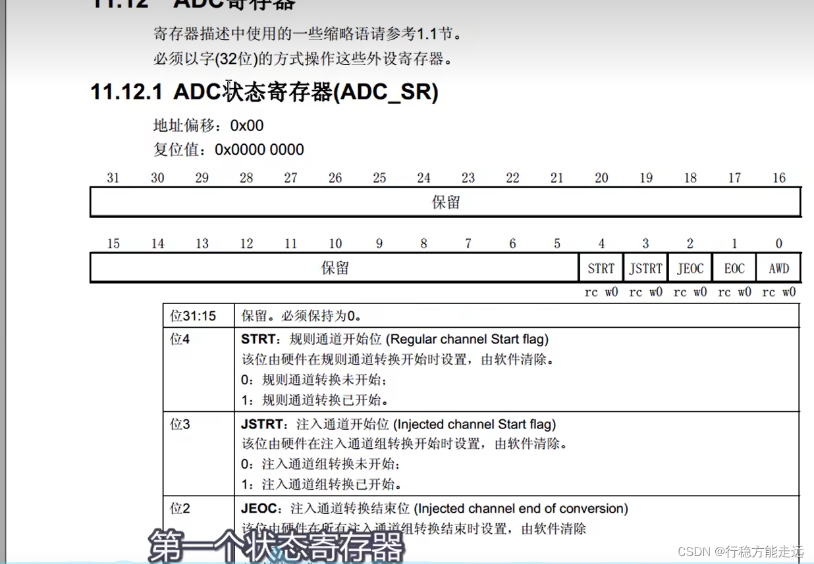


最后就是一个寄存器的总表，这里有所有的寄存器，中间有这些寄存器的复位值，也就是说上电复位后，寄存器都会变成复位值，这里复位值对应的就是各个外设的默认配置，比如GPIO口上电后默认配置为浮空输入的模式，输出数据寄存器默认输出低电平等等，如果你想了解上电后的默认配置，就可以参考这里的寄存器默认值，再对照相应的寄存器描述，这样就能知道默认配置了，这个寄存器一般上电都默认全为零哈，不过也有的不是，你大家可以找找看。

### 示例代码（AD单通道&AD多通道）

AD单通道，看一下这个接线图还是比较简单，在这里我们接了一个电位器，这个电位器有三个引脚，分别插在这三排孔里，电位器的内部结构是这样的，左边和右边的两个引脚，接的是电阻的两个固定端，中间这个引脚接的是滑动抽头，电位器外边这里有个十字形状的槽可以拧，往左拧抽头就往左靠，往右拧抽头就往右靠，我们把左边的固定端接在负极，右边的固定端接在正极，中间就可以输出从负极到正极可调到电压了，然后右边这里我们把可调的电压输出接在PA0口，在这里根据引脚定义表，PA0到PB7这十个引脚是ADC的十个通道，所以这十个硬件你可以任意选，接在哪个都行，但是其他的这些引脚不是ADC的通道，就不能接模拟电压了。  


7-1 AD单通道  
程序现象：在面包板的中间，也就是芯片左边接了一个电位器，就是滑动变阻器。用这个电位器产生一个0~3.3V连续变化的模拟电压信号。然后接到STM32的PA0口上，之后用STM32内部的ADC读取电压数据，显示在屏幕上。这里屏幕第一行显示的是AD转换后的原始数据，第二行是经过处理后实际的电压值。电位器往左拧，AD值减小，电压值也减小，AD值最小是0，对应的电压就是0V；反之同理STM32的ADC是12位的，所以AD结果最大值是4095，也就是2^12-1，对应的电压是3.3V。


我们把这个结构打通，在原理上能够让这个外设运转起来，那该怎么配置，自己心里就应该有数了。

第一步，开启RCC时钟，包括ADC和GPIO的时钟，另外这里ADCCLK的分频器，也需要配置一下


第二步，配置GPIO。把需要用的GPIO配置成模拟输入的模式

第三步，配置这里的多路开关。把左边的通道接入到右边的规则组列表里。这个过程就是我们之前说的点菜，把各个通道的菜，列在菜单里


第四步，就是配置ADC转换器了。在库函数里，是用结构体来配置的，可以配置这一大块电路的参数。包括ADC是单次转换还是连续转换、扫描还是非扫描、有几个通道，触发源是什么，数据对齐是左对齐还是右对齐。


如果你需要模拟看门狗，那会有几个函数用来配置阈值和监测通道的，如果你想开启中断，那就在中断输出控制里用ITConfig函数开启对应的中断输出，然后再在NVIC里，配置一下优先级，这样就能触发中断了。不过这一块，模拟看门狗和中断，我们本节暂时不用，如果你需要的话，可以自己配置试一下。

接下来，就是开关控制，调用一下ADC\_Cmd函数，开启ADC，这样ADC就配置完成了，就能正常工作了。  


当然，在开启ADC之后，根据手册里的建议，我们还可以对ADC进行一下校准，这样可以减小误差，那在ADC工作的时候，如果想要软件触发转换，那会有函数可以触发，如果想读取转换结果，那也会有函数可以读取结果，这个等会儿介绍库函数的时候就可以看到了。

这里有四个函数，对应校准的四个步骤：第一步，调用第一个函数ADC\_ResetCalibration，复位校准；第二步，调用第二个函数ADC\_GetResetCalibrationStatus，等待复位校准完成；第三步，调用第三个函数ADC\_StartCalibration，开始校准；第四步，调用第四个函数ADC\_GetCalibrationStatus，等待校准完成。


如果想要软件触发转换，那会有函数可以触发。如果想读取转换结果，那也会有函数可以读取结果，这个等会儿介绍库函数的时候就可以看到了。好，这些就是我们程序的大概思路了。  
首先，软件触发转换；然后等待转换完成，也就是等待EOC标志位置1；最后，读取ADC数据寄存器，就完事了。


AD.h

```c
#ifndef __AD_H
#define __AD_H

void AD_Init(void);
uint16_t AD_GetValue(void);

#endif

```

AD.c

```c
#include "stm32f10x.h"                  // Device header

/**
  * 函    数：AD初始化
  * 参    数：无
  * 返 回 值：无
  */
void AD_Init(void)
{
	/*开启时钟*/
	RCC_APB2PeriphClockCmd(RCC_APB2Periph_ADC1, ENABLE);	//开启ADC1的时钟
	RCC_APB2PeriphClockCmd(RCC_APB2Periph_GPIOA, ENABLE);	//开启GPIOA的时钟
	
	/*设置ADC时钟*/
	RCC_ADCCLKConfig(RCC_PCLK2_Div6);						//选择时钟6分频，ADCCLK = 72MHz / 6 = 12MHz
	
	/*GPIO初始化*/
	GPIO_InitTypeDef GPIO_InitStructure;
	GPIO_InitStructure.GPIO_Mode = GPIO_Mode_AIN;			//模拟输入，在AIN模式下GPIO口是无效的，断开GPIO防止GPIO口的输入输出对模拟电压造成干扰
	GPIO_InitStructure.GPIO_Pin = GPIO_Pin_0;
	GPIO_InitStructure.GPIO_Speed = GPIO_Speed_50MHz;
	GPIO_Init(GPIOA, &GPIO_InitStructure);					//将PA0引脚初始化为模拟输入
	
	/*规则组通道配置*/
	ADC_RegularChannelConfig(ADC1, ADC_Channel_0, 1, ADC_SampleTime_55Cycles5);		//规则组序列1的位置，配置为通道0  通道采样时间随便选的55.5个ADCCLK的周期(需要更快的转换就选择小的参数，反之需要更稳定的转换就..)
	//目前只有PA0一个通道，使用的非扫描模式，所以指定的通道就放在第一个序列1的位置
	
	/*ADC初始化*/
	ADC_InitTypeDef ADC_InitStructure;						//定义结构体变量
	ADC_InitStructure.ADC_Mode = ADC_Mode_Independent;		//模式，选择独立模式(还有双ADC模式)，即单独使用ADC1
	ADC_InitStructure.ADC_DataAlign = ADC_DataAlign_Right;	//数据对齐，选择右对齐
	ADC_InitStructure.ADC_ExternalTrigConv = ADC_ExternalTrigConv_None;	//外部触发转换选择，使用软件触发，不需要外部触发
	//单次转换非扫描的模式
	ADC_InitStructure.ADC_ContinuousConvMode = DISABLE;		//连续转换，失能，每转换一次规则组序列后停止
	ADC_InitStructure.ADC_ScanConvMode = DISABLE;			//扫描模式，失能，只转换规则组的序列1这一个位置
	ADC_InitStructure.ADC_NbrOfChannel = 1;					//通道数，为1，仅在扫描模式下，才需要指定大于1的数，在非扫描模式下，只能是1
	ADC_Init(ADC1, &ADC_InitStructure);						//将结构体变量交给ADC_Init，配置ADC1

	// 中断和模拟看门狗，如果需要可在此处继续配置
	
	/*ADC使能*/
	ADC_Cmd(ADC1, ENABLE);									//使能ADC1，ADC开始运行
	
	/*ADC校准*/  	//固定流程，内部有电路会自动执行校准
	ADC_ResetCalibration(ADC1);								//复位校准	
	while (ADC_GetResetCalibrationStatus(ADC1) == SET);		//返回复位校准的状态
	ADC_StartCalibration(ADC1);								//开始校准
	while (ADC_GetCalibrationStatus(ADC1) == SET);
}

/**
  * 函    数：获取AD转换的值
  * 参    数：无
  * 返 回 值：AD转换的值，范围：0~4095
  */
uint16_t AD_GetValue(void)
{
	ADC_SoftwareStartConvCmd(ADC1, ENABLE);					//软件触发AD转换一次(如果是连续转换模式，只需要触发一次就可以了)
	while (ADC_GetFlagStatus(ADC1, ADC_FLAG_EOC) == RESET);	//等待EOC标志位，即等待AD转换结束
	return ADC_GetConversionValue(ADC1);					//读数据寄存器，得到AD转换的结果
}

```

main.c

```c
#include "stm32f10x.h"                  // Device header
#include "Delay.h"
#include "OLED.h"
#include "AD.h"

uint16_t ADValue;			//定义AD值变量
float Voltage;				//定义电压变量

int main(void)
{
	/*模块初始化*/
	OLED_Init();			//OLED初始化
	AD_Init();				//AD初始化
	
	/*显示静态字符串*/
	OLED_ShowString(1, 1, "ADValue:");
	OLED_ShowString(2, 1, "Voltage:0.00V");
	
	while (1)
	{
		ADValue = AD_GetValue();					//获取AD转换的值
		Voltage = (float)ADValue / 4095 * 3.3;		//将AD值线性变换到0~3.3的范围，表示电压
		
		OLED_ShowNum(1, 9, ADValue, 4);				//显示AD值
		OLED_ShowNum(2, 9, Voltage, 1);				//显示电压值的整数部分
		OLED_ShowNum(2, 11, (uint16_t)(Voltage * 100) % 100, 2);	//显示电压值的小数部分(注意浮点数不能取余，所以先强制类型转换成uint16_t)
		
		Delay_ms(100);			//延时100ms，手动增加一些转换的间隔时间
	}
}

```

> 这一位由软件清除或由读取ADC\_DR时清除，ADC\_DR是数据计算器，一般EOC标志位置1，我们就会来读取数据，所以它就多设计了一个功能，就是这一位可以在读取数据寄存器之后自动清除，就不需要你再手动清除了，可以省一条代码，这就是这个标志位，当它为0时，表示转换未完成，为1表示转换完成。  
>   
> 所以在这里当EOC标志位等于等于reset时，转化未完成，while条件为真执行空循环，转换完成后  
> EOC由硬件自动置1，那while循环就自动跳出来,这样就是等待转换完成的代码，那具体会等待多长时间，我们刚才配置的时候，指定了这个通道的采样周期是55.5，转换周期是固定的12.5，加在一起就是68个周期，前面我们配置的ADCCLK是72MHZ的六分频就是12MHz，12MHz进行68个周期转换才能完成，最终的时间可以算一下，就是1/12MHz x 68，结果大概是5.6us，这个我们上一小节讲转换时间的时候，也讲过，所以这个while循环，大概会等待5.6微秒，这就是等待的时间,那等待完成之后  
> 我们就可以取结果了。

实验发现AD值的末尾会有一些抖动，这是正常的波动，如果你想对这个值进行判断，再执行一些操作，比如光线的AD值小于某一阈值就开灯，大于某一阈值就关灯，那可能会存在这样的情况，比如光线逐渐变暗，AD值逐渐变小，但是由于波动，AD值会在判断阈值附近来回跳变，这会导致输出产生抖动，来回开灯关灯，那如何避免这种情况呢，这个可以使用迟滞比较的方法来完成，设置两个阈值，低于下阈值时开灯，高于上阈值时关灯，这就可以避免输出抖动的问题了，这个跟我们GPIO那一节讲的施密特触发器是一个原理，另外如果你觉得数据跳变太厉害，还可以采用滤波的方法，让AD值平滑一些，比如均值滤波啊，就是读取十个或20个值，取平均值作为滤波的AD值，或者还可以裁剪分辨率，把数据的尾数去掉，这样也可以减少数据波动，这都是可行的方法，大家实际遇到这方面问题的话  
可以考虑一下。

**7-2 AD多通道**

在这里我们使用了4个AD通道，第一个通道还是电位器，接在PA0口之后，上面又接了三个传感器模块，分别是光敏传感器、热敏传感器、反射式红外传感器，他们的VCC和GND都分别接在面包板的正负极，然后这个AO就是模拟量的输出引脚，三个模块的AO分别接在PA1、PA2和PA3，加上电位器的PA0 总共是四个输入通道，同样在这些GPIO口也是可以在PA0到PB1之间任意选择的，我这里就选择前四个了。  


如何实现多通道呢？  
我们首先想到的应该是后面这两种扫描模式（连续转换、扫描模式和单次转换、扫描模式），利用这个列表把四个通道都填进去，然后触发转换，这样就能实现多通道了，这样确实是一种不错的方法，但是还是那个数据覆盖的问题，如果想要用扫描模式实现多通道，最好要配合DMA来实现，我们下节讲完DMA之后，再来试一下扫描模式。

那你可能会问  
我们一个通道转换完成之后，手动把数据转运出来不就行了，为啥非要用DMA来转运呢，这个方案看似简单，但是实际操作起来会有一些问题，第一个问题就是在扫描模式下，你启动列表之后，它里面每一个单独的通道转换完成之后，不会产生任何的标志位，也不会触发中断，你不知道某一个通道是不是转，换完了，它只有在整个列表都转换完成之后，才会产生一次EOC标志位才能触发中断，而这时前面的数据就已经覆盖丢失了，第二个问题就是AD转换是非常快的，刚才我们也计算过，转换一个通道大概只有几微秒，也就是说，如果你不能在几微秒的时间内把数据转运走，那数据就会丢失，这对我们程序手动转运数据，要求就比较高了，所以在扫描模式下，手动转移数据是比较困难的哈，不过比较困难也不是说手动转运不可行啊，我们可以使用间断模式，在扫描的时候每转换一个通道就暂停一次，等我们手动把数据转运走之后，再继续触发下一次转换，这样可以实现手动转移数据的功能哈，但是由于单个通道转换完成之后，没有标注位，所以启动转换完成之后，只能通过delay延时的方式，延时足够长的时间，才能保证转换完成，这种方式既不，能让我们省心，也不能提高效率，所以我们暂时不推荐使用。

那这些方法都不行，我们本节是不是就不能实现多通道了呢，答案是能实现，而且非常简单，怎么实现呢，我们可以使用上面的这个单次转换非扫描的模式来实现多通道，只需要在每次触发转换之前，手动更改一下列表第一个位置的通道就行了，比如第一次转换先写入通道0之后触发、等待、读值，第二次转换，再把通道0改成通道1之后触发、等待、读值等等，这样在转换前先指定一下通道，再启动转换，就可以轻松地实现多通道转换的功能。代码这里也只需做一些简单的修改就行了。

AD.h

```c
#ifndef __AD_H
#define __AD_H

void AD_Init(void);
uint16_t AD_GetValue(uint8_t ADC_Channel);

#endif


```

AD.c

```c
#include "stm32f10x.h"                  // Device header

/**
  * 函    数：AD初始化
  * 参    数：无
  * 返 回 值：无
  */
void AD_Init(void)
{
	/*开启时钟*/
	RCC_APB2PeriphClockCmd(RCC_APB2Periph_ADC1, ENABLE);	//开启ADC1的时钟
	RCC_APB2PeriphClockCmd(RCC_APB2Periph_GPIOA, ENABLE);	//开启GPIOA的时钟
	
	/*设置ADC时钟*/
	RCC_ADCCLKConfig(RCC_PCLK2_Div6);						//选择时钟6分频，ADCCLK = 72MHz / 6 = 12MHz
	
	/*GPIO初始化*/
	GPIO_InitTypeDef GPIO_InitStructure;
	GPIO_InitStructure.GPIO_Mode = GPIO_Mode_AIN;
	GPIO_InitStructure.GPIO_Pin = GPIO_Pin_0 | GPIO_Pin_1 | GPIO_Pin_2 | GPIO_Pin_3;
	GPIO_InitStructure.GPIO_Speed = GPIO_Speed_50MHz;
	GPIO_Init(GPIOA, &GPIO_InitStructure);					//将PA0、PA1、PA2和PA3引脚初始化为模拟输入
	
	/*不在此处配置规则组序列，而是在每次AD转换前配置，这样可以灵活更改AD转换的通道*/
	
	/*ADC初始化*/
	ADC_InitTypeDef ADC_InitStructure;						//定义结构体变量
	ADC_InitStructure.ADC_Mode = ADC_Mode_Independent;		//模式，选择独立模式，即单独使用ADC1
	ADC_InitStructure.ADC_DataAlign = ADC_DataAlign_Right;	//数据对齐，选择右对齐
	ADC_InitStructure.ADC_ExternalTrigConv = ADC_ExternalTrigConv_None;	//外部触发，使用软件触发，不需要外部触发
	ADC_InitStructure.ADC_ContinuousConvMode = DISABLE;		//连续转换，失能，每转换一次规则组序列后停止
	ADC_InitStructure.ADC_ScanConvMode = DISABLE;			//扫描模式，失能，只转换规则组的序列1这一个位置
	ADC_InitStructure.ADC_NbrOfChannel = 1;					//通道数，为1，仅在扫描模式下，才需要指定大于1的数，在非扫描模式下，只能是1
	ADC_Init(ADC1, &ADC_InitStructure);						//将结构体变量交给ADC_Init，配置ADC1
	
	/*ADC使能*/
	ADC_Cmd(ADC1, ENABLE);									//使能ADC1，ADC开始运行
	
	/*ADC校准*/
	ADC_ResetCalibration(ADC1);								//固定流程，内部有电路会自动执行校准
	while (ADC_GetResetCalibrationStatus(ADC1) == SET);
	ADC_StartCalibration(ADC1);
	while (ADC_GetCalibrationStatus(ADC1) == SET);
}

/**
  * 函    数：获取AD转换的值
  * 参    数：ADC_Channel 指定AD转换的通道，范围：ADC_Channel_x，其中x可以是0/1/2/3
  * 返 回 值：AD转换的值，范围：0~4095
  */
uint16_t AD_GetValue(uint8_t ADC_Channel)
{
	ADC_RegularChannelConfig(ADC1, ADC_Channel, 1, ADC_SampleTime_55Cycles5);	//在每次转换前，根据函数形参灵活更改规则组的通道1 我们要指定的通道是0、1、2、3，对应上面的GPIO 0、1、2、3
	ADC_SoftwareStartConvCmd(ADC1, ENABLE);					//软件触发AD转换一次
	while (ADC_GetFlagStatus(ADC1, ADC_FLAG_EOC) == RESET);	//等待EOC标志位，即等待AD转换结束
	return ADC_GetConversionValue(ADC1);					//读数据寄存器，得到AD转换的结果
}


```

main.c

```c
#include "stm32f10x.h"                  // Device header
#include "Delay.h"
#include "OLED.h"
#include "AD.h"

uint16_t AD0, AD1, AD2, AD3;	//定义AD值变量

int main(void)
{
	/*模块初始化*/
	OLED_Init();				//OLED初始化
	AD_Init();					//AD初始化
	
	/*显示静态字符串*/
	OLED_ShowString(1, 1, "AD0:");
	OLED_ShowString(2, 1, "AD1:");
	OLED_ShowString(3, 1, "AD2:");
	OLED_ShowString(4, 1, "AD3:");
	
	while (1)
	{
		AD0 = AD_GetValue(ADC_Channel_0);		//单次启动ADC，转换通道0
		AD1 = AD_GetValue(ADC_Channel_1);		//单次启动ADC，转换通道1
		AD2 = AD_GetValue(ADC_Channel_2);		//单次启动ADC，转换通道2
		AD3 = AD_GetValue(ADC_Channel_3);		//单次启动ADC，转换通道3
		
		OLED_ShowNum(1, 5, AD0, 4);				//显示通道0的转换结果AD0
		OLED_ShowNum(2, 5, AD1, 4);				//显示通道1的转换结果AD1
		OLED_ShowNum(3, 5, AD2, 4);				//显示通道2的转换结果AD2
		OLED_ShowNum(4, 5, AD3, 4);				//显示通道3的转换结果AD3
		
		Delay_ms(100);			//延时100ms，手动增加一些转换的间隔时间
	}
}

```

## DMA直接存储器存取

实验现象：

DMA数据转运  
在这个程序里，我们将使用DMA进行存储器到存储器的数据转运，也就是把一个数组里面的数据复制到另一个数组里，先看一下最终的代码，这里我定义了一个数组，DataA里面存的是0x01、0x02、0x03、0x04，作为待转运的源数据，然后下面再定义一个数组DataB，里面存的是4个0，作为转运数据的目的地，之后我们将会写一个模块叫MyDMA，进行初始化，把原数组和目的数组的地址传进去，再传入转运数据的长度，使用DMA进行数据转运，和直接for循环，使用CPU一个个手动的转运数据效果是一样的，最后再显示一下DataA和DataB，看一下数据是不是从DataA转运到了DataB。

这里只定义了四个数据，演示一下现象，也可以定义100个1000个等等数据，然后使用DMA来进行转运都是可以的。

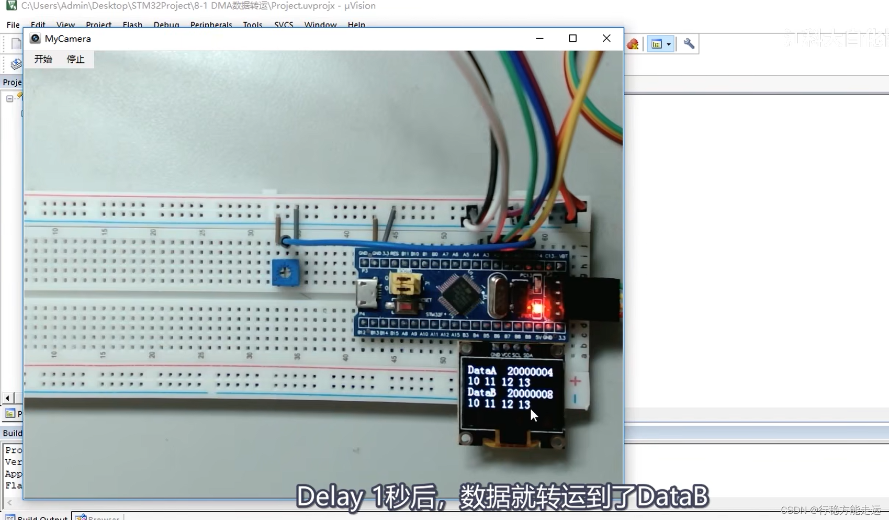

DMA+AD多通道

看第二个程序，DMA+AD多通道，这个程序就是我们上一节预告过的，使用ADC的扫描模式来实现多通道采集，然后使用DMA来进行数据转运，最终AD转换的数据就会像这样直接自动的跑到我们定义的数组里面来，之后我们就只需要用OLED显示一下就行了，看上去还是非常方便的。

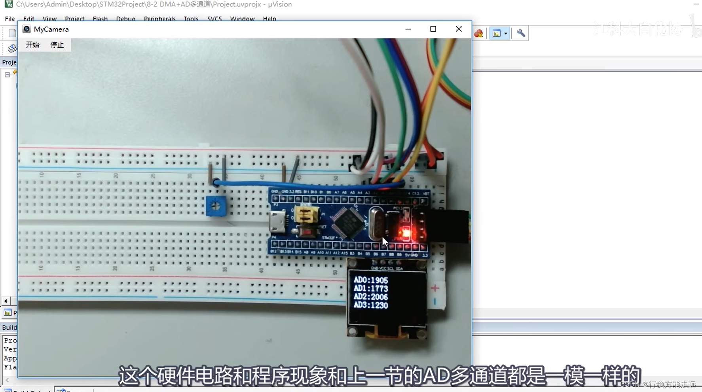


DMA这个外设是可以直接访问STM32内部的存储器的，包括运行内存SRAM、程序存储器FLASH和寄存器等等，DMA都有权限访问他们，所以DMA才能完成数据转运的工作。

DMA可以提供外设和存储器或者存储器和存储器之间的高速数据传输，无需CPU干预，节省了CPU的资源，这里外设指的就是外设寄存器，一般是外设的数据寄存器器DR， Data Register，比如ADC的数据寄存器，串口的数据寄存器等等，这里存储器指的就是运行内存SRAM和程序存储器flash，是我们存储变量数组和程序代码的地方，在外设和存储器或者存储器和存储器之间进行数据转运，就可以使用DMA来完成，并且在转运的过程中无需CPU的参与，节省了CPU的资源，CPU省下时间就可以干一些其他的更加专业的事，情搬运数据这种杂活，交给DMA就行了。

12个独立可配置的通道，这个通道就是数据转移的路径，从一个地方移动到另一个地方，就需要占用一个通道，如果有多个通道进行转运，那它们之间可以各转各的，互不干扰，这就是DMA的通道。

每个通道都支持软件触发和特定的硬件触发，这里如果执行的是存储器到存储器的转运，比如我们想把flash里的一批数据转运到SRAM里去，那就需要软件触发，使用软件触发之后，DMA就会一股脑的把这批数据以最快的速度全部转运完成，这也是我们想要的效果哈，那如果DMA进行的是外设到存储器的数据转运，就不能一股脑的转运了，因为外设的数据是有一定时机的，所以这时我们就需要用硬件触发，比如转运ADC的数据，那就得ADC每个通道AD转换完成后，硬件触发一次DMA，之后DMA再转运，触发一次，转运一次，这样数据才是正确的，才是我们想要的效果,所以存储器到存储器的数据转运，我们一般使用软件触发，外设到存储器的数据转运，我们一般使用硬件触发，那这里我写的是特定的硬件触发，意思就是每个DMA的通道，它的硬件触发源是不一样的，你要使用某个外设的硬件触发源，就得使用它连接的那个通道，而不能任意选择通道，这个我们等会儿再详细分析。

C8T6的DMA资源是DMA1(7个通道)，我们这个芯片只有DMA1的7个通道，没有DMA2，这个注意看一下数据手册。


我们来看一下STM32的存储器映象，既然DMA是在存储器之间进行数据转运的，那我们就应该要了解一下STM32中都有哪些存储器，这些存储器又是被安排到了哪些地址上，这就是存储器映象的内容，那我们知道计算机系统的五大组成部分是运算器、控制器、存储器、输入设备和输出设备，其中运算器和控制器一般会合在一起，叫做CPU，所以计算机的核心关键部分就是CPU和存储器，存储器又有两个重要知识点，一个是存储器的内容，另一个就是存储器的地址，那STM32也不例外，这个表就是STM32中所有类型的存储器和他们所被安排的地址，在STM32 的数据手册，这里也会有个存储器印象的图，如下所示，我这个表就是从这个图里总结出来的，都是一个意思。

在这个表里，无论是flash还是SRAM还是外设寄存器，它们都是存储器的一种，包括外设寄存器，实际上也是存储器，我们前面这里说的是外设到存储器，存储器到存储器，本质上其实都是存储器之间的数据转运，说成外设的存储器，只不过是STM32 它特别指定了可以转运外设的存储器而已，这个了解一下。

存储器总共分成两大类，rom和ram，rom就是只读存储器，是一种非易失性、掉电不丢失的存储器，ram是随机存储器，是一种易失性、掉电丢失的存储器，其中rom分为了三块，第一块是程序存储器flash，也就是主闪存，它的用途就是存储c语言编译后的程序代码，也就是我们下载程序的位置，运行程序一般也是从主闪存里面开始运行的，这一块存储器STM2 给它分配的地址是0x08000000 ，起始地址，也就是第一个字节的地址是0800这个哈，然后剩余字节的地址依次增长，每个字节都分配一个独一无二的地址，就像给每个住户编门牌号一样，只有分配了独一无二的门牌号程序才能精准地访问这个存储器，最终终止地址是多少呢，这取决于它的容量，编到哪里，哪里就是终止地址，这就是主闪存的地址范围，你之后如果在软件里看到某个数据的地址是0800开头的，那你就可以确定它是属于主闪存的数据。

接着继续看系统存储器和选项字节，这两块存储器也是rom的一种，掉电不丢失，实际上他们的存储介质也是flash，只不过我们一般说flash指的是主闪存flash，而不止这两块区域，那看一下地址，他们的地址都是1fff开头的，紧跟着2000开头的就是ram区的，所以可以看出这两块存储器的位置是在rom区的最后面，它们的用途看下右边说明，系统存储器的用途是存储bootloader，用于串口下载，这个下一节讲串口的时候再给大家演示，那个bootloader程序存储的位置就被分配到了这里，bootloader程序是芯片出厂自动写入的哈，一般也不允许我们修改，之后选项字节，主要是保存一些配置，它的位置是在rom区的最后面，你下载程序可以不刷新选项字节的内容，这样选项字节的配置就可以保持不变，选项字节里存的主要是flash的读保护写保护，还有看门狗等等的配置，这个如果需要的话，可以了解一下。

> 选项字节在9-6有介绍，比如在FlyMcu里设置读保护，如果你做产品不开启读保护，别人很容易就把你的程序偷走了。  
>   
> 那选项字节里面的参数有什么好处呢  
> 就是选项字节的数据相当于是世外桃源了哈，无论程序怎么更新，选项字节的数据都可以不变，你可以用这些字节来存储不随程序变化变化的参数，另外选项之前还有一个好处，就是可以用上位机很方便的修改，比如我们这个FlyMcu或者STLINK Utility，在上位机里可以直接修改选项字节的内容，是不是可以用作一些产品中可供用户配置的参数啊，然后继续看最后一项就是写保护了，这里可以对flash的哪几个页单独进行写保护，比如你在主程序的最后几页写了一些自定的数据，不想在下载的时候被擦除了，就可以把最后几页设置写保护锁起来，设置写保护之后就无法再写它，如果想再次写入的话，解除写保护就行了，另外注意一下，设置写保护之后再下载，如果需要写入保护区的话，就会出错，比如你把最前面几页写保护了，下载一次之后再下载，肯定就会出错，而它这个软件设计还不能单独写入选项字节，只能下载flash，顺便写入选项字节，但写保护了，下载不了，就不能解除写保护，形成死循环了。  
> STLINK Utility可以单独配置选项字节，就可以解决这个问题了。

然后我们看一下ram区域，首先是运行内存sram，分配的地址是0x20000000 ，用途是存储运行过程中的临时变量，也就是我们在程序中定义变量数组结构体的地方，你可以试一下，定义一个变量，再取他的地址显示出来，那这个地址肯定就是2000开头的，类比于电脑的话运行内存就是内存条，然后ram区剩下的还有外设寄存器，它的地址是0x40000000这块区域，用途是存储各个外设的配置参数，也就是我们初始化各个外设最终所读写的东西，刚才我们说了，外设寄存器也是存储器的一种，它的存储介质其实也是sram，只不过我们一般习惯把运行内存叫SRAM，外设寄存器就直接叫寄存器了。

最后是内核外设寄存器地址是0xE0000000这片区域，用途是存储内核各个外设的配置参数，内核外设就是NVIC和SysTick，因为内核外设和其他外设不是一个厂家设计的，所以他们的地址也是被分开的，内核外设是E000，其他外设是4000，那以上这些就是STM32里的存储器和他们被安排的地址。


我们在这个图里也看一下，在STM32中，所有的存储器都被安排到了0~ffffffff这个地址范围内，因为cpu是32位的，所以寻址范围就是32位的范围，32位的寻址范围是非常大的，最大可以支持4gb容量的存储器，而我们STM32的存储器都是kb级别的，所以这个4gb的寻址空间会有大量的地址都是空的，算一下地址的使用率还不到1%，在这个图里有灰色填充的就是Reserve的区域，也就是保留区域没有使用到，然后这个零地址啊实际上也是没有存储器的，他这里写的是别名到flash或者系统存储器取决于boot引脚(Aliased to Flash or…)，因为程序是从零地址开始运行的，所以这里需要把我们想要执行的程序映射到零地址来，如果映射在flash区，就从flash执行，如果映射在系统存储器区，就是从系统存储器运行bootloader，如果映射到sram，就是从sram启动，怎么选择，由boot0和boot1两个硬件来决定，这就是零地址里的别名区，接着剩下的0800开始的flash区，用于存储程序代码，1fff开始的系统存储器和选项字节是在rom区的，最后面存在什么东西，刚才也都介绍过，之后2000开始的是sram区，4000开始的是外设寄存器区，里面可以展开，就是右边这些东西，具体到每个外设又有他们自己的起始地址，比如TIM 2的地址是40000000，TIM3是40000400，然后外设里面又可以具体细分到每个寄存器的地址，寄存器里每个字节的地址，最终所有字节的地址就都可以算出来了，就上面这里E000开始的区域存放的就是内核里面的外设寄存器了，那到这里相信你对STM32 里面有哪些存储器，每种存储器都对应在哪个地址区间里就应该清楚了。

DMA框图


我们看下DMA框图，左上角这里是Cortex-M3内核，里面包含了CPU和内核外设等等，剩下的这所有东西，你都可以把它看成是存储器，所以总共就是CPU和存储器两个东西。Flash是主闪存，SRAM是运行内存，各个外设，都可以看成是寄存器，也是一种SRAM存储器。  
寄存器是一种特殊的存储器，一方面，CPU可以对奇存器进行读写，就像读写运行内存一样，另一方面，寄存器的每一位背后，都连接了一根导线，这些导线可以用于控制外设电路的状态，比如置引脚的高低电平、导通和断开开关、切换数据选择器，或者多位组合起来，当做计数器、数据寄存器等等。所以，寄存器是连接软件和硬件的桥梁，软件读写寄存器，就相当于在控制硬件的执行。  
回到这里，既然外设就是寄存器，寄存器就是存储器，那使用DMA进行数据转运，就都可以归为一类问题了。就是从某个地址取内容，再放到另一个地址去。


我们看图，为了高效有条理地访问存储器，这里设计了一个总线矩阵，总线矩阵的左端，是主动单元，也就是拥有存储器的访问杈，右边这些，是被动单元，它们的存储器只能被左边的主动单元读写。主动单元这里，内核有DCode和系统总线，可以访问右边的存储器，其中DCode总线是专门访问Flash的，系统总线是访问其他东西的，另外，由于DMA要转运数据，所以DMA也必须要有访问的主动权。那主动单元，除了内核CPU，剩下的就是DMA总线了。这里DMA1有一条DMA总线，DMA2也有一条DMA总线，下面这还有一条DMA总线，这是以太网外设自己私有的DMA，这个可以不用管的。  
在DMA1和DMA2里面，可以看到，DMA1有7个通道，DMA2有5个通道，各个通道可以分别设置它们转运数据的源地址和目的地址，这样它们就可以各自独立地工作了。


接着下面这里有个仲裁器，这个是因为，虽然多个通道可以独立转运数据，但是最终DMA总线只有一条，所以所有的通道都只能分时复用这一条DMA总线。如果产生了冲突，那就会由仲裁器，根据通道的优先级来决定谁先使用和后使用。另外在总线矩阵这里，也会有个仲裁器，如果DMA和CPU都要访问同一个目标，那么DMA就会暂停CPU的访问，以防止冲突。不过总线仲裁器，仍然会保证CPU得到一半的总线带宽，使CPU也能正常的工作。


下面这里是AHB从设备，也就是DMA自身的寄存器，因为DMA作为一个外设，它自己也会有相应的配置寄存器，这里连接在了总线右边的AHB总线上，所以DMA，既是总线矩阵的主动单元，可以读写各种存储器，也是AHB总线上的被动单元。CPU通过这一条线路，就可以对DMA进行配置了。


接着继续看这里，是DMA请求，请求就是触发的意思，这条线路右边的触发源，是各个外设，所以这个DMA请求就是DMA的硬件触发源。比如ADC转换完成、串口接收到数据，需要触发DMA转运数据的时候，就会通过这条线路，向DMA发出硬件触发信号，之后DMA就可以执行数据转运的工作了。这就是DMA请求的作用。

到这里，有关DMA的结构就讲的差不多了，其中包括：用于访问各个存储器的DMA总线；内部的多个通道，可以进行独立的数据转运；仲裁器，用于调度各个通道，防止产生冲突；AHB从设备，用于配置DMA参数；DMA请求，用于硬件触发DMA的数据转运，这就是这个DMA的各个部分和作用。


注意一下：就是这里的Flash，它是ROM只读存储器的一种，如果通过总线直接访问的话，无论是CPU，还是DMA，都是只读的，只能读取数据，而不能写入，如果你DMA的目的地址，填了Flash的区域，那转运时，就会出错。当然Flash也不是绝对的不可写入，我们可以配置这个Flash接口控制器，对Flash进行写入，这个流程就比较麻烦了，要先对Flash按页进行擦除，再写入数据，不过这是另一个课题了。总之就是CPU或者DMA直接访问Flash的话，是只可以读而不可以写的，然后SRAM是运行内存，可以任意读写，没有问题，外设寄存器的话，得看参考手册里面的描述。有的寄存器是只读的，有的寄存器是只写的，不过我们主要用的是数据寄存器，数据寄存器都是可以正常读写的。

DMA基本结构


这里是我总结的DMA基本结构图，如果想编写代码实际去控制DMA的话，那这个图就是必不可少的了  
刚才这个框图只是一个笼统的结构图，对于DMA内部的执行细节，它还是没体现出来，所以我们再来分析一下这个图，看看DMA具体是怎么工作的。  


在这个图里，这两部分就是数据转运的两大站点了，左边是外设寄存器站点，右边是存储器站点，包括Flash和SRAM，在STM32手册里，他所说的存储器啊，一般是特指flash和sram，不包含外设寄存器，外设寄存器它一般直接称作外设，所以就是外设到存储器，存储器到存储器这样来描述，虽然我们刚才说了，寄存器也是存储器的一种，但是STM32还是使用了外设和存储器来作为区分，这个注意一下描述方法的不同，那在这里可以看到DMA的数据转运可以是从外设到存储器，也是可以从存储器到外设，具体是向左还是向右，有一个方向的参数可以进行控制，另外还有一种转运方式，就是存储器到存储器，比如flash到sram或者sram到sram这两种方式，由于flash是只读的，所以dma不可以进行sram到flash或者flash到flash的转移操作，然后我们继续看这两边的参数，既然要进行数据转运，那肯定就要指定从哪里转到哪里，具体怎么转呢，所以外设和存储器两个站点就都有三个参数  
第一个是起始地址，有外设端的起始地址和存储器端的起始地址，这两个参数决定了数据是从哪里来到哪里去的，之后第二个参数是数据宽度，这个参数的作用是指定一次转运要按多大的数据宽度来进行，他可以选择字节byte、半自HalfWord和字word，字节就是八位，也就是一次转运一个uint8\_t这么大的数据，半字是16位就是一次转运一个uint16\_t这么大，字是32位，就是一次转运unit32\_t这么大，比如转运ADC的数据，ADC的结果是unit16\_t这么大，所以这个参数就要选择半字，一次转运一个unit16\_t，然后第三个参数是地址是否自增，这个参数的作用是指定一次转移完成后，下一次转运是不是要把地址移动到下一个位置去，这就相当于是指针p++这个意思，比如ADC扫描模式，用DMA进行数据转运，外设地址是ADC\_DR寄存器，寄存器这边显然地址是不用指针的，如果自增，那下一次转运就跑到别的寄存器那里去了，存储器这边地址就需要指针，每转运一个数据后就往后挪个坑，要不然下次再转就把上次的覆盖掉了，这就是地址是否自增的作用，就是指定是不是要转运一次挪个坑这个意思，这就是外设站点和存储基站点各自的三个参数了。

如果要进行存储器到存储器的数据转运，那我们就需要把其中一个存储器的地址放在外设的这个站点，这样就能进行存储器到存储器的转运，只要你在外设起始地址里写flash或者sram的地址，那他就会去flash或sram找数据，这个站点虽然叫外设存储器，但是它就只是个名字而已，并不是说这个地址只能写寄存器的地址，如果写flash的地址，那他就会去flash里找，写sram他就会去sram里找，这个没有限制，甚至你可以在外设站点写存储器的地址，存储器站点写外设的地址，然后方向参数给反过来，这样也是可以的，只是ST公司给他起了这样的名字而已，所以我这里就按照它的名字来做的ppt，你也可以把它叫做站点a站点b，从a到b或者从b到a转运数据，不必拘泥于他写的外设站点存储器站点这个名字。

传输计数器和自动重装器：


传输计数器这个东西就是用来指定我总共需要转运几次的，这个传输计数器是一个自减计数器，比如你给他写个5，那DMA就只能进行5次数据转运，转运过程中每转运一次计数器的数就会减一，当传输计数器减到零之后，DMA就不会再进行数据转运了，另外它减到零之后，之前自增的地址也会恢复到起始地址的位置，以方便之后DMA开始新一轮的转换，在传输计数器的右边有一个自动重装器，这个自动重装器的作用就是传输计数器减到零之后，是否要自动恢复到最初的值，比如最初传输计数器给5  
，如果不使用自动重装器，那转运5次后DMA就结束了，如果使用自动重装器，那转运5次计数器减到零后就会立即重装到初始值5，这个就是自动重装器，它决定了转运的模式，如果不重装就是正常的单次模式，如果重装就是循环模式，比如如果你想转运一个数组，那一般就是单次模式转运一轮就结束了，如果是ADC扫描模式加连续转换，那为了配合ADC，DMA也需要使用循环模式，所以这个循环模式和ADC的连续模式差不多啊，都是指定一轮工作完成后，是不是立即开始下一轮工作。

然后继续往下看啊，这一块就是DMA的触发控制了，触发就是决定DMA需要在什么时机进行转运的，触发源有硬件触发和软件触发，具体选择哪个，由M2M这个参数决定，M2M就是memory to memory，因为2的英文two和to同音，所以M2M就是m to m存储器到存储器的意思，当我们给M2M位1时，DMA就会选择软件触发，这个软件触发并不是调用某个函数一次触发一次，这个软件触发的执行逻辑是，以最快的速度，连续不断地触发DMA，争取早日把传输计数器清零，完成这一轮的转换，所以这里的软件触发和我们之前外部中断和ADC的软件出发，可能不太一样，你可以把它理解成连续触发，那这个软件触发和循环模式不能同时用，因为软件触发就是想把传输计数器清零，循环模式是清零后自动重装，如果同时用的话，那DMA就停不下来了，这就是软件触发，软件触发一般适用于存储器到存储器的转运，因为存储器到存储器的转运，是软件启动不需要时机，并且想尽快完成的任务，所以上面这里M2M位给1就是软件触发，就是应用在存储器到存储器转运的情况，M2M位给0，那就是使用硬件触发，硬件触发源可以选择ADC、串口、定时器等等，使用硬件触发的转运一般都是与外设有关的转运，这些转运需要一定的时机，比如ADC转换完成、串口收到数据、定时时间到等等，所以需要使用硬件触发，在硬件达到这些时机时，传个信号过来来触发DMA进行转运，这就是硬件触发。

触发控制部分：  


然后最后，就是开关控制了，也就是DMA\_Cmd函数。当给DMA使能后，DMA就准备就绪，可以进行转运了。

DMA进行转运有几个条件  
第一就是开关控制，DMA\_Cmd必须使能，第二就是传输计数器必须大于0，第三就是触发源必须有触发信号，触发一次转运一次，传输计数器自减一次，当传输计数器等于0，且没有自动重装时，这时无论是否触发，DMA都不会再进行转运了，此时就需要DMA\_CMD给DISABLE，关闭DMA，再为传输计数器写一个大于0的数，再DMA\_Cmd，给ENABLE，开启DMA，DMA才能继续工作，注意一下，写传输计数器时，必须要先关闭DMA再进行，不能在DMA开启时写传输计数器，这是手册里的规定。

几个小知识点细节：  
DMA请求

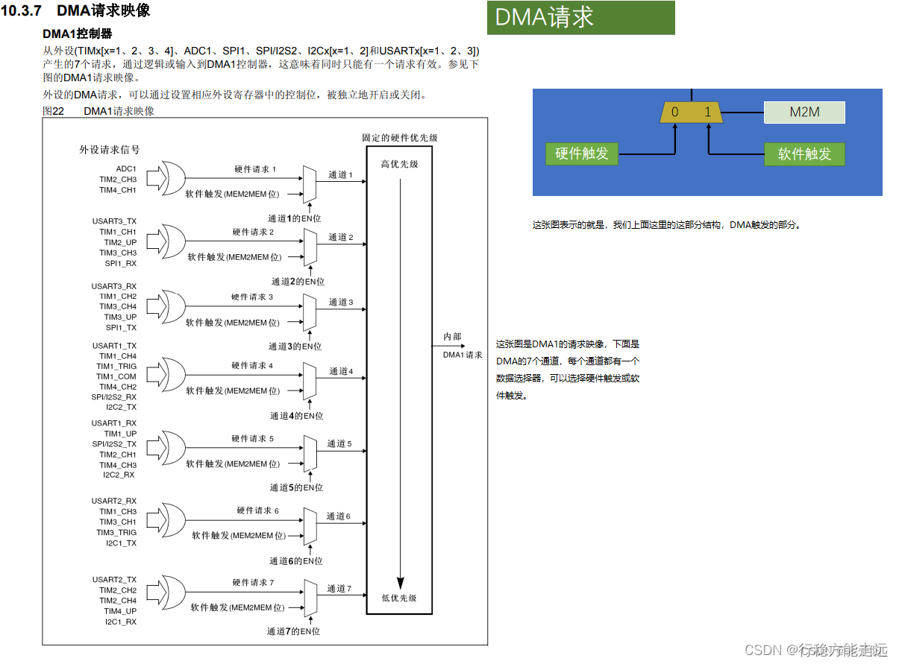


这张图表示的就是我们上面这里的这部分结构，DMA触发的部分，我们来看一下这张图是DMA1的请求映像，下面是DMA的7个通道，每个通道都有一个数据选择器，可以选择硬件触发或软件触发，这里画的图我觉得可能不太好理解，你看他把EN位画在了数据选择器的侧边，一般数据选择器的侧边是输入选择控制位，难道这里的意思是EN给1选择硬件触发，EN给0选择软件触发吗，那显然不对啊，而且他左边这里写的是软件触发括号memory to memory位，难道M2M位是软件触发吗，这个也不太好理解哈，所以这个图我重新给他布了个局，就是上面我这里画的这样，M2M位是数据选择器的控制位，用于选择是硬件触发还是软件触发，EN位是开关控制，EN等于0时不工作，EN等于1时工作，这样就好理解一些了，那这里他这样画的意思应该是，EN并不是数据选择器的控制位啊，而是决定这个数据选择器要不要工作，EN等于0数据选择器不工作，EN等于1数据选择器工作，然后软件触发后面跟个M2M位的意思应该是当M2M位等于1时选择软件触发，这样理解的话就跟我这个图里是一个意思了，那然后继续看左边的硬件触发源，这里是外设请求信号啊，可以看到每个通道的硬件触发源都是不同的，如果你需要用ADC1来触发的话，那就必须选择通道一，如果需要定时器二的更新事件来触发的话，那就必须选择通道二，剩下的也是同理哈，因为每个通道的硬件触发源都不同，所以如果你想使用某个硬件触发源的话，就必须使用它所在的通道，这就是硬件触发的注意事项，而如果使用软件触发的话，那通道就可以任意选择了，因为每个通道的软件触发都是一样的，所以在ppt的在前面写的是每个通道都支持软件触发和特定的硬件触发，这就是特定的意思，选择硬件触发是要看通道的。

然后回来继续看哈，这里通道1的硬件触发是ADC1 、定时器2的通道3和定时器4的通道1，那到底是选择哪个触发源呢，这个是对应的外设是否开启了DMA输出来决定的，比如你要使用ADC1 ，那会有个库函数叫ADC\_DMACmd，必须使用这个库函数开启ADC1的这一路输出，它才有效，如果想选择定时器2的通道3，那也会有个TIM\_DMACmd函数，用来进行DMA输出控制，所以这三个触发源具体使用哪个，取决于你把哪个外设的DMA输出开启了，如果三个都开启了，那这边是一个或门，理论上三个硬件都可以进行触发，不过一般情况下我们都是开启其中一个，之后这七个触发源进入到仲裁器进行优先级判断，最终产生内部的DMA1请求，这个优先级的判断啊，类似于中断的优先级，默认优先级是通道号越小优先级越高，当然也可以在程序中配置优先级，这个其实影响并不是很大，大家了解一下就行。

数据宽度与对齐  
DMA数据转运的两个站点，都有一个数据宽度的参数，如果数据宽度都一样，那就是正常的一个个转运，如果数据宽度不一样，那会怎么处理呢？  
这个表就是来说明问题的，


我们看一下这里第一列是源端宽度，第二列是目标宽度，第三列是传输数目，当源端和目标都是8位时，转运第一步，在源端的0位置读数据B0 ，在目标的0位置写数据b0 ，就是把这个B0从左边挪到右边，之后的步骤，就是把B1从左边挪到右边，接着B2、B3，这是源端和目标都是8位的情况，操作也很正常，接着继续，源端是8位，目标是16位，那他的操作就是在源端读B0，在目标写00B0，之后读B1，写00B1，等等，这个意思就是，如果你目标的数据宽度比源端的数据宽度大，那就在目标数据前面多出来的空位补0，之后8位转运到32位，也是一样的处理哈，前面空出来的都补0，然后下面当目标数据宽度比源端数据宽度小时，比如由16位转到8位去，现象就是读b1 b0 只写入b0 ，读b3 b2 只写入b2 ，也就是把多出来的高位舍弃掉，之后的各种情况也都是类似的操作。

总之一这个表的意思就是如果你把小的数据转到大的里面去,高位就会补0；如果把大的数据转到小的里面去，高位就会舍弃掉；如果数据宽度一样，那就没事。就是跟unit8\_t、unit16\_t和unit32\_t变量之间相互赋值一样，不够就补0，超了就舍弃高位，这是一个道理。

那最后，我们再来看两个例子，看看在这些实际的任务下，DMA是如何工作的。这两个例子和程序例子对应的。

数据转运＋DMA  


这个例子的任务是将SRAM里的数组DataA，转运到另一个数组DataB中，我们看一下这种情况下，这个基本结构里的各个参数该如何配置。  
首先是外设站点和存储器站点的起始地址、数据宽度、地址是否自增这三个参数。那在这个任务里，外设地址显然应该填DataA数组的首地址，存储器地址，给DataB数组的首地址，然后数据宽度，两个数组的类型都是uint8\_t，所以数据宽度都是按8位的字节传输。之后地址是否自增，在中间可以看到，我们想要的效果是DataA\[０\]转到DataB\[０\]，DataA\[1\]转到DataB\[1\]，等等。所以转运完DataA\[0\]和DataB\[0\]之后，两个站点的地址都应该自增，都移动到下一个数据的位置，继续转运DataA\[1\]和DataB\[1\]，这样来进行。  
之后，这里的方向参数，那显然就是外设站点转运到存储器站点了，当然如果你想把DataB的数据转运到DataA，那可以把方向参数换过来，这样就是反向转运了。  
然后是传输计数器和是否要自动重装，在这里，显然要转运7次，所以传输计数器给7，自动重装暂时不需要，之后触发选择部分，这里，我们要使用软件触发。因为这是存储器到存储器的数据转运，是不需要等待硬件时机的，尽快转运完成就行了。  
那最后，调用DMA\_Cmd，给DMA使能，这样数据就会从DataA转运到DataB了。转运7次之后，传输计数器自减到0，DMA停止，转运完成。这里的数据转运是一种复制转运，转运完成后DataA的数据并不会消失，这个过程相当于是把DataA的数据复制到了DataB的位置。

ADC扫描模式+DMA


左边是ADC扫描模式的执行流程，在这里有7个通道，触发一次后，7个通道依次进行AD转换，然后转换结果都放到ADC\_DR数据寄存器里面。那我们要做的就是，在每个单独的通道转换完成后，进行一个DMA数据转运，并且目的地址进行自增，这样数据就不会被覆盖了。所以在这里DMA的配置就是，外设地址，写入ADC\_DR这个寄存器的地址；存储器的地址，可以在SRAM中定义一个数组ADValue，然后把ADValue的地址当做存储器的地址。  
之后数据宽度，因为ADC\_DR和SRAM数组，我们要的都是uint16\_t的数据，所以数据宽度都是16位的半字传输。  
接着判断地址是否自增，那从这个图里，显然是外设地址不自增，存储器地址自增；传输方向，是外设站点到存储器站点；传输计数器，这里通道有7个，所以计数7次；计数器是否自动重装，这里可以看ADC的配置，ADC如果是单次扫描，那DMA的传输计数器可以不自动重装，转换一轮就停止，如果ADC是连续扫描，那DMA就可以使用自动重装，在ADC启动下一轮转换的时候，DMA也启动下一轮的转运，ADC和DMA同步工作。  
最后是触发选择，这里ADC\_DR的值是在ADC单个通道转换完成后才会有效，所以DMA转运的时机，需要和ADC单个通道转换完成同步，所以DMA的触发要选择ADC的硬件触发。  
最后硬件触发这里要说明一下，我们上一节说了，ADC扫描模式，在每个单独的通道转换完成后，没有任何标志位，也不会触发中断。所以我们程序不太好判断，某一个通道转换完成的时机是什么时候。但是根据UP主的研究，虽然单个通道转换完成后，不产生任何标志位和中断，但是它应该会产生DMA请求，去触发DMA转运，这部分内容，手册里并没有详细描述，根据我实际实验，单个通道的DMA请求肯定是有的。  
这些就是ADC扫描模式和DMA配合使用的流程。一般来说，DMA最常见的用途就是配合ADC的扫描模式，因为ADC扫描模式有个数据覆盖的特征，这个缺陷使ADC和DMA成为了最常见的伙伴，ADC对DMA的需求是非常强烈的，像其他的一些外设，使用DMA可以提高效率，是锦上添花的操作，但是不使用也是可以的，顶多是损失一些性能，但是这个ADC的扫描模式，如果不使用DMA，功能都会受到很大的限制，所以ADC和DMA的结合最为常见。

**参考手册**

  


之后这里还有一个位段区域，这两个位段区映射了外设寄存器和SRAM中全部的位，这个位段区就相当于是位寻址，它把外设寄存器和SRAM中所有的位都分配了地址，你操作这个新的地址就相当于操作其中某一个位，因为32位的地址有99%都是空的，所以地址空间很充足，即使把每一位都单独编码，那毫无压力，所以就存在了这样一个位段，用于单独操作计算器或sram的某一位，位段区是另找了一个地方，开辟了一段地址区域，其中sram位段区域是2200开头的区域，外设寄存器的位段区是4200开头的区域，需要用的话可以了解一下。

  
嵌入式闪存，闪存被分为了很多页，他们的地址都是0800开头的，在闪存区的最后就是系统存储器和选项字节，这两个区域统称为信息块，下面这是闪存接口寄存器，这是外设的一部分，你看它的地址是40开头的，所以它显然是一个外设，这个外设可以对闪存进行读写哈，这就是闪存的部分。

  
启动配置，配置boot0和boot1两个引脚来选择程序从哪里启动，这个我们第一节和刚才也介绍过。


### 示例代码（DMA数据转运&&DMA+AD多通道）

这个电路和OLED显示屏是一样的，因为数据转运都是在STM32内部进行的，其他的模块都不需要，然后面包板这里也就是一个oled显示屏的电路就行了。  


先来验证存储器映像的内容  


  
看一下我们定义的数据，它到底是不是真的存在了这相应的地址区间里，下载看一下，aa这个变量它被存储的地址是20000000，地址是20开头的，对照前面存储器映像里的表就知道了，aa这个变量存储的位置是sram区，在sram区它的地址肯定是20开头的，那它的具体地址是多少呢，这个是由编译器来确定的，目前sram区还没什么东西，所以编译器就把这个变量放在了sram区的第一个位置，也就是20000000，我们可以在这个变量前面加一个const关键字，表示的是常量的意思，被const的修饰的变量在程序中只能读不能写，那我们上一小节说了，flash里面的数据也是只能读不能写的，所以const和flash就联系起来了，在STM32 中，使用const定义的变量是存储在flash里面的，当然这里就不应该说是变量了，而应该说是常量，因为它是不能变的，这个变量的值只能在定义的时候给，如果你在程序这里尝试再次给它赋值，那就会报错啊，错误意思就是不能给cos的常量赋值，那我们下载看一下，，这里就可以看到aa这个变量的地址就变成0800开头的了，在ppt的表格里可以知道现在aa是被存储在了flash里，在flash里存储的是程序代码，当然还有常量数据哈，这里没写出来，那这里的地址尾部有些偏移哈，不像sram里那样直接安排在第一个位置，这是因为flash里还有程序代码这些东西放在了前面，所以编译器给这个常量安排的地址就相对靠后了一些，这就是定义变量和常量的方法，正常情况下我们使用的都是变量哈，直接定义就行，不需要加const的，那什么时候需要定义常量呢，这个是当我们程序中出现了一大批数据，并且不需要更改时，就可以把它定义成常量，这样能节省SRAM的空间，比如查找表，字库数据等等，我们可以打开这个oled\_font.h文件，这里面就是oled显示英文的字库，这是一个数组哈，它里面的数据决定了每个字符应该显示哪些像素点，这个数组非常的长啊，而且是不需要更改的，所以在这里就可以加一个const，把它定义在flash里面，这样就可以节省sram的空间，这里如果你一不小心把这个const去掉了，那程序功能并不会有任何影响，但是sram里会有和这个数组一样大的空间被浪费掉了，如果数值很小，那影响也不大，如果数组很大，那就得考虑一下sram是不是消耗得起来，这就是cos的关键字的用途。

接下来我们再研究一下外设寄存器的地址，那对于变量或者常量来说，它的地址是由编译器确定的，不同的程序地址可能不一样，是不固定的，对于外设计算器来说，它的地址是固定的，在手册里都能查得到，在程序里也可以用结构体很方便的访问寄存器，比如要访问ADC1的DR寄存器，就可以写ADC1->DR，这样就可以访问ADC1的DR寄存器了。  


可以看到ADC1的DR寄存器地址是4001244C，对照ppt的表可以知道他确实是外设寄存器的区域，这个具体地址4001244c是固定的，在手册里也可以查到。

起始地址加偏移就是这个寄存器器的实际地址，手册如下：


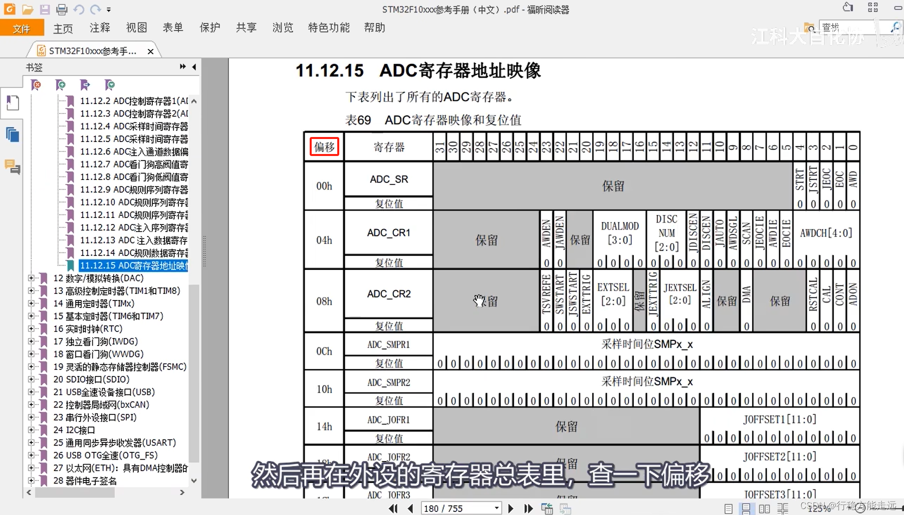


**8-1 DMA数据转运**  
把一个数组里面的数据，复制到另一个数组里

这就是我们第一个代码的任务定义一下，DMA转运的源端数组和目的数组，初始化DMA，然后让DMA把这里DataA的数据，转运到DataB里面去。

  


初始化第一步，RCC开启DMA的时钟  
注意：这里开启DMA时钟的时候，根据型号不同开启时钟参数也不同


第二步，就可以直接调用DMA\_Init，初始化这里的各个参数了,包括外设和存储器站点的起始地址、数据宽度、地址是否自增，方向、传输计数器、是否需要自动重装、选择触发源、通道优先级，那这所有的参数，通过一个结构体，就可以配置好了


例：

```c
/* Initialize the DMA Channel1 according to the DMA_InitStructure 
members */ 
DMA_InitTypeDef DMA_InitStructure; 
DMA_InitStructure.DMA_PeripheralBaseAddr = 0x40005400; 
DMA_InitStructure.DMA_MemoryBaseAddr = 0x20000100; 
DMA_InitStructure.DMA_DIR = DMA_DIR_PeripheralSRC; 
DMA_InitStructure.DMA_BufferSize = 256; 
DMA_InitStructure.DMA_PeripheralInc = DMA_PeripheralInc_Disable; 
DMA_InitStructure.DMA_MemoryInc = DMA_MemoryInc_Enable; 
DMA_InitStructure.DMA_PeripheralDataSize = DMA_PeripheralDataSize_HalfWord; 
DMA_InitStructure.DMA_MemoryDataSize = DMA_MemoryDataSize_HalfWord; 
DMA_InitStructure.DMA_Mode = DMA_Mode_Normal; 
DMA_InitStructure.DMA_Priority = DMA_Priority_Medium; 
DMA_InitStructure.DMA_M2M = DMA_M2M_Disable; 
DMA_Init(DMA_Channel1, &DMA_InitStructure); 

```

之后，就可以进行开关控制，DMA\_Cmd，给指定的通道使能，就完成了。那在这里，如果你选择的是硬件触发不要忘了在对应的外设调用一下XXX\_DMACmd，开启一下触发信号的输出；如果你需要DMA的中断，那就调用DMA\_ITConfig，开启中断输出，再在NVIC里，配置相应的中断通道，然后写中断函数就行了。

最后，在运行的过程中，如果转运完成，传输计数器清0了。这时想再给传输计数器赋值的话，就DMA失能、写传输计数器、DMA使能，这样就行了。

MyDMA.h

```c
#ifndef __MYDMA_H
#define __MYDMA_H

void MyDMA_Init(uint32_t AddrA, uint32_t AddrB, uint16_t Size);
void MyDMA_Transfer(void);

#endif

```

MyDMA.c

```c
#include "stm32f10x.h"                  // Device header

uint16_t MyDMA_Size;					//定义全局变量，用于记住Init函数的Size，供Transfer函数使用

/**
  * 函    数：DMA初始化
  * 参    数：AddrA 原数组的首地址
  * 参    数：AddrB 目的数组的首地址
  * 参    数：Size 转运的数据大小（转运次数）
  * 返 回 值：无
  */
void MyDMA_Init(uint32_t AddrA, uint32_t AddrB, uint16_t Size)
{
	MyDMA_Size = Size;					//将Size写入到全局变量，记住参数Size
	
	/*开启时钟*/
	RCC_AHBPeriphClockCmd(RCC_AHBPeriph_DMA1, ENABLE);						//开启DMA的时钟
	
	/*DMA初始化*/
	DMA_InitTypeDef DMA_InitStructure;										//定义结构体变量
	DMA_InitStructure.DMA_PeripheralBaseAddr = AddrA;						//外设基地址，给定形参AddrA
	//对于SRAM数组，地址是编译器分配的，并不固定，所以我们一般不会写绝对地址，而是通过数组名获取地址，所以此处把数组名传过来就行
	DMA_InitStructure.DMA_PeripheralDataSize = DMA_PeripheralDataSize_Byte;	//外设数据宽度，选择字节
	DMA_InitStructure.DMA_PeripheralInc = DMA_PeripheralInc_Enable;			//外设地址自增，选择使能，数组之间的转运地址需要自增
	DMA_InitStructure.DMA_MemoryBaseAddr = AddrB;							//存储器基地址，给定形参AddrB
	DMA_InitStructure.DMA_MemoryDataSize = DMA_MemoryDataSize_Byte;			//存储器数据宽度，选择字节
	DMA_InitStructure.DMA_MemoryInc = DMA_MemoryInc_Enable;					//存储器地址自增，选择使能
	DMA_InitStructure.DMA_DIR = DMA_DIR_PeripheralSRC;						//数据传输方向，选择由外设到存储器
	DMA_InitStructure.DMA_BufferSize = Size;								//转运的数据大小（转运次数）
	DMA_InitStructure.DMA_Mode = DMA_Mode_Normal;							//模式，选择正常模式(是否使用自动重装)，不用，转运一次停下来就行
	DMA_InitStructure.DMA_M2M = DMA_M2M_Enable;								//存储器到存储器，选择使能(硬件触发还是软件触发)，选择软件触发
	DMA_InitStructure.DMA_Priority = DMA_Priority_Medium;					//优先级，选择中等
	DMA_Init(DMA1_Channel1, &DMA_InitStructure);							//将结构体变量交给DMA_Init，配置DMA1的通道1(存储器到存储器的转运，用的软件触发，通道随便选)
	
	/*DMA使能*/
	DMA_Cmd(DMA1_Channel1, DISABLE);	//这里先不给使能，初始化后不会立刻工作，等后续调用Transfer后，再开始
}

/**
  * 函    数：启动DMA数据转运
  * 参    数：无
  * 返 回 值：无
  */
void MyDMA_Transfer(void)
{
	DMA_Cmd(DMA1_Channel1, DISABLE);					//DMA失能，在写入传输计数器之前，需要DMA暂停工作
	DMA_SetCurrDataCounter(DMA1_Channel1, MyDMA_Size);	//写入传输计数器，指定将要转运的次数
	DMA_Cmd(DMA1_Channel1, ENABLE);						//DMA使能，开始工作
	
	while (DMA_GetFlagStatus(DMA1_FLAG_TC1) == RESET);	//等待DMA工作完成    如果中途出错了，这里是不就卡死了？
	DMA_ClearFlag(DMA1_FLAG_TC1);						//清除工作完成标志位
}

```

mian.c:

```c
#include "stm32f10x.h"                  // Device header
#include "Delay.h"
#include "OLED.h"
#include "MyDMA.h"

// 这里给成千上万个数才能体现DMA优势，这里只是测试用
uint8_t DataA[] = {0x01, 0x02, 0x03, 0x04};				//定义测试数组DataA，为数据源
uint8_t DataB[] = {0, 0, 0, 0};							//定义测试数组DataB，为数据目的地

int main(void)
{
	/*模块初始化*/
	OLED_Init();				//OLED初始化
	
	MyDMA_Init((uint32_t)DataA, (uint32_t)DataB, 4);	//DMA初始化，把源数组和目的数组的地址传入
	
	/*显示静态字符串*/
	OLED_ShowString(1, 1, "DataA");
	OLED_ShowString(3, 1, "DataB");
	
	/*显示数组的首地址*/
	OLED_ShowHexNum(1, 8, (uint32_t)DataA, 8);
	OLED_ShowHexNum(3, 8, (uint32_t)DataB, 8);
		
	while (1)
	{
		DataA[0] ++;		//变换测试数据
		DataA[1] ++;
		DataA[2] ++;
		DataA[3] ++;
		
		OLED_ShowHexNum(2, 1, DataA[0], 2);		//显示数组DataA
		OLED_ShowHexNum(2, 4, DataA[1], 2);
		OLED_ShowHexNum(2, 7, DataA[2], 2);
		OLED_ShowHexNum(2, 10, DataA[3], 2);
		OLED_ShowHexNum(4, 1, DataB[0], 2);		//显示数组DataB
		OLED_ShowHexNum(4, 4, DataB[1], 2);
		OLED_ShowHexNum(4, 7, DataB[2], 2);
		OLED_ShowHexNum(4, 10, DataB[3], 2);
		
		Delay_ms(1000);		//延时1s，观察转运前的现象
		
		MyDMA_Transfer();	//使用DMA转运数组，从DataA转运到DataB
		
		OLED_ShowHexNum(2, 1, DataA[0], 2);		//显示数组DataA
		OLED_ShowHexNum(2, 4, DataA[1], 2);
		OLED_ShowHexNum(2, 7, DataA[2], 2);
		OLED_ShowHexNum(2, 10, DataA[3], 2);
		OLED_ShowHexNum(4, 1, DataB[0], 2);		//显示数组DataB
		OLED_ShowHexNum(4, 4, DataB[1], 2);
		OLED_ShowHexNum(4, 7, DataB[2], 2);
		OLED_ShowHexNum(4, 10, DataB[3], 2);

		Delay_ms(1000);		//延时1s，观察转运后的现象
	}
}

```


如果你想把flash的数据转运到sram里的话，可以在这个DataA前面加一个const，把DataA定义在flash里面，那下面这里DataA++就不能要了，因为const数据不能重新更改，然后编译下载看一下。


**8-2 DMA+AD多通道**  
用ADC的扫描模式来实现多通道采集，然后使用DMA来进行数据转运

接下来我们来写第二个程序ADC加DMA应用，先看一下接线图，这里接线图和上一节AD多通道是一样的，也是PA0接个电位器，PA1到PA3接三个传感器模块的AO输出。


AD.h

```c
#ifndef __AD_H
#define __AD_H

extern uint16_t AD_Value[4];

void AD_Init(void);

#endif

```

AD.c

```c
#include "stm32f10x.h"                  // Device header

uint16_t AD_Value[4];					//定义用于存放AD转换结果的全局数组

/**
  * 函    数：AD初始化
  * 参    数：无
  * 返 回 值：无
  */
void AD_Init(void)
{
	/*开启时钟*/
	RCC_APB2PeriphClockCmd(RCC_APB2Periph_ADC1, ENABLE);	//开启ADC1的时钟
	RCC_APB2PeriphClockCmd(RCC_APB2Periph_GPIOA, ENABLE);	//开启GPIOA的时钟
	RCC_AHBPeriphClockCmd(RCC_AHBPeriph_DMA1, ENABLE);		//开启DMA1的时钟
	
	/*设置ADC时钟*/
	RCC_ADCCLKConfig(RCC_PCLK2_Div6);						//选择时钟6分频，ADCCLK = 72MHz / 6 = 12MHz
	
	/*GPIO初始化*/
	GPIO_InitTypeDef GPIO_InitStructure;
	GPIO_InitStructure.GPIO_Mode = GPIO_Mode_AIN;
	GPIO_InitStructure.GPIO_Pin = GPIO_Pin_0 | GPIO_Pin_1 | GPIO_Pin_2 | GPIO_Pin_3;
	GPIO_InitStructure.GPIO_Speed = GPIO_Speed_50MHz;
	GPIO_Init(GPIOA, &GPIO_InitStructure);					//将PA0、PA1、PA2和PA3引脚初始化为模拟输入
	
	/*规则组通道配置  扫描PA0到PA3这四个通道  点四个菜 菜单上1~4号空位，我填上了0~3这四个通道 这个通道和次序可任意修改*/
	ADC_RegularChannelConfig(ADC1, ADC_Channel_0, 1, ADC_SampleTime_55Cycles5);	//规则组序列1的位置，配置为通道0
	ADC_RegularChannelConfig(ADC1, ADC_Channel_1, 2, ADC_SampleTime_55Cycles5);	//规则组序列2的位置，配置为通道1
	ADC_RegularChannelConfig(ADC1, ADC_Channel_2, 3, ADC_SampleTime_55Cycles5);	//规则组序列3的位置，配置为通道2
	ADC_RegularChannelConfig(ADC1, ADC_Channel_3, 4, ADC_SampleTime_55Cycles5);	//规则组序列4的位置，配置为通道3
	
	/*ADC初始化*/
	ADC_InitTypeDef ADC_InitStructure;											//定义结构体变量
	ADC_InitStructure.ADC_Mode = ADC_Mode_Independent;							//模式，选择独立模式，即单独使用ADC1
	ADC_InitStructure.ADC_DataAlign = ADC_DataAlign_Right;						//数据对齐，选择右对齐
	ADC_InitStructure.ADC_ExternalTrigConv = ADC_ExternalTrigConv_None;			//外部触发，使用软件触发，不需要外部触发
	ADC_InitStructure.ADC_ContinuousConvMode = ENABLE;							//连续转换，使能，每转换一次规则组序列后立刻开始下一次转换
	ADC_InitStructure.ADC_ScanConvMode = ENABLE;								//扫描模式，使能，扫描规则组的序列，扫描数量由ADC_NbrOfChannel确定(告诉厨师，我点了四个菜，你不要只盯着一个菜看)
	ADC_InitStructure.ADC_NbrOfChannel = 4;										//通道数，为4，扫描规则组的前4个通道
	ADC_Init(ADC1, &ADC_InitStructure);											//将结构体变量交给ADC_Init，配置ADC1
	
	/*DMA初始化  想象成一个服务员，ADC这个厨师把菜做好了，DMA这个服务员尽快端菜防止被覆盖*/
	DMA_InitTypeDef DMA_InitStructure;											//定义结构体变量
	DMA_InitStructure.DMA_PeripheralBaseAddr = (uint32_t)&ADC1->DR;				//外设基地址，给定形参AddrA(端菜的源头地址 之前算过ADC1的DR寄存器地址是0X4001 244C可以这样来填，这里库函数已经算好了)
	DMA_InitStructure.DMA_PeripheralDataSize = DMA_PeripheralDataSize_HalfWord;	//外设数据宽度，选择半字，对应16为的ADC数据寄存器  来转运
	DMA_InitStructure.DMA_PeripheralInc = DMA_PeripheralInc_Disable;			//外设地址自增，选择失能，始终以ADC数据寄存器为源(不自增，始终转运同一个位置的数据)
	DMA_InitStructure.DMA_MemoryBaseAddr = (uint32_t)AD_Value;					//存储器基地址(端菜的目的地，我们想把数据存在SRAM数组里)，给定存放AD转换结果的全局数组AD_Value
	DMA_InitStructure.DMA_MemoryDataSize = DMA_MemoryDataSize_HalfWord;			//存储器数据宽度，选择半字，与源数据宽度对应
	DMA_InitStructure.DMA_MemoryInc = DMA_MemoryInc_Enable;						//存储器地址自增，选择使能，每次转运后，数组移到下一个位置
	DMA_InitStructure.DMA_DIR = DMA_DIR_PeripheralSRC;							//数据传输方向，选择由外设到存储器，ADC数据寄存器转到数组
	DMA_InitStructure.DMA_BufferSize = 4;										//转运的数据大小（转运次数），与ADC通道数一致，4个ADC通道传输4次
	DMA_InitStructure.DMA_Mode = DMA_Mode_Circular;								//模式，选择循环模式，与ADC的连续转换一致 (可以给单次，也可以给自动重装载的循环模式)
	DMA_InitStructure.DMA_M2M = DMA_M2M_Disable;								//存储器到存储器，选择失能，不使用软件触发，硬件触发 触发源为ADC1 数据由ADC外设触发转运到存储器(厨师每个菜做好了，叫我一下我再去端菜，这样时机才合适)
	DMA_InitStructure.DMA_Priority = DMA_Priority_Medium;						//优先级，选择中等
	DMA_Init(DMA1_Channel1, &DMA_InitStructure);								//将结构体变量交给DMA_Init，配置DMA1的通道1  这里必须填通道一，前面图里可以看到ADC1的硬件触发只接在了DMA1的通道1上
	
	/*DMA和ADC使能*/
	DMA_Cmd(DMA1_Channel1, ENABLE);							//DMA1的通道1使能
	ADC_DMACmd(ADC1, ENABLE);								//ADC1触发DMA1的信号使能 开启DMA触发信号
	ADC_Cmd(ADC1, ENABLE);									//ADC1使能
	
	/*ADC校准*/
	ADC_ResetCalibration(ADC1);								//固定流程，内部有电路会自动执行校准
	while (ADC_GetResetCalibrationStatus(ADC1) == SET);
	ADC_StartCalibration(ADC1);
	while (ADC_GetCalibrationStatus(ADC1) == SET);
	
	/*ADC触发*/
	//ADC连续扫描+DMA循环转运的模式
	ADC_SoftwareStartConvCmd(ADC1, ENABLE);	//软件触发ADC开始工作，由于ADC处于连续转换模式，故触发一次后ADC就可以一直连续不断地工作
	
	//ADC单次扫描+DMA单次转运的模式  放到主函数while循环里
	/*
	void AD_GetValue(void)
	{
		DMA_Cmd(DMA1_Channel1, DISABLE);					//DMA失能，在写入传输计数器之前，需要DMA暂停工作
		DMA_SetCurrDataCounter(DMA1_Channel1, 4);			//写入传输计数器，指定将要转运的次数
		DMA_Cmd(DMA1_Channel1, ENABLE);						//DMA使能，开始工作

		ADC_SoftwareStartConvCmd(ADC1, ENABLE);	
		
		while (DMA_GetFlagStatus(DMA1_FLAG_TC1) == RESET);	//等待DMA工作完成    如果中途出错了，这里是不就卡死了？
		DMA_ClearFlag(DMA1_FLAG_TC1);						//清除工作完成标志位
	}
	*/
	
}

```

main.c

```c
#include "stm32f10x.h"                  // Device header
#include "Delay.h"
#include "OLED.h"
#include "AD.h"

int main(void)
{
	/*模块初始化*/
	OLED_Init();				//OLED初始化
	AD_Init();					//AD初始化
	
	/*显示静态字符串*/
	OLED_ShowString(1, 1, "AD0:");
	OLED_ShowString(2, 1, "AD1:");
	OLED_ShowString(3, 1, "AD2:");
	OLED_ShowString(4, 1, "AD3:");
	
	while (1)
	{
		OLED_ShowNum(1, 5, AD_Value[0], 4);		//显示转换结果第0个数据
		OLED_ShowNum(2, 5, AD_Value[1], 4);		//显示转换结果第1个数据
		OLED_ShowNum(3, 5, AD_Value[2], 4);		//显示转换结果第2个数据
		OLED_ShowNum(4, 5, AD_Value[3], 4);		//显示转换结果第3个数据
		
		Delay_ms(100);							//延时100ms，手动增加一些转换的间隔时间
	}
}

```


ADC连续扫描+DMA循环转运的模式，这样也可以完成ad多通道转换的功能，可以看到此时硬件外设已经实现了相互配合和高度的自动化，各种操作都是硬件自己完成的，极大的减轻的软件负担，软件什么都不需要做，也不需要进任何中断，硬件自动就把活干完了，另外这里你还可以再加一个外设，比如定时器，ADC用单次扫描，再用定时器去定时触发，这样就是定时器触发ADC，ADC触发DMA，整个过程完全自动，不需要程序手动进行操作，节省软件资源，这就是STM2中硬件自动化的一大特色  
各个外设互相连接，互相交织，不再是传统的一个cpu单独控制多个独立的外设这样的星型结构，而是外设之间互相连接，互相合作，形成一个网状结构，这样在完成某些简单且繁琐的工作的时候，就不需要cpu来统一调度了，可以直接通过外设之间的相互配合，自动完成这些繁琐的工作，这样不仅可以减轻cpu的负担，还可以大大提高外设的性能，在我们之前的学习中，也经常遇到过这样的设计，比如定时器的输出可以通向ADC、DAC或其他定时器，ADC的触发源可以来自定时器或外部中断，DMA的触发源可以来自ADC、定时器、串口等等，这就是这个STM32外设互相配合工作的特色。

本节课的内容就差不多了，还有一个存储器到外设的情况我们目前还没有讲，比如串口发送一批数据，就可以使用DMA进行存储器到外设的转运，这个就留给大家以后自己去研究了。

## USART串口


补充：I2C和SPI由于具有独立的时钟线，因此它们是同步的。在时钟信号的指引下，接收方可以采样数据。然而，串口、CAN和USB没有时钟线，因此需要双方约定一个采样频率，这就是异步通信。为了对齐采样位置，还需要添加一些帧头和帧尾等标识。  
同步靠时钟线，异步靠比特率


电平标准

根据通讯使用的电平标准不同，串口通讯可分为TTL标准及RS-232标准，见表 TTL电平标准与RS232电平标准 。


串口常用的电瓶标准有如下三种，第一种就是最常见的TTL电平，+3.3V或者+5V表示1，0V表示0，这里1的电压，如果你是5V的器件就是+5V，如果是3.3V的器件，就是+3.3V，逻辑1就是高电平的电压，就是vcc的电压，除了ttl电平串口，还有rs232电平和rs485电平，其中rs232电平的规定是-3到-15V表示1，+3到+15V表示0，rs232电平一般在大型的机器上使用啊，由于环境可能比较恶劣，静电干扰比较大，所以这里电平的电压都比较大，而且允许波动的范围也很大，另外还有rs485电平，它的规定是两项压差，+2到+6V表示1，-2到-6伏表示0，这里电平参考是两线压差，所以rs485的电平是差分信号，差分信号抗干扰能力非常强悍，使用rs485电平标准通信距离可以达到上千米，而上面这两种电平最远只能达到几十米，像单片机这种低压小型设备使用的都是TTL电平，我们之后的内容也都是基于ttl电平来讲解的，如果你做设备需要其他的电瓶，那就再加电平转换芯片就行了，在软件层面，它们都属于串口，所以程序并不会有什么变化。

因为控制器一般使用TTL电平标准，所以常常会使用MAX232芯片对TTL及RS-232电平的信号进行互相转换。


串口中，每一个字节都装载在一个数据帧里面，每个数据帧都由起始位、数据位和停止位组成。

波特率

本章中主要讲解的是串口异步通讯，异步通讯中由于没有时钟信号(如前面讲解的DB9接口中是没有时钟信号的)， 所以两个通讯设备之间需要约定好波特率。

例如，如果每隔1秒发送一位，那么接收方也必须每隔1秒接收一位。如果接收方过早接收，则可能会重复接收某些位；如果接收方过晚接收，则可能会错过某些位。因此，发送方和接收方必须约定好传输速率，这个速率参数，就是波特率。

波特率本来的意思是每秒传输码元的个数，单位是码元/s或者直接叫波特（Baud），另外还有个速率表示叫比特率，比特率的意思是每秒传输的比特数，单位是bit/s或者叫bps，1个字节等于8个比特位，在二进制调制的情况下，一个码元就是一个bit，此时波特率就等于比特率，像我们单片机的串口通信基本都是二进制调制，也就是高电平表示一，低电平表示零，一位就是一bit，所以说这个串口的波特率经常会和比特率混用哈，不过这也是没关系的，因为这两个说法的数值相等，如果是多进制调制，那波特率就和比特率不一样了，这个了解一下，那反映到波形上，比如我们双方规定波特率为1000bps，那就表示一秒要发1000位，每一位的时间就是1ms，也就是这里这一段时间是1ms，发送方每隔1ms发送一位，接收方每隔一毫秒接收一位，这就是波特率，它决定了每隔多久发送一位。

通讯的起始和停止信号

起始位，它是标志一个数据帧的开始，固定为低电平。首先，串口的空闲状态是高电平，也就是没有数据传输的时候，然后需要传输的时候，必须要先发送一个起始位，这个起始位必须是低电平，来打破空闲状态的高电平，产生一个下降沿。这个下降沿，就告诉接收设备，这一帧数据要开始了。如果没有起始位，那当我发送8个1的时候，是不是数据线就一直都是高电平，没有任何波动，对吧。这样，接收方怎么知道我发送数据了呢。

同理，在一个字节数据发送完成后，必须要有一个停止位，这个停止位的作用是，用于数据帧间隔，固定为高电平。同时这个停止位，也是为下一个起始位做准备的，如果没有停止位，那当我数据最后一位是0的时候，下次再发送新的一帧，是不是就没法产生下降沿了，对吧。这就是起始位和停止位的作用。起始位固定为0，产生下降沿，表示传输开始；停止位固定为1，把引脚恢复成高电平，方便下一次的下降沿，如果没有数据了，正好引脚也为高电平，代表空闲状态。

数据位：

这里数据位表示数据帧的有效载荷，1为高电平，0为低电平，低位先行。比如我要发送一个字节，是0x0F，那就首先把0F转换为二进制，就是0000 1111，然后低位先行，所以数据要从低位开始发送，也就是1111 0000，像这样，依次放在发送引脚上。所以说如果你想发0x0F这一个字节数据，那就按照波特率要求，定时翻转引脚电平，产生一个这样的波形就行了。

有效数据

在数据包的起始位之后紧接着的就是要传输的主体数据内容，也称为有效数据，有效数据的长度常被约定为5、6、7或8位长。

数据校验

最后看一下校验位，它的用途是，用于数据验证，是根据数据位计算得来的。这里串口，使用的是一种叫奇偶校验的数据验证方法，奇偶校验可以判断数据传输是不是出错了。如果数据出错了，可以选择丢弃或者要求重传，校验可以选择3种方式，无校验、奇校验和偶校验。无校验，就是不需要校验位，波形就是左边这个，起始位、数据位、停止位，总共3个部分。

奇校验要求有效数据和校验位中“1”的个数为奇数，比如一个8位长的有效数据为：01101001，此时总共有4个“1”， 为达到奇校验效果，校验位为“1”，最后传输的数据将是8位的有效数据加上1位的校验位总共9位。

偶校验与奇校验要求刚好相反，要求帧数据和校验位中“1”的个数为偶数， 比如数据帧：11001010，此时数据帧“1”的个数为4个，所以偶校验位为“0”。

0校验是不管有效数据中的内容是什么，校验位总为“0”，1校验是校验位总为“1”。

当然奇偶校验的检出率并不是很高，比如如果有两位数据同时出错。奇偶特性不变，那就校验不出来了，所以奇偶校验只能保证一定程度上的数据校验。如果想要更高的检出率，可以了解一下CRC校验，这个校验会更加好用，当然也会更复杂。我们这个STM32内部也有CRC的外设，可以了解一下，那到这里，串口的时序我们就了解了。

说明：我们这里的数据位，有两种表示方法，一种是把校验位作为数据位的一部分，分为8位数据和9位数据，其中9位数据，就是8位有效载荷和1位校验位；另一种就是把数据位和校验位独立开，数据位就是有效载荷，校验位就是独立的1位，像我这上面的描述，就是把数据位和校验位分开描述了，在串口助手里也是分开描述，总之，无论是合在一起，还是分开描述，描述的都是同一个东西，这个应该也好理解。

串口时序波形

  
这些波形我是用示波器实测的，操作方法是把探头的GND接在负极，探头接在发送设备的tx引脚  
，然后发送数据就能捕捉到这些波形了，那我们先看一下第一个波形，这个波形是发送一个字节数据0x55时，在tx引脚输出的波形，波特率是9600，所以每一位的时间就是1÷9600，大概是104us，可以看到这里一位就是100微秒多一点就是104us，没发送数据的时候是空闲状态高电平，数据帧开始先发送起始位产生下降沿，代表数据帧开始，数据0x55 转为二进制，低位先行，就是一次发送10101010，然后这个参数是八位数据，1位停止无效验位，所以之后就是停止位，把引脚置回高电平，这样一个数据帧就完成了，在STM32中，这个根据字节数据翻转高低电平，是由USART外设自动完成的，不用我们操心，当然你也可以软件模拟产生这样的波形，那就是定时器定一个104微秒的时间，时间到之后按照数据帧的要求调用GPIO\_WriteBit置高低电平，产生一个和这一模一样的波形，这样也是可以完成串口通讯的，tx引脚发送，就是置高低电平，那在rx引脚接收就是读取高低电平了，这也可以由USART外设自动来完成，不用我们操心，如果想要软件模拟的话，那就是定时调用GPIO\_ReadInputDataBit来读取每一位，最终拼接成一个字节，当然接收的时候应该还需要一个外部中断，在起始位的下降沿触发，进入接收状态，并且对齐采样时钟，然后依次采样8次，这就是接收的逻辑。

总结一下就是，TX引脚输出定时翻转的高低电平，RX引脚定时读取引脚的高低电平。每个字节的数据加上起始位、停止位、可选的校验位，打包为数据帧，依次输出在TX引脚，另一端RX引脚依次接收，这样就完成了字节数据的传递，这就是串口通信。

了解完串口协议，接下来我们就来看一下STM32的USART外设

STM32的USART串口


我们经常还会遇到串口，叫UART，少了个S，就是通用异步收发器，一般我们串口很少使用这个同步功能，所以USART和UART使用起来，也没有什么区别。其实这个STM32的USART同步模式，只是多了个时钟输出而已，它只支持时钟输出，不支持时钟输入，所以这个同步模式更多的是为了，兼容别的协议或者特殊用途而设计的，并不支持两个USART之间进行同步通信。所以我们学习串口，主要还是异步通信。

我们之前学习了串口的协议，串口主要就是靠收发这样的、约定好的波形来进行通信的，那这个USART外设，就是串口通信的硬件支持电路。当我们配置好了USART电路，直接读写数据寄存器就能自动发送和接收数据的使用还是非常方便的。

  
这个波特率发生器，就是用来配置波特率的，它其实就是一个分频器，比如我们APB2总线给个72MHZ频率，然后波特率发生器进行一个分频，得到我们想要的波特率时钟，最后在这个时钟下进行收发，就是我们指定的通信波特率。

串行通信一般是以帧格式传输数据，即是一帧一帧的传输，每帧包含有起始信号、数据信息、停止信息， 可能还有校验信息。USART就是对这些传输参数有具体规定，当然也不是只有唯一一个参数值，很多参数值都可以自定义设置，只是增强它的兼容性。


这个同步模式，就是多了个时钟CLK的输出；硬件流控制，比如A设备的TX脚向B设备的RX脚发送数据，A设备一直在发，发的太快了，B处理不过来，如果没有硬件流控制，那B就只能抛弃新数据或者覆盖原数据了。如果有硬件流控制，在硬件电路上，会多出一根线，如果B没准备好接收，就置高电平，如果准备好了，就置低电平。A接收到了B反馈的准备信号，就只会在B准备好的时候，才发数据，如果B没准备好，那数据就不会发送出去。这就是硬件流控制，可以防止因为B处理慢而导致数据丢失的问题；之后DMA，是这个串口支持DMA进行数据转运，可以使用DMA转运数据，减轻CPU的负担；最后，智能卡、IrDA、LIN，这些是其他的一些协议。因为这些协议和串口是非常的像，所以STM32就对USART加了一些小改动，就能兼容这么多协议了，不过我们一般不用，像这些协议，Up主也都没用过。

最后看一下我们这个芯片的USART资源，STM32F103C8T6的USART资源有USART1、USART2、USART3，总共三个独立的USART外设，可以挂载很多串口设备，其中这里USART1是APB2总线上的设备，剩下的都是APB1总线中的设备，开启时钟的时候注意一下。

**USART框图详解**


接下来我们来看一下USART的框图，这个框图大家第一眼看上去还是非常复杂的是吧，实际上主要部分也没有很多，他这里就是把各个寄存器和寄存器每一位控制的地方都画出来了，所以才显得比较乱  
，我们看的时候可以先忽略这些寄存器，先看主体结构。

引脚部分：


TX： 发送数据输出引脚。

RX： 接收数据输入引脚。

SCLK： 发送器时钟输出引脚。这个引脚仅适用于同步模式。

下面这里的SWRX、IRDA\_OUT/IN这些是智能卡和IrDA通信的引脚，我们不用这些协议，所以这些引脚就不用管的。

SW\_RX： 数据接收引脚，只用于单线和智能卡模式，属于内部引脚，没有具体外部引脚。

nRTS： 请求以发送(Request To Send)，n表示低电平有效。如果使能RTS流控制，当USART接收器准备好接收新数据时就会将nRTS变成低电平； 当接收寄存器已满时，nRTS将被设置为高电平。该引脚只适用于硬件流控制。

nCTS： 清除以发送(Clear To Send)，n表示低电平有效。如果使能CTS流控制，发送器在发送下一帧数据之前会检测nCTS引脚， 如果为低电平，表示可以发送数据，如果为高电平则在发送完当前数据帧之后停止发送。该引脚只适用于硬件流控制。

数据寄存器：


一个是发送数据寄存器TDR(Transmit DR)，另一个是接收数据计算器RDR(Receive DR)，这两个寄存器占用同一个地址，就跟51单片机串口的SBUF寄存器一样，在程序上只表现为一个寄存器，就是数据寄存器DR(Data Register)，但实际硬件中是分成了两个寄存器，一个用于发送TDR，一个用于接收RDR，TDR是只写的，RDR是只读的，当你进行写操作时，数据就写到了TDR，当你进行读操作时，数据就是从RDR读出来的，这个了解一下。

移位寄存器：

然后往下看，下面是两个移位寄存器，一个用于发送，一个用于接收。发送移位寄存器的作用就是，把一个字节的数据一位一位地移出去，正好对应串口协议的波形的数据位。  
这两个寄存器是怎么工作的呢？（图中主要讲的是发送寄存器）


注意一下，当TXE标志位置1时，数据其实还没有发送出去，只要数据从TDR转移到发送移位寄存器了，TXE就会置1，我们就可以写入新的数据了。简单来说，就是你数据一旦从TDR转移到移位寄存器了，管你有没有移位完成，我就立刻把下一个数据放在TDR等着，一旦移完了，新的数据就会立刻跟上，这样做效率就会比较高。

看一下接收端这里，也是类似的。数据从RX引脚通向接收移位寄存器，在接收器控制的驱动下，一位一位地读取RX电平，先放在最高位，然后向右移，移位8次之后，就能接收一个字节了。同样，因为串口协议规定是低位先行，所以接收移位寄存器是从高位往低位这个方向移动的。之后，当一个字节移位完成之后，这一个字节的数据就会整体地，一下子转移到接收数据寄存器RDR里来，在转移的过程中，也会置一个标志位叫RXNE （RXNot Empty），接收数据寄存器非空，当我们检测到RXNE置1之后，就可以把数据读走了。同样，这里也是两个寄存器进行缓存，当数据从移位寄存器转移到RDR时，就可以直接移位接收下一帧数据了。

==总结就是：==
==发送数据寄存器（TDR）把数据发送到  发送移位寄存器后，TXE标志位置1，表示可以发送下一条数据了==
==接收数据寄存器（RDR）将接收数据移走后，RXNE标志位置0，表示可以接受下一条数据了，如果RXNE为1表示正在接受数据==

这就是USART外设整个的工作流程，其实讲到这里，这个外设的主要功能就差不多了。大体上，就是数据寄存器和移位寄存器，发送移位寄存器往TX引脚移位，接收移位寄存器从RX引脚移位。当然发送还需要加上帧头帧尾，接收还需要剔除帧头帧尾，这些操作，它内部有电路会自动执行。我们知道有硬件帮我们做了这些工作就行了。

接着我们继续看一下下面的控制部分和一些其他的增强功能

硬件流控：

下面这里是发送器控制，它就是用来控制发送移位寄存器的工作的；接收器控制，用来控制接收移位寄存器的工作；然后左边这里，有一个硬件数据流控，也就是硬件流控制，简称流控。

这里流控有两个引脚，一个是nRTS，一个是nCTS。nRTS（Request To Send）是请求发送，是输出脚，也就是告诉别人，我当前能不能接收；nCTS （Clear To Send）是清除发送，是输入脚，也就是用于接收别人nRTS的信号的。

   

这里前面加个n意思是低电平有效，那这两个脚上怎么玩的呢？

首先，我们需要找到一个支持流控的串口，并将它的TX连接到我们的RX。同时，我们的RTS需要输出一个接收反馈信号，并将其连接到对方的CTS。当我们可以接收数据时，RTS会置为低电平，请求对方发送。对方的CTS接收到信号后，就可以继续发送数据。如果处理不过来，比如接收数据寄存器未及时读取，导致新数据无法接收，此时RTS会置为高电平，对方的CTS接收到信号后，就会暂停发送，直到接收数据寄存器被读走，RTS重新置为低电平，数据才会继续发送。

反过来当我们的TX向对方发送数据时，对方的RTS会连接到我们的CTS，用于判断对方是否可以接收数据。TX和CTS是一对对应的信号，RX和RTS也是一对对应的信号。此外，CTS和RTS之间也需要交叉连接，这就是流控的工作模式。==然而，我们一般不使用流控，因此只需要了解一下即可。==

SCLK控制：


接着继续看右边这个模块，这部分电路用于产生同步的时钟信号，它是配合发送移位寄存器输出的，发送寄存器每移位一次，同步时钟电平就跳变一个周期。时钟告诉对方，我移出去一位数据，你看要不要让我这个时钟信号来指导你接收一下？当然这个时钟只支持输出，不支持输入，所以两个USART之间，不能实现同步的串口通信。

那这个时钟信号有什么用呢？  
兼容别的协议。比如串口加上时钟之后，就跟SPI协议特别像,所以有了时钟输出的串口，就可以兼容SPI。另外这个时钟也可以做自适应波特率，比如接收设备不确定发送设备给的什么波特率，就可以先测量一下这个时钟的周期，然后再计算得到波特率，不过这就需要另外写程序来实现这个功能了。==这个时钟功能，我们一般不用，所以也是了解一下就行==

唤醒单元：


这部分的作用是实现串口挂载多设备。我们之前说，串口一般是点对点的通信（只支持两个设备互相通信）。而多设备，在一条总线上，可以接多个从设备，每个设备分配一个地址，我想跟某个设备通信，就先进行寻址，确定通信对象，再进行数据收发。那回到这里，这个唤醒单元就可以用来实现多设备的功能，在这里可以给串口分配一个地址，当你发送指定地址时，此设备唤醒开始工作，当你发送别的设备地址时，别的设备就唤醒工作，这个设备没收到地址，就会保持沉默。这样就可以实现多设备的串口通信了，==这部分功能我们一般不用。==

中断输出控制：


中断申请位，就是状态寄存器这里的各种标志位，状态寄存器这里，有两个标志位比较重要，一个是TXE发送寄存器空（表示），另一个是RXNE接收寄存器非空（非空表示），这两个是判断发送状态和接收状态的必要标志位，剩下的标志位，了解一下就行。中断输出控制这里，就是配置中断是不是能通向NVIC，这个应该好理解。

波特率发生器部分：


波特率发生器其实就是分频器，APB时钟进行分频，得到发送和接收移位的时钟。看一下，这里时钟输入是fPCLKx（x=1或2），（USART1挂载在APB2，所以就是PCLK2的时钟，一般是72M；其他的USART都挂载在APB1，所以是PCLK1的时钟，一般是36M）之后这个时钟进行一个分频，除一个USARTDIV的分频系数，并且分为了整数部分和小数部分，因为有些波特率，用72M除一个整数的话，可能除不尽，会有误差。所以这里分频系数是支持小数点后4位的，分频就更加精准，之后分频完之后，还要再除个16，得到发送器时钟和接收器时钟，通向控制部分。然后右边这里，如果TE (TX Enable）为1，就是发送器使能了，发送部分的波特率就有效；如果RE（RX Enable）为1，就是接收器使能了，接收部分的波特率就有效。

然后剩下还有一些寄存器的指示  
比如各个CR控制寄存器的哪一位控制哪一部分电路，SR状态寄存器都有哪些标志位，这些可以自己看看手册里的寄存器描述，那里的描述比这里清晰很多。

引脚定义表，这里复用功能这一栏，就给出了每个USART它的各个引脚都是复用在了哪个GPIO上的。


这些引脚都必须按照引脚定义里的规定来，或者看一下重映射这里，有没有重映射，这里有USART1的重映射，所以有机会换一次口，剩下引脚，就没有机会作为USART1的接口了。


USART基本结构  
给的一个简化结构图


那到这里，USART的基本结构就讲完了。

几个小细节  
数据帧：  
这个图，是在程序中配置8位字长和9位字长的波形对比。这里的字长，就是我们前面说的数据位长度。他这里的字长，是包含校验位的，是这种描述方式。


总的来说，这里有4种选择，9位字长，有校验或无校验；8位字长，有校验或无校验。但我们最好选择9位字长 有校验，或8位字长 无校验，这两种，这样每一帧的有效载荷都是1字节，这样才舒服。

配置停止位：  
那最后这些时钟什么的，和上面也都是类似的  
接下来我们继续来看这个数据帧，看一下不同停止位的波形变化。STM32的串口，可以配置停止位长度为0.5、1、1.5、2，这四种。


这四种参数的区别，就是停止位的时长不一样。第一个是1个停止位，这时停止位的时长就和数据位的一位，时长一样；然后是1.5个停止位，这时的停止位就是数据位一位，时长的1.5倍；2个停止位，那停止位时长就是2倍；0.5个停止位，时长就是0.5倍。这个也好理解，就是控制停止位时长的，一般选择1位停止位就行了，其他的参数不太常用。这个是停止位。


起始位侦测和数据采样：

那之后，我们继续来看一些细节问题，这两个图展示的是USART电路输入数据的一些策略。对于串口来说，根据我们前面的介绍，可以想到，串口的输出TX应该是比输入RX简单很多，输出你就定时翻转TX引脚高低电平就行了。但是输入，就复杂一些。你不仅要保证，输入的采样频率和波特率一致，还要保证每次输入采样的位置，【要正好处于每一位的正中间，只有在每一位的正中间采样，这样高低电平读进来，才是最可靠的，如果你采样点过于靠前或靠后，那有可能高低电平还正在翻转，电平还不稳定，或者稍有误差，数据就采样错了】。另外，输入最好还要对噪声有一定的判断能力，如果是噪声，最好能置个标志位提醒我一下，这些就是输入数据所面临的问题。  
那我们来看一下STM32是如何来设计输入电路的呢？


第一个图展示了USART的起始位侦测。当输入电路侦测到数据帧的起始位后，将以波特率的频率连续采样一帧数据。同时，从起始位开始，采样位置要对齐到位的正中间。只要第一位对齐了，后面就都是对齐的。

为了实现这些功能，输入电路对采样时钟进行了细分，以波特率的16倍频率进行采样。在一位的时间里，可以进行16次采样。比如最开始时，空闲状态为高电平，采样一直是1。在某个位置突然采到0，说明两次采样之间出现了下降沿，如果没有噪声，那之后就应该是起始位了。在起始位，会进行连续16次采样，没有噪声的话，这16次采样肯定都是0。但是实际电路还是会存在一些噪声，所以这里即使出现下降沿了，后续也要再采样几次以防万一。

根据手册描述，接收电路在下降沿之后的第3次、5次、7次进行一批采样，在第8次、9次、10次再进行一批采样。这两批采样都要求每3位里面至少应有2个0。如果没有噪声，那肯定全是0，满足情况；如果有一些轻微的噪声导致3位里面只有两个0，另一个是1，那也算是检测到了起始位（但是在状态寄存器里会置一个NE（Noise Error），提醒你数据收到了但是有噪声，你悠着点用）；如果3位里面只有1个0，那就不算检测到了起始位，可能前面那个下降沿是噪声导致的，这时电路就忽略前面的数据重新开始捕捉下降沿。

这就是STM32的串口在接收过程中对噪声的处理。如果通过了这个起始位侦测那接收状态就由空闲变为接收起始位，同时第8、9、10次采样的位置就正好是起始位的正中间。之后接收数据位时就在第8、9、10次进行采样这样就能保证采样位置在位的正中间了。这就是起始位侦测和采样位置对齐的策略。

那紧跟着，我们就可以看这个数据采样的流程了。


这里，从1到16，是一个数据位的时间长度，在一个数据位，有16个采样时钟，由于起始位侦测已经对齐了采样时钟，所以，这里就直接在第8、9、10次采样数据位。为了保证数据的可靠性，这里是连续采样3次，没有噪声的理想情况下，这3次肯定全为1或者全为0，全为1，就认为收到了1，全为0，就认为收到了0；如果有噪声，导致3次采样不是全为1或者全为0，那它就按照2：1的规则来，2次为1，就认为收到了1，2次为0，就认为收到了0，在这种情况下，噪声标志位NE也会置1，告诉你，我收到数据了，但是有噪声，你悠着点用，这就是检测噪声的数据采样，可见STM32对这个电路的设计考虑还是很充分的

波特率发生器：  
那最后，我们再来看一下波特率发生器


波特率发生器就是分频器，发射器和接收器的波特率，由波特率寄存器BRR里面的DIV确定，下面这个图就是BRR寄存器，里面就是分频系数div ，div分为整数部分和小数部分，可以实现更细腻的分频，那波特率和分频系数的关系可以由计算公式进行计算，为什么这里多个16，看上面这个图就明白了吧，因为它内部还有一个16倍波特率的采样时钟，所以这里输入时钟除以div要等于16倍的波特率，最终计算波特率自然要多出一个16了。

举个例子，比如我要配置USART1为9600的波特率，那如何配置这个BRR寄存器呢？  
我们代入公式，就是9600等于 USART1的时钟是72M 除 16倍的DIV，解得，DIV=72M/9600/16，最终等于468.75，则二进制数是11101 0100.11v。所以最终写到这个寄存器就是整数部分为11101 0100，前面多出来的补0，小数部分为11，后面多出来的补0。这就是根据波特率写BRR寄存器的方法，了解一下，不过，我们用库函数配置的话，就非常方便，需要多少波特率，直接写就行了，库函数会自动帮我们算。

**手册讲解**  
USB转串口模块的内部电路图


最左边这里是usb的端口，usb有四根线，usb标准供电是5V，然后中间D+和D-是通信线，走的也是usb协议，所以这里需要加一个ch340芯片转换一下，转换之后输出的就是txd和rxd是串口协议，最后通过这里的排针引出来，那需要注意的就是这边的供电策略，首先所有的电都是从这个vcc +5V来的，然后vcc +5V通过这个稳压管电路进行稳压，得到vcc +3.3V之后，vcc +5V和vcc +3.3V都通过排针引出来了，所以这个第六脚和第四脚是分别由5V和3.3V输出的。

### 代码实战：串口发送单字节

9-1串口发送：

下面这个是我们的USB转串口的模块，这里有个跳线帽，上节也说过，要插在VCC和3V3这两个脚上，选择通信的TTL电平为3.3V，然后通信引脚，TXD和RXD，要接在STM32的PA9和PA10口。为什么是这两个口呢，我们看一下引脚定义表就知道USART1的TX是PA9, RX是PA10，我们计划用USART1进行通信，所以就选这两个脚。TX和RX交叉连接，这边一定要注意，别接错了。然后，两个设备之间要把负极接在一起，进行共地，一般多个系统之间互连，都要进行共地。最后，这个串口模块和STLINK都要插在电脑上，这样，STM32和串口模块都有独立供电，所以这里通信的电源正极就不需要接了。


当然我们第一个代码，只有STM32发送的部分，所以，通信线只有这个发送的有用，另一根线，第一个代码没有用到，暂时可以不接，在我们下一个串口发送+接收的代码，两根通信线就都需要接了。所以我们把这两根通信线一起都接上吧，这样两个代码的接线图是一模一样的。


老规矩，上来先写一个初始化函数

第一步，开启时钟，把需要用的USART和GPIO的时钟打开  
第二步，GPIO初始化，把TX配置成复用输出，RX配置成输入  
第三步，配置USART，直接使用一个结构体,就可以把这里所有的参数都配置好了  
第四步，如果你只需要发送的功能，就直接开启USART，初始化就结束了。如果你需要接收的功能，可能还需要配置中断，那就在开启USART之前，再加上ITConfig和NVIC的代码就行了。  
得益于库函数的封装，内部各种细节问题就不需要我们再关心了。

那初始化完成之后，如果要发送数据，调用一个发送函数就行了；如果要接收数据，就调用接收的函数；如果要获取发送和接收的状态，就调用获取标志位的函数，这就是USART外设的使用思路。


看一下库函数里面都有哪些库函数，我们找一下usart.h的文件，拖到最后这里函数一眼看上去还是挺多的，但是这里面很多都是那些增强功能和兼容其他协议的函数，真正常用的其实很少。

USART\_DMACmd这个可以开启USART到DMA的触发通道，需要用DMA的话可以了解一下，这两个函数比较重要，USART\_SendData发送数据，USART\_ReceiveData接收数据，这两个函数在我们发送和接收的时候会用到，SendData就是写DR寄存器，ReceiveData就是读DR寄存器。

Serial.h：

```c
#ifndef __SERIAL_H
#define __SERIAL_H

#include <stdio.h>

void Serial_Init(void);
void Serial_SendByte(uint8_t Byte);
void Serial_SendArray(uint8_t *Array, uint16_t Length);
void Serial_SendString(char *String);
void Serial_SendNumber(uint32_t Number, uint8_t Length);
void Serial_Printf(char *format, ...);

#endif

```

Serial.c：

```c
#include "stm32f10x.h"   // Device header
#include <stdio.h>//重定向printf 重写fputc
#include <stdarg.h>

/**
  * 函    数：串口初始化
  * 参    数：无
  * 返 回 值：无
  */
void Serial_Init(void)
{
	/*开启时钟*/
	RCC_APB2PeriphClockCmd(RCC_APB2Periph_USART1, ENABLE);	//开启USART1的时钟
	RCC_APB2PeriphClockCmd(RCC_APB2Periph_GPIOA, ENABLE);	//开启GPIOA的时钟
	
	/*GPIO初始化*/
	GPIO_InitTypeDef GPIO_InitStructure;
	GPIO_InitStructure.GPIO_Mode = GPIO_Mode_AF_PP;			//复用推挽输出
	//PA10要选择输入模式,输入模式并不分什么普通输入复用输入,一根线只能有一个输出,
    //但可以有多个输入,所以输入脚，外设和GPIO都可以同时用
	//一般RX配置是浮空输入或者上拉输入,因为串口波形空闲状态是高电平,所以不使用下拉输入
	GPIO_InitStructure.GPIO_Pin = GPIO_Pin_9;
	GPIO_InitStructure.GPIO_Speed = GPIO_Speed_50MHz;
	GPIO_Init(GPIOA, &GPIO_InitStructure);					//将PA9引脚初始化为复用推挽输出
	
	/*USART初始化*/
	USART_InitTypeDef USART_InitStructure;					//定义结构体变量
	USART_InitStructure.USART_BaudRate = 9600;	
    //波特率  写完之后这个函数内部会自动算好9600对应的分频系数,然后写到BRR寄存器
	USART_InitStructure.USART_HardwareFlowControl = USART_HardwareFlowControl_None;	
    //硬件流控制，不需要
	USART_InitStructure.USART_Mode = USART_Mode_Tx;			//模式，选择为发送模式
	USART_InitStructure.USART_Parity = USART_Parity_No;		//奇偶校验，不需要
	USART_InitStructure.USART_StopBits = USART_StopBits_1;	//停止位，选择1位
	USART_InitStructure.USART_WordLength = USART_WordLength_8b;	//字长，选择8位
	USART_Init(USART1, &USART_InitStructure);	//将结构体变量交给USART_Init，配置USART1
	
	/*USART使能*/
	USART_Cmd(USART1, ENABLE);				//使能USART1，串口开始运行
}

/**
  * 函    数：串口发送一个字节
  * 参    数：Byte 要发送的一个字节
  * 返 回 值：无
  */
void Serial_SendByte(uint8_t Byte)
{
	USART_SendData(USART1, Byte);//将字节数据写入数据寄存器，写入后USART自动生成时序波形
	while (USART_GetFlagStatus(USART1, USART_FLAG_TXE) == RESET);	//等待发送完成
    //reset表示0，txe：tx_empty,txe=0表示tx寄存器非空，txe=1表示tx寄存器空
	/*查看数据手册，下次写入数据寄存器会自动清除发送完成标志位，故此循环后，无需清除标志位*/
}

/**
  * 函    数：串口发送一个数组
  * 参    数：Array 要发送数组的首地址
  * 参    数：Length 要发送数组的长度
  * 返 回 值：无
  */
void Serial_SendArray(uint8_t *Array, uint16_t Length)
{
	uint16_t i;
	for (i = 0; i < Length; i ++)		//遍历数组
	{
		Serial_SendByte(Array[i]);		//依次调用Serial_SendByte发送每个字节数据
	}
}

/**
  * 函    数：串口发送一个字符串
  * 参    数：String 要发送字符串的首地址
  * 返 回 值：无
  */
void Serial_SendString(char *String)//由于字符串自带一个结束标志位，所以就不需要再传递长度参数了。
{
	uint8_t i;
	for (i = 0; String[i] != '\0'; i ++)//遍历字符数组（字符串），遇到字符串结束标志位后停止
	{	//刚才表格里说过了，0对应空字符，是字符串结束标志位，这里数据0也可以写成字符的形式
		//就是单引号引起来反斜杠零，这就是空字符的转义字符表示形式					
		Serial_SendByte(String[i]);		//依次调用Serial_SendByte发送每个字节数据
	}
}

/**
  * 函    数：次方函数（内部使用）
  * 返 回 值：返回值等于X的Y次方
  */
uint32_t Serial_Pow(uint32_t X, uint32_t Y)
{
	uint32_t Result = 1;	//设置结果初值为1
	while (Y --)			//执行Y次
	{
		Result *= X;		//将X累乘到结果
	}
	return Result;
}

/**
  * 函    数：串口发送数字 电脑显示字符串形式的数字  
  * 		 需要把Num的个位、十位、百位等以十进制拆分开，然后转换成字符数字对应的数据
  * 参    数：Number 要发送的数字，范围：0~4294967295
  * 参    数：Length 要发送数字的长度，范围：0~10
  * 返 回 值：无
  */
void Serial_SendNumber(uint32_t Number, uint8_t Length)
{
	uint8_t i;
	for (i = 0; i < Length; i ++)		//根据数字长度遍历数字的每一位
	{
		Serial_SendByte(Number / Serial_Pow(10, Length - i - 1) % 10 + '0');
        //依次调用Serial_SendByte发送每位数字,先发低位，再发高位
	}
}

/*重定向printf：
使用printf之前，需要打开工程选项，把这个Use MicroLIB勾上，MicroLIB是keil为嵌入式平台优化的一个精简库，
我们等会要用的printf函数就可以用这个MicroLIB，然后我们还需要对printf进行重定向，因为printf函数默认是输出到屏幕
我们单片机没有屏幕，所以要进行重定向输出到串口，在串口模块里最开始加上#include <stdio.h>，然后重写fputc函数
*/

/**
  * 函    数：使用printf需要重定向的底层函数
  * 参    数：保持原始格式即可，无需变动
  * 返 回 值：保持原始格式即可，无需变动
  */
int fputc(int ch, FILE *f)
{
	Serial_SendByte(ch);			//fputc是printf的底层，将printf的底层重定向到自己的发送字节函数
	return ch;
}

/**
  * 函    数：自己封装的prinf函数
  * 参    数：format 格式化字符串
  * 参    数：... 可变的参数列表
  * 返 回 值：无
  */
void Serial_Printf(char *format, ...)//可变参数
{
	char String[100];				//定义字符数组
	va_list arg;					//定义可变参数列表数据类型的变量arg
	va_start(arg, format);			//从format开始，接收参数列表到arg变量
	vsprintf(String, format, arg);	//使用vsprintf打印格式化字符串和参数列表到字符数组中
	va_end(arg);					//结束变量arg
	Serial_SendString(String);		//串口发送字符数组（字符串）
}

```

mian.c部分：

```c
#include "stm32f10x.h"                  // Device header
#include "Delay.h"
#include "OLED.h"
#include "Serial.h"

int main(void)
{
	/*模块初始化*/
	OLED_Init();						//OLED初始化
	
	Serial_Init();						//串口初始化
	
	/*串口基本函数*/
	Serial_SendByte(0x41);				//串口发送一个字节数据0x41，TX引脚产生一个0x41波形
	//Serial_SendByte('A'); 这两个一样的，线路中传输的还是0x41
	
	uint8_t MyArray[] = {0x42, 0x43, 0x44, 0x45};	//定义数组
	Serial_SendArray(MyArray, 4);		//串口发送一个数组
	
	Serial_SendString("HelloWorld！");	
    //字符串用双引号括起来，编译器自动追加结束位，所以字符串的存储空间会比字符的个数大1
	Serial_SendString("\r\nNum1=");		//串口发送字符串 \r\n表示换行，ASCII表里有
	
	Serial_SendNumber(111, 3);			//串口发送数字
	

	/*下述3种方法可实现printf的效果*/
	
	/*方法1：直接重定向printf，重定向到串口1了，串口2再用就没有了*/
	printf("\r\nNum2=%d", 222);			
	
	/*方法2：使用sprintf打印到字符数组，再用串口发送字符数组，
	此方法打印到字符数组，之后想怎么处理都可以，可在多处使用*/
	char String[100];					//定义字符数组
	sprintf(String, "\r\nNum3=%d", 333);//使用sprintf，把格式化字符串打印到字符数组
	Serial_SendString(String);			//串口发送字符数组（字符串）
	
	/*方法3：将sprintf函数封装起来，实现专用的printf，此方法就是把方法2封装起来，更加简洁实用，可在多处使用*/
	Serial_Printf("\r\nNum4=%d", 444);	//串口打印字符串，使用自己封装的函数实现printf的效果
	Serial_Printf("\r\n");
	
	while (1)
	{
		
	}
}

```


### 代码实战：串口发送+接收单字节

Serial.h：

```c
#ifndef __SERIAL_H
#define __SERIAL_H

#include <stdio.h>

void Serial_Init(void);
void Serial_SendByte(uint8_t Byte);
void Serial_SendArray(uint8_t *Array, uint16_t Length);
void Serial_SendString(char *String);
void Serial_SendNumber(uint32_t Number, uint8_t Length);
void Serial_Printf(char *format, ...);

uint8_t Serial_GetRxFlag(void);
uint8_t Serial_GetRxData(void);

#endif

```

Serial.c：

```c
#include "stm32f10x.h"                  // Device header
#include <stdio.h>
#include <stdarg.h>

uint8_t Serial_RxData;		//定义串口接收的数据变量
uint8_t Serial_RxFlag;		//定义串口接收的标志位变量

/**
  * 函    数：串口初始化
  * 参    数：无
  * 返 回 值：无
  */
void Serial_Init(void)
{
	/*开启时钟*/
	RCC_APB2PeriphClockCmd(RCC_APB2Periph_USART1, ENABLE);	//开启USART1的时钟
	RCC_APB2PeriphClockCmd(RCC_APB2Periph_GPIOA, ENABLE);	//开启GPIOA的时钟
	
	/*GPIO初始化*/
	GPIO_InitTypeDef GPIO_InitStructure;
	GPIO_InitStructure.GPIO_Mode = GPIO_Mode_AF_PP;
	GPIO_InitStructure.GPIO_Pin = GPIO_Pin_9;
	GPIO_InitStructure.GPIO_Speed = GPIO_Speed_50MHz;
	GPIO_Init(GPIOA, &GPIO_InitStructure);					//将PA9引脚初始化为复用推挽输出
	
	GPIO_InitStructure.GPIO_Mode = GPIO_Mode_IPU;
	GPIO_InitStructure.GPIO_Pin = GPIO_Pin_10;
	GPIO_InitStructure.GPIO_Speed = GPIO_Speed_50MHz;
	GPIO_Init(GPIOA, &GPIO_InitStructure);					//将PA10引脚初始化为上拉输入
	
	/*USART初始化*/
	USART_InitTypeDef USART_InitStructure;					//定义结构体变量
	USART_InitStructure.USART_BaudRate = 9600;				//波特率
	USART_InitStructure.USART_HardwareFlowControl = USART_HardwareFlowControl_None;	//硬件流控制，不需要
	USART_InitStructure.USART_Mode = USART_Mode_Tx | USART_Mode_Rx;	//模式，发送模式和接收模式均选择
	USART_InitStructure.USART_Parity = USART_Parity_No;		//奇偶校验，不需要
	USART_InitStructure.USART_StopBits = USART_StopBits_1;	//停止位，选择1位
	USART_InitStructure.USART_WordLength = USART_WordLength_8b;		//字长，选择8位
	USART_Init(USART1, &USART_InitStructure);				//将结构体变量交给USART_Init，配置USART1
	
	/*
	到这里串口接收代码其实就配置差不多了,对串口接收来说,可以使用查询和中断两种方法
	如果使用查询,那初始化就结束了,如果使用中段,那还需要在这里开启中段配置NVIC
	查询的流程是在主函数里不断判断RXNE标志位,如果置1了就说明收到数据了,那再调用ReceiveData读取DR寄存器,这样就行了
	代码比较简单可以使用查询法，实际工作中用中断
	*/


	/*中断输出配置*/
	USART_ITConfig(USART1, USART_IT_RXNE, ENABLE);			//开启串口接收数据的中断
	
	/*NVIC中断分组*/
	NVIC_PriorityGroupConfig(NVIC_PriorityGroup_2);			//配置NVIC为分组2
	
	/*NVIC配置*/
	NVIC_InitTypeDef NVIC_InitStructure;					//定义结构体变量
	NVIC_InitStructure.NVIC_IRQChannel = USART1_IRQn;		//选择配置NVIC的USART1线
	NVIC_InitStructure.NVIC_IRQChannelCmd = ENABLE;			//指定NVIC线路使能
	NVIC_InitStructure.NVIC_IRQChannelPreemptionPriority = 1;		//指定NVIC线路的抢占优先级为1
	NVIC_InitStructure.NVIC_IRQChannelSubPriority = 1;		//指定NVIC线路的响应优先级为1
	NVIC_Init(&NVIC_InitStructure);							//将结构体变量交给NVIC_Init，配置NVIC外设
	
	/*USART使能*/
	USART_Cmd(USART1, ENABLE);								//使能USART1，串口开始运行
}

/**
  * 函    数：串口发送一个字节
  * 参    数：Byte 要发送的一个字节
  * 返 回 值：无
  */
void Serial_SendByte(uint8_t Byte)
{
	USART_SendData(USART1, Byte);		//将字节数据写入数据寄存器，写入后USART自动生成时序波形
	while (USART_GetFlagStatus(USART1, USART_FLAG_TXE) == RESET);	//等待发送完成
	/*下次写入数据寄存器会自动清除发送完成标志位，故此循环后，无需清除标志位*/
}

/**
  * 函    数：串口发送一个数组
  * 参    数：Array 要发送数组的首地址
  * 参    数：Length 要发送数组的长度
  * 返 回 值：无
  */
void Serial_SendArray(uint8_t *Array, uint16_t Length)
{
	uint16_t i;
	for (i = 0; i < Length; i ++)		//遍历数组
	{
		Serial_SendByte(Array[i]);		//依次调用Serial_SendByte发送每个字节数据
	}
}

/**
  * 函    数：串口发送一个字符串
  * 参    数：String 要发送字符串的首地址
  * 返 回 值：无
  */
void Serial_SendString(char *String)
{
	uint8_t i;
	for (i = 0; String[i] != '\0'; i ++)//遍历字符数组（字符串），遇到字符串结束标志位后停止
	{
		Serial_SendByte(String[i]);		//依次调用Serial_SendByte发送每个字节数据
	}
}

/**
  * 函    数：次方函数（内部使用）
  * 返 回 值：返回值等于X的Y次方
  */
uint32_t Serial_Pow(uint32_t X, uint32_t Y)
{
	uint32_t Result = 1;	//设置结果初值为1
	while (Y --)			//执行Y次
	{
		Result *= X;		//将X累乘到结果
	}
	return Result;
}

/**
  * 函    数：串口发送数字
  * 参    数：Number 要发送的数字，范围：0~4294967295
  * 参    数：Length 要发送数字的长度，范围：0~10
  * 返 回 值：无
  */
void Serial_SendNumber(uint32_t Number, uint8_t Length)
{
	uint8_t i;
	for (i = 0; i < Length; i ++)		//根据数字长度遍历数字的每一位
	{
		Serial_SendByte(Number / Serial_Pow(10, Length - i - 1) % 10 + '0');	//依次调用Serial_SendByte发送每位数字
	}
}

/**
  * 函    数：使用printf需要重定向的底层函数
  * 参    数：保持原始格式即可，无需变动
  * 返 回 值：保持原始格式即可，无需变动
  */
int fputc(int ch, FILE *f)
{
	Serial_SendByte(ch);			//将printf的底层重定向到自己的发送字节函数
	return ch;
}

/**
  * 函    数：自己封装的prinf函数
  * 参    数：format 格式化字符串
  * 参    数：... 可变的参数列表
  * 返 回 值：无
  */
void Serial_Printf(char *format, ...)
{
	char String[100];				//定义字符数组
	va_list arg;					//定义可变参数列表数据类型的变量arg
	va_start(arg, format);			//从format开始，接收参数列表到arg变量
	vsprintf(String, format, arg);	//使用vsprintf打印格式化字符串和参数列表到字符数组中
	va_end(arg);					//结束变量arg
	Serial_SendString(String);		//串口发送字符数组（字符串）
}

/**
  * 函    数：获取串口接收标志位
  * 参    数：无
  * 返 回 值：串口接收标志位，范围：0~1，接收到数据后，标志位置1，读取后标志位自动清零
  */
uint8_t Serial_GetRxFlag(void)
{
	if (Serial_RxFlag == 1)			//如果标志位为1
	{
		Serial_RxFlag = 0;
		return 1;					//则返回1，并自动清零标志位
	}
	return 0;						//如果标志位为0，则返回0
}

/**
  * 函    数：获取串口接收的数据
  * 参    数：无
  * 返 回 值：接收的数据，范围：0~255
  */
uint8_t Serial_GetRxData(void)
{
	return Serial_RxData;			//返回接收的数据变量
}

/**
  * 函    数：USART1中断函数
  * 参    数：无
  * 返 回 值：无
  * 注意事项：此函数为中断函数，无需调用，中断触发后自动执行
  *           函数名为预留的指定名称，可以从启动文件复制
  *           请确保函数名正确，不能有任何差异，否则中断函数将不能进入
  */
void USART1_IRQHandler(void)
{
	if (USART_GetITStatus(USART1, USART_IT_RXNE) == SET)		//判断是否是USART1的接收事件触发的中断
	{
		Serial_RxData = USART_ReceiveData(USART1);				//读取数据寄存器，存放在接收的数据变量
		Serial_RxFlag = 1;										//置接收标志位变量为1
		USART_ClearITPendingBit(USART1, USART_IT_RXNE);			//清除USART1的RXNE标志位
															//读取数据寄存器会自动清除此标志位
													//如果已经读取了数据寄存器，也可以不执行此代码
	}
}

```

main.c部分：

```c
#include "stm32f10x.h"                  // Device header
#include "Delay.h"
#include "OLED.h"
#include "Serial.h"

uint8_t RxData;			//定义用于接收串口数据的变量

int main(void)
{
	/*模块初始化*/
	OLED_Init();		//OLED初始化
	
	/*显示静态字符串*/
	OLED_ShowString(1, 1, "RxData:");
	
	/*串口初始化*/
	Serial_Init();		//串口初始化
	
	while (1)
	{
		if (Serial_GetRxFlag() == 1)			//检查串口接收数据的标志位
		{
			RxData = Serial_GetRxData();		//获取串口接收的数据
			Serial_SendByte(RxData);			//串口将收到的数据回传回去，用于测试
			OLED_ShowHexNum(1, 8, RxData, 2);	//显示串口接收的数据
		}
	}
}

```


### USART串口数据包收发

先来看两张图，是关于我规定的数据包格式，一种是HEX数据包，一种是文本数据包，之后两个图，展示的就是接收数据包的思路。


接着我们来研究几个问题：

第一个问题：包头包尾和数据载荷重复的问题，这里定义FF为包头，FE为包尾，如果我传输的数据本身就是FF和FE怎么办呢？那这个问题确实存在，如果数据和包头包尾重复，可能会引起误判。对应这个问题我们有如下几种解决方法：第一种，限制载荷数据的范围。如果可以的话，我们可以在发送的时候，对数据进行限幅，比如XYZ，3个数据，因为0xff是255，所以变化范围都可以是0~100 那就好办了，我们可以在载荷中只发送0-100的数据，这样就不会和包头包尾重复了；第二种，如果无法避免载荷数据和包头包尾重复，那我们就尽量使用固定长度的数据包。这样由于载荷数据是固定的，只要我们通过包头包尾对齐了数据，我们就可以严格知道，哪个数据应该是包头包尾，哪个数据应该是载荷数据。在接收载荷数据的时候，我们并不会判断它是否是包头包尾，而在接收包头包尾的时候，我们会判断它是不是确实是包头包尾，用于数据对齐。这样，在经过几个数据包的对齐之后，剩下的数据包应该就不会出现问题了；第三种，增加包头包尾的数量，并且尽量让它呈现出载荷数据出现不了的状态。比如我们使用FF、FE作为包头，FD、FC作为包尾，这样也可以避免载荷数据和包头包尾重复的情况发生。

第二个问题：这个包头包尾并不是全部都需要的，比如我们可以只要一个包头，把包尾删掉，这样数据包的格式就是，一个包头FF，加4个数据，这样也是可以的。当检测到FF，开始接收，收够4个字节后，置标志位，一个数据包接收完成，这样也可以。不过这样的话，载荷和包头重复的问题会更严重一些，比如最严重的情况下，我载荷全是FF，包头也是FF，那你肯定不知道哪个是包头了，而加上了FE作为包尾，无论数据怎么变化，都是可以分辨出包头包尾的。

第三个问题：固定包长和可变包长的选择问题，对应HEX数据包来说,如果你的载荷会出现和包头包尾重复的情况,那就最好选择固定包长,这样可以避免接收错误,如果你又会重复，又选择可变包长那数据很容易就乱套了；如果载荷不会和包头包尾重复，那可以选择可变包长，数据长度，像这样，4位、3位、等等，1位、10位，来回任意变，肯定都没问题。因为包头包尾是唯一的，只要出现包头，就开始数据包，只要出现包尾，就结束数据包，这样就非常灵活了，这就是固定包长和可变包长选择的问题。

最后一个问题：各种数据转换为字节流的问题。这里数据包都是一个字节一个字节组成的，如果你想发送16位的整型数据、32位的整型数据，float、double，甚至是结构体，其实都没问题，因为它们内部其实都是由一个字节一个字节组成的，只需要用一个uint8\_t的指针指向它，把它们当做一个字节数组发送就行了。

好，有关HEX数据包定义的内容，就讲这么多，接下来看一下文本数据包。

文本数据包和HEX数据包分别对应了文本模式和HEX模式。在HEX数据包中，数据以原始字节形式呈现。而在文本数据包中，每个字节经过了一层编码和译码，最终以文本格式呈现。实际上，每个文本字符背后都有一个字节的HEX数据。


综上所述，我们需要根据实际场景来选择和设计数据包格式。在需要直接传输和简单解析原始数据的情况下，HEX数据包是更好的选择。而在需要输入指令进行人机交互的场合，文本数据包则更为适用。

好，数据包格式的定义讲完了，接下来我们就来学一下数据包的收发流程。

首先，发送数据包的过程相对简单。在发送HEX数据包时，可以通过定义一个数组，填充数据，然后使用之前我们写过的SendArray函数发送即可。在发送文本数据包时，可以通过写一个字符串，然后调用SendString函数发送。因此，发送数据包的过程是可控的，我们可以根据需要发送任何类型的数据包。相比之下，接收数据包的过程较为复杂。

那接下来，接收一个数据包，这就比较复杂了，我们来学习一下，我这里演示了固定包长HEX数据包的接收方法，和可变包长文本数据包的接收方法，其他的数据包也都可以套用这个形式，等会儿我们写程序就会根据这里面的流程来。

我们先看一下如何来接收这个固定包长的HEX数据包。根据之前的代码，我们每收到一个字节，程序都会进一遍中断，在中断函数里我们可以拿到这一个字节，但拿到之后我们就得退出中断了，所以每拿到一个数据都是一个独立的过程，而对于数据包来说，它具有前后关联性，包头之后是数据，数据之后是包尾，对于包头、数据和包尾这三种状态，我们都需要有不同的处理逻辑要接收固定包长的HEX数据包，我们需要设计一个状态机来处理。

   

这就是使用状态机接收数据包的思路。这个状态机其实是一种很广泛的编程思路，在很多地方都可以用到，使用的基本步骤是，先根据项目要求定义状态，画几个圈，然后考虑好各个状态在什么情况下会进行转移，如何转移，画好线和转移条件，最后根据这个图来进行编程，这样思维就会非常清晰了。

   那接下来继续，我们来看一下这个可变包长、文本数据包的接收流程。

   

好，到这里，我们这个数据包的，定义、分类、优缺点和注意事项，就讲完了，接下来，我们就来写程序，验证一下刚才所学的内容吧。

### 代码实战：串口收发HEX数据包

下面这个串口模块的接线和之前都是一样的，PB1口接了一个按键，用于控制，下面也同样是串口模块，然后在PA1口接了一个led用于指示。


Serial.h

```c
#ifndef __SERIAL_H
#define __SERIAL_H

#include <stdio.h>

extern uint8_t Serial_TxPacket[];
extern uint8_t Serial_RxPacket[];

void Serial_Init(void);
void Serial_SendByte(uint8_t Byte);
void Serial_SendArray(uint8_t *Array, uint16_t Length);
void Serial_SendString(char *String);
void Serial_SendNumber(uint32_t Number, uint8_t Length);
void Serial_Printf(char *format, ...);

void Serial_SendPacket(void);
uint8_t Serial_GetRxFlag(void);

#endif

```

Serial.c部分：

```c
#include "stm32f10x.h"                  // Device header
#include <stdio.h>
#include <stdarg.h>

uint8_t Serial_TxPacket[4];				//定义发送数据包数组，数据包格式：FF 01 02 03 04 FE
uint8_t Serial_RxPacket[4];				//定义接收数据包数组
uint8_t Serial_RxFlag;					//定义接收数据包标志位

/**
  * 函    数：串口初始化
  * 参    数：无
  * 返 回 值：无
  */
void Serial_Init(void)
{
	/*开启时钟*/
	RCC_APB2PeriphClockCmd(RCC_APB2Periph_USART1, ENABLE);	//开启USART1的时钟
	RCC_APB2PeriphClockCmd(RCC_APB2Periph_GPIOA, ENABLE);	//开启GPIOA的时钟
	
	/*GPIO初始化*/
	GPIO_InitTypeDef GPIO_InitStructure;
	GPIO_InitStructure.GPIO_Mode = GPIO_Mode_AF_PP;
	GPIO_InitStructure.GPIO_Pin = GPIO_Pin_9;
	GPIO_InitStructure.GPIO_Speed = GPIO_Speed_50MHz;
	GPIO_Init(GPIOA, &GPIO_InitStructure);					//将PA9引脚初始化为复用推挽输出
	
	GPIO_InitStructure.GPIO_Mode = GPIO_Mode_IPU;
	GPIO_InitStructure.GPIO_Pin = GPIO_Pin_10;
	GPIO_InitStructure.GPIO_Speed = GPIO_Speed_50MHz;
	GPIO_Init(GPIOA, &GPIO_InitStructure);					//将PA10引脚初始化为上拉输入
	
	/*USART初始化*/
	USART_InitTypeDef USART_InitStructure;					//定义结构体变量
	USART_InitStructure.USART_BaudRate = 9600;				//波特率
	USART_InitStructure.USART_HardwareFlowControl = USART_HardwareFlowControl_None;	//硬件流控制，不需要
	USART_InitStructure.USART_Mode = USART_Mode_Tx | USART_Mode_Rx;	//模式，发送模式和接收模式均选择
	USART_InitStructure.USART_Parity = USART_Parity_No;		//奇偶校验，不需要
	USART_InitStructure.USART_StopBits = USART_StopBits_1;	//停止位，选择1位
	USART_InitStructure.USART_WordLength = USART_WordLength_8b;		//字长，选择8位
	USART_Init(USART1, &USART_InitStructure);				//将结构体变量交给USART_Init，配置USART1
	
	/*中断输出配置*/
	USART_ITConfig(USART1, USART_IT_RXNE, ENABLE);			//开启串口接收数据的中断
	
	/*NVIC中断分组*/
	NVIC_PriorityGroupConfig(NVIC_PriorityGroup_2);			//配置NVIC为分组2
	
	/*NVIC配置*/
	NVIC_InitTypeDef NVIC_InitStructure;					//定义结构体变量
	NVIC_InitStructure.NVIC_IRQChannel = USART1_IRQn;		//选择配置NVIC的USART1线
	NVIC_InitStructure.NVIC_IRQChannelCmd = ENABLE;			//指定NVIC线路使能
	NVIC_InitStructure.NVIC_IRQChannelPreemptionPriority = 1;		//指定NVIC线路的抢占优先级为1
	NVIC_InitStructure.NVIC_IRQChannelSubPriority = 1;		//指定NVIC线路的响应优先级为1
	NVIC_Init(&NVIC_InitStructure);							//将结构体变量交给NVIC_Init，配置NVIC外设
	
	/*USART使能*/
	USART_Cmd(USART1, ENABLE);								//使能USART1，串口开始运行
}

/**
  * 函    数：串口发送一个字节
  * 参    数：Byte 要发送的一个字节
  * 返 回 值：无
  */
void Serial_SendByte(uint8_t Byte)
{
	USART_SendData(USART1, Byte);		//将字节数据写入数据寄存器，写入后USART自动生成时序波形
	while (USART_GetFlagStatus(USART1, USART_FLAG_TXE) == RESET);	//等待发送完成
	/*下次写入数据寄存器会自动清除发送完成标志位，故此循环后，无需清除标志位*/
}

/**
  * 函    数：串口发送一个数组
  * 参    数：Array 要发送数组的首地址
  * 参    数：Length 要发送数组的长度
  * 返 回 值：无
  */
void Serial_SendArray(uint8_t *Array, uint16_t Length)
{
	uint16_t i;
	for (i = 0; i < Length; i ++)		//遍历数组
	{
		Serial_SendByte(Array[i]);		//依次调用Serial_SendByte发送每个字节数据
	}
}

/**
  * 函    数：串口发送一个字符串
  * 参    数：String 要发送字符串的首地址
  * 返 回 值：无
  */
void Serial_SendString(char *String)
{
	uint8_t i;
	for (i = 0; String[i] != '\0'; i ++)//遍历字符数组（字符串），遇到字符串结束标志位后停止
	{
		Serial_SendByte(String[i]);		//依次调用Serial_SendByte发送每个字节数据
	}
}

/**
  * 函    数：次方函数（内部使用）
  * 返 回 值：返回值等于X的Y次方
  */
uint32_t Serial_Pow(uint32_t X, uint32_t Y)
{
	uint32_t Result = 1;	//设置结果初值为1
	while (Y --)			//执行Y次
	{
		Result *= X;		//将X累乘到结果
	}
	return Result;
}

/**
  * 函    数：串口发送数字
  * 参    数：Number 要发送的数字，范围：0~4294967295
  * 参    数：Length 要发送数字的长度，范围：0~10
  * 返 回 值：无
  */
void Serial_SendNumber(uint32_t Number, uint8_t Length)
{
	uint8_t i;
	for (i = 0; i < Length; i ++)		//根据数字长度遍历数字的每一位
	{
		Serial_SendByte(Number / Serial_Pow(10, Length - i - 1) % 10 + '0');	//依次调用Serial_SendByte发送每位数字
	}
}

/**
  * 函    数：使用printf需要重定向的底层函数
  * 参    数：保持原始格式即可，无需变动
  * 返 回 值：保持原始格式即可，无需变动
  */
int fputc(int ch, FILE *f)
{
	Serial_SendByte(ch);			//将printf的底层重定向到自己的发送字节函数
	return ch;
}

/**
  * 函    数：自己封装的prinf函数
  * 参    数：format 格式化字符串
  * 参    数：... 可变的参数列表
  * 返 回 值：无
  */
void Serial_Printf(char *format, ...)
{
	char String[100];				//定义字符数组
	va_list arg;					//定义可变参数列表数据类型的变量arg
	va_start(arg, format);			//从format开始，接收参数列表到arg变量
	vsprintf(String, format, arg);	//使用vsprintf打印格式化字符串和参数列表到字符数组中
	va_end(arg);					//结束变量arg
	Serial_SendString(String);		//串口发送字符数组（字符串）
}

/**
  * 函    数：串口发送数据包
  * 参    数：无
  * 返 回 值：无
  * 说    明：调用此函数后，Serial_TxPacket数组的内容将加上包头（FF）包尾（FE）后，作为数据包发送出去
  */
void Serial_SendPacket(void)
{
	Serial_SendByte(0xFF);
	Serial_SendArray(Serial_TxPacket, 4);
	Serial_SendByte(0xFE);
}

/**
  * 函    数：获取串口接收数据包标志位
  * 参    数：无
  * 返 回 值：串口接收数据包标志位，范围：0~1，接收到数据包后，标志位置1，读取后标志位自动清零
  */
uint8_t Serial_GetRxFlag(void)
{
	if (Serial_RxFlag == 1)			//如果标志位为1
	{
		Serial_RxFlag = 0;
		return 1;					//则返回1，并自动清零标志位
	}
	return 0;						//如果标志位为0，则返回0
}

/**
  * 函    数：USART1中断函数
  * 参    数：无
  * 返 回 值：无
  * 注意事项：此函数为中断函数，无需调用，中断触发后自动执行
  *           函数名为预留的指定名称，可以从启动文件复制
  *           请确保函数名正确，不能有任何差异，否则中断函数将不能进入
  */
void USART1_IRQHandler(void)
{
	static uint8_t RxState = 0;		//定义表示当前状态机状态的静态变量
	static uint8_t pRxPacket = 0;	//定义表示当前接收数据位置的静态变量
	/*
	这个静态变量类似于全局变量,函数进入只会初始化一次0
	在函数退出后,数据仍然有效,与全局变量不同的是,静态变量只能在本函数使用
	*/
	if (USART_GetITStatus(USART1, USART_IT_RXNE) == SET)		//判断是否是USART1的接收事件触发的中断
	{
		uint8_t RxData = USART_ReceiveData(USART1);				//读取数据寄存器，存放在接收的数据变量
		
		/*使用状态机的思路，依次处理数据包的不同部分*/
		
		/*当前状态为0，接收数据包包头*/
		if (RxState == 0)
		{
			if (RxData == 0xFF)			//如果数据确实是包头
			{
				RxState = 1;			//置下一个状态
				pRxPacket = 0;			//数据包的位置归零
			}
		}
		/*当前状态为1，接收数据包数据*/
		else if (RxState == 1)
		{
			Serial_RxPacket[pRxPacket] = RxData;	//将数据存入数据包数组的指定位置
			pRxPacket ++;				//数据包的位置自增
			if (pRxPacket >= 4)			//如果收够4个数据
			{
				RxState = 2;			//置下一个状态
			}
		}
		/*当前状态为2，接收数据包包尾*/
		else if (RxState == 2)
		{
			if (RxData == 0xFE)			//如果数据确实是包尾部
			{
				RxState = 0;			//状态归0
				Serial_RxFlag = 1;		//接收数据包标志位置1，成功接收一个数据包
			}
		}
		
		USART_ClearITPendingBit(USART1, USART_IT_RXNE);		//清除标志位
	}
}

```

main.c部分：

```c
#include "stm32f10x.h"                  // Device header
#include "Delay.h"
#include "OLED.h"
#include "Serial.h"
#include "Key.h"

uint8_t KeyNum;			//定义用于接收按键键码的变量

int main(void)
{
	/*模块初始化*/
	OLED_Init();		//OLED初始化
	Key_Init();			//按键初始化
	Serial_Init();		//串口初始化
	
	/*显示静态字符串*/
	OLED_ShowString(1, 1, "TxPacket");
	OLED_ShowString(3, 1, "RxPacket");
	
	/*设置发送数据包数组的初始值，用于测试*/
	Serial_TxPacket[0] = 0x01;
	Serial_TxPacket[1] = 0x02;
	Serial_TxPacket[2] = 0x03;
	Serial_TxPacket[3] = 0x04;
	
	while (1)
	{
		KeyNum = Key_GetNum();			//获取按键键码
		if (KeyNum == 1)				//按键1按下
		{
			Serial_TxPacket[0] ++;		//测试数据自增
			Serial_TxPacket[1] ++;
			Serial_TxPacket[2] ++;
			Serial_TxPacket[3] ++;
			
			Serial_SendPacket();		//串口发送数据包Serial_TxPacket
			
			OLED_ShowHexNum(2, 1, Serial_TxPacket[0], 2);	//显示发送的数据包
			OLED_ShowHexNum(2, 4, Serial_TxPacket[1], 2);
			OLED_ShowHexNum(2, 7, Serial_TxPacket[2], 2);
			OLED_ShowHexNum(2, 10, Serial_TxPacket[3], 2);
		}
		
		if (Serial_GetRxFlag() == 1)	//如果接收到数据包
		{
			OLED_ShowHexNum(4, 1, Serial_RxPacket[0], 2);	//显示接收的数据包
			OLED_ShowHexNum(4, 4, Serial_RxPacket[1], 2);
			OLED_ShowHexNum(4, 7, Serial_RxPacket[2], 2);
			OLED_ShowHexNum(4, 10, Serial_RxPacket[3], 2);
		}
	}
}

```


这个程序还隐藏有一个问题，就是这个Serial\_RxPacket的数组，它是一个同时被写入又同时被读出的数组，在中断函数里我们会依次写入它，在主函数里我们又会依次读出它，这样数据包之间可能会混在一起，比如你读的过程太慢了，前面两个数据刚读出来，等了一会儿才继续往后读取，那这时后面的数据就有可能会刷新为下一个数据包的数据，也就是你读出的数据可能一部分属于上一个数据包，另一部分属于下一个数据包，这个问题需要注意一下，那解决方法呢可以在接收部分加入判断，就是在每个数据包读取处理完毕后，再接收下一个数据包，当然很多情况下其实还可以不进行处理，像这种hex数据包都是用于传输各种传感器的每个独立数据，比如陀螺仪的xyz轴数据，温湿度数据等，它们相邻数据包之间的数据具有连续性，这样即使相邻数据包混在一起了也没关系，所以这种情况下就不需要关心这个问题，具体到底怎么处理，还需要大家结合实际情况来操作了，这里就提一下这个可能存在的问题，大家了解一下就行。

### 代码实战：串口收发文本数据包

Serial.h

```c
#ifndef __SERIAL_H
#define __SERIAL_H

#include <stdio.h>

extern uint8_t Serial_TxPacket[];
extern uint8_t Serial_RxPacket[];

void Serial_Init(void);
void Serial_SendByte(uint8_t Byte);
void Serial_SendArray(uint8_t *Array, uint16_t Length);
void Serial_SendString(char *String);
void Serial_SendNumber(uint32_t Number, uint8_t Length);
void Serial_Printf(char *format, ...);

void Serial_SendPacket(void);
uint8_t Serial_GetRxFlag(void);

#endif

```

Serial.c部分：

```c
#include "stm32f10x.h"                  // Device header
#include <stdio.h>
#include <stdarg.h>

uint8_t Serial_TxPacket[4];				//定义发送数据包数组，数据包格式：FF 01 02 03 04 FE
uint8_t Serial_RxPacket[4];				//定义接收数据包数组
uint8_t Serial_RxFlag;					//定义接收数据包标志位

/**
  * 函    数：串口初始化
  * 参    数：无
  * 返 回 值：无
  */
void Serial_Init(void)
{
	/*开启时钟*/
	RCC_APB2PeriphClockCmd(RCC_APB2Periph_USART1, ENABLE);	//开启USART1的时钟
	RCC_APB2PeriphClockCmd(RCC_APB2Periph_GPIOA, ENABLE);	//开启GPIOA的时钟
	
	/*GPIO初始化*/
	GPIO_InitTypeDef GPIO_InitStructure;
	GPIO_InitStructure.GPIO_Mode = GPIO_Mode_AF_PP;
	GPIO_InitStructure.GPIO_Pin = GPIO_Pin_9;
	GPIO_InitStructure.GPIO_Speed = GPIO_Speed_50MHz;
	GPIO_Init(GPIOA, &GPIO_InitStructure);					//将PA9引脚初始化为复用推挽输出
	
	GPIO_InitStructure.GPIO_Mode = GPIO_Mode_IPU;
	GPIO_InitStructure.GPIO_Pin = GPIO_Pin_10;
	GPIO_InitStructure.GPIO_Speed = GPIO_Speed_50MHz;
	GPIO_Init(GPIOA, &GPIO_InitStructure);					//将PA10引脚初始化为上拉输入
	
	/*USART初始化*/
	USART_InitTypeDef USART_InitStructure;					//定义结构体变量
	USART_InitStructure.USART_BaudRate = 9600;				//波特率
	USART_InitStructure.USART_HardwareFlowControl = USART_HardwareFlowControl_None;	//硬件流控制，不需要
	USART_InitStructure.USART_Mode = USART_Mode_Tx | USART_Mode_Rx;	//模式，发送模式和接收模式均选择
	USART_InitStructure.USART_Parity = USART_Parity_No;		//奇偶校验，不需要
	USART_InitStructure.USART_StopBits = USART_StopBits_1;	//停止位，选择1位
	USART_InitStructure.USART_WordLength = USART_WordLength_8b;		//字长，选择8位
	USART_Init(USART1, &USART_InitStructure);				//将结构体变量交给USART_Init，配置USART1
	
	/*中断输出配置*/
	USART_ITConfig(USART1, USART_IT_RXNE, ENABLE);			//开启串口接收数据的中断
	
	/*NVIC中断分组*/
	NVIC_PriorityGroupConfig(NVIC_PriorityGroup_2);			//配置NVIC为分组2
	
	/*NVIC配置*/
	NVIC_InitTypeDef NVIC_InitStructure;					//定义结构体变量
	NVIC_InitStructure.NVIC_IRQChannel = USART1_IRQn;		//选择配置NVIC的USART1线
	NVIC_InitStructure.NVIC_IRQChannelCmd = ENABLE;			//指定NVIC线路使能
	NVIC_InitStructure.NVIC_IRQChannelPreemptionPriority = 1;		//指定NVIC线路的抢占优先级为1
	NVIC_InitStructure.NVIC_IRQChannelSubPriority = 1;		//指定NVIC线路的响应优先级为1
	NVIC_Init(&NVIC_InitStructure);							//将结构体变量交给NVIC_Init，配置NVIC外设
	
	/*USART使能*/
	USART_Cmd(USART1, ENABLE);								//使能USART1，串口开始运行
}

/**
  * 函    数：串口发送一个字节
  * 参    数：Byte 要发送的一个字节
  * 返 回 值：无
  */
void Serial_SendByte(uint8_t Byte)
{
	USART_SendData(USART1, Byte);		//将字节数据写入数据寄存器，写入后USART自动生成时序波形
	while (USART_GetFlagStatus(USART1, USART_FLAG_TXE) == RESET);	//等待发送完成
	/*下次写入数据寄存器会自动清除发送完成标志位，故此循环后，无需清除标志位*/
}

/**
  * 函    数：串口发送一个数组
  * 参    数：Array 要发送数组的首地址
  * 参    数：Length 要发送数组的长度
  * 返 回 值：无
  */
void Serial_SendArray(uint8_t *Array, uint16_t Length)
{
	uint16_t i;
	for (i = 0; i < Length; i ++)		//遍历数组
	{
		Serial_SendByte(Array[i]);		//依次调用Serial_SendByte发送每个字节数据
	}
}

/**
  * 函    数：串口发送一个字符串
  * 参    数：String 要发送字符串的首地址
  * 返 回 值：无
  */
void Serial_SendString(char *String)
{
	uint8_t i;
	for (i = 0; String[i] != '\0'; i ++)//遍历字符数组（字符串），遇到字符串结束标志位后停止
	{
		Serial_SendByte(String[i]);		//依次调用Serial_SendByte发送每个字节数据
	}
}

/**
  * 函    数：次方函数（内部使用）
  * 返 回 值：返回值等于X的Y次方
  */
uint32_t Serial_Pow(uint32_t X, uint32_t Y)
{
	uint32_t Result = 1;	//设置结果初值为1
	while (Y --)			//执行Y次
	{
		Result *= X;		//将X累乘到结果
	}
	return Result;
}

/**
  * 函    数：串口发送数字
  * 参    数：Number 要发送的数字，范围：0~4294967295
  * 参    数：Length 要发送数字的长度，范围：0~10
  * 返 回 值：无
  */
void Serial_SendNumber(uint32_t Number, uint8_t Length)
{
	uint8_t i;
	for (i = 0; i < Length; i ++)		//根据数字长度遍历数字的每一位
	{
		Serial_SendByte(Number / Serial_Pow(10, Length - i - 1) % 10 + '0');	//依次调用Serial_SendByte发送每位数字
	}
}

/**
  * 函    数：使用printf需要重定向的底层函数
  * 参    数：保持原始格式即可，无需变动
  * 返 回 值：保持原始格式即可，无需变动
  */
int fputc(int ch, FILE *f)
{
	Serial_SendByte(ch);			//将printf的底层重定向到自己的发送字节函数
	return ch;
}

/**
  * 函    数：自己封装的prinf函数
  * 参    数：format 格式化字符串
  * 参    数：... 可变的参数列表
  * 返 回 值：无
  */
void Serial_Printf(char *format, ...)
{
	char String[100];				//定义字符数组
	va_list arg;					//定义可变参数列表数据类型的变量arg
	va_start(arg, format);			//从format开始，接收参数列表到arg变量
	vsprintf(String, format, arg);	//使用vsprintf打印格式化字符串和参数列表到字符数组中
	va_end(arg);					//结束变量arg
	Serial_SendString(String);		//串口发送字符数组（字符串）
}

/**
  * 函    数：串口发送数据包
  * 参    数：无
  * 返 回 值：无
  * 说    明：调用此函数后，Serial_TxPacket数组的内容将加上包头（FF）包尾（FE）后，作为数据包发送出去
  */
void Serial_SendPacket(void)
{
	Serial_SendByte(0xFF);
	Serial_SendArray(Serial_TxPacket, 4);
	Serial_SendByte(0xFE);
}

/**
  * 函    数：获取串口接收数据包标志位
  * 参    数：无
  * 返 回 值：串口接收数据包标志位，范围：0~1，接收到数据包后，标志位置1，读取后标志位自动清零
  */
uint8_t Serial_GetRxFlag(void)
{
	if (Serial_RxFlag == 1)			//如果标志位为1
	{
		Serial_RxFlag = 0;
		return 1;					//则返回1，并自动清零标志位
	}
	return 0;						//如果标志位为0，则返回0
}

/**
  * 函    数：USART1中断函数
  * 参    数：无
  * 返 回 值：无
  * 注意事项：此函数为中断函数，无需调用，中断触发后自动执行
  *           函数名为预留的指定名称，可以从启动文件复制
  *           请确保函数名正确，不能有任何差异，否则中断函数将不能进入
  */
void USART1_IRQHandler(void)
{
	static uint8_t RxState = 0;		//定义表示当前状态机状态的静态变量
	static uint8_t pRxPacket = 0;	//定义表示当前接收数据位置的静态变量
	/*
	这个静态变量类似于全局变量,函数进入只会初始化一次0
	在函数退出后,数据仍然有效,与全局变量不同的是,静态变量只能在本函数使用
	*/
	if (USART_GetITStatus(USART1, USART_IT_RXNE) == SET)		//判断是否是USART1的接收事件触发的中断
	{
		uint8_t RxData = USART_ReceiveData(USART1);				//读取数据寄存器，存放在接收的数据变量
		
		/*使用状态机的思路，依次处理数据包的不同部分*/
		
		/*当前状态为0，接收数据包包头*/
		if (RxState == 0)
		{
			if (RxData == 0xFF)			//如果数据确实是包头
			{
				RxState = 1;			//置下一个状态
				pRxPacket = 0;			//数据包的位置归零
			}
		}
		/*当前状态为1，接收数据包数据*/
		else if (RxState == 1)
		{
			Serial_RxPacket[pRxPacket] = RxData;	//将数据存入数据包数组的指定位置
			pRxPacket ++;				//数据包的位置自增
			if (pRxPacket >= 4)			//如果收够4个数据
			{
				RxState = 2;			//置下一个状态
			}
		}
		/*当前状态为2，接收数据包包尾*/
		else if (RxState == 2)
		{
			if (RxData == 0xFE)			//如果数据确实是包尾部
			{
				RxState = 0;			//状态归0
				Serial_RxFlag = 1;		//接收数据包标志位置1，成功接收一个数据包
			}
		}
		
		USART_ClearITPendingBit(USART1, USART_IT_RXNE);		//清除标志位
	}
}

```

mian.c部分：

```c
#include "stm32f10x.h"                  // Device header
#include "Delay.h"
#include "OLED.h"
#include "Serial.h"
#include "Key.h"

uint8_t KeyNum;			//定义用于接收按键键码的变量

int main(void)
{
	/*模块初始化*/
	OLED_Init();		//OLED初始化
	Key_Init();			//按键初始化
	Serial_Init();		//串口初始化
	
	/*显示静态字符串*/
	OLED_ShowString(1, 1, "TxPacket");
	OLED_ShowString(3, 1, "RxPacket");
	
	/*设置发送数据包数组的初始值，用于测试*/
	Serial_TxPacket[0] = 0x01;
	Serial_TxPacket[1] = 0x02;
	Serial_TxPacket[2] = 0x03;
	Serial_TxPacket[3] = 0x04;
	
	while (1)
	{
		KeyNum = Key_GetNum();			//获取按键键码
		if (KeyNum == 1)				//按键1按下
		{
			Serial_TxPacket[0] ++;		//测试数据自增
			Serial_TxPacket[1] ++;
			Serial_TxPacket[2] ++;
			Serial_TxPacket[3] ++;
			
			Serial_SendPacket();		//串口发送数据包Serial_TxPacket
			
			OLED_ShowHexNum(2, 1, Serial_TxPacket[0], 2);	//显示发送的数据包
			OLED_ShowHexNum(2, 4, Serial_TxPacket[1], 2);
			OLED_ShowHexNum(2, 7, Serial_TxPacket[2], 2);
			OLED_ShowHexNum(2, 10, Serial_TxPacket[3], 2);
		}
		
		if (Serial_GetRxFlag() == 1)	//如果接收到数据包
		{
			OLED_ShowHexNum(4, 1, Serial_RxPacket[0], 2);	//显示接收的数据包
			OLED_ShowHexNum(4, 4, Serial_RxPacket[1], 2);
			OLED_ShowHexNum(4, 7, Serial_RxPacket[2], 2);
			OLED_ShowHexNum(4, 10, Serial_RxPacket[3], 2);
		}
	}
}

```


### FlyMCU串口下载和STLINK Utility

#### 01\. 串口简介

[串口通讯](https://so.csdn.net/so/search?q=%E4%B8%B2%E5%8F%A3%E9%80%9A%E8%AE%AF&spm=1001.2101.3001.7020)(Serial Communication)是一种设备间非常常用的串行通讯方式，因为它简单便捷，因此大部分电子设备都支持该通讯方式， 电子工程师在调试设备时也经常使用该通讯方式输出调试信息。

在[计算机科学](https://so.csdn.net/so/search?q=%E8%AE%A1%E7%AE%97%E6%9C%BA%E7%A7%91%E5%AD%A6&spm=1001.2101.3001.7020)里，大部分复杂的问题都可以通过分层来简化。如芯片被分为内核层和片上外设；STM32标准库则是在寄存器与用户代码之间的软件层。 对于通讯协议，我们也以分层的方式来理解，最基本的是把它分为物理层和协议层。物理层规定通讯系统中具有机械、电子功能部分的特性， 确保原始数据在物理媒体的传输。协议层主要规定通讯逻辑，统一收发双方的数据打包、解包标准。 简单来说物理层规定我们用嘴巴还是用肢体来交流，协议层则规定我们用中文还是英文来交流。

#### 02\. 串口连接电路图


串口下载只能使用UART1

#### 03\. FlyMCU软件下载程序

3.1 生成hex文件  
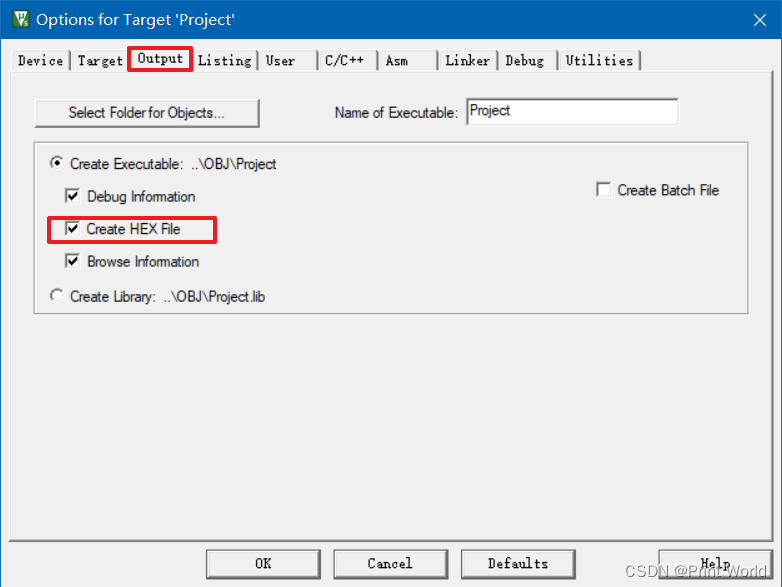

编译信息

```shell
main.c: 2 warnings, 0 errors compiling stm32f10x_wwdg.c... compiling delay.c... compiling stm32f10x_it.c... compiling system_stm32f10x.c... compiling stm32f10x_usart.c... linking... Program Size: Code=1140 RO-data=252 RW-data=0 ZI-data=1632 FromELF: creating hex file... "..\OBJ\Project.axf" - 0 Error(s), 2 Warning(s). Build Time Elapsed: 00:00:03
```

3.2 STM32进入下载程序模式  


3.3 打开hex文件，点击开始编程


#### 04\. 串口下载原理

存储器映像  


启动配置


程序下载之后自动执行配置  


#### 05\. FlyMCU软件其它操作

5.1 读Flash文件  


5.2 清除芯片  
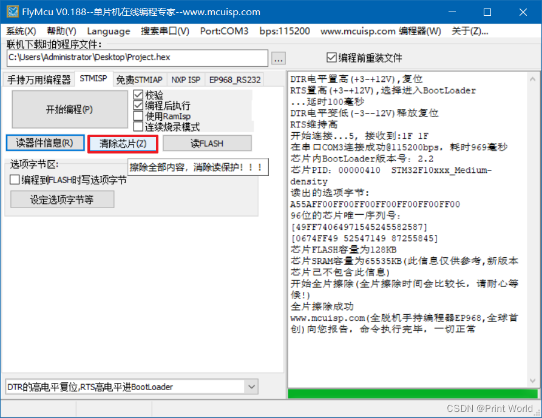

5.3 选项字节  


#### 06\. STLINK Utility软件

6.1 连接到STM32


6.2 选项字节配置  


## I2C(MPU6050陀螺仪和加速度计)

本节课程主要有两个代码，一个是软件IIC读写MPU6050 ，另一个是硬件IIC读写MPU6050 ，两个代码实现的效果是一样的。


最上面这个数据是设备的ID号，左边三个是加速度传感器的输出数据，分别是X轴、Y轴和Z轴的加速度，右边三个是陀螺仪传感器的输出数据，分别是X轴、Y轴和Z轴的角速度。我们可以改变MPU6050传感器的姿态，这六个数据就会对应变化。

背景：  
假如有个大公司找到了你，出资1000万要求你给他设计一个通信协议，这个通信协议是用来干啥的，大概就是这个公司开发出了一款芯片可以干很多事情，比如AD转换温湿度测量姿态测量等等，像我们单片机一样，这个芯片里的众多外设，也都是通过读写寄存器来控制运行的，寄存器本身也是存储器的一种，这个芯片所有的寄存器也都是被分配到了一个线性的存储空间，如果我们想要读写寄存器来控制硬件电路，我们就至少需要定义两个字节数据，一个字节是我们要读写哪个寄存器，也就是指定寄存器的地址，另一个字节就是这个地址下存储器存的内容，写入内容就是控制电路，读出内容就是获取电路状态，这整个流程和我们单片机cpu操作外设的原理是一样的，那现在问题来了，单片机读写自己的寄存器，直接通过内部的数据总线来实现，直接用指针操作就行，不需要我们操心，但是现在这个模块的寄存器在单片机的外面，你要是直接把单片机内部的数据总线拽出来，把两个芯片合为一体，那可能不太现实，所以现在这个大公司就找到了，你要求你给他设计一种通信协议，在单片机和外部模块连接少量的几根线，实现单片机读写外部模块寄存器的功能。

这时候你可能会想这太简单了，我们就用上节课串口的数据包通信就可以完成任务，比如我们就用HEX数据包，定义一个3个字节的数据包，从单片机向外挂模块发过去，第一个字节表示读写，发送0表示这个一个写数据包，发送1表示这个一个读数据包，第二个字节表示读写的地址，第三个字节表示写入的数据，比如我发送的数据包为0x00，0x06，0xAA，这就表示在0x06地址下写入0xAA，模块收到之后就执行这个写入操作，如果我发送的数据包为0x01，0x06，0x00，这就表示我要读取0x06地址下的数据，模块收到之后就要再给我发送一个字节，返回0x06地址下的数据，这样就行了，是不是完美完成任务。

但是这个大公司对这个通信协议的要求非常多，其中要求一，目前串口这个设计是一个需要两根通讯线的全双工协议，但是可以明显的发现，我们这个操作流程，是一种基于对话的形式来进行的，我们在整个过程中，并不需要同时进行发送和接收，发送的时候就不需要接收，接收的时候就不需要发送，这样就会导致始终存在一根信号线处于空闲状态，这就是资源的浪费，所以要求依旧是删掉一根通讯线，只能在同一根线上进行发送和接收，也就是把全双工变成半双工，然后要求二，我们这个协议并没有一个应答机制，也就是单片机发送了一个数据，对方有没有收到单片机是完全不了解的，所以为了安全起见，大公司要求增加应答机制，要求每发送一个字节，对方都要给我个应答，每接收一个字节，我也要给对方一个应答，然后第三个要求，大公司说你这一根线只能接一个模块不给力，他要求你这一根线上能同时接多个模块，单片机可以指定和任意一个模块通信，同时单片机在跟某个模块进行通信时，其他模块不能对正常的通信产生干扰，最后第四个要求，这个串口是异步的时序，也就是发送方和接收方约定的传输速率是非常严格的，始终不能有过大的偏差，也不能在传输过程中单片机有点事进中断了，这个时序能不能暂停一下，对于异步时序来说，这是不行的，单片机一个字节发一半暂停的，接收方可是不知道的，它仍然会按照原来那个约定的数据读取，这就会导致传输出错，所以异步时序的缺点就是非常依赖硬件外设的支持，必须要有USART电路才能方便的使用，如果没有USART硬件电路的支持，那么串口是很难用软件来模拟的，虽然说软件模拟串口通信也是行得通的，但是由于异步时序对时间要求很严格，一般很少用软件来模拟串口通信，所以这个大公司的要求是，你要把这个协议改成同步的协议，另外加一条时钟线来指导对方，由于存在时钟线，对传输的时间要求就不高了，单片机也可以随时暂停传输去处理其他事情，因为暂停传输的同时时钟线也暂停了，所以传输双方都能定格在暂停的时刻，可以过一段时间再来继续，不会对传输造成影响，这就是同步时序的好处，使用同步时序就可以极大地降低单片机对硬件电路的依赖，即使没有硬件电路的支持也可，以很方便地用软件手动翻转电平来实现通信，异步时序的好处就是省一根时钟线，节省资源，缺点就是对时间要求严格，对硬件电路的依赖比较严重，同步时序的好处就是反过来，对时间要求不严格，对硬件电路不怎么依赖，在一些低端单片机没有硬件资源的情况下，也很容易使用软件的模拟时序，缺点就是多一根时钟线。

那现在要求就提完了，看看你能不能设计出一款让大公司满意的协议，其实通信协议这个东西就是一个很灵活的设计方案，并没有很严格的要求，说它必须是这样，只要你的设计能实现项目要求，符合电路原理，性能和稳定性好，那你的设计就是好设计，如果能有大公司帮你推广，得到了广泛的认可就能广泛使用了。

再声明一下项目要求，我们最基本的任务是，通过通信线实现单片机读写外挂模块寄存器的功能，其中至少要实现在指定的位置写寄存器和在指定的位置读寄存器这两个功能，实现了读写寄存器就实现了对这个外挂模块的完全控制。  


I2C 通讯协议(Inter－Integrated Circuit)是由Phiilps公司开发的，由于它引脚少，硬件实现简单，可扩展性强， 不需要USART、CAN等通讯协议的外部收发设备，现在被广泛地使用在系统内多个集成电路(IC)间的通讯。

I2C总线是一种用于芯片之间进行通信的串行总线。它由两条线组成：串行时钟线（SCL）和串行数据线（SDA）。这种总线允许多个设备在同一条总线上进行通信。

作为一个通信协议，它必须要在硬件和软件上都做出规定，硬件上的规定，就是你的电路应该如何连接，端口的输入输出模式都是啥样的，软件上的规定，就是你的时序是怎么定义的，字节如何传输，高位先行还是低位先行，一个完整的时序有哪些部分构成这些东西，硬件的规定和软件的规定配合起来，就是一个完整的通信协议。


这个图就是I2C的典型电路模型，这个模型采用了一主多从的结构。在左侧，我们可以看到CPU作为主设备，控制着总线并拥有很大的权利。其中，主机对SCL线拥有完全的控制权，无论何时何地，主机都负责掌控SCL线。在空闲状态下，主机还可以主动发起对SDA的控制。但是，从机发送数据或应答时，主机需要将SDA的控制权转交给从机。

接下来，我们看到了一系列被控IC，它们是挂载在12C总线上的从机设备，如姿态传感器、OLED、存储器、时钟模块等。这些从机的权利相对较小。对于SCL时钟线，它们在任何时刻都只能被动的读取，不允许控制SCL线；对于SDA数据线，从机也不允许主动发起控制，只有在主机发送读取从机的命令后，或从机应答时，从机才能短暂地取得SDA的控制权。这就是一主多从模型中协议的规定。  
然后我们来看接线部分。所有I2C设备的SCL和SDA都连接在一起。主机的SCL线拉出来，所有从机的SCL都接在这上面。主机的SDA线也是一样，拉出来，所有从机的SDA接在这上面。这就是SCL和SDA的接线方式。

那到现在，我们先不继续往后看了，先忽略这两个电阻，那到现在，假设我们就这样连接，那如何规定每个设备SCL和SDA的输入输出模式呢？

由于现在是一主多从结构，主机拥有SCL的绝对控制权，因此主机的SCL可以配置成推挽输出，所有从机的SCL都配置成浮空输入或上拉输入。数据流向为主机发送、所有从机接收。但是到SDA线这里就比较复杂了，因为这是半双工协议，所以主机的SDA在发送时是输出，在接收时是输入。同样地，从机的SDA也会在输入和输出之间反复切换。如果能够协调好输入输出的切换时机就没有问题。但是这样做的话，如果总线时序没有协调好，就极有可能发生两个引脚同时处于输出的状态。如果此时一个引脚输出高电平，一个引脚输出低电平，就会造成电源短路的情况，这是要极力避免的。  
为了避免这种情况的发生，I2C的设计规定所有设备不输出强上拉的高电平，而是采用外置弱上拉电阻加开漏输出的电路结构。这两点规定对应于前面提到的“设备的SCL和SDA均要配置成开漏输出模式”以及“SCL和SDA各添加一个上拉电阻，阻值一般为4.7KΩ左右”。对应上面这个图。


所有的设备，包括CPU和被控IC，它们的引脚内部结构都如上图所示。图左侧展示的是SCL的结构，其中SClk代表SCL；右侧则是SDA的结构，其中DATA代表SDA。引脚的信号输入都可以通过一个数据缓冲器或施密特触发器进行输入，因为输入对电路无影响，所以任何设备在任何时刻都可以输入。然而，在输出部分，采用的是开漏输出的配置。

正常的推挽输出方式如下：上面一个开关管连接正极，下面一个开关管连接负极。当上面导通时，输出高电平；下面导通时，输出低电平。因为这是通过开关管直接连接到正负极的，所以这是强上拉和强下拉的模式。  
而开漏输出呢，就是去掉这个强上拉的开关管，输出低电平时，下管导通，是强下拉，输出高电平时，下管断开，但是没有上管了，此时引脚处于浮空的状态，这就是开漏输出。

和这里图示是一样的，输出低电平，这个开关管导通，引脚直接接地，是强下拉，输出高电平，这个开关管断开，引脚什么都不接，处于浮空状态，这样的话，所有的设备都只能输出低电平而不能输出高电平，为了避免高电平造成的引脚浮空，这时就需要在总线外面，SCL和SDA各外置一个上拉电阻，这是通过一个电阻拉到高电平的，所以这是一个弱上拉。

用我们之前的弹簧和杆子的模型来解释，就是SCL或SDA就是一根杆子，为了防止有人向上推杆子，有人向下拉杆子造成冲突，我们就规定所有的人不准向上推杆子，只能选择向下拉或者放手，然后我们再外置一根弹簧向上拉，你要输出低电平就往下拽，这个弹簧肯定拽不赢你，所以弹簧被拉伸杆子处于低电平状态，你要输出高电平就放手，杆子在弹簧的拉力下回弹到高电平，这就是一个弱上拉的高电平，但是完全不影响数据传输。

这样做的好处是：

第一，完全杜绝了电源短路现象，保证电路的安全。你看所有人无论怎么拉杆子或者放手，杆子都不会处于一个被同时强拉和强推的状态，即使有多个人同时往下拉杆子，也没问题。  
第二，避免了引脚模式的频繁切换。开漏加弱上拉的模式，同时兼具了输入和输出的功能，你要是想输出，就去拉杆子或放手，操作杆子变化就行了，你要是想输入，就直接放手，然后观察杆子高低就行了，因为开漏模式下，输出高电平就相当于断开引脚，所以在输入之前，可以直接输出高电平，不需要再切换成输入模式了。  
第三，就是这个模式会有一个“线与”的现象。就是只要有任意一个或多个设备输出了低电平，总线就处于低电平，只有所有设备都输出高电平，总线才处于高电平。I2C可以利用这个电路特性执行多主机模式下的时钟同步和总线仲裁，所以这里SCL虽然在一主多从模式下可以用推挽输出，但是它仍然采用了开漏加上拉输出的模式，因为在多主机模式下会利用到这个特征。  
好，以上就是I2C的硬件电路设计，那接下来，我们就要来学习软件，也就是时序的设计了。


首先我们来学习一下I2C规定的一些时序基本单元。

起始和终止条件

起始条件是指SCL高电平期间，SDA从高电平切换到低电平。在I2C总线处于空闲状态时，SCL和SDA都处于高电平状态，也就是没有任何一个设备去碰SCL和SDA，由外挂的上拉电阻拉高至高电平，总线处于平静的高电平状态。当主机需要数据收发时打破平静，会首先产生一个起始条件。这个起始条件是，SCL保持高电平，然后把SDA拉低，产生一个下降沿。当从机捕获到这个SCL高电平，SDA下降沿信号时，就会进行自身的复位，等待主机的召唤。之后，主机需要将SCL拉低。这样做一方面是占用这个总线，另一方面也是为了方便这些基本单元的拼接。这样，除了起始和终止条件，每个时序单元的SCL都是以低电平开始，低电平结束。

终止条件是，SCL高电平期间，SDA从低电平切换到高电平。SCL先放开并回弹到高电平，SDA再放开并回弹高电平，产生一个上升沿。这个上升沿触发终止条件，同时终止条件之后，SCL和SDA都是高电平，回归到最初的平静状态。这个起始条件和终止条件就类似串口时序里的起始位和停止位。一个完整的数据帧总是以起始条件开始、终止条件结束。另外，==起始和终====止都是由主机产生的==。因此，从机必须始终保持双手放开，不允许主动跳出来去碰总线。如果允许从机这样做，那么就会变成多主机模型，不在本节的讨论范围之内。这就是起始条件和终止条件的含义。


==发送一个字节==  ==低电平主机发数据，高电平从机读数据==
接着继续看，在起始条件之后，这时就可以紧跟着一个发送一个字节的时序单元，如何发送一个字节呢？

就是SCL低电平期间，主机将数据位依次放到SDA线上，高位先行，然后释放SCL，从机将在SCL高电平期间读取数据位，所以SCL高电平期间，SDA不允许有数据变化，依次循环上述过程8次即可发送一个字节，起始条件之后，第一个字节也必须是主机发送的，主机如何发送呢，就是最开始SCL低电平，主机如果想发送0，就拉低SDA到低电平，如果想发送1就放手，SDA回弹到高电平，在SCL低电平期间允许改变SDA的电平，当这一位放好之后，主机就松手时钟线，SCL回弹到高电平，在高电平期间是从机读取SDA的时候，所以高电平期间SDA不允许变化，SCL处于高电平之后，从机需要尽快的读取SDA，一般都是在上升沿这个时，从机就已经读取完成了，因为始终是主机控制的，从机并不知道什么时候就会产生下降沿了，你从机要是磨磨唧唧的，主机可不会等你的，所以从机在上升沿时就会立刻把数据读走，那主机在放手SCL一段时间后就可以继续拉低SCL传输下一位了，主机也需要在SCL下降沿之后，尽快把数据放在SDA上，但是主机有时钟的主导权哈，所以主机并不需要那么着急，只需要在低电平的任意时刻把数据放在sda上就行了，晚点也没关系，数据放完之后，主机再松手SCL，SCL高电平，从机读取这一位。

就这样的流程，主机拉低SCL，把数据放在SDA上，主机松开SCL，从机读取SDA的数据，在SCL的同步下，依次进行主机发送和从机接收，循环8次，就发送了8位数据，也就是一个字节，另外注意，这里是高位先行，所以第一位是一个字节的最高位B7，然后依次是次高位B6…这个和串口是不一样的，串口时序是低位先行，这里I2C是高位先行。

另外由于这里有时钟线进行同步，所以如果主机一个字节发送一半，突然进中断了，不操作SCL和SDA的，那时序就会在中段的位置不断拉长，SCL和SDA电平都暂停变化，传输也完全暂停，等中段结束后，主机回来继续操作，传输仍然不会出问题，这就是同步时序的好处。

最后就是，由于这整个时序是主机发送一个字节，所以在这个单元里，SCL和SDA全程都有主机掌控  
，从机只能被动读取。


接收一个字节

主机在接收之前需要释放SDA，刚才我们说了，释放SDA其实就相当于切换成输入模式，或者这样来理解，所有设备包括主机都始终处于输入模式，当主机需要发送的时候，就可以主动去拉低SDA，而主机在被动接收的时候，就必须先释放SDA，不要去动它，以免影响别人发送，因为总线是线与的特征，任何一个设备拉低了总线就是低电平，如果你接收的时候还拽着SDA不放手，那别人无论发什么数据，总线都始终是底电平，你自己给他拽着不放，还让别人怎么发送呢是吧，所以主机在接收之前需要释放SDA ，从流程上来看，接收一个字节和发送一个字节是非常相似的，区别就是发送一个字节是时钟线低电平主机放数据，时钟线高电平从机读数据；==而接收一个字节是低电平从机放数据，高电平主机读数据==，然后看一下下面的时序，和上面的基本一样，区别就是SDA线，主机在接收之前需要释放SDA，然后这时从机就取得了SDA的控制权，从机需要发送0就把SDA拉低，从机需要发送1就放手，sda回弹高电平，然后同样的，低电平变换数据，高电平读取数据，这里实线部分表示主机控制的电平，虚线部分表示从机控制的电平，SCL全程由主机控制，SDA主机在接收前要释放，交由从机控制，之后还是一样，因为SCL始终是有主机控制的，所以从机的数据变换基本上都是贴着SCL下降沿进行的，而主机可以在SCL高电平的任意时刻读取，这是接收一个字节的时序。


那我们再继续看最后两个基本单元，就是应答机制的设计。

发送应答和接收应答  
这个意思就是当我们在调用发送一个字节之后，就要紧跟着调用接收应答的时序，用来判断从机有没有收到刚才给它的数据，如果从机收到了，那在应答位这里，主机释放SDA的时候，从机就应该立刻把SDA拉下来，然后在SCL高电平期间，主机读取应答位，如果应答位为0，就说明从机确实收到了，这个场景就是主机刚发送一个字节，然后说有没有人收到啊，我现在把SDA放手了哈，如果有人收到的话，你就把SDA拽下来，然后主机高电平读取数据，发现诶确实有人给他拽下来了，那就说明有人收到了，如果主机发现我松手了，结果这个SDA就跟着回弹到高电平了，那就说明没有人回应我，刚发的一个字节可能没人收到，或者他收到了但是没给我回应，这是发送一个字节接收应答的流程，同理啊，在接收一个字节之后，我们也要给从机发送一个应答位，发送应答位的目的是告诉从机，你是不是还要继续发哈，如果从机发送一个数据后，得到了主机的应答，那从机就还会继续发送  
，如果从机没得到主机的应答，那从机就会认为那我发生了一个数据，但是主机不理我，可能主机不想要了吧，这时从机就会乖乖地释放SDA，交出SDA的控制权，防止干扰主机之后的操作，这就是应答位的执行逻辑。

到这里，我们I2C的六块拼图就已经集齐了，分别是起始条件，终止条件，发送一个字节，接收一个字节，发送应答和接收应答，接下来我们就来拼接这些基本单元，组成一个完整的数据帧。

I2C的完整时序主要有指定地址写，当前地址读和指定地址读这三种。

我们这个I2C是一主多从的模型，主机可以访问总线上的任何一个设备，那如何发送指令，来确定访问的是哪个设备呢，这个需要首先把每个从机都确定一个唯一的设备地址，从机设备地址就相当于每个设备的名字，主机在起始条件之后，要先发送一个字节，叫一下从机的名字，所有从机都会收到第一个字节，和自己的名字进行比较，如果不一样，则认为主机没有叫我，之后的时序我就不管了，如果一样，就说明主机现在在叫我，那我就响应之后主机的读写操作，在同一条I2C总线里，挂载的每个设备地址必须不一样，否则主机叫一个地址，有多个设备都响应，那不就乱套了，从机设备地址，在I2C协议标准里分为7位地址和10位地址，我们目前只讲7位地址的模式，因为7位地址比较简单，而且应用范围最广，那在每个I2C设备出厂时，厂商都会为它分配一个7位的地址，这个地址具体是什么，可以在芯片手册里找到，比如我们MPU6050 这个芯片的7位地址是1101000，一般不同型号的芯片地址都是不同的，但相同型号的芯片地址是相同的。  
如果多个相同型号的芯片挂载在同一条总线上，我们可以通过调整地址的最后几位来解决这个问题。例如，MPU6050地址的最后一位，可以通过板子上的AD0引脚来改变，比如这个引脚接低电平，那它的地址就是1101000，这个引脚接高电平，那它的地址就是1101001。  
而AT24C02的地址可以通过板子上的A0、A1、A2引脚来改变，比如A0引脚接低电平，地址对应的位就是0，接高电平，地址对应的位就是1，A1A2也是同理，一般I2C的从机设备地址，高位都是由厂商确定的，低位可以由引脚来灵活切换。这样，即使相同型号的芯片，挂载在同一个总线上，也可以通过切换地址低位的方式，保证每个设备的地址都不一样。这就是12C设备的从机地址。

下面时序讲解详情  
  
指定地址写

指定设备，通过Slave Address从机地址来确定，这个指定地址，就是某个设备内部的Reg Address，寄存器地址，写入指定数据，就是要在这个寄存器中写入的data数据，然后看一下下面的时序，这个时序是我在示波器下实际抓的波形，大家也可以用逻辑分析仪抓这个波形，而且逻辑分析仪还自带协议解析的功能，还是非常方便的，我们来一一分析一下，在这里上面的线是SCL，下面的线是SDA，空闲状态他俩都是高电平，然后主机需要给从机写入数据的时候，首先SCL高电平期间，拉低SDA产生起始条件，在起始条件之后，紧跟着的时序，必须是发送一个字节的时序，字节的内容必须是从机地址+读写位，正好从机地址是7位，读写位是1位，加起来是一个字节8位，发送从机地址，就是确定通信的对象，发送读写位，就是确认我接下来是要写入还是要读出，具体发送的时候呢，在这里低电平期间SDA变换数据，高电平期间从机读取SDA，这里我用绿色的线来标明了从机读到的数据，比如这样的波形，那从机收到的第一位就是高电平1，然后SCL低电平期间主机继续变换数据，因为第二位还是1，所以这里SDA电平并没有变换，然后SCL高电平，从机读到第二位是1，之后继续低电平变换数据，高电平读取数据，第三位就是0，这样持续8次就发送了一个字节数据，其中这个数据的定义，高7位表示从机地址，比如这个波形下，主机寻找的统计地址就是1101000，这个就是MPU6050的地址，然后最低位表示读写位，0表示之后的时序主机要进行写入操作，1表示之后的时序主机要进行读出操作，这里是0，说明之后我们要进行写入操作，那目前主机是发生了一个字节，字节内容转化为16进制，高位先行就是0xD0 ，然后根据协议规定，紧跟着的单元就得是接收从机的应答位，在这个时刻，主机要释放SDA，所以如果单看主机的波形啊，应该是这样，释放SDA之后引脚电平回弹到高电平，但是根据协议规定，从机要在这个位拉低SDA，所以单看从机的波形，应该是这样，该应答的时候，从机立刻拽住SDA，然后应答结束之后，从机再放开SDA，那现在综合两者的波形，结合线与的特性，在主机释放SDA之后，由于SDA也被从机拽住了，所以主机松手后，SDA并没有回弹高电平，这个过程就代表从机产生了应答，最终高电平期间主机读取SDA发现是0，就说明我进行寻址，有人给我应答了，传输没问题，如果主机读取SDA发现是1，就说明我进行寻址，应答位期间我松手了，但是没人拽住他，没人给我应答，那就直接产生停止条件吧，并提示一些信息，就是应答位，然后这个上升沿就是应答位结束后，从机释放SDA产生的，从机交出了SDA的控制权，因为从机要在低电平尽快变换数据，所以这个上升沿和SCL的下降沿，几乎是同时发生的，然后继续往后，由于之前我们读写位给了0，所以应答结束后，我们要继续发送一个字节，同样的时序再来一遍，第二个字节就可以送到指定设备的内部来，从机设备可以自己定义第二个字节和后续字节的用途，一般第二个字节可以是寄存器地址，或者是指令控制字等，比如MPU16050定义的第二个字节就是寄存器地址，比如AD转换器，第二个字节可能就是指令控制字，比如存储器，第二个字节可能就是存储器地址,那图示这里主机发送这样一个波形，我们一一判定，数据为00011001，即主机向从机发送了0x19 这个数据，在MPU6050 里，就表示我要操作你0x19地址下的寄存器了，接着同样是从机应答，主机释放sda，从机拽住SDA，SDA表现为低电平，主机收到应答位为0，表示收到了从机的应答，然后继续同样的流程，再来一遍，主机再发送一个字节，这个字节就是主机想要写入到0x19地址下寄存器的内容了，比如这里发送了0xAA的波形，就表示我在0x19地址下写入0xAA，最后是接收应答位，如果主机不需要继续传输了，就可以产生停止条件，在停止条件之前先拉低SDA，为后续SDA的上升沿做准备，然后释放SCL，再释放SDA，这样就产生了SCL高电平期间SDA的上升沿，这样一个完整的数据帧就拼接完成了，那套用上面这句话呢，这个数据帧的目的，就是对于指定从机地址为1001000的设备，在其内部0x19地址下的寄存器中，写入0xAA这个数据。

  
如果主机想要读取从机的数据，就可以执行这个时序，那最开始还是SCL高电平期间，拉低SDA产生起始条件，起始条件开始后，主机必须首先调用发送一个字节，来进行从机的寻址和指定读写标志位，比如图示的波形，表示本次寻址的目标是1001000的设备，同时最后一位读写标志为1，表示主机接下来想要读取数据，紧跟着发送一个字节之后接收一下从机应答位，从机应答为0代表从机收到了第一个字节，在从机应答之后，从这里开始数据的传输方向就要反过来了，因为刚才主机发出了读的命令，所以这之后主机就不能继续发送了，要把SDA的控制权交给从机，主机调用接收一个字节的时序进行接收操作，然后在这一块从机就得到了主机的允许，可以在SCL低电平之间写入SDA，然后主机在SCL高电平期间读取SDA，那最终主机在SCL高电平期间，依次读取8位，就接收到了从机发送的一个字节数据，00001111，也就是0x0f，那现在问题就来了，这个0x0f是从机哪个寄存器的数据呢，我们看到在读的时序中，I2C协议的规定是，主机进行寻址时，一旦读写标志位给1了，下一个字节就要立马转为读的时序，所以主机还来不及指定，我想要读哪个寄存器就得开始接收了，所以这里就没有指定地址这个环节，那主机并没有指定寄存器的地址，从机到底该发哪个寄存器的数据呢，这需要用到我们上面说的当前地址指针了，在从机中，所有的寄存器被分配到了一个线性区域中，并且会有个单独的指针变量，指示着其中一个寄存器，这个指针上电默认一般指向0地址，并且每写入一个字节和读出一个字节后，这个指针就会自动自增一次，移动到下一个位置，主机没有指定要读哪个地址，从机就会返回当前指针指向的寄存器的值，那假设我刚刚调用了这个指定地址写的时序，在0x19 的位置写出了0xAA，那么指针就会加1移动到0x1a的位置，我再调用这个当前地址读的时序，返回的就是0x1a地址下的值，如果再调用一次，返回的就是0x1b地址下的值，以此类推，这就是当前地址读时序的操作逻辑，由于当前地址读并不能指定读的地址，所以这个时序用的不是很多。


最后我们就继续来看下一个时序，指定地址读，这个时序的目的就是，对于指定设备在指定地址下读取从机数据，那这个时序为什么能指定读的地址呢，我们看一下指定地址写，在这前面一部分就是指定地址的时序，我们把最后面的写数据的这一部分给去掉，然后把前面这一段设置地址，还没有指定写什么数据的时序，给他追加到这个当前地址读时序的前面，就得到了指定地址读的时序，一般我们也把它称作复合格式，下面的时序在这里分隔一下，前面的部分是指定地址写，但是只指定了地址，还没来得及写，后面的部分是当前地址读，因为我们刚指定的地址，两者加在一起就是指定地址读了，所以指定地址读的时序会复杂一些，我们来详细分析一下，首先最开始仍然是启动条件，然后发送一个字节进行寻址，这里指定从机地址是1001000，读写标志位是0，代表我要进行写的操作，经过从机应答之后，再发送一个字节，第二个字节用来指定地址，这个数据就写入到了从机的地址指针里了，也就是说从机接收到这个数据之后，它的寄存器指针就指向了0x19 这个位置，之后我们要写入的数据，不给他发，而是直接再来个起始条件，这个Sr的意思就是重复起始条件，相当于另起一个时序，因为指定读写标志位，只能是跟着起始条件的第一个字节，所以如果想切换读写方向，只能再来个起始条件，然后起始条件后重新寻址并且指定读写标志位，此时读写标志位是1代表我要开始读了，接着主机接收一个字节，这个字节是不是就是0x19 地址下的数据，这就是指定地址读，另外在这里啊，你也可以再加一个停止条件，这样也行哈，这样的话就是两个完整的时序了，先起始写入地址停止，因为写入的地址会存在地址指针里面，所以这个地址并不会因为时序的停止而消失，我们就可以再提示读当前位置停止，这样两条时序也可以完成任务，但是I2C协议官方规定的复合格式是一整个数据帧，就是先起始再重复起始再停止，相当于把两条时序拼接成一条了，好这些就是这三个I2C完整时序的介绍了。

其中第一个指定地址写，和第三个指定地址读用的比较多，也是我们本节代码使用的时序，然后除了这三个时序啊，I2C还有这些时序的进阶版本，大概介绍一下，就是我们这些时序啊，指定地址写只是写一个字节，当前地址读和指定地址读，也都是读一个字节，那进阶版本就是指定地址写多个字节，当前地址读多少个字节，和指定地址读多少个字节，时序上呢和这些都非常相似，只需要增加一些小细节就行，我们看一下在这里指定地址，然后写入一个字节，如果你只想写一个字节，那就停止就行了，如果你想写多个字节，就可以把这最后一部分多重复几次，比如这里重复三遍发送一个字节和接受应答，这样第一个数据就写入到了指定地址0x19 的位置，然后不要忘了刚才说的哈，写入一个数据后，地址指针会自动加1，变成0x1a，所以这第二个数据就写入到了，0x1a的位置，同理，第三个数据就写入的是0x1b的地址，以此类推，这样这个时序就进阶为在指定的位置开始，按顺序连续写入多个字节，比如你需要连续写入多个寄存器，就可以考虑这样来操作，这样在一条数据帧里，就可以同时写入多个字节，执行效率就会比较高，然后同理当前位置读和指定位置读，也可以多次执行这最后一部分时序，由于地址指针在读后也会自增，所以这样就可以连续读出一片区域的寄存器，效率也会非常高，然后这里还要注意一下，如果你只想读一个字节就停止的话，在读完一个字节之后，一定要给从机发个非应答，就是该主机应答的时候，主机不把SDA拉低，从机读到SDA为1，就代表主机没有应答，从机收到非应答之后，就知道主机不想要继续了，从机就会释放总线，把SDA的控制权交还给主机，如果主机读完仍然给从机应答了，从机就会认为主机还想要数据，就会继续发送下一个数据，而这时主机如果想产生停止条件，SDA可能就会因为被从机拽住了，而不能正常弹回高电平，这个注意一下，如果主机想连续读取多个字节，就需要在最后一个字节给非应答，而之前的所有字节都要给应答，简单来说就是主机给应答了，从机就会继续发，主机给非应答了，从机就不会再发了，交出SDA的控制权，从机控制SDA发送一个自己的权利哈，开始于读写标志位为1，结束于主机给应答位为1，这是主机给从机发送应答位的作用。

以上就是I2C总线的硬件规定和软件规定了，有了这些规定，我们就可以按照硬件规定来连接线路，用软件规定来操作总线，以此实现指定位置写寄存器和指定位置读计算器，有了这两个功能，主机就可以完全掌控外挂模块的运行了，也就实现了我们设计这个协议的目的。

### MPU6050简介

上一小节我们主要讲的是I2C通信的协议标准，有了I2C通信，我们就可以实现指定地址写和指定地址读的逻辑，这样即使这个外挂芯片的各种寄存器不在STM32的内部，我们仍然可以通过通讯协议实现读写外挂芯片寄存器器的功能。

要想研究清楚这个芯片的功能，看它对应的数据手册是必不可少的。


如果芯片里再集成一个三轴的磁场传感器，测量x y z轴的磁场强度，那就叫做九轴姿态传感器，如果再集成一个气压传感器，测量气压大小，那就叫做十轴姿态传感器，一般气压值反映的是高度信息哈，海拔越高，气压越低，所以气压计是单独测量垂直地面的高度信息的，这就是姿态传感器的一些术语。

那要这么多轴的信息是要干啥呢，答案是通过数据融合可进一步得到姿态角，或者叫做欧拉角，这个欧拉角是什么呢，以我们这个飞机为例子，欧拉角就是飞机机身相对于初始三个轴的夹角，飞机机头下沉或上仰，这个轴的夹角叫做俯仰Pitch，飞机机身左翻滚或者右翻滚，这个轴的夹角叫滚转Roll，飞机机身保持水平，机头向左转向或者向右转向，这个轴的夹角叫做偏航Yaw，简单来说，欧拉角就表达了飞机此时的姿态，飞机是上仰呢还是下倾呢，飞机向左倾斜还是向右倾斜了，通过欧拉角都能清晰地表示出来，如果你想做一个飞控算法，为了保持飞机姿态平稳，那么得到一个精确且稳定的欧拉角就至关重要，但是可惜的是，之前我们所说的加速度计、陀螺仪、磁力计，任何一种传感器都不能获得精确且稳定的欧拉角，要想获得精确且稳定的欧拉角呢，就必须进行数据融合，把这几种传感器的数据结合起来，综合多种传感器的数据取长补短，这样才能获得精确且稳定的欧拉角，常见的数据融合算法一般有互补滤波，卡尔曼滤波等，这就涉及到惯性导航领域里姿态解算的知识点了，不过我们本节课的侧重点是I2C通信，我们最终的程序现象就是把这些传感器的原始数据读出来，显示在OLED上就完事了，姿态传感器计算出姿态角之后，就常应用于平衡车，飞行器等需要检测自身姿态的场景，平衡车呢如果传感器检测到车身向前或者向后倾斜了，程序就可以控制轮子进行调整，保持平衡车的平衡，飞行器呢这控制的轴就多些，一般至少需要检测俯仰角和滚转角两个夹角，然后控制电机保持飞机的平衡，这就是这个mpu6050 姿态传感器的作用。

另外UP主还讲了一些测量的物理学原理。


16位adc采集传感器的模拟信号量化范围，-32768~+32767，之前我们也了解过，它们的基本原理都是设计一种装置，当传感器所感应的参数变化时，这个装置能带动电位器滑动，或者装置本身的电阻可以随感应参数变化而变化，这样在外接一个电源，通过电阻分压，就能把现实世界的各种状态用电压表示出来了，但这个传感器里面肯定不是图片这里这样的机械结构，芯片里面都是通过电子的技术来完成各种参数的测量的，要不然也塞不到这么小的芯片里，我们理解的时候可以把它想象成这种机械结构，但实际上芯片里面如何用电来完成同样的功能，这就是这个厂家的秘籍了，我们也不用管。总之电子的传感器最终也是输出一个随姿态变化而变化的电压，要想量化这个电压信号，那就离不开AD转换器了。

满量程范围就相当于我们之前学ADC的时候，那个VREF参考电压一样，你AD值达到最大值，对应电压是3.3V还是5V，需要有一个参考电压来指定，这里也是一样，16位AD值达到最大值对应的物理参量具体是多少，也是由满量程范围来决定的，因为AD的范围是一定的，所以满量程选的越小，测量就会越细腻，线性关系乘以一个系数就可以了，这跟我们之前学ADC的时候，由AD值求电压值是一样的道理。

可配置的数字低通滤波器，在这个芯片里可以配置寄存器来选择对输出数据进行低通滤波，如果你觉得输出数据抖动太厉害，就可以加一点低通滤波，这样输出数据就会平缓一些。

可配置的时钟源和可配置的采样分频，这两个参数是配合使用的，时钟源经过这个分频器的分频，可以为AD转换和内部其他电路提供时钟，控制分频系数就可以控制ad转换的快慢了。

芯片进行I2C通信的从机地址，这个可以在手册里查到，当AD0等于0，地址为1001000，当AD0等于1时，地址为1001001，AD0就是板子引出来的一个引脚，可以调节I2C从机地址的最低位，这里地址是七位的，如果像这样用二进制来表示的话，一般没啥问题，如果在程序中用16进制表示的话，一般会有两种表示方式，以这个1001000的地址为例，第一种就是单纯的把这七位的二进制转化为16进制，这里1001000低4位和高3位切开转换，16进制就是0x68 ，所以有的地方就说MPU6050的从机地址是0x68 ，然后我们看一下之前I2C通信的时序，这里第一个字节的高7位是从机地址，最低位是读写位，所以如果你认为0x68是从机地址的话，在发送第一个字节时，要先把0x68 左移一位，再按位或上读写位，读1写0，这是认为从机地址是0x68 的操作，当然目前还有另一种常见的表示方式，就是把0x68 左移移位后的数据当做从机地址，0x68 左移1位之后是0xd0 ，那这样MPU6050的从机地址就是0xd0 ，这时在实际发送第一个字节时，如果你要写，就直接把0xd0 当做第一个字节，如果你要读  
就把0xd0或上0x01 即0xD1当做第一个字节，这种表示方式就不需要进行左移的操作了，或者说这种表示方式是把读写位也融入到了从机地址里来，0xD0 是写地址，0xD1是读地址，这样表示的，所以你之后看到有地方说0xD0 是MPU6050的从机地址，那它就是融入了读写位的从机地址，如果你看到有地方说0x68 是MPU6050的从机地址，这也不要奇怪，这种方式就是直接把7位地址转换16进制得到的，在实际发送第一个字节时，不要忘了先左移一位，再或上读写位，这是两种统计地址的表示方式。

  
我们接着继续来看一下硬件电路，右边这个是MPU6050的芯片，左下角是一个八针的排针，左上角是一个LDO低压差线性稳压器，我们来看一下右边这个mpu6050的芯片，芯片本身的引脚是非常多的，不过这里有很多引脚我们都用不到，还有一些硬件呢是这个芯片最小系统里的固定连接，这个最小系统一般手册里都会有，抄过来就行了，然后看左下角引出来的引脚，有VCC和GND这两个引脚是电源供电，然后SCL和SDA这两个引脚是I2C通信的引脚，在这里可以看到，SCL和SDA模块已经内置了两个4.7k的上拉电阻了，所以在我们接线的时候，直接把SCL和SDA接在GPIO口就行了，不需要再在外面另外接上拉电阻了，接着下面有xcl和xda这两个是芯片里面的主机I2C通信引脚，设计这两个引脚是为了扩展芯片功能，之前我们说过，mpu6050是一个六轴姿态传感器，这是九轴姿态传感器多出的磁力计的作用，另外如果你要制作无人机，需要定高飞行，这时候就还需要增加气压计，扩展为十轴提供一个高度信息的稳定参考，所以根据项目要求啊，这个六轴传感器可能不够用，需要进行扩展，那这个时候这个xcl和xda就可以起作用了，xcl和xda通常就是用于外接磁力计或者气压计，当接上磁力计或气压计之后，mpu6050的主机接口可以直接访问这些扩展芯片的数据，把这些扩展芯片的数据读取到mpu6050 里面，在mpu6050 里面会有dmp单元进行数据融合和姿态解算，如果你不需要按mpu6050 的解算功能的话，也可以把这个磁力计或者气压计直接挂载在xcl和xda这条总线上，因为I2C本来就可以挂载多设备，所以把多个设备都挂载在一起也是没问题的。

下面AD0引脚，这个之前说过，他是从机地址的最低位，接低电平的话七位从机地址就是1001000，接高电平的话七位从机地址就是1001001，这里电路中可以看到有一个电阻默认弱下拉到低电平了，所以引脚悬空的话就是低电平，如果想接高电平，就可以把ad0直接引到vcc，强上拉至高电平。

最后一个引脚是INT，也就是中断输出引脚，可以配置芯片内部的一些事件来触发中断引脚的输出，比如数据准备好了、I2C主机错误等，另外芯片内部还内置了一些实用的小功能、比如自由落体检测、运动检测、零运动检测等，这些信号都可以触发INT引脚产生电平跳变，需要的话可以进行中断信号的配置，但如果不要的话，那也可以不配置这个引脚。

左上角这个LDO，这部分是供电的逻辑，手册里介绍这个mpu6050 芯片的vdd供电是2.375~3.46V，属于3.3V供电的设备，不能直接接5V，所以为了扩大供电范围，这个模块的设计者就加了个3.3V的稳压器，输入端电压vcc\_5v可以在3.3v到5v之间，然后经过3.3伏的稳压器输出稳定的3.3伏电压给芯片端供电，然后这一块是电源指示灯，只要3.3v端有电，电源指示灯就会亮，所以这一块需不需要，可以根据你的项目要求来，如果你已经有了稳定的3.3伏电源了，就不再需要这一部分了。我们本实验直接vcc、gnd接上电，sscl和sda接上I2C通信的GPIO口就行了。


我们再看一下这个芯片的模块框图，这个图就是整个芯片的内部结构，左上角是时钟系统，有时钟输入脚和输出脚，不过我们一般使用内部时钟，硬件电路这里呢CLKIN直接接了地，CLKOUT没有引出，所以这部分不需要过多关心，然后下面这些灰色的部分就是芯片内部的传感器，包括x y z轴的陀螺仪陀螺仪，另外这个芯片还内置了一个温度传感器，你要是想用它来测量温度也是没问题的，那这么多传感器本质上也都相当于可变电阻，通过分压后输出模拟电压，然后通过adc进行模数转换，转化完成之后呢，这些传感器的数据统一都放到数据寄存器中，我们读取数据寄存器就能得到传感器测量的值了，这个芯片内部的转换都是全自动进行的，就类似我们之前学的AD连续转换加dma转运，每个adc输出，对应16位的数据寄存器，不存在数据覆盖的问题，我们配置好转换频率之后，每个数据就自动以我们设置的频率刷新到数据寄存器，我们需要数据的时候直接来读就行了，其他的都不用管，还是非常方便的。

接着每个传感器都有个自测单元self test，这部分是用来验证芯片好坏的，当启动自测后，芯片内部就会模拟一个外力施加在传感器上，这个外力导致传感器数据会比平时大一些，那如何进行自测呢，我们可以先使能自测读取数据，再失能自测读取数据，两个数据相减得到的数据叫自测响应，芯片手册里给出了一个范围，如果自测响应在这个范围内就说明芯片没问题，如果不在就说明芯片可能坏了，使用的时候就要小心点，这个是自测的功能。

然后下面这个Charge Pump是电荷泵或者叫充电泵，CPOUT的引脚需要外接一个电容，什么样的电容呢，在这个手册里有说明，电荷泵是一种升压电路，在其他地方也有出现过，比如我们用的这个OLED屏幕里面就有电荷泵进行升压，电荷泵的升压原理呢，我简单描述一下，大家了解一下这个，比如我有个电池电压是5伏，然后我再来个电容，首先电池和电容并联，电池给电容充电，充满之后，电容是不是也相当于一个5伏的电池了，然后呢关键部分来了，我在修改电路的接法，把电池和电容串联起来，电池5伏电容也是5伏，这样输出就是10伏的电压了，是不是凭空就把电池电压升高至两倍了，不过由于这个电容电荷比较少哈，用一下就不行了，所以这个并联串联的切换速度要快，趁电容还没放电完，就要及时并联充电，这样一直持续并联充电，串联放电，并联充电，串联放电，然后后续再加一个电源滤波平稳升压，这是电荷泵的升压原理，那这里由于陀螺仪内部是需要一个高电压支持的，所以这里设计了一个电荷泵进行升压，当然这个升压过程是自动的，不需要我们管了解一下即可。

右边这一大块就是寄存器和通信接口部分了，中断状态寄存器可以控制内部的哪些事件到中断引脚的输出，FIFO是先入先出寄存器，可以对数据流进行缓存，我们本节暂时不用，配置寄存器，可以对内部的各个电路进行配置，传感器寄存器也就是数据寄存器，存储在各个传感器的数据，工厂校准这个意思就是内部的传感器都进行了校准我们不用了解，然后右边这个数字运动处理器简称dmp，还是芯片内部自带的一个姿态解算的硬件算法，配合官方的dmp库可以进行姿态解算，因为姿态解算还是比较难的，而且算法也很复杂，所以如果使用了内部的dmp进行姿态解算，姿态解算就会方便一些，暂时不涉及，这个FSYNC是帧同步，我们用不到，最后上面这块就是通信接口部分，上面一部分就是从机的I2C和spi通信接口，用于和stm32通信，下面这一部分是主机的I2C通信接口，用于和mpu6050扩展的设备进行通信，这里有个接口旁路选择器(MUX)就是一个开关，如果拨到上面，辅助的I2C引脚就和正常的I2C引脚接到一起，这样两路总线就合在一起了，stm32可以控制所有设备，这时sm32就是大哥mpu6050和这个扩展设备都是stm32的小弟，如果拨到下面，辅助的I2C引脚就由mpu6050控制，两条I2C总线独立分开，这时s t m32 是mpu6050的大哥，mpu6050又是扩展设备的大哥，我们本节课程不会用到这个扩展功能。

最后下面这里是供电的部分，按照手册里的电压要求和参考电路来接线就行了。

看一下两个手册  
产品说明书

寄存器映像的手册  
其实寄存器还是非常重要的，看原理你只能知道哪个是哪个电路怎么运作的，真正要写程序的还得是研究寄存器才能明白，那我们stm32有库函数封装了，所以对寄存器器要求不是很高，但是这个芯片的话还是需要手动配置一下寄存器，所以研究一下寄存器还是很有必要的。

  
这个手册的前面这里有个寄存器的总表，这个表里寄存器非常多，但是我们不需要全都了解，简单应用的话了解其中一部分就行了，在这里需要了解的我都用黄色标记标出来其他的暂时可以不看。

第一列是寄存器的地址，16进制表示的，第二列是寄存器的地址，十进制表示的，第三列是寄存器的名称，第四列是读写权限，RW分别代表可读可写，这后面是寄存器内的每一位的名字，每个寄存器都是8位的，我们需要了解的寄存器依次是采样频率分频器，配置计算器，陀螺仪配置计数器，加速度计配置计数器。


下面这一大块是数据寄存器，这里杠L表示低八位，杠H表示高八位。

  


那接下来我们来一一看一下每个寄存器的说明，参照手册，视频详细讲解。

### 代码实战：软件I2C读写MPU6050

本小节的代码也是主要分为两个部分，第一部分我们完成软件I2C协议的时序，第二部分我们基于I2C协议读写寄存器来操控mpu6050。


由于这个模块把各种基础电路都封装好了，所以接线图这里也是比较简单的，在这里vcc和gnd分别接到电源正负极进供电，然后SCL这里我引到了stm32 的PB10号引脚，SDA我引到了PB11号引脚，由于我们这个代码使用的是软件I2C，就是用普通的GPIO口，手动翻转电平实现的协议，它并不需要STM32内部的外设资源支持，所以这里的端口（SDA，SCL），其实可以任意指定，不局限于这两个端口，你也可以SCL接PA0，SDA接PB12，或者SCL接PA8,SDA接PA9看，等等等等，接在任意的两个普通的GPIO口就可以，这算是软件I2C相比硬件I2C的一大优势。

根据I2C协议的硬件规定，scl和sda都应该外挂一个上拉电阻，但是这里并没有外挂上来电阻，因为上节我们分析模块电路的时候提到过，这个模块内部自带了上拉电阻，所以外部的上拉电阻就不需要接了，目前这里stm32是主机，mpu6050是从机，是一主一从的模型，当然主机和从机的执行逻辑是完全不同的，我们程序中一般只关注主机端的程序，然后后面xcl和xda用于扩展的接口，我们用不到，ad0引脚修改从机地址的最低位，我们等会写程序的时候可以试下这个功能，这里由于模块内置的下拉电阻，所以引脚悬空的话就相当于接地，最后INT中断信号输出引脚我们用不到可以不接，那这就是硬件电路。

软件I2C，只需要用gpio的读写函数就行了，就不用I2C的库函数了。

程序的整体框架：

这里我们首先建立I2C通信层的.c和.h模块，在通讯层里写好I2C底层的GPIO初始化和六个时序基本单元，也就是起始、终止、发送一个字节、接收一个字节、发送应答、接收应答，写好I2C通讯层之后，我们再建立mpu6050 的.c和.h模块，在这一层，我们将基于I2C通信的模块来实现指定地址读、指定地址写，再实现写寄存器对芯片进行配置，读寄存器得到传感器数据，最后在main.c里调用mpu6050的模块，初始化，拿到数据显示数据，这就是程序的整体架构。

MyI2C.h

```c
#ifndef __MYI2C_H
#define __MYI2C_H

void MyI2C_Init(void);
void MyI2C_Start(void);
void MyI2C_Stop(void);
void MyI2C_SendByte(uint8_t Byte);
uint8_t MyI2C_ReceiveByte(void);
void MyI2C_SendAck(uint8_t AckBit);
uint8_t MyI2C_ReceiveAck(void);

#endif

```

MyI2C.C

```c
#include "stm32f10x.h"                  // Device header
#include "Delay.h"

/*引脚配置层*/

/**
  * 函    数：I2C初始化
  * 参    数：无
  * 返 回 值：无
  * 注意事项：此函数需要用户实现内容，实现SCL和SDA引脚的初始化
  */
void MyI2C_Init(void)
{
	/*开启时钟*/
	RCC_APB2PeriphClockCmd(RCC_APB2Periph_GPIOB, ENABLE);	//开启GPIOB的时钟
	
	/*GPIO初始化*/
	GPIO_InitTypeDef GPIO_InitStructure;
	GPIO_InitStructure.GPIO_Mode = GPIO_Mode_Out_OD;		// 开漏输出，仍然可以输入
	GPIO_InitStructure.GPIO_Pin = GPIO_Pin_10 | GPIO_Pin_11;
	GPIO_InitStructure.GPIO_Speed = GPIO_Speed_50MHz;
	GPIO_Init(GPIOB, &GPIO_InitStructure);					
	
	/*设置默认电平*/
	GPIO_SetBits(GPIOB, GPIO_Pin_10 | GPIO_Pin_11);	//设置PB10和PB11引脚初始化后默认为高电平（释放总线状态）
}


/**
  * 函    数：I2C写SCL引脚电平
  * 参    数：BitValue 协议层传入的当前需要写入SCL的电平，范围0~1
  * 返 回 值：无
  * 注意事项：此函数需要用户实现内容，当BitValue为0时，需要置SCL为低电平，当BitValue为1时，需要置SCL为高电平
  */
void MyI2C_W_SCL(uint8_t BitValue)
{
	GPIO_WriteBit(GPIOB, GPIO_Pin_10, (BitAction)BitValue);		//根据BitValue，设置SCL引脚的电平
	Delay_us(10);		//如果你单片机主频比较快，延时10us，防止时序频率超过mpu6050要求。慢点无所谓
}

/**
  * 函    数：I2C写SDA引脚电平
  * 参    数：BitValue 协议层传入的当前需要写入SDA的电平，范围0~0xFF
  * 返 回 值：无
  * 注意事项：此函数需要用户实现内容，当BitValue为0时，需要置SDA为低电平，当BitValue非0时，需要置SDA为高电平
  */
void MyI2C_W_SDA(uint8_t BitValue)
{
	GPIO_WriteBit(GPIOB, GPIO_Pin_11, (BitAction)BitValue);		//根据BitValue，设置SDA引脚的电平，BitValue要实现非0即1的特性
	Delay_us(10);						//延时10us，防止时序频率超过要求
}

/**
  * 函    数：I2C读SDA引脚电平
  * 参    数：无
  * 返 回 值：协议层需要得到的当前SDA的电平，范围0~1
  * 注意事项：此函数需要用户实现内容，当前SDA为低电平时，返回0，当前SDA为高电平时，返回1
  */
uint8_t MyI2C_R_SDA(void)
{
	uint8_t BitValue;
	BitValue = GPIO_ReadInputDataBit(GPIOB, GPIO_Pin_11);		//读取SDA电平
	Delay_us(10);												//延时10us，防止时序频率超过要求
	return BitValue;											//返回SDA电平
}


/*协议层*/

/**
  * 函    数：I2C起始
  * 参    数：无
  * 返 回 值：无
  */
void MyI2C_Start(void)
{
	MyI2C_W_SDA(1);							//释放SDA，确保SDA为高电平
	MyI2C_W_SCL(1);							//释放SCL，确保SCL为高电平
	MyI2C_W_SDA(0);							//在SCL高电平期间，拉低SDA，产生起始信号
	MyI2C_W_SCL(0);							//起始后把SCL也拉低，即为了占用总线，也为了方便总线时序的拼接
}

/**
  * 函    数：I2C终止
  * 参    数：无
  * 返 回 值：无
  */
void MyI2C_Stop(void)
{
	MyI2C_W_SDA(0);							//拉低SDA，确保SDA为低电平
	MyI2C_W_SCL(1);							//释放SCL，使SCL呈现高电平
	MyI2C_W_SDA(1);							//在SCL高电平期间，释放SDA，产生终止信号
}

/**
  * 函    数：I2C发送一个字节
  * 参    数：Byte 要发送的一个字节数据，范围：0x00~0xFF
  * 返 回 值：无
  */
void MyI2C_SendByte(uint8_t Byte)
{
	uint8_t i;
	for (i = 0; i < 8; i ++)				//循环8次，主机依次发送数据的每一位
	{					//1000 0000
		MyI2C_W_SDA(Byte & (0x80 >> i));//趁SCL低电平，使用掩码的方式取出Byte的指定一位数据并写入到SDA线
		MyI2C_W_SCL(1);						//释放SCL，从机在SCL高电平期间读取SDA
		MyI2C_W_SCL(0);						//拉低SCL，主机开始发送下一位数据
	}
}

/**
  * 函    数：I2C接收一个字节
  * 参    数：无
  * 返 回 值：接收到的一个字节数据，范围：0x00~0xFF
  */
uint8_t MyI2C_ReceiveByte(void)
{
	uint8_t i, Byte = 0x00;					//定义接收的数据，并赋初值0x00，此处必须赋初值0x00，后面会用到
	MyI2C_W_SDA(1);							//接收前，主机先确保释放SDA，避免干扰从机的数据发送
	for (i = 0; i < 8; i ++)				//循环8次，主机依次接收数据的每一位
	{
		MyI2C_W_SCL(1);						//释放SCL，主机机在SCL高电平期间读取SDA
		if (MyI2C_R_SDA() == 1){Byte |= (0x80 >> i);}	//读取SDA数据，并存储到Byte变量
														//当SDA为1时，置变量指定位为1，当SDA为0时，不做处理，指定位为默认的初值0
		MyI2C_W_SCL(0);						//拉低SCL，从机在SCL低电平期间写入SDA
	}
	return Byte;							//返回接收到的一个字节数据
}

/**
  * 函    数：I2C发送应答位
  * 参    数：Byte 要发送的应答位，范围：0~1，0表示应答，1表示非应答
  * 返 回 值：无
  */
void MyI2C_SendAck(uint8_t AckBit)
{
	MyI2C_W_SDA(AckBit);					//主机把应答位数据放到SDA线
	MyI2C_W_SCL(1);							//释放SCL，从机在SCL高电平期间，读取应答位
	MyI2C_W_SCL(0);							//拉低SCL，开始下一个时序模块
}

/**
  * 函    数：I2C接收应答位
  * 参    数：无
  * 返 回 值：接收到的应答位，范围：0~1，0表示应答，1表示非应答
  */
uint8_t MyI2C_ReceiveAck(void)
{
	uint8_t AckBit;							//定义应答位变量
	MyI2C_W_SDA(1);							//接收前，主机先确保释放SDA，避免干扰从机的数据发送
	MyI2C_W_SCL(1);							//释放SCL，主机机在SCL高电平期间读取SDA
	AckBit = MyI2C_R_SDA();					//将应答位存储到变量里
	MyI2C_W_SCL(0);							//拉低SCL，开始下一个时序模块
	return AckBit;							//返回定义应答位变量
}

```

函数逻辑：

void MyI2C\_Start(void)

如果起始条件之前SCL和SDA已经是高电平了，那先释放哪一个是一样的效果，但是在指定地址读中，为了改变读写标志位，我们这个Start还要兼容这里的重复起始条件Sr。

Sr最开始，SCL是低电平，SDA电平不敢确定，所以保险起见，我们趁SCL是低电平，先确保释放SDA，再释放SCL，这时SDA和SCL都是高电平，然后再拉低SDA、拉低SCL，这样这个Start就可以兼容起始条件和重复起始条件了。  
【如果先释放SCL，在SCL高电平期间再释放SDA会被误以为是终止条件；这里Sr是需要重新生成一个开始条件即SCL高电平期间，SDA从高变低。如果不先拉低SDA，就容易造成。SCL高电平期间，SDA从低变高。变成结束信号了。】

void MyI2C\_Stop(void)

在这里，如果Stop开始时，那就先释放SCL，再释放SDA就行了，但是在这个时序单元开始时，SDA并不一定是低电平，所以为了确保之后释放SDA能产生上升沿，我们要在时序单元开始时，先拉低SDA，然后再释放SCL、释放SDA。

void MyI2C\_SendByte(uint8\_t Byte)

发送一个字节时序开始时，SCL是低电平,实际上，除了终止条件，SCL以高电平结束,所有的单元我们都会保证SCL以低电平结束，这样方便各个单元的拼接。  
补充：  
Byte & 0x80 就是用按位与的方式，取出数据的某一位或某几位。

MyI2C\_ReceiveAck(void)  
之前经常有人问我说，程序里主机先把sda置1了，然后再读取sda，这应答位肯定是1啊，这有什么意义呢，那问出这样的问题，说明你对两个知识点还不理解，第一I2C的引脚都是开漏输出加弱上拉的配置，主机输出1并不是强制sda为高电平而是释放sda，第二你要明白I2C是在进行通信，主机释放了sda，那从机又不是在外面看戏，从机如果在的话，它是有义务在此时把sda再拉低的，所以这里即使之前主机把SDA置1了，之后再读取sda，读到的值也可能是0，读到0代表从机给他应答，读到1代表从机没给应答，这就是接收应答的执行流程。

MyI2C\_ReceiveByte(void)  
这里也有人问我说，这里不断读取sda，但是你for循环中又没写过sda，那sda读出来应该始终是一个值啊，这有啥意义呢，这个问题和刚才那个也是一样，就是我们I2C是在进行通信，通信是有从机的，当主机不断驱动SCL时钟时，从机就有义务去改变sda的电平，所以主机每次循环读取sda的时候，这个读取到的数据是从机控制的，这个数据也正是从机想要给我们发送的数据，所以这个时序叫做接收一个字节，如果你自己写sda，自己读sda，那还要通信干啥呢，就是你要明白我们是在通信通信是有时序的，有些引脚的电平，我们之前读和之后读读的值就是不一样的。

MPU6050\_Reg.h

```c
#ifndef __MPU6050_REG_H
#define __MPU6050_REG_H

//陀螺仪寄存器地址（看手册）
#define	MPU6050_SMPLRT_DIV		0x19
#define	MPU6050_CONFIG			0x1A
#define	MPU6050_GYRO_CONFIG		0x1B
#define	MPU6050_ACCEL_CONFIG	0x1C

#define	MPU6050_ACCEL_XOUT_H	0x3B
#define	MPU6050_ACCEL_XOUT_L	0x3C
#define	MPU6050_ACCEL_YOUT_H	0x3D
#define	MPU6050_ACCEL_YOUT_L	0x3E
#define	MPU6050_ACCEL_ZOUT_H	0x3F
#define	MPU6050_ACCEL_ZOUT_L	0x40
#define	MPU6050_TEMP_OUT_H		0x41
#define	MPU6050_TEMP_OUT_L		0x42
#define	MPU6050_GYRO_XOUT_H		0x43
#define	MPU6050_GYRO_XOUT_L		0x44
#define	MPU6050_GYRO_YOUT_H		0x45
#define	MPU6050_GYRO_YOUT_L		0x46
#define	MPU6050_GYRO_ZOUT_H		0x47
#define	MPU6050_GYRO_ZOUT_L		0x48

#define	MPU6050_PWR_MGMT_1		0x6B
#define	MPU6050_PWR_MGMT_2		0x6C
#define	MPU6050_WHO_AM_I		0x75

#endif

```

MPU6050.h

```c
#ifndef __MPU6050_H
#define __MPU6050_H

void MPU6050_WriteReg(uint8_t RegAddress, uint8_t Data);
uint8_t MPU6050_ReadReg(uint8_t RegAddress);

void MPU6050_Init(void);
uint8_t MPU6050_GetID(void);
void MPU6050_GetData(int16_t *AccX, int16_t *AccY, int16_t *AccZ, 
						int16_t *GyroX, int16_t *GyroY, int16_t *GyroZ);

#endif

```

MPU6050.c

```c
#include "stm32f10x.h"                  // Device header
#include "MyI2C.h"
#include "MPU6050_Reg.h"

#define MPU6050_ADDRESS		0xD0		//MPU6050的I2C从机地址

/**
  * 函    数：MPU6050写寄存器  指定地址写一个字节
  * 参    数：RegAddress 寄存器地址，范围：参考MPU6050手册的寄存器描述
  * 参    数：Data 要写入寄存器的数据，范围：0x00~0xFF
  * 返 回 值：无
  */
void MPU6050_WriteReg(uint8_t RegAddress, uint8_t Data)
{
	MyI2C_Start();						//I2C起始
	MyI2C_SendByte(MPU6050_ADDRESS);	//发送从机地址，读写位为0，表示即将写入
	MyI2C_ReceiveAck();					//接收应答，这里方便学习就不展开了  收到应答返回值是0
	MyI2C_SendByte(RegAddress);			//发送寄存器地址
	MyI2C_ReceiveAck();					//接收应答
	MyI2C_SendByte(Data);				//发送要写入寄存器的数据
	MyI2C_ReceiveAck();					//接收应答
	//如果要发送多个字节，用for循环把上面这两个多执行几遍
	MyI2C_Stop();						//I2C终止
}

/**
  * 函    数：MPU6050读寄存器  指定地址读一个字节
  * 参    数：RegAddress 寄存器地址，范围：参考MPU6050手册的寄存器描述
  * 返 回 值：读取寄存器的数据，范围：0x00~0xFF
  */
uint8_t MPU6050_ReadReg(uint8_t RegAddress)
{
	uint8_t Data;
	//首先需要找到模块地址
	MyI2C_Start();						//I2C起始
	MyI2C_SendByte(MPU6050_ADDRESS);	//发送从机地址，读写位为0，表示即将写入
	MyI2C_ReceiveAck();					//接收应答（0表示应答）
	MyI2C_SendByte(RegAddress);			//发送寄存器地址
	MyI2C_ReceiveAck();					//接收应答
	
	MyI2C_Start();		//I2C重复起始
	MyI2C_SendByte(MPU6050_ADDRESS | 0x01);	//发送从机地址，读写位为1，表示即将读取 控制权交给从机
	MyI2C_ReceiveAck();					//接收应答
	Data = MyI2C_ReceiveByte();			//接收指定寄存器的数据
	MyI2C_SendAck(1);		//发送应答，给从机非应答，终止从机的数据输出  如果要读取多个字节，就要给应答0
	// for循环，上面两个函数就能读取多个字节
	MyI2C_Stop();						//I2C终止
	
	return Data;
}

/**
  * 函    数：MPU6050初始化
  * 参    数：无
  * 返 回 值：无
  */
void MPU6050_Init(void)
{
	MyI2C_Init();									//先初始化底层的I2C
	
	/*MPU6050寄存器初始化，需要对照MPU6050手册的寄存器描述配置，此处仅配置了部分重要的寄存器*/
	MPU6050_WriteReg(MPU6050_PWR_MGMT_1, 0x01);		//电源管理寄存器1，取消睡眠模式，选择时钟源为X轴陀螺仪(手册建议使用陀螺仪时钟更精确)
	MPU6050_WriteReg(MPU6050_PWR_MGMT_2, 0x00);		//电源管理寄存器2，保持默认值0，所有轴均不待机
	MPU6050_WriteReg(MPU6050_SMPLRT_DIV, 0x09);		//采样率分频寄存器，配置采样率 10分频
	MPU6050_WriteReg(MPU6050_CONFIG, 0x06);			//配置寄存器，配置数字低通滤波器
	MPU6050_WriteReg(MPU6050_GYRO_CONFIG, 0x18);	//陀螺仪配置寄存器，选择满量程为±2000°/s，不自测
	MPU6050_WriteReg(MPU6050_ACCEL_CONFIG, 0x18);	//加速度计配置寄存器，选择满量程为±16g，不自测
	/*
	配置完之后,
	陀螺仪内部就在连续不断地进行数据转换了,
	输出的数据就存放在这里的数据寄存器里,
	接下来我们想获取数据的话,
	只需要再写一个获取数据寄存器的函数即可
	*/
}

/**
  * 函    数：MPU6050获取ID号
  * 参    数：无
  * 返 回 值：MPU6050的ID号
  */
uint8_t MPU6050_GetID(void)
{
	return MPU6050_ReadReg(MPU6050_WHO_AM_I);		//返回WHO_AM_I寄存器的值
}

/**
  * 函    数：MPU6050获取数据  
  * 参    数：AccX AccY AccZ 加速度计X、Y、Z轴的数据，使用输出参数的形式返回，范围：-32768~32767
  * 参    数：GyroX GyroY GyroZ 陀螺仪X、Y、Z轴的数据，使用输出参数的形式返回，范围：-32768~32767
  * 返 回 值：无
  */                                     //返回多个参数
void MPU6050_GetData(int16_t *AccX, int16_t *AccY, int16_t *AccZ, 
						int16_t *GyroX, int16_t *GyroY, int16_t *GyroZ)
{
	uint8_t DataH, DataL;								//定义数据高8位和低8位的变量
	
	DataH = MPU6050_ReadReg(MPU6050_ACCEL_XOUT_H);		//读取加速度计X轴的高8位数据
	DataL = MPU6050_ReadReg(MPU6050_ACCEL_XOUT_L);		//读取加速度计X轴的低8位数据
	*AccX = (DataH << 8) | DataL;				//数据拼接，通过输出参数返回，自动将两个8位数据转为16位
	
	DataH = MPU6050_ReadReg(MPU6050_ACCEL_YOUT_H);		//读取加速度计Y轴的高8位数据
	DataL = MPU6050_ReadReg(MPU6050_ACCEL_YOUT_L);		//读取加速度计Y轴的低8位数据
	*AccY = (DataH << 8) | DataL;						//数据拼接，通过输出参数返回
	
	DataH = MPU6050_ReadReg(MPU6050_ACCEL_ZOUT_H);		//读取加速度计Z轴的高8位数据
	DataL = MPU6050_ReadReg(MPU6050_ACCEL_ZOUT_L);		//读取加速度计Z轴的低8位数据
	*AccZ = (DataH << 8) | DataL;						//数据拼接，通过输出参数返回
	
	DataH = MPU6050_ReadReg(MPU6050_GYRO_XOUT_H);		//读取陀螺仪X轴的高8位数据
	DataL = MPU6050_ReadReg(MPU6050_GYRO_XOUT_L);		//读取陀螺仪X轴的低8位数据
	*GyroX = (DataH << 8) | DataL;						//数据拼接，通过输出参数返回
	
	DataH = MPU6050_ReadReg(MPU6050_GYRO_YOUT_H);		//读取陀螺仪Y轴的高8位数据
	DataL = MPU6050_ReadReg(MPU6050_GYRO_YOUT_L);		//读取陀螺仪Y轴的低8位数据
	*GyroY = (DataH << 8) | DataL;						//数据拼接，通过输出参数返回
	
	DataH = MPU6050_ReadReg(MPU6050_GYRO_ZOUT_H);		//读取陀螺仪Z轴的高8位数据
	DataL = MPU6050_ReadReg(MPU6050_GYRO_ZOUT_L);		//读取陀螺仪Z轴的低8位数据
	*GyroZ = (DataH << 8) | DataL;						//数据拼接，通过输出参数返回
	/*
	这里我们是用读取一个寄存器器的函数
	连续调用了12次
	才读取完12个寄存器
	还有一种更高效的方法
	读取多个字节的时序
	从一个基地址开始连续读取一片的寄存器
	因为我们这个寄存器器的地址是连续的
	这样在时序上读取效率就会大大提升
	*/
}


```

main.c

```c
#include "stm32f10x.h"                  // Device header
#include "Delay.h"
#include "OLED.h"
#include "MPU6050.h"

uint8_t ID;								//定义用于存放ID号的变量
int16_t AX, AY, AZ, GX, GY, GZ;			//定义用于存放各个数据的变量

int main(void)
{
	/*模块初始化*/
	OLED_Init();		//OLED初始化
	MPU6050_Init();		//MPU6050初始化
	
	/*显示ID号*/
	OLED_ShowString(1, 1, "ID:");		//显示静态字符串
	ID = MPU6050_GetID();				//获取MPU6050的ID号
	OLED_ShowHexNum(1, 4, ID, 2);		//OLED显示ID号
	
	while (1)
	{
		MPU6050_GetData(&AX, &AY, &AZ, &GX, &GY, &GZ);		//获取MPU6050的数据
		OLED_ShowSignedNum(2, 1, AX, 5);					//OLED显示数据
		OLED_ShowSignedNum(3, 1, AY, 5);
		OLED_ShowSignedNum(4, 1, AZ, 5);
		OLED_ShowSignedNum(2, 8, GX, 5);
		OLED_ShowSignedNum(3, 8, GY, 5);
		OLED_ShowSignedNum(4, 8, GZ, 5);
	}
}

```


可以看到目前oled显示的六个数据,并且不断在刷新，首先这里左边三个数是x y z轴的加速度计，我们按照之前说的一个正方形里面，放置一个小球的模型来理解一下，小球压在哪个面上，就产生对应轴的输出，目前这个芯片是水平放置，对应正方体四个侧面应该不受力，所以这里显示的xy轴数据基本为0，小球压在底面上产生一个g的重力加速度，这里显示的数据是1943，这个数据对应的重力加速度值，可以算一下，目前初始化配置，这里我们选择的满量程是最大的16g，所以按比例算一下，1943÷32768等于x除16g，解得x就是测量值，计算一下，1943÷32768x16=0.95g，即测得z轴的加速度值是0.95g，这里标准的答案应该是1个g，所以测量基本没问题。

然后我们看一下陀螺仪，这里右边三个数据为三个轴的角速度，那我们这样转应该是绕z轴旋转陀螺仪z轴会输出对应的角速度，这样转呢是绕y轴的转动图了以y轴数据变化，这样呢就是绕x轴的转动陀螺仪x轴数据变化，大家可以试一下，具体每个轴旋转的角速度是多少，也是按照我们刚才说的比例公式计算，读取的数据除32768等于x除满量程，解得x就是具体的角速度值，那这些就是这个传感器，测量各轴姿态数据的实验现象。

### I2C通信外设

那之前的课程我们用的是软件I2C，手动拉低或释放时钟线，然后再手动对每个数据位进行判断，拉低或释放数据线，这样来产生这个的波形，这是软件I2C。由于12C是同步时序，这每一位的持续时间要求不严格，某一位时间长一点短一点或许中途暂停一下时序，影响都不大，所以I2C是比较容易用软件模拟的。

在实际项目中，软件模拟的I2C也是非常常见的，但是作为一个协议标准，I2C通信，也是可以有硬件收发电路的。就像之前的串口通信一样，我们先讲了串口的时序波形，但是在程序中，我们并没有用软件去手动翻转电平来实现这个波形，这是因为串口是异步时序，每一位的时间要求很严格，不能过长也不能过短，所以串口时序虽然可以用软件模拟，但是操作起来比较困难。另外，由于串口的硬件收发器在单片机中的普及程度非常高，基本上每个单片机都有串口的硬件资源，而且硬件实现的串口使用起来还非常简单，所以，串口通信，我们基本都是借助硬件收发器来实现的。

I2C通信外设  
硬件实现串口（USART）的使用流程：首先配置USART外设，然后写入数据寄存器DR，然后硬件收发器就会自动生成波形发送出去，最后我们等待发送完成的标志位即可。  
回到I2C这里，I2C也可以有软件模拟和硬件收发器自动操作这两种异步时序，对于串口这样的异步时序，软件实现麻烦，硬件实现简单，所以串口的实现基本是全部倒向硬件。而对于I2C这样的同步时序来说，软件实现简单灵活，硬件实现麻烦，但可以节省软件资源、性能更强，可以实现完整的多主机通信模型等，各有优缺点。


多主机模型了解即可，I2C通信分为主机和从机，主机就是拥有主动控制中心的权利，而从机只能在主机允许的情况下才能控制总线，在一主多从的模型下，就是这样，这个是唯一的主机，下面这里可以挂载多个从机等等，那这个过程就很容易操作了，主机一个人掌控所有从机都得听他的话，不存在什么权力冲突，那进阶版的I2C还设计了多主机的模型，多主机又可以分为固定多主机和可变多主机。固定多主机，就是这条总线上有两个或更多个固定的主机，上面这几个始终固定为主机，下面这几个始终固定为从机，这个状态就像是在教室里，讲台上同时站了多个老师，下面坐的所有学生可以被任意一个老师点名，老师可以主动发起对学生的控制，学生不能去控制老师，当两个老师同时想说话时就是总线冲突状态，这时就要进行总线仲裁，仲裁失败的一方让出总线控制权。

然后是可变多主机，这个模型的意思是假设这是I2C总线，可以挂载多个设备，总线上没有固定的主机和从机，任何一个设备都可以在总线空闲时跳出来作为主机，然后指定其他任何一个设备进行通信，当这个通信完成之后，这个跳出来的主机就要退回到从机的位置，当有多个同时跳出来时，就是总线冲突状态，这时就要进行总线仲裁，仲裁失败的一方让出总线控制权，对于我们stm32的I2C而言，它使用的是可变多主机的模型，所以我们还是得按照谁要做主机，谁就跳出来的思路来操作。

下面这些了解一些即可，UP主稍微讲解了下。

I2C框图  
  
首先左边这里是外设的通信引脚sda和scl，下面SMBALERT是SMBus用到的，像这种外设模块引出来的引脚，一般都是借助GPIO口的复用模式与外部世界相连的，具体是复用在了哪个GPIO口呢，还是查询这个引脚定义表，在复用功能这两栏里找一下，因为内部电路设计的时候引脚就是连接好了的，所以如果想使用硬件I2C，就只能使用它连接好的指定硬件，不像软件I2C那样引脚可以任意指定。

继续看内部电路，上面这一块是sda，也就是数据控制部分，数据收发的核心部分是这里的数据寄存器和数据移位寄存器，当我们需要发送数据时，可以把一个字节数据写到数据寄存器DR，当移位寄存器没有数据移位时，这个数据寄存器的值就会进一步转到移位寄存器里，在移位的过程中我们就可以直接把下个数据放到数据寄存器器里等着了，一旦前个数据移位完成，下一个数据就可以无缝衔接继续发送，当数据由数据寄存器器转到移位寄存器时，就会置位状态寄存器的TXE位为1，表示发送寄存器器为空，那在接收时也是这一路，输入的数据一位一位的从引脚移入到移位寄存器里，当一个字节的数据收起之后，数据就整体从移位寄存器转到数据寄存器，同时置位标志位RXNE表示接收寄存器器非空，这时候我们就可以把数据从数据寄存器读出来了，这个流程和之前串口是一样的，只不过串口是全双工。

至于什么时候收，什么时候发，需要我们写入控制寄存器的对应位进行操作，对于起始条件，终止条件，应答位什么的，这里都有控制电路可以完成，至于具体实现细节，这里也没详细化，大家知道有电路可以完成这些工作就行了。

比较器和自身地址寄存器，双地址寄存器，帧错误校验计算和真错误校验寄存器，首先说一下这两块内容，我们用不到了解即可，那这里比较器和地址寄存器，这是从机模式使用的，stm32是基于可变多主机模型设计的，不进行通信的时候就是从机，就可以被别人召唤，想被别人召唤，它就应该有从机地址，就可以由这个自身地址寄存器制定，我们可以自定义一个从机地址写到这个寄存器，当stm32作为从机在被寻址时，如果收到的寻址通过比较器判断和自身地址相同，那stm32就作为从机响应外部主机的召唤，并且这个s t m32 支持同时响应两个从机地址，所以就有自身地址寄存器和双地址寄存器。

右边这一块也是进阶的内容，这是stm32设计的一个数据校验模块PEC，当我们发送一个多字节的数据帧，硬件可以自动执行crc校验计算，附加在这个数据帧后面，crc校验算法通不过硬件就会自校验错误标志位告诉你数据错了，这一块我们也不会用的，也是了解即可。

继续看下面scl的这部分，时钟控制是用来控制scl线的，至于控制的细节，这里也没画，你就把它当做是一个黑盒子就行了，在这个时钟控制寄存器写对应的位电路就会执行对应的功能，然后控制逻辑电路也是黑盒子，写入控制寄存器可以对整个电路进行控制，读取状态寄存器可以得知电路的工作状态，之后是中断，当内部有些标志位置1之后，可能事件比较紧急，就可以申请中断，如果我们开启了这个中断，那当这个事件发生后，程序就可以跳到中断函数来处理这个事件了。

最后是dma请求与响应，在进行很多字节的收发时，可以配合dma来提高效率，这个也了解一下。

其实也没有很多东西，大部分都是黑盒模型。


接着我们看一下这个基本结构图，结构图画的也是比较简单，首先移位进寄存器和数据寄存器DR的配合是通信的核心部分，这里因为I2C是高位先行，所以这个移位寄存器是向左移位，在发送的时候最高位先移出去，一个scl时钟移位一次，八次这样就能把一个字节由高位到低位依次放到sda线上了，那在接收的时候呢，数据通过GPIO口从右边依次移进来，最终移8次1个字节就接收完成了，使用硬件I2C的时候GPIO口都要配置成复用开漏输出的模式，交由片上外设来控制，这里即使是开漏输出模式，GPIO口也是可以进行输入的，然后scl这里时钟控制器，通过GPIO去控制时钟线，这里我简化成一主多从的模型了，所以时钟这里只画了输出的方向，实际上前面这里如果是多主机的模型，时钟线也是会进行输入的。

sda的部分输出数据通过GPIO输出到端口，输入数据通过gpio输入到移位寄存器，那这两个箭头连接在GPIO的哪个位置呢，我们看一下ppt最前面，在这个位置复用开漏和推挽输出模式，我们要使用开漏输出，所以这个p-mos是没有的，然后刚才看的移位计算器输出的数据通向GPIO，就接在了这个位置，就是来自片上外设的复用功能输出，所以I2C外设的输出就接到这里，之后控制这个N-MOS的通断，进而控制这个io引脚是拉低到低电平还是释放悬空，然后对于输入部分可以看到，虽然这是复用开漏输出，但是输入这一路仍然有效，lO引脚的高低电平，通过这里进入片上外设来进行复用功能输入，所以I2C外设通向GPIO输出出就接到了这里，输入就接到了这里。

数据控制器是黑盒模型，没啥说的。

最后还是有个开关控制，也就是I2C\_Cmd，配置好了就使能外设，外设就能正常工作了，这些就是外设的基本结构图。

接下来看下硬件I2C的操作流程：

这个操作流程图就告诉了我们，要想产生这样的I2C时序，啥时候该干些啥，啥时候会产生啥事件，我们写程序的时候就是参考这个流程来写的，所以还是要仔细分析一下的。  
  
我们先看一下主机发送，当stm32 想要执行指定地址写的时候，就按照这个主发送器传送序列图来进行，这里有七位地址的主发送和十位地址的主发送，它们的区别就是七位地址，起始条件后的一个字节是寻址，十位地址，起始条件后的两个字节都是寻址，其中前一个字节，这里写的是帧头，内容是五位的标志位，11110+2位地址+1位读写位，然后后一个字节内容就是纯粹的八位地址了，两个字节加一起构成十位的寻址，这是十位地的选择模式啊，我们主要关注七位地址的就行了，七位主发送这个时序，流程是起始、从机地址、应答，后面是数据1应答，数据1应答等等，最后是p停止，因为I2C协议只规定了起始之后必须是寻址，至于后面数据的用途啊，并没有明确的规定，这些数据可以由各个芯片厂商自己来规定，比如mpu6050规定，就是寻址之后数据1为指定寄存器地址，数据2为指定寄存器地址下的数据，之后的数据n啊，就是从指定寄存器地址开始依次往后写，就是一个典型的指定地址写的时序流程，然后我们从头来看一下，首先初始化之后，总线默认空闲状态，stm32 默认是从模式，为了产生一个起始条件，stm32 需要写入控制寄存器，这个得看一下手册的寄存器描述，在控制寄存器中有个START位，在这一位写1就可以产生起始条件了，当起始条件发出后，这一位可以由硬件清除，所以只要在这一位写1，s,tm32就自动产生起始条件了，之后stm32 由从模式转为主模式，也就是多主机模型下，stm32有数据要发就要跳出来这个意思，然后控制完硬件电路之后，我们就要检查标志位，来看看硬件有没有达到我们想要的状态，在这里起始条件之后，会发生EV5事件，又可以把它当成是标志位，这个手册这里都是用EV几这个事件来代替标志位的，为什么要设计这个事件，而不直接说产生什么标志位呢，这是因为有的状态会同时产生多个标志位，所以这个事件，就是组合了多个标志位的一个大标志位，在库函数中也有对应的，检查EV几事件是否发生的函数，所以你就当成是一个大标志位来理解就行了，下面这里解释EV5事件，sb是状态寄存器的一个位，表示它硬件的状态，查看手册这位置1代表起始条件已发送，软件读取SR1寄存器进入机后，也就是查看了这一位，然后写数据进器的操作，将清除该位，写数据计算器dr就是我们接下来的操作，所以按照正常的流程呢，这个状态寄存器是不需要手动清除的，然后继续这个流程，当我们检测起始条件已发送时，就可以发送一个字节的从机地址了，从机地址需要写到数据寄存器DR中，写入DR之后，硬件电路就会自动把这一字节转到移位寄存器里，再把这一个字节发送到iI2C总线上，之后硬件会自动接收应答位并判断，如果没有应答硬件就会置应答失败的标志位，然后这个标志位可以申请中断来提醒我们，在选址完成之后会发生EV6事件，下面EV6事件的解释就是ADDR标志位为1，在手册中可以找到ADDR标志位，在主模式状态下为1就代表地址发送结束，大家继续看EV6事件结束后是EV8\_1事件，下面解释EV8\_1事件，就是TXE标志位等于1，移位寄存器空，数据寄存器空，这时需要我们写入数据寄存器dr进行数据发送的，一旦写入dr之后，因为移位寄存器也是空，所以DR会立刻转到移位寄存器进行发送，这时就是EV8事件，移位计算器非空，数据寄存器空，这时就是移位寄存器器正在发数据的状态，所以流程这里啊，数据1的时序就产生了，这个数据寄存器和移位寄存器的配合，要把前面这个结构记好，就是发送的时候数据先写入数据寄存器器，如果移位寄存器器没有数据，再转到移位寄存器进行发送，这个流程要理解清楚。

那继续看，在这个位置，EV8事件没有了，对应下面这里写入dr，将清除该事件，所以按理说这个位置应该是写入了下一个数据，也就是后面这个数据2，在这个时刻就被写入到数据寄存器里等着了，然后接收应答位之后，数据2就转入移位寄存器进行发送，此时的状态是移位寄存器非空，数据寄存器空，所以这时这个EV8事件就又发生了，这个位置数据2还正在移位发送，但此时下一个数据已经被写到数据寄存器等着了，所以这个时候EV8事件消失，之后应答产生EV8事件写入数据寄存器，EV8事件消失  
，按照这个流程来啊，一旦我们检测到EV8事件，就可以写入下一个数据了，最后当我们想要发送的数据写完之后，这时就没有新的数据可以写入到数据寄存器去了，当移位寄存器当前的数据移位完成时，此时就是移位寄存器空数据寄存器也空的状态，这个事件就是这里的EV8\_2，下面解释啊，EV8\_2是TXE等于1，也就是数据寄存器空，BTF这个是字节发送结束标志位，手册可以看一下这里字节发送结束，下面解释是在发送时，当一个新数据将被发送，且数据寄存器还未写入新的数据时，BTF标志位置1，这个意思就是当前的移位寄存器已经移完了，该找数据寄存器要下一个数据了，但是一看数据寄存器没有数据，这就说明主机不想发了，这时就代表字节发送结束，是时候停止了，所以在这里当检测到EV8\_2时，就可以产生终止条件了，产生终止条件显然应该在控制寄存器里有相应的位可以控制，手册这里控制寄存器CR1中，stop位写1，就会在当前字节传输或当前起始条件发送后产生停止条件，那到这里一个完整的时序就发送完成了。

整个过程看上去可能比较复杂，但是简单来说就是写入控制寄存器CR，或者数据寄存器DR，就可以控制时序单元的发生，比如产生起始条件，发送一个字节数据，时序单元发生后检查相应的ev事件，其实就是检查状态寄存器器SR，来等待时序单元发送完成，然后依次按照这个流程操作等待操作等待等等，这样就能实现时序了。

当然在程序中，我们有库函数，不需要实际去配置寄存器的，所以这个过程会比想象中简单一些。  
  
接着我们继续看主机接收的流程，当然我们主要还是看七位地址的就行，这里看一下，首先写入控制寄存器器的start位，产生起始条件，然后等待Ev5事件，下面解释和刚才一样，Ev5事件就代表起始条件已发送，最后是寻址、接收应答、结束后产生Ev6事件，这数据1这一块代表数据正在通过移位寄存器进行输入，Ev6\_1事件，下面解释是没有对应的事件标志，只适于接收一个字节的情况，这个Ev6\_1可以看到数据1其实还正在移位，还没收到呢，所以这个事件就没有标志位，之后当这个时序单元完成时，硬件会自动根据我们的配置，把应答位发送出去，如何配置是否要给印答呢，也是手册控制净寄存器CR1里，这里有一位ACK应答使能，如果写1在接收一个字节后就返回一个应答，写零就是不给应答，就是应答位的配置，之后继续当这个时序单元结束后，就说明移位寄存器器已经成功移入一个字节的数据1了，这时移入的一个字节就整体转移到数据寄存器，同时置RxNE标志位，表示数据寄存器非空，也就是收到了一个字节的数据，这个状态就是Ev7事件，下面解释是RxNE等于1，数据寄存器非空，读DR寄存器清除该事件，也就是收到数据了，当把这个数据读走之后，这个事件就没有了，上面这里Ev7事件没有了，说明此时数据1被读走，当然数据1还没读走的时候啊，数据2就可以直接移入移位寄存器了，之后数据2移位完成，收到数据2产生Ev7事件，读走数据2Ev7 事件没有了，然后按照这个流程就可以一直接收数据了，最后当我们不需要继续接收时，需要在最后一个时序单元发生时，提前把刚才说的应答位控制寄存器ack置0，并且设置终止条件请求，这就是Ev7\_1事件。

下面解释和Ev7\_1样，后面加了一句，设置ack等于0和stop请求，也就是我们想要结束了，之后在这个时序完成后，由于设置了ack等于0，所以这里就会给出非应答，最后由于设置stop位，所以产生终止条件，这样接收一个字节的时序就完成了。


我们再看一下，软件I2C和硬件I2C的波形对比，可以加深你对协议的理解，这里是我用示波器抓取的，上面这个是软件I2C的波形，可以看出这是一个指定地址读的时序，我们看一下软件模拟的时序和硬件生成的时序有什么异同，首先从引脚电平变化趋势上看，这两个波形都是一样的，对应的数据也都是一样的，然后从时钟线的规整程度上看，硬件I2C的波形会更加规整，这里硬件I2C每个时钟的周期、占空比都非常一致，而软件这里呢，由于操作引脚之后都加了延时，这个延时有时候加的多，有时候加的少，所以软件时序的时钟周期占空比可能不规整，不过由于I2C是同步时序，这些不规整也没有影响，然后还有就是，SCL低电平写高电平读，虽然整个电平的任意时候都可以读写，但是一般要求保证尽早的原则，所以可以直接认为是SCL下降沿写，上升沿读，这里看一下，软件I2C在下降沿之后，因为操作端口之后有些延时，所以这里等了一会儿才进行写入操作，后面的写也是等了一会儿，但在硬件这里数据写入都是紧贴下降沿的，这里SCL下降沿，sda立马就切换数据了，后面也是这样的哈，在读的时候，我这里虽然绿线画在了高电平中间了，但实际上读的时刻也是紧贴上升沿进行的，之后在这个时刻就更明显了，这里是应答结束，从机在SCL下降沿立刻释放了sda，但是软件I2C的主机过了一会儿才变换数据，所以这里就出现了一个短暂的高电平，而硬件I2C应答结束后，scl下降沿从机立刻释放sda，同时主机也立刻拉低sda，所以这里就出现了一个小尖峰。

硬件操作的I2C是硬件操作的，这些sda的数据变化，都是在scl的下降沿进行的，而这些软件操作的I2C波形，可能就不是那么标准了，当然还是因为I2C同步时序的原因，这些不标准的波形也完全不影响通信，这也正是同步时序的好处，可以容忍不标准的波形，那这些就是软件和硬件波形的对比。

**手册**


  
  


  


### 代码实战：硬件I2C读写MPU6050


  


库函数的使用流程：  
第一步开启I2C外设和对应GPIO口的时钟  
第二步把I2C外设对应的GPIO口初始化为复用开漏模式  
第三步使用结构体对整个I2C进行配置  
第四步I2C\_Cmd，使能I2C  
这样初始化配置就完成了。

  


MPU6050.h

```c
#ifndef __MPU6050_H
#define __MPU6050_H

void MPU6050_WriteReg(uint8_t RegAddress, uint8_t Data);
uint8_t MPU6050_ReadReg(uint8_t RegAddress);

void MPU6050_Init(void);
uint8_t MPU6050_GetID(void);
void MPU6050_GetData(int16_t *AccX, int16_t *AccY, int16_t *AccZ, 
				int16_t *GyroX, int16_t *GyroY, int16_t *GyroZ);

#endif

```

MPU6050\_REG.h

```c
#ifndef __MPU6050_REG_H
#define __MPU6050_REG_H

#define	MPU6050_SMPLRT_DIV		0x19
#define	MPU6050_CONFIG			0x1A
#define	MPU6050_GYRO_CONFIG		0x1B
#define	MPU6050_ACCEL_CONFIG	0x1C

#define	MPU6050_ACCEL_XOUT_H	0x3B
#define	MPU6050_ACCEL_XOUT_L	0x3C
#define	MPU6050_ACCEL_YOUT_H	0x3D
#define	MPU6050_ACCEL_YOUT_L	0x3E
#define	MPU6050_ACCEL_ZOUT_H	0x3F
#define	MPU6050_ACCEL_ZOUT_L	0x40
#define	MPU6050_TEMP_OUT_H		0x41
#define	MPU6050_TEMP_OUT_L		0x42
#define	MPU6050_GYRO_XOUT_H		0x43
#define	MPU6050_GYRO_XOUT_L		0x44
#define	MPU6050_GYRO_YOUT_H		0x45
#define	MPU6050_GYRO_YOUT_L		0x46
#define	MPU6050_GYRO_ZOUT_H		0x47
#define	MPU6050_GYRO_ZOUT_L		0x48

#define	MPU6050_PWR_MGMT_1		0x6B
#define	MPU6050_PWR_MGMT_2		0x6C
#define	MPU6050_WHO_AM_I		0x75

#endif

```

MPU6050.c

```c
#include "stm32f10x.h"                  // Device header
#include "MPU6050_Reg.h"

#define MPU6050_ADDRESS		0xD0		//MPU6050的I2C从机地址

/**
  * 函    数：MPU6050等待事件
  * 参    数：同I2C_CheckEvent
  * 返 回 值：无
  */
void MPU6050_WaitEvent(I2C_TypeDef* I2Cx, uint32_t I2C_EVENT)
{
	uint32_t Timeout;
	Timeout = 10000;									//给定超时计数时间
	while (I2C_CheckEvent(I2Cx, I2C_EVENT) != SUCCESS)	//循环等待指定事件
	{
		Timeout --;										//等待时，计数值自减
		if (Timeout == 0)								//自减到0后，等待超时
		{
			/*超时的错误处理代码，可以添加到此处*/
			break;										//跳出等待，不等了  防止程序卡死
		}
	}
}
/*
软件I2C的这些函数内部都有delay操作,是一种阻塞式的流程,也就是函数运行完成之后啊,对应的波形也肯定发送完毕了
所以上一个函数运行完之后,就可以紧跟下一个函数,但是下面这个函数呢,包括之后的硬件I2C函数,都不是阻塞式的
这些硬件I2C函数只管给寄存器的位置1,或者只在DR写入数据就结束退出函数,至于波形是否发送完毕,他是不管的
所以对于这种非阻塞式的程序,在函数结束之后,我们都要等待相应的标志位,来确保这个函数的操作执行到位了

当起始条件的波形确实发出来,会产生EV5事件,所以在程序中我们要等待EV5事件的到来
*/


/**
  * 函    数：MPU6050写寄存器
  * 参    数：RegAddress 寄存器地址，范围：参考MPU6050手册的寄存器描述
  * 参    数：Data 要写入寄存器的数据，范围：0x00~0xFF
  * 返 回 值：无
  */
void MPU6050_WriteReg(uint8_t RegAddress, uint8_t Data)
{
	I2C_GenerateSTART(I2C2, ENABLE);										//硬件I2C生成起始条件
	MPU6050_WaitEvent(I2C2, I2C_EVENT_MASTER_MODE_SELECT);					//等待EV5
	
	I2C_Send7bitAddress(I2C2, MPU6050_ADDRESS, I2C_Direction_Transmitter);	//硬件I2C发送从机地址，方向为发送  自己用I2C_SendData实现也可以
	MPU6050_WaitEvent(I2C2, I2C_EVENT_MASTER_TRANSMITTER_MODE_SELECTED);	//等待EV6
	
	I2C_SendData(I2C2, RegAddress);											//硬件I2C发送寄存器地址
	MPU6050_WaitEvent(I2C2, I2C_EVENT_MASTER_BYTE_TRANSMITTING);			//等待EV8
	
	I2C_SendData(I2C2, Data);												//硬件I2C发送数据
	MPU6050_WaitEvent(I2C2, I2C_EVENT_MASTER_BYTE_TRANSMITTED);				//等待EV8_2
	
	I2C_GenerateSTOP(I2C2, ENABLE);											//硬件I2C生成终止条件
}

/**
  * 函    数：MPU6050读寄存器
  * 参    数：RegAddress 寄存器地址，范围：参考MPU6050手册的寄存器描述
  * 返 回 值：读取寄存器的数据，范围：0x00~0xFF
  */
uint8_t MPU6050_ReadReg(uint8_t RegAddress)
{
	uint8_t Data;
	
	I2C_GenerateSTART(I2C2, ENABLE);										//硬件I2C生成起始条件
	MPU6050_WaitEvent(I2C2, I2C_EVENT_MASTER_MODE_SELECT);					//等待EV5
	
	I2C_Send7bitAddress(I2C2, MPU6050_ADDRESS, I2C_Direction_Transmitter);	//硬件I2C发送从机地址，方向为发送
	MPU6050_WaitEvent(I2C2, I2C_EVENT_MASTER_TRANSMITTER_MODE_SELECTED);	//等待EV6
	
	I2C_SendData(I2C2, RegAddress);											//硬件I2C发送寄存器地址
	MPU6050_WaitEvent(I2C2, I2C_EVENT_MASTER_BYTE_TRANSMITTED);				//等待EV8_2
	

	I2C_GenerateSTART(I2C2, ENABLE);										//硬件I2C生成重复起始条件
	MPU6050_WaitEvent(I2C2, I2C_EVENT_MASTER_MODE_SELECT);					//等待EV5
	
	I2C_Send7bitAddress(I2C2, MPU6050_ADDRESS, I2C_Direction_Receiver);		//硬件I2C发送从机地址，方向为接收
	MPU6050_WaitEvent(I2C2, I2C_EVENT_MASTER_RECEIVER_MODE_SELECTED);		//等待EV6
	
	I2C_AcknowledgeConfig(I2C2, DISABLE);									//在接收最后一个字节之前提前将应答失能(下面有解释)
	I2C_GenerateSTOP(I2C2, ENABLE);											//在接收最后一个字节之前提前申请停止条件
	
	MPU6050_WaitEvent(I2C2, I2C_EVENT_MASTER_BYTE_RECEIVED);				//等待EV7
	Data = I2C_ReceiveData(I2C2);											//接收数据寄存器
	
	I2C_AcknowledgeConfig(I2C2, ENABLE);									//将应答恢复为使能，为了不影响后续可能产生的读取多字节操作
	//默认状态下ACK就是1，给从机应答，在收最后一个字节之前，临时把ACK置0，给非应答，所以在接收函数最后恢复默认的ACK=1
	//这个流程是为了方便指定地址收多个字节，虽然我们程序自始至终只收一个字节我们从来就没给过应答，但是这个形式还是要写下的，方便我们之后进一步改进代码
	
	return Data;
}

/**
  * 函    数：MPU6050初始化
  * 参    数：无
  * 返 回 值：无
  */
void MPU6050_Init(void)
{
	/*开启时钟*/
	RCC_APB1PeriphClockCmd(RCC_APB1Periph_I2C2, ENABLE);		//开启I2C2的时钟
	RCC_APB2PeriphClockCmd(RCC_APB2Periph_GPIOB, ENABLE);		//开启GPIOB的时钟
	
	/*GPIO初始化*/
	GPIO_InitTypeDef GPIO_InitStructure;
	GPIO_InitStructure.GPIO_Mode = GPIO_Mode_AF_OD;				//复用开漏模式
	GPIO_InitStructure.GPIO_Pin = GPIO_Pin_10 | GPIO_Pin_11;
	GPIO_InitStructure.GPIO_Speed = GPIO_Speed_50MHz;
	GPIO_Init(GPIOB, &GPIO_InitStructure);					//将PB10和PB11引脚初始化为复用开漏输出
	
	/*I2C初始化*/
	I2C_InitTypeDef I2C_InitStructure;						//定义结构体变量
	I2C_InitStructure.I2C_Mode = I2C_Mode_I2C;				//模式，选择为I2C模式
	I2C_InitStructure.I2C_ClockSpeed = 50000;				//时钟速度，选择为50KHz mpu6050支持最大400KHz 
	//时钟占空比，100Khz~400khz才有效，小于100khz是1:1，选择Tlow/Thigh = 2:1
    I2C_InitStructure.I2C_DutyCycle = I2C_DutyCycle_2;	
	I2C_InitStructure.I2C_Ack = I2C_Ack_Enable;				//应答，选择使能
	I2C_InitStructure.I2C_AcknowledgedAddress = I2C_AcknowledgedAddress_7bit;	//应答地址，选择7位（还有10位地址模式），从机模式下才有效
	I2C_InitStructure.I2C_OwnAddress1 = 0x00;				//自身地址，从机模式下才有效 暂时不做从机这里随便给一个值，不要和总线其他地址重复
	I2C_Init(I2C2, &I2C_InitStructure);						//将结构体变量交给I2C_Init，配置I2C2
	
	/*I2C使能*/
	I2C_Cmd(I2C2, ENABLE);									//使能I2C2，开始运行
	
	/*MPU6050寄存器初始化，需要对照MPU6050手册的寄存器描述配置，此处仅配置了部分重要的寄存器*/
	MPU6050_WriteReg(MPU6050_PWR_MGMT_1, 0x01);				//电源管理寄存器1，取消睡眠模式，选择时钟源为X轴陀螺仪
	MPU6050_WriteReg(MPU6050_PWR_MGMT_2, 0x00);				//电源管理寄存器2，保持默认值0，所有轴均不待机
	MPU6050_WriteReg(MPU6050_SMPLRT_DIV, 0x09);				//采样率分频寄存器，配置采样率
	MPU6050_WriteReg(MPU6050_CONFIG, 0x06);					//配置寄存器，配置DLPF
	MPU6050_WriteReg(MPU6050_GYRO_CONFIG, 0x18);			//陀螺仪配置寄存器，选择满量程为±2000°/s
	MPU6050_WriteReg(MPU6050_ACCEL_CONFIG, 0x18);			//加速度计配置寄存器，选择满量程为±16g
}


/**
  * 函    数：MPU6050获取ID号
  * 参    数：无
  * 返 回 值：MPU6050的ID号
  */
uint8_t MPU6050_GetID(void)
{
	return MPU6050_ReadReg(MPU6050_WHO_AM_I);		//返回WHO_AM_I寄存器的值
}

/**
  * 函    数：MPU6050获取数据
  * 参    数：AccX AccY AccZ 加速度计X、Y、Z轴的数据，使用输出参数的形式返回，范围：-32768~32767
  * 参    数：GyroX GyroY GyroZ 陀螺仪X、Y、Z轴的数据，使用输出参数的形式返回，范围：-32768~32767
  * 返 回 值：无
  */
void MPU6050_GetData(int16_t *AccX, int16_t *AccY, int16_t *AccZ, 
						int16_t *GyroX, int16_t *GyroY, int16_t *GyroZ)
{
	uint8_t DataH, DataL;								//定义数据高8位和低8位的变量
	
	DataH = MPU6050_ReadReg(MPU6050_ACCEL_XOUT_H);		//读取加速度计X轴的高8位数据
	DataL = MPU6050_ReadReg(MPU6050_ACCEL_XOUT_L);		//读取加速度计X轴的低8位数据
	*AccX = (DataH << 8) | DataL;						//数据拼接，通过输出参数返回
	
	DataH = MPU6050_ReadReg(MPU6050_ACCEL_YOUT_H);		//读取加速度计Y轴的高8位数据
	DataL = MPU6050_ReadReg(MPU6050_ACCEL_YOUT_L);		//读取加速度计Y轴的低8位数据
	*AccY = (DataH << 8) | DataL;						//数据拼接，通过输出参数返回
	
	DataH = MPU6050_ReadReg(MPU6050_ACCEL_ZOUT_H);		//读取加速度计Z轴的高8位数据
	DataL = MPU6050_ReadReg(MPU6050_ACCEL_ZOUT_L);		//读取加速度计Z轴的低8位数据
	*AccZ = (DataH << 8) | DataL;						//数据拼接，通过输出参数返回
	
	DataH = MPU6050_ReadReg(MPU6050_GYRO_XOUT_H);		//读取陀螺仪X轴的高8位数据
	DataL = MPU6050_ReadReg(MPU6050_GYRO_XOUT_L);		//读取陀螺仪X轴的低8位数据
	*GyroX = (DataH << 8) | DataL;						//数据拼接，通过输出参数返回
	
	DataH = MPU6050_ReadReg(MPU6050_GYRO_YOUT_H);		//读取陀螺仪Y轴的高8位数据
	DataL = MPU6050_ReadReg(MPU6050_GYRO_YOUT_L);		//读取陀螺仪Y轴的低8位数据
	*GyroY = (DataH << 8) | DataL;						//数据拼接，通过输出参数返回
	
	DataH = MPU6050_ReadReg(MPU6050_GYRO_ZOUT_H);		//读取陀螺仪Z轴的高8位数据
	DataL = MPU6050_ReadReg(MPU6050_GYRO_ZOUT_L);		//读取陀螺仪Z轴的低8位数据
	*GyroZ = (DataH << 8) | DataL;						//数据拼接，通过输出参数返回
}

```

main.c

```c
#include "stm32f10x.h"                  // Device header
#include "Delay.h"
#include "OLED.h"
#include "MPU6050.h"

uint8_t ID;								//定义用于存放ID号的变量
int16_t AX, AY, AZ, GX, GY, GZ;			//定义用于存放各个数据的变量

int main(void)
{
	/*模块初始化*/
	OLED_Init();		//OLED初始化
	MPU6050_Init();		//MPU6050初始化
	
	/*显示ID号*/
	OLED_ShowString(1, 1, "ID:");		//显示静态字符串
	ID = MPU6050_GetID();				//获取MPU6050的ID号
	OLED_ShowHexNum(1, 4, ID, 2);		//OLED显示ID号
	
	while (1)
	{
		MPU6050_GetData(&AX, &AY, &AZ, &GX, &GY, &GZ);		//获取MPU6050的数据
		OLED_ShowSignedNum(2, 1, AX, 5);					//OLED显示数据
		OLED_ShowSignedNum(3, 1, AY, 5);
		OLED_ShowSignedNum(4, 1, AZ, 5);
		OLED_ShowSignedNum(2, 8, GX, 5);
		OLED_ShowSignedNum(3, 8, GY, 5);
		OLED_ShowSignedNum(4, 8, GZ, 5);
	}
}

```

**注意：**


在接收一个字节时，有个EV6\_1事件，这个事件没有标志位，也不需要我们等待，它是适合接收一个字节的情况，那么目前是要接收几个字节呢，就是一个字节，我们是指定地址读一个字节，所以在EV6\_1时，也就是EV6事件之后啊，我们要注意什么呢，就是后面这里说的恰好在EV6之后，要清除响应和停止条件的产生，也就是告诉我们啊，在代码的这个时刻，我们要把应答位ack置0，同时把停止条件生成位stop置1，那你可能会问哈，这时不应该是接收数据吗，数据都没收到，就要产生停止条件，答案确实如此，这里规定就是在接收最后一个字节之前，就要提前把ack置0，同时设置停止位stop，因为我们目前是接收一个字节，所以在进入接收模式之后，就要立刻ack置0，stop置1，为什么要这样设计呢，我们看一下序列图啊，这里如果你不提前在数据还没收到的时候给ack置0，那等时序到了这里，数据已经收到了，你再说我要置0，我要给非应答，这时是不是就晚了，数据收到之前，应答位就已经发送出去了，你这时再给ack置0，那只能是在下一个数据之后给非应答了，时序不等人哈，所以在最后一个数据之前就要给ack置0，同时这里也建议我们提前设置stop中止条件，这个终止条件也不会截断当前字节，它会等当前字节接收完成后，再产生终止条件的波形，所以总结一下，就是如果你是读取多个字节，那直接等待EV7事件读取dr就能收到数据了，这样依次接收，在接收最后一个字节之前，也就是这里的EV7\_1事件，需要提前把ack置0stop置1，如果你只需要读取1个字节，那在EV6事件之后，就要立刻ack置0stop置1，要不然你设置晚了，实际上就会多一个字节出来。

**UP主做的实验，抓取各个频率下的波形：**

  
可以清晰的看出来最前面这里是起始信号，后面是数据传输，数据位在scl高电平比划一下1101 0000，那目前scl频率50千赫处于标准速度，所以这里占空比可以观察到低电平比高电平是一比一，也就是50%占空比的方波，这看上去都非常完美，然后我们加大频率看一下。


100kHz仍然是标准速度，所以时钟占空比仍然是1比1，不过一个更重要的细节，我们观察到scl和sda的下降沿，变化是非常快的，但是在他们的上升沿就会像这样，哎这个线它是缓慢上去的，这是为什么呢，其实也好理解，按照我们之前的感知弹簧模型来解释，你就明白了，我们这个线就是一根杆子，它是由一根弹簧默认拉到高电平，当我们输出低电平时，我们要用强下拉，也就是无穷大的力，用力把杆子拽下来，那这时可想而知，因为这个拽下来的力非常大，所以这个下降沿就非常的果断和迅速，但是输出高电平呢，我们是释放了杆子，杆子通过弹簧拉回至高电平，弹簧是个弱上拉，所以这里上升沿就有一个回弹的过程，波形就会相对缓慢的上去啊，那这个缓慢变化的上升沿有什么影响呢，我们继续往后看。


下面一个图片是101kHz的波形，100kHz和101kHz频率差不多，但是101kHz就进入快速状态了，这时I2C会对scl占空比进行调节，低电平比高电平由原来的1比1，变为大概2比1，增大了低电平时间占整个周期的比例，为什么要增大低电平的比例呢，因为低电平数据变化，高电平数据读取，数据变化需要一定时间来翻转波形，尤其是这个数据的上升沿变化比较慢，所以在快速传输的状态下，你要给低电平多分配一些资源，要不然低电平数据变化来不及，你高电平数据读取也没用，就像是我们的硬盘一样，一般都是读取速度要大于写入速度，所以要想快速转入给低电平的写入时间，多分配点资源是合理的，这是标准速度下时钟占空比接近一比一，快速状态下时钟占空比接近二比一的原因。

  
这个时钟频率是200kHz，由于时间轴尺度进一步缩小，这时这个弯弯的上升沿就更加明显了，比如这个时钟的低电平期间啊，如果你不给他多分配一些时间，他可能都来不及进行数据变化，当然这个波形虽然是弯弯的哈，但是整体上还是非常清晰的，可以辨认出来。


最后我们继续看快速模式的极限速度400kHz，这时的波形就比较惨了，可以看出这个时钟的高电平从这里开始释放scl，scl还没完全回弹到高电平呢，就立刻拉下来传输下一个数据来，所以整个scl波形就变成三角形了，这和我们想象的不太一样是吧，我们想的是scl释放应该立刻回弹高电平，谁会管这里还有个弯弯呢，但是在快速的数据传输中，这个弯弯就拖了后腿，限制了I2C总线的最大传输速度，另外在下面这里可以看到，scl低电平期间，数据变化也不是完全贴到下降沿的，这也会有些延时，所以这就更有必要，在低电平多分配一些时间了，这些就是有关sl时钟频率和占空比的相关研究了。

## SPI协议

### 10.1 SPI简介

I2C和SPI两者是各有优势和劣势的，在某些芯片呢我们用I2C更好，在另一些芯片呢我们用spi更好，上一节我们学习I2C的时候，可以发现，I2C无论是硬件电路还是软件时序，设计的都是相对比较复杂的，硬件上我们要配置为开漏外加上拉的模式，软件上我们有很多功能和要求，比如一根通信线兼具数据收发，应答位的收发寻址机制的设计等等，最终通过这么多的设计，就使得I2C通信的性价比非常高，I2C可以在消耗最低硬件资源的情况下，实现最多的功能，在硬件上无论挂载多少个设备，都只需要两根通讯线，在软件上数据双向通信，应答位都可以实现，既实现硬件上最少的通讯线，又实现软件上最多的功能，也隐藏了一个缺点，就是I2C开漏外加上拉电阻的电路结构，使得通信线高电平的驱动能力比较弱，这就会导致通信线由低电平变到高电平的时候，这个上升沿耗时比较长，这会限制I2C的最大通讯速度，所以I2C的标准模式只有100KHz的时钟频率，I2C的快速模式也只有400KHz，虽然[I2C协议](https://so.csdn.net/so/search?q=I2C%E5%8D%8F%E8%AE%AE&spm=1001.2101.3001.7020)之后通过改进电路的方式，设计出高速模式可以达到3.4MHz，但是高速模式目前普及程度不是很高，一般情况下我们认为I2C的时钟速度最多就是400KHz，这个速度相比较spi而言还是慢了很多的。

简单概括几点spi相对于I2C的优缺点  
首先spi传输更快，spi协议并没有严格规定最大传输速度，这个最大传输速度取决于芯片厂商的设计需求，比如说我们这个w25q64 存储器芯片，手册里写的spi时钟频率最大可达80MHz，这比stm32f1的主频还要高，其次spi的设计比较简单粗暴，实现的功能I2C那么多，所以学习起来spi还是比I2C简单很多的，最后spi的硬件开销比较大，通信线的个数比较多。

  
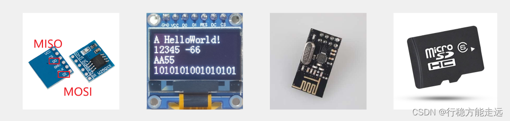

spi的基本特征是同步全双工，首先这是同步时序，肯定就得有时钟线了，所以这个sck硬件就是用来提供时钟信号的，数据位的输出和输入，都是在sck的上升沿或下降沿进行的，这样数据位的收发时刻就可以明确的确定，并且同步时序时钟快点慢点或者中途暂停一会儿都是没问题的，这是同步时序的好处。


硬件电路：  
所有SPI设备的SCK、MOSI、MISO分别连在一起  
主机另外引出多条SS控制线，分别接到各从机的SS引脚

然后我们看一下这几根通讯线，首先scl时钟线，时钟线完全由主机掌控，所以对于主机来说，时钟线为输出，对于所有从机来说，时钟线都为输入，这样主机的同步时钟就能送到各个从机了，然后下一个mosi主机输出从机输入，这边左边是主机，所以就对应mo主机输出，下面三个都是从机，所以就对应si从机输入，数据传输方向是主机通过mosi输出，所有从机通过mosi输入，接着下一个miso主机输入从机输出，左边是主机对应mi，下面三个是从机，对应so，数据传输方向是三个从机，通过miso输出，主机通过miso输入。  
从机选择，为了确定通信的目标，主机就要另外引出多条SS控制线，分别接到各从机的SS引脚下面。  
下面这里有三个从机，需要主机另外引出三根SS选择线，主机的SS线都是输出，从机的SS线都是输入，SS线是低电平有效，主机想指定谁，就把对应的SS输出线置低电平就行了，比如主机初始化之后，所有的SS都输出高电平，这样就是谁也不指定，当主机需要和比如从机1进行通信了，主机就把SS1线输出低电平，不需要像I2C一样进行寻址，是不是挺简单的。

输出引脚配置为推挽输出，输入引脚配置为浮空或上拉输入，对输出我们配置推挽输出，高低电平均有很强的驱动能力，这将使得spi引脚信号的下降沿非常迅速，上升沿也非常迅速，不像I2C那样下降沿非常迅速，但是上升沿就比较缓慢了，那得益于推换输出的驱动能力，spi信号变化的快，那自然它就能达到更高的传输速度，一般spi信号都能轻松达到兆赫兹的速度级别，I2C并不是不想使用更快的推挽输出，而是I2C要实现半双工，经常要切换输入输出，而且I2C又要实现多主机的时钟同步和总线仲裁，这些功能都不允许I2C使用推挽输出，要不然你不小心就电源短路了，所以I2C选择了更多的功能，自然就要放弃更强的性能了，对spi来说，首先spi不支持多主机，然后spi就是全双工，spi的输出引脚始终是输出，输入引脚始终是输入，基本不会出现冲突，所以spi可以大胆的使用推挽输出，不过spi还是有一个冲突点的，就是图上的miso引脚，主机一个是输入但是三个从机全都是输出，如果三个引脚都始终是推挽输出，势必会导致冲突，所以在spi协议里有一条规定，就是当从机的SS引脚为高电平，也就是从机未被选中时，他的MISO引脚必须切换为高阻态，高阻态就相当于引脚断开，不输出任何电平，这样就可以防止一条线有多个输出，而导致的电平冲突的问题了，在ss为低电平时，miso才允许变为推挽输出，这是spi对这个可能的冲突做出的规定，当然这个切换过程都是在从机里，我们一般都写主机的程序，所以我们主机的程序中并不需要关注这个问题。

移位示意图

  
这个移位示意图是spi硬件电路设计的核心，只要你把这个移位示意图搞懂了，那无论是上面的硬件电路，还是我们等会学习的软件时序，理解起来都会更加轻松，我们看一下spi的基本收发电路，就是使用了这样一个移位的模型，左边是spi主机，里面有一个八位的移位寄存器，右边是spi从机，里面也有一个八位的移位寄存器，这里移位计算器有一个时钟输入端，因为spi一般都是高位先行，所以每来一个时钟，移位寄存器就会向左进行移位，从机也是同理，然后移位寄存器的时钟源是由主机提供的，这里叫做波特率发生器，它产生的时钟驱动主机的移位寄存器进行移位，同时这个时钟也通过SCK引脚进行输出接到从机的移位寄存器里，之后上面移位寄存器的接法是主机移位寄存器左边移出去的数据，通过mosi引脚输入到从机移位寄存器的右边，从机移位寄存器左边移出去的数据通过miso引脚输入到主机移位寄存器的右边，这样组成一个圈。

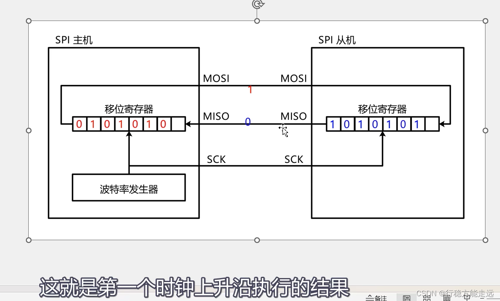

接下来我来演示一下这个电路如何工作，首先我们规定波特率发生器时钟的上升沿，所有移位寄存器向左移动一位，移出去的位放在引脚上，波特率发射器时钟的下降沿，引脚上的位采样输入到移位寄存器的最低位，接下来假设主机有个数据，10101010要发生到从机，同时从机有个数据01010101要发送到主机，那我们就可以驱动时钟，先产生一个上升沿，这时所有的位就会像这样往左移动一次，那从最高位移出去的数据，就会这样放到通信线上，数据放到通信线上啊，实际上是放到了输出数据寄存器，可以看到此时mosi数据是1，所以mosi的电平就是高电平，miso的数据是0，所以miso的电平就是低电平，就是第一个时钟上升沿执行的结果，就是把主机和从机中移位寄存器的最高位，分别放到mosi和miso的通信线上，这就是数据的输出，之后时钟继续运行，上升沿之后，下一个边沿就是下降沿，在下降沿时，主机和从机内都会进行数据采样输入，也就是mosi的1，会采样输入到从机这里的最低位，miso的0会采样输入到主机这里的最低位，这是第一个时钟结束后的现象，那时钟继续运行下一个上升沿，同样的操作，移位输出，主机现在的最高位，也就是原始数据的次高位输出到miso，从机现在的最高位输出到miso，随后下降沿数据采样输入，mosi数据到这里，miso数据到这里，一直到第八个时钟都是同样的过程，就实现了主机和从机一个字节的数据交换，实际上spi的运行过程就是这样，spi的数据收发都是基于字节交换，当主机需要发送一个字节，并且同时需要接收一个字节时，就可以执行一下字节交换的时序，这样主机要发送的数据跑到从机，主机要从从机接收的数据跑到主机，这就完成了发送同时接收的目的。

那你可能会问，如果只想发送，不想接收怎么办呢，其实很简单，我们仍然调用交换字节的时序，发送同时接收，只是这个接收到的数据，我们不看它就行了，那如果我只想接收，不想发送怎么办呢，同理我们还是调用交换自己的时序，发送同时接收，只是我们会随便发送一个数据，只要能把从机的数据置换过来就行了，我们读取置换过来的数据不就是接收了吗，这里我们随便发过去的数据啊，从机也不会去看它，当然这个随便数据我们不会真的随便发啊，一般在接收的时候，我们会统一发送0x00或0x ff，以上就是spi的基本原理。

总结一下就是spi通信的基础是交换一个字节，有了交换一个字节就可以实现，发送一个字节、接收一个字节和发送同时接收一个字节这三种功能，可以看出spi在只执行发送或只执行接收的时候会存在一些资源浪费现象，不过全双工本来就会有浪费的情况发生，spi表示我不在乎好了。

SPI时序基本单元：


接下来就是数据传输的基本单元了，这个基本单元什么时候开始移位，是上升沿移位还是下降沿移位，spi并没有限定死，可以配置选择，这样的话spi就可兼容更多的芯片，那在这里spi有两个可以配置的位，分别叫做cpol、cpha，每一位可以配置为一或零，总共组合起来就有模式零模式一模式二模式三这四种模式，当然模式虽然多，但是它们的功能都是一样的，在实际使用的时候，我们主要学习其中一种就可以了，剩下的模式你知道有这些东西可以配置，如果到时候真的需要用，再过来了解一下就行了。


那么先看一下模式一，因为这个模式和我们刚才讲的移位模型是对应的，这个时序的基本功能是交换一个字节，也就是刚在这里我们展示的现象，这里cpol等于零，表示空闲状态时sck为低电平，下面可以看到在ss未被选中时，sck默认是低电平的，然后cpha等于1，表示sck第一个边沿移出数据，第二个边缘移入数据，但这句话也有不同的描述方式，有的地方写的是cpha等于1表示sck的第二个边沿进行数据采样，或者是sck的偶数边缘进行数据采样，这些不同的描述意思都是一样，我这里为了照应刚才的移位模型，我就写的是sck第一个边缘移出数据，第二个边沿移入数据，来看一下下面的时序图，第一个ss从机选择，在通信开始前，ss为高电平，在通信过程中ss始终保持低电平，通信结束ss恢复高电平，然后最下面一个miso，这是主机输入从机输出，刚才说了这里因为有多个从机输出连在了一起，如果同时开启输出会造成冲突，所以我们的解决方法是在ss未被选中的状态，从机的miso引脚必须关断输出，即配置输出为高阻状态，那在这里ss高电平时miso用一条中间的线表示高阻态，ss下降沿之后，从机的miso被允许开启输出，ss上升沿之后呢，从机的miso必须置回高阻态，这是这一块的设计啊，然后我们看一下移位传输的操作，因为cpha等于1，sck第一个边沿移出数据，所以这里可以看出来，sck第一个边缘就是上升沿，主机和从机同时移出数据，主机通过mosi移出最高位，此时mosi的电平就表示了主机要发送数据的b7 ，重新通过miso移出最高位，此时miso表示从机要发送数据的b7 ，然后时钟运行产生下降沿，此时主机和从机同时移入数据，也就是进行数据采样，这里主机移出的b7进入从机移位寄存器的最低位，从机移出的b7进入主机移位寄存器的最低位，这样一个时钟脉冲产生完毕，一个数据位传输完毕，接下来就是同样的过程，上升沿主机和从机同时输出当前移位寄存器的最高位，第二次的最高位就是原始数据的b6，然后下降沿主机和从机移入数据，b6 传输完成之后时钟继续运行，数据依次移出移入移出移入，，最后一个下降沿数据b0传输完成，至此主机和从机就完成了一个字节的数据交换，如果主机只想交换一个字节，那这时候就可以置SS为高电平结束通信了，在ss的上升沿mosi还可以再变化一次，将mosi制造一个默认的高电平或低电平，当然也可以不去管它，因为spi没有硬性规定mosi的默认电平，然后miso从机必须得置回高组态，此时如果主机的miso为上拉输入的话，那miso引脚的电平就是默认的高电平，如果主机miso为浮空输入，那miso引脚的电平不确定，这是交换一个字节就结束了流程，那如果主机还想继续交换，在此时主机就不必把ss置回高电平，直接重复一下从这里到这里交换一个字节的时序，这样就可以交换多个字节了，就是spi传输数据的流程。


我们继续看一下模式0\[**使用最多，重点掌握**\]，这个模式0和模式1的区别，就是模式0的cpha等于0，模式1的cpha等于0。  
在时序上的区别对比一下，模式0的数据移出移入的时机会提前半个时钟，也就是相位提前了，我们看一下模式0 cpha等于0，表示sck第一个边沿移入数据，第二个边沿移出数据，模式0在sck第一个边缘就要移入数据，但数据总得先移出才能移入对吧，所以在模式0的配置下，sck第一个边沿之前就要提前开始移出数据了，或者把它称作是在第零个边沿移出在第一个边缘移入，看一下时序，首先ss下降沿开始通信，现在sck还没有变化，但是sck一旦开始变化，就要移入数据了，所以此时趁sck还没有变化，ss下降沿时就要立刻触发移位输出，所以这里mosi和miso的输出，是对齐到ss的下降沿的，或者说这里把ss的下降沿也当作时钟的一部分了，那ss下降沿触发的输出，sck上升沿就可以采样输入数据了，这样b7 就传输完毕，之后sck下降沿移出b6 ，sck上升沿移入b6 ，然后继续，下降沿移出数据，上升沿移入数据，最终在第八个上升沿时，b0位移入完成整个字节交换完成，之后sck还有一个下降沿，如果主机只需要交换一个字节就结束，那在这个下降沿时mosi可以置回默认电平或者不去管它，miso也会变化一次，这一位实际上是下一个字节的b7，因为这个相位提前了，所以下一个字节的b7会露个头，如果不需要的话，ss上升沿之后从机miso置回高阻态，这是交换一个字节就结束，如果主机想交换多个字节的话，那就继续调用从这里到这里的时序，在最后一个下降沿主机放下一个字节的b7 ，从机也放下一个字节的b7， skc上升沿正好接着采样第二个字节的b7，这样时序才能拼接得上，就是spi交换一个字节模式零，模式零和模式一的区别就在于，模式零把这个数据变化的时机给提前了，在实际应用中，模式零的应用是最多的，所以我们重点掌握模式零即可，后续的程序都是基于spi模式零来讲解的，不过这里我感觉模式一是不是更符合常理，但实际确实是模式零用的最多，可能是spi设计的时候，为了兼容现存设备吧，或者是模式0在实际应用时确实有什么优势，或者因为模式零排在最前面，大家都默认最前面的模式吗，这个原因大家感兴趣的话可以调研一下。

  


这个cpha表示的是时钟相位，决定是第一个时钟采样移入，还是第二个时钟采样移入，并不是规定上升沿采样还是下降沿采样的，当然在cpol确定的情况下，cpha确实会改变采样时刻的上升沿和下降沿，比如模式0的时候是sck上升沿采样移入，模式1的时候是sck下降沿采样移入，cpha决定的是第几个边沿采样，并不能单独决定是上升沿还是下降沿，在这四种模式里，模式零和模式三都是sck上升沿采样，模式一和模式二都是sck下降沿采样。

**看几个SPI完整波形**

每个芯片对spi时序字节流功能的定义不一样，在这里我是以我们本节课使用的芯片，w25q64它的时序为例进行讲解，spi对字节流功能的规定不像I2C那样，I2C的规定一般是，有效数据流第一个字节是寄存器地址，之后依次是读写的数据，使用的是读写寄存器器的模型，而在spi中，通常采用的是指令码加读写数据的模型，这个过程就是spi起始后，第一个交换发送给从机的数据一般叫做指令码，在从机中，对应的会定义一个指令集，当我们需要发送什么指令时，就可以在起始后第一个字节发送指令集里面的数据，这样就能指导从机完成相应的功能了，不同的指令可以有不同的数据个数，有的指令只需要一个字节的指令码就可以完成，比如w25q64的写使能写失能等指令，而有的指令后面就需要再跟要读写的数据，比如w25q64的写数据读数据等，写数据指令后面就得跟上我要在哪里写我要写什么对吧，读数据指令后面就得跟上我要在哪里读我读到的是什么，这是指令码加读写数据的模型，在spi从机的芯片手册里都会定义好指令集，什么指令对应什么功能，什么指令后面得跟上什么数据这些内容，我们下一小节学习芯片的时候再具体分析。  
那这里我简单的抓了几个指令的波形，我们先来看一下这些波形是什么样的。


发送指令，向SS指定的设备，发送指令（0x06）

指令0x06到底是什么意思呢，可以由芯片厂商自己规定，在w25q64 型面里，这个0x06 代表的是写使能，我们看一下这个模型，在这里我们使用的是spi模式0,在空闲状态是ss为高电平，sck为低电平，mosi和miso的默认电平没有严格规定，然后ss产生下降沿时序开始，在这个下降沿时刻，mosi和miso就要开始变换数据了，mosi由于指令码最高位仍然是0，所以这里保持低电平不变，miso从机现在没有数据发给主机，引脚电平没有变化，实际上w25q64不需要回弹数据时，手册里规定的是miso仍然是高阻态，从机并没有开启输出，不过这也没问题，反正这个数据我们也不要看，那这里因为stm32的miso是上拉输入，所以这里miso呈现高电平，之后sck第一个上升沿进行数据采样，我这里画了一条绿线，从机采样输入得到零，主机采样输入得到一，之后继续第二个时钟，主机数据仍然是零，所以波形仍然没有变化，然后这样一位一位的发送接收发送接收，到这一位数据才开始变化，主机要发送数据一，下降沿数据移出，主机将一移出到mosi，mosi变为高电平，这里因为是软件模拟的时序，所以mosi的数据变化有些延迟，没有紧贴sck的下降沿，不过这也没关系，时钟是主机控制的，我们只要在下一个sck上升沿之前完成变化就行了，然后sck上升沿数据采样输入，在最后一位呢下降沿数据变化mosi变为零，上升沿数据采样，从机接收数据0，sck低电平是变化的时期，高电平是读取的时期，这一块是不是和I2C差不多，那时序sck最后一个上升沿结束，一个字节就交换完毕了，因为写使能是单独的指令，不需要跟随数据，spi只需要交换一个字节就完事了，所以最后在sck下降沿之后，ss置回高电平结束通信，那这个交换我们统计一下，mos i和miso的电平，总结一下就是，主机用0x06换来了从机的0xff，但实际上从机并没有输出，这个0xf f是默认的高电平，不过这个0xf f没有意义，我们不用管，那整个时序的功能就是发送指令，指令码是0x06 ，从机一比对事先定义好的指令集，发现0x06是写使能的指令，那从机就会控制硬件进行写使能，这样一个指令从发送到执行就完成了，就是发送单字节指令的时序。

___

指定地址写  
向SS指定的设备，发送写指令（0x02），随后在指定地址（Address\[23:0\]）下，写入指定数据（Data）

我们这个w25q64 芯片有8M字节的存储空间，一个字节的八位地址肯定不够，所以这里地址是24位的分三个字节传输，我们看一下时序，首先ss下降沿开始时序，mosi空闲时是高电平，所以在下降沿之后，sck第一个时钟之前可以看到mosi变换数据由高电平变为低电平，然后sck上升沿数据采样输入，后面还是一样下降沿变换数据上升沿采样数据，八个时钟之后一个字节交换完成，我们用0x02换来了0xff，其中发送的0x02是一条指令，代表这是一个写数据的时序，接收到0x ff不需要看，那既然是写数据的时序，后面必然还要跟着写的地址和数据，所以在最后一个下降沿时刻，因为我们后续还需要继续交换字节，所以在这个下降沿，我们要把下一个字节的最高位放到mosi上，当然下一个字节的最高位仍然是零，所以这里数据没有变化，最后还是同样的流程交换一个字节，第二个字节我们用0x12换来了0xff，根据w25q64 芯片的规定，写指令之后的字节定义为地址高位，所以这个0x12 就表示发送地址的23~16位，继续看一下交换一个字节，发送的是0x34 这个就表示发送地址的15~8位，最后还是交换一个字节发送的是0x56 ，这个表示发送地址的7~0位，通过三个字节的交换，24位的地址就发送完毕了，从机收到的24位地址是0x123456 ，那三位地址结束后，就要发送写入指定地址的内容了，我们继续调用交换一个字节，发送数据这里的波形是0x55 ，这个表示我要在0x123456 地址下，写入0x55 这个数据，最后如果只想写出一个数据的话，就可以ss置高电平结束通信了，当然这里也可以继续发送数据，spi里也会有和I2C一样的地址指针，每读写一个字节地址指针自动加一，如果发送一个字节之后不终止继续发送的字节就会依次写入到后续的存储空间里，这样就可以实现从指定地址开始写入多个字节了，这就是spi写入的时序，由于spi没有应答机制，所以交换一个字节后，就立刻交换下一个字节就行了，然后这条指令我们还可以看出啊，由于整个流程我们只需要发送的功能，并没有接收的需求，所以miso这条接收的线路就始终处于挂机的状态，我们并没有用到，当然不同的芯片肯定有不同的规定，我们这个存储器的容量大，所以需要连续制定三个字节的地址，如果容量小的话，可能一个字节的地址就够了，或者有的芯片会直接把地址融合到指令码里去，这也是可以的哈，至于具体怎么操作的，还是得仔细分析一下手册。

  
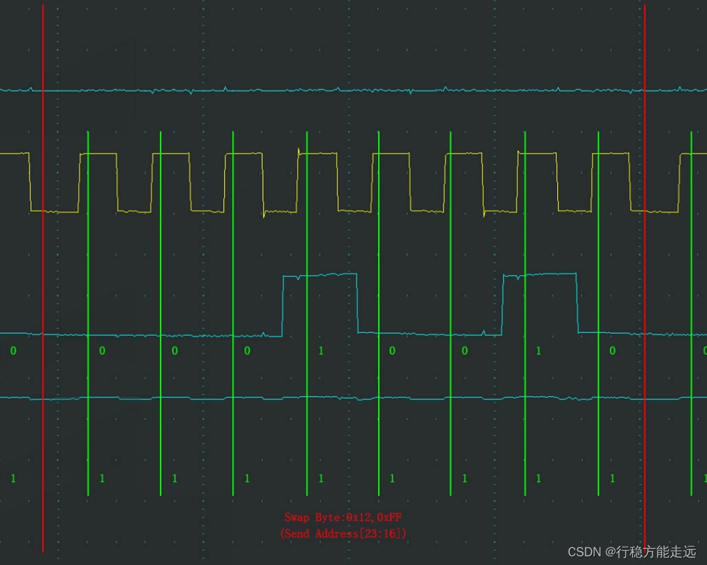  


___

指定地址读  
向SS指定的设备，发送读指令（0x03），随后在指定地址（Address\[23:0\]）下，读取从机数据  
（Data）

功能是向ss指定的设备先发送读指令，这里芯片定义0x03为读指令，随后在指定地址下读取从机数据，我们看一下时序，起始之后第一个字节主机发送指令0x03 ，表示我要读取数据了，最后还是一样，主机在依次交换三个字节，分别是0x12 x34 0x56 ，组合到一起就是0x123456代表24位地址，最后这个地方就是关键点，因为我们是读取数据，指定地址之后，显然我们就要开始接收数据，所以这里三个字节的地址交换完之后，我们要把从机的数据搞过来，怎么搞过来呢，我们还是交换一个数据来个抛砖引玉，我们随便给从机一个数据，一般给ff就行了，从机就会乖乖的把0x123456地址下的数据通过miso发给主机，可以看到这样的波形就表示指定地址下的数据是0x55 ，这样主机就实现了指定地址读一个字节的目的，然后如果我们继续抛砖引玉，那么从机内部的地址指针自动加一，从机就会继续把指定地址下一个位置的数据发过来，这样依次进行，就可以实现指定地址接收多个字节的目的了，最后数据传输完毕，ss置回高电平，时序结束，当然时序这里也会有些细节，比如由于miso是硬件控制的波形，所以它的数据变化都可以紧贴时钟的下降沿，另外我们可以看到miso数据的最高位实际上是在上一个字节，最后一个下降沿提前发生的，因为这是spi模式零，所以数据变化都要提前半个周期。

  
  


### W25Q64简介


低成本，也就是说这个芯片一般也就几块钱。更换不同的型号，我们的硬件电路和底层驱动程序都不需要更改，所以我们学会了其中一个型号，在应用同系列的其他型号就很容易上手了。

字库存储这个可以应用到一些显示屏上，比如我们这个oled显示屏或者lcd液晶屏，你如果想在屏幕上显示汉字，就得把汉字的点阵数据存起来，当然简单的方法是，把字库直接存在stm32内部，这样适合少量汉字显示的情况，如果汉字非常多，再直接存在s t m32 中就不合适了，所以我们可以用这个芯片来存储汉字，在显示某个汉字之前，先读取芯片查询字库，再在显示屏上显示对应的点阵数据。  
固件程序存储，这个就相当于直接把程序文件下载到外挂芯片里，需要执行程序的时候，直接读取外挂芯片的程序文件来执行，这就是xip就地执行，比如我们电脑里的bios固件，就可以存储在这个系列的芯片里。

这个芯片的存储介质是Nor Flash，flash就是闪存存储器，像我们stm32的程序存储器、u盘、电脑里的固态硬盘等使用的都是flash闪存，闪存分为Nor Flash和Nand Flash，两者各有优势和劣势，适用领域不同，这个感兴趣的话可以百度了解一下。

时钟频率，我们这个芯片使用的是spi通信，其中spi的sck线就是时钟线，这个时钟线的最大频率是80MHz，这个频率相比较stm32是非常快的，所以我们在写程序的时候翻转引脚就不用再加延时了，即使不延时这个GPIO的翻转频率也不可能达到80MHz，所以可以放心使用，然后后面这还有两个频率，分别是160MHz这个是双重spi模式等效的频率，320MHz这个是四重spi模式等效的频率，这个双重spi和四重spi大家了解一下即可，我们本课程不会用到，那他们是什么意思呢，就是我们之前说的mosi用于发送，miso用于接收，是全双工通信，在只发或只收时有资源浪费，但是这个w25q芯片的厂商不忍心浪费，所以就对spi做出了一些改进，就是我在发的时候，我可以同时用mosi和miso发送，在收的时候也可以同时用mosi和miso接收，mosi和miso同时兼具发送和接收的功能，一个sck时钟我同时发送或接收两位数据，就是双重spi模式，那你一个时钟收发两位相比较一位一位的普通spi数据传输率就是二倍了，所以这里写的是在双重spi模式下，等效的时钟频率就是80MHz的二倍就是16MHz，但实际上这个频率最大还是80MHz，只是我一个时钟发两位而已，然后四重spi模式，很显然就是一个时钟发送或接收四位，等效的频率就是80x4=320MHz，在我们这个芯片里啊，除了spi通信引脚，还有两个引脚，一个是wp写保护，另一个是hold，这两个引脚如果不需要的话，也可以拉过来充当数据传输引脚，加上mosi和miso就可以四个数据位同时收发了，就是四重spi，其实这就有点并行传输的意思了，串行是根据时钟一位一位的发，并行是一个时钟八位同时发送，所以这个四重spi模式，其实就是四位并行的模式，这个大概了解一下就行。

这个芯片使用的是24位的地址，24位地址是三个字节，因为我们在进行读写的时候，肯定得把每个字节都分配一个地址，这样才能找到它们，上小节讲时序的时候也提到过，这里在指定地址时需要一次性指定三个字节，24位的地址，然后我们可以用计算器算一下，24位的地址最大能分配多少个字节呢，这里2的24次方等于这么多个字节数，那除1024等于这么多kb，再除1024=16MB，所以24位地址的最大寻址空间是16MB，那ppt中w25q40到q128使用三字节24位的地址都是足够的，但是这个w25q256就比较尴尬了，24位地址对于32MB来说是不够的，所以这最后一个型号比较特殊，根据手册里描述w25q256分为三字节地址模式和四字节地址模式，在三字节地址模式下，只能读写前16MB的数据，后面16MB 3个字节的地址够不着，要想读写到所有存储单元，可以进入四字节地址的模式这样就行了。

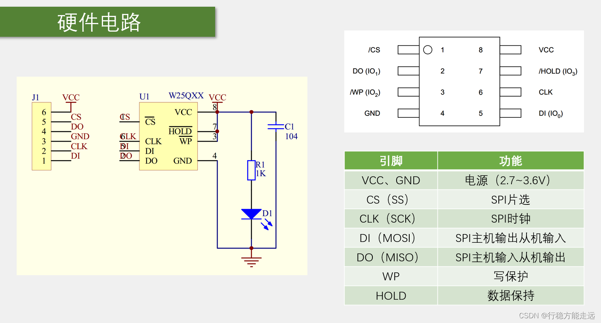

看一下这个芯片的硬件电路，当我们拿到这个八脚的芯片后，怎么把它和stm32连接在一起呢，我们看一下，左边这个图是我们这个小模块的原理图，右上角这个图就是这个芯片的引脚定义，右下角这个表就是每个引脚定义的功能呢，首先看一下引脚定义，VCC、GND是电源供电，引脚供电电压是2.7~3.6V，是一个典型的3.3V供电设备不能直接接入5V电压，然后1号脚cs，这个cs左边画了个斜杠代表是低电平有效，或者这边cs上面画了个横线也是低电平有效，那这里cs对应之前我们讲spi的名称就是SS，意思是spi的片选引脚，6号脚clk对应就是sck，是spi的时钟线，然后5号引脚di对应mosi，是spi主机输出从机输入，2号do对应miso，是spi主机输入从机输出，这四个引脚就是spi通信的四个引脚。

然后这个芯片还有两个引脚，3号引脚wp，他的意思是写保护配合内部的寄存器器配置，可以实现硬件的写保护，写保护低电平有效，wp接低电平保护住不让写，wp接高电平不保护可以，最后7号hold意思就是数据保持哈，低电平有效，这个用的不多了解一下，就是如果你在进行正常读写时突然产生中断，然后想用spi通信线去操控其他器件，这时如果把cs置回高电平，那时序就终止，但如果你又不想终止总线，又想操作其他器件，这就可以hold引脚置低电平，这样芯片就hold住了，芯片释放总线，但是芯片时序也不会终止，它会记住当前的状态，当你操作完其他器件时，可以回过来哈，hold置回高电平，然后继续hold之前的时序，相当于spi总线进来一次中断，并且在中断里还可以用spi干别的事情，这就是hold的功能，然后最后我们注意到，这个di、do、wp、和HOLD，旁边都有括号，写了lO0、lO1、lO2、lO3 ，这个就对应我们刚才这里说的双重spi和四重spi，如果是普通的spi模式，那括号里的都不用看，如果是双重spi，那di和do就变成lO0和lO1，也就是数据同时收和同时发的两个数据位，如果是四重spi，那就再加上wp当做lO2 ，HOLD当做lO3 ，这四个引脚都作为数据收发引脚，一个时钟四个数据位，了解一下即可暂时不用。

最后看一下左边模块原理图，这个U1就是W25QXX的芯片，J1是一个六脚的排针，然后芯片的vcc电源正极，通过vcc引脚标号接到排针6号脚，芯片gnd电源负极，通过gnd编号接到排针3号脚，然后芯片spi通信的四个脚，就直接通过排针引出来就行了，之后hold的和wp这两个都是直接接到的vcc，低电平有效，那都接到vcc就这两个功能我们都不用，然后这个C1直接接到vcc和gnd，显然是一个电源滤波，R1和D1也是直接接到vcc和gnd，显然是一个电源指示灯，通电就亮，那这些就是这个芯片的硬件电路了。

W25Q64框图：  


我们看一下w25q64 是怎么划分的，首先右边这一整个矩形空间里是所有的存储器，存储器以字节为单位，每个字节都有唯一的地址，这样说了w25q64的地址宽度是24位3个字节，所以可以看到左下角第一个字节，它的地址是00 00 00h，h代表16进制，之后的空间地址依次自增，直到最后一个字节，地址是7F FF FF h，那最后一个字节为啥是7f开头，不是f f开头呢，因为24位地址最大寻址范围是16MB，我们这个芯片只有8MB，所以地址空间我们只用了一半，8MB排到最后一个字节，就是7F FF FF h，那这是整个地址空间，从000000~7F FF FF，然后在这整个空间里，我们以64kb为一个基本单元，把它划分为若干的块block，从前往后依次是块0块1块2等等，一直分到最后一块，那整块蛋糕是8MB，以64kb为一块进行划分，最后分得的快数就是8MB除以64kB，这里可以分得128块，那块序号就是块0一直到最后一个是块127，然后观察一下块内地址值的变化规律，比如块0的起始地址是000000，结束地址是00f f f f，之后块31起始是1f0000 ，结束是1f f f f f，之后的都观察一下，可以发现在每一块内，它的地址变化范围就是最低的两个字节，每个块的起始地址是XX0000，结束是XXf f f f，这是块内地址的变化规律，到这里这一块大蛋糕我们就分好块了，64kb为一块总共128块，之后看一下左边这个示意图，我们还要再对每一块进行更细的划分，分为多个扇区sector，这里的虚线看到没指向了右边的各个块，也就是告诉你每一块里面都是这个样子的，那在每个块里，它的起始地址是XX0000，结束地址是XXf f f f，在一块里我们再以4kb为一个单元进行切分，一块是64kb，我4kb一切总共16份，所以在每一块里都可以分为扇区0一直到扇区15，观察一下地址规律，可以发现每个扇区内的地址范围是XXX000到XXXf f f，地址划分啊到扇区就结束了，但是当我们在写入数据时啊，还会有个更细的划分，就是页Page，页是对整个存储空间划分的，当然你也可以把它看作在扇区里再进行划分都一样，那页的大小是256个字节，一个扇区是4kb，所以一个扇区里可以分为16页，然后页的地址规律呢我们也看一下，在这里每一行就是一页，左边这里指了个箭头，写的是页地址的开始，右边这里也指了个箭头，写的是页地址的结束，在一页中，地址变化范围是XXXX00到XXXXFF，一页内的地址变化，仅限于地址的最低一个字节，这就是页的划分，那这个存储器的地址划分啊我就讲完了，我们需要记住的是一整个存储空间，首先划分为若干块，对于每一块又划分为若干扇区，然后对于整个空间会划分为很多很多页，每页256字节，这个我们需要记住。

左下角，这是spi控制逻辑，是芯片内部进行地址锁存、数据读写等操作，都可以由控制逻辑来自动完成，这个不用我们操心，控制逻辑就是整个芯片的管理员，我们有什么事只需要告诉这个管理员就行了。

然后控制逻辑左边就是spi的通信引脚，有wp、HOLD、CLK、CS、DI和DO，这些引脚就和我们的主控芯片相连，主控芯片通过spi协议，把指令和数据发给控制逻辑，控制逻辑就会自动去操作内部电路来完成我们想要的功能，然后去看控制逻辑上面有个状态寄存器器，这个状态寄存器器是比较重要的，比如芯片是否处于忙状态，是否写使能，是否写保护，都可以在这个状态寄存器器里体现，这个我们等会看手册的时候再来分析，然后上面是写控制逻辑和外部的wp引脚相连，显然这个是配合wp引脚实现硬件写保护的，然后继续右边这里是一个高电压生成器，这个是配合flash进行编程的，因为flash是掉电不丢失的，如何实现掉电不丢失呢，比如你点亮一个led表示1，熄灭led表示0，但如果整个系统电都没有，那1和0就无从说起了，所以要想掉电不丢失，就要我们在存储器里产生一些刻骨铭心的变化，比如一个led我给他加很高的电压，那led就烧坏了，我们用烧坏的led表示1没烧坏的led表示0然后再断电，烧坏的led还是烧坏的，有电没电它都是坏的，这个烧没烧坏的状态，不受有电还是没电的影响，所以它就是掉电不丢失，那对于我们的非易失性存储器来说也是一样，我们要让它产生即使断电也不会消失的状态，一般都需要一个比较高的电压去刺激它，所以这种掉电不丢失的存储器，一般都需要一个高压源，那这里芯片内部集成了高电压发生器，所以就不需要我们在外接高电压了，比较方便哈，当然我这里只是举例简单描述一下掉电不丢失的存储原理，至于flash的原理，大家可以再例行研究。

然后继续看下面，这里是页地址锁存计数器，然后下面还有一个字节地址锁存计数器，这两个地址锁存和记数器就是用来指定地址的，我们通过spi总共发过来三个字节的地址，因为一页是256字节，所以一页内的字节地址就取决于最低一个字节，而高位的两个字节就对应的是页体质，所以在这里我们发的三个字节地址，前两个字节会进到这个页地址锁存计数器里，最后一个字节会进到这个字节地址锁存计数器里，然后页地址通过这个写保护和行解码来选择我要操作哪一页，字节地址通过这个列解码和256字节页缓存，来进行指定地址的读写操作，那就因为我们这个地址锁存，都是有个计数器的，所以这个地址指针在读写之后可以自动加1，这样就可以很容易实现从指定地址开始，连续读写多个字节的目的了，那最后右边这里有个256字节的页缓存区，它其实是一个256字节的ram存储器，这个稍微留个印象，等会儿还会提到，然后我们数据读写，就是通过这个ram缓冲区域来进行的，我们写入数据会先放到缓存区里，然后在时序结束后，芯片再将缓冲区的数据复制到对应的flash里，进行永久保存，那为啥要弄个缓冲区呢，我们直接往flash里写不好吗，那这是因为我们的spi写入的频率是非常高的，而flash的写入由于需要掉电不丢失，留下刻骨铭心的印象，他就比较慢，所以这个芯片的设计思路就是你写入的数据，我先放在缓存区里存着，因为缓存区是ram，所以它的速度非常快啊，可以跟得上spi总线的速度，但这里有个小问题，就这个缓冲区只有256字节，所以写入的时序有个限制条件，就是写入了一个时序，连续写入的数据量不能超过256字节，然后等你写完了，我芯片再慢慢的把数据从缓冲区转移到flash存储器里，那么数据从缓存区转到flash里，需要一定的时间哈，所以在写入时序结束后，芯片会进入一段忙的状态，在这里它就会有一条线哈，通往状态寄存器给状态接容器的busy位置1表示芯片当前正在搬砖呢很忙，那在忙的时候，芯片就不会响应新的读写时序了哈，就是写入的执行流程，然后我们读取数据，虽然这里画的话应该也是会通过缓冲区来读句，但是由于读取只看一下电路的状态就行了，它基本不花时间，所以读取的限制就很少了，速度也非常快。

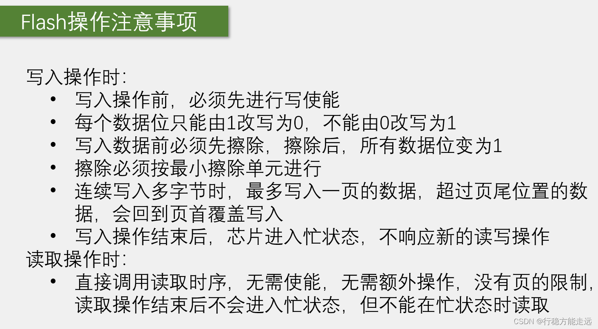

flash的写入和读取并不像ram那样简单直接 ，ram是指哪打哪，想在哪写就在哪写，想写多少就写多少，并且ram是可以覆盖写入的，但是flash并没有这个特性啊，总之flash的读写有很多要求，其中写入的要求是非常多的，需要我们掌握，读取的要求就比较少了，还是那个原因，因为读取啊只是看一下电路的状态，不对电路做出实质性的改变，所以读取一般都比较快，而且没有什么限制，那我们看一下flash写入操作时需要注意些什么呢

第一点写入操作前必须先进行写使能，这个是一种保护措施，防止你误操作的，就像我们使用手机一样，先解锁再操作，这样可以防止手机在你裤兜里到处点点点对吧，写使能的话我们就使用spi发送一个写使能的指令，就可以完成了，然后下一条每个数据位只能由1改写为0，不能由0改写为1，这个意思就是说，flash并没有像ram那样的直接完全覆盖改写的能力，比如在某一个字节的存储单元里面，存储了0xAA这个数据，对应的二进制位就是10101010，如果我直接再次在这个存储单元写入一个新的数据，比如我再次写入一个0x55 ，那写完之后这个存储单元里存的是x55，实际上并不是，因为0x55的二进制是01010101，当这个01010101要覆盖原来的10101010时，就会受到这里第二条规定的限制，每个数据位只能由一改写为零，不能由零改写为一，你要问为啥会有这个限制，那只能说是成本原因或者技术原因，所以这里写入01010101之后，依次来看啊，最高位由原来的1改写为0是可以的，所以写出之后新的最高位就是零，但是第二位原来是零，现在我要改写成1，这是不行的，所以写入之后，新的第二位仍然是零，之后第三位要改写为零，可以，结果为零，第四位零改写为1，不可以，结果仍然是零，那以这个规律进行下去，0xaa在覆盖写入0x55 之后，这个存储单元最终的数据是什么啊，0x00也就是八位全为零，这就出现问题了对吧，所以为了弥补这个只能1改0，不能0改1的缺陷，我们就引出了第三条规定，就是写入数据前必须先擦除，擦除后所有数据位变为一，在这里flash是有一个擦除的概念的，擦除会有专门的擦除电路进行，我们只要给他发送擦除的指令就行了，那通过擦除电路擦除之后，所有的数据位都变成一，这样我们是不是就可以弥补第二条限制的缺陷了，当我们写出一个数据之前，无论原来存的是什么，我直接给它擦除掉，擦除之后所有的位变成1，也就是16进制的f f，这样我无论再写入什么样的数据，就都可以正确的写入了。

那总结一下就是flash中数据位为一的数据，拥有单项改成零的权利，一旦改写为0之后，就不能反悔再改写成1了，要想反悔就必须得先擦除，所有的位先统一都变成一，然后再重新来过，这是flash改写的特性。

如果你说我非不擦除，直接改写，这样的操作可以执行，但是存储的数据极有可能是错的，这个注意一下，那拆除之后所有的位变1，就是16进制的ff，所以有时候你读取flash会发现数据全是f f，那就说明这一段有可能是擦除之后，还没有写入数据的空白空间，在flash中ff代表空白，那这个改写和擦除的注意事项我们就了解了。

接下来下一条擦除必须按最小拆除单元进行，这个应该也是为了成本而做出的妥协，就是说你写入前要进行擦除，这我知道，所以如果我想在00这个地址下写入数据，那我就先把00地址擦除，再写入数据到00地址不就行了吗，但是这个方案有个问题啊，flash的擦除有最小擦除单元的限制，你不能指定某一个直接去擦除，要擦就得一大片一起擦，那在我们这个芯片里，你可以选择整个芯片擦除，也可以选择按块擦除或者按扇区擦除，然后再小就没有了，所以最小的擦除单元就是一个扇区，刚才我们看了一个扇区是4kb就是4096个字节，所以你擦除最少就得4096个字节一起擦，我只想查出某一个字节怎么办呢，这没办法你只能把那个字节所在扇区的4096个字节全都擦掉，那你又说这个扇区其他的地方我还存的有数据怎么办呢，这也没办法，要想不丢失数据，你只能先把4096个字节都读出来，再把4096个字节的扇区擦掉，改写完读出来的数据后，再把4096个字节全都写回去，这感觉是不是挺麻烦的哈，但是如果你确实就想单独改写某一个字节，那只能这样来操作，当然实际情况下，我们还有别的方法可以优化一下这个流程，比如上电后，我先把flash的数据读出来放到ram里，当有数据变动时，我再统一把数据备份到flash里，或者我把使用频繁的扇区放在ram里，当使用频率降低时，我再把整个扇区备份到flash里，或者如果你的数据量确实非常少，只想存几个字节的参数就行了，那直接一个字节占一个扇区不就行了吗，尽显奢靡之风啊。

连续写入多字节时，最多写入一页的数据，超过页尾位置的数据会回到页首覆盖写入，这个意思就是说你在写入的时候，一次性不能写太多了，一个写入时序最多只能写一页的数据也就是256字节，为什么有这个限制呢，这是因为在这里有一个页缓冲区，它只有256字节，为什么有缓冲区呢，这是因为flash的写入太慢了，跟不上spi的频率，所以写入的数据会先放在ram里暂存，等时序结束后，芯片再慢慢的把数据写入到flash里，所以这里会有个限制，每个时序最多写入一页的数据，你再写多缓冲区存不下了，如果你非要写，那超过页尾位置的数据会回到页首覆盖写入，另外我们这个页缓存区是和flash的页对应的，你必须得从页起始位置开始写，才能最大写入256字节，如果你从页中间的地址开始写，那写到页尾时，这个地址就会跳回到页首，这会导致地址错乱哈，所以我们在进行多字节写入时，一定要注意这个地址范围不能跨越页的边缘，否则会地址错乱。

然后写入操作结束后，芯片进入忙状态，不响应新的读写操作，我们的写入操作都是对缓存区进行的，等时序结束后芯片还要搬砖一段时间，所以每次写入操作后，都有一段时间的忙状态，在这个状态下不要进行新的读写操作，否则芯片是不会响应我们的，要想知道芯片什么时候结束盲状态，我们可以使用读状态寄存器器的指令，看一下状态寄存器的busy位是否为1，为0时芯片就不忙了，我们再进行操作，另外注意这个写入操作，包括上面的擦除，在发出擦除指令后，芯片也会进入忙状态，我们也得等盲状态结束后才能进行后续操作。

继续看读取操作的注意事项，这个就相对宽松很多了，在读取时我们直接调用读取时序，无需使能没有页的限制，也就是这一条连续读取多个字节时，想读多少就读多少，不用担心地址错位或者覆盖的问题，读取操作结束后不会进入忙状态，但不能在盲状态时读取。

flash这种非易失性存储器，目前的[市场竞争](https://edu.csdn.net/cloud/pm_summit?utm_source=blogglc)力还是非常大的，尽管它有这么多不方便，但是这些不方便可以用软件来弥补，而它的优点是其他存储器比不了的，比如容量大价格低。

芯片手册


  
  
  


  
看出来这个flash芯片的写入时间一般情况下大概处于一个毫秒的时间级别。


### 10.3 SPI软件读写W25Q64

接线图：  


软件模拟的spi这四根线是可以接到stm32的任意GPIO口，软件模拟的通信端口灵活性高，这里我是这样来接的，cs片选接到PA4 ，DO从机输出接到PA6 ，CLK时钟接到PA5 ，DI从机输入接到PA7，当然我这里引脚其实并不是任意选的，实际上是接到了硬件spi的引脚上，这样的话软件spi和硬件spi都可以任意切换。

  
代码：

main.c

MySPI.h

```c
#ifndef __MYSPI_H
#define __MYSPI_H

void MySPI_Init(void);
void MySPI_Start(void);
void MySPI_Stop(void);
uint8_t MySPI_SwapByte(uint8_t ByteSend);

#endif

```

MySPI.c

```c
#include "stm32f10x.h"                  // Device header

/*引脚配置层*/

/**
  * 函    数：SPI写SS引脚电平
  * 参    数：BitValue 协议层传入的当前需要写入SS的电平，范围0~1
  * 返 回 值：无
  * 注意事项：此函数需要用户实现内容，当BitValue为0时，需要置SS为低电平，当BitValue为1时，需要置SS为高电平
  */
void MySPI_W_SS(uint8_t BitValue)
{
	GPIO_WriteBit(GPIOA, GPIO_Pin_4, (BitAction)BitValue);		//根据BitValue，设置SS引脚的电平
	//SPI的操作速度非常快，暂时不需要加延时
}

/**
  * 函    数：SPI写SCK引脚电平
  * 参    数：BitValue 协议层传入的当前需要写入SCK的电平，范围0~1
  * 返 回 值：无
  * 注意事项：此函数需要用户实现内容，当BitValue为0时，需要置SCK为低电平，当BitValue为1时，需要置SCK为高电平
  */
void MySPI_W_SCK(uint8_t BitValue)
{
	GPIO_WriteBit(GPIOA, GPIO_Pin_5, (BitAction)BitValue);		//根据BitValue，设置SCK引脚的电平
}

/**
  * 函    数：SPI写MOSI引脚电平
  * 参    数：BitValue 协议层传入的当前需要写入MOSI的电平，范围0~0xFF
  * 返 回 值：无
  * 注意事项：此函数需要用户实现内容，当BitValue为0时，需要置MOSI为低电平，当BitValue非0时，需要置MOSI为高电平
  */
void MySPI_W_MOSI(uint8_t BitValue)
{
	GPIO_WriteBit(GPIOA, GPIO_Pin_7, (BitAction)BitValue);		//根据BitValue，设置MOSI引脚的电平，BitValue要实现非0即1的特性
}

/**
  * 函    数：I2C读MISO引脚电平
  * 参    数：无
  * 返 回 值：协议层需要得到的当前MISO的电平，范围0~1
  * 注意事项：此函数需要用户实现内容，当前MISO为低电平时，返回0，当前MISO为高电平时，返回1
  */
uint8_t MySPI_R_MISO(void)
{
	return GPIO_ReadInputDataBit(GPIOA, GPIO_Pin_6);			//读取MISO电平并返回
}

/**
  * 函    数：SPI初始化
  * 参    数：无
  * 返 回 值：无
  * 注意事项：此函数需要用户实现内容，实现SS、SCK、MOSI和MISO引脚的初始化
  */
void MySPI_Init(void)
{
	/*开启时钟*/
	RCC_APB2PeriphClockCmd(RCC_APB2Periph_GPIOA, ENABLE);	//开启GPIOA的时钟
	
	/*GPIO初始化*/
	GPIO_InitTypeDef GPIO_InitStructure;
	GPIO_InitStructure.GPIO_Mode = GPIO_Mode_Out_PP;		
	GPIO_InitStructure.GPIO_Pin = GPIO_Pin_4 | GPIO_Pin_5 | GPIO_Pin_7;
	GPIO_InitStructure.GPIO_Speed = GPIO_Speed_50MHz;
	GPIO_Init(GPIOA, &GPIO_InitStructure);					//将PA4、PA5和PA7引脚初始化为推挽输出
	
	GPIO_InitStructure.GPIO_Mode = GPIO_Mode_IPU;
	GPIO_InitStructure.GPIO_Pin = GPIO_Pin_6;
	GPIO_InitStructure.GPIO_Speed = GPIO_Speed_50MHz;
	GPIO_Init(GPIOA, &GPIO_InitStructure);					//将PA6引脚初始化为上拉输入
	
	/*设置默认电平*/
	MySPI_W_SS(1);											//SS默认高电平 不选中
	MySPI_W_SCK(0);											//SCK默认低电平 SPI模式0
}

/*协议层*/

/**
  * 函    数：SPI起始
  * 参    数：无
  * 返 回 值：无
  */
void MySPI_Start(void)
{
	MySPI_W_SS(0);				//拉低SS，开始时序
}

/**
  * 函    数：SPI终止
  * 参    数：无
  * 返 回 值：无
  */
void MySPI_Stop(void)
{
	MySPI_W_SS(1);				//拉高SS，终止时序
}

/**
  * 函    数：SPI交换传输一个字节，使用SPI模式0
  * 参    数：ByteSend 要发送的一个字节
  * 返 回 值：接收的一个字节
  */
uint8_t MySPI_SwapByte(uint8_t ByteSend)//有的地方定义成 readwrite()
{
	uint8_t i, ByteReceive = 0x00;					//定义接收的数据，并赋初值0x00，此处必须赋初值0x00，后面会用到
	
	for (i = 0; i < 8; i ++)						//循环8次，依次交换每一位数据
	{
		MySPI_W_MOSI(ByteSend & (0x80 >> i));		//使用掩码的方式取出ByteSend的指定一位数据并写入到MOSI线 0x80:1000 0000
		MySPI_W_SCK(1);								//拉高SCK，上升沿移出数据
		if (MySPI_R_MISO() == 1){ByteReceive |= (0x80 >> i);}	//读取MISO数据，并存储到Byte变量
																//当MISO为1时，置变量指定位为1，当MISO为0时，不做处理，指定位为默认的初值0
		MySPI_W_SCK(0);								//拉低SCK，下降沿移入数据
	}
	
	return ByteReceive;								//返回接收到的一个字节数据
}

```

W25Q64\_Ins.h

```c
#ifndef __W25Q64_INS_H
#define __W25Q64_INS_H

#define W25Q64_WRITE_ENABLE							0x06
#define W25Q64_WRITE_DISABLE						0x04
#define W25Q64_READ_STATUS_REGISTER_1				0x05
#define W25Q64_READ_STATUS_REGISTER_2				0x35
#define W25Q64_WRITE_STATUS_REGISTER				0x01
#define W25Q64_PAGE_PROGRAM							0x02
#define W25Q64_QUAD_PAGE_PROGRAM					0x32
#define W25Q64_BLOCK_ERASE_64KB						0xD8
#define W25Q64_BLOCK_ERASE_32KB						0x52
#define W25Q64_SECTOR_ERASE_4KB						0x20
#define W25Q64_CHIP_ERASE							0xC7
#define W25Q64_ERASE_SUSPEND						0x75
#define W25Q64_ERASE_RESUME							0x7A
#define W25Q64_POWER_DOWN							0xB9
#define W25Q64_HIGH_PERFORMANCE_MODE				0xA3
#define W25Q64_CONTINUOUS_READ_MODE_RESET			0xFF
#define W25Q64_RELEASE_POWER_DOWN_HPM_DEVICE_ID		0xAB
#define W25Q64_MANUFACTURER_DEVICE_ID				0x90
#define W25Q64_READ_UNIQUE_ID						0x4B
#define W25Q64_JEDEC_ID								0x9F
#define W25Q64_READ_DATA							0x03
#define W25Q64_FAST_READ							0x0B
#define W25Q64_FAST_READ_DUAL_OUTPUT				0x3B
#define W25Q64_FAST_READ_DUAL_IO					0xBB
#define W25Q64_FAST_READ_QUAD_OUTPUT				0x6B
#define W25Q64_FAST_READ_QUAD_IO					0xEB
#define W25Q64_OCTAL_WORD_READ_QUAD_IO				0xE3

#define W25Q64_DUMMY_BYTE							0xFF

#endif

```

W25Q64.h

```c
#ifndef __W25Q64_H
#define __W25Q64_H

void W25Q64_Init(void);
void W25Q64_ReadID(uint8_t *MID, uint16_t *DID);
void W25Q64_PageProgram(uint32_t Address, uint8_t *DataArray, uint16_t Count);
void W25Q64_SectorErase(uint32_t Address);
void W25Q64_ReadData(uint32_t Address, uint8_t *DataArray, uint32_t Count);

#endif

```

W25Q64.c

```c
#include "stm32f10x.h"                  // Device header
#include "MySPI.h"
#include "W25Q64_Ins.h"

/**
  * 函    数：W25Q64初始化
  * 参    数：无
  * 返 回 值：无
  */
void W25Q64_Init(void)
{
	MySPI_Init();					//先初始化底层的SPI
}

/**
  * 函    数：MPU6050读取ID号
  * 参    数：MID 厂商ID，使用输出参数的形式返回
  * 参    数：DID 设备ID，使用输出参数的形式返回
  * 返 回 值：无
  */
void W25Q64_ReadID(uint8_t *MID, uint16_t *DID)
{
	MySPI_Start();								//SPI起始
	MySPI_SwapByte(W25Q64_JEDEC_ID);			//交换发送读取ID的指令
	*MID = MySPI_SwapByte(W25Q64_DUMMY_BYTE);	//交换接收MID，通过输出参数返回  随便发送一个数据oxFF，交换过来就行了
	*DID = MySPI_SwapByte(W25Q64_DUMMY_BYTE);	//交换接收DID高8位
	*DID <<= 8;									//高8位移到高位
	*DID |= MySPI_SwapByte(W25Q64_DUMMY_BYTE);	//或上交换接收DID的低8位，通过输出参数返回
	MySPI_Stop();								//SPI终止
}

/**
  * 函    数：W25Q64写使能
  * 参    数：无
  * 返 回 值：无
  */
void W25Q64_WriteEnable(void)
{
	MySPI_Start();								//SPI起始
	MySPI_SwapByte(W25Q64_WRITE_ENABLE);		//交换发送写使能的指令 0x06
	MySPI_Stop();								//SPI终止
}

/**
  * 函    数：W25Q64等待忙   读状态寄存器1
  * 参    数：无
  * 返 回 值：无
  */
void W25Q64_WaitBusy(void)
{
	uint32_t Timeout;
	MySPI_Start();								//SPI起始
	MySPI_SwapByte(W25Q64_READ_STATUS_REGISTER_1);				//交换发送读状态寄存器1的指令 0x05
	Timeout = 100000;							//给定超时计数时间
	while ((MySPI_SwapByte(W25Q64_DUMMY_BYTE) & 0x01) == 0x01)	//寄存器最低位busy位表示忙碌  循环等待忙标志位
	{
		Timeout --;								//等待时，计数值自减
		if (Timeout == 0)						//自减到0后，等待超时
		{
			/*超时的错误处理代码，可以添加到此处*/
			break;								//跳出等待，不等了
		}
	}
	MySPI_Stop();								//SPI终止
}

/**
  * 函    数：W25Q64页编程
  * 参    数：Address 页编程的起始地址，范围：0x000000~0x7FFFFF
  * 参    数：DataArray	用于写入数据的数组
  * 参    数：Count 要写入数据的数量，范围：0~256
  * 返 回 值：无
  * 注意事项：写入的地址范围不能跨页
  */														 //一页256字节 uint8_t最大255 所以定义成uint16_t
void W25Q64_PageProgram(uint32_t Address, uint8_t *DataArray, uint16_t Count)
{
	uint16_t i;
	
	W25Q64_WriteEnable();						//写使能
	
	MySPI_Start();								//SPI起始
	MySPI_SwapByte(W25Q64_PAGE_PROGRAM);		//交换发送页编程的指令
	MySPI_SwapByte(Address >> 16);				//交换发送地址23~16位
	MySPI_SwapByte(Address >> 8);				//交换发送地址15~8位
	MySPI_SwapByte(Address);					//交换发送地址7~0位
	for (i = 0; i < Count; i ++)				//循环Count次
	{
		MySPI_SwapByte(DataArray[i]);			//依次在起始地址后写入数据
	}
	MySPI_Stop();								//SPI终止
	
	W25Q64_WaitBusy();							//等待忙	事后等待，也可以放到函数最开始：事前等待
}

/**
  * 函    数：W25Q64扇区擦除（4KB）  其他擦除都是类似的
  * 参    数：Address 指定扇区的地址，范围：0x000000~0x7FFFFF
  * 返 回 值：无
  */					  //所在字节的整个扇区都擦除
void W25Q64_SectorErase(uint32_t Address)
{
	W25Q64_WriteEnable();						//写使能
	
	MySPI_Start();								//SPI起始
	MySPI_SwapByte(W25Q64_SECTOR_ERASE_4KB);	//交换发送扇区擦除的指令  
	MySPI_SwapByte(Address >> 16);				//交换发送地址23~16位
	MySPI_SwapByte(Address >> 8);				//交换发送地址15~8位
	MySPI_SwapByte(Address);					//交换发送地址7~0位
	MySPI_Stop();								//SPI终止
	
	W25Q64_WaitBusy();							//等待忙
}

/**
  * 函    数：W25Q64读取数据
  * 参    数：Address 读取数据的起始地址，范围：0x000000~0x7FFFFF
  * 参    数：DataArray 用于接收读取数据的数组，通过输出参数返回
  * 参    数：Count 要读取数据的数量，范围：0~0x800000
  * 返 回 值：无
  */							
void W25Q64_ReadData(uint32_t Address, uint8_t *DataArray, uint32_t Count)
{
	uint32_t i;
	MySPI_Start();								//SPI起始
	MySPI_SwapByte(W25Q64_READ_DATA);			//交换发送读取数据的指令	0X03
	MySPI_SwapByte(Address >> 16);				//交换发送地址23~16位
	MySPI_SwapByte(Address >> 8);				//交换发送地址15~8位
	MySPI_SwapByte(Address);					//交换发送地址7~0位
	for (i = 0; i < Count; i ++)				//循环Count次 可以跨页读 想读多少读多少
	{
		DataArray[i] = MySPI_SwapByte(W25Q64_DUMMY_BYTE);	//存储器芯片内部地址指针自动自增  依次在起始地址后读取数据
	}
	MySPI_Stop();								//SPI终止
}

```

main.c

```c
#include "stm32f10x.h"                  // Device header
#include "Delay.h"
#include "OLED.h"
#include "W25Q64.h"

uint8_t MID;							//定义用于存放MID号的变量
uint16_t DID;							//定义用于存放DID号的变量

uint8_t ArrayWrite[] = {0x01, 0x02, 0x03, 0x04};	//定义要写入数据的测试数组
uint8_t ArrayRead[4];								//定义要读取数据的测试数组

int main(void)
{
	/*模块初始化*/
	OLED_Init();						//OLED初始化
	W25Q64_Init();						//W25Q64初始化
	
	/*显示静态字符串*/
	OLED_ShowString(1, 1, "MID:   DID:");
	OLED_ShowString(2, 1, "W:");
	OLED_ShowString(3, 1, "R:");
	
	/*显示ID号*/
	W25Q64_ReadID(&MID, &DID);			//获取W25Q64的ID号
	OLED_ShowHexNum(1, 5, MID, 2);		//显示MID
	OLED_ShowHexNum(1, 12, DID, 4);		//显示DID
	
	
	/*W25Q64功能函数测试*/
	W25Q64_SectorErase(0x000000);					//扇区擦除  字节所在扇区，最好传入扇区起始地址
	W25Q64_PageProgram(0x000000, ArrayWrite, 4);	//将写入数据的测试数组写入到W25Q64中
	
	W25Q64_ReadData(0x000000, ArrayRead, 4);		//读取刚写入的测试数据到读取数据的测试数组中
	
	/*显示数据*/
	OLED_ShowHexNum(2, 3, ArrayWrite[0], 2);		//显示写入数据的测试数组
	OLED_ShowHexNum(2, 6, ArrayWrite[1], 2);
	OLED_ShowHexNum(2, 9, ArrayWrite[2], 2);
	OLED_ShowHexNum(2, 12, ArrayWrite[3], 2);
	
	OLED_ShowHexNum(3, 3, ArrayRead[0], 2);			//显示读取数据的测试数组
	OLED_ShowHexNum(3, 6, ArrayRead[1], 2);
	OLED_ShowHexNum(3, 9, ArrayRead[2], 2);
	OLED_ShowHexNum(3, 12, ArrayRead[3], 2);
	
	while (1)
	{
		
	}
}

```


不擦除直接写，读出的数据=原始数据&写入的数据


跨页写，回到此页页首，覆盖页的最前面写入。  
如果你确实有一个很大的数字要连续写入，那就只能自己从软件上分批次进行写入了，就是先计算你的数据总共需要跨多少页，然后该擦除的擦除，最后再分批次一页一写，这个操作可以封装成一个函数，之后调用封装的函数就可以跨页连续写入了。  


### 10.4 SPI硬件外设读写W25Q64


跟之前I2C的思路一样，软件spi就是我们用代码手动翻转电平来实现时序，硬件spi就是使用stm32内部的spi外设来实现时序，两种实现方法各有优势，软件实现主打的是方便灵活，硬件实现主打的是高性能、节省软件资源。

stm32内部spi外设的一些功能和技术参数，其实手册里介绍这些功能还是比较繁杂的，这是因为硬件电路不像软件那么灵活，硬件电路一旦设计出来，它的功能基本上就定死了，之后只能通过一些开关电路、数据选择器等等来微调电路的运行，不像软件那样改代码就行，所以stm32 设计时就要考虑最全面的应用场景，把各种可能的结构都设计出来放在那，以免你用的时候找不到，那这样就会导致外设电路的结构和知识点非常多，而且有很多功能我们基本上很少用到，所以stm32我们要使用主线加分支的学习方法，我们先把最常用最简单的主线知识点给贯通给他学会了，然后再逐渐细化在实践中去慢慢探索这些分支，这样学习起来才是比较容易，所以大家在看手册，有一些感觉非常偏又非常难的知识点，可以先不必深究，先把主线任务学习好，其他的可以之后再研究。

时钟频率就是sck波形的频率，一个sck时钟交换一个bit，所以时钟频率一般体现的是传输速度，单位是Hz或者bit/s，那这里的时钟频率是fPCLK除以一个分频系数，分频系数可以配置为2或4或8、16、32、64、128、256，所以可以看出来，spi的时钟其实就是由pclk分频得来的，pclk就是外设时钟，APB2的pclk就是72MHz，APB1的pclk是36MHz，比如我们的spi1是APB2的外设，pclk等于72MHz，那它的spi时钟频率最大就是只进行二分频=36MHz，像我们之前I2C的频率最大就只有400KH，所以这里spi的最大频率比I2C快了90倍，然后这里频率有些注意事项，一是这个频率数值并不是任意指定的，它只能是pclk执行分频后的数值就只有这八个选项，最低频率是pclk的256分频，二是spi1和spi2 挂载的总线是不一样的，spi1挂载在APB2，pclk是72MHz，spi1挂载在APB1，pclk是36MHz，所以同样的配置，spi1的时钟频率要比spi2的大一倍。

SPI框图：  


接下来看一下spi的框图，我们可以大致把它分成两部分，左上角这一部分就是数据寄存器和移位寄存器打配合的过程，这个和串口、I2C那里的设计思路都是异曲同工的，主要是为了实现连续的数据流，一个个数据前仆后继的一个效果，然后剩下右下角这一部分，就是一些控制逻辑，寄存器的哪些位控制哪些部分会产生哪些效果，这个可以通过手册的寄存器描述来得知，至于执行细节，这里也没详细画，我们就知道功能就行了。

那我们接着来详细看一下每部分的功能，首先左上角核心部分就这个移位寄存器，右边的数据低位，一位一位的从mosi移出去，然后miso的数据一位一位的移入到左边的数据高位，显然移位寄存器应该是一个右移的状态，所以目前图上表示的是低位先行的配置，对应右下角有一个LSBFIRST的控制位，这一位可以控制是低位先行还是高位先行，手册里寄存器描述可以查一下，这里LSBFIRST帧格式，给0先发送msb，msb就是高位的意思，给1先发送lsb ，lsb就是低位的意思，那ppt这里目前的状态LSBFIRST的应该是1，低位先行，如果LSBFIRST给零高位先行的话，这个图还要变动一下，就是移位寄存器变为左移，输出，从左边移出去，输入，从右边移进来，这样才符合逻辑，然后继续看左边这一块，这里画了个方框，里面把mosi和miso做了个交叉，这一块主要是用来进行主从模式引脚变换的，我们这个spi外设可以做主机，也可以做从机，做主机时这个交叉就不用，mosi为mo，主机输出，miso为mi，主机输入，这是主机的情况，如果我们stm32作为从机的话，mosi为si，从机输入，这时他就要走交叉的这一路，输入到移位寄存器，同理miso为so，从机输出，这时输出的数据也走交叉的这一路输出到miso，但这里如果这样理解没错的话，这个箭头可能是画错方向了，应该是往下走的，这样才符合逻辑，那这就是这个交叉的作用，简而言之就是主机和从机的输入输出模式不同，如果要切换主机和从机的话，线路就需要交叉一下，当然如果我们始终做主机的话，那这个交叉就不用看了。

接下来上下两个缓冲区，就还是我们熟悉的设计，这两个缓冲区实际上就是数据寄存器DR，下面发送缓冲区就是发送数据寄存器TDR，上面接收缓冲区就是接收数据寄存器RDR，和串口那里一样，TDR和RDR占用同一个地址，统一叫做DR，写入DR时数据从这里写入到TDR，读取DR时，数据从这里从RDR读出，数据寄存器和移位寄存器打配合，可以实现连续的数据流，具体流程就是比如我们需要连续发送一批数据，第一个数据写入到TDR，当移位寄存器没有数据移位时，TDR的数据会立刻转入移位寄存器，开始移位，这个转入时刻，会置状态寄存器的TXE为1，表示发送寄存器空，当我们检查TXE置1后，紧跟着下一个数据就可以提前写入到TDR里侯着了，一旦上个数据发完，下一个数据就可以立刻跟进，实现不间断的连续传输，然后移位寄存器，这里一旦有数据过来了，它就会自动产生时钟将数据移出去，在移出的过程中，miso的数据也会移入，一旦数据移出完成，数据移入是不是也完成了，这时移入的数据就会整体的从移位计算器，转入到接收缓冲区RDR，这个时刻会置状态寄存器器的RXNE为1，表示接收计寄存器器非空，当我们检查RXNE置1后，就要尽快把数据从RDR读出来，在下一个数据到来之前，读出RDR就可以实现连续接收，否则如果下一个数据已经收到了，上个数据还没从RDR读出来，那RDR的数据就会被覆盖，就不能实现连续的数据流了。

和之前串口、I2C的都差不多的，当然这三者也是有一些区别的，比如这里spi全双工发送和接收同步进行，所以它的数据寄存器发送和接收是分离的，而移位寄存器发送和接收可以共用，然后看一下前面I2C的框图，因为I2C是半双工，发送和接收不会同时进行，所以它的数据寄存器和移位寄存器，发送和接收都可以是共用的。串口是全双工，并且发送和接收可以异步进行，所以这就要求它的数据寄存器，发送和接收是分离的，移位寄存器发送和接收也得是分离的。

然后接下来我们看一下右下角这些内容，这就是一些控制逻辑，首先是波特率发生器，这个主要就是用来产生sck时钟的，它的内部主要就是一个分频器，输入时钟是pclk72M或36M，经过分频器之后输出到sck引脚，当然这里生成的时钟肯定是和移位寄存器同步的，每产生一个周期的时钟移入移出一个bit，然后右边CR1寄存器的三个位BR0、BR1、BR2，用来控制分频系数，从这里可以看一下，手册这里看到BR\[2:0\] 是波特率控制，这三位写入下面这些值，可以对pclk时钟执行2~ 256的分频，分频之后就是sck时钟，所以这一块就对于来之前这里说的时钟频率是fpclk的2~256分频，那这就是波特率发生器的部分。

接着后面这些通信电路和各种寄存器，都是一些黑盒子电路，如果你要具体研究，可以看一下这些位的寄存器描述，我挑几个重点的讲一下，比如lsb first的刚才说过，决定高位先行还是低位先行，spe是spi使能，就是SPI\_Cmd函数配置的位，BR配置波特率，就是sck时钟频率，MSTR(Master)，配置主从模式，1是主模式，0是从模式，我们一般用主模式，cpul和cpha，这个之前讲过，用来选择spi的四种模式，然后这里sr状态计算器，最后两个txe发送寄存器空，rxne接收寄存器非空，这两个比较重要，我们发送接收数据的时候需要关注这两位，最后CR2寄存器就是一些使能位了,比如中断使能dma使能等，然后剩下的一些位用的不多，大家可以在自行研究，那最后这里还有一个NSS引脚，ss就是从机选择，低电平有效，所以这里前面加了个n，这个nss和我们想象的从机选择可能不太一样，我们想象的应该是用来指定某个从机对吧，但是根据手册里的描述,我也研究了一下，这里的nss设计，可能更偏向于实现这里说的多主机模型，总的来说啊，这个NSS我们并不会用到，SS引脚我们直接使用一个gpio模拟就行，因为ss引脚很简单，就置一个高低电平就行了，而且从机的情况下，ss还会有多个，这里硬件的nss也完成不了我们想要的功能，那这个nss是如何实现多主机切换的功能呢，我简单介绍一下啊，大家听一听就行，不用掌握，假如这里有三个stm32设备，我们需要把这三个设备的nss全都连接在一起，首先这个nss可以配置为输出或者输入，当配置为输出时，可以输出电平告诉别的设备，我现在要变为主机，你们其他设备都给我变从机，不要过来捣乱，当配置为输入时，可以接收别设备的信号，当有设备是主机拉低nss后,我就无论如何也变不成主机了，这就是它的作用，然后内部电路的设计，当这里这个ssoe等于1时，nss作为输出引脚，并在当前设备变为主设备时，给nss输出低电平，这个输出的低电平，就是告诉其他设备，我现在是主机了，当主机结束后，ssoe要清0，nss变为输入，这时输入信号就会跑到右边这里，这个数据选择器ssm位决定选择哪一路，当选择上面一路时是硬件nss模式，也就是说这时外部如果输入了低电平，那当前的设备就进入不了主模式了，因为nss低电平肯定是，外部已经有设备进入了主模式，他已经提前告诉我他是主模式了，我就不能再跟大家抢了，当数据选择器选择下面一路时，是软件管理nss输入，nss是1还是2，由这一位SSI来决定，这个就是nss实现多主机的思路，但这个设计是n s s作为多从机选择的作用消失了，揪出所有人的小辫子之后，主机发送的数据就只能是广播发送给所有人的，如果想实现指定设备通信，可能还需要再加入寻址机制，所以实现起来还是比较复杂的，但我自己其实也没试过这种玩法，这里是根据我看手册的理解，我觉得应该是这样玩的哈，不过spi最多的情况还是一主多从或者一主一从，我们掌握一主多从就行，多主机的情况了解即可好。

SPI基本结构：  
  
那看完了详细的框图，我们再看一下，这里我总结了一个简化结构图，这个结构我把上面这个框图无关的东西都去掉了，这样看起来是不是就更容易理解，其中核心部分，当然就是这个数据寄存器和移位寄存器，这里发送和接收我直接叫做发送数据寄存TDR器，和接收数据寄存器RDR了，因为我觉得这样表示更清晰，之前串口框图里也是这样表示的哈，但是spi框图这里，它又叫发送缓冲区和接收缓冲区，命名可能不太统一，因为这个手册可能是多个人分工写，最后整合到一起的，所以有时候我就发现手册不同的章节，描述手法和词汇可能都不一样，但是大家要有自己的判断，知道他们其实是一个东西就行，然后这里移位寄存器，我画的是左移，高位移出去，通过GPIO到MOSI，从MOSI输出，显然这是spi的主机对，之后引入的数据从miso进来，通过gpio到移位寄存器的低位，这样循环八次，就能实现主机和从机交换一个字节，然后tdr和rdr的配合，可以实现连续的数据流，这刚才和之前的课程已经分析过很多次了，另外tdr数据，整体转入移位寄存器的时刻，置txe标志位，移位寄存器数据整体转入RDR的时刻，置RXNE标志位，tdr、txe 、rxne这几个词再记一下，等会儿会经常提到，然后剩下的波特率发生器，产生时钟输出到sck引脚，数据控制器就看成是一个管理员，它控制着所有电路的运行，最后开关控制就是SPI\_Cmd，初始化之后给个ENABLE初始化整个外设，另外这里我并没有画ss从机选择引脚，这个引脚我们还是使用普通的GPIO来模拟即可，在一主多从的模型下，GPIO模拟的ss是最佳选择，这就是spi的系统框图和简化的结构了，我们在写代码的时候，会用一个结构体来统一配置这些部分。

那初始化部分解决之后，我们就要来看一些运行控制的部分了，如何来产生具体的时序呢，什么时候写dr，什么时候读dr呢，这是我们接下来学习的知识点，读写dr产生时序的流程，我们主要看这两个时序图即可。

第一个是主模式全双工连续传输，这个图演示的是借助缓冲区数据前仆后继，实现连续数据流的过程，但是这个流程稍微比较复杂，也不太方便封装，所以在实际过程中，如果对性能没有极致的追求，我们更倾向使用下面这个非连续传输的示意图，这个非连续传输使用起来更加简单，实际用的话只需要四行代码就能完成任务了，那参考网上别人的代码呢，基本上都是非连续传输的方式，我们课程也使用非连续传输的代码，非连续传输的好处就是容易封装好理解好用，但是会损失一丢丢性能，连续传输呢传输更快，但是操作起来相对复杂，那我们来分别具体分析一下。


先看一下主模式全双工连续传输的意图，首先第一行是sck时钟线，这里cpol等于1，cpha等于1，示例使用的是spi模式三，所以sck默认是高电平，然后在第一个下降沿mosi和miso移出数据，之后上升沿引入数据，依次这样来进行，那下面第二行是mosi和mi o输出的波形，跟随sck时钟变化，数据位依次出现，这里从前到后依次出现的是b0b1一直到b7 ，所以这里示例演示的是低位先行的模式啊，实际spi高位先行用的多一些，最后第三行是txe发送寄存器空标志位，波形是这样的，等会儿再分析，下面继续看，是发送缓冲器括号写入SPI\_DR，实际上就是这里的TDR然后bsy busy是由硬件自动设置和，清除的，当有数据传输时，busy置1那上面这部分演示的就是输出的流程和现象，然后下面是输入的流程和现象，第一个是miso/mosi的输入数据，之后是RXNE接收数据寄存器非空标志位最后是接收，缓冲器读出SPI\_DR，显然就是这里的RDR了，了解完各个信号的定义了。

我们来从左到右依次分析，首先ss置低电平开始时序，这个没画但是必须得有的，在刚开始时TXE为1，表示TDR空可以写入数据开始传输，然后下面指示的第一步就是软件写入0xf1至SPI\_DR，0xf1就是要发送的第一个数据，之后可以看到写入之后TDR变为0xf1 ，同时txe变为0，表示tdr已经有数据了，那此时d r是等候区，移位寄存器才是真正的发送区，移位寄存器刚开始肯定没有数据，所以在等候区TDR里的f1 ，就会立刻转入移位寄存器开始发送转入瞬间置txe标志位为1，表示发送寄存器空，然后移位寄存器有数据了，波形就自动开始生成，当然我感觉这里画的数据波形时机可能有点早，应该是在这个时刻b0的波形才开始产生，在这之前数据还没有转入移位进器，所以感觉b0出现的可能过早了，不过这个也不影响我们理解，大家知道这意思就行好了，这样数据转入移位寄存器之后，数据F1的波形就开始产生了，在移位产生f1波形的同时，等候区tdr是空的，为了移位完成时，下一个数据能不间断的跟随，这里我们就要提早把下一个数据写入到TDR里等着了，所以下面只是第二步的操作，是写入F1之后，软件等待TXE等于1，在这个位置，一旦tdr空了，我们就写入F2至SPI\_DR，写入之后可以看到tdr的内容就变成F2了，也就是把下一个数据放到tdr里，后者之后的发送流程也是同理，最后在这里如果我们只想发送三个数据，F3转入移位寄存器之后，TXE等于1，我们就不需要继续写入了，txe之后一直是1，注意在最后一个TXE等于1之后，还需要继续等待一段时间，f3的波形才能完整发送完，等波形全部完整发送之后，busy的标志由硬件清除，这才表示波形发送完成了，那这些就是发送的流程，然后继续看一下下面接收的流程，SPI是全双工，发送的同时还有接收，所以可以看到在第一个字节发送完成后，第一个字节的接收也完成了，接收到的数据1是A1 ，这时移位寄存器的数据整体转入RDR，RDR随后存储的就是A1 ，转入的同时按RXNE标志位也置1，表示收到数据了，我们的操作是下面这里写的，软件等待RXNE等于1，=1表示收到数据了，然后从SPI\_DR也是RDR读出数据A1 ，这是第一个接收到的数据，接收之后软件清除RXNE标志位，然后当下一个数据2收到之后，RXNE重新置1，我们监测到RXNE等于1时就继续读出RDR，这是第二个数据A2 ，最后在最后一个字节时序完全产生之后，数据三才能收到，所以数据3，直到这里才能读出来，然后注意,一个字节波形收到后，移位寄存器的数据自动转入RDR，会覆盖原有的数据，所以我们读出rdr要及时，比如A1这个数据收到之后，最迟你也要在这里把它读走，否则下一个数据A2覆盖A1，就不能实现连续数据流的接收了，这是整个发送和接收的流程这个交换的流程是交错的，对我们程序设计不太友好，总之如果你对效率要求很高，就研究下这个，否则的话，我们更推荐下面这个非连续传输。


非连续传输对于程序设计非常友好，只需要四行代码就可以完成，那它是怎么执行的呢，我们来看一下，这个就是非连续传输发送的示意图，下面这里只有发送的一些波形，接收部分的波形没画出来，但是我们也可以想象得到接收是什么样子的，等会儿我也会给大家展示一下接收的波形，那我们看一下这个非连续传输和连续传输，有什么区别呢，首先这个配置还是spi模式三，sck默认高电平，我们想发送数据时如果检测到TXE等于1了，TDR为空，就软件写入0xF1至SPI\_DR，这时TDR的值变为F1，TXE变为0，目前移位寄存器也是空，所以这个F1会立刻转入移位寄存器，开始发送，波形产生并且，TXE置回1，表示你可以把下一个数据放在tdr里侯着了，但是现在区别就来了，在连续传输这里一旦，TXE等于1了，我们就会把下个数据写到tdr里侯着这样是为了连续传输数据衔接更紧密，但是刚才说了，这样的话，流程就比较混乱，程序写起来比较复杂，所以在非连续传输这里，TXE等于1了，我们不着急把下一个数据写进去，而是一直等待，等第一个字节时序结束，在这个位置时序结束了，意味着接收第一个字节也完成了，这时接收的RXNE会置一，我们等待RXNE置1后，先把第一个接收到的数据读出来，之后再写入下一个字节数据，也就是这里的软件等待TXE等于1，但是较晚写入0xf2SPI\_DR，较晚写入TDR后，数据二开始发送，我们还是不着急写数据三，等到了这里，先把接收的数据二收着，再继续写入数据3，数据3时序结束后，最后再接收数据三置换回来的数据，你看按照这个流程的话，我们的整个步骤就是第一步等待TXE为一，第二步写入发送的数据至TDR，第三步等待RXNE为一，第四步读取RDR接收的数据，之后交换第二个字节，重复这四步，那这样我们就可以把这四部分装到一个函数，调用一次交换一个字节，这样程序逻辑是不是就非常简单了，和之前软件spi的流程基本上是一样的，我们只需要稍作修改，就可以把软件spi改成硬件spi，那非连续算出缺点，就是在这个位置没有及时把下一个数据写入TDR侯着，所以等到第一个字节时序完成后，第二个字节还没有送过来，那这个数据传输就会在这里等着，所以这里时钟和数据的时序，在字节与字节之间会产生间隙，拖慢了整体数据传输的速度这个间隙在sck频率低的时候影响不大，但是在sck频率非常高时隙拖后腿的现象就比较严重了，比如我这里用示波器看了一下，不同sck频率间隙的影响。

这里有四个波形，sck分频系数分别是264、128、28、56，先看一下最慢的，256分频，这个SCK频率是72M/26大概280k，图示上面是sk信号，这里使用spi模式0，所以默认低电平，下面是SS信号，低电平表示选中重击，这个波形是spi，非连续传输交换五个字节的时序，主要看一下sck线，这里连续交换了五个字节，但是你几乎看不出字节与字节之间的间隙对，因为这个时钟频率比较慢，间隙时长也不大，所以在这个比较慢的波形看来，间隙对它的影响就可以忽略了。


下一个图是128分频，sck频率大概560k，这时就更明显的看出来字节之间的间隙了，字节和字节之间并不是严丝合缝的，这会降低整体的字节传输速度，但是从这个比例上看啊，这一点点间隙也可以忽略不计的。


继续加快时钟，64分频SCK频率大概1M多点，因为频率增大，时间尺度缩小，这样看来间隙就更加明显了，进一步加快时钟频率，我们直接看一下最快的二分频，最后一张图，这个sck时钟频率是72M/2=36M，频率非常快了，已经超过这个示波器的采样频率，所以每个字节的时钟已经看不完整了，但是哪里在传输，哪里是间隙还是可以区分的，这里可以看到间隙所占的时间比例，已经是数据传输的好几倍了，这时再忽略间隙就不合适了，如果你忽略了间隙，那计算一下二分频的数据传输速率，应该是256分频的128倍，当你实测一下，它肯定达不到这么高，因为这个二分频虽然干活效率高,但他每干一个时间单位，就要休息好几个时间单位，这怎么能达到它所生成的效率呢，所以通过看这个波形我们就清楚了，如果你想在极限频率下，进一步提高数据传输速率，追求最高性能，那最好使用连续传输的操作逻辑，或者还要进一步采用dma自动转运，这些方法效率都是非常高的。


简单看一下软硬件波形对比，这里上面是软件波形，下面是硬件波形，这些和I2C的软件件波形对比其实都是差不多的，首先他们的数据变化趋势肯定是一样的，采样得到的数据也是一样的，区别就是硬件波形，数据线的变化是紧贴sck边沿的，而软件波形数据线的变化在边沿后有一些延迟，实际上我们还可以发现哈，I2C所描述的scl低电平期间数据变化，高电平期间数据采样和spi所描述的sck下降沿数据移出，上升沿数据移入最终波形的表现形式都是一样的，无论是下降沿变化还是低电平期间变化，它们都是一个意思，下降沿和低电平期间都可以作为数据变化的时刻，，只是硬件波形一般会紧贴边缘，软件波形一般只能在电平期间，不过最终都不会影响数据传输，不过软件波形如果能贴近边缘，我们还是贴近边缘，否则如果你等太久比较靠近下一个边沿，那数据也容易出错。

手册


  
  


接线图（和软件SPI一样）：  


这个nss上小节说过，我们一般可以继续使用软件模拟的方式来实现，所以nss没必要必须接在PA4，其他三个引脚的话就必须得是PA567。

如果SPI1的复用引脚被占用了，可以重定义到这个位置。  


常用库函数：

```c
void SPI_I2S_DeInit(SPI_TypeDef* SPIx);//恢复缺省配置
void SPI_Init(SPI_TypeDef* SPIx, SPI_InitTypeDef* SPI_InitStruct);//初始化
void I2S_Init(SPI_TypeDef* SPIx, I2S_InitTypeDef* I2S_InitStruct);
void SPI_StructInit(SPI_InitTypeDef* SPI_InitStruct);//结构体变量初始化
void I2S_StructInit(I2S_InitTypeDef* I2S_InitStruct);
void SPI_Cmd(SPI_TypeDef* SPIx, FunctionalState NewState);// 外设使能
void I2S_Cmd(SPI_TypeDef* SPIx, FunctionalState NewState);
void SPI_I2S_ITConfig(SPI_TypeDef* SPIx, uint8_t SPI_I2S_IT, FunctionalState
NewState);//中断使能
void SPI_I2S_DMACmd(SPI_TypeDef* SPIx, uint16_t SPI_I2S_DMAReq,
FunctionalState NewState);//DMA使能
void SPI_I2S_SendData(SPI_TypeDef* SPIx, uint16_t Data); //写DR数据寄存器
uint16_t SPI_I2S_ReceiveData(SPI_TypeDef* SPIx); //读DR
//状态标志
FlagStatus SPI_I2S_GetFlagStatus(SPI_TypeDef* SPIx, uint16_t SPI_I2S_FLAG);//获取TXE和RXNE标志位的状态
void SPI_I2S_ClearFlag(SPI_TypeDef* SPIx, uint16_t SPI_I2S_FLAG);
ITStatus SPI_I2S_GetITStatus(SPI_TypeDef* SPIx, uint8_t SPI_I2S_IT);
void SPI_I2S_ClearITPendingBit(SPI_TypeDef* SPIx, uint8_t SPI_I2S_IT);

```

代码:

MySPI.h

```c
#ifndef __MYSPI_H
#define __MYSPI_H

void MySPI_Init(void);
void MySPI_Start(void);
void MySPI_Stop(void);
uint8_t MySPI_SwapByte(uint8_t ByteSend);

#endif


```

MySPI.c

```c
#include "stm32f10x.h"                  // Device header

/**
  * 函    数：SPI写SS引脚电平，SS仍由软件模拟
  * 参    数：BitValue 协议层传入的当前需要写入SS的电平，范围0~1
  * 返 回 值：无
  * 注意事项：此函数需要用户实现内容，当BitValue为0时，需要置SS为低电平，当BitValue为1时，需要置SS为高电平
  */
void MySPI_W_SS(uint8_t BitValue)
{
	GPIO_WriteBit(GPIOA, GPIO_Pin_4, (BitAction)BitValue);		//根据BitValue，设置SS引脚的电平
}

/**
  * 函    数：SPI初始化
  * 参    数：无
  * 返 回 值：无
  */
void MySPI_Init(void)
{
	/*开启时钟*/
	RCC_APB2PeriphClockCmd(RCC_APB2Periph_GPIOA, ENABLE);	//开启GPIOA的时钟
	RCC_APB2PeriphClockCmd(RCC_APB2Periph_SPI1, ENABLE);	//开启SPI1的时钟
	
	/*GPIO初始化*/
	GPIO_InitTypeDef GPIO_InitStructure;
	GPIO_InitStructure.GPIO_Mode = GPIO_Mode_Out_PP;
	GPIO_InitStructure.GPIO_Pin = GPIO_Pin_4;
	GPIO_InitStructure.GPIO_Speed = GPIO_Speed_50MHz;
	GPIO_Init(GPIOA, &GPIO_InitStructure);					//将PA4引脚初始化为推挽输出软件模拟SS
	
	GPIO_InitStructure.GPIO_Mode = GPIO_Mode_AF_PP;		
	GPIO_InitStructure.GPIO_Pin = GPIO_Pin_5 | GPIO_Pin_7;
	GPIO_InitStructure.GPIO_Speed = GPIO_Speed_50MHz;
	GPIO_Init(GPIOA, &GPIO_InitStructure);					//将PA5和PA7引脚初始化为复用推挽输出
	
	GPIO_InitStructure.GPIO_Mode = GPIO_Mode_IPU;
	GPIO_InitStructure.GPIO_Pin = GPIO_Pin_6;
	GPIO_InitStructure.GPIO_Speed = GPIO_Speed_50MHz;
	GPIO_Init(GPIOA, &GPIO_InitStructure);					//将PA6引脚初始化为上拉输入 MISO
	
	/*SPI初始化*/
	SPI_InitTypeDef SPI_InitStructure;						//定义结构体变量
	SPI_InitStructure.SPI_Mode = SPI_Mode_Master;			//模式，选择为SPI主模式
	SPI_InitStructure.SPI_Direction = SPI_Direction_2Lines_FullDuplex;	//方向，选择双线全双工
	SPI_InitStructure.SPI_DataSize = SPI_DataSize_8b;		//数据宽度，选择为8位
	SPI_InitStructure.SPI_FirstBit = SPI_FirstBit_MSB;		//先行位，选择高位先行
	SPI_InitStructure.SPI_BaudRatePrescaler = SPI_BaudRatePrescaler_128;	//波特率分频，选择128分频
	SPI_InitStructure.SPI_CPOL = SPI_CPOL_Low;				//SPI极性，选择空闲默认低极性 SPI模式0
	SPI_InitStructure.SPI_CPHA = SPI_CPHA_1Edge;			//SPI相位，选择第一个时钟边沿采样(数据移入)，极性和相位决定选择SPI模式0
	SPI_InitStructure.SPI_NSS = SPI_NSS_Soft;				//NSS，选择由软件控制
	SPI_InitStructure.SPI_CRCPolynomial = 7;				//CRC多项式，暂时用不到，给默认值7
	SPI_Init(SPI1, &SPI_InitStructure);						//将结构体变量交给SPI_Init，配置SPI1
	
	/*SPI使能*/
	SPI_Cmd(SPI1, ENABLE);									//使能SPI1，开始运行
	
	/*设置默认电平*/
	MySPI_W_SS(1);											//SS默认高电平
}

/**
  * 函    数：SPI起始
  * 参    数：无
  * 返 回 值：无
  */
void MySPI_Start(void)
{
	MySPI_W_SS(0);				//拉低SS，开始时序
}

/**
  * 函    数：SPI终止
  * 参    数：无
  * 返 回 值：无
  */
void MySPI_Stop(void)
{
	MySPI_W_SS(1);				//拉高SS，终止时序
}

/**
  * 函    数：SPI交换传输一个字节，使用SPI模式0
  * 参    数：ByteSend 要发送的一个字节
  * 返 回 值：接收的一个字节
  */
uint8_t MySPI_SwapByte(uint8_t ByteSend)
{
	while (SPI_I2S_GetFlagStatus(SPI1, SPI_I2S_FLAG_TXE) != SET);	//等待发送数据寄存器空
																	//这里一直卡死的概率不大，我们就不加超时机制了
	
	SPI_I2S_SendData(SPI1, ByteSend);								//写入数据到发送数据寄存器，开始产生时序
	
	while (SPI_I2S_GetFlagStatus(SPI1, SPI_I2S_FLAG_RXNE) != SET);	//等待接收数据寄存器非空
	
	return SPI_I2S_ReceiveData(SPI1);								//读取接收到的数据并返回
}

```

W25Q64.h

```c
#ifndef __W25Q64_H
#define __W25Q64_H

void W25Q64_Init(void);
void W25Q64_ReadID(uint8_t *MID, uint16_t *DID);
void W25Q64_PageProgram(uint32_t Address, uint8_t *DataArray, uint16_t Count);
void W25Q64_SectorErase(uint32_t Address);
void W25Q64_ReadData(uint32_t Address, uint8_t *DataArray, uint32_t Count);

#endif

```

W25Q64.c

```c
#include "stm32f10x.h"                  // Device header
#include "MySPI.h"
#include "W25Q64_Ins.h"

/**
  * 函    数：W25Q64初始化
  * 参    数：无
  * 返 回 值：无
  */
void W25Q64_Init(void)
{
	MySPI_Init();					//先初始化底层的SPI
}

/**
  * 函    数：MPU6050读取ID号
  * 参    数：MID 工厂ID，使用输出参数的形式返回
  * 参    数：DID 设备ID，使用输出参数的形式返回
  * 返 回 值：无
  */
void W25Q64_ReadID(uint8_t *MID, uint16_t *DID)
{
	MySPI_Start();								//SPI起始
	MySPI_SwapByte(W25Q64_JEDEC_ID);			//交换发送读取ID的指令
	*MID = MySPI_SwapByte(W25Q64_DUMMY_BYTE);	//交换接收MID，通过输出参数返回
	*DID = MySPI_SwapByte(W25Q64_DUMMY_BYTE);	//交换接收DID高8位
	*DID <<= 8;									//高8位移到高位
	*DID |= MySPI_SwapByte(W25Q64_DUMMY_BYTE);	//或上交换接收DID的低8位，通过输出参数返回
	MySPI_Stop();								//SPI终止
}

/**
  * 函    数：W25Q64写使能
  * 参    数：无
  * 返 回 值：无
  */
void W25Q64_WriteEnable(void)
{
	MySPI_Start();								//SPI起始
	MySPI_SwapByte(W25Q64_WRITE_ENABLE);		//交换发送写使能的指令
	MySPI_Stop();								//SPI终止
}

/**
  * 函    数：W25Q64等待忙
  * 参    数：无
  * 返 回 值：无
  */
void W25Q64_WaitBusy(void)
{
	uint32_t Timeout;
	MySPI_Start();								//SPI起始
	MySPI_SwapByte(W25Q64_READ_STATUS_REGISTER_1);				//交换发送读状态寄存器1的指令
	Timeout = 100000;							//给定超时计数时间
	while ((MySPI_SwapByte(W25Q64_DUMMY_BYTE) & 0x01) == 0x01)	//循环等待忙标志位
	{
		Timeout --;								//等待时，计数值自减
		if (Timeout == 0)						//自减到0后，等待超时
		{
			/*超时的错误处理代码，可以添加到此处*/
			break;								//跳出等待，不等了
		}
	}
	MySPI_Stop();								//SPI终止
}

/**
  * 函    数：W25Q64页编程
  * 参    数：Address 页编程的起始地址，范围：0x000000~0x7FFFFF
  * 参    数：DataArray	用于写入数据的数组
  * 参    数：Count 要写入数据的数量，范围：0~256
  * 返 回 值：无
  * 注意事项：写入的地址范围不能跨页
  */
void W25Q64_PageProgram(uint32_t Address, uint8_t *DataArray, uint16_t Count)
{
	uint16_t i;
	
	W25Q64_WriteEnable();						//写使能
	
	MySPI_Start();								//SPI起始
	MySPI_SwapByte(W25Q64_PAGE_PROGRAM);		//交换发送页编程的指令
	MySPI_SwapByte(Address >> 16);				//交换发送地址23~16位
	MySPI_SwapByte(Address >> 8);				//交换发送地址15~8位
	MySPI_SwapByte(Address);					//交换发送地址7~0位
	for (i = 0; i < Count; i ++)				//循环Count次
	{
		MySPI_SwapByte(DataArray[i]);			//依次在起始地址后写入数据
	}
	MySPI_Stop();								//SPI终止
	
	W25Q64_WaitBusy();							//等待忙
}

/**
  * 函    数：W25Q64扇区擦除（4KB）
  * 参    数：Address 指定扇区的地址，范围：0x000000~0x7FFFFF
  * 返 回 值：无
  */
void W25Q64_SectorErase(uint32_t Address)
{
	W25Q64_WriteEnable();						//写使能
	
	MySPI_Start();								//SPI起始
	MySPI_SwapByte(W25Q64_SECTOR_ERASE_4KB);	//交换发送扇区擦除的指令
	MySPI_SwapByte(Address >> 16);				//交换发送地址23~16位
	MySPI_SwapByte(Address >> 8);				//交换发送地址15~8位
	MySPI_SwapByte(Address);					//交换发送地址7~0位
	MySPI_Stop();								//SPI终止
	
	W25Q64_WaitBusy();							//等待忙
}

/**
  * 函    数：W25Q64读取数据
  * 参    数：Address 读取数据的起始地址，范围：0x000000~0x7FFFFF
  * 参    数：DataArray 用于接收读取数据的数组，通过输出参数返回
  * 参    数：Count 要读取数据的数量，范围：0~0x800000
  * 返 回 值：无
  */
void W25Q64_ReadData(uint32_t Address, uint8_t *DataArray, uint32_t Count)
{
	uint32_t i;
	MySPI_Start();								//SPI起始
	MySPI_SwapByte(W25Q64_READ_DATA);			//交换发送读取数据的指令
	MySPI_SwapByte(Address >> 16);				//交换发送地址23~16位
	MySPI_SwapByte(Address >> 8);				//交换发送地址15~8位
	MySPI_SwapByte(Address);					//交换发送地址7~0位
	for (i = 0; i < Count; i ++)				//循环Count次
	{
		DataArray[i] = MySPI_SwapByte(W25Q64_DUMMY_BYTE);	//依次在起始地址后读取数据
	}
	MySPI_Stop();								//SPI终止
}

```

这里的硬件spi必须是发送同时接收，要想接收必须得先发送，因为只有你给TDR写东西才会触发时序的生成，如果你不发送只调用接收函数，那时序是不会动的，然后还有一个注意事项，TXE和RXNE是不是会自动清楚的问，我在手册这个图上，看到这里写的是TXE标志，由硬件设置并由软件清除，下面RXNE写的也是由硬件设置由软件清除，这个有软件清除就比较迷惑，是不是要求我们在标志位置1之后，还需要我们手动调用ClearFlag函数清除呢，实际上这个并不需要我们手动清除，我们可以参考一下手册，在状态标志这一节,这里写了发送缓冲器空闲标志TXE，此标志为1时，表明发送缓冲器为空，可以写下一个待发送的数据进入缓冲器中，当写入SPI\_DR时，TXE标志被清除，所以在程序这里我们等待TXE标志置1之后，不需要再手动调用一下ClearFlag函数,清除TXE标志位，因为写入DR时，会顺便执行清除TXE的操作，而我们下一句代码就正好是写入DR，所以这个标志位不需要我们手动清除了，然后RXNE标志位也是一样，不确定就看下手册就行了。

main.c

```c
#include "stm32f10x.h"                  // Device header
#include "Delay.h"
#include "OLED.h"
#include "W25Q64.h"

uint8_t MID;							//定义用于存放MID号的变量
uint16_t DID;							//定义用于存放DID号的变量

uint8_t ArrayWrite[] = {0x01, 0x02, 0x03, 0x04};	//定义要写入数据的测试数组
uint8_t ArrayRead[4];								//定义要读取数据的测试数组

int main(void)
{
	/*模块初始化*/
	OLED_Init();						//OLED初始化
	W25Q64_Init();						//W25Q64初始化
	
	/*显示静态字符串*/
	OLED_ShowString(1, 1, "MID:   DID:");
	OLED_ShowString(2, 1, "W:");
	OLED_ShowString(3, 1, "R:");
	
	/*显示ID号*/
	W25Q64_ReadID(&MID, &DID);			//获取W25Q64的ID号
	OLED_ShowHexNum(1, 5, MID, 2);		//显示MID
	OLED_ShowHexNum(1, 12, DID, 4);		//显示DID
	
	/*W25Q64功能函数测试*/
	W25Q64_SectorErase(0x000000);					//扇区擦除
	W25Q64_PageProgram(0x000000, ArrayWrite, 4);	//将写入数据的测试数组写入到W25Q64中
	
	W25Q64_ReadData(0x000000, ArrayRead, 4);		//读取刚写入的测试数据到读取数据的测试数组中
	
	/*显示数据*/
	OLED_ShowHexNum(2, 3, ArrayWrite[0], 2);		//显示写入数据的测试数组
	OLED_ShowHexNum(2, 6, ArrayWrite[1], 2);
	OLED_ShowHexNum(2, 9, ArrayWrite[2], 2);
	OLED_ShowHexNum(2, 12, ArrayWrite[3], 2);
	
	OLED_ShowHexNum(3, 3, ArrayRead[0], 2);			//显示读取数据的测试数组
	OLED_ShowHexNum(3, 6, ArrayRead[1], 2);
	OLED_ShowHexNum(3, 9, ArrayRead[2], 2);
	OLED_ShowHexNum(3, 12, ArrayRead[3], 2);
	
	while (1)
	{
		
	}
}

```

## BKP备份寄存器、PER电源控制器、RTC实时时钟

实时时钟这个东西本质上是一个定时器，但这个定时器是专门用来产生年月日时分秒，这种日期和时间信息的，所以学会了stm32的RTC，你就可以在stm32内部拥有一个独立运行的钟表，想要记录或读取日期和时间，就可以通过操作RTC来实现，那rtc这个外设呢比较特殊，它和备份寄存器BKP、电源控制器PWR这两章的关联性比较强，在rtc这一章，bkp和pwr也会经常来串门，所以我们这节就把bkp和rtc放在一起讲，这样整体思路会比较清晰，pwr电源控制我们下一节再讲。

**实验现象：**  
读写备份寄存器


这里我们要在stlink上再引出一根3.3v的电源，接到VBAT引脚，这根线就模拟一个电池的电源一般情，况下VBAT是电池供电口需要接备用电池但是我们目前套件里没有电池，所以就直接引出一根3.3v电源线了也是一样的效果，那看一下显示屏，这个程序的目的是在bkp备份进器写入两个数据，然后再把它们读出来显示一下。  
bkp备份寄存器和上一节学的flash存储器类似，都是用来存储数据的，只是flash的数据是真正的掉电不丢失，而bkb的数据是需要VBAT引脚接上备用电池来维持的，本质是RAM，只要VBAT有电池供电，即使stm32主电源断电，bkp的值也可以维持原状，如果VBAT断电了那备份寄存器的数据就清零了。

其实备份寄存器和VBAT引脚的存在，更多的是为了服务RTC的，所以我们接着看第二个代码，实时时钟下载看一下。  


### 11.0 Unix时间戳


32位有符号数所能表示的最大数字是2^32/2-1这个数是21亿多，这其实是有溢出风险的，因为目前到2023年时间戳已经计到16亿了，32位有符号数的时间戳会在2038年的1月19号溢出，64位的时间戳能存储的时间范围非常非常的大，看下手册STM32它核心的计时部分，是一个32位的可编程计数器，这说明我们这款stm32 ，它的时间戳是32位的数据类型，这表示我们这个s t m32 也会在2038年出现bug吗，实际上并不会啊，因为根据我的研究，这个时间戳在stm32程序中定义的其实是无符号的，要到2106年才会溢出。

  
为什么说GMT是以前的时间标准呢这是因为GMT有一个棘手的问题，就是地球自转一周的时间其实是不固定的，由于潮汐力、地球活动等原因，地球目前是越转越慢的。

原子钟是当前计时最精确的装置，上千万年才误差一秒，那现在问题又来了，我们以一个恒定不变的秒来计时，但是地球自转越来越慢，这样记下去，计时的一天和自转的一天就会出现偏差，时间长一些，可能中午12点太阳就不是最高的位置，所以在原子钟计时系统的基础上，我们得加入闰秒的机制。  


time.h

```c
#include "stm32f10x.h"                  // Device header
#include "Delay.h"
#include "OLED.h"
#include "W25Q64.h"

uint8_t MID;							//定义用于存放MID号的变量
uint16_t DID;							//定义用于存放DID号的变量

uint8_t ArrayWrite[] = {0x01, 0x02, 0x03, 0x04};	//定义要写入数据的测试数组
uint8_t ArrayRead[4];								//定义要读取数据的测试数组

int main(void)
{
	/*模块初始化*/
	OLED_Init();						//OLED初始化
	W25Q64_Init();						//W25Q64初始化
	
	/*显示静态字符串*/
	OLED_ShowString(1, 1, "MID:   DID:");
	OLED_ShowString(2, 1, "W:");
	OLED_ShowString(3, 1, "R:");
	
	/*显示ID号*/
	W25Q64_ReadID(&MID, &DID);			//获取W25Q64的ID号
	OLED_ShowHexNum(1, 5, MID, 2);		//显示MID
	OLED_ShowHexNum(1, 12, DID, 4);		//显示DID
	
	/*W25Q64功能函数测试*/
	W25Q64_SectorErase(0x000000);					//扇区擦除
	W25Q64_PageProgram(0x000000, ArrayWrite, 4);	//将写入数据的测试数组写入到W25Q64中
	
	W25Q64_ReadData(0x000000, ArrayRead, 4);		//读取刚写入的测试数据到读取数据的测试数组中
	
	/*显示数据*/
	OLED_ShowHexNum(2, 3, ArrayWrite[0], 2);		//显示写入数据的测试数组
	OLED_ShowHexNum(2, 6, ArrayWrite[1], 2);
	OLED_ShowHexNum(2, 9, ArrayWrite[2], 2);
	OLED_ShowHexNum(2, 12, ArrayWrite[3], 2);
	
	OLED_ShowHexNum(3, 3, ArrayRead[0], 2);			//显示读取数据的测试数组
	OLED_ShowHexNum(3, 6, ArrayRead[1], 2);
	OLED_ShowHexNum(3, 9, ArrayRead[2], 2);
	OLED_ShowHexNum(3, 12, ArrayRead[3], 2);
	
	while (1)
	{
		
	}
}

```

**BKP简介**


TAMPER引脚产生的侵入事件将所有备份寄存器内容清除，TAMPER是一个接到stm32外部的引脚，它的位置可以看一下引脚定义，这个TAMPER是一个安全保障设计，比如如果你做一个安全系数非常高的设备，设备需要有防拆功能，然后bkp里也存储了一些敏感数据，这些数据不能被别人窃取或者篡改，那你就可以使用这个TAMPER引脚的侵入检测功能，设计电路时，TAMPER引脚可以先加一个默认的上拉或者下拉电阻，然后引一根线到你的设备外壳的防拆开关或触点，别人一拆开你的设备触发开关，就会在TAMPER引脚产生上升沿或者下降沿，这样STM32就检测到侵入事件了，这时BKP的数据会自动清零，并且申请中断，你在中断里还可以继续保护设备，比如清除其他存储器数据，然后设备锁死，这样来保障设备的安全，另外主电源断电后，侵入检测仍然有效，这样即使设备关机也能防拆。

RTC引脚输出RTC校准时钟、RTC闹钟脉冲或者秒脉冲，RTC引脚刚才看过了，也是在PC13这个位置，这就是RTC时钟输出的功能，RTC的校准时钟，闹钟或者秒脉冲的信号，可以通过RTC引脚输出，其中外部用设备测量RTC校准时钟，可以对内部RTC微小的误差进行校准，然后闹钟脉冲或者秒脉冲可以输出出来，为别的设备提供这些信号，这是RTC时钟输出的功能，因为PC13、temple和RTC这三个引脚共用一个端口，所以这三个功能同一时间只能使用一个。

接下来存储RTC时钟校准寄存器，这个可以配合上面这个校准时钟输出的功能，结合一些测量方法，可以对RTC进行校准，那这两个功能实际上就是RTC的配置，我觉得放在RTC那个外设的地方应该比较合适，当然RTC和BKP关联程度比较高，设计者目前就是把这两个RTC的功能放在BKP里了。

最后看一下BKP中用户数据的存储容量，在中容量和小容量设备里，BKP是20个字节，在大容量和互联型设备里，BKP是84个字节，我们使用的c8t6是中容量设备，所以可以看出BKP的容量其实非常小，一般只能用来存储少量的参数。

BKP基本结构：

  
看一下BKP的基本结构，这个图中橙色部分我们可以叫做后备区域，BKP处于后备区域，但后备区域不只有BKP，还有RTC的相关电路也位于后备区域，STM32后备区域的特性就是当VDD主电源掉电时，后备区域仍然可以由VBAT的备用电池供电，当VDD主电源上电时，后备区域供电会切换到VDD，主电源有电时VBAT不会用的，这样可以节省电池电量，然后BKP是位于后备区域的，BKP里主要有数据寄存器、控制寄存器、状态寄存器和RTC时钟校准寄存器这些东西，其中数据寄存器是主要部分，用来存储数据的，每个数据寄存器都是16位的，也就是一个数据寄存器可以存两个字节，那对于中容量和小容量的设备，里面有dr1、dr 2一直到dr10总共十个数据寄存器，那一个寄存器存两个字节，所以容量是20个字节。

然后BKP还有几个功能，就下面这里的侵入检测，可以从PC13位置的TAMPER引脚引入一个检测信号，当TAMPER产生上升沿或者下降沿时，清除BKP所有的内容以保证安全，时钟输出,可以把RTC的相关时钟，从pc13位置的RTC引脚输出数据供外部使用，其中输出较准时钟时，再配合这个校准寄存器，可以对RTC的误差进行校准。

  
20位的可编程预分频器，可适配不同频率的输入时钟，保证分频器输出给计数器的频率为1Hz，这样计时才正确。

> 记住H开头是高速，L开头是低速，E结尾是外部，I结尾是内部，这里高速时钟一般供内部程序运行和主要外设使用，低速时钟一般供RTC看门狗这些东西使用，那对于我们本节的RTC呢，我们可以看到这一块，这里指向的箭头通往RTC，就是RTCCLK，RTCCLK有三个来源，第一个是OSC引脚接的HSE外部高速晶振，这个晶振是主晶振，我们一般都用的8MHZ，通过128分频可以产生RTCCLK信号，为什么要先128分频，这是因为这个8MHz的晶振太快了，如果不提前分频，直接给RTCCLK，后续即使再通过RTC的20位分频器，也分不到1Hz这么低的频率。  
> 然后中间这一路时钟来源是LSE，外部低速晶振，我们在oc32这两个引脚，接上外部低速晶振，这个晶振产生的时钟，可以直接提供给RTCCLK，这个osc32的晶振，是内部RTC的专用时钟，这个晶振的值也不是随便选的，通常跟RTC有关的晶振都是统一的数值，就是32.768KHz，为什么选择这个数值呢，一方面是32.768KHz这个值附近的频率，是晶振工艺比较合适的频率，你要说非要做一个1Hz的晶振，那可能是做不出来或者做出来了但体积很大性能很差，另一方面是32768这是一个二的次方数  
> 2的15次方等于32768，所以32.768KHz，经过一个15位分频器的自然溢出，就能很方便地得到1Hz的频率，自然溢出的意思就是设计一个15位的计数器，这个计数器不用设置计数目标，直接从0计到最大值，就计得32767，计满后自然溢出，这个溢出信号就是1Hz，自然溢出的好处就是不用再额外设计一个计数目标了，也不用比较计数是不是计到目标值，这样可以简化电路设计，所以目前在RTC电路中，基本都是清一色的32.768KHz的晶振，你只要看到32.768KHz的晶振八成就是提供给rtc的，这是第二路，最后看第三路时钟源，来自于LSI，内部低速rc振荡器，LSI固定是40KHz，如果选择LSI当做RTCCLK，后续再经过40k的分频，就能得到1Hz的计数时钟了，当然内部的RC振荡器，一般精度没有外部晶振高，所以LSI给RTCCLK，l可以当做一个备选方案，另外LSI还可以提供给看门狗，我们最常用的就是中间这一路，外部32.768KHz的晶振，提供RTCCLK的时钟，第一个原因就是中间这一路，32.768KHz的晶振本身就是专供rtc使用的，上下这两路其实是有各自的任务，上面这一路主要作为系统主时钟，下面这一路主要作为看门狗时钟，他们只是顺带可以备选当做rdc的时钟，另外一个更重要的原因，只有中间这一路的时钟可以通过VBAT备用电池供电，上下两路时钟在主电源断电后是停止运行的，所以要想实现rtc主电源掉电继续走时的功能，必须得选择中间这一路的rtc专用时钟，如果选择的是上下两路时钟，主电源断电后时钟就暂停了，这显然会导致走时出错。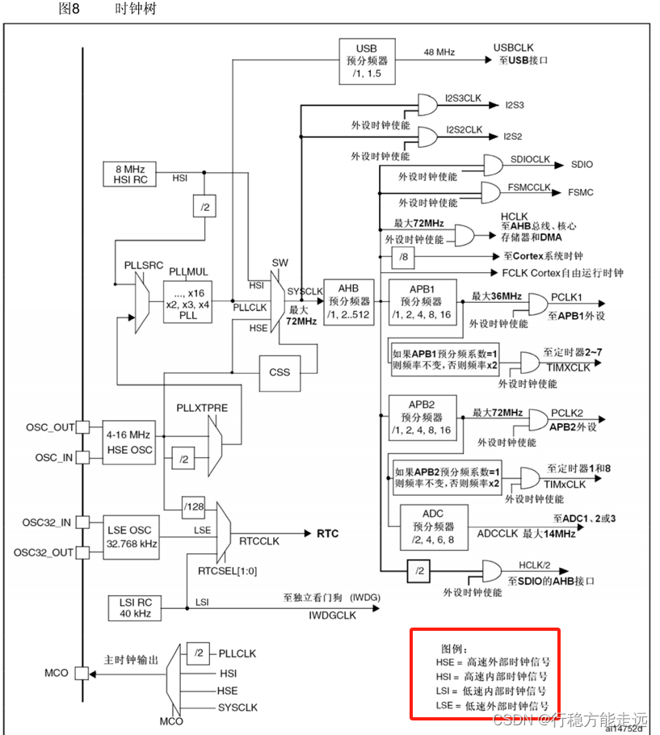


接下来我们来看一下这个rtc的框图，先整体上划分一下，左边这一块是核心的分频和计数计时部分，右边这一块是中断输出使能和NVIC部分，上面这一块是APB1总线读写部分，下面这块是PWR关联的部分，意思就是RTC的闹钟可以唤醒设备，退出待机模式，然后在图中我们看到有灰色填充的部分，都处于后备区域，这些电路在主电源掉电后，可以使用备用电池维持工作，另外这里还写了，这些模块在待机时都会继续维持供电，其他未被填充的部分就是待机时不供电，有关睡眠停机待机在低功耗相关的内容，我们下节学pwr的时候再来细讲。

然后我们依次详细看一下，首先看分频和计数器计数部分，这一块的输入时钟是RTCCLK，这刚才说过RTCCLK的来源需要在RCC里进行配置，可以选择的选项是这三个，我们主要选择中间一路，那因为这三路时钟频率各不相同，而且都远大于我们所需要的1Hz的秒计数频率，所以RTCCLK进来，首先需要经过RTC预分频器进行分频，这个分频器由两个计算器组成，上面这个是重装载寄存器RTC\_PRL，下面这个RTC\_DIV手册里叫做余数寄存器，但实际上这一块跟我们之前定时器时机单元里的计数器CNT和重装值ARR是一样的，可能是右边已经有一个计数器cnt了，所以这个名字就比较奇怪，叫做余数寄存器，但实际上它还是计数器的作用，分频器其实就是一个计数器，记几个数溢出一次就几分频，所以对于可编程的分频器来说，需要有两个寄存器，一个寄存器用来不断的计数，另一个寄存器我们写入一个计数目标值，用来配置是几分频，那在这里上面这个PRL就是计数目标，我们写入六那就是七分频，写九那就是十分频，因为计数指包含了零，然后下面这个DIV就是每来一个时钟计一个数的用途了，当然这个DIV计数器啊是一个自减计数器，每来一个输入时钟，DIV的值自减一次，自减到0时再来一个输入时钟，DIV输出一个脉冲产生溢出信号，同时DIV从PRL获取重装值，回到重装值继续自减。

然后看一下计数计时部分，这一块就比较简单了，32位可编程计数器，RTC\_CNT就是计时最核心的部分，我们可以把这个计数器看作是Unix时间戳的秒计数器，这样借助time.h的函数，就可以很方便地得到年月日时分秒了，然后在下面这里，这个RTC还设计的有一个闹钟寄存器RTC\_ALR，这个ALR也是一个32位的寄存器，和上面这个cnt是等宽的，它的作用顾名思义就是设置闹钟，我们可以在ALR写一个秒数设定闹钟，当cnt的值跟ALR设定的闹钟值一样时，也是这里画了等号啊，如果他俩值相等就代表闹钟响了，这时就会产生RTC\_Alarm闹钟信号，通往右边的中断系统，在中断函数里你可以执行相应的操作，同时这个闹钟还兼具一个功能，就下面这里的闹钟信号，可以让STM32退出待机模式，这个就可以对应一些用途，比如你设计一个数据采集设备，需要在环境非常恶劣的地方工作，比如海底高原深井这些地方，然后要求是每天中午12点采集一次环境数据，其他时间为了节省电量避免频繁换电池，芯片都必须处于待机模式，这样的话我们就可以用这个rtc自带的闹钟功能，定一个中午12点的闹钟，闹钟一响芯片唤醒采集数据完成后继续待机，另外这个闹钟值是一个定值，只能响一次，所以如果你想实现周期性的闹钟，大家每次闹钟响之后都需要再重新设置一下下一个闹钟时间，就是这个闹钟和闹钟唤醒的一个用途。

那继续往右看，这是中断部分的，在左边这里有三个信号可以触发中断，第一个是RTC\_Second秒中断，它的来源就是cnt的输入时钟，如果开启这个中断，那么程序就会每秒进一次rtc中断，第二个是RTC\_Overflow溢出中断，它的来源是cnt的右边，意思就是cnt的32位计数器计满溢出来了，会触发一次中断，所以这个中段一般不会触发，我们上一节说过，这个cnt定义的是无符号数，到2106年才会溢出，所以这个中段在2106年会触发一次，如果你想程序更完善一些，可以开启这个中段，到2106年就是一溢出，为了避免不必要的错误，你可以让芯片罢工，然后提示当前设备过老，请及时更换，但在2106年之后这个stm32的rtc就不太好用了，到时候或许可以通过打补丁的方式继续运行，或者直接淘汰32位的时间戳，这个问题就留给后人解决吧。

来继续看下面第三个RTC\_Alarm闹钟中断，刚才说过，当计数器和闹钟值相等时触发中断，同时闹钟信号可以把设备从待机模式唤醒，这是这三个中断信号，中断信号到右边这里，这一块就是中断标志位和中段输出控制，这些f结尾的是对应的中断标志位，ie结尾（Interrupt ENABLE）的是中断使能，最后三个信号通过一个或门汇聚到NVIC中断控制器，这个地方是不是漏画了一根线，中间这个应该也是要通过或门的，好这是右边的中断部分，然后上面这部分APB1总线和APB1接口，就是我们程序读写寄存器的地方，读写计算器可以通过APB1总线来完成，另外也可以看出，RTC是APB1总线上的设备，最后下面这一块退出待机模式，还有一个wake up引脚，闹钟信号和wake up引脚都可以唤醒设备，wake up引脚可以看一下接线图，就这里PA0的位置它兼具唤醒的功能，这个我们下一节再学习。

RTC基本结构：  


接下来看一下我这里给的基本结构，再总结一下，rtc的核心部分如图所示，最左边是RTCCLK时钟来源，这块需要在RCC里配置，三个时钟选择一个当做RTCCLK，之后RTCCLK先通过预分频器对时钟进行分频，余数寄存器是一个自减计数器，存储当前的计数值，重装寄存器是计数目标，决定分频值，分频之后得到1Hz的秒计数信号通向32位计数器，一秒自增一次，下面还有个32位的闹钟值，可以设定闹钟，如果不需要闹钟的话，下面这一块可以不用管，然后右边有三个信号可以触发中断，分别是秒信号、计数器溢出信号和闹钟信号，三个信号先通过中断输出控制进行中断使能，使能的中断才能通向NVIC，然后向cpu申请中断，在程序中我们配置这个数据选择器，可以选择时钟来源，配置重装寄存器可以选择分频系数，配置32位计数器可以进行日期时间的读写，需要闹钟的话，配置32位闹钟值即可，需要中断的话，先允许中断，再配置nvic，最后写对应的中断函数即可，这是RTC外设的主要内容。


为了配合stm32 ，rtc外部还是需要有一些电路的，在最小系统电路上，外部电路还要额外加两部分，第一部分就是备用电池，第二部分就是外部低速晶振，首先备用电池供电部分，我这里给了两个参考电路，第一个是简单连接，就使用一个3v的电池，负极和系统工地，正极直接接到stm32 的VBAT引脚，这样就行了，这个供电方案非常简单，参考来源是stm32的数据手册，在5.1.6供电方案这里就给出来这个图，图上画的就是直接建一个1.8~3.6v的电池到VBAT就行了，另外也可以看到，在内部是有一个供电开关的，当vdd有电时，开关拨到下面，后备电路由vdd供电，当vdd没电时，开关拨到上面，后备电路由VBAT供电，然后vbat供电的设备，在这里写了，vbat供电的后备电路有32KHz振荡器、rtc、唤醒电路和后备寄存器，那这就是根据数据手册里设计的VBAT供电方案，这个设计非常简单一般来说也没问题，然后我这里还给了第二种方案是推荐连接，这种连接方法是电池通过二极管D1向VBAT供电，另外主电源的3.3V，也通过二极管D2向VBAT供电，最后VBAT再加一个0.1uf的电源滤波电容，这个供电方案的参考来源是stm32的参考手册，在这个4.1.2电池备份区域这一节有这样描述，大家可以都看看，其中手册里有几个建议，一个是在这些这些情况下，电流可能通过vdd和vbat之间的内部二极管注入到vbat，如果与vbat连接的电源或者电池，不能承受这样的注入电流，强烈建议在外部，vbat和电源之间连接一个低压降的二极管，另一个是如果在应用中没有外部电池，建议vbat在外部连接到vdd，并连接一个100nf的陶瓷滤波电容，所以综合这两条建议，我们可以设计出右边的推荐连接，电池和主电源都加一个二极管，防止电流倒灌，vbat加一个0.1uf的电源滤波电容，0.1uf就是100nf，如果没有备用电池，就3.3V的主电源供电，如果接了备用电池，3.3v没电时，就是备用电池供电，这是根据参考手册设计的推荐电路，如果你只是进行实验，那使用左边的简单连接就行了，如果你要画板子设计产品，那还是推荐使用右边的连接，这样更保险，这是vbat供电部分。

然后继续看一下右边的外部低速晶振部分，这是一个典型的晶振电路了，这里X1是一个32.768KHz的rtc晶振，这个晶振不分正负极，两端分别接在osc32 这两个引脚上，然后进这两端再分别接一个启动电容到GND，这个电路的设计，参考来源还是stm32的数据手册，在5.3.6外部时钟源特性这里有参考电路，使用一个晶体或陶瓷谐振器产生的低速外部时钟，下面这里就是典型电路，晶振是32.768KHz，CL1和CL2上面这里写了，对于CL1和CL2，建议使用高质量的5pF~15pF之间的瓷介电容器，所以对于硬件电路的设计，但还是得多看看手册，手册看多了自然就会了，所以在这里我给出的晶振电路是这样的，起振电容给的是10pF。

最后看一下右边的图片，这个备用电池，我们一般可以选择这样的3v纽扣电池，型号是CR2032，这是一个非常常用的纽扣电池型号，另外注意这个纽扣电池印制的这一面是正极，这里也有个正号标注，另一面比较小的那个电极是负极，然后32.768KHz的晶振，我们可以选择这样的一个金属壳柱状体的晶振，这个晶振也是比较常见，大家拆开钟表电子表基本上都能找到这样一个元件，这是32.768KHz的晶振，晶振的全称是石英晶体振荡器，所以我们常说的石英钟，名称就来源于这样一个元件，然后下面这个是我们的最小系统板，这个板子自带的有rtc晶振电路，这里这个黑色的元件写的有32.768k，这个也是一种样式的RTC晶振，然后旁边这个金属壳柱状体是8MHz的外部高速晶振，不过我们这个板子没有自带备用电池，vbat引脚直接通过右上角的这个端口引出来了，如果需要备用电池的话，可以接在这里，以上就是RTC的硬件电路部分。


最后我们再看一些RTC的一些操作注意事项，这些注意事项都是从手册里复制过来的文字，写程序的时候需要注意这些问题。

设置RCC\_APB1ENR的PWREN和BKPEN，使能PWR和BKP时钟，设置PWR\_CR的DBP，使能对BKP和RTC的访问。  
这几条就提醒一下，正常的外设第一步开启时钟就能用了，但是BKP和RTC这两个外设，开启稍微复杂一些，如果你要使用BKP或者RTC，都要先执行这两步，第一步开启PWR和BKP的时钟，第二步使用PWR使能BKP和RTC的访问，这个我们在初始化的时候需要注意一下，按照这个流程来就行了。

若在读取RTC寄存器时，RTC的APB1接口曾经处于禁止状态，则软件首先必须等待RTC\_CRL寄存器中的RSF位（寄存器同步标志）被硬件置1，这一步对应代码里的一个库函数就是RTC等待同步，一般在刚上电的时候调用一下这个函数就行了，为什么要有这一步呢，可以看看框图，在这里会有两个时钟，PCLK1和RTCCLK，PCLK1在主电源掉电时会停止，所以为了保证RTC主电源掉电正常工作，RTC里的寄存器，都是在RTCCLK的同步下变更的，当我们用PCLK驱动的总线去读取RTCCLK驱动的寄存器时，就会有个时钟不同步的问题，RTC寄存器只有在RTCCLK的上升沿更新，但是PCLK1的频率36MHz远大于RTCCLK的频率32KHz，如果我们在APB1刚开启时，就立刻读取RTC寄存器，有可能RTC寄存器还没有更新到APB1总线上，这样我们读到的值就是错误的，通常来说就读取到0，所以这就要求我们在APB1总线刚开机时，要等一下RTCCLK，只要RTCCLK来一个上升沿，rtc把它的寄存器的值同步到APB1总线上，这样之后读取的值就都是没问题的了，这是设计细节的一个问题，当然我们其实也不用管那么多了，只需要在初始化时调用一个等待同步的函数就行了。

必须设置RTC\_CRL寄存器中的CNF位，使RTC进入配置模式后，才能写入RTC\_PRL、RTC\_CNT、RTC\_ALR寄存器，这一条其实比较简单，就是RTC会有一个进入配置模式的标志位，把这一位置1才能设置时间，其实这个操作在库函数中，每个写寄存器的函数，它都自动帮我们加上了这个操作，所以我们就不用再单独调用函数进入配置模式了。

对RTC任何寄存器的写操作，都必须在前一次写操作结束后进行。可以通过查询RTC\_CR寄存器中的RTOFF状态位，判断RTC寄存器是否处于更新中。仅当RTOFF状态位是1时，才可以写入RTC寄存器，这个操作也是调用一个等待的函数就行了，跟我们之前读写flash芯片是类似的，就写入之前要等待一下，如果上一次的写入还没完成，你就别急着写下一次了，或者说每次写入之后，你要等待RTOFF为1，只有RTOFF为1才表示写完成，为什么要有这个操作呢，其实还是因为这里的PCLK1和RTCCLK时钟频率不一样，你用PCLK1的频率写入之后，这个值还不能立刻更新到RTC的寄存器里，因为RTC寄存器是由RTCCLK驱动的，所以PCLK1写完之后，得等一下RTCCLK的时钟，RTCCLK来个上升沿，值更新到RTC寄存器里，整个写作过程才算结束了，这个操作了解一下，在代码里也就是调用一个等待函数的事。

**手册：**


### 代码示例：读写备份寄存器BKP

读写备份寄存器接线图：


常用库函数：

```c
void BKP_DeInit(void); // 恢复缺省配置，将所有配置清0  纽扣电池一直有电后不会自动清0的
// 用于Tamper侵入检测功能
void BKP_TamperPinLevelConfig(uint16_t BKP_TamperPinLevel); // 侵入检测功能 配置有效电平高电平、低电平触发
void BKP_TamperPinCmd(FunctionalState NewState);            // 是否开启侵入检测功能
void BKP_ITConfig(FunctionalState NewState);                // 配置中断
void BKP_RTCOutputConfig(uint16_t BKP_RTCOutputSource);     // 时钟输出功能的配置 可以选择在RTC引脚上输出时钟信号  输出RTC校准时钟RTC闹钟脉冲或者秒脉冲
void BKP_SetRTCCalibrationValue(uint8_t CalibrationValue);  // 设置RTC校准值(写入RTC校准寄存器)

// 读写BKP
void BKP_WriteBackupRegister(uint16_t BKP_DR, uint16_t Data);
uint16_t BKP_ReadBackupRegister(uint16_t BKP_DR);
FlagStatus BKP_GetFlagStatus(void);
void BKP_ClearFlag(void);
ITStatus BKP_GetITStatus(void);
void BKP_ClearITPendingBit(void);

```

```c
void PWR_DeInit(void);
void PWR_BackupAccessCmd(FunctionalState NewState); //备份寄存器访问使能  前面讲的设置PWR_CR的DBP，使能对BKP和RTC的访问
void PWR_PVDCmd(FunctionalState NewState);
void PWR_PVDLevelConfig(uint32_t PWR_PVDLevel);
void PWR_WakeUpPinCmd(FunctionalState NewState);
void PWR_EnterSTOPMode(uint32_t PWR_Regulator, uint8_t PWR_STOPEntry);
void PWR_EnterSTANDBYMode(void);
FlagStatus PWR_GetFlagStatus(uint32_t PWR_FLAG);
void PWR_ClearFlag(uint32_t PWR_FLAG);

```

代码：  
main.c

```c
#include "stm32f10x.h"                 // Device header
#include "Delay.h"
#include "OLED.h"
#include "Key.h"
uint16_t Write[] = {0x1234, 0x5678};
uint16_t Read[2];
uint8_t KeyNum;
int main(void)
{
    OLED_Init();
    KEY_Init();
    OLED_ShowString(1, 1, "W:");
    OLED_ShowString(2, 1, "R:");
    // BKP初始化
    RCC_APB1PeriphClockCmd(RCC_APB1Periph_PWR, ENABLE);
    RCC_APB1PeriphClockCmd(RCC_APB1Periph_BKP, ENABLE);
    // 备份寄存器访问使能
    PWR_BackupAccessCmd(ENABLE);
    while (1)
    {
        KeyNum = Key_GetNum();
        if (KeyNum == 1)
        {
            BKP_WriteBackupRegister(BKP_DR1, Write[0]); // DR 1-10 c8t6
            BKP_WriteBackupRegister(BKP_DR2, Write[1]);
            Write[0]++;
            Write[1]++;
            OLED_ShowHexNum(1, 3, Write[0], 4);
            OLED_ShowHexNum(2, 3, Write[0], 4);
        }
        Read[0] = BKP_ReadBackupRegister(BKP_DR1);
        Read[1] = BKP_ReadBackupRegister(BKP_DR2);
        OLED_ShowHexNum(1, 3, Read[0], 4);
        OLED_ShowHexNum(2, 3, Read[1], 4);
    }
}

```

### 11.2 RTC实时时钟

实时时钟接线图：  


RTC这个程序我们暂时没用到按键，然后RTC的外部低速晶振上小节说过，晶振电路板上自带的就有，所以RTC晶振部分我们接线就不用管了。

常用函数：

```c
void RCC_LSEConfig(uint8_t RCC_LSE);              // 启动LSE时钟
void RCC_LSICmd(FunctionalState NewState);        // 配置LSI内部低速时钟
void RCC_RTCCLKConfig(uint32_t RCC_RTCCLKSource); // CLK时钟源数据选择器
void RCC_RTCCLKCmd(FunctionalState NewState);     // 启动RCCCLK
void RCC_GetClocksFreq(RCC_ClocksTypeDef *RCC_Clocks);
void RCC_AHBPeriphClockCmd(uint32_t RCC_AHBPeriph, FunctionalState
                                                       NewState);
void RCC_APB2PeriphClockCmd(uint32_t RCC_APB2Periph, FunctionalState
                                                         NewState);
void RCC_APB1PeriphClockCmd(uint32_t RCC_APB1Periph, FunctionalState
                                                         NewState);
FlagStatus RCC_GetFlagStatus(uint8_t RCC_FLAG); // 获取标志位（LSE时钟不是调用完就立马启动的）


```

```c
void RTC_ITConfig(uint16_t RTC_IT, FunctionalState NewState); // RTC中断
void RTC_EnterConfigMode(void);                               // 进入配置模式 前面讲的必须设置RTC_CRL寄存器中的CNF位，使RTC进入配置模式后，才能写入RTC_PRL、RTC_CNT、RTC_ALR寄存器
RTC_CRL_CNF = 1 void RTC_ExitConfigMode(void);                // 退出配置模式
uint32_t RTC_GetCounter(void);                                // 获取CNT计数器的值
void RTC_SetCounter(uint32_t CounterValue);                   // 写入CNT计数器的值设置时间
void RTC_SetPrescaler(uint32_t PrescalerValue);               // PSC 预分频器分频系数
void RTC_SetAlarm(uint32_t AlarmValue);                       // 闹钟值
uint32_t RTC_GetDivider(void);                                // 读取余数寄存器 为了得到更细致的时间，因为CNT计数间隔最短就是1S,分秒、毫秒要用到
void RTC_WaitForLastTask(void);                               // 等待上一次操作完成(前面讲的等待RTOFF状态为1)
void RTC_WaitForSynchro(void);                                // 等待同步(前面讲的等待RSF标志位置1)
FlagStatus RTC_GetFlagStatus(uint16_t RTC_FLAG);
void RTC_ClearFlag(uint16_t RTC_FLAG);
ITStatus RTC_GetITStatus(uint16_t RTC_IT);
void RTC_ClearITPendingBit(uint16_t RTC_IT);

```

代码：  
main.c

```c
#include "stm32f10x.h"                  // Device header
#include "Delay.h"
#include "OLED.h"
#include "MyRTC.h"

int main(void)
{
	/*模块初始化*/
	OLED_Init();		//OLED初始化
	MyRTC_Init();		//RTC初始化
	
	/*显示静态字符串*/
	OLED_ShowString(1, 1, "Date:XXXX-XX-XX");
	OLED_ShowString(2, 1, "Time:XX:XX:XX");
	OLED_ShowString(3, 1, "CNT :");
	OLED_ShowString(4, 1, "DIV :");
	
	while (1)
	{
		MyRTC_ReadTime();							//RTC读取时间，最新的时间存储到MyRTC_Time数组中
		
		OLED_ShowNum(1, 6, MyRTC_Time[0], 4);		//显示MyRTC_Time数组中的时间值，年
		OLED_ShowNum(1, 11, MyRTC_Time[1], 2);		//月
		OLED_ShowNum(1, 14, MyRTC_Time[2], 2);		//日
		OLED_ShowNum(2, 6, MyRTC_Time[3], 2);		//时
		OLED_ShowNum(2, 9, MyRTC_Time[4], 2);		//分
		OLED_ShowNum(2, 12, MyRTC_Time[5], 2);		//秒
		
		OLED_ShowNum(3, 6, RTC_GetCounter(), 10);	//显示32位的秒计数器CNT值
		OLED_ShowNum(4, 6, RTC_GetDivider(), 10);	//显示余数寄存器
	}
}

```

MyRTC.h

```c
#ifndef __MYRTC_H
#define __MYRTC_H

extern uint16_t MyRTC_Time[];

void MyRTC_Init(void);
void MyRTC_SetTime(void);
void MyRTC_ReadTime(void);

#endif

```

MyRTC.c

```c
#include "stm32f10x.h"                  // Device header
#include <time.h>

uint16_t MyRTC_Time[] = {2023, 1, 1, 23, 59, 55};	//定义全局的时间数组，数组内容分别为年、月、日、时、分、秒  刷新到RTC外设里
//注意数组里这些数据前面不要补0，C语言会默认为八进制  if(123 == 0123)这就不成立

void MyRTC_SetTime(void);				//函数声明

/**
  * 函    数：RTC初始化
  * 参    数：无
  * 返 回 值：无
  */
void MyRTC_Init(void)
{
	/*开启时钟*/
	RCC_APB1PeriphClockCmd(RCC_APB1Periph_PWR, ENABLE);		//开启PWR的时钟
	RCC_APB1PeriphClockCmd(RCC_APB1Periph_BKP, ENABLE);		//开启BKP的时钟
	
	/*备份寄存器访问使能*/
	PWR_BackupAccessCmd(ENABLE);							//使用PWR开启对备份寄存器的访问
	
	if (BKP_ReadBackupRegister(BKP_DR1) != 0xA5A5)			//通过写入备份寄存器的标志位，判断RTC是否是第一次配置   不然每次复位，时间都会重置
															//if成立则执行第一次的RTC配置
	{
		RCC_LSEConfig(RCC_LSE_ON);							//开启LSE时钟(默认是关闭的，省电)  这里有个可选参数：LSE_Bypass表示LSE时钟旁路，时钟旁路的意思就是不要接晶振，直接从OSE32_IN这个引脚输入一个指定频率的信号，这样也可以当做时钟源，比较方便，不过用的不多
		while (RCC_GetFlagStatus(RCC_FLAG_LSERDY) != SET);	//等待LSE振荡器时钟启动完成
		//我实测有些板子是有问题就是RTC晶振启动不了，不起振,这个程序就会卡死在这个位置
		//一直等待LSERDY标志位,解决方案：时钟源改为备选内部晶振LSI
		RCC_RTCCLKConfig(RCC_RTCCLKSource_LSE);				//选择RTCCLK时钟来源为LSE
		RCC_RTCCLKCmd(ENABLE);								//RTCCLK使能
		//因为这个RTC比较简单，所以库函数并没有使用结构体来配置，开启时钟就能自动运行了
		
		RTC_WaitForSynchro();								//等待同步	防止时钟不同步造成bug
		RTC_WaitForLastTask();								//等待上一次操作完成
		
		RTC_SetPrescaler(32768 - 1);						//设置RTC预分频器，预分频后的计数频率为1Hz,LSE的频率是32.768KHz
		RTC_WaitForLastTask();								//等待上一次操作完成
	
		//RTC_SetCounter(1672588795);
		//RTC_WaitForLastTask();
		MyRTC_SetTime();									//设置时间，调用此函数，全局数组里时间值刷新到RTC硬件电路
		
		BKP_WriteBackupRegister(BKP_DR1, 0xA5A5);			//在备份寄存器写入自己规定的标志位，用于判断RTC是不是第一次执行配置
	}
	else													//RTC不是第一次配置
	{
		RTC_WaitForSynchro();								//等待同步
		RTC_WaitForLastTask();								//等待上一次操作完成
	}
}

//如果LSE无法起振导致程序卡死在初始化函数中
//可将初始化函数替换为下述代码，使用LSI当作RTCCLK
//LSI无法由备用电源供电，故主电源掉电时，RTC走时会暂停
/* 
void MyRTC_Init(void)
{
	RCC_APB1PeriphClockCmd(RCC_APB1Periph_PWR, ENABLE);
	RCC_APB1PeriphClockCmd(RCC_APB1Periph_BKP, ENABLE);
	
	PWR_BackupAccessCmd(ENABLE);
	
	if (BKP_ReadBackupRegister(BKP_DR1) != 0xA5A5)
	{
		RCC_LSICmd(ENABLE);
		while (RCC_GetFlagStatus(RCC_FLAG_LSIRDY) != SET);
		
		RCC_RTCCLKConfig(RCC_RTCCLKSource_LSI);
		RCC_RTCCLKCmd(ENABLE);
		
		RTC_WaitForSynchro();
		RTC_WaitForLastTask();
		
		RTC_SetPrescaler(40000 - 1);
		RTC_WaitForLastTask();
		
		MyRTC_SetTime();
		
		BKP_WriteBackupRegister(BKP_DR1, 0xA5A5);
	}
	else
	{
		RCC_LSICmd(ENABLE);				//即使不是第一次配置，也需要再次开启LSI时钟
		while (RCC_GetFlagStatus(RCC_FLAG_LSIRDY) != SET);
		
		RCC_RTCCLKConfig(RCC_RTCCLKSource_LSI);
		RCC_RTCCLKCmd(ENABLE);
		
		RTC_WaitForSynchro();
		RTC_WaitForLastTask();
	}
}*/

/**
  * 函    数：RTC设置时间
  * 参    数：无
  * 返 回 值：无
  * 说    明：调用此函数后，全局数组里时间值将刷新到RTC硬件电路
  */
void MyRTC_SetTime(void)
{
	time_t time_cnt;		//定义秒计数器数据类型
	struct tm time_date;	//定义日期时间数据类型
	
	time_date.tm_year = MyRTC_Time[0] - 1900;		//将数组的时间赋值给日期时间结构体
	time_date.tm_mon = MyRTC_Time[1] - 1;
	time_date.tm_mday = MyRTC_Time[2];
	time_date.tm_hour = MyRTC_Time[3];
	time_date.tm_min = MyRTC_Time[4];
	time_date.tm_sec = MyRTC_Time[5];
	
	time_cnt = mktime(&time_date) - 8 * 60 * 60;	//调用mktime函数，将日期时间转换为秒计数器格式
													//- 8 * 60 * 60为东八区的时区调整
	
	RTC_SetCounter(time_cnt);						//将秒计数器写入到RTC的CNT中
	RTC_WaitForLastTask();							//等待上一次操作完成
}

/**
  * 函    数：RTC读取时间
  * 参    数：无
  * 返 回 值：无
  * 说    明：调用此函数后，RTC硬件电路里时间值将刷新到全局数组
  */
void MyRTC_ReadTime(void)
{
	time_t time_cnt;		//定义秒计数器数据类型
	struct tm time_date;	//定义日期时间数据类型
	
	time_cnt = RTC_GetCounter() + 8 * 60 * 60;		//读取RTC的CNT，获取当前的秒计数器
													//+ 8 * 60 * 60为东八区的时区调整
	
	time_date = *localtime(&time_cnt);				//使用localtime函数，将秒计数器转换为日期时间格式
	
	MyRTC_Time[0] = time_date.tm_year + 1900;		//将日期时间结构体赋值给数组的时间
	MyRTC_Time[1] = time_date.tm_mon + 1;
	MyRTC_Time[2] = time_date.tm_mday;
	MyRTC_Time[3] = time_date.tm_hour;
	MyRTC_Time[4] = time_date.tm_min;
	MyRTC_Time[5] = time_date.tm_sec;
}

```


最后一个DIV正在快速的自减，自减的范围是32767~0，DIV每自减一轮，CNT秒数加1，有了这个数我们就可以对秒数进行更细的划分，获取分秒厘秒毫秒这些参数了。

## PWR电源控制

**实验现象**  
1、修改主频  
修改主频不属于三种低功耗模式，但是也是降低STM32功耗的一种方法。


2、睡眠模式+串口发送+接收

睡眠模式加串口的发送和接收，这个程序就是从串口那一节直接复制过来的，这个代码的功能就是当收到一个字节时，中断触发，置标志位，主循环查询到标志位时读取数据，并用串口发送数据，在这个功能后面，又新加了一段代码，这个就是用来配置睡眠模式的代码，执行芯片就进入睡眠，睡眠的目的是，如果STM32一直没收到数据，那这个主循环也会一直查询标志位，那不如就让它睡眠，收到数据后自动退出睡眠模式，执行一遍任务后继续睡眠，这样在空闲时芯片一直在睡眠，可以降低系统功耗。  
另外还要重点提醒一下，芯片在三种低功耗模式下，是没法直接下载程序的，如果直接点下载，就会提示报错，不会理你调试端口了，解决方法也很简单，需要我们有一些操作，第一步我们按住复位键不放，第二步点下载按钮，第三步及时松开复位键，这样就能下载成功了，在我们本节三种低功耗模式下，都需要这样下载程序，大家注意一下，另外如果你不小心禁用了调试端口，其实也可以这样来解决。

只有在我们发送数据时刻，OLED才会显示一次running，在空闲时芯片一直都在睡眠，这样就是在不影响程序功能的前提下，使用睡眠模式节约电量。  


3、停止模式+对射式红外传感器计次

每次遮挡一次，执行一次记次，也显示一下running，在没有外部中断信号时，STM32处于停止模式，可以省电。  


4、待机模式+实时时钟

这个程序是在实时时钟的基础上，加入了待机模式，目前这个程序我使用的是LSE外部低速时钟，如果你没有RTC晶振或者RTC晶振不起振，也可以使用LSI内部低速时钟，LSI在待机模式下可以继续工作，然后在这个位置可以加入唤醒后要执行的功能，在进入待机模式之前，可以关闭各个外部连接的模块，以最大化省电，我目前是用Oled\_Clear模拟了一下，那这个程序会用实时时钟设定闹钟，每隔一段时间会自动唤醒一次，这里我演示的是每隔十秒唤醒一次，唤醒之后执行一遍程序任务，然后继续待机。

可以看到OLED上显示了当前时钟和闹钟，随后进入待机，然后等一会儿，闹钟触发之后自动唤醒一次，设定新的那种执行程序功能之后继续待机，等待下一次唤醒，这是使用RTC和闹钟配合待机模式的自动唤醒程序，非常适合那种需要每隔一段时间操作一次，空闲时间又需要最大化省电的设备。


### 12.1 PWR简介

  
可编程电压监测器（PVD）可以监控VDD电源电压，当VDD下降到PVD阀值以下或上升到PVD阀值之上时，PVD会触发中断，用于执行紧急关闭任务。这个功能预想的场景应该是使用电池供电，或者对安全要求比较高的设备，如果供电电压在逐渐下降  
，在电压过低的情况下，可能会导致内部或外部电路发生不确定的错误，为了避免不确定的因素，在电源电压低于设定的阈值时，我们可以主动出击，提前发出警告，并且关闭比较危险的设备，这是这个PVD的设计，不过PVD这个功能不是我们本节课的重点哈，我们暂时也不演示代码。

在低功耗模式下，我们也需要保留必要的唤醒电路，比如串口接收数据的中断唤醒，外部中断唤醒，RTC闹钟唤醒等，在需要设备工作时，STM32能够立刻重新投入工作，如果你只考虑进入低功耗，而不考虑唤醒STM32，那不就跟直接断电没区别了吗，所以低功耗模式我们要考虑关闭哪些硬件，保留哪些硬件以及如何去唤醒，当然关闭越多的硬件设备越省电，唤醒就越麻烦。

电源框图：


这个图就是STM32内部的供电方案，整体上看这个图可以分为三个部分，最上面是模拟部分供电叫做VDDA，中间是数字部分供电，包括两块区域，VDD供电区域和1.8v供电区域，下面是后备供电，叫做VBAT。

依次看一下，VADDA供电区域，主要负责模拟部分的供电，其中包括AD转换器、温度传感器、复位模块、PLL锁相环，这些电路的供电正极是VDDA，负极是VSSA，其中AD转换器还有两个参考电压的供电脚，叫做VREF+和VREF-，这两个脚在引脚多的型号里会单独引出来，在引脚少的型号，比如我们这个C8T6，VREF+和VREF-在内部就已经分别接到了VDDA和VSSA了。

然后看中间部分的供电，这一块由两部分组成，左边部分是VDD供电区域，其中包括IO电路、待机电路、唤醒逻辑和独立看门狗，右边部分是VDD通过电压调节器降压到1.8V，提供给后面这一块的1.8V供电区域，1.8V区域包括CPU核心、存储器和内置数字外设，可以看出来STM32内部的大部分关键电路，CPU、存储器和外设其实都是以1.8V的低电压运行的，当这些外设需要与外界进行交流时，才会通过IO电路转换到3.3V，所以我们从外部看，好像STM32内部全是3.3V，但实际上它内部的CPU、外设等都是以1.8V供电运行，使用低电压运行的主要目的是降低功耗，电压越低内部电路运行的功耗就相对越低。

然后这个电压调节器，它的作用是给1.8V区供电，因为我们后面会提到这个1.8V区域和电压调节器，最下面就是我们上一节提到的VBAT后备供电区域了，其中包括LSE 32K晶体振荡器、后备寄存器，RCC BDCR计寄存器和RTC，RCC BDCR是RTC的寄存器啊，叫做备份域控制寄存器，也是和后备区域有关的寄存器，所以也可以有VBAT供电，然后这里有个低电压检测器，可以控制这个开关，VDD有电时由VDD供电，VDD没电时由VBAT供电。

上电复位和掉电复位：  
  
上电复位和掉电复位，还有可编程电压监测器这，两个内容了解即可，首先是上电复位和掉电复位，这个意思是当VDD或者VDDA电压过低时，内部电路直接产生复位，让STM32复位住不要乱操作，这个复位和不复位的界限之间，设置了一个40毫伏的迟滞电压，大于上限POR(Power On Reset)时解除复位，小于下限PDR(Power Down Reset)时复位，这是一个典型的迟滞比较器，设置两个阈值的作用，就是防止电压在某个阈值附近波动时，造成输出也来回抖动，下面的复位信号reset是低电平有效的  
，所以在前面和后面电压过低时是复位的，中间电压正常的时候不复位，那这个电压上限和下限具体是多少伏呢，还有这里解除复位，还有个滞后时间是多久呢，这些参数可以看一下STM32数据手册，在5.3.3内嵌复位和电源控制模块特性里有这个表，这里写了上电或掉电复位阈值，下降沿，也就是PDR掉电复位的阈值下限，典型值是1.88V,上升沿，也就是POR上电复位的阈值上限，典型值是1.92V，1.92-1.88就是迟滞的阈值40毫伏，所以如果忽略迟滞的话，简单来说就是大于1.9V上电，低于1.9V掉电，然后最后一行就是TRSTTEMPO，复位持续时间，典型值是2.5ms，就是这个上电复位和掉电复位，知道一下就行了，也不需要我们操作啥的。  


可编程电压监测器：  


然后下面这个是可编程电压监测器，简称PVD，他的工作流程和上面这个差不多哈都是监测VDD和，VDDA的供电电压，但是PVD的区别就是，首先它这个阈值电压是可以使用程序指定的，可以自定义调节，调节的范围可以看一下数据手册，在这个表的上面就是PVD的阈值，配置PLS寄存器的3个位可以选择右边这么多的阈值，因为这里也同样是迟滞比较，所以有两个阈值，可选范围是2.2V到2.9V左右，PVD上限和下限之间的迟滞电压是100毫伏，可以看到PVD的电压是比上电掉电复位的电压要高的，画个图就是3.3伏是正常的供电，当这个电压降低在2.9伏到2.2伏之间，属于PVD监测的范围，可以通过PVD设置一个警告线，之后再降低到1.9伏，就是复位电路的检测范围,低于1.9伏直接复位住不让动，就是这两个电压监测的工作任务，那当然PVD触发之后，芯片还是能正常工作的，只不过是电源电压过低，该提醒一下用户了，所以看一下下面这个PVD输出，这个是正逻辑哈，电压过低时为1，电压正常值为0，这个信号可申请中断，在上升沿或者下降沿时触发中断，一是提醒程序进行适当的处理，另外这个PVD的中断申请，是通过外部中断实现的，我们可以看一下外部中断这一节，这个图(EXTI基本结构图)可以看到PVD输出的信号是跑到这里来了，所以如果要使用PVD的话，记得要配置外部中断，然后下面这里还有RTC(EXTI基本结构图)，这个是RTC的闹钟信号，也有接到外部中断，其实RTC自己是有中断的，那为啥还要借到外部中断，这个等会就知道了，因为低功耗模式设计的是，只有外部中断可以唤醒停止模式，其他这些设备也想唤醒停止模式的话，都可以通过借道外部中断来实现，其实后面这两个USB和ETH，也都只有他们的wake up唤醒信号接过来了，目的也是为了唤醒停止模式，这个了解一下。


低功耗模式：  


接着我们来看看本节课的重点  
低功耗模式，这三种模式从上到下关闭的电路越来越多，对应的从上到下是越来越省电，同时从上到下也是越来越难唤醒的，首先看一下睡眠模式，这是浅睡眠，如何进入呢，这里写了直接调用WFI或者WFE即可进入，这两个东西是内核的指令，对应库函数里也有对应的函数，直接调用函数即可，其中WFI的意思是wait for interrupt等待中断，意思就是我先睡了，如果有中断发生的话再叫我起来，所以对应的唤醒条件是任意中断，调用WIFI进入的睡眠模式，任何外设发生任何中断时，芯片都会立刻醒来，因为中断发生了，醒来之后的第一件事一般就是处理中断函数，然后下面WFE意思是wait for event等待事件，对应的唤醒条件是唤醒事件，这个事件可以是外部中断配置为事件模式，也可以是使能了中断，但是没有配置NVIC，调用WFE进入的睡眠模式，产生唤醒事件时会立刻醒来，醒来之后一般不需要进中断函数，直接从睡的地方继续运行，这是WFI和WFE的作用，相同点是调用任意一个之后，芯片都进入睡眠，不同点是WFI进入的得用中断唤醒，WFE进入的得用事件唤醒，最后看一下睡眠模式对电路的影响，对1.8V区域时钟的影响是，CPU时钟关，对其他时钟和ADC时钟无影响，对VDD区域时钟的影响是无，对电压调节器的操作是开，所以睡眠模式对电路的影响就是，只把CPU时钟关了，对其他电路没有任何操作，CPU时钟关了，程序就会暂停，不会继续运行了，CPU不运行芯片功耗就会降低，另外这里还可以看出，关闭电路通常有两个做法，一个是关闭时钟，另一个是关闭电源，关闭时钟，所有的运算和涉及时序的操作都会暂停，但是寄存器和存储器里面保存的数据还可以维持不会消失，关闭电源就是电路直接断电，电路的操作和数据都会直接丢失，所以关闭电源比关闭时钟更省电，这个表里的这两点，就对1.8V区域和VDD区域的时钟控制，然后这个电压调节器刚才看，它实际上就是1.8V区域的电源，如果电压调节器关，就代表直接把1.8V区域断电，这个了解一下，它唤醒条件也是比较宽松，任何的风吹草动，CPU都会醒来开始干活，所以睡眠模式相当于大佬打了个盹儿，身体还在工作，在省电程度上评级为一般省电。

然后就看第二个停机模式，如何进入停机模式呢，首先sleepdeep位设置为1，告诉CPU你可以放心的睡进入深度睡眠模式，另外PDDS这一位用来区分它是停机模式，还是下面的待机模式，PDDS等于0进入停机模式，PDDS等于1进入待机模式，之后LPDS用来设置最后这个电压调节器，是开启还是进入低功耗模式，RPDS等于0电压调节器开启，RPDS等于1电压调节器进入低功耗，最后当我们把这些位提前设置好了，最后再调用WFA或者WFE，芯片就可以进入停止模式了，然后停止模式的唤醒，因为这个模式下芯片睡得更深，关的东西更多，所以唤醒条件就苛刻一些，是任一外部中断，刚才睡眠模式是任一中断，所有外设的中断都行，现在停止模式，要求就是只有外部中断才能唤醒，其他中断唤醒不了，刚才我们还提到了，PVD、RTC闹钟、USB唤醒、ETH唤醒借道了外部中断，所以这四个信号也可以唤醒停止模式，因为这里并没有区分WFI和WFE，其实也可以想象得到，WFI要用外部中断的中断模式唤醒，WFE要用外部中断的事件模式唤醒，这是对应的，最后看停止模式对电路有哪些操作呢，首先关闭所有1.8伏区域的时钟，这意思就是不仅CPU不能运行，外设也运行不了，定时器在定时的会暂停，串口收发数据也会暂停，不过由于没关闭电源，所以CPU和外设的寄存器数据都是维持原状的，之后下一个HSI和HSE的振荡器关闭，既然CPU和外设时钟都关了，那这两个高速时钟显然也没用了,所以HSI内部高速时钟和HSE外部高速时钟会关闭，当然他没提到的，LSI内部低速时钟和LSE外部低速时钟，这两个并不会主动关闭，如果开启过这两个时钟还可以继续运行，最后电压调节器，这里可以选择是开启或者处于低功耗模式，刚才说了，这个电压调节器是由这个LPDS位控制的，这个开启和低功耗模式有啥区别呢，其实区别也不大，电压调节器无论是开启还是低功耗，都可以维持1.8伏区域寄存器和存储器的数据内容，区别就是低功耗模式更省电一些，同时低功耗模式在唤醒时要花更多的时间，相反电压调压器开启的话就是更耗电一些唤醒更快了，那这些就是停止模式的介绍，主要操作就是把运行的高速时钟都关了，CPU和外设都暂停工作，但是电压调节器并没有关，存储器和寄存器数据可以维持原样，它的唤醒条件比较苛刻，只能通过外部中断唤醒，所以停止模式相当于整个人都罢工了，脑子不工作，身体也不工作，只有有人用外部中断过来敲我,我才会醒来干活，在省电程度上为非常省电。

最后我们看第三种待机模式，进入的话和停机模式差不多，首先sleep deep也是置1即将深度睡眠，然后PDDS置1表示即将进入待机模式，最后调用WFI或者WFE就可以进入待机模式了，然后看一下唤醒条件，普通外设的中断和外部中断都无法唤醒待机模式，待机模式只有这几个指定的信号才能唤醒，第一个是wake up引脚的上升沿，wake up引脚，可以看一下引脚定义，这里PA0-WKUP指示了引脚的位置，就是PA0的位置，第二个是RTC闹钟事件，这个我们的示例代码和上一节RTC提到过，RTC闹钟可以唤醒待机模式，应用场景就是芯片每隔一段时间自动工作一次，第三个是NRST引脚上的外部复位，意思就是按一下复位键，它也是能唤醒的，最后一个IWDG独立看门狗复位，这个了解一下就行了，看门狗我们最后介绍，可以看出待机模式，只有这指定的四个信号能唤醒,其他信号都唤醒不了，唤醒条件最为苛刻，之后待机模式对电路的操作基本上是能关的全都关了，1.8伏区域的时钟关闭，两个高速时钟关闭，电压调节器关闭，这意味着1.8伏区域的电源关闭，内部的存储器和寄存器的数据全部丢失，但是和停止模式一样，它并不会主动关闭LSI和LSE两个低速时钟，因为这两个时钟还要维持RTC和独立看门狗的运行，所以不会关闭，这是待机模式的介绍，主要操作就是把能关的全都关掉，只保留几个唤醒的功能，当然配合RTC和独立看门狗的低速时钟，也可以正常工作，所以待机模式相当于这个人直接下班回家睡觉了，没有指定的这几个事，他是不会轻易回来工作的，在省电程度上，待机模式评级为极为省电。

模式选择：  


接下来我们对这里的一些细节问题，再额外补充和总结一下，首先是模式选择的问题，刚才这里的表述出现了很多寄存器的位，其中这些模式又有一些更细的划分，比如睡眠模式有SLEEP-NOW和SLEEP-ON-EXIT的区别，停机模式有电压调节器开启和处于低功耗的区别，我们如何配置才能指定某个模式呢，那看这个图就比较清晰了，当然这些寄存器，实际上库函数已经帮我们封装好了，不用我们自己配置的，但是多了解一些，对我们理解程序还是有很大帮助的，首先这里有一句,执行WFI等待中断或者WFE等待事件指令后，STM32进入低功耗模式，就说这两个指令是最终开启低功耗模式的触发条件，配置其他的寄存器都要在这两个指令之前，看下面这个图，首先一旦WFI或者WFE执行了，芯片咋知道他要进入哪种低功耗模式呢，那它就会按照这个流程来判断，首先看看sleep deep位是1还是0，如果sleep deep等于0 ，就是浅睡眠，对应的就是睡眠模式，如果sleep deep等于1，表示要进入深度睡眠模式，对应的是停机或者待机模式，停机和待机都可以叫做深度睡眠模式，在普通的睡眠模式，还有个细分的功能，通过SLEEPONEXIT位来决定，这一位等于0时，无论程序在哪里调用WFI或WFE都会立刻进入睡眠，这位等于1时执行WFI或WFE之后，它会等待中断退出，等所有中断处理完成之后再进入睡眠，这个可能考虑到中断还有一些紧急的任务，最好不要被睡眠打断了，所以先等等也无妨，当然这两个细分模式我们一般可以不用管，只要我们不在中断函数里调用WFI或WFE，那其实它们的效果是一样的，我们WFI、WFE可以放在主程序里，如果主程序执行到了，自然也代表中断处理完成了，如果你想在中断函数里调用WFI、WFE，并且想中断结束后再睡眠，才需要考虑下面这个模式，然后继续看，进入深度睡眠模式，它会继续判断PDDS这一位，如果PDDS等于0，就进入的是停机模式，如果PDDS等于1，就进入的是待机模式，在停机模式下，它会继续判断LPDS位，如果LPDS等于0，就是停机模式且电压调节器开启，如果LPDS等于1,就是停机模式且电压调节器低功耗  
电压调节器低功耗的特性就是更省电，但是唤醒延迟更高，那这些就是模式选择的一个判断流程。


> 这个事件唤醒还是有点麻烦的，你要是觉得麻烦，直接使用中断唤醒的方式也是可以的。  
> 

当一个中断或唤醒事件导致退出停止模式时，HSI被选为系统时钟，我们的程序默认在SystemInit函数里的配置，是使用的HSE外部高速时钟，通过PLL倍频得到72MHz主频，但是进入停止模式后，PLL和HSE都停止了，而现在退出停止模式时，它并不会再自动倍速时钟，通过PLL倍频得到8MHz直接作为主频，所以如果你忽略了这个问题，那么就会出现一个现象，你程序刚上电是72MHz的主频，但是进入停止模式，在唤醒之后就变成8MHz的主频了，所以我们一般在停止模式唤醒后,第一时间就是重新启动HSE，配置主频为72MHz，这个操作也不麻烦，配置的函数他都帮我们写好了，我们只需要再调用下SystemInit就行。


数据手册和参考手册：


  


  
  


### 代码示例：修改主频

接线图：修改主频


接线图：睡眠模式+串口发送+接收  
  
接线图：停止模式+对射式红外传感器计次  
  
接线图：待机模式+实时时钟  


PA0这里我引出来了一根线，这个线的意思就是，我们可以手动把PA0接到3.3V或者断开，因为PA0还有一个功能wake up，可以唤醒待机模式，wake up引脚上升沿有效，但是这个地方也不好接按键的，所以我们可以直接用一根线短接到3.3V，来手动产生一个上升沿，测试wake up引脚是不是有效果，然后实时时钟还有一个备用电源VBAT，这个接不接都行，因为我们需要在待机模式下唤醒，唤醒之后没有主电源程序运行不了，所以主电源是不能断电的，那主电源不断电，备用电源接不接就都是一样的现象了。


system\_stm32f10x.h、system\_stm32f10x.c文件是用来配置系统时钟的，也就是配置RCC时钟树，这个RCC时钟树我们可以看一下PPT(前面的RCC时钟树)，在这里这个图就是RCC时钟树的全部电路，左边是四个时钟源，HSI、HSE、LSE、LSI用于提供时钟，右边就是各个外设，就是使用时钟的地方，我们用的最多的就是AHB时钟、APB1时钟、APP2时钟,另外还有一些时钟，它们的来源不是AHB和APB，比如I2S的时钟直接来源于system clock，USB的时钟直接来源于PLL，当然这些特例我们就不过多关心了，我们主要关心的就是这个外部的8MHz晶振，它如何进行选择，如何倍频才能得到这个72MHz的SYSCLK系统主频，然后系统主频如何去分配，才能得到AHB、APB1和APB2的时钟频率，在我们之前的课程里，我们一直保持着默认的配置，就是晶振接的是8M，主频是72M，AHB和APB2是72M，APP1是36M，但其实这些都不是绝对的，可以根据自己的需求进行更改，当然我建议一般还是不要改，毕竟目前绝大多数程序都是按照默认的配置来写的，随意更改可能会造成一些问题，回到程序，我们来看一下它这里是怎么配置，这个RCC时钟树的，这个点C文件最开始写了一堆注释，这个注释就是对这个system文件的介绍，读懂这些注释就差不多能理解这个文件了。详细看视频讲解…

代码：

```c
#include "stm32f10x.h"                 // Device header
#include "Delay.h"
#include "OLED.h"
int main(void)
{
    OLED_Init();
    OLED_ShowString(1, 1, "SYSCLK:");
    OLED_ShowNum(1, 8, SystemCoreClock, 8);//显示当前主频
    while (1)
    {
        OLED_ShowString(2, 1, "Running...");
        Delay_ms(500);
        OLED_ShowString(2, 1, "         ");
        Delay_ms(500);
    }
}

```

### 12.3 串口数据收发+睡眠模式

代码：

```c
#include "stm32f10x.h"                 // Device header
#include "Delay.h"
#include "OLED.h"
#include "Serial.h"
#include "LED.h"
uint8_t RxData;
uint8_t Pin_9, Pin_10;
int main(void)
{
    OLED_Init();
    Serial_Init();
    OLED_ShowString(1, 1, "RxData:");
    while (1)
    {
        if (Serial_GetRxFlag() == 1)
        {
            RxData = Serial_GetRxData();
            Serial_SendByte(RxData);
            OLED_ShowHexNum(1, 8, RxData, 2);
        }
        // 没有数据要发送但代码一直执行所以可以采用睡眠模式
        OLED_ShowString(2, 1, "Running...");
        Delay_ms(500);
        OLED_ShowString(2, 1, "         ");
        Delay_ms(500);
        __WFI(); // 进入睡眠，中断唤醒
        //执行WFI这时CPU会立刻睡眠,程序就停在了WFI指令这里,但是各个外设比如USRT还是工作状态
		//等到我们用串口助手发送数据时，USRT外设收到数据产生中断，唤醒CPU之后程序在暂停的地方继续运行
    }
}

```

### 12.4 停止模式

停止模式只能通过外部中断触发(唤醒)，所以和停止模式相关的代码肯定得用外部中断。

因为这个代码可以使用外部中断触发唤醒，所以我们可以让它进入更为省电的停止模式，在停止模式下1.8V区域的时钟关闭，CPU和外设都没有时钟了，但是外部中断的工作是不需要时钟的，这一点从代码里也可以看出来，你看初始化的时候，根本就没有开启EXTI时钟的参数，这也是EXTI能在时钟关闭的情况下工作的原因。

刚才讲的睡眠模式其实都只是内核的操作，睡眠模式涉及的几个寄存器也都是在内核里，跟PWR外设关系不大，所以刚才我们都没用到PWR的库函数，不过现在停止模式涉及到内核之外的电路操作，这就需要用到PWR外设了，我们看一下库函数。

常用函数：

```c
void PWR_DeInit(void);
void PWR_BackupAccessCmd(FunctionalState NewState); // 使能后备区域的访问
// 配置PVD使能电压
void PWR_PVDCmd(FunctionalState NewState);	   //使能PVD功能
void PWR_PVDLevelConfig(uint32_t PWR_PVDLevel);//配置PVD的阈值电压
// 使能WKUP引脚唤醒功能在待机模式下使用
void PWR_WakeUpPinCmd(FunctionalState NewState);//使能位于PA0位置的WKUP引脚 配合待机模式使用
// 进入停止模式
void PWR_EnterSTOPMode(uint32_t PWR_Regulator, uint8_t PWR_STOPEntry);
// 进入待机模式
void PWR_EnterSTANDBYMode(void);
FlagStatus PWR_GetFlagStatus(uint32_t PWR_FLAG);
void PWR_ClearFlag(uint32_t PWR_FLAG);

```

```c
#include "stm32f10x.h"                  // Device header
#include "Delay.h"
#include "OLED.h"
#include "CountSensor.h"

int main(void)
{
	/*模块初始化*/
	OLED_Init();			//OLED初始化
	CountSensor_Init();		//计数传感器初始化
	
	/*开启时钟*/
	RCC_APB1PeriphClockCmd(RCC_APB1Periph_PWR, ENABLE);		//开启PWR的时钟
															//停止模式和待机模式一定要记得开启
	
	/*显示静态字符串*/
	OLED_ShowString(1, 1, "Count:");
	
	while (1)
	{
		OLED_ShowNum(1, 7, CountSensor_Get(), 5);			//OLED不断刷新显示CountSensor_Get的返回值
		
		OLED_ShowString(2, 1, "Running");					//OLED闪烁Running，指示当前主循环正在运行
		Delay_ms(100);
		OLED_ShowString(2, 1, "       ");
		Delay_ms(100);
		
		PWR_EnterSTOPMode(PWR_Regulator_ON, PWR_STOPEntry_WFI);	//STM32进入停止模式，并等待中断唤醒
		SystemInit();										    //唤醒后，要重新配置时钟，重启HSE配置72M主频
		//退出停止模式时，HSI被选为系统时钟，也就是在我们首次复位后，SystemInit函数里配置的是HSE*9倍频的72M主频
		//所以复位后第一次Running闪烁很快，而之后进入停止模式，再退出时默认时钟就变成HSI了，HSI是8M，所以唤醒之后的程序运行就会明显变慢
	}
}

```

### 12.5 待机模式：

实时时钟+待机

```c
#include "stm32f10x.h"                  // Device header
#include "Delay.h"
#include "OLED.h"
#include "MyRTC.h"

int main(void)
{
	/*模块初始化*/
	OLED_Init();		//OLED初始化
	MyRTC_Init();		//RTC初始化
	
	/*开启时钟*/
	RCC_APB1PeriphClockCmd(RCC_APB1Periph_PWR, ENABLE);		//开启PWR的时钟
															//停止模式和待机模式一定要记得开启，虽然MyRTC_Init里开启了，多次开启无所谓，防止其他没调用MyRTC_Init的场景   但时钟没开启外设就不会工作
	
	/*显示静态字符串*/
	OLED_ShowString(1, 1, "CNT :");//秒计数器
	OLED_ShowString(2, 1, "ALR :");//闹钟值
	OLED_ShowString(3, 1, "ALRF:");//闹钟标志位
	
	/*使能WKUP引脚*/
	PWR_WakeUpPinCmd(ENABLE);						//使能位于PA0的WKUP引脚，WKUP引脚上升沿唤醒待机模式
	//手册里PWR_CSR的寄存器描述,这里写了使能wake up引脚后,wake up引脚被强制为输入下拉的配置,所以不用再GPIO初始化了
	
	/*设定闹钟*/
	uint32_t Alarm = RTC_GetCounter() + 10;			//闹钟为唤醒后当前时间的后10s
	RTC_SetAlarm(Alarm);							//写入闹钟值到RTC的ALR寄存器 这个寄存器只写不可读，所以使用变量Alarm显示到OLED上
	OLED_ShowNum(2, 6, Alarm, 10);					//显示闹钟值
	
	while (1)
	{
		OLED_ShowNum(1, 6, RTC_GetCounter(), 10);	//显示32位的秒计数器
		OLED_ShowNum(3, 6, RTC_GetFlagStatus(RTC_FLAG_ALR), 1);		//显示闹钟标志位
		
		OLED_ShowString(4, 1, "Running");			//OLED闪烁Running，指示当前主循环正在运行
		Delay_ms(100);
		OLED_ShowString(4, 1, "       ");
		Delay_ms(100);
		
		OLED_ShowString(4, 9, "STANDBY");			//OLED闪烁STANDBY，指示即将进入待机模式
		Delay_ms(1000);
		OLED_ShowString(4, 9, "       ");
		Delay_ms(100);
		
		OLED_Clear();								//OLED清屏，模拟关闭外部所有的耗电设备，以达到极度省电
													
		PWR_EnterSTANDBYMode();						//STM32进入停止模式，并等待指定的唤醒事件（WKUP上升沿或RTC闹钟）
		/*待机模式唤醒后，程序会重头开始运行*/
		//待机模式之后的代码执行不到，下次继续从头开始 在程序刚开始的时候自动调用SystemInit初始化时钟，所以待机模式我们就不用像停止模式那样，自己调用SystemInit了
		//并且这个while循环，实际上也只有执行一遍的机会，把这个while循环去掉也是可以的
	}
}

```


  
  
最后的最后我还进行了一个小实验，就是验证一下待机模式到底是不是像手册里说的那样省电，手册里说待机模式的电流只有三微安左右，这个是不是真的呢，为此我进行了测试，这里我单独找了个板子，把这个电源供电线正极给剪断，串联一个万用表测电流，当然最开始我直接测试哈，待机模式的电流高达一点多毫安，远超手册里说的3微安，但首先很明显这个电源指示灯肯定是耗电的，所以我先把这个电源指示灯去掉了，再测试电流仍然有几百微安，那说明还有别的东西耗电，之后我就把板子背面的这个LDO稳压器去掉了，这个LDO虽然我们并没有用到哈，但接上它就会有电流损耗，最后去掉电源指示灯和LDO之后，待机模式的电流就下降到3微安了。  


## 看门狗WDG

### 13.1 WDG简介


独立看门狗（IWDG）：独立工作，对时间精度要求较低  
窗口看门狗（WWDG）：要求看门狗在精确计时窗口起作用  
独立看门狗，它的特点就是独立运行，对时间精度要求较低，独立运行就是独立看门狗的时钟是专用的，LSI内部低速时钟，即使主时钟出现问题了，看门狗也能正常工作，这也是独立看门狗独立的得名原因，对时间精度要求较低，就是独立看门狗只有一个最晚时间界限，你喂狗间隔只要不超过这个最晚界限就行了，你说很快的喂、疯狂的喂、连续不断的喂，那都没问题，之后另一个是窗口看门狗，它相比较独立看门狗就严格一些了，要求看门狗在精确计时窗口起作用，意思就是喂狗的时间有个最晚的界限，也有个最早的界限，必须在这个界限的窗口内喂狗，这是窗口开门口窗口的得名原因，因为对于独立看门狗来说，可能程序就卡死在喂狗的部分了，或者程序跑飞，但是喂狗代码也意外执行了，或者程序有时候很快喂狗，有时候又比较慢喂狗，那这些状态独立看门狗就检测不到了，但是窗口看门狗是可以检测到这些问题的，因为它对喂狗的时间窗口可以卡的很死，快了慢了都不行，最后窗口开门口使用的是APB1的时钟，它没有专用的时钟，所以不算是独立。

IWDG框图:  


它的结构和定时器是非常相似的，只不过是定时器溢出产生中断，而看门狗定时器溢出直接产生复位信号，然后喂狗操作其实也就是重置这个计数器，这是一个递减计数器，减到零之后就复位，那程序正常运行时，为了避免复位，就得在这个计数器减到零之前，及时把记数值加大点，这个操作就是喂狗，如果你程序卡死了，没有及时加大这个记数值，那减到零之后就自动复位了，就是看门狗的工作逻辑。

这个框图大家可以类比定时器的时机单元来看，我们看一下定时器，这一块是时机单元，由预分频器、计数器和重装载寄存器组成，左边是输入时钟，比如这里是72M，首先经过分频，比如现在2分频，那么计数器的驱动时钟就是72M/2=36M，这个计数器可以自增，也可以自减，看门狗使用的是自减运行，那自减到零后，定时器产生更新事件和中断，而看门狗是直接产生复位，另外重装值，定时器是在更新事件重装，而看门狗需要我们在自减到零之前手动重装，因为减到零就复位了，那这个手动重装计数器的操作就是喂狗，看完了定时器，接着来看这个独立看门狗，这一块是预分频器，这一块是计数器，这一块是重装寄存器，这基本就是一样的结构，那预分频器之前输入时钟是LSI内部低速时钟，时钟频率为40KHz，之后时钟进入预分频器进行分频，这个预分频器只有8位，所以它最大只能进行256分频，上面这个预分频寄存器，IWDG\_PR可以配置分频系数，这个PR和定时器的PSC是一个意思，他们都是Prescaler的缩写，可能不是一个人设计的，所以这手册里很多缩写都不太一样，不过大家要知道他们其实是一个意思，后面经过预分配器分频之后，时钟驱动递减计数器，每来一个时钟自减一个数，另外这个计数器是12位的，所以最大值是2^12-1=4095，然后当自减到0之后，产生IEDG复位，正常运行时，为了避免复位，我们可以提前在重装寄存器写个值，IWDG\_RLR和定时器的ARR是一样的，RLR是reloader，ARR是auto reloader，那当我们预先写好值之后，在运行过程中，我们在这个键寄存器里写个特定数据，控制电路进行喂狗，这时重装值就会复制到当前的计数器中，这样计数器就会回到重装值，重新自减运行了，然后这里有个状态寄存器SR，就是标志电路运行的状态了，其实这个SR里没什么东西，就只有两个更新同步位，基本不用看，最后上面这些寄存器位于1.8V供电区，下面主要的工作电路都位于VDD供电区，所以这下面写了看门狗功能处于vdd供电区，即在停机和待机模式时仍能正常工作，上节我们也说过，独立开门口也是唤醒待机模式的四个条件之一。

IWDG键寄存器:


键寄存器本质上是控制寄存器，用于控制硬件电路的工作，比如我们刚才说的喂狗操作，就是通过在键寄存器写入0XAAAA完成的，那为什么要用键寄存器呢，我直接定义一个控制寄存器，其中再定义一个位，这一位写入1就喂狗，这样不也行吗，我们继续看第二条，在可能存在干扰的情况下，一般通过在整个键寄存器写入特定值来代替控制电容器写入移位的功能，以降低硬件电路受到干扰的概率，为什么能降低干扰呢，你看独立看门狗工作的环境是什么，是程序可能跑飞，可能受到电磁干扰,程序做出任何操作都是有可能的，如果你只在寄存器中设置一个位，那这1位就有可能在误操作中变成1，或者变成0，这个概率是比较大的，所以单独设置1位就来执行控制，在这里比较危险，这时我们就可以通过，在整个寄存器写入一个特定值来代替，写入1个位的操作，比如这里键寄存器是16位的，只有在键寄存器写入0XAAAA这个特定的数，才会执行喂狗的操作，这样就会降低误操作的概率。

最后两条是写保护的逻辑啊，意思就是执行指令必须写入指定的键值，所以指令抗干扰能力是很强的，但这里(上面框图里)还有PR、SR和RLR 3个寄存器，他们也要有防止误操作的功能，SR是只读的这个不用保护，剩下的PR和RLR的写操作，可以设置一个写保护措施，然后只有在键寄存器写入5555，才能解除写保护，一旦写入其他值，PR和RLR再次被保护，这样PR和RLR就跟随键寄存器一起，被保护了起来，防止误操作，这是键寄存器设计的用途。

IWDG超时时间:


### 13.2 窗口看门狗WWDG


窗口看门狗从功能上来说，和独立看门狗还是比较像的，大体上来看只是比独立看门狗多个最早喂狗时间的限制，但是等会儿学的时候，你就会发现，这个窗口看门狗无论是框图的设计，还是寄存器的分布和命名规则，或者程序的操作流程，和独立看门狗都不是一个思路，可能是两个看门狗侧重点不一样吧，当然我感觉应该还是因为这两个外设不是同一个人设计的，所以设计的思路有所不同。

左下角是时钟源部分，这个时钟源是PCLK1，右边这个是预分频器，它这个预分频器名字又变了，叫WDGTB，实际上和独立开门狗的PR，定时器的PSC都是一个东西，上面这个是6位递减计数器CNT，这个计数器是位于控制寄存器CR里的，计数器和控制寄存器合二为一了，然后窗口看门狗没有重装寄存器，那如何重装计数器进喂狗呢，这个我们直接在CNT写个数据就行了，想写多少就写多少，这上面这一块是窗口值，由此喂狗的最早时间界限就写到这里存起来，最后左边就是输出信号的操作逻辑，什么情况下会产生复位，就这几个逻辑门来确定。

我们来详细看一下它的工作流程，首先还是从左下角开始看，时钟来源是PCLK1，也就是APB1的时钟，这个时钟默认是36MHz，所以就是36MHz的时钟进来，之后还是先经过一个预分频器进分频，这个和独立看门狗的预分频器，定时器的预分频器都是一个作用，就是灵活的调节后面计数器的时钟频率，同时预分频系数也是计算计数器溢出时间的重要参数，那接着分频之后的时钟驱动这个计数器进行计数，这个计数器和独立看门狗一样，也是一个递减计数器，每来一个时钟自减一次，不过这个计数器比较特殊，从图上来看，这里写了T6到T0，总共是七个位，但下面却写的是六位递减计数器，这是为什么呢，那这其实是因为这个计数器只有T5到T0这六位是有效的就值，最高位T6这里用来当做溢出标志位，第六位等于1时，表示计数器没溢出，T6位等于0时表示计数器溢出，不过对于硬件电路来说，T6位其实也是计数器的一部分，只不过是T6位被单独拎出来，当做标志位了而已。  
总结一下，就是如果你把T6位看作是计数器的一部分，那要是整个计数器值减到0X40之后移出，而如果你把T6位当成溢出标志位，低6位当做计数器，那就是低6位的计数值减到0之后溢出，这一点尤其要搞清楚。

左边的复位信号输出部分，首先这个WDGA是窗口看门狗的激活位，也就是使能，WDGA写入1启用窗口看门狗，使能位作用于这个与门。

下面这一路或门，T6位一旦等于零(小圆圈取反)，就表示计数器溢出，产生复位信号，那在程序正常运行状态下，我们必须始终保证T6位为一，这样才能避免复位，下面这一块实现的功能和独立看门狗基本是一样的，如果不及时喂狗，6位的计数器减到0后就产生复位。

接下来看门狗时间的最早界限，由上面这一块来实现，首先我们要计算一个最早界限的计数值，写到这里的W6~W0中，写入之后是固定不变的，在这里一旦我们执行写入CR操作时，这个与门开关就会打开，写入CR其实就是写入计数器，也就是喂狗，在喂狗时，这个比较器开始工作，一旦它比较我们当前的计数器，T6:0>窗口值W6:0，比较结果就等于1，这个一通过或门也可以去申请复位，这是喂狗最早时间窗口的实现流程，就是喂狗的时候，我把当前记数值和预设的窗口值进行比较，如果发现你的狗余粮还非常充足，你喂的这么频繁，那肯定是有问题，我要给你复位一下，不让你喂太早了。


递减计数器T\[6:0\]等于0x40时可以产生早期唤醒中断（EWI），用于重装载计数器以避免WWDG复位  
这里的意思就是，减到0X40时产生中断，然后再减一个数到0X3F时产生复位，那这个中断其实就是在溢出的前一刻发生，所以这个中断也可以称作死前中断，马上就要溢出复位了，再提醒一下你要不要干点啥，我们一般可以用来执行一些紧急操作，比如保存重要数据，关闭危险设备等等，或者还有一种写法，就虽然超时喂狗了，但是我们可以在中断里执行一些代码，进行解决，或者这个任务不是很危险，超时了我就只想做一些提示，不想让他复位了，这样的话我们就可以在这个早期唤醒中断里直接执行喂狗，阻止系统复位，然后提示一下信息就完事儿了。

WWDG超时时间:


> 这里要多乘一个4096，是因为这里PCLK1进来之后，其实是先执行了一个固定的4096分频，这里框图没画出来，实际上是有的，因为36M的频率还是太快了，先来个固定分频给降一降。


手册：

  
  


### 代码示例：实现IWDG

接线图：按键用于阻塞喂狗。  


根据我们上小节的知识点，我们总结一下独立看门狗的配置流程，首先看一下这个框图，从左到右，第一步应该就是开启时钟了，只有这个LSI时钟开启了独立看门狗才能运行，所以初始化独立看门狗之前，LSI必须得开启，但是这个开启LSI的代码并不需要我们来写，我们看一下手册6.2.9，如果我们开启了独立看门狗那么LSI就会跟随强制打开，等LSI稳定后就可以自动为独立看门狗提供时钟了，所以我们这里的第一步开启LSI的时钟就不需要我们再写代码来执行了，下一步我们就是写入预分频器和重装寄存器了，当然在写入这两个寄存器之前，不要忘了这里的写保护，首先写入这个键值0X5555解除写保护，然后再写入预分频和重装值，所以这里的第二步就是解除写保护，第三步是写入预分频和重装值，预分频和重装值具体写入多少，我们可以通过这里的超时时间公式来计算，最后当这些配置工作做完之后，我们就可以执行这条指令来启动独立看门狗了(写入0xCCCC)，然后在主循环里，我们可以不断执行这条指令来进行喂狗(0xAAAA)，这是独立看门狗的配置流程。

> 

常用函数：

```c
void IWDG_WriteAccessCmd(uint16_t IWDG_WriteAccess); // 写使能控制 写入0x5555/0x0000
void IWDG_SetPrescaler(uint8_t IWDG_Prescaler);      // 写预分频器PR寄存器
void IWDG_SetReload(uint16_t Reload);                // 写重装值RLR寄存器
void IWDG_ReloadCounter(void);                       // 重新装载寄存器0xAAAA 喂狗
void IWDG_Enable(void);                              // 启用IWDG 0xCCCC
FlagStatus IWDG_GetFlagStatus(uint16_t IWDG_FLAG);
// 查看看门狗标志位

//rcc.h里查看标志位函数  上电复位、软件复位、独立看门狗、窗口看门狗复位等
FlagStatus RCC_GetFlagStatus(uint8_t RCC_FLAG);
void RCC_ClearFlag(void);

```

代码：

```c
#include "stm32f10x.h"                  // Device header
#include "Delay.h"
#include "OLED.h"
#include "Key.h"

int main(void)
{
	/*模块初始化*/
	OLED_Init();						//OLED初始化
	Key_Init();							//按键初始化
	
	/*显示静态字符串*/
	OLED_ShowString(1, 1, "IWDG TEST");
	
	/*判断复位信号来源*/
	if (RCC_GetFlagStatus(RCC_FLAG_IWDGRST) == SET)	//如果是独立看门狗复位
	{
		OLED_ShowString(2, 1, "IWDGRST");			//OLED闪烁IWDGRST字符串
		Delay_ms(500);
		OLED_ShowString(2, 1, "       ");
		Delay_ms(100);
		
		RCC_ClearFlag();							//清除标志位
	}
	else											//否则，即为其他复位
	{
		OLED_ShowString(3, 1, "RST");				//OLED闪烁RST字符串
		Delay_ms(500);
		OLED_ShowString(3, 1, "   ");
		Delay_ms(100);
	}
	
	/*IWDG初始化*/
	IWDG_WriteAccessCmd(IWDG_WriteAccess_Enable);	//独立看门狗写使能
	IWDG_SetPrescaler(IWDG_Prescaler_16);			//设置预分频为16
	IWDG_SetReload(2499);							//设置重装值为2499，独立看门狗的超时时间为1000ms
	IWDG_ReloadCounter();							//重装计数器，喂狗
	IWDG_Enable();									//独立看门狗使能
	//喂狗或使能的时候，会在键寄存器写入5555之外的值，这时就顺便给寄存器写保护了，就不用再手动执行写保护了
	
	while (1)
	{
		Key_GetNum();								//调用阻塞式的按键扫描函数，模拟主循环卡死  按住按键不放，主循环就会阻塞，不能执行后面喂狗
		
		IWDG_ReloadCounter();						//重装计数器，喂狗
		
		OLED_ShowString(4, 1, "FEED");				//OLED闪烁FEED字符串
		Delay_ms(200);								//喂狗间隔为200+600=800ms
		OLED_ShowString(4, 1, "    ");
		Delay_ms(600);
	}
}

```

### 13.4 实现WWDG

  
先看一下窗口看门狗的框图，这里因为窗户看门狗的时钟来源是PCLK1，所以第一步我们需要开启窗户看门狗APB1的时钟，这个第一步需要我们自己来执行，不会像独立看门狗自动开启，第二步就是配置各个寄存器了，比如预分频和窗口值窗口看门狗没有写保护，所以第二步就可以直接写这些寄存器了，第三步写入控制性器CR，控制寄存器包含看门狗使能位、计数器溢出标志位和计数器有效位，这些东西需要一起设置，放在第三步统一执行，之后在运行过程中，我们不断向计数器写入想要的重装值，这样就可以进行喂狗了，这是窗口看门狗的操作流程。

常用函数：

```c
void WWDG_DeInit(void);
void WWDG_SetPrescaler(uint32_t WWDG_Prescaler);//写入预分频器
void WWDG_SetWindowValue(uint8_t WindowValue);	//写入窗口值
void WWDG_EnableIT(void);						//使能中断
void WWDG_SetCounter(uint8_t Counter);			//写入计数器(喂狗)
void WWDG_Enable(uint8_t Counter);				//使能启动窗口看门狗
FlagStatus WWDG_GetFlagStatus(void);
void WWDG_ClearFlag(void);

```

> 函数WWDG\_Enable()为何要传递一个参数？为了使能的同时顺便喂一下狗

```c
#include "stm32f10x.h"                  // Device header
#include "Delay.h"
#include "OLED.h"
#include "Key.h"

int main(void)
{
	/*模块初始化*/
	OLED_Init();						//OLED初始化
	Key_Init();							//按键初始化
	
	/*显示静态字符串*/
	OLED_ShowString(1, 1, "WWDG TEST");
	
	/*判断复位信号来源*/
	if (RCC_GetFlagStatus(RCC_FLAG_WWDGRST) == SET)	//如果是窗口看门狗复位
	{
		OLED_ShowString(2, 1, "WWDGRST");			//OLED闪烁WWDGRST字符串
		Delay_ms(500);
		OLED_ShowString(2, 1, "       ");
		Delay_ms(100);
		
		RCC_ClearFlag();							//清除标志位
	}
	else											//否则，即为其他复位
	{
		OLED_ShowString(3, 1, "RST");				//OLED闪烁RST字符串
		Delay_ms(500);
		OLED_ShowString(3, 1, "   ");
		Delay_ms(100);
	}
	
	/*开启时钟*/
	RCC_APB1PeriphClockCmd(RCC_APB1Periph_WWDG, ENABLE);	//开启WWDG的时钟 PCLK1时钟
	
	/*WWDG初始化*/
	WWDG_SetPrescaler(WWDG_Prescaler_8);			//设置预分频为 8
	WWDG_SetWindowValue(0x40 | 21);					//设置窗口值，窗口时间为30ms  T6位也要设置成1，所以或上0x40
	WWDG_Enable(0x40 | 54);							//使能并第一次喂狗，超时时间为50ms T6位也要设置成1，所以或上0x40
	
	while (1)
	{
		Key_GetNum();								//调用阻塞式的按键扫描函数，模拟主循环卡死
		
		OLED_ShowString(4, 1, "FEED");				//OLED闪烁FEED字符串
		Delay_ms(20);								//喂狗间隔为20+20=40ms
		OLED_ShowString(4, 1, "    ");
		Delay_ms(20);
		
		WWDG_SetCounter(0x40 | 54);					//重装计数器，喂狗
	}
}

```

## 内部FLASH闪存

**程序现象：**

1、读写内部FLASH  
这个代码的目的，就是利用内部flash程序存储器的剩余空间，来存储一些掉电不丢失的参数，如果你有一些配置参数需要掉电不丢失的保存，再外挂一个存储器芯片的话，显然会增加硬件成本，那STM32本身不就是有掉电不丢失的程序存储器吗，我们直接把参数存在这里，是不是就又方便又节省成本，所以这里的程序是按下K1变换一下测试数据，然后存储到内部FLASH，按下K2把所有参数清0，最后OIED显示一下。

  
2、  


### STM32内部FLASH闪存简介


我们本节的任务就是对这些存储器进行读写，那我们怎么操作这些存储器呢，这需要用到这个闪存存储器接口，闪存存储器接口是一个外设，是这个闪存的管理员，毕竟闪存的操作很麻烦，涉及到擦除、编程、等待、解锁等等操作，所以这里我们需要把我们的指令和数据，写入到这个外设的相应寄存器，然后这个外设就会自动去操作对应的存储空间，那后面写的是这个外设可以对程序存储器和选项字节，这两部分进行擦除和编程，对比上面的三个部分呢少了系统存储器这个区域，因为系统存储器是原厂写入的BOOTLOADER程序，这个是不允许我们修改的。

读写FLASH的用途：  
利用程序存储器的剩余空间来保存掉电不丢失的用户数据  
通过在程序中编程（IAP），实现程序的自我更新  
第一个用途，对于我们这个C8T6芯片来说，它的程序存储器容量是64K，一般我们写个简单的程序，可能就只占前面的很小一部分空间，剩下的大片空余空间我们就可以加以利用，比如存储一些我们自定义的数据，这样就非常方便，而且可以充分利用资源，不过这里要注意我们在选取存储区域时，一定不要覆盖了原有的程序，要不然程序自己把自己给破坏了，一般存储少量的参数，我们就选最后几页存储就行了，关于如何查看程序所占用空间的大小，这个我们下小节也会介绍，然后第二个用途就是通过在程序中编程IAP，实现程序的自我更新，刚才说了，我们在存储用户数据时要避开程序本身，以免破坏程序，但如果我们就非要修改程序本身，这会发生什么呢，那这就是第二点提到的功能，在程序中编程，利用程序来修改程序本身，实现程序的自我更新，这个在程序中编程就是IAP，在数码圈也有个可能大家更熟悉的技术叫OTA，这俩是类似的东西，都是用来实现程序升级的，但这个IAP升级程序的功能比较复杂，我们本课程暂时就不涉及了，之后有缘再说吧。

在线编程（In-Circuit Programming – ICP）用于更新程序存储器的全部内容，它通过JTAG、SWD协议或系统加载程序（Bootloader）下载程序， ICP英文直译过来也可以叫在电路中编程，意思就是下载程序，你只需要留几个引脚就行，不用拆芯片了，就叫在电路中进行编程，ICP的作用是用于更新程序存储器的全部内容，它通过JTAG SWD协议或系统加载程序BOOTLOADER下载程序，这个JTAG SWD就是仿真器下载程序，就是我们目前用的stlink，使用SWD下载程序，每次下载都是把整个程序完全更新掉，那系统加载程序就是系统存储器的BOOTLOADER，也就是串口下载，串口下载也是更新整个程序，这就是我们一直在用的ICP下载方式，之后更高级的下载方式就是在程序中编程（In-Application Programming – IAP），简称IAP，它可以使用微控制器支持的任意一种通信接口下载程序，怎么实现呢，那比如这是整个程序存储器，我们首先需要自己写一个BOOTLOADER程序，并且存放在程序更新时不会覆盖的地方，比如我们放在最后面，然后需要更新程序时，我们控制程序跳转到这个自己写的BOOTLOADER这里来，在这里面我们就可以接收任意一种通讯接口传过来的数据，比如串口、USB、蓝牙转串口、WIFI转串口等等，这个传过来的数据就是待更新的程序，然后我们控制flash读写，把收到的程序写入到前面程序正常运行的地方，写完之后再控制程序跳转回正常运行的地方，或者直接复位，这样程序就完成了自我升级，这个过程其实就是和系统存储器这个的BOOTLOADER一样，因为程序要实现自我升级，在升级过程中，肯定需要布置一个辅助的小机器人来临时干活，只不过是系统存储器的BOOTLOADER写死了，只能用串口下载到指定位置，启动方式也不方便，只能配置boot引脚触发启动，而我们自己写BOOTLOADER的话，就可以想怎么收怎么收，想写到哪就写到哪，想怎么启动就怎么启动，并且在整个升级过程，程序都可以自主完成，实现在程序中编程，更进一步就可以直接实现远程升级了，非常灵活方便。

接下来的内容，我们就只涉及最基本的对flash进行读写，这也是实现IAP的基础。


我们C8T6芯片的闪存容量是64K，属于重容量产品，对于小容量产品和大容量产品，闪存的分配方式有些区别，这个可以参考一下手册，那首先提醒一下闪存这一章的内容在手册里是单独列出来的，并不在之前的参考手册里，我们需要打开这个闪存编程参考手册，这里以中容量产品为例来讲解，首先看一下第一列的几个块，这里分为了三个块，第一个是主存储器，也是我们刚才说的程序存储器，用来存放程序代码的，这是最主要也是容量最大的一块，下面第二个是信息块，里面又可以分为启动程序代码和用户选择字节，其中启动程序代码就是刚才说的系统存储器，存放的是原厂写入BOOTLOADER用于串口下载，这个手册的名称经常会有不同的表述方式，但大家要知道某些名称描述的其实是一个东西，然后下面这个用户选择字节，就是刚才说的选项字节存放一些独立的参数，这个选项字节在手册里一直都称作选择字节，可能是翻译的问题，英文是option bytes，我们一般都叫选项字节，然后最后一块是闪存存储器接口寄存器，这一块的存储器实际上并不属于闪存，你看那个地址就知道地址都是40开头的，说明这个存储器接口寄存器就是一个普通的外设，和之前讲的GPIO定时器、串口等等都是一个性质的东西，这些存储器它们的存储介质也都是sram，这个闪存存储器接口就上面这些闪存的管理员，这些寄存器就是用来控制擦除和编程这个过程的，那到这里这个表的整体我们就清楚了，我们擦除和编程就通过读写这些寄存器来完成，当然这里只有擦除和编程，并没有读取，这是因为读取指定存储器直接使用指针读即可，用不到这个外设。

继续看这个表，对于主存储器，这里对它进行了分页，分页是为了更好的管理闪存，擦除和写保护都是以页为单位的，这点和之前W25Q64芯片的闪存一样，同为闪存它们的特性基本一样，写入前必须擦除，擦除必须以最小单位进行，擦除后数据位全变为1，数据只能1写0，不能0写1，擦除和写入之后都需要等待忙，这些都是一样的，学习这节之前，大家可以再复习一下W25Q64，再学这一节就会非常轻松了，那W25Q64的分配方式是先分为块block，再分为扇区sector比较复杂，这里就比较简单了，它只有一个基本单位就是页，每一页的大小都是1K，0到127总共128页，总量就是128K，对于C8T6来说，它只有64K，所以C8T6的页只有一半0~63总共64页共64K，然后看一下页的地址范围。  
第一个页的起始地址就程序存储器的起始地址0x08000000，之后就是一个字节一个地址依次线性分配的，看一下每页起始地址的规律，首先是0000然后0400、0800、0400，再之后1000、1400、1800，最后一直到1FC00，所以地址只要以000、400、800、400，结尾的都一定是页的起始地址，这个稍微记一下。

然后继续系统存储器，它的起始地址是0x1FFFF000，这个之前介绍过的，它的容量是2K，下面选项字节起始地址是0x1FFFF800，容量是16个字节，里面只有几个字节的配置参数，这个后面还会继续说的，那这里还可以发现我们平时说的芯片闪存容量是64K128K，它指的只是主存储器的容量，下面信息快的这两个东西虽然也是闪存，但是并不统计在这个容量里，这是闪存的分配方式，那最后就是这个闪存接口寄存器，里面包括KEYR键寄存器，SR状态寄存器，CR控制寄存器，外设的起始地址是0X4002 2000，每个寄存器都是四个字节也就是32位。

  
接下来看一下我总结的这个基本结构图，整个闪存分为程序存储器、系统存储器和选项字节三部分，这里程序存储器为以C8T6为例，它是64K的，所以总共只有64页，最后一页的起始地址是0800FC00，左边这里是闪存存储器接口，手册里还有个名称，闪存编程和擦除控制器LPEC，大家也知道这两个名称其实是一个东西就行，然后这个控制器就是闪存的管理员，他可以对程序存储器进行擦除和编程，也可以对选项字节进行擦除和编程，系统容器是不能擦除和编程的，这个选项字节里面有很大一部分配置位，其实是配置主程序存储器的读写保护的，所以右边画的写入选项字节，可以配置程序存储器的读写保护，当然选项字节还有几个别的配置参数，这个待会再讲，那这就是整个闪存的基本结构。

接下来我们来看一下细节问题，如何操作这个控制器FPEC，来对程序存储器和选项字节进行擦除和编程。

  
首先第一步是flash解锁，这和之前W25Q64一样，W25Q64操作之前需要写使能，这个flash操作之前需要解锁，目的都是为了防止误操作，那这里解锁的方式和之前独立看门狗一样，都是通过在键寄存器写入指定的键值来实现，使用键寄存容器的好处就是更能防止误操作，每一个指令必须输密码才能完成，通过英文名称也能看出来，键的英文是KEY，直译是不是钥匙的意思，所以这个更形象的翻译我们可以把它叫做钥匙寄存器，密钥寄存器，首先FPEC共有三个键值，也就是三把开锁的钥匙，RDPRT键是解除读保护的密钥，值是0XA5，KEY1键值是0X45670123，KEY2键值是0XCDEF89AB，为什么是这些值呢，实际上是随便定义的，只要你定义的不是很简单就行，继续看怎么解锁呢，第一个是复位后FPEC被保护，不能写入FLASH\_CR，也就是复位后  
flash默认是锁着的，然后在FLASH\_KEYR键寄存器中，先写入KEY1，再写入KEY2解锁，我们找到了锁，这个锁是KEYR寄存器，怎么解呢，要先用K1钥匙解，再用K2钥匙解，最终才能解锁成功，所以这个锁的安全性非常高，有两道锁，即使程序跑飞了，歪打正着正好写入了KEY1，那也难以保证下一次又歪打正着写入了KEY2，所以非人为情况下基本不可能解锁，然后第三条还有进一步的保护措施，就是错误的操作序列会在下次复位前锁死FPEC和FLASH\_CR，于是他发现有程序在尝试撬锁时，一旦没有先写入KEY1，再写入KEY2，整个模块就会完全锁死，除非复位，这是整个解锁操作，可以看到安全性非常高，接着继续看，解锁之后如何加锁呢，我们操作完成之后，要尽快把flash重新加锁，以防止意外情况，加锁的操作是设置FLASH\_CR中的LOCK位锁住FPEC和FLASH\_CR，这个比较简单，就是控制寄存器里面有个LOCK位，我们在这一位写1就能重新锁住闪存。


接着看下一个知识点，这个地方我们要学习的是，如何使用指针访问存储器，因为STM32内部的存储器是直接挂在总线上的，所以这时在读写某个存储器就非常简单了，直接使用C语言的指针来访问即可。

如果你这个地址写的是SRAM的地址，比如0X20000000，那可以直接写入了，因为SRAM在程序运行时是可读可写的，这是使用指针访问存储器的C语言代码，0X08000000，其中读取可以直接读，写入需要解锁，并且执行后面的流程。

接下来就来看一下下面这三个流程图，第一个是编程，也就是写入，第二个是页擦除，STM32的闪存也是写入前必须擦除，擦除之后所有的数据位变为1，擦除的最小单位就一页，1K，1024字节，第三个是全删除，把所有页都给擦除掉，那首先说一下这个详细的流程，库函数已经帮我们都写好了，我们直接调用一个整体的函数就行，非常简单，这里我们只大概的了解一下详细步骤，研究得越深，操作越得心应手。

  
全擦除  
第一步是读取lock位，看一下芯片锁没锁，下面如果lock位等于1锁住了，就执行解锁过程，解锁过程就是在KEYR寄存器先写入KEY1，再写入KEY2，这里如果它当前没锁住，就不用解锁了，这是流程图里给的解锁步骤，如果锁住了就解锁，如果没锁住就不用解锁，但是在库函数中并没有这个判断，库函数是直接执行解锁过程，管你锁没锁都执行解锁，这个比较简单直接，不过效果都一样，然后继续解锁之后，首先置控制寄存器里的MER(Mass Erase)位为1，然后再置STRT(Start)位为1，其中STRT为1是触发条件,STRT为1之后芯片开始干活，然后现在看到MER位是1，它就知道接下来要干的活就是全删除，这样内部电路就会自动执行全擦除的过程，然后继续擦除也是需要花一段时间的，所以擦除过程开始后，程序要执行等待，判断状态寄存器的BSY(Busy)位是否为1，BSY位表示芯片是否处于忙状态，BSY位为1表示芯片忙，所以这里如果判断BSY位等于1，就跳转回来继续循环判断，直到BSY位等于0跳出循环，最后一步这里写的是读出并验证所有页的数据，这个是测试程序才要做的，正常情况下全删除完成了，我们默认就成功了，如果还要再全读出来验证一下，这个工作量太大了，所以这里的最后一步我们就不管了，这是全擦除的流程。


然后看一下页擦除，这个也是类似的过程，第一步一样的是解锁的流程，第二步，这个方框里的置控寄存器的PER(Page Erase)位为1，然后在AR(Address Register)地址寄存器中选择要擦除的页，最后置控制寄存器的STRT位为1，也是触发条件，芯片开始干活，然后芯片看到PER等于1，它就知道接下来要执行页擦除，然后闪存不止一页，页擦除芯片就要知道要具体擦哪一页，所以它会继续看AR寄存器的数据，AR寄存器我们要提前写入一个页的起始地址，这样芯片就会把我们指定的一页给擦除掉  
，然后擦除开始之后，我们也要等待BSY位，最后读出并验证数据，这个就不用看了。

  
最后看一下闪存的写入，擦除之后我们就可以执行写入的流程了，另外说明一下，STM32的闪存，在写入之前会检查指定地址有没有擦除，如果没有擦除就写入STM32则不执行写入操作，除非写入的全是0，这个数据是例外，因为不擦除就写入，可能会写入错误，但全写入0的话，写入肯定是没问题的，来看一下流程图，写入的第一步也是解锁，然后第二步我们需要置控制寄存器的PG(Programming)位为1，表示我们即将写入数据，第三步就在指定的地址写入半字，这一步我们需要用到刚才说的这句代码，使用指针在指定地址写入数据，想写入什么数据，在这里指定即可，另外这里注意一下，写入操作只能以半字的形式写入，在STM32中有几个术语，字、半字和字节，其中字word就是32位数据，半字half word就是16位数据，字节byte就是8位数据，那这里只能以半字写入，意思就是只能以16位的形式写入，一次性写入两个字节，如果你要写入32位，就分两次完成，如果你只要写入八位，这个就比较麻烦了，如果你想单独写入一个字节，还要保留另一个字节的原始数据的话，那只能把整页数据都读到SRAM，再随意修改SRAM数据修改全部完成之后，再把整页都擦除，最后再把整页都写回去，所以如果你想像SRAM一样随心所欲的读写，那最好的办法就先把闪存的一页读到SRAM中，读写完成后再擦除一页，整体写回去，那回到流程图这里，写入数据这个代码就触发开始的条件，不需要像擦除一样置STRT位了，写了半字之后，芯片会处于忙状态，我们等待一下BUSY清0，这样写入数据的过程就完成了，那每执行这样一个流程，只能写入一个半字，如果要写出很多数据，要不断循环调用这个流程就可以了。


接下来我们再介绍一下选项字节这块内容，大概了解一下就行了，首先这里是选项字节的组织和用途  
图里的起始地址，就是我们刚才说的选项字节的起始地址，1FFF800，这块的这些数据，就前面这里这个表的这一行，里面总共只有16个字节，把这些存储器给展开，就这个图，这里是对应的16个字节，其中有一半的名称前面都带了个N，比如RDP和nRDP ，USER和nUSER等，这个意思就是你在写入RDP数据时，要同时在NRDP写入数据的反码，其他的这些都是一样，写这个存储器时，要在带N的对应的存储器写入反码，这样写入操作才是有效的，如果芯片检测到这两个存储器不是反码的关系，那就代表数据无效有错误，对应的功能就不执行，这是一个安全保障措施，但这个写入反码的过程，硬件会自动计算并写入，不需要我们操心，使用库函数的话，那就更简单了,函数都给我们分装好了，直接调用函数就行，那然后看一下每个存储器的功能，去掉所有带n的就剩下八个字节存储器了，第一个RDP(Read Protect)是读保护配置位，下面有解释，在RDP存储器写入RDPRT键，就刚才说的A5，然后解除读保护，如果RDP不是A5，那闪存就是读保护状态，无法通过调试器读取程序，避免程序被别人窃取，接着看第二个字节USER，这个是一些零碎的配置位，可以配置硬件看门狗和进入停机待机模式是否产生复位，这个了解即可，然后第三个和第四个字节data0和data1，这个在芯片中没有定义功能，用户可自定义使用，最后四个字节，WRP(Write Protect)0、1、2、3这四个字节配置的是写保护，在中容量产品里是每一个位对应保护四个存储页，四个字节总共32位，一位对应保护四页，总共保护32×4等于128页，正好对应中容量量的最大128页，那对于小容量和大容量产品呢，可以看一下手册，2.5选项字节说明这里，对于小容量产品，也是每一位对应保护四个存储页，但小容量产品最大只有32K，所以只需要一个字节WRP0就行，4×8=32，其他三个字节没用到，然而对于大容量产品，每一个位只能保护两个存储页，这样的话四个字节就不够用了，所以这里规定WRP3的最高位，这一位直接把剩下的所有页一起都保护了，这是写保护的定义。

然后看一下如何去写入这些位呢，这里两页PPT展示的就是选项字节的擦除和编程，因为选项字节本身也是闪存，所以它也得擦除，这里参考手册并没有给流程图，我们看一下这个文字流程，这个文字流程和流程图细节上有些出入，我们知道关键部分就行。  


先看一下选项字节擦除，第一步其实也是解锁闪存，这里文字并没有写，然后第二步这里文字版的流程多了一步，检查SR的BSY位，以确认没有其他正在进行的闪存操作，这个实际上就是事前等待，如果当前已经在忙了，我先等一下，这一步在刚才的流程图里并没有体现，然后下一步解锁CR的OPTWRE(Option Write Enable)位，这一步是选项字节的解锁，选项字节里面还有一个单独的锁，在解锁闪存后，还需要再解锁选项字节的锁，之后才能操作选项字节，解锁选项字节的话看一下前面的寄存器(前面闪存模块组织图)，整个闪存的锁是KEYR，里面选项字节的小锁是下面的OPTKEYR(Option Key Register)，解锁这个小锁也是类似的流程，我们需要在OPTKEYR里先写入KEY1，再写入KEY2，这样就能解锁选项字节的小锁了，然后继续解除小锁之后和之前的擦除类似，先设置CR的OPTER(Option Erase)位为1，表示即将擦除选项字节，之后设置CR的STRT位为1，触发芯片开始干活，这样芯片就会启动擦除选项字节的工作，之后等待BUSY位变为0，擦除选项字节就完成了，擦除之后就可以看写入了。

  
和普通的闪存写入也差不多，先检测BSY，然后解除小锁，之后设置CR的OPTPG(Option Programming)位为1，表示即将写入选项字节，再之后写入要编程的半字到指定的地址，这个是指针写入操作，最后等待忙，这样写入选项字节就完成了。

  
最后我们花几分钟学一下器件电子签名，这个非常简单，既然讲到闪存了，就顺便学习一下吧  
看一下电子签名存放在闪存存储器模块的系统存储区域，包含的芯片识别信息在出厂时编写不可更改，使用指针读指定地址下的存储器，可获取电子签名，电子签名其实就是STM32的id号，它的存放区域是系统存储器，它不仅有BOOTLOADER程序，还有几个字节的id号，系统存储器起始地址是1FFFF000，看下这里，这里有两段数据，第一个是闪存容量存储器，基地址是1FFF F7E0，通过地址也可以确定它的位置，就是系统存储器，这个存储器的大小是16位，它的值就是闪存的容量单位是KB，然后第二个是产品唯一身份标识寄存器，就是每个芯片的身份证号，这个数据存放的基地址是1FFFF7E8，大小是96位，每一个芯片的这96位数据都是不一样的，使用这个唯一id号可以做一些加密的操作，比如你想写入一段程序，只能在指定设备运行，那也可以在程序的多处加入id号判断，如果不是指定设备的id号，就不执行程序功能，这样即使你的程序被盗，在别的设备上也难以运行，这是STM32的电子签名。

手册：

  
  
  
  
  
在编程过程中，任何读写闪存的操作都会使CPU暂停，直到此闪存编程结束，这是读写内部闪存存储数据的一个弊端，忙的时候代码执行会暂停，因为执行代码需要读闪存，闪存在忙没法读，所以CPU也就没法运行了，程序就会暂停，这会导致什么问题呢，假如你使用内部闪存存储数据，同时你的中断代码又在频繁执行，这样读写闪存的时候，中断代码就无法执行了，这可能会导致中断无法及时响应。


### 示例代码：读写内部FLASH&读取芯片ID

读写内部FLASH，本节的接线也是非常的简单，右下角是OLED，然后左上角在PB1和PB11两个引脚，插上两个按键用于控制。下一个代码读取芯片ID，这个也是接上一个OLED，能显示测试数据就可以了。


本节的代码调试，我们还有一个非常强大的辅助软件可以使用，在使用之前我们需要用stink把STM32连接好，然后我们点击这个按钮连接，可以看到下面这个窗口里显示的，就是闪存里面存储的数据了。像之前W25Q64芯片里面存了啥，我们看不到，这样我们就只能先写入再读取。这个软件可以直接修改闪存里的数据，可以修改选项字节数据，不用写任何代码，非常方便。  
  
库函数：  


```c
//这三个是内核相关，不用过多了解与调用
void FLASH_SetLatency(uint32_t FLASH_Latency);
void FLASH_HalfCycleAccessCmd(uint32_t FLASH_HalfCycleAccess);
void FLASH_PrefetchBufferCmd(uint32_t FLASH_PrefetchBuffer);
//加锁解锁
void FLASH_Unlock(void);
void FLASH_Lock(void);

FLASH_Status FLASH_ErasePage(uint32_t Page_Address);
FLASH_Status FLASH_EraseAllPages(void);
FLASH_Status FLASH_EraseOptionBytes(void);//擦除选项字节

FLASH_Status FLASH_ProgramWord(uint32_t Address, uint32_t Data);//写入字
FLASH_Status FLASH_ProgramHalfWord(uint32_t Address, uint16_t Data);//写入半字
//选项字节
FLASH_Status FLASH_ProgramOptionByteData(uint32_t Address, uint8_t Data);//自定义的Data0和Data1
FLASH_Status FLASH_EnableWriteProtection(uint32_t FLASH_Pages);//写保护
FLASH_Status FLASH_ReadOutProtection(FunctionalState NewState);//读保护
FLASH_Status FLASH_UserOptionByteConfig(uint16_t OB_IWDG, uint16_t OB_STOP, uint16_t OB_STDBY);
//选项字节当前状态
uint32_t FLASH_GetUserOptionByte(void);//获取用户选项的三个配置位
uint32_t FLASH_GetWriteProtectionOptionByte(void);//获取写保护状态
FlagStatus FLASH_GetReadOutProtectionStatus(void);//获取读保护状态   获取自定义的Data0和Data1没有给现成函数，直接指针访问就可以了
FlagStatus FLASH_GetPrefetchBufferStatus(void);//获取预取缓冲区状态 不用了解
void FLASH_ITConfig(uint32_t FLASH_IT, FunctionalState NewState);//中断使能
FlagStatus FLASH_GetFlagStatus(uint32_t FLASH_FLAG);//获取标志位
void FLASH_ClearFlag(uint32_t FLASH_FLAG);//清除标志位
FLASH_Status FLASH_GetStatus(void);//获取状态
FLASH_Status FLASH_WaitForLastOperation(uint32_t Timeout);//等待上一次操作 等待忙等待BSY为0(上面这些函数内部已经实现等待忙操作了，此函数不用我们单独调用)

```

MyFLASH.h

```c
#ifndef __MYFLASH_H
#define __MYFLASH_H

uint32_t MyFLASH_ReadWord(uint32_t Address);
uint16_t MyFLASH_ReadHalfWord(uint32_t Address);
uint8_t MyFLASH_ReadByte(uint32_t Address);

void MyFLASH_EraseAllPages(void);
void MyFLASH_ErasePage(uint32_t PageAddress);

void MyFLASH_ProgramWord(uint32_t Address, uint32_t Data);
void MyFLASH_ProgramHalfWord(uint32_t Address, uint16_t Data);

#endif

```

MyFLASH.c

```c
#include "stm32f10x.h"                  // Device header

/**
  * 函    数：FLASH读取一个32位的字
  * 参    数：Address 要读取数据的字地址
  * 返 回 值：指定地址下的数据
  */
uint32_t MyFLASH_ReadWord(uint32_t Address)
{
	return *((__IO uint32_t *)(Address));	//使用指针访问指定地址下的数据并返回
}

/**
  * 函    数：FLASH读取一个16位的半字
  * 参    数：Address 要读取数据的半字地址
  * 返 回 值：指定地址下的数据
  */
uint16_t MyFLASH_ReadHalfWord(uint32_t Address)
{
	return *((__IO uint16_t *)(Address));	//使用指针访问指定地址下的数据并返回
}

/**
  * 函    数：FLASH读取一个8位的字节
  * 参    数：Address 要读取数据的字节地址
  * 返 回 值：指定地址下的数据
  */
uint8_t MyFLASH_ReadByte(uint32_t Address)
{
	return *((__IO uint8_t *)(Address));	//使用指针访问指定地址下的数据并返回
}

/**
  * 函    数：FLASH全擦除
  * 参    数：无
  * 返 回 值：无
  * 说    明：调用此函数后，FLASH的所有页都会被擦除，包括程序文件本身，擦除后，程序将不复存在
  */
void MyFLASH_EraseAllPages(void)
{
	FLASH_Unlock();					//解锁
	FLASH_EraseAllPages();			//全擦除(此库函数内部没有加解锁操作)
	FLASH_Lock();					//加锁
}

/**
  * 函    数：FLASH页擦除
  * 参    数：PageAddress 要擦除页的页地址
  * 返 回 值：无
  */
void MyFLASH_ErasePage(uint32_t PageAddress)
{
	FLASH_Unlock();					//解锁
	FLASH_ErasePage(PageAddress);	//页擦除
	FLASH_Lock();					//加锁
}

/**
  * 函    数：FLASH编程字
  * 参    数：Address 要写入数据的字地址
  * 参    数：Data 要写入的32位数据
  * 返 回 值：无
  */
void MyFLASH_ProgramWord(uint32_t Address, uint32_t Data)
{
	FLASH_Unlock();							//解锁
	FLASH_ProgramWord(Address, Data);		//编程字
	FLASH_Lock();							//加锁
}

/**
  * 函    数：FLASH编程半字
  * 参    数：Address 要写入数据的半字地址
  * 参    数：Data 要写入的16位数据
  * 返 回 值：无
  */
void MyFLASH_ProgramHalfWord(uint32_t Address, uint16_t Data)
{
	FLASH_Unlock();							//解锁
	FLASH_ProgramHalfWord(Address, Data);	//编程半字
	FLASH_Lock();							//加锁
}

```

Store.h

```c
#ifndef __STORE_H
#define __STORE_H

extern uint16_t Store_Data[];

void Store_Init(void);
void Store_Save(void);
void Store_Clear(void);

#endif

```

Store.c  
SRAM缓存数组管理FLASH最后一页。

```c
#include "stm32f10x.h"                  // Device header
#include "MyFLASH.h"

#define STORE_START_ADDRESS		0x0800FC00		//存储的起始地址(闪存的最后一页)
#define STORE_COUNT				512				//存储数据的个数   512个数据，每个数据16位，正好对应闪存的一页1024个字节

uint16_t Store_Data[STORE_COUNT];				//定义SRAM数组

/**
  * 函    数：参数存储模块初始化
  * 参    数：无
  * 返 回 值：无
  */
void Store_Init(void)
{
	/*判断是不是第一次使用*/
	if (MyFLASH_ReadHalfWord(STORE_START_ADDRESS) != 0xA5A5)	//把闪存第一个半字作为标志位，if成立，则执行第一次使用的初始化
	{
		MyFLASH_ErasePage(STORE_START_ADDRESS);					//擦除指定页
		MyFLASH_ProgramHalfWord(STORE_START_ADDRESS, 0xA5A5);	//在第一个半字写入自己规定的标志位，用于判断是不是第一次使用
		for (uint16_t i = 1; i < STORE_COUNT; i ++)				//循环STORE_COUNT次，除了第一个标志位
		{
			MyFLASH_ProgramHalfWord(STORE_START_ADDRESS + i * 2, 0x0000);		//除了标志位的有效数据全部清0
		}
	}
	
	/*上电时，将闪存数据加载回SRAM数组，实现SRAM数组的掉电不丢失*/
	for (uint16_t i = 0; i < STORE_COUNT; i ++)					//循环STORE_COUNT次，包括第一个标志位
	{
		Store_Data[i] = MyFLASH_ReadHalfWord(STORE_START_ADDRESS + i * 2);		//将闪存的数据加载回SRAM数组
	}
}

/**
  * 函    数：参数存储模块保存数据到闪存
  * 参    数：无
  * 返 回 值：无
  */
void Store_Save(void)
{
	MyFLASH_ErasePage(STORE_START_ADDRESS);				//擦除指定页
	for (uint16_t i = 0; i < STORE_COUNT; i ++)			//循环STORE_COUNT次，包括第一个标志位
	{
		MyFLASH_ProgramHalfWord(STORE_START_ADDRESS + i * 2, Store_Data[i]);	//将SRAM数组的数据备份保存到闪存
	}
}

/**
  * 函    数：参数存储模块将所有有效数据清0
  * 参    数：无
  * 返 回 值：无
  */
void Store_Clear(void)
{
	for (uint16_t i = 1; i < STORE_COUNT; i ++)			//循环STORE_COUNT次，除了第一个标志位
	{
		Store_Data[i] = 0x0000;							//SRAM数组有效数据清0
	}
	Store_Save();										//保存数据到闪存
}

```

main.c

```c
#include "stm32f10x.h"                  // Device header
#include "Delay.h"
#include "OLED.h"
#include "Store.h"
#include "Key.h"

uint8_t KeyNum;					//定义用于接收按键键码的变量

int main(void)
{
	/*模块初始化*/
	OLED_Init();				//OLED初始化
	Key_Init();					//按键初始化
	Store_Init();				//参数存储模块初始化，在上电的时候将闪存的数据加载回Store_Data，实现掉电不丢失
	
	/*显示静态字符串*/
	OLED_ShowString(1, 1, "Flag:");
	OLED_ShowString(2, 1, "Data:");
	
	while (1)
	{
		KeyNum = Key_GetNum();		//获取按键键码
		
		if (KeyNum == 1)			//按键1按下
		{
			Store_Data[1] ++;		//变换测试数据
			Store_Data[2] += 2;
			Store_Data[3] += 3;
			Store_Data[4] += 4;
			Store_Save();			//将Store_Data的SRAM数据备份保存到闪存，实现掉电不丢失
		}
		
		if (KeyNum == 2)			//按键2按下
		{
			Store_Clear();			//将Store_Data的数据全部清0
		}
		
		OLED_ShowHexNum(1, 6, Store_Data[0], 4);	//显示Store_Data的第一位标志位
		OLED_ShowHexNum(3, 1, Store_Data[1], 4);	//显示Store_Data的有效存储数据
		OLED_ShowHexNum(3, 6, Store_Data[2], 4);
		OLED_ShowHexNum(4, 1, Store_Data[3], 4);
		OLED_ShowHexNum(4, 6, Store_Data[4], 4);
	}
}

```

前面一部分存储的是程序文件，最后一页存储的是用户数据，目前我们的假设是程序文件比较小，最后一页肯定是没有用到的，所以我们放心的使用最后一页，但是如果程序比较大，触及到了最后一页，那程序和用户数据存储的位置就冲突了，或者说如果你参数非常多，最后10页很大一部分都是留着存储用户数据的，这样如果前面的程序文件长一些，那样非常容易和用户数据冲突，并且这种冲突如果没发现，就会产生非常隐蔽的bug，那如何解决这个问题呢，这时我们可以给程序文件限定一个存储范围，不让它分配到后面我们用户数据的空间来。


默认全部的64K闪存，都是程序代码分配的空间，如果你想把闪存的尾部空间留着自己用，那可以把这个程序空间的size改小点，比如我们改成0XFC00，这样编译后的代码，无论如何也不会分配到最后一页了，如果Size过小，那编译的时候也会报错，所以如果你计划把闪存尾部的很多空间都留着自己用，那就把这个程序代码的空间改小点，以免冲突。然后这个下载程序的起始地址也可以改，比如你想写个BOOTLOADER程序放在闪存尾部，那可以在这里修改下载到闪存的起始位置。

  
最右边这里是片上RAM的起始地址和大小，2000开始大小5000对应就是20K。

  
这里debug， settings，Flash download，在这里是配置下载选项，其中这个选项我们要选择第二个，擦除扇区，也就是页擦除，第一个是每次下载代码都全擦除再下载，第二个是用到多少页，就擦多少页这个下载速度更快一些，如果你想在闪存尾部存储数据，那也最好选择页擦除的下载，要不然每次下载程序芯片都全擦除了。

  
我们想知道目前这个程序编译之后，到底占用了多大的空间，这个怎么看呢，我们可以全部编一下，在下面有一行信息就显示了Program Size，程序大小，其中有四个数，这四个数分别是什么意思，时间关系这里就不细说了，感兴趣的话可以网上搜索，这里大家只需要记住，前三个数相加得到的就是程序占用闪存的大小，后两个数相加得到的是占用SRAM的大小。  
  
这个程序大小我们也可以在Target1这里(工程目录最上面)双击，会打开一个点map文件，这就是详细的编译信息，感兴趣的话可以研究一下，我们就看最后面这里也有写程序的大小，并且有计算结果，倒数第二行是占用SRAM的大小，这里结果是2664字节2.6kb，最后一行是占用闪存的大小，这里是4576字节4.47kb。  
  


**读取芯片ID：**

main.c

```c
#include "stm32f10x.h"                  // Device header
#include "Delay.h"
#include "OLED.h"

int main(void)
{
	OLED_Init();						//OLED初始化
	
	OLED_ShowString(1, 1, "F_SIZE:");	//显示静态字符串
	OLED_ShowHexNum(1, 8, *((__IO uint16_t *)(0x1FFFF7E0)), 4);		//使用指针读取指定地址下的闪存容量寄存器，闪存大小读出来是64KB
	
	OLED_ShowString(2, 1, "U_ID:");		//显示静态字符串
	OLED_ShowHexNum(2, 6, *((__IO uint16_t *)(0x1FFFF7E8)), 4);		//使用指针读取指定地址下的产品唯一身份标识寄存器
	OLED_ShowHexNum(2, 11, *((__IO uint16_t *)(0x1FFFF7E8 + 0x02)), 4);
	OLED_ShowHexNum(3, 1, *((__IO uint32_t *)(0x1FFFF7E8 + 0x04)), 8);
	OLED_ShowHexNum(4, 1, *((__IO uint32_t *)(0x1FFFF7E8 + 0x08)), 8);
	
	while (1)
	{
		
	}
}

```


  
  


参考链接：

[江科大STM32最全笔记整理『下篇』-CSDN博客](https://blog.csdn.net/zhuguanlin121/article/details/135573626?spm=1001.2014.3001.5502)

[江科大STM32最全笔记整理『终篇』-CSDN博客](https://blog.csdn.net/zhuguanlin121/article/details/135962133?spm=1001.2014.3001.5502)

